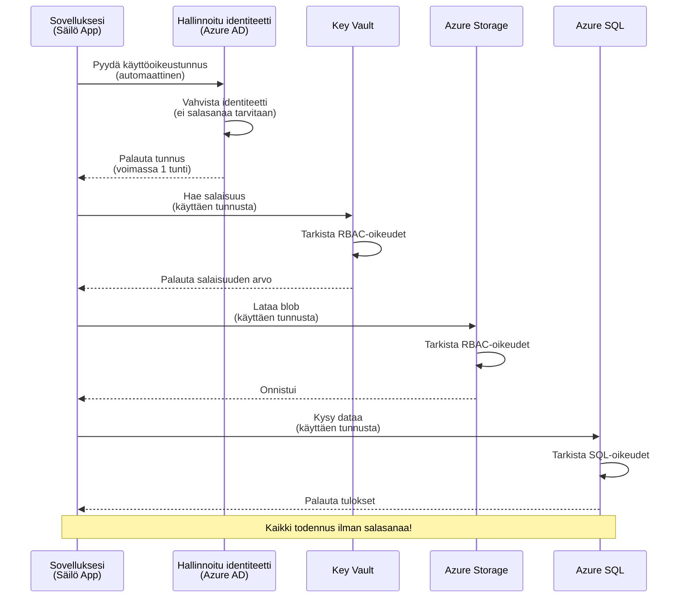
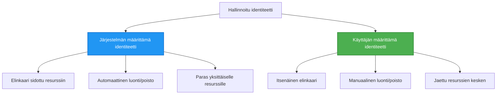

<!--
CO_OP_TRANSLATOR_METADATA:
{
  "original_hash": "e13ff6e1197e0a7462ed0aede7df9f23",
  "translation_date": "2025-11-21T19:31:25+00:00",
  "source_file": "docs/getting-started/authsecurity.md",
  "language_code": "fi"
}
-->
# Todennusmallit ja Hallittu Identiteetti

⏱️ **Arvioitu aika**: 45-60 minuuttia | 💰 **Kustannusvaikutus**: Ilmainen (ei lisämaksuja) | ⭐ **Vaikeustaso**: Keskitaso

**📚 Oppimispolku:**
- ← Edellinen: [Konfiguraation hallinta](configuration.md) - Ympäristömuuttujien ja salaisuuksien hallinta
- 🎯 **Olet täällä**: Todennus & Turvallisuus (Hallittu identiteetti, Key Vault, turvalliset käytännöt)
- → Seuraava: [Ensimmäinen projekti](first-project.md) - Rakenna ensimmäinen AZD-sovellus
- 🏠 [Kurssin etusivu](../../README.md)

---

## Mitä opit

Tämän oppitunnin suorittamalla:
- Ymmärrät Azure-todennusmallit (avaimet, yhteysmerkkijonot, hallittu identiteetti)
- Toteutat **Hallitun identiteetin** salasanattomaan todennukseen
- Suojaat salaisuudet **Azure Key Vault** -integraation avulla
- Konfiguroit **roolipohjaisen käyttöoikeuden hallinnan (RBAC)** AZD-järjestelmiin
- Sovellat turvallisuusparhaita käytäntöjä Container Apps -sovelluksissa ja Azure-palveluissa
- Siirryt avainpohjaisesta identiteettipohjaiseen todennukseen

## Miksi hallittu identiteetti on tärkeä

### Ongelma: Perinteinen todennus

**Ennen hallittua identiteettiä:**
```javascript
// ❌ TURVALLISUUSRISKI: Kovakoodatut salaisuudet koodissa
const connectionString = "Server=mydb.database.windows.net;User=admin;Password=P@ssw0rd123";
const storageKey = "xK7mN9pQ2wR5tY8uI0oP3aS6dF1gH4jK...";
const cosmosKey = "C2x7B9n4M1p8Q5w3E6r0T2y5U8i1O4p7...";
```

**Ongelmat:**
- 🔴 **Paljastuneet salaisuudet** koodissa, konfiguraatiotiedostoissa, ympäristömuuttujissa
- 🔴 **Tunnistetietojen kierrätys** vaatii koodimuutoksia ja uudelleenjulkaisua
- 🔴 **Auditointiongelmat** - kuka pääsi käsiksi mihin ja milloin?
- 🔴 **Hajautus** - salaisuudet hajallaan eri järjestelmissä
- 🔴 **Vaikeudet noudattaa säädöksiä** - ei läpäise turvallisuustarkastuksia

### Ratkaisu: Hallittu identiteetti

**Hallitun identiteetin jälkeen:**
```javascript
// ✅ TURVALLINEN: Ei salaisuuksia koodissa
const credential = new DefaultAzureCredential();
const client = new BlobServiceClient(
  "https://mystorageaccount.blob.core.windows.net",
  credential  // Azure hoitaa todennuksen automaattisesti
);
```

**Edut:**
- ✅ **Ei salaisuuksia** koodissa tai konfiguraatiossa
- ✅ **Automaattinen kierrätys** - Azure hoitaa sen
- ✅ **Täysi auditointijälki** Azure AD -lokitiedoissa
- ✅ **Keskitetty turvallisuus** - hallinta Azure-portaalissa
- ✅ **Säädösten mukainen** - täyttää turvallisuusstandardit

**Vertauskuva**: Perinteinen todennus on kuin kantaisit useita fyysisiä avaimia eri oville. Hallittu identiteetti on kuin turvamerkki, joka automaattisesti antaa pääsyn sen perusteella, kuka olet—ei avaimia, jotka voi kadottaa, kopioida tai kierrättää.

---

## Arkkitehtuurin yleiskatsaus

### Todennusvirta hallitulla identiteetillä


### Hallittujen identiteettien tyypit


| Ominaisuus | Järjestelmän määrittämä | Käyttäjän määrittämä |
|------------|-------------------------|----------------------|
| **Elinkaari** | Sidottu resurssiin | Itsenäinen |
| **Luominen** | Automaattinen resurssin kanssa | Manuaalinen luominen |
| **Poistaminen** | Poistetaan resurssin mukana | Säilyy resurssin poistamisen jälkeen |
| **Jakaminen** | Vain yksi resurssi | Useita resursseja |
| **Käyttötapaus** | Yksinkertaiset skenaariot | Monimutkaiset moniresurssiskenaariot |
| **AZD-oletus** | ✅ Suositeltu | Valinnainen |

---

## Esivaatimukset

### Tarvittavat työkalut

Sinulla pitäisi olla nämä asennettuna aiemmista oppitunneista:

```bash
# Vahvista Azure Developer CLI
azd version
# ✅ Odotettu: azd versio 1.0.0 tai uudempi

# Vahvista Azure CLI
az --version
# ✅ Odotettu: azure-cli 2.50.0 tai uudempi
```

### Azure-vaatimukset

- Aktiivinen Azure-tilaus
- Oikeudet:
  - Luoda hallittuja identiteettejä
  - Määrittää RBAC-rooleja
  - Luoda Key Vault -resursseja
  - Julkaista Container Apps -sovelluksia

### Tietovaatimukset

Sinun tulisi olla suorittanut:
- [Asennusopas](installation.md) - AZD-asennus
- [AZD-perusteet](azd-basics.md) - Peruskäsitteet
- [Konfiguraation hallinta](configuration.md) - Ympäristömuuttujat

---

## Oppitunti 1: Todennusmallien ymmärtäminen

### Malli 1: Yhteysmerkkijonot (Perinteinen - Vältä)

**Miten se toimii:**
```bash
# Yhteysmerkkijono sisältää tunnistetiedot
STORAGE_CONNECTION_STRING="DefaultEndpointsProtocol=https;AccountName=myaccount;AccountKey=xK7mN9pQ2wR5..."
COSMOS_CONNECTION_STRING="AccountEndpoint=https://myaccount.documents.azure.com:443/;AccountKey=C2x7..."
SQL_CONNECTION_STRING="Server=myserver.database.windows.net;User=admin;Password=P@ssw0rd..."
```

**Ongelmat:**
- ❌ Salaisuudet näkyvissä ympäristömuuttujissa
- ❌ Lokitetaan julkaisujärjestelmissä
- ❌ Vaikea kierrättää
- ❌ Ei auditointijälkeä pääsystä

**Milloin käyttää:** Vain paikallisessa kehityksessä, ei koskaan tuotannossa.

---

### Malli 2: Key Vault -viittaukset (Parempi)

**Miten se toimii:**
```bicep
// Store secret in Key Vault
resource keyVault 'Microsoft.KeyVault/vaults@2023-02-01' = {
  name: 'mykv'
  properties: {
    enableRbacAuthorization: true
  }
}

// Reference in Container App
env: [
  {
    name: 'STORAGE_KEY'
    secretRef: 'storage-key'  // References Key Vault
  }
]
```

**Edut:**
- ✅ Salaisuudet tallennetaan turvallisesti Key Vaultiin
- ✅ Keskitetty salaisuuksien hallinta
- ✅ Kierrätys ilman koodimuutoksia

**Rajoitukset:**
- ⚠️ Käytetään edelleen avaimia/salasanoja
- ⚠️ Key Vault -pääsyä täytyy hallita

**Milloin käyttää:** Siirtymävaihe yhteysmerkkijonoista hallittuun identiteettiin.

---

### Malli 3: Hallittu identiteetti (Paras käytäntö)

**Miten se toimii:**
```bicep
// Enable managed identity
resource containerApp 'Microsoft.App/containerApps@2023-05-01' = {
  name: 'myapp'
  identity: {
    type: 'SystemAssigned'  // Automatically creates identity
  }
}

// Grant permissions
resource roleAssignment 'Microsoft.Authorization/roleAssignments@2022-04-01' = {
  scope: storageAccount
  properties: {
    roleDefinitionId: storageBlobDataContributorRole
    principalId: containerApp.identity.principalId
  }
}
```

**Sovelluskoodi:**
```javascript
// Ei salaisuuksia tarvitaan!
const { DefaultAzureCredential } = require('@azure/identity');
const { BlobServiceClient } = require('@azure/storage-blob');

const credential = new DefaultAzureCredential();
const blobServiceClient = new BlobServiceClient(
  'https://mystorageaccount.blob.core.windows.net',
  credential
);
```

**Edut:**
- ✅ Ei salaisuuksia koodissa/konfiguraatiossa
- ✅ Automaattinen tunnistetietojen kierrätys
- ✅ Täysi auditointijälki
- ✅ RBAC-pohjaiset käyttöoikeudet
- ✅ Säädösten mukainen

**Milloin käyttää:** Aina, tuotantosovelluksissa.

---

## Oppitunti 2: Hallitun identiteetin toteuttaminen AZD:n avulla

### Vaiheittainen toteutus

Rakennetaan turvallinen Container App, joka käyttää hallittua identiteettiä Azure Storageen ja Key Vaultiin pääsyyn.

### Projektin rakenne

```
secure-app/
├── azure.yaml                 # AZD configuration
├── infra/
│   ├── main.bicep            # Main infrastructure
│   ├── core/
│   │   ├── identity.bicep    # Managed identity setup
│   │   ├── keyvault.bicep    # Key Vault configuration
│   │   └── storage.bicep     # Storage with RBAC
│   └── app/
│       └── container-app.bicep
└── src/
    ├── app.js                # Application code
    ├── package.json
    └── Dockerfile
```

### 1. Konfiguroi AZD (azure.yaml)

```yaml
name: secure-app
metadata:
  template: secure-app@1.0.0

services:
  api:
    project: ./src
    language: js
    host: containerapp

# Enable managed identity (AZD handles this automatically)
```

### 2. Infrastruktuuri: Ota hallittu identiteetti käyttöön

**Tiedosto: `infra/main.bicep`**

```bicep
targetScope = 'subscription'

param environmentName string
param location string = 'eastus'

var tags = { 'azd-env-name': environmentName }

// Resource group
resource rg 'Microsoft.Resources/resourceGroups@2021-04-01' = {
  name: 'rg-${environmentName}'
  location: location
  tags: tags
}

// Storage Account
module storage './core/storage.bicep' = {
  name: 'storage'
  scope: rg
  params: {
    name: 'st${uniqueString(rg.id)}'
    location: location
    tags: tags
  }
}

// Key Vault
module keyVault './core/keyvault.bicep' = {
  name: 'keyvault'
  scope: rg
  params: {
    name: 'kv-${uniqueString(rg.id)}'
    location: location
    tags: tags
  }
}

// Container App with Managed Identity
module containerApp './app/container-app.bicep' = {
  name: 'container-app'
  scope: rg
  params: {
    name: 'ca-${environmentName}'
    location: location
    tags: tags
    storageAccountName: storage.outputs.name
    keyVaultName: keyVault.outputs.name
  }
}

// Grant Container App access to Storage
module storageRoleAssignment './core/role-assignment.bicep' = {
  name: 'storage-role'
  scope: rg
  params: {
    principalId: containerApp.outputs.identityPrincipalId
    roleDefinitionId: 'ba92f5b4-2d11-453d-a403-e96b0029c9fe'  // Storage Blob Data Contributor
    targetResourceId: storage.outputs.id
  }
}

// Grant Container App access to Key Vault
module kvRoleAssignment './core/role-assignment.bicep' = {
  name: 'kv-role'
  scope: rg
  params: {
    principalId: containerApp.outputs.identityPrincipalId
    roleDefinitionId: '4633458b-17de-408a-b874-0445c86b69e6'  // Key Vault Secrets User
    targetResourceId: keyVault.outputs.id
  }
}

// Outputs
output AZURE_STORAGE_ACCOUNT_NAME string = storage.outputs.name
output AZURE_KEY_VAULT_NAME string = keyVault.outputs.name
output APP_URL string = containerApp.outputs.url
```

### 3. Container App järjestelmän määrittämällä identiteetillä

**Tiedosto: `infra/app/container-app.bicep`**

```bicep
param name string
param location string
param tags object = {}
param storageAccountName string
param keyVaultName string

resource containerApp 'Microsoft.App/containerApps@2023-05-01' = {
  name: name
  location: location
  tags: tags
  identity: {
    type: 'SystemAssigned'  // 🔑 Enable managed identity
  }
  properties: {
    configuration: {
      ingress: {
        external: true
        targetPort: 3000
      }
    }
    template: {
      containers: [
        {
          name: 'api'
          image: 'myregistry.azurecr.io/api:latest'
          resources: {
            cpu: json('0.5')
            memory: '1Gi'
          }
          env: [
            {
              name: 'AZURE_STORAGE_ACCOUNT_NAME'
              value: storageAccountName
            }
            {
              name: 'AZURE_KEY_VAULT_NAME'
              value: keyVaultName
            }
            // 🔑 No secrets - managed identity handles authentication!
          ]
        }
      ]
    }
  }
}

// Output the identity for RBAC assignments
output identityPrincipalId string = containerApp.identity.principalId
output id string = containerApp.id
output url string = 'https://${containerApp.properties.configuration.ingress.fqdn}'
```

### 4. RBAC-roolimääritysmoduuli

**Tiedosto: `infra/core/role-assignment.bicep`**

```bicep
param principalId string
param roleDefinitionId string  // Azure built-in role ID
param targetResourceId string

resource roleAssignment 'Microsoft.Authorization/roleAssignments@2022-04-01' = {
  name: guid(principalId, roleDefinitionId, targetResourceId)
  scope: resourceId('Microsoft.Resources/resourceGroups', resourceGroup().name)
  properties: {
    roleDefinitionId: subscriptionResourceId('Microsoft.Authorization/roleDefinitions', roleDefinitionId)
    principalId: principalId
    principalType: 'ServicePrincipal'
  }
}

output id string = roleAssignment.id
```

### 5. Sovelluskoodi hallitulla identiteetillä

**Tiedosto: `src/app.js`**

```javascript
const express = require('express');
const { DefaultAzureCredential } = require('@azure/identity');
const { BlobServiceClient } = require('@azure/storage-blob');
const { SecretClient } = require('@azure/keyvault-secrets');

const app = express();
const PORT = process.env.PORT || 3000;

// 🔑 Alusta tunnistetiedot (toimii automaattisesti hallitun identiteetin kanssa)
const credential = new DefaultAzureCredential();

// Azure Storage -asennus
const storageAccountName = process.env.AZURE_STORAGE_ACCOUNT_NAME;
const blobServiceClient = new BlobServiceClient(
  `https://${storageAccountName}.blob.core.windows.net`,
  credential  // Ei avaimia tarvittu!
);

// Key Vault -asennus
const keyVaultName = process.env.AZURE_KEY_VAULT_NAME;
const secretClient = new SecretClient(
  `https://${keyVaultName}.vault.azure.net`,
  credential  // Ei avaimia tarvittu!
);

// Terveystarkistus
app.get('/health', (req, res) => {
  res.json({ status: 'healthy', authentication: 'managed-identity' });
});

// Lataa tiedosto blob-tallennustilaan
app.post('/upload', async (req, res) => {
  try {
    const containerClient = blobServiceClient.getContainerClient('uploads');
    await containerClient.createIfNotExists();
    
    const blobName = `file-${Date.now()}.txt`;
    const blockBlobClient = containerClient.getBlockBlobClient(blobName);
    
    await blockBlobClient.upload('Hello from managed identity!', 30);
    
    res.json({
      success: true,
      blobName: blobName,
      message: 'File uploaded using managed identity!'
    });
  } catch (error) {
    console.error('Upload error:', error);
    res.status(500).json({ error: error.message });
  }
});

// Hae salaisuus Key Vaultista
app.get('/secret/:name', async (req, res) => {
  try {
    const secretName = req.params.name;
    const secret = await secretClient.getSecret(secretName);
    
    res.json({
      name: secretName,
      value: secret.value,
      message: 'Secret retrieved using managed identity!'
    });
  } catch (error) {
    console.error('Secret error:', error);
    res.status(500).json({ error: error.message });
  }
});

// Listaa blob-säiliöt (osoittaa lukuoikeuden)
app.get('/containers', async (req, res) => {
  try {
    const containers = [];
    for await (const container of blobServiceClient.listContainers()) {
      containers.push(container.name);
    }
    
    res.json({
      containers: containers,
      count: containers.length,
      message: 'Containers listed using managed identity!'
    });
  } catch (error) {
    console.error('List error:', error);
    res.status(500).json({ error: error.message });
  }
});

app.listen(PORT, () => {
  console.log(`Secure API listening on port ${PORT}`);
  console.log('Authentication: Managed Identity (passwordless)');
});
```

**Tiedosto: `src/package.json`**

```json
{
  "name": "secure-app",
  "version": "1.0.0",
  "dependencies": {
    "express": "^4.18.2",
    "@azure/identity": "^4.0.0",
    "@azure/storage-blob": "^12.17.0",
    "@azure/keyvault-secrets": "^4.7.0"
  },
  "scripts": {
    "start": "node app.js"
  }
}
```

### 6. Julkaise ja testaa

```bash
# Alusta AZD-ympäristö
azd init

# Ota käyttöön infrastruktuuri ja sovellus
azd up

# Hanki sovelluksen URL-osoite
APP_URL=$(azd env get-values | grep APP_URL | cut -d '=' -f2 | tr -d '"')

# Testaa terveystarkistus
curl $APP_URL/health
```

**✅ Odotettu tulos:**
```json
{
  "status": "healthy",
  "authentication": "managed-identity"
}
```

**Testaa blobin lataus:**
```bash
curl -X POST $APP_URL/upload
```

**✅ Odotettu tulos:**
```json
{
  "success": true,
  "blobName": "file-1700404800000.txt",
  "message": "File uploaded using managed identity!"
}
```

**Testaa säiliön listaus:**
```bash
curl $APP_URL/containers
```

**✅ Odotettu tulos:**
```json
{
  "containers": ["uploads"],
  "count": 1,
  "message": "Containers listed using managed identity!"
}
```

---

## Yleiset Azure RBAC-roolit

### Hallitun identiteetin sisäänrakennetut roolitunnukset

| Palvelu | Roolin nimi | Roolin tunnus | Oikeudet |
|---------|-------------|---------------|----------|
| **Storage** | Storage Blob Data Reader | `2a2b9908-6b94-4a3d-8e5a-a7d8f8cc8a12` | Lue blobit ja säiliöt |
| **Storage** | Storage Blob Data Contributor | `ba92f5b4-2d11-453d-a403-e96b0029c9fe` | Lue, kirjoita, poista blobit |
| **Storage** | Storage Queue Data Contributor | `974c5e8b-45b9-4653-ba55-5f855dd0fb88` | Lue, kirjoita, poista jonoviestit |
| **Key Vault** | Key Vault Secrets User | `4633458b-17de-408a-b874-0445c86b69e6` | Lue salaisuudet |
| **Key Vault** | Key Vault Secrets Officer | `b86a8fe4-44ce-4948-aee5-eccb2c155cd7` | Lue, kirjoita, poista salaisuudet |
| **Cosmos DB** | Cosmos DB Built-in Data Reader | `00000000-0000-0000-0000-000000000001` | Lue Cosmos DB -data |
| **Cosmos DB** | Cosmos DB Built-in Data Contributor | `00000000-0000-0000-0000-000000000002` | Lue, kirjoita Cosmos DB -data |
| **SQL Database** | SQL DB Contributor | `9b7fa17d-e63e-47b0-bb0a-15c516ac86ec` | Hallitse SQL-tietokantoja |
| **Service Bus** | Azure Service Bus Data Owner | `090c5cfd-751d-490a-894a-3ce6f1109419` | Lähetä, vastaanota, hallitse viestejä |

### Miten löytää roolitunnukset

```bash
# Luettele kaikki sisäänrakennetut roolit
az role definition list --query "[].{Name:roleName, ID:name}" --output table

# Etsi tiettyä roolia
az role definition list --query "[?contains(roleName, 'Storage Blob')].{Name:roleName, ID:name}" --output table

# Hae roolin tiedot
az role definition list --name "Storage Blob Data Contributor"
```

---

## Käytännön harjoitukset

### Harjoitus 1: Ota hallittu identiteetti käyttöön olemassa olevassa sovelluksessa ⭐⭐ (Keskitaso)

**Tavoite**: Lisää hallittu identiteetti olemassa olevaan Container App -julkaisuun

**Skenaario**: Sinulla on Container App, joka käyttää yhteysmerkkijonoja. Muunna se hallittuun identiteettiin.

**Lähtökohta**: Container App, jossa on tämä konfiguraatio:

```bicep
// ❌ Current: Using connection string
env: [
  {
    name: 'STORAGE_CONNECTION_STRING'
    secretRef: 'storage-connection'
  }
]
```

**Vaiheet**:

1. **Ota hallittu identiteetti käyttöön Bicepissä:**

```bicep
resource containerApp 'Microsoft.App/containerApps@2023-05-01' = {
  name: 'myapp'
  identity: {
    type: 'SystemAssigned'  // Add this
  }
  // ... rest of configuration
}
```

2. **Anna Storage-pääsy:**

```bicep
// Get storage account reference
resource storageAccount 'Microsoft.Storage/storageAccounts@2023-01-01' existing = {
  name: storageAccountName
}

// Assign role
resource roleAssignment 'Microsoft.Authorization/roleAssignments@2022-04-01' = {
  name: guid(containerApp.id, 'ba92f5b4-2d11-453d-a403-e96b0029c9fe', storageAccount.id)
  scope: storageAccount
  properties: {
    roleDefinitionId: subscriptionResourceId('Microsoft.Authorization/roleDefinitions', 'ba92f5b4-2d11-453d-a403-e96b0029c9fe')
    principalId: containerApp.identity.principalId
    principalType: 'ServicePrincipal'
  }
}
```

3. **Päivitä sovelluskoodi:**

**Ennen (yhteysmerkkijono):**
```javascript
const { BlobServiceClient } = require('@azure/storage-blob');

const blobServiceClient = BlobServiceClient.fromConnectionString(
  process.env.STORAGE_CONNECTION_STRING
);
```

**Jälkeen (hallittu identiteetti):**
```javascript
const { DefaultAzureCredential } = require('@azure/identity');
const { BlobServiceClient } = require('@azure/storage-blob');

const credential = new DefaultAzureCredential();
const blobServiceClient = new BlobServiceClient(
  `https://${process.env.STORAGE_ACCOUNT_NAME}.blob.core.windows.net`,
  credential
);
```

4. **Päivitä ympäristömuuttujat:**

```bicep
env: [
  {
    name: 'STORAGE_ACCOUNT_NAME'
    value: storageAccountName  // Just the name, no secrets!
  }
  // Remove STORAGE_CONNECTION_STRING
]
```

5. **Julkaise ja testaa:**

```bash
# Uudelleenkäynnistä
azd up

# Testaa, että se toimii edelleen
curl https://myapp.azurecontainerapps.io/upload
```

**✅ Onnistumiskriteerit:**
- ✅ Sovellus julkaistaan ilman virheitä
- ✅ Storage-toiminnot toimivat (lataus, listaus, lataus)
- ✅ Ei yhteysmerkkijonoja ympäristömuuttujissa
- ✅ Identiteetti näkyy Azure-portaalissa "Identity"-osiossa

**Varmistus:**

```bash
# Tarkista, että hallittu identiteetti on käytössä
az containerapp show \
  --name myapp \
  --resource-group rg-myapp \
  --query "identity.type"
# ✅ Odotettu: "SystemAssigned"

# Tarkista roolin määritys
az role assignment list \
  --assignee $(az containerapp show --name myapp --resource-group rg-myapp --query "identity.principalId" -o tsv) \
  --scope /subscriptions/{sub-id}/resourceGroups/rg-myapp/providers/Microsoft.Storage/storageAccounts/mystorageaccount
# ✅ Odotettu: Näyttää roolin "Storage Blob Data Contributor"
```

**Aika**: 20-30 minuuttia

---

### Harjoitus 2: Monipalvelupääsy käyttäjän määrittämällä identiteetillä ⭐⭐⭐ (Edistynyt)

**Tavoite**: Luo käyttäjän määrittämä identiteetti, jota jaetaan useiden Container App -sovellusten kesken

**Skenaario**: Sinulla on 3 mikropalvelua, jotka kaikki tarvitsevat pääsyn samaan Storage-tiliin ja Key Vaultiin.

**Vaiheet**:

1. **Luo käyttäjän määrittämä identiteetti:**

**Tiedosto: `infra/core/identity.bicep`**

```bicep
param name string
param location string
param tags object = {}

resource userAssignedIdentity 'Microsoft.ManagedIdentity/userAssignedIdentities@2023-01-31' = {
  name: name
  location: location
  tags: tags
}

output id string = userAssignedIdentity.id
output principalId string = userAssignedIdentity.properties.principalId
output clientId string = userAssignedIdentity.properties.clientId
```

2. **Määritä roolit käyttäjän määritetylle identiteetille:**

```bicep
// In main.bicep
module userIdentity './core/identity.bicep' = {
  name: 'user-identity'
  scope: rg
  params: {
    name: 'id-${environmentName}'
    location: location
    tags: tags
  }
}

// Grant Storage access
resource storageRoleAssignment 'Microsoft.Authorization/roleAssignments@2022-04-01' = {
  name: guid(userIdentity.outputs.principalId, 'storage-contributor')
  scope: storageAccount
  properties: {
    roleDefinitionId: subscriptionResourceId('Microsoft.Authorization/roleDefinitions', 'ba92f5b4-2d11-453d-a403-e96b0029c9fe')
    principalId: userIdentity.outputs.principalId
    principalType: 'ServicePrincipal'
  }
}

// Grant Key Vault access
resource kvRoleAssignment 'Microsoft.Authorization/roleAssignments@2022-04-01' = {
  name: guid(userIdentity.outputs.principalId, 'kv-secrets-user')
  scope: keyVault
  properties: {
    roleDefinitionId: subscriptionResourceId('Microsoft.Authorization/roleDefinitions', '4633458b-17de-408a-b874-0445c86b69e6')
    principalId: userIdentity.outputs.principalId
    principalType: 'ServicePrincipal'
  }
}
```

3. **Määritä identiteetti useille Container App -sovelluksille:**

```bicep
resource apiGateway 'Microsoft.App/containerApps@2023-05-01' = {
  name: 'api-gateway'
  identity: {
    type: 'UserAssigned'
    userAssignedIdentities: {
      '${userIdentity.outputs.id}': {}
    }
  }
  // ... rest of config
}

resource productService 'Microsoft.App/containerApps@2023-05-01' = {
  name: 'product-service'
  identity: {
    type: 'UserAssigned'
    userAssignedIdentities: {
      '${userIdentity.outputs.id}': {}
    }
  }
  // ... rest of config
}

resource orderService 'Microsoft.App/containerApps@2023-05-01' = {
  name: 'order-service'
  identity: {
    type: 'UserAssigned'
    userAssignedIdentities: {
      '${userIdentity.outputs.id}': {}
    }
  }
  // ... rest of config
}
```

4. **Sovelluskoodi (kaikki palvelut käyttävät samaa mallia):**

```javascript
const { DefaultAzureCredential, ManagedIdentityCredential } = require('@azure/identity');

// Käyttäjän määrittämälle identiteetille, määritä asiakastunnus
const credential = new ManagedIdentityCredential(
  process.env.AZURE_CLIENT_ID  // Käyttäjän määrittämän identiteetin asiakastunnus
);

// Tai käytä DefaultAzureCredential (tunnistaa automaattisesti)
const credential = new DefaultAzureCredential();

const blobServiceClient = new BlobServiceClient(
  `https://${process.env.STORAGE_ACCOUNT_NAME}.blob.core.windows.net`,
  credential
);
```

5. **Julkaise ja varmista:**

```bash
azd up

# Testaa, että kaikki palvelut voivat käyttää tallennustilaa
curl https://api-gateway.azurecontainerapps.io/upload
curl https://product-service.azurecontainerapps.io/upload
curl https://order-service.azurecontainerapps.io/upload
```

**✅ Onnistumiskriteerit:**
- ✅ Yksi identiteetti jaettu 3 palvelun kesken
- ✅ Kaikki palvelut pääsevät Storageen ja Key Vaultiin
- ✅ Identiteetti säilyy, vaikka yksi palvelu poistetaan
- ✅ Keskitetty käyttöoikeuksien hallinta

**Käyttäjän määritetyn identiteetin edut:**
- Yksi identiteetti hallittavaksi
- Johdonmukaiset käyttöoikeudet palveluiden välillä
- Säilyy palvelun poistamisen jälkeen
- Parempi monimutkaisille arkkitehtuureille

**Aika**: 30-40 minuuttia

---

### Harjoitus 3: Toteuta Key Vault -salaisuuksien kierrätys ⭐⭐⭐ (Edistynyt)

**Tavoite**: Tallenna kolmannen osapuolen API-avaimet Key Vaultiin ja käytä niitä hallitun identiteetin avulla

**Skenaario**: Sovelluksesi tarvitsee kutsua ulkoista APIa (OpenAI, Stripe, SendGrid), joka vaatii API-avaimia.

**Vaiheet**:

1. **Luo Key Vault RBAC:llä:**

**Tiedosto: `infra/core/keyvault.bicep`**

```bicep
param name string
param location string
param tags object = {}

resource keyVault 'Microsoft.KeyVault/vaults@2023-02-01' = {
  name: name
  location: location
  tags: tags
  properties: {
    enableRbacAuthorization: true  // Use RBAC instead of access policies
    sku: {
      family: 'A'
      name: 'standard'
    }
    tenantId: subscription().tenantId
    enableSoftDelete: true
    softDeleteRetentionInDays: 90
  }
}

// Allow Container App to read secrets
output id string = keyVault.id
output name string = keyVault.name
output uri string = keyVault.properties.vaultUri
```

2. **Tallenna salaisuudet Key Vaultiin:**

```bash
# Hanki Key Vault -nimi
KV_NAME=$(azd env get-values | grep AZURE_KEY_VAULT_NAME | cut -d '=' -f2 | tr -d '"')

# Tallenna kolmannen osapuolen API-avaimet
az keyvault secret set \
  --vault-name $KV_NAME \
  --name "OpenAI-ApiKey" \
  --value "sk-proj-xxxxxxxxxxxxx"

az keyvault secret set \
  --vault-name $KV_NAME \
  --name "Stripe-ApiKey" \
  --value "sk_live_xxxxxxxxxxxxx"

az keyvault secret set \
  --vault-name $KV_NAME \
  --name "SendGrid-ApiKey" \
  --value "SG.xxxxxxxxxxxxx"
```

3. **Sovelluskoodi salaisuuksien hakemiseen:**

**Tiedosto: `src/config.js`**

```javascript
const { DefaultAzureCredential } = require('@azure/identity');
const { SecretClient } = require('@azure/keyvault-secrets');

class Config {
  constructor() {
    this.credential = new DefaultAzureCredential();
    this.secretClient = new SecretClient(
      `https://${process.env.AZURE_KEY_VAULT_NAME}.vault.azure.net`,
      this.credential
    );
    this.cache = {};
  }

  async getSecret(secretName) {
    // Tarkista välimuisti ensin
    if (this.cache[secretName]) {
      return this.cache[secretName];
    }

    try {
      const secret = await this.secretClient.getSecret(secretName);
      this.cache[secretName] = secret.value;
      console.log(`✅ Retrieved secret: ${secretName}`);
      return secret.value;
    } catch (error) {
      console.error(`❌ Failed to get secret ${secretName}:`, error.message);
      throw error;
    }
  }

  async getOpenAIKey() {
    return this.getSecret('OpenAI-ApiKey');
  }

  async getStripeKey() {
    return this.getSecret('Stripe-ApiKey');
  }

  async getSendGridKey() {
    return this.getSecret('SendGrid-ApiKey');
  }
}

module.exports = new Config();
```

4. **Käytä salaisuuksia sovelluksessa:**

**Tiedosto: `src/app.js`**

```javascript
const express = require('express');
const config = require('./config');
const { OpenAI } = require('openai');

const app = express();

// Alusta OpenAI avaimella Key Vaultista
let openaiClient;

async function initializeServices() {
  const openaiKey = await config.getOpenAIKey();
  openaiClient = new OpenAI({ apiKey: openaiKey });
  console.log('✅ Services initialized with secrets from Key Vault');
}

// Kutsu käynnistyksen yhteydessä
initializeServices().catch(console.error);

app.post('/chat', async (req, res) => {
  try {
    const completion = await openaiClient.chat.completions.create({
      model: 'gpt-4',
      messages: [{ role: 'user', content: 'Hello!' }]
    });
    
    res.json({
      response: completion.choices[0].message.content,
      authentication: 'Key from Key Vault via Managed Identity'
    });
  } catch (error) {
    res.status(500).json({ error: error.message });
  }
});

app.listen(3000, () => {
  console.log('Secure API with Key Vault integration running');
});
```

5. **Julkaise ja testaa:**

```bash
azd up

# Testaa, että API-avaimet toimivat
curl -X POST https://myapp.azurecontainerapps.io/chat \
  -H "Content-Type: application/json" \
  -d '{"message":"Hello AI"}'
```

**✅ Onnistumiskriteerit:**
- ✅ Ei API-avaimia koodissa tai ympäristömuuttujissa
- ✅ Sovellus hakee avaimet Key Vaultista
- ✅ Kolmannen osapuolen API:t toimivat oikein
- ✅ Voit kierrättää avaimet ilman koodimuutoksia

**Kierrätä salaisuus:**

```bash
# Päivitä salaisuus Key Vaultissa
az keyvault secret set \
  --vault-name $KV_NAME \
  --name "OpenAI-ApiKey" \
  --value "sk-proj-NEW_KEY_HERE"

# Käynnistä sovellus uudelleen, jotta uusi avain otetaan käyttöön
az containerapp revision restart \
  --name myapp \
  --resource-group rg-myapp
```

**Aika**: 25-35 minuuttia

---

## Tietojen tarkistuspiste

### 1. Todennusmallit ✓

Testaa ymmärryksesi:

- [ ] **K1**: Mitkä ovat kolme pääasiallista todennusmallia? 
  - **V**: Yhteysmerkkijonot (perinteinen), Key Vault -viittaukset (siirtymä), Hallittu identiteetti (paras)

- [ ] **K2**: Miksi hallittu identiteetti on parempi kuin yhteysmerkkijonot?
  - **V**: Ei salaisuuksia koodissa, automaattinen kierrätys, täysi auditointijälki, RBAC-oikeudet

- [ ] **K3**: Milloin käyttäisit käyttäjän määrittämää identiteettiä järjestelmän määrittämän sijaan?
  - **V**: Kun identiteetti jaetaan useiden resurssien kesken tai kun identiteetin elinkaari on riippumaton resurssin elinkaaresta

**Käytännön varmennus:**
```bash
# Tarkista, mitä identiteettityyppiä sovelluksesi käyttää
az containerapp show \
  --name myapp \
  --resource-group rg-myapp \
  --query "identity.type"

# Luettele kaikki identiteetin roolimäärittelyt
az role assignment list \
  --assignee $(az containerapp show --name myapp --resource-group rg-myapp --query "identity.principalId" -o tsv)
```

---

### 2. RBAC ja käyttöoikeudet ✓

Testaa ymmärryksesi:

- [ ] **K1**: Mikä on "Storage Blob Data Contributor" -roolin tunnus?
  - **V**: `ba92f5b4-2d11-453d-a403-e96b0029c9fe`

- [ ] **K2**: Mitä oikeuksia "Key Vault Secrets User" tarjoaa?
  - **V**: Vain lukuoikeus salaisuuksiin (ei voi luoda, päivittää tai poistaa)

- [ ] **K3**: Miten annat Container App -sovellukselle pääsyn Azure SQL:ään?
  - **V**: Määritä "SQL DB Contributor" -rooli tai konfiguroi Azure AD -todennus SQL:lle

**Käytännön varmennus:**
```bash
# Etsi tietty rooli
az role definition list --name "Storage Blob Data Contributor"

# Tarkista, mitkä roolit on määritetty identiteetillesi
PRINCIPAL_ID=$(az containerapp show --name myapp --resource-group rg-myapp --query "identity.principalId" -o tsv)
az role assignment list --assignee $PRINCIPAL_ID --output table
```

---

### 3. Key Vault -integraatio ✓

Testaa ymmärryksesi:
- [ ] **K1**: Kuinka otat RBAC:n käyttöön Key Vaultissa sen sijaan, että käyttäisit käyttöoikeuskäytäntöjä?
  - **V**: Aseta `enableRbacAuthorization: true` Bicepissa

- [ ] **K2**: Mikä Azure SDK -kirjasto käsittelee hallitun identiteetin autentikointia?
  - **V**: `@azure/identity` ja `DefaultAzureCredential`-luokka

- [ ] **K3**: Kuinka kauan Key Vault -salaisuudet pysyvät välimuistissa?
  - **V**: Sovelluksesta riippuen; toteuta oma välimuististrategia

**Käytännön vahvistus:**
```bash
# Testaa Key Vault -pääsyä
az keyvault secret show \
  --vault-name $KV_NAME \
  --name "OpenAI-ApiKey" \
  --query "value"

# Tarkista, että RBAC on käytössä
az keyvault show \
  --name $KV_NAME \
  --query "properties.enableRbacAuthorization"
# ✅ Odotettu: tosi
```

---

## Tietoturvan parhaat käytännöt

### ✅ TEE:

1. **Käytä aina hallittua identiteettiä tuotannossa**
   ```bicep
   identity: {
     type: 'SystemAssigned'
   }
   ```

2. **Käytä vähimmäisoikeuksien RBAC-rooleja**
   - Käytä "Reader"-rooleja, kun mahdollista
   - Vältä "Owner"- tai "Contributor"-rooleja, ellei välttämätöntä

3. **Tallenna kolmannen osapuolen avaimet Key Vaultiin**
   ```javascript
   const apiKey = await secretClient.getSecret('ThirdPartyApiKey');
   ```

4. **Ota auditointiloki käyttöön**
   ```bicep
   diagnosticSettings: {
     logs: [{ category: 'AuditEvent', enabled: true }]
   }
   ```

5. **Käytä eri identiteettejä kehitys-, testaus- ja tuotantoympäristöissä**
   ```bash
   azd env new dev
   azd env new staging
   azd env new prod
   ```

6. **Kierrätä salaisuudet säännöllisesti**
   - Aseta vanhenemispäivät Key Vault -salaisuuksille
   - Automatisoi kierrätys Azure Functionsilla

### ❌ ÄLÄ:

1. **Älä koskaan kovakoodaa salaisuuksia**
   ```javascript
   // ❌ HUONO
   const apiKey = "sk-proj-xxxxxxxxxxxxx";
   ```

2. **Älä käytä yhteysmerkkijonoja tuotannossa**
   ```javascript
   // ❌ HUONO
   BlobServiceClient.fromConnectionString(process.env.STORAGE_CONNECTION_STRING)
   ```

3. **Älä myönnä liiallisia käyttöoikeuksia**
   ```bicep
   // ❌ BAD - too much access
   roleDefinitionId: 'Owner'
   
   // ✅ GOOD - least privilege
   roleDefinitionId: 'Storage Blob Data Reader'
   ```

4. **Älä kirjaa salaisuuksia**
   ```javascript
   // ❌ HUONO
   console.log('API Key:', apiKey);
   
   // ✅ HYVÄ
   console.log('API Key retrieved successfully');
   ```

5. **Älä jaa tuotantoidentiteettejä eri ympäristöjen välillä**
   ```bicep
   // ❌ BAD - same identity for dev and prod
   // ✅ GOOD - separate identities per environment
   ```

---

## Vianmääritysopas

### Ongelma: "Unauthorized" Azure Storageen pääsyssä

**Oireet:**
```
Error: Unauthorized (403)
AuthorizationPermissionMismatch: This request is not authorized to perform this operation
```

**Diagnoosi:**

```bash
# Tarkista, onko hallittu identiteetti käytössä
az containerapp show \
  --name myapp \
  --resource-group rg-myapp \
  --query "identity.type"
# ✅ Odotettu: "SystemAssigned" tai "UserAssigned"

# Tarkista roolimääritykset
PRINCIPAL_ID=$(az containerapp show --name myapp --resource-group rg-myapp --query "identity.principalId" -o tsv)
az role assignment list --assignee $PRINCIPAL_ID

# Odotettu: Pitäisi nähdä "Storage Blob Data Contributor" tai vastaava rooli
```

**Ratkaisut:**

1. **Myönnä oikea RBAC-rooli:**
```bash
STORAGE_ID=$(az storage account show --name mystorageaccount --resource-group rg-myapp --query "id" -o tsv)
az role assignment create \
  --assignee $PRINCIPAL_ID \
  --role "Storage Blob Data Contributor" \
  --scope $STORAGE_ID
```

2. **Odota propagointia (voi kestää 5–10 minuuttia):**
```bash
# Tarkista roolin määrityksen tila
az role assignment list --assignee $PRINCIPAL_ID --scope $STORAGE_ID
```

3. **Varmista, että sovelluskoodi käyttää oikeaa tunnistetta:**
```javascript
// Varmista, että käytät DefaultAzureCredentialia
const credential = new DefaultAzureCredential();
```

---

### Ongelma: Key Vault -pääsy estetty

**Oireet:**
```
Error: Forbidden (403)
The user, group or application does not have secrets get permission
```

**Diagnoosi:**

```bash
# Tarkista, että Key Vault RBAC on käytössä
az keyvault show \
  --name $KV_NAME \
  --query "properties.enableRbacAuthorization"
# ✅ Odotettu: tosi

# Tarkista roolimäärittelyt
az role assignment list \
  --assignee $PRINCIPAL_ID \
  --scope /subscriptions/{sub-id}/resourceGroups/rg-myapp/providers/Microsoft.KeyVault/vaults/$KV_NAME
```

**Ratkaisut:**

1. **Ota RBAC käyttöön Key Vaultissa:**
```bash
az keyvault update \
  --name $KV_NAME \
  --enable-rbac-authorization true
```

2. **Myönnä Key Vault Secrets User -rooli:**
```bash
KV_ID=$(az keyvault show --name $KV_NAME --query "id" -o tsv)
az role assignment create \
  --assignee $PRINCIPAL_ID \
  --role "Key Vault Secrets User" \
  --scope $KV_ID
```

---

### Ongelma: DefaultAzureCredential epäonnistuu paikallisesti

**Oireet:**
```
Error: DefaultAzureCredential failed to retrieve a token
CredentialUnavailableError: No credential available
```

**Diagnoosi:**

```bash
# Tarkista, oletko kirjautunut sisään
az account show

# Tarkista Azure CLI -autentikointi
az ad signed-in-user show
```

**Ratkaisut:**

1. **Kirjaudu Azure CLI:hen:**
```bash
az login
```

2. **Aseta Azure-tilaus:**
```bash
az account set --subscription "Your Subscription Name"
```

3. **Paikallista kehitystä varten käytä ympäristömuuttujia:**
```bash
export AZURE_TENANT_ID="your-tenant-id"
export AZURE_CLIENT_ID="your-client-id"
export AZURE_CLIENT_SECRET="your-client-secret"
```

4. **Tai käytä eri tunnistetta paikallisesti:**
```javascript
const { DefaultAzureCredential, AzureCliCredential } = require('@azure/identity');

// Käytä AzureCliCredentialia paikalliseen kehitykseen
const credential = process.env.NODE_ENV === 'production' 
  ? new DefaultAzureCredential()
  : new AzureCliCredential();
```

---

### Ongelma: Roolin määritys vie liian kauan propagointiin

**Oireet:**
- Rooli määritetty onnistuneesti
- Silti 403-virheitä
- Vaihteleva pääsy (toimii joskus, joskus ei)

**Selitys:**
Azure RBAC -muutosten propagointi voi kestää 5–10 minuuttia maailmanlaajuisesti.

**Ratkaisu:**

```bash
# Odota ja yritä uudelleen
echo "Waiting for RBAC propagation..."
sleep 300  # Odota 5 minuuttia

# Testaa pääsy
curl https://myapp.azurecontainerapps.io/upload

# Jos epäonnistuu edelleen, käynnistä sovellus uudelleen
az containerapp revision restart \
  --name myapp \
  --resource-group rg-myapp
```

---

## Kustannusnäkökohdat

### Hallitun identiteetin kustannukset

| Resurssi | Kustannus |
|----------|-----------|
| **Hallitut identiteetit** | 🆓 **ILMAINEN** - Ei veloitusta |
| **RBAC-roolimääritykset** | 🆓 **ILMAINEN** - Ei veloitusta |
| **Azure AD -tunnuspyynnöt** | 🆓 **ILMAINEN** - Sisältyy |
| **Key Vault -toiminnot** | $0.03 per 10,000 toimintoa |
| **Key Vault -tallennus** | $0.024 per salaisuus kuukaudessa |

**Hallitut identiteetit säästävät rahaa:**
- ✅ Poistamalla Key Vault -toiminnot palveluiden välisessä autentikoinnissa
- ✅ Vähentämällä tietoturvaongelmia (ei vuotaneita tunnuksia)
- ✅ Vähentämällä operatiivista taakkaa (ei manuaalista kierrätystä)

**Esimerkki kustannusvertailusta (kuukausittain):**

| Skenaario | Yhteysmerkkijonot | Hallittu identiteetti | Säästöt |
|-----------|-------------------|-----------------------|---------|
| Pieni sovellus (1M pyyntöä) | ~$50 (Key Vault + toiminnot) | ~$0 | $50/kuukausi |
| Keskisuuri sovellus (10M pyyntöä) | ~$200 | ~$0 | $200/kuukausi |
| Suuri sovellus (100M pyyntöä) | ~$1,500 | ~$0 | $1,500/kuukausi |

---

## Lisätietoja

### Virallinen dokumentaatio
- [Azure Managed Identity](https://learn.microsoft.com/entra/identity/managed-identities-azure-resources/overview)
- [Azure RBAC](https://learn.microsoft.com/azure/role-based-access-control/overview)
- [Azure Key Vault](https://learn.microsoft.com/azure/key-vault/general/overview)
- [DefaultAzureCredential](https://learn.microsoft.com/dotnet/api/azure.identity.defaultazurecredential)

### SDK-dokumentaatio
- [@azure/identity (Node.js)](https://www.npmjs.com/package/@azure/identity)
- [Azure.Identity (C#)](https://www.nuget.org/packages/Azure.Identity/)
- [azure-identity (Python)](https://pypi.org/project/azure-identity/)

### Seuraavat askeleet tässä kurssissa
- ← Edellinen: [Konfiguraation hallinta](configuration.md)
- → Seuraava: [Ensimmäinen projekti](first-project.md)
- 🏠 [Kurssin etusivu](../../README.md)

### Liittyvät esimerkit
- [Azure OpenAI Chat -esimerkki](../../../../examples/azure-openai-chat) - Käyttää hallittua identiteettiä Azure OpenAI:ssa
- [Mikropalveluesimerkki](../../../../examples/microservices) - Monipalveluiden autentikointimallit

---

## Yhteenveto

**Olet oppinut:**
- ✅ Kolme autentikointimallia (yhteysmerkkijonot, Key Vault, hallittu identiteetti)
- ✅ Kuinka ottaa käyttöön ja konfiguroida hallittu identiteetti AZD:ssä
- ✅ RBAC-roolimääritykset Azure-palveluille
- ✅ Key Vault -integraatio kolmannen osapuolen salaisuuksille
- ✅ Käyttäjäkohtaiset vs järjestelmäkohtaiset identiteetit
- ✅ Tietoturvan parhaat käytännöt ja vianmääritys

**Keskeiset asiat:**
1. **Käytä aina hallittua identiteettiä tuotannossa** - Ei salaisuuksia, automaattinen kierrätys
2. **Käytä vähimmäisoikeuksien RBAC-rooleja** - Myönnä vain tarvittavat käyttöoikeudet
3. **Tallenna kolmannen osapuolen avaimet Key Vaultiin** - Keskitetty salaisuuksien hallinta
4. **Erota identiteetit ympäristöjen mukaan** - Kehitys-, testaus- ja tuotantoympäristöjen eristys
5. **Ota auditointiloki käyttöön** - Seuraa, kuka pääsi mihin

**Seuraavat askeleet:**
1. Suorita yllä olevat käytännön harjoitukset
2. Siirrä olemassa oleva sovellus yhteysmerkkijonoista hallittuun identiteettiin
3. Rakenna ensimmäinen AZD-projektisi tietoturva huomioiden alusta alkaen: [Ensimmäinen projekti](first-project.md)

---

<!-- CO-OP TRANSLATOR DISCLAIMER START -->
**Vastuuvapauslauseke**:  
Tämä asiakirja on käännetty käyttämällä tekoälypohjaista käännöspalvelua [Co-op Translator](https://github.com/Azure/co-op-translator). Vaikka pyrimme tarkkuuteen, huomioithan, että automaattiset käännökset voivat sisältää virheitä tai epätarkkuuksia. Alkuperäinen asiakirja sen alkuperäisellä kielellä tulisi katsoa ensisijaiseksi lähteeksi. Tärkeissä tiedoissa suositellaan ammattimaista ihmiskäännöstä. Emme ole vastuussa väärinkäsityksistä tai virhetulkinnoista, jotka johtuvat tämän käännöksen käytöstä.
<!-- CO-OP TRANSLATOR DISCLAIMER END -->