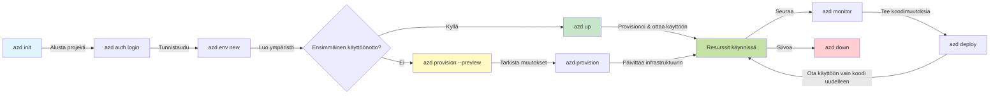
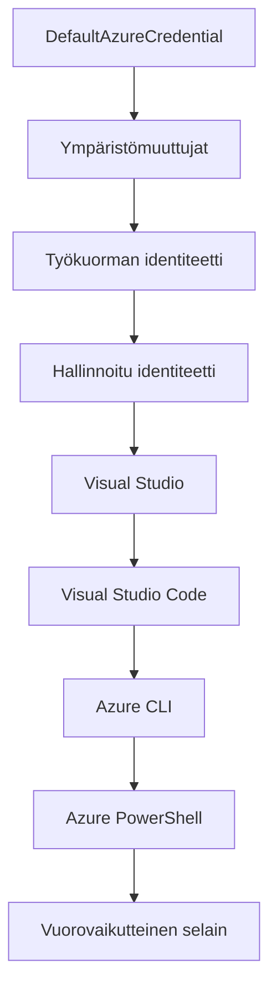

<!--
CO_OP_TRANSLATOR_METADATA:
{
  "original_hash": "e855e899d2705754fe85b04190edd0f0",
  "translation_date": "2025-11-21T16:00:29+00:00",
  "source_file": "docs/getting-started/azd-basics.md",
  "language_code": "fi"
}
-->
# AZD Perusteet - Ymmärrä Azure Developer CLI

# AZD Perusteet - Keskeiset käsitteet ja perusteet

**Luvun navigointi:**
- **📚 Kurssin etusivu**: [AZD Aloittelijoille](../../README.md)
- **📖 Nykyinen luku**: Luku 1 - Perusta & Pika-aloitus
- **⬅️ Edellinen**: [Kurssin yleiskatsaus](../../README.md#-chapter-1-foundation--quick-start)
- **➡️ Seuraava**: [Asennus & Määritys](installation.md)
- **🚀 Seuraava luku**: [Luku 2: AI-Ensisijainen Kehitys](../microsoft-foundry/microsoft-foundry-integration.md)

## Johdanto

Tässä oppitunnissa tutustut Azure Developer CLI:hin (azd), tehokkaaseen komentorivityökaluun, joka nopeuttaa siirtymistä paikallisesta kehityksestä Azure-julkaisuun. Opit peruskäsitteet, keskeiset ominaisuudet ja ymmärrät, miten azd yksinkertaistaa pilvinatiivien sovellusten käyttöönottoa.

## Oppimistavoitteet

Tämän oppitunnin lopussa:
- Ymmärrät, mikä Azure Developer CLI on ja sen ensisijaisen tarkoituksen
- Opit peruskäsitteet, kuten mallit, ympäristöt ja palvelut
- Tutustut keskeisiin ominaisuuksiin, kuten mallipohjaiseen kehitykseen ja Infrastructure as Code -lähestymistapaan
- Ymmärrät azd-projektin rakenteen ja työnkulun
- Olet valmis asentamaan ja määrittämään azd:n kehitysympäristöösi

## Oppimistulokset

Oppitunnin suorittamisen jälkeen osaat:
- Selittää azd:n roolin modernissa pilvikehityksen työnkulussa
- Tunnistaa azd-projektin rakenteen osat
- Kuvata, miten mallit, ympäristöt ja palvelut toimivat yhdessä
- Ymmärtää Infrastructure as Code -lähestymistavan hyödyt azd:n avulla
- Tunnistaa erilaisia azd-komentoja ja niiden tarkoitukset

## Mikä on Azure Developer CLI (azd)?

Azure Developer CLI (azd) on komentorivityökalu, joka on suunniteltu nopeuttamaan siirtymistä paikallisesta kehityksestä Azure-julkaisuun. Se yksinkertaistaa pilvinatiivien sovellusten rakentamista, käyttöönottoa ja hallintaa Azure-alustalla.

### 🎯 Miksi käyttää AZD:tä? Todellinen vertailu

Vertailkaamme yksinkertaisen verkkosovelluksen käyttöönottoa tietokannan kanssa:

#### ❌ ILMAN AZD:tä: Manuaalinen Azure-käyttöönotto (30+ minuuttia)

```bash
# Vaihe 1: Luo resurssiryhmä
az group create --name myapp-rg --location eastus

# Vaihe 2: Luo App Service -suunnitelma
az appservice plan create --name myapp-plan \
  --resource-group myapp-rg \
  --sku B1 --is-linux

# Vaihe 3: Luo Web App
az webapp create --name myapp-web-unique123 \
  --resource-group myapp-rg \
  --plan myapp-plan \
  --runtime "NODE:18-lts"

# Vaihe 4: Luo Cosmos DB -tili (10-15 minuuttia)
az cosmosdb create --name myapp-cosmos-unique123 \
  --resource-group myapp-rg \
  --kind MongoDB

# Vaihe 5: Luo tietokanta
az cosmosdb mongodb database create \
  --account-name myapp-cosmos-unique123 \
  --resource-group myapp-rg \
  --name tododb

# Vaihe 6: Luo kokoelma
az cosmosdb mongodb collection create \
  --account-name myapp-cosmos-unique123 \
  --resource-group myapp-rg \
  --database-name tododb \
  --name todos

# Vaihe 7: Hae yhteysmerkkijono
CONN_STR=$(az cosmosdb keys list \
  --name myapp-cosmos-unique123 \
  --resource-group myapp-rg \
  --type connection-strings \
  --query "connectionStrings[0].connectionString" -o tsv)

# Vaihe 8: Määritä sovellusasetukset
az webapp config appsettings set \
  --name myapp-web-unique123 \
  --resource-group myapp-rg \
  --settings MONGODB_URI="$CONN_STR"

# Vaihe 9: Ota lokitus käyttöön
az webapp log config --name myapp-web-unique123 \
  --resource-group myapp-rg \
  --application-logging filesystem \
  --detailed-error-messages true

# Vaihe 10: Määritä Application Insights
az monitor app-insights component create \
  --app myapp-insights \
  --location eastus \
  --resource-group myapp-rg

# Vaihe 11: Linkitä App Insights Web Appiin
INSTRUMENTATION_KEY=$(az monitor app-insights component show \
  --app myapp-insights \
  --resource-group myapp-rg \
  --query "instrumentationKey" -o tsv)

az webapp config appsettings set \
  --name myapp-web-unique123 \
  --resource-group myapp-rg \
  --settings APPINSIGHTS_INSTRUMENTATIONKEY="$INSTRUMENTATION_KEY"

# Vaihe 12: Rakenna sovellus paikallisesti
npm install
npm run build

# Vaihe 13: Luo käyttöönottopaketti
zip -r app.zip . -x "*.git*" "node_modules/*"

# Vaihe 14: Ota sovellus käyttöön
az webapp deployment source config-zip \
  --resource-group myapp-rg \
  --name myapp-web-unique123 \
  --src app.zip

# Vaihe 15: Odota ja toivo, että se toimii 🙏
# (Ei automaattista validointia, manuaalinen testaus vaaditaan)
```

**Ongelmia:**
- ❌ 15+ komentoa muistettavana ja suoritettavana oikeassa järjestyksessä
- ❌ 30-45 minuuttia manuaalista työtä
- ❌ Helppo tehdä virheitä (kirjoitusvirheet, väärät parametrit)
- ❌ Yhteysmerkkijonot näkyvät terminaalin historiassa
- ❌ Ei automaattista palautusta, jos jokin epäonnistuu
- ❌ Vaikea toistaa tiimin jäsenille
- ❌ Eri tulos joka kerta (ei toistettavissa)

#### ✅ AZD:N KANSSA: Automaattinen käyttöönotto (5 komentoa, 10-15 minuuttia)

```bash
# Vaihe 1: Alusta mallista
azd init --template todo-nodejs-mongo

# Vaihe 2: Todennus
azd auth login

# Vaihe 3: Luo ympäristö
azd env new dev

# Vaihe 4: Esikatsele muutokset (valinnainen mutta suositeltava)
azd provision --preview

# Vaihe 5: Ota kaikki käyttöön
azd up

# ✨ Valmis! Kaikki on otettu käyttöön, konfiguroitu ja valvottu
```

**Hyödyt:**
- ✅ **5 komentoa** vs. 15+ manuaalista vaihetta
- ✅ **10-15 minuuttia** kokonaisaika (pääasiassa odottelua Azurelle)
- ✅ **Ei virheitä** - automatisoitu ja testattu
- ✅ **Salaisuudet hallitaan turvallisesti** Key Vaultin avulla
- ✅ **Automaattinen palautus** epäonnistumisten yhteydessä
- ✅ **Täysin toistettavissa** - sama tulos joka kerta
- ✅ **Tiimivalmis** - kuka tahansa voi ottaa käyttöön samat komennot
- ✅ **Infrastructure as Code** - versionhallitut Bicep-mallit
- ✅ **Sisäänrakennettu valvonta** - Application Insights määritetty automaattisesti

### 📊 Ajan ja virheiden vähentäminen

| Mittari | Manuaalinen käyttöönotto | AZD-käyttöönotto | Parannus |
|:-------|:-------------------------|:-----------------|:---------|
| **Komennot** | 15+ | 5 | 67 % vähemmän |
| **Aika** | 30-45 min | 10-15 min | 60 % nopeampi |
| **Virheprosentti** | ~40 % | <5 % | 88 % vähemmän |
| **Johdonmukaisuus** | Matala (manuaalinen) | 100 % (automaattinen) | Täydellinen |
| **Tiimin perehdytys** | 2-4 tuntia | 30 minuuttia | 75 % nopeampi |
| **Palautusaika** | 30+ min (manuaalinen) | 2 min (automaattinen) | 93 % nopeampi |

## Keskeiset käsitteet

### Mallit
Mallit ovat azd:n perusta. Ne sisältävät:
- **Sovelluskoodi** - Lähdekoodisi ja riippuvuudet
- **Infrastruktuurin määritelmät** - Azure-resurssit määriteltynä Bicepillä tai Terraformilla
- **Määritystiedostot** - Asetukset ja ympäristömuuttujat
- **Käyttöönottoskriptit** - Automaattiset käyttöönoton työnkulut

### Ympäristöt
Ympäristöt edustavat eri käyttöönoton kohteita:
- **Kehitys** - Testausta ja kehitystä varten
- **Staging** - Esituotantoympäristö
- **Tuotanto** - Live-tuotantoympäristö

Jokaisella ympäristöllä on omat:
- Azure-resurssiryhmät
- Määritysasetukset
- Käyttöönottotila

### Palvelut
Palvelut ovat sovelluksesi rakennuspalikoita:
- **Frontend** - Verkkosovellukset, SPA:t
- **Backend** - API:t, mikropalvelut
- **Tietokanta** - Tietojen tallennusratkaisut
- **Tallennus** - Tiedosto- ja blob-tallennus

## Keskeiset ominaisuudet

### 1. Mallipohjainen kehitys
```bash
# Selaa saatavilla olevia malleja
azd template list

# Alusta mallista
azd init --template <template-name>
```

### 2. Infrastructure as Code
- **Bicep** - Azuren oma domain-spesifinen kieli
- **Terraform** - Monipilvi-infrastruktuurityökalu
- **ARM-mallit** - Azure Resource Manager -mallit

### 3. Integroitu työnkulku
```bash
# Täydellinen käyttöönoton työnkulku
azd up            # Varmistus + Käyttöönotto tämä on automaattinen ensimmäisellä asennuskerralla

# 🧪 UUSI: Esikatsele infrastruktuurin muutoksia ennen käyttöönottoa (TURVALLINEN)
azd provision --preview    # Simuloi infrastruktuurin käyttöönottoa tekemättä muutoksia

azd provision     # Luo Azure-resursseja, jos päivität infrastruktuuria, käytä tätä
azd deploy        # Ota sovelluskoodi käyttöön tai ota sovelluskoodi uudelleen käyttöön päivityksen jälkeen
azd down          # Siivoa resurssit
```

#### 🛡️ Turvallinen infrastruktuurin suunnittelu esikatselulla
`azd provision --preview` -komento on mullistava turvallisille käyttöönotolle:
- **Kuivaharjoitteluanalyysi** - Näyttää, mitä luodaan, muokataan tai poistetaan
- **Nollariski** - Ei todellisia muutoksia Azure-ympäristöösi
- **Tiimiyhteistyö** - Jaa esikatselutulokset ennen käyttöönottoa
- **Kustannusarviointi** - Ymmärrä resurssikustannukset ennen sitoutumista

```bash
# Esimerkki esikatselutyönkulusta
azd provision --preview           # Katso, mitä muuttuu
# Tarkista tulos, keskustele tiimin kanssa
azd provision                     # Tee muutokset luottavaisin mielin
```

### 📊 Visualisointi: AZD-kehitystyönkulku


**Työnkulun selitys:**
1. **Init** - Aloita mallilla tai uudella projektilla
2. **Auth** - Todennus Azureen
3. **Ympäristö** - Luo eristetty käyttöönottoympäristö
4. **Preview** - 🆕 Esikatsele aina infrastruktuurimuutokset ensin (turvallinen käytäntö)
5. **Provision** - Luo/päivitä Azure-resurssit
6. **Deploy** - Työnnä sovelluskoodisi
7. **Monitor** - Tarkkaile sovelluksen suorituskykyä
8. **Iterate** - Tee muutoksia ja ota koodi uudelleen käyttöön
9. **Cleanup** - Poista resurssit, kun olet valmis

### 4. Ympäristön hallinta
```bash
# Luo ja hallitse ympäristöjä
azd env new <environment-name>
azd env select <environment-name>
azd env list
```

## 📁 Projektin rakenne

Tyypillinen azd-projektin rakenne:
```
my-app/
├── .azd/                    # azd configuration
│   └── config.json
├── .azure/                  # Azure deployment artifacts
├── .devcontainer/          # Development container config
├── .github/workflows/      # GitHub Actions
├── .vscode/               # VS Code settings
├── infra/                 # Infrastructure code
│   ├── main.bicep        # Main infrastructure template
│   ├── main.parameters.json
│   └── modules/          # Reusable modules
├── src/                  # Application source code
│   ├── api/             # Backend services
│   └── web/             # Frontend application
├── azure.yaml           # azd project configuration
└── README.md
```

## 🔧 Määritystiedostot

### azure.yaml
Projektin päämääritystiedosto:
```yaml
name: my-awesome-app
metadata:
  template: my-template@1.0.0

services:
  web:
    project: ./src/web
    language: js
    host: appservice
  api:
    project: ./src/api
    language: js
    host: appservice

hooks:
  preprovision:
    shell: pwsh
    run: echo "Preparing to provision..."
```

### .azure/config.json
Ympäristökohtainen määritys:
```json
{
  "version": 1,
  "defaultEnvironment": "dev",
  "environments": {
    "dev": {
      "subscriptionId": "your-subscription-id",
      "location": "eastus"
    }
  }
}
```

## 🎪 Yleiset työnkulut ja käytännön harjoitukset

> **💡 Oppimisvinkki:** Seuraa näitä harjoituksia järjestyksessä kehittääksesi AZD-taitojasi asteittain.

### 🎯 Harjoitus 1: Ensimmäisen projektin alustaminen

**Tavoite:** Luo AZD-projekti ja tutki sen rakennetta

**Vaiheet:**
```bash
# Käytä todistettua mallipohjaa
azd init --template todo-nodejs-mongo

# Tutki luotuja tiedostoja
ls -la  # Näytä kaikki tiedostot, mukaan lukien piilotetut

# Luodut avaintiedostot:
# - azure.yaml (pääasetukset)
# - infra/ (infrastruktuurikoodi)
# - src/ (sovelluskoodi)
```

**✅ Onnistuminen:** Sinulla on azure.yaml, infra/ ja src/ -hakemistot

---

### 🎯 Harjoitus 2: Käyttöönotto Azureen

**Tavoite:** Suorita alusta loppuun käyttöönotto

**Vaiheet:**
```bash
# 1. Todennus
az login && azd auth login

# 2. Luo ympäristö
azd env new dev
azd env set AZURE_LOCATION eastus

# 3. Esikatsele muutokset (SUOSITELTUA)
azd provision --preview

# 4. Ota kaikki käyttöön
azd up

# 5. Vahvista käyttöönotto
azd show    # Näytä sovelluksesi URL-osoite
```

**Odotettu aika:** 10-15 minuuttia  
**✅ Onnistuminen:** Sovelluksen URL avautuu selaimessa

---

### 🎯 Harjoitus 3: Useat ympäristöt

**Tavoite:** Ota käyttöön dev- ja staging-ympäristöihin

**Vaiheet:**
```bash
# Kehitysympäristö on jo olemassa, luo testausympäristö
azd env new staging
azd env set AZURE_LOCATION westus2
azd up

# Vaihda niiden välillä
azd env list
azd env select dev
```

**✅ Onnistuminen:** Kaksi erillistä resurssiryhmää Azure-portaalissa

---

### 🛡️ Puhdas aloitus: `azd down --force --purge`

Kun tarvitset täydellisen nollauksen:

```bash
azd down --force --purge
```

**Mitä se tekee:**
- `--force`: Ei vahvistuskehotteita
- `--purge`: Poistaa kaiken paikallisen tilan ja Azure-resurssit

**Käytä, kun:**
- Käyttöönotto epäonnistui kesken kaiken
- Vaihdat projekteja
- Tarvitset puhtaan aloituksen

---

## 🎪 Alkuperäinen työnkulkuviite

### Uuden projektin aloittaminen
```bash
# Menetelmä 1: Käytä olemassa olevaa mallia
azd init --template todo-nodejs-mongo

# Menetelmä 2: Aloita alusta
azd init

# Menetelmä 3: Käytä nykyistä hakemistoa
azd init .
```

### Kehityssykli
```bash
# Aseta kehitysympäristö
azd auth login
azd env new dev
azd env select dev

# Ota kaikki käyttöön
azd up

# Tee muutoksia ja ota uudelleen käyttöön
azd deploy

# Siivoa, kun olet valmis
azd down --force --purge # komento Azure Developer CLI:ssä on **kova nollaus** ympäristöllesi—erityisen hyödyllinen, kun selvität epäonnistuneita käyttöönottoja, siivoat orpoja resursseja tai valmistaudut uuteen käyttöönottoon.
```

## Ymmärrä `azd down --force --purge`
`azd down --force --purge` -komento on tehokas tapa purkaa kokonaan azd-ympäristö ja kaikki siihen liittyvät resurssit. Tässä on erittely, mitä kukin lippu tekee:
```
--force
```
- Ohittaa vahvistuskehotteet.
- Hyödyllinen automaatiossa tai skriptauksessa, jossa manuaalinen syöte ei ole mahdollista.
- Varmistaa, että purku etenee keskeytyksettä, vaikka CLI havaitsee epäjohdonmukaisuuksia.

```
--purge
```
Poistaa **kaiken siihen liittyvän metadatan**, mukaan lukien:
Ympäristön tila
Paikallinen `.azure`-kansio
Välimuistissa oleva käyttöönoton tieto
Estää azd:tä "muistamasta" aiempia käyttöönottoja, mikä voi aiheuttaa ongelmia, kuten resurssiryhmien ristiriitoja tai vanhentuneita rekisteriviittauksia.

### Miksi käyttää molempia?
Kun olet jumissa `azd up` -komennon kanssa johtuen jäljelle jääneestä tilasta tai osittaisista käyttöönotosta, tämä yhdistelmä varmistaa **puhtaan aloituksen**.

Se on erityisen hyödyllinen manuaalisten resurssien poistamisen jälkeen Azure-portaalissa tai vaihdettaessa malleja, ympäristöjä tai resurssiryhmien nimeämiskäytäntöjä.

### Useiden ympäristöjen hallinta
```bash
# Luo väliaikainen ympäristö
azd env new staging
azd env select staging
azd up

# Vaihda takaisin kehitysympäristöön
azd env select dev

# Vertaa ympäristöjä
azd env list
```

## 🔐 Todennus ja tunnistetiedot

Todennuksen ymmärtäminen on ratkaisevan tärkeää onnistuneille azd-käyttöönotolle. Azure käyttää useita todennusmenetelmiä, ja azd hyödyntää samaa tunnistetietoketjua kuin muutkin Azure-työkalut.

### Azure CLI -todennus (`az login`)

Ennen azd:n käyttöä sinun on todennettava itsesi Azureen. Yleisin menetelmä on käyttää Azure CLI:tä:

```bash
# Vuorovaikutteinen kirjautuminen (avaa selaimen)
az login

# Kirjaudu sisään tietyn vuokralaisen kanssa
az login --tenant <tenant-id>

# Kirjaudu sisään palveluperiaatteella
az login --service-principal -u <app-id> -p <password> --tenant <tenant-id>

# Tarkista nykyinen kirjautumistila
az account show

# Luettele saatavilla olevat tilaukset
az account list --output table

# Aseta oletustilaus
az account set --subscription <subscription-id>
```

### Todennusprosessi
1. **Interaktiivinen kirjautuminen**: Avaa oletusselaimesi todennusta varten
2. **Laitetunnuskoodi**: Ympäristöille, joissa ei ole selaimen käyttöä
3. **Palveluperiaate**: Automaatio- ja CI/CD-skenaarioihin
4. **Hallittu identiteetti**: Azure-isännöidyille sovelluksille

### DefaultAzureCredential-ketju

`DefaultAzureCredential` on tunnistetietotyyppi, joka tarjoaa yksinkertaistetun todennuskokemuksen kokeilemalla automaattisesti useita tunnistetietolähteitä tietyssä järjestyksessä:

#### Tunnistetietoketjun järjestys

#### 1. Ympäristömuuttujat
```bash
# Aseta ympäristömuuttujat palveluperiaatteelle
export AZURE_CLIENT_ID="<app-id>"
export AZURE_CLIENT_SECRET="<password>"
export AZURE_TENANT_ID="<tenant-id>"
```

#### 2. Työkuorman identiteetti (Kubernetes/GitHub Actions)
Käytetään automaattisesti:
- Azure Kubernetes Service (AKS) Workload Identityn kanssa
- GitHub Actions OIDC-federoinnin kanssa
- Muut yhdistetyn identiteetin skenaariot

#### 3. Hallittu identiteetti
Azure-resursseille, kuten:
- Virtuaalikoneet
- App Service
- Azure Functions
- Container Instances

```bash
# Tarkista, onko käynnissä Azure-resurssilla hallitulla identiteetillä
az account show --query "user.type" --output tsv
# Palauttaa: "servicePrincipal", jos käytetään hallittua identiteettiä
```

#### 4. Kehittäjätyökalujen integrointi
- **Visual Studio**: Käyttää automaattisesti kirjautunutta tiliä
- **VS Code**: Käyttää Azure Account -laajennuksen tunnistetietoja
- **Azure CLI**: Käyttää `az login` -tunnistetietoja (yleisin paikallisessa kehityksessä)

### AZD-todennuksen määritys

```bash
# Menetelmä 1: Käytä Azure CLI:tä (suositeltu kehitykseen)
az login
azd auth login  # Käyttää olemassa olevia Azure CLI -tunnuksia

# Menetelmä 2: Suora azd-todennus
azd auth login --use-device-code  # Päätelaitteettomille ympäristöille

# Menetelmä 3: Tarkista todennuksen tila
azd auth login --check-status

# Menetelmä 4: Kirjaudu ulos ja todenna uudelleen
azd auth logout
azd auth login
```

### Todennuksen parhaat käytännöt

#### Paikalliseen kehitykseen
```bash
# 1. Kirjaudu sisään Azure CLI:llä
az login

# 2. Varmista oikea tilaus
az account show
az account set --subscription "Your Subscription Name"

# 3. Käytä azd:ia olemassa olevilla tunnuksilla
azd auth login
```

#### CI/CD-putkistoihin
```yaml
# GitHub Actions example
- name: Azure Login
  uses: azure/login@v1
  with:
    creds: ${{ secrets.AZURE_CREDENTIALS }}

- name: Deploy with azd
  run: |
    azd auth login --client-id ${{ secrets.AZURE_CLIENT_ID }} \
                    --client-secret ${{ secrets.AZURE_CLIENT_SECRET }} \
                    --tenant-id ${{ secrets.AZURE_TENANT_ID }}
    azd up --no-prompt
```

#### Tuotantoympäristöihin
- Käytä **hallittua identiteettiä**, kun suoritat Azure-resursseilla
- Käytä **palveluperiaatetta** automaatioskenaarioihin
- Vältä tunnistetietojen tallentamista koodiin tai määritystiedostoihin
- Käytä **Azure Key Vaultia** arkaluontoisiin määrityksiin

### Yleiset todennusongelmat ja ratkaisut

#### Ongelma: "Ei tilausta löydy"
```bash
# Ratkaisu: Aseta oletustilaus
az account list --output table
az account set --subscription "<subscription-id>"
azd env set AZURE_SUBSCRIPTION_ID "<subscription-id>"
```

#### Ongelma: "Riittämättömät oikeudet"
```bash
# Ratkaisu: Tarkista ja määritä vaaditut roolit
az role assignment list --assignee $(az account show --query user.name --output tsv)

# Yleiset vaaditut roolit:
# - Avustaja (resurssien hallintaan)
# - Käyttäjän pääsyn ylläpitäjä (roolien määrittämiseen)
```

#### Ongelma: "Token vanhentunut"
```bash
# Ratkaisu: Uudelleenkirjautuminen
az logout
az login
azd auth logout
azd auth login
```

### Todennus eri skenaarioissa

#### Paikallinen kehitys
```bash
# Henkilökohtainen kehitystili
az login
azd auth login
```

#### Tiimikehitys
```bash
# Käytä tiettyä vuokralaista organisaatiolle
az login --tenant contoso.onmicrosoft.com
azd auth login
```

#### Monivuokraajaskenaariot
```bash
# Vaihda vuokralaisten välillä
az login --tenant tenant1.onmicrosoft.com
# Ota käyttöön vuokralaiselle 1
azd up

az login --tenant tenant2.onmicrosoft.com  
# Ota käyttöön vuokralaiselle 2
azd up
```

### Turvallisuusharkinnat

1. **Tunnistetietojen tallennus**: Älä koskaan tallenna tunnistetietoja lähdekoodiin
2. **Käyttöoikeuksien rajoittaminen**: Käytä vähiten oikeuksia -periaatetta palveluperiaatteille
3. **Tokenien kierrätys**: Kierrätä palveluperiaatteiden salaisuudet säännöllisesti
4. **Auditointijälki**: Seuraa todennus- ja käyttöönottoaktiviteetteja
5. **Verkkoturvallisuus**: Käytä yksityisiä päätepisteitä, kun mahdollista

### Todennuksen vianmääritys

```bash
# Vianmääritys todennusongelmissa
azd auth login --check-status
az account show
az account get-access-token

# Yleiset diagnostiikkakomennot
whoami                          # Nykyinen käyttäjäkonteksti
az ad signed-in-user show      # Azure AD käyttäjätiedot
az group list                  # Testaa resurssin käyttöoikeus
```

## Ymmärrä `azd down --force --purge`

### Löytö
```bash
azd template list              # Selaa malleja
azd template show <template>   # Mallin tiedot
azd init --help               # Alustuksen vaihtoehdot
```

### Projektinhallinta
```bash
azd show                     # Projektin yleiskatsaus
azd env show                 # Nykyinen ympäristö
azd config list             # Määritysasetukset
```

### Valvonta
```bash
azd monitor                  # Avaa Azure-portaali
azd pipeline config          # Määritä CI/CD
azd logs                     # Tarkastele sovelluksen lokit
```

## Parhaat käytännöt

### 1. Käytä merkityksellisiä nimiä
```bash
# Hyvä
azd env new production-east
azd init --template web-app-secure

# Vältä
azd env new env1
azd init --template template1
```

### 2. Hyödynnä malleja
- Aloita olemassa olevilla malleilla
- Mukauta tarpeisiisi
- Luo uudelleenkäytettäviä malleja organisaatiollesi

### 3. Ympäristöjen eristäminen
- Käytä erillisiä ympäristöjä kehitykseen/stagingiin/tuotantoon
- Älä koskaan ota käyttöön suoraan tuotantoon paikalliselta koneelta
- Käytä CI/CD-putkistoja tuotantokäyttöönottoihin

### 4. Määritysten hallinta
- Käytä ympäristömuuttujia arkaluontoisiin tietoihin
- Pid
- [Asennus ja käyttöönotto](installation.md) - Asenna ja määritä azd
- [Ensimmäinen projektisi](first-project.md) - Käytännön opas
- [Määritysopas](configuration.md) - Edistyneet määritysvaihtoehdot

**🎯 Valmis seuraavaan lukuun?**
- [Luku 2: AI-ensimmäinen kehitys](../microsoft-foundry/microsoft-foundry-integration.md) - Aloita tekoälysovellusten rakentaminen

## Lisäresurssit

- [Azure Developer CLI -yleiskatsaus](https://learn.microsoft.com/en-us/azure/developer/azure-developer-cli/)
- [Malligalleria](https://azure.github.io/awesome-azd/)
- [Yhteisön esimerkit](https://github.com/Azure-Samples)

---

## 🙋 Usein kysytyt kysymykset

### Yleiset kysymykset

**K: Mikä ero on AZD:n ja Azure CLI:n välillä?**

V: Azure CLI (`az`) on yksittäisten Azure-resurssien hallintaan. AZD (`azd`) on koko sovellusten hallintaan:

```bash
# Azure CLI - Alhaisen tason resurssien hallinta
az webapp create --name myapp --resource-group rg
az sql server create --name myserver --resource-group rg
# ...tarvitaan paljon enemmän komentoja

# AZD - Sovellustason hallinta
azd up  # Ottaa käyttöön koko sovelluksen kaikkien resurssien kanssa
```

**Ajattele näin:**
- `az` = Yksittäisten Lego-palikoiden käsittely
- `azd` = Kokonaisten Lego-settien kanssa työskentely

---

**K: Tarvitsenko Bicep- tai Terraform-osaamista käyttääkseni AZD:tä?**

V: Et! Aloita malleilla:
```bash
# Käytä olemassa olevaa mallia - ei tarvita IaC-osaamista
azd init --template todo-nodejs-mongo
azd up
```

Voit oppia Bicepin myöhemmin mukauttaaksesi infrastruktuuria. Mallit tarjoavat toimivia esimerkkejä oppimiseen.

---

**K: Paljonko AZD-mallien käyttäminen maksaa?**

V: Kustannukset vaihtelevat mallin mukaan. Useimmat kehitysmallit maksavat 50-150 $/kk:

```bash
# Esikatsele kustannukset ennen käyttöönottoa
azd provision --preview

# Siivoa aina, kun et käytä
azd down --force --purge  # Poistaa kaikki resurssit
```

**Vinkki:** Käytä ilmaisia tasoja, kun mahdollista:
- App Service: F1 (ilmainen) taso
- Azure OpenAI: 50 000 ilmaista tokenia/kk
- Cosmos DB: 1000 RU/s ilmainen taso

---

**K: Voinko käyttää AZD:tä olemassa olevien Azure-resurssien kanssa?**

V: Kyllä, mutta on helpompaa aloittaa alusta. AZD toimii parhaiten, kun se hallitsee koko elinkaarta. Olemassa oleville resursseille:

```bash
# Vaihtoehto 1: Tuo olemassa olevat resurssit (edistynyt)
azd init
# Muokkaa sitten infra/-hakemistoa viittaamaan olemassa oleviin resursseihin

# Vaihtoehto 2: Aloita alusta (suositeltu)
azd init --template matching-your-stack
azd up  # Luo uuden ympäristön
```

---

**K: Kuinka jaan projektini tiimikavereiden kanssa?**

V: Tallenna AZD-projekti Git:iin (mutta ÄLÄ tallenna .azure-kansiota):

```bash
# Jo oletusarvoisesti .gitignore-tiedostossa
.azure/        # Sisältää salaisuuksia ja ympäristötietoja
*.env          # Ympäristömuuttujat

# Tiimin jäsenet silloin:
git clone <your-repo>
azd auth login
azd env new <their-name>-dev
azd up
```

Kaikki saavat identtisen infrastruktuurin samoista malleista.

---

### Vianmäärityskysymykset

**K: "azd up" epäonnistui puolivälissä. Mitä teen?**

V: Tarkista virhe, korjaa se ja yritä uudelleen:

```bash
# Näytä yksityiskohtaiset lokit
azd show

# Yleiset korjaukset:

# 1. Jos kiintiö ylittyi:
azd env set AZURE_LOCATION "westus2"  # Kokeile eri aluetta

# 2. Jos resurssin nimi on ristiriidassa:
azd down --force --purge  # Aloita alusta
azd up  # Yritä uudelleen

# 3. Jos todennus vanhentunut:
az login
azd auth login
azd up
```

**Yleisin ongelma:** Väärä Azure-tilaus valittuna
```bash
az account list --output table
az account set --subscription "<correct-subscription>"
```

---

**K: Kuinka voin ottaa käyttöön vain koodimuutokset ilman uudelleenprovisiointia?**

V: Käytä `azd deploy`-komentoa `azd up` sijaan:

```bash
azd up          # Ensimmäinen kerta: provisiointi + käyttöönotto (hidasta)

# Tee koodimuutoksia...

azd deploy      # Seuraavat kerrat: vain käyttöönotto (nopeaa)
```

Nopeusvertailu:
- `azd up`: 10-15 minuuttia (infrastruktuurin provisiointi)
- `azd deploy`: 2-5 minuuttia (vain koodi)

---

**K: Voinko mukauttaa infrastruktuurimalleja?**

V: Kyllä! Muokkaa Bicep-tiedostoja `infra/`-kansiossa:

```bash
# Azd initin jälkeen
cd infra/
code main.bicep  # Muokkaa VS Codessa

# Esikatsele muutokset
azd provision --preview

# Ota muutokset käyttöön
azd provision
```

**Vinkki:** Aloita pienestä - muuta ensin SKU:t:
```bicep
// infra/main.bicep
sku: {
  name: 'B1'  // Change to 'P1V2' for production
}
```

---

**K: Kuinka poistan kaiken, mitä AZD loi?**

V: Yksi komento poistaa kaikki resurssit:

```bash
azd down --force --purge

# Tämä poistaa:
# - Kaikki Azure-resurssit
# - Resurssiryhmän
# - Paikallisen ympäristön tilan
# - Välimuistissa olevan käyttöönoton datan
```

**Aina suorita tämä, kun:**
- Olet testannut mallia
- Vaihdat eri projektiin
- Haluat aloittaa alusta

**Kustannussäästöt:** Poistamalla käyttämättömät resurssit = $0 kustannuksia

---

**K: Mitä teen, jos poistin vahingossa resursseja Azure-portaalista?**

V: AZD:n tila voi mennä epäsynkroniin. Aloita puhtaalta pöydältä:

```bash
# 1. Poista paikallinen tila
azd down --force --purge

# 2. Aloita alusta
azd up

# Vaihtoehto: Anna AZD:n havaita ja korjata
azd provision  # Luo puuttuvat resurssit
```

---

### Edistyneet kysymykset

**K: Voinko käyttää AZD:tä CI/CD-putkissa?**

V: Kyllä! Esimerkki GitHub Actionsista:

```yaml
# .github/workflows/deploy.yml
name: Deploy with AZD

on:
  push:
    branches: [main]

jobs:
  deploy:
    runs-on: ubuntu-latest
    steps:
      - uses: actions/checkout@v2
      
      - name: Install azd
        run: curl -fsSL https://aka.ms/install-azd.sh | bash
      
      - name: Azure Login
        run: |
          azd auth login \
            --client-id ${{ secrets.AZURE_CLIENT_ID }} \
            --client-secret ${{ secrets.AZURE_CLIENT_SECRET }} \
            --tenant-id ${{ secrets.AZURE_TENANT_ID }}
      
      - name: Deploy
        run: azd up --no-prompt
```

---

**K: Kuinka käsittelen salaisuuksia ja arkaluonteisia tietoja?**

V: AZD integroituu automaattisesti Azure Key Vaultiin:

```bash
# Salaisuudet tallennetaan Key Vaultiin, ei koodiin
azd env set DATABASE_PASSWORD "$(openssl rand -base64 32)"

# AZD tekee automaattisesti:
# 1. Luo Key Vaultin
# 2. Tallentaa salaisuuden
# 3. Myöntää sovellukselle pääsyn hallitun identiteetin kautta
# 4. Injektoi ajonaikana
```

**Älä koskaan tallenna:**
- `.azure/`-kansiota (sisältää ympäristötiedot)
- `.env`-tiedostoja (paikalliset salaisuudet)
- Yhteysmerkkijonoja

---

**K: Voinko ottaa käyttöön useissa alueissa?**

V: Kyllä, luo ympäristö per alue:

```bash
# Itä-Yhdysvaltojen ympäristö
azd env new prod-eastus
azd env set AZURE_LOCATION eastus
azd up

# Länsi-Euroopan ympäristö
azd env new prod-westeurope
azd env set AZURE_LOCATION westeurope
azd up

# Jokainen ympäristö on itsenäinen
azd env list
```

Todellisia monialueisia sovelluksia varten mukauta Bicep-malleja käyttöönottoon useissa alueissa samanaikaisesti.

---

**K: Mistä saan apua, jos jään jumiin?**

1. **AZD-dokumentaatio:** https://learn.microsoft.com/azure/developer/azure-developer-cli/
2. **GitHub-ongelmat:** https://github.com/Azure/azure-dev/issues
3. **Discord:** [Azure Discord](https://discord.gg/microsoft-azure) - #azure-developer-cli-kanava
4. **Stack Overflow:** Tag `azure-developer-cli`
5. **Tämä kurssi:** [Vianmääritysopas](../troubleshooting/common-issues.md)

**Vinkki:** Ennen kysymistä suorita:
```bash
azd show       # Näyttää nykyisen tilan
azd version    # Näyttää versionne
```
Sisällytä tämä tieto kysymykseesi nopeampaa apua varten.

---

## 🎓 Mitä seuraavaksi?

Nyt ymmärrät AZD:n perusteet. Valitse polkusi:

### 🎯 Aloittelijoille:
1. **Seuraavaksi:** [Asennus ja käyttöönotto](installation.md) - Asenna AZD koneellesi
2. **Sitten:** [Ensimmäinen projektisi](first-project.md) - Ota ensimmäinen sovellus käyttöön
3. **Harjoittele:** Suorita kaikki 3 harjoitusta tässä luvussa

### 🚀 Tekoälykehittäjille:
1. **Siirry suoraan:** [Luku 2: AI-ensimmäinen kehitys](../microsoft-foundry/microsoft-foundry-integration.md)
2. **Ota käyttöön:** Aloita komennolla `azd init --template get-started-with-ai-chat`
3. **Opi:** Rakenna samalla kun otat käyttöön

### 🏗️ Kokeneille kehittäjille:
1. **Kertaa:** [Määritysopas](configuration.md) - Edistyneet asetukset
2. **Tutki:** [Infrastruktuuri koodina](../deployment/provisioning.md) - Syvällinen Bicep-opas
3. **Rakenna:** Luo mukautettuja malleja omaan ympäristöösi

---

**Luvun navigointi:**
- **📚 Kurssin aloitus**: [AZD aloittelijoille](../../README.md)
- **📖 Nykyinen luku**: Luku 1 - Perusteet ja nopea aloitus  
- **⬅️ Edellinen**: [Kurssin yleiskatsaus](../../README.md#-chapter-1-foundation--quick-start)
- **➡️ Seuraava**: [Asennus ja käyttöönotto](installation.md)
- **🚀 Seuraava luku**: [Luku 2: AI-ensimmäinen kehitys](../microsoft-foundry/microsoft-foundry-integration.md)

---

<!-- CO-OP TRANSLATOR DISCLAIMER START -->
**Vastuuvapauslauseke**:  
Tämä asiakirja on käännetty käyttämällä tekoälypohjaista käännöspalvelua [Co-op Translator](https://github.com/Azure/co-op-translator). Vaikka pyrimme tarkkuuteen, huomioithan, että automaattiset käännökset voivat sisältää virheitä tai epätarkkuuksia. Alkuperäinen asiakirja sen alkuperäisellä kielellä tulisi pitää ensisijaisena lähteenä. Kriittisen tiedon osalta suositellaan ammattimaista ihmiskäännöstä. Emme ole vastuussa väärinkäsityksistä tai virhetulkinnoista, jotka johtuvat tämän käännöksen käytöstä.
<!-- CO-OP TRANSLATOR DISCLAIMER END -->