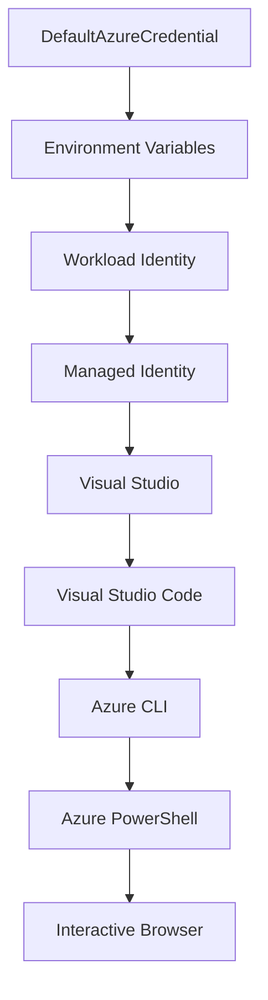

<!--
CO_OP_TRANSLATOR_METADATA:
{
  "original_hash": "4dc26ed8004b58a51875efd07203340f",
  "translation_date": "2025-09-26T18:38:56+00:00",
  "source_file": "docs/getting-started/azd-basics.md",
  "language_code": "fi"
}
-->
# AZD Perusteet - Azure Developer CLI:n Ymmärtäminen

# AZD Perusteet - Keskeiset Käsitteet ja Perusasiat

**Luvun Navigointi:**
- **📚 Kurssin Etusivu**: [AZD Aloittelijoille](../../README.md)
- **📖 Nykyinen Luku**: Luku 1 - Perusta & Nopea Aloitus
- **⬅️ Edellinen**: [Kurssin Yleiskatsaus](../../README.md#-chapter-1-foundation--quick-start)
- **➡️ Seuraava**: [Asennus & Käyttöönotto](installation.md)
- **🚀 Seuraava Luku**: [Luku 2: AI-Ensisijainen Kehitys](../ai-foundry/azure-ai-foundry-integration.md)

## Johdanto

Tässä osiossa tutustut Azure Developer CLI:hin (azd), tehokkaaseen komentorivityökaluun, joka nopeuttaa siirtymistä paikallisesta kehityksestä Azure-järjestelmään. Opit keskeiset käsitteet, tärkeimmät ominaisuudet ja ymmärrät, kuinka azd yksinkertaistaa pilvipohjaisten sovellusten käyttöönottoa.

## Oppimistavoitteet

Tämän osion lopussa:
- Ymmärrät, mitä Azure Developer CLI on ja sen pääasiallisen tarkoituksen
- Opit keskeiset käsitteet, kuten templatet, ympäristöt ja palvelut
- Tutustut tärkeimpiin ominaisuuksiin, kuten template-pohjaiseen kehitykseen ja Infrastructure as Code -lähestymistapaan
- Ymmärrät azd-projektin rakenteen ja työnkulun
- Olet valmis asentamaan ja konfiguroimaan azd:n kehitysympäristöäsi varten

## Oppimistulokset

Osion suorittamisen jälkeen pystyt:
- Selittämään azd:n roolin modernissa pilvikehityksen työnkulussa
- Tunnistamaan azd-projektin rakenteen osat
- Kuvaamaan, kuinka templatet, ympäristöt ja palvelut toimivat yhdessä
- Ymmärtämään Infrastructure as Code -lähestymistavan hyödyt azd:n avulla
- Tunnistamaan eri azd-komennot ja niiden tarkoitukset

## Mikä on Azure Developer CLI (azd)?

Azure Developer CLI (azd) on komentorivityökalu, joka on suunniteltu nopeuttamaan siirtymistä paikallisesta kehityksestä Azure-järjestelmään. Se yksinkertaistaa pilvipohjaisten sovellusten rakentamista, käyttöönottoa ja hallintaa Azure-alustalla.

## Keskeiset Käsitteet

### Templatet
Templatet ovat azd:n perusta. Ne sisältävät:
- **Sovelluskoodi** - Lähdekoodisi ja riippuvuudet
- **Infrastruktuurin määritelmät** - Azure-resurssit määriteltynä Bicepillä tai Terraformilla
- **Konfiguraatiotiedostot** - Asetukset ja ympäristömuuttujat
- **Käyttöönotto-skriptit** - Automatisoidut käyttöönoton työnkulut

### Ympäristöt
Ympäristöt edustavat eri käyttöönoton kohteita:
- **Kehitys** - Testausta ja kehitystä varten
- **Staging** - Esituotantoympäristö
- **Tuotanto** - Käytössä oleva tuotantoympäristö

Jokainen ympäristö ylläpitää omat:
- Azure-resurssiryhmänsä
- Konfiguraatioasetuksensa
- Käyttöönoton tilansa

### Palvelut
Palvelut ovat sovelluksesi rakennuspalikoita:
- **Frontend** - Verkkosovellukset, SPAt
- **Backend** - API:t, mikropalvelut
- **Tietokanta** - Tietojen tallennusratkaisut
- **Tallennus** - Tiedosto- ja blob-tallennus

## Tärkeimmät Ominaisuudet

### 1. Template-pohjainen Kehitys
```bash
# Browse available templates
azd template list

# Initialize from a template
azd init --template <template-name>
```

### 2. Infrastructure as Code
- **Bicep** - Azuren oma domain-spesifinen kieli
- **Terraform** - Monipilvi-infrastruktuurityökalu
- **ARM Templatet** - Azure Resource Manager -templatet

### 3. Integroitu Työnkulku
```bash
# Complete deployment workflow
azd up            # Provision + Deploy this is hands off for first time setup
azd provision     # Create Azure resources if you update the infrastructure use this
azd deploy        # Deploy application code or redeploy application code once update
azd down          # Clean up resources
```

### 4. Ympäristön Hallinta
```bash
# Create and manage environments
azd env new <environment-name>
azd env select <environment-name>
azd env list
```

## 📁 Projektin Rakenne

Tyypillinen azd-projektin rakenne:
```
my-app/
├── .azd/                    # azd configuration
│   └── config.json
├── .azure/                  # Azure deployment artifacts
├── .devcontainer/          # Development container config
├── .github/workflows/      # GitHub Actions
├── .vscode/               # VS Code settings
├── infra/                 # Infrastructure code
│   ├── main.bicep        # Main infrastructure template
│   ├── main.parameters.json
│   └── modules/          # Reusable modules
├── src/                  # Application source code
│   ├── api/             # Backend services
│   └── web/             # Frontend application
├── azure.yaml           # azd project configuration
└── README.md
```

## 🔧 Konfiguraatiotiedostot

### azure.yaml
Pääprojektin konfiguraatiotiedosto:
```yaml
name: my-awesome-app
metadata:
  template: my-template@1.0.0

services:
  web:
    project: ./src/web
    language: js
    host: appservice
  api:
    project: ./src/api
    language: js
    host: appservice

hooks:
  preprovision:
    shell: pwsh
    run: echo "Preparing to provision..."
```

### .azure/config.json
Ympäristökohtainen konfiguraatio:
```json
{
  "version": 1,
  "defaultEnvironment": "dev",
  "environments": {
    "dev": {
      "subscriptionId": "your-subscription-id",
      "location": "eastus"
    }
  }
}
```

## 🎪 Yleiset Työnkulut

### Uuden Projektin Aloittaminen
```bash
# Method 1: Use existing template
azd init --template todo-nodejs-mongo

# Method 2: Start from scratch
azd init

# Method 3: Use current directory
azd init .
```

### Kehityssykli
```bash
# Set up development environment
azd auth login
azd env new dev
azd env select dev

# Deploy everything
azd up

# Make changes and redeploy
azd deploy

# Clean up when done
azd down --force --purge # command in the Azure Developer CLI is a **hard reset** for your environment—especially useful when you're troubleshooting failed deployments, cleaning up orphaned resources, or prepping for a fresh redeploy.
```

## Ymmärtäminen `azd down --force --purge`

`azd down --force --purge` -komento on tehokas tapa purkaa kokonaan azd-ympäristösi ja kaikki siihen liittyvät resurssit. Tässä on erittely, mitä kukin lippu tekee:
```
--force
```
- Ohittaa vahvistuskehotteet.
- Kätevä automaatiossa tai skriptauksessa, jossa manuaalinen syöttö ei ole mahdollista.
- Varmistaa, että purku etenee keskeytyksettä, vaikka CLI havaitsee epäjohdonmukaisuuksia.

```
--purge
```
Poistaa **kaikki liittyvät metatiedot**, mukaan lukien:
Ympäristön tila
Paikallinen `.azure`-kansio
Välimuistissa oleva käyttöönoton tieto
Estää azd:tä "muistamasta" aiempia käyttöönottoja, mikä voi aiheuttaa ongelmia, kuten ristiriitaisia resurssiryhmiä tai vanhentuneita rekisteriviittauksia.

### Miksi käyttää molempia?
Kun `azd up` -komento ei toimi johtuen jäljellä olevasta tilasta tai osittaisista käyttöönotosta, tämä yhdistelmä varmistaa **puhtaan aloituksen**.

Se on erityisen hyödyllinen manuaalisten resurssien poistamisen jälkeen Azure-portaalissa tai vaihdettaessa templatet, ympäristöt tai resurssiryhmien nimeämiskäytännöt.

### Useiden Ympäristöjen Hallinta
```bash
# Create staging environment
azd env new staging
azd env select staging
azd up

# Switch back to dev
azd env select dev

# Compare environments
azd env list
```

## 🔐 Autentikointi ja Tunnistetiedot

Autentikoinnin ymmärtäminen on ratkaisevan tärkeää onnistuneille azd-käyttöönotolle. Azure käyttää useita autentikointimenetelmiä, ja azd hyödyntää samaa tunnisteketjua kuin muut Azure-työkalut.

### Azure CLI Autentikointi (`az login`)

Ennen azd:n käyttöä sinun täytyy autentikoitua Azureen. Yleisin menetelmä on Azure CLI:n käyttö:

```bash
# Interactive login (opens browser)
az login

# Login with specific tenant
az login --tenant <tenant-id>

# Login with service principal
az login --service-principal -u <app-id> -p <password> --tenant <tenant-id>

# Check current login status
az account show

# List available subscriptions
az account list --output table

# Set default subscription
az account set --subscription <subscription-id>
```

### Autentikointivirta
1. **Interaktiivinen Kirjautuminen**: Avaa oletusselaimesi autentikointia varten
2. **Laitteen Koodivirta**: Ympäristöille, joissa ei ole selaimen käyttömahdollisuutta
3. **Palveluperiaate**: Automaatio- ja CI/CD-skenaarioita varten
4. **Hallittu Identiteetti**: Azure-isännöidyille sovelluksille

### DefaultAzureCredential Ketju

`DefaultAzureCredential` on tunnistetyyppi, joka tarjoaa yksinkertaistetun autentikointikokemuksen kokeilemalla automaattisesti useita tunnistelähteitä tietyssä järjestyksessä:

#### Tunnisteketjun Järjestys


#### 1. Ympäristömuuttujat
```bash
# Set environment variables for service principal
export AZURE_CLIENT_ID="<app-id>"
export AZURE_CLIENT_SECRET="<password>"
export AZURE_TENANT_ID="<tenant-id>"
```

#### 2. Työkuorman Identiteetti (Kubernetes/GitHub Actions)
Käytetään automaattisesti:
- Azure Kubernetes Service (AKS) Workload Identityn kanssa
- GitHub Actions OIDC-federoinnin kanssa
- Muut federatiivisen identiteetin skenaariot

#### 3. Hallittu Identiteetti
Azure-resursseille, kuten:
- Virtuaalikoneet
- App Service
- Azure Functions
- Container Instances

```bash
# Check if running on Azure resource with managed identity
az account show --query "user.type" --output tsv
# Returns: "servicePrincipal" if using managed identity
```

#### 4. Kehitystyökalujen Integraatio
- **Visual Studio**: Käyttää automaattisesti kirjautunutta tiliä
- **VS Code**: Käyttää Azure Account -laajennuksen tunnistetietoja
- **Azure CLI**: Käyttää `az login` -tunnistetietoja (yleisin paikallisessa kehityksessä)

### AZD Autentikoinnin Asetukset

```bash
# Method 1: Use Azure CLI (Recommended for development)
az login
azd auth login  # Uses existing Azure CLI credentials

# Method 2: Direct azd authentication
azd auth login --use-device-code  # For headless environments

# Method 3: Check authentication status
azd auth login --check-status

# Method 4: Logout and re-authenticate
azd auth logout
azd auth login
```

### Autentikoinnin Parhaat Käytännöt

#### Paikallista Kehitystä Varten
```bash
# 1. Login with Azure CLI
az login

# 2. Verify correct subscription
az account show
az account set --subscription "Your Subscription Name"

# 3. Use azd with existing credentials
azd auth login
```

#### CI/CD Putkia Varten
```yaml
# GitHub Actions example
- name: Azure Login
  uses: azure/login@v1
  with:
    creds: ${{ secrets.AZURE_CREDENTIALS }}

- name: Deploy with azd
  run: |
    azd auth login --client-id ${{ secrets.AZURE_CLIENT_ID }} \
                    --client-secret ${{ secrets.AZURE_CLIENT_SECRET }} \
                    --tenant-id ${{ secrets.AZURE_TENANT_ID }}
    azd up --no-prompt
```

#### Tuotantoympäristöjä Varten
- Käytä **Hallittua Identiteettiä** Azure-resursseilla
- Käytä **Palveluperiaatetta** automaatioskenaarioissa
- Vältä tunnistetietojen tallentamista koodiin tai konfiguraatiotiedostoihin
- Käytä **Azure Key Vaultia** arkaluontoisten konfiguraatioiden hallintaan

### Yleiset Autentikointiongelmat ja Ratkaisut

#### Ongelma: "Ei löytynyt tilausta"
```bash
# Solution: Set default subscription
az account list --output table
az account set --subscription "<subscription-id>"
azd env set AZURE_SUBSCRIPTION_ID "<subscription-id>"
```

#### Ongelma: "Riittämättömät oikeudet"
```bash
# Solution: Check and assign required roles
az role assignment list --assignee $(az account show --query user.name --output tsv)

# Common required roles:
# - Contributor (for resource management)
# - User Access Administrator (for role assignments)
```

#### Ongelma: "Token vanhentunut"
```bash
# Solution: Re-authenticate
az logout
az login
azd auth logout
azd auth login
```

### Autentikointi Eri Skenaarioissa

#### Paikallinen Kehitys
```bash
# Personal development account
az login
azd auth login
```

#### Tiimikehitys
```bash
# Use specific tenant for organization
az login --tenant contoso.onmicrosoft.com
azd auth login
```

#### Monivuokraaja Skenaariot
```bash
# Switch between tenants
az login --tenant tenant1.onmicrosoft.com
# Deploy to tenant 1
azd up

az login --tenant tenant2.onmicrosoft.com  
# Deploy to tenant 2
azd up
```

### Turvallisuushuomiot

1. **Tunnistetietojen Tallennus**: Älä koskaan tallenna tunnistetietoja lähdekoodiin
2. **Käyttöoikeuksien Rajoittaminen**: Käytä vähimmäisoikeusperiaatetta palveluperiaatteille
3. **Tokenien Kierrätys**: Kierrätä palveluperiaatteiden salaisuudet säännöllisesti
4. **Auditointijälki**: Seuraa autentikointi- ja käyttöönottoaktiviteetteja
5. **Verkkoturvallisuus**: Käytä yksityisiä päätepisteitä aina kun mahdollista

### Autentikoinnin Vianetsintä

```bash
# Debug authentication issues
azd auth login --check-status
az account show
az account get-access-token

# Common diagnostic commands
whoami                          # Current user context
az ad signed-in-user show      # Azure AD user details
az group list                  # Test resource access
```

## Ymmärtäminen `azd down --force --purge`

### Löytäminen
```bash
azd template list              # Browse templates
azd template show <template>   # Template details
azd init --help               # Initialization options
```

### Projektinhallinta
```bash
azd show                     # Project overview
azd env show                 # Current environment
azd config list             # Configuration settings
```

### Seuranta
```bash
azd monitor                  # Open Azure portal
azd pipeline config          # Set up CI/CD
azd logs                     # View application logs
```

## Parhaat Käytännöt

### 1. Käytä Merkityksellisiä Nimiä
```bash
# Good
azd env new production-east
azd init --template web-app-secure

# Avoid
azd env new env1
azd init --template template1
```

### 2. Hyödynnä Templatet
- Aloita olemassa olevilla templateilla
- Mukauta tarpeidesi mukaan
- Luo organisaatiollesi uudelleenkäytettäviä templatet

### 3. Ympäristöjen Eristäminen
- Käytä erillisiä ympäristöjä kehitys/staging/tuotantoa varten
- Älä koskaan ota käyttöön suoraan tuotantoon paikalliselta koneelta
- Käytä CI/CD-putkia tuotantokäyttöönottoihin

### 4. Konfiguraation Hallinta
- Käytä ympäristömuuttujia arkaluontoisille tiedoille
- Pidä konfiguraatio versionhallinnassa
- Dokumentoi ympäristökohtaiset asetukset

## Oppimisen Eteneminen

### Aloittelija (Viikot 1-2)
1. Asenna azd ja autentikoidu
2. Ota käyttöön yksinkertainen template
3. Ymmärrä projektin rakenne
4. Opettele peruskomennot (up, down, deploy)

### Keskitaso (Viikot 3-4)
1. Mukauta templatet
2. Hallitse useita ympäristöjä
3. Ymmärrä infrastruktuurikoodi
4. Aseta CI/CD-putket

### Edistynyt (Viikko 5+)
1. Luo omia templatet
2. Kehittyneet infrastruktuurimallit
3. Monialueiset käyttöönotot
4. Yritystason konfiguraatiot

## Seuraavat Askeleet

**📖 Jatka Luku 1 Oppimista:**
- [Asennus & Käyttöönotto](installation.md) - Asenna ja konfiguroi azd
- [Ensimmäinen Projektisi](first-project.md) - Suorita käytännön opetus
- [Konfiguraatio-opas](configuration.md) - Edistyneet konfiguraatiovaihtoehdot

**🎯 Valmis Seuraavaan Lukuun?**
- [Luku 2: AI-Ensisijainen Kehitys](../ai-foundry/azure-ai-foundry-integration.md) - Aloita AI-sovellusten rakentaminen

## Lisäresurssit

- [Azure Developer CLI Yleiskatsaus](https://learn.microsoft.com/en-us/azure/developer/azure-developer-cli/)
- [Template Galleria](https://azure.github.io/awesome-azd/)
- [Yhteisön Näytteet](https://github.com/Azure-Samples)

---

**Luvun Navigointi:**
- **📚 Kurssin Etusivu**: [AZD Aloittelijoille](../../README.md)
- **📖 Nykyinen Luku**: Luku 1 - Perusta & Nopea Aloitus  
- **⬅️ Edellinen**: [Kurssin Yleiskatsaus](../../README.md#-chapter-1-foundation--quick-start)
- **➡️ Seuraava**: [Asennus & Käyttöönotto](installation.md)
- **🚀 Seuraava Luku**: [Luku 2: AI-Ensisijainen Kehitys](../ai-foundry/azure-ai-foundry-integration.md)

---

