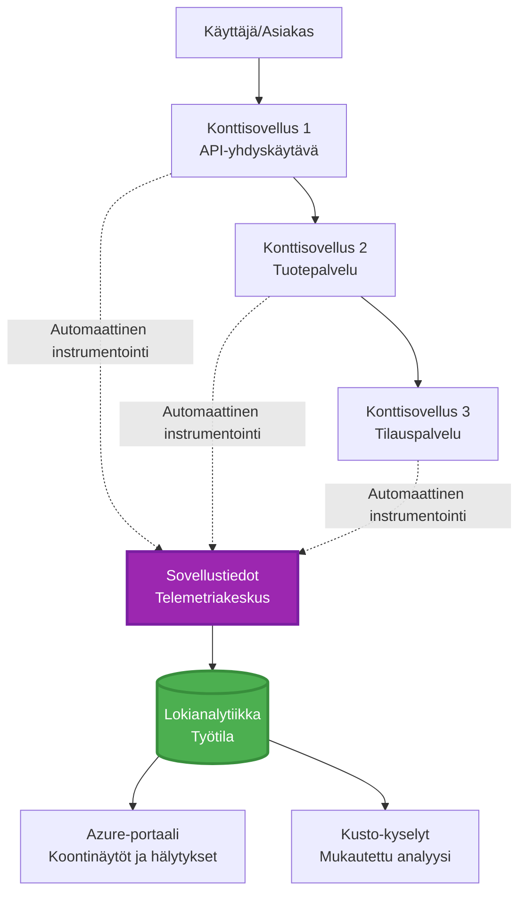
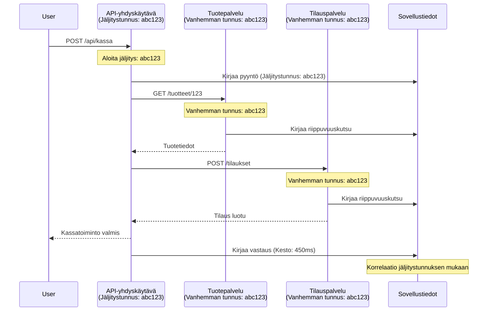

# Application Insights -integraatio AZD:n kanssa

⏱️ **Arvioitu aika**: 40-50 minuuttia | 💰 **Kustannusvaikutus**: ~5-15 $/kk | ⭐ **Vaikeustaso**: Keskitaso

**📚 Oppimispolku:**
- ← Edellinen: [Preflight Checks](preflight-checks.md) - Ennen käyttöönottoa tehtävät tarkistukset
- 🎯 **Olet täällä**: Application Insights -integraatio (valvonta, telemetria, virheenkorjaus)
- → Seuraava: [Deployment Guide](../deployment/deployment-guide.md) - Käyttöönotto Azureen
- 🏠 [Kurssin etusivu](../../README.md)

---

## Mitä opit

Tämän osion suorittamalla opit:
- Integroimaan **Application Insightsin** automaattisesti AZD-projekteihin
- Konfiguroimaan **hajautetun jäljityksen** mikropalveluille
- Toteuttamaan **räätälöityä telemetriaa** (mittarit, tapahtumat, riippuvuudet)
- Ottamaan käyttöön **reaaliaikaiset mittarit** valvontaa varten
- Luomaan **hälytyksiä ja koontinäyttöjä** AZD-käyttöönottojen pohjalta
- Korjaamaan tuotantoympäristön ongelmia **telemetriakyselyiden** avulla
- Optimoimaan **kustannuksia ja näytteenottostrategioita**
- Valvomaan **tekoäly-/LLM-sovelluksia** (tokenit, viiveet, kustannukset)

## Miksi Application Insights on tärkeä AZD:n kanssa

### Haaste: Tuotantoympäristön näkyvyys

**Ilman Application Insightsia:**
```
❌ No visibility into production behavior
❌ Manual log aggregation across services
❌ Reactive debugging (wait for customer complaints)
❌ No performance metrics
❌ Cannot trace requests across services
❌ Unknown failure rates and bottlenecks
```

**Application Insights + AZD:n kanssa:**
```
✅ Automatic telemetry collection
✅ Centralized logs from all services
✅ Proactive issue detection
✅ End-to-end request tracing
✅ Performance metrics and insights
✅ Real-time dashboards
✅ AZD provisions everything automatically
```

**Vertauskuva**: Application Insights on kuin "musta laatikko" ja ohjaamon kojelauta sovelluksellesi. Näet kaiken, mitä tapahtuu reaaliajassa, ja voit toistaa minkä tahansa tapahtuman.

---

## Arkkitehtuurin yleiskatsaus

### Application Insights AZD-arkkitehtuurissa


### Mitä valvotaan automaattisesti

| Telemetriatyyppi | Mitä se tallentaa | Käyttötarkoitus |
|------------------|-------------------|-----------------|
| **Pyynnöt** | HTTP-pyynnöt, tilakoodit, kesto | API-suorituskyvyn valvonta |
| **Riippuvuudet** | Ulkoiset kutsut (tietokanta, API:t, tallennus) | Pullonkaulojen tunnistaminen |
| **Poikkeukset** | Käsittelemättömät virheet ja pinon jäljet | Virheiden korjaus |
| **Mukautetut tapahtumat** | Liiketoimintatapahtumat (rekisteröityminen, ostot) | Analytiikka ja suppilot |
| **Mittarit** | Suorituskykylaskurit, mukautetut mittarit | Kapasiteetin suunnittelu |
| **Jäljet** | Lokiviestit ja vakavuusasteet | Virheenkorjaus ja auditointi |
| **Saatavuus** | Käyttöaika- ja vasteaikatestit | SLA-valvonta |

---

## Esivaatimukset

### Tarvittavat työkalut

```bash
# Vahvista Azure Developer CLI
azd version
# ✅ Odotettu: azd versio 1.0.0 tai uudempi

# Vahvista Azure CLI
az --version
# ✅ Odotettu: azure-cli 2.50.0 tai uudempi
```

### Azure-vaatimukset

- Aktiivinen Azure-tilaus
- Oikeudet luoda:
  - Application Insights -resursseja
  - Log Analytics -työtiloja
  - Container Apps -sovelluksia
  - Resurssiryhmiä

### Tietovaatimukset

Sinun tulisi olla suorittanut:
- [AZD Basics](../getting-started/azd-basics.md) - AZD:n peruskäsitteet
- [Configuration](../getting-started/configuration.md) - Ympäristön asennus
- [First Project](../getting-started/first-project.md) - Peruskäyttöönotto

---

## Oppitunti 1: Application Insights automaattisesti AZD:n avulla

### Miten AZD luo Application Insightsin

AZD luo ja konfiguroi Application Insightsin automaattisesti käyttöönoton yhteydessä. Katsotaan, miten se toimii.

### Projektin rakenne

```
monitored-app/
├── azure.yaml                     # AZD configuration
├── infra/
│   ├── main.bicep                # Main infrastructure
│   ├── core/
│   │   └── monitoring.bicep      # Application Insights + Log Analytics
│   └── app/
│       └── api.bicep             # Container App with monitoring
└── src/
    ├── app.py                    # Application with telemetry
    ├── requirements.txt
    └── Dockerfile
```

---

### Vaihe 1: Konfiguroi AZD (azure.yaml)

**Tiedosto: `azure.yaml`**

```yaml
name: monitored-app
metadata:
  template: monitored-app@1.0.0

services:
  api:
    project: ./src
    language: python
    host: containerapp

# AZD automatically provisions monitoring!
```

**Siinä kaikki!** AZD luo Application Insightsin oletuksena. Perusvalvontaan ei tarvita lisäasetuksia.

---

### Vaihe 2: Valvontainfrastruktuuri (Bicep)

**Tiedosto: `infra/core/monitoring.bicep`**

```bicep
param logAnalyticsName string
param applicationInsightsName string
param location string = resourceGroup().location
param tags object = {}

// Log Analytics Workspace (required for Application Insights)
resource logAnalytics 'Microsoft.OperationalInsights/workspaces@2022-10-01' = {
  name: logAnalyticsName
  location: location
  tags: tags
  properties: {
    sku: {
      name: 'PerGB2018'  // Pay-as-you-go pricing
    }
    retentionInDays: 30  // Keep logs for 30 days
    features: {
      enableLogAccessUsingOnlyResourcePermissions: true
    }
  }
}

// Application Insights
resource applicationInsights 'Microsoft.Insights/components@2020-02-02' = {
  name: applicationInsightsName
  location: location
  tags: tags
  kind: 'web'
  properties: {
    Application_Type: 'web'
    WorkspaceResourceId: logAnalytics.id
    IngestionMode: 'LogAnalytics'
    publicNetworkAccessForIngestion: 'Enabled'
    publicNetworkAccessForQuery: 'Enabled'
  }
}

// Outputs for Container Apps
output logAnalyticsWorkspaceId string = logAnalytics.id
output logAnalyticsWorkspaceName string = logAnalytics.name
output applicationInsightsConnectionString string = applicationInsights.properties.ConnectionString
output applicationInsightsInstrumentationKey string = applicationInsights.properties.InstrumentationKey
output applicationInsightsName string = applicationInsights.name
```

---

### Vaihe 3: Yhdistä Container App Application Insightsiin

**Tiedosto: `infra/app/api.bicep`**

```bicep
param name string
param location string
param tags object = {}
param containerAppsEnvironmentName string
param applicationInsightsConnectionString string

resource containerApp 'Microsoft.App/containerApps@2023-05-01' = {
  name: name
  location: location
  tags: tags
  properties: {
    configuration: {
      ingress: {
        external: true
        targetPort: 8000
      }
      secrets: [
        {
          name: 'appinsights-connection-string'
          value: applicationInsightsConnectionString
        }
      ]
    }
    template: {
      containers: [
        {
          name: 'api'
          image: 'myregistry.azurecr.io/api:latest'
          resources: {
            cpu: json('0.5')
            memory: '1Gi'
          }
          env: [
            {
              name: 'APPLICATIONINSIGHTS_CONNECTION_STRING'
              secretRef: 'appinsights-connection-string'
            }
            {
              name: 'APPLICATIONINSIGHTS_ENABLED'
              value: 'true'
            }
          ]
        }
      ]
    }
  }
}

output uri string = 'https://${containerApp.properties.configuration.ingress.fqdn}'
```

---

### Vaihe 4: Sovelluskoodi telemetrian kanssa

**Tiedosto: `src/app.py`**

```python
from flask import Flask, request, jsonify
from opencensus.ext.azure.log_exporter import AzureLogHandler
from opencensus.ext.azure.trace_exporter import AzureExporter
from opencensus.ext.flask.flask_middleware import FlaskMiddleware
from opencensus.trace.samplers import ProbabilitySampler
import logging
import os

app = Flask(__name__)

# Hanki Application Insights -yhteysmerkkijono
connection_string = os.environ.get('APPLICATIONINSIGHTS_CONNECTION_STRING')

if connection_string:
    # Määritä hajautettu jäljitys
    middleware = FlaskMiddleware(
        app,
        exporter=AzureExporter(connection_string=connection_string),
        sampler=ProbabilitySampler(rate=1.0)  # 100 % näytteenotto kehitystä varten
    )
    
    # Määritä lokitus
    logger = logging.getLogger(__name__)
    logger.addHandler(AzureLogHandler(connection_string=connection_string))
    logger.setLevel(logging.INFO)
    
    print("✅ Application Insights enabled")
else:
    logger = logging.getLogger(__name__)
    logger.setLevel(logging.INFO)
    print("⚠️ Application Insights not configured")

@app.route('/health')
def health():
    logger.info('Health check endpoint called')
    return jsonify({'status': 'healthy', 'monitoring': 'enabled'})

@app.route('/api/products')
def get_products():
    logger.info('Fetching products')
    
    # Simuloi tietokantakutsu (seurataan automaattisesti riippuvuutena)
    products = [
        {'id': 1, 'name': 'Laptop', 'price': 999.99},
        {'id': 2, 'name': 'Mouse', 'price': 29.99},
        {'id': 3, 'name': 'Keyboard', 'price': 79.99}
    ]
    
    logger.info(f'Returned {len(products)} products')
    return jsonify(products)

@app.route('/api/error-test')
def error_test():
    """Test error tracking"""
    logger.error('Testing error tracking')
    try:
        raise ValueError('This is a test exception')
    except Exception as e:
        logger.exception('Exception occurred in error-test endpoint')
        return jsonify({'error': str(e)}), 500

@app.route('/api/slow')
def slow_endpoint():
    """Test performance tracking"""
    import time
    logger.info('Slow endpoint called')
    time.sleep(3)  # Simuloi hidas toiminto
    logger.warning('Endpoint took 3 seconds to respond')
    return jsonify({'message': 'Slow operation completed'})

if __name__ == '__main__':
    app.run(host='0.0.0.0', port=8000)
```

**Tiedosto: `src/requirements.txt`**

```txt
Flask==3.0.0
opencensus-ext-azure==1.1.13
opencensus-ext-flask==0.8.1
gunicorn==21.2.0
```

---

### Vaihe 5: Ota käyttöön ja varmista

```bash
# Alusta AZD
azd init

# Ota käyttöön (määrittää Application Insights automaattisesti)
azd up

# Hanki sovelluksen URL-osoite
APP_URL=$(azd env get-values | grep API_URL | cut -d '=' -f2 | tr -d '"')

# Luo telemetria
curl $APP_URL/health
curl $APP_URL/api/products
curl $APP_URL/api/error-test
curl $APP_URL/api/slow
```

**✅ Odotettu tulos:**
```json
{
  "status": "healthy",
  "monitoring": "enabled"
}
```

---

### Vaihe 6: Näytä telemetria Azure-portaalissa

```bash
# Hanki Application Insights -tiedot
azd env get-values | grep APPLICATIONINSIGHTS

# Avaa Azure-portaalissa
az monitor app-insights component show \
  --app $(azd env get-values | grep APPLICATIONINSIGHTS_NAME | cut -d '=' -f2 | tr -d '"') \
  --resource-group $(azd env get-values | grep AZURE_RESOURCE_GROUP | cut -d '=' -f2 | tr -d '"') \
  --query "appId" -o tsv
```

**Siirry Azure-portaaliin → Application Insights → Transaction Search**

Sinun pitäisi nähdä:
- ✅ HTTP-pyynnöt ja tilakoodit
- ✅ Pyyntöjen kesto (3+ sekuntia `/api/slow`)
- ✅ Poikkeustiedot `/api/error-test`
- ✅ Mukautetut lokiviestit

---

## Oppitunti 2: Mukautettu telemetria ja tapahtumat

### Seuraa liiketoimintatapahtumia

Lisätään mukautettua telemetriaa liiketoimintakriittisille tapahtumille.

**Tiedosto: `src/telemetry.py`**

```python
from opencensus.ext.azure import metrics_exporter
from opencensus.stats import aggregation as aggregation_module
from opencensus.stats import measure as measure_module
from opencensus.stats import stats as stats_module
from opencensus.stats import view as view_module
from opencensus.tags import tag_map as tag_map_module
from opencensus.ext.azure.log_exporter import AzureLogHandler
from opencensus.ext.azure.trace_exporter import AzureExporter
from opencensus.trace import tracer as tracer_module
import logging
import os

class TelemetryClient:
    """Custom telemetry client for Application Insights"""
    
    def __init__(self, connection_string=None):
        self.connection_string = connection_string or os.environ.get('APPLICATIONINSIGHTS_CONNECTION_STRING')
        
        if not self.connection_string:
            print("⚠️ Application Insights connection string not found")
            return
        
        # Määritä lokit
        self.logger = logging.getLogger(__name__)
        self.logger.addHandler(AzureLogHandler(connection_string=self.connection_string))
        self.logger.setLevel(logging.INFO)
        
        # Määritä metristen viejä
        self.stats = stats_module.stats
        self.view_manager = self.stats.view_manager
        self.stats_recorder = self.stats.stats_recorder
        
        exporter = metrics_exporter.new_metrics_exporter(
            connection_string=self.connection_string
        )
        self.view_manager.register_exporter(exporter)
        
        # Määritä jäljitin
        self.tracer = tracer_module.Tracer(
            exporter=AzureExporter(connection_string=self.connection_string)
        )
        
        print("✅ Custom telemetry client initialized")
    
    def track_event(self, event_name: str, properties: dict = None):
        """Track custom business event"""
        properties = properties or {}
        self.logger.info(
            f"CustomEvent: {event_name}",
            extra={
                'custom_dimensions': {
                    'event_name': event_name,
                    **properties
                }
            }
        )
    
    def track_metric(self, metric_name: str, value: float, properties: dict = None):
        """Track custom metric"""
        properties = properties or {}
        self.logger.info(
            f"CustomMetric: {metric_name} = {value}",
            extra={
                'custom_dimensions': {
                    'metric_name': metric_name,
                    'value': value,
                    **properties
                }
            }
        )
    
    def track_dependency(self, name: str, dependency_type: str, duration: float, success: bool):
        """Track external dependency call"""
        with self.tracer.span(name=name) as span:
            span.add_attribute('dependency.type', dependency_type)
            span.add_attribute('duration', duration)
            span.add_attribute('success', success)

# Globaali telemetria-asiakas
telemetry = TelemetryClient()
```

### Päivitä sovellus mukautetuilla tapahtumilla

**Tiedosto: `src/app.py` (laajennettu)**

```python
from flask import Flask, request, jsonify
from telemetry import telemetry
import time
import random

app = Flask(__name__)

@app.route('/api/purchase', methods=['POST'])
def purchase():
    """Track purchase event with custom telemetry"""
    data = request.json
    product_id = data.get('product_id')
    quantity = data.get('quantity', 1)
    price = data.get('price', 0)
    
    # Seuraa liiketapahtumaa
    telemetry.track_event('Purchase', {
        'product_id': product_id,
        'quantity': quantity,
        'total_amount': price * quantity,
        'user_id': request.headers.get('X-User-Id', 'anonymous')
    })
    
    # Seuraa tulosmittaria
    telemetry.track_metric('Revenue', price * quantity, {
        'product_id': product_id,
        'currency': 'USD'
    })
    
    return jsonify({
        'order_id': f'ORD-{random.randint(1000, 9999)}',
        'status': 'confirmed',
        'total': price * quantity
    })

@app.route('/api/search')
def search():
    """Track search queries"""
    query = request.args.get('q', '')
    
    start_time = time.time()
    
    # Simuloi hakua (olisi oikea tietokantakysely)
    results = [{'id': 1, 'name': f'Result for {query}'}]
    
    duration = (time.time() - start_time) * 1000  # Muunna millisekunneiksi
    
    # Seuraa hakutapahtumaa
    telemetry.track_event('Search', {
        'query': query,
        'results_count': len(results),
        'duration_ms': duration
    })
    
    # Seuraa hakusuorituskykymittaria
    telemetry.track_metric('SearchDuration', duration, {
        'query_length': len(query)
    })
    
    return jsonify({'results': results, 'count': len(results)})

@app.route('/api/external-call')
def external_call():
    """Track external API dependency"""
    import requests
    
    start_time = time.time()
    success = True
    
    try:
        # Simuloi ulkoista API-kutsua
        response = requests.get('https://api.example.com/data', timeout=5)
        result = response.json()
    except Exception as e:
        success = False
        result = {'error': str(e)}
    
    duration = (time.time() - start_time) * 1000
    
    # Seuraa riippuvuutta
    telemetry.track_dependency(
        name='ExternalAPI',
        dependency_type='HTTP',
        duration=duration,
        success=success
    )
    
    return jsonify(result)

if __name__ == '__main__':
    app.run(host='0.0.0.0', port=8000)
```

### Testaa mukautettu telemetria

```bash
# Seuraa ostotapahtumaa
curl -X POST $APP_URL/api/purchase \
  -H "Content-Type: application/json" \
  -H "X-User-Id: user123" \
  -d '{"product_id": 1, "quantity": 2, "price": 29.99}'

# Seuraa hakutapahtumaa
curl "$APP_URL/api/search?q=laptop"

# Seuraa ulkoista riippuvuutta
curl $APP_URL/api/external-call
```

**Näytä Azure-portaalissa:**

Siirry Application Insights → Logs ja suorita:

```kusto
// View purchase events
traces
| where customDimensions.event_name == "Purchase"
| project 
    timestamp,
    product_id = tostring(customDimensions.product_id),
    total_amount = todouble(customDimensions.total_amount),
    user_id = tostring(customDimensions.user_id)
| order by timestamp desc

// View revenue metrics
traces
| where customDimensions.metric_name == "Revenue"
| summarize TotalRevenue = sum(todouble(customDimensions.value)) by bin(timestamp, 1h)
| render timechart

// View search performance
traces
| where customDimensions.event_name == "Search"
| summarize 
    AvgDuration = avg(todouble(customDimensions.duration_ms)),
    SearchCount = count()
  by bin(timestamp, 5m)
| render timechart
```

---

## Oppitunti 3: Hajautettu jäljitys mikropalveluille

### Ota käyttöön palveluiden välinen jäljitys

Mikropalveluissa Application Insights korreloi automaattisesti pyynnöt palveluiden välillä.

**Tiedosto: `infra/main.bicep`**

```bicep
targetScope = 'subscription'

param environmentName string
param location string = 'eastus'

var tags = { 'azd-env-name': environmentName }

resource rg 'Microsoft.Resources/resourceGroups@2021-04-01' = {
  name: 'rg-${environmentName}'
  location: location
  tags: tags
}

// Monitoring (shared by all services)
module monitoring './core/monitoring.bicep' = {
  name: 'monitoring'
  scope: rg
  params: {
    logAnalyticsName: 'log-${environmentName}'
    applicationInsightsName: 'appi-${environmentName}'
    location: location
    tags: tags
  }
}

// API Gateway
module apiGateway './app/api-gateway.bicep' = {
  name: 'api-gateway'
  scope: rg
  params: {
    name: 'ca-gateway-${environmentName}'
    location: location
    tags: union(tags, { 'azd-service-name': 'gateway' })
    applicationInsightsConnectionString: monitoring.outputs.applicationInsightsConnectionString
  }
}

// Product Service
module productService './app/product-service.bicep' = {
  name: 'product-service'
  scope: rg
  params: {
    name: 'ca-products-${environmentName}'
    location: location
    tags: union(tags, { 'azd-service-name': 'products' })
    applicationInsightsConnectionString: monitoring.outputs.applicationInsightsConnectionString
  }
}

// Order Service
module orderService './app/order-service.bicep' = {
  name: 'order-service'
  scope: rg
  params: {
    name: 'ca-orders-${environmentName}'
    location: location
    tags: union(tags, { 'azd-service-name': 'orders' })
    applicationInsightsConnectionString: monitoring.outputs.applicationInsightsConnectionString
  }
}

output APPLICATIONINSIGHTS_CONNECTION_STRING string = monitoring.outputs.applicationInsightsConnectionString
output GATEWAY_URL string = apiGateway.outputs.uri
```

### Näytä päästä päähän -tapahtuma


**Kysely päästä päähän -jäljitykselle:**

```kusto
// Find complete request flow
let traceId = "abc123...";  // Get from response header
dependencies
| union requests
| where operation_Id == traceId
| project 
    timestamp,
    type = itemType,
    name,
    duration,
    success,
    cloud_RoleName
| order by timestamp asc
```

---

## Oppitunti 4: Reaaliaikaiset mittarit ja valvonta

### Ota käyttöön Live Metrics Stream

Live Metrics tarjoaa reaaliaikaista telemetriaa alle sekunnin viiveellä.

**Pääsy Live Metricsiin:**

```bash
# Hae Application Insights -resurssi
APPI_NAME=$(azd env get-values | grep APPLICATIONINSIGHTS_NAME | cut -d '=' -f2 | tr -d '"')

# Hae resurssiryhmä
RG_NAME=$(azd env get-values | grep AZURE_RESOURCE_GROUP | cut -d '=' -f2 | tr -d '"')

echo "Navigate to: Azure Portal → Resource Groups → $RG_NAME → $APPI_NAME → Live Metrics"
```

**Mitä näet reaaliajassa:**
- ✅ Saapuvien pyyntöjen määrä (pyyntöä/sekunti)
- ✅ Lähtevät riippuvuuskutsut
- ✅ Poikkeusmäärä
- ✅ CPU- ja muistinkäyttö
- ✅ Aktiivisten palvelimien määrä
- ✅ Näytteen telemetria

### Luo kuormitusta testaukseen

```bash
# Luo kuormaa nähdäksesi reaaliaikaiset mittarit
for i in {1..100}; do
  curl $APP_URL/api/products &
  curl $APP_URL/api/search?q=test$i &
done

# Katso reaaliaikaisia mittareita Azure-portaalissa
# Sinun pitäisi nähdä pyyntöjen määrän nousu
```

---

## Käytännön harjoitukset

### Harjoitus 1: Hälytysten asettaminen ⭐⭐ (Keskitaso)

**Tavoite**: Luo hälytyksiä korkeille virheprosenteille ja hitaille vasteajoille.

**Vaiheet:**

1. **Luo hälytys virheprosentille:**

```bash
# Hanki Application Insights -resurssin tunnus
APPI_ID=$(az monitor app-insights component show \
  --app $APPI_NAME \
  --resource-group $RG_NAME \
  --query "id" -o tsv)

# Luo metriahälytys epäonnistuneille pyynnöille
az monitor metrics alert create \
  --name "High-Error-Rate" \
  --resource-group $RG_NAME \
  --scopes $APPI_ID \
  --condition "count requests/failed > 10" \
  --window-size 5m \
  --evaluation-frequency 1m \
  --description "Alert when error rate exceeds 10 per 5 minutes"
```

2. **Luo hälytys hitaille vasteajoille:**

```bash
az monitor metrics alert create \
  --name "Slow-Responses" \
  --resource-group $RG_NAME \
  --scopes $APPI_ID \
  --condition "avg requests/duration > 3000" \
  --window-size 5m \
  --evaluation-frequency 1m \
  --description "Alert when average response time exceeds 3 seconds"
```

3. **Luo hälytys Bicepillä (suositeltu AZD:lle):**

**Tiedosto: `infra/core/alerts.bicep`**

```bicep
param applicationInsightsId string
param actionGroupId string = ''
param location string = resourceGroup().location

// High error rate alert
resource errorRateAlert 'Microsoft.Insights/metricAlerts@2018-03-01' = {
  name: 'high-error-rate'
  location: 'global'
  properties: {
    description: 'Alert when error rate exceeds threshold'
    severity: 2
    enabled: true
    scopes: [
      applicationInsightsId
    ]
    evaluationFrequency: 'PT1M'
    windowSize: 'PT5M'
    criteria: {
      'odata.type': 'Microsoft.Azure.Monitor.SingleResourceMultipleMetricCriteria'
      allOf: [
        {
          name: 'Error rate'
          metricName: 'requests/failed'
          operator: 'GreaterThan'
          threshold: 10
          timeAggregation: 'Count'
        }
      ]
    }
    actions: actionGroupId != '' ? [
      {
        actionGroupId: actionGroupId
      }
    ] : []
  }
}

// Slow response alert
resource slowResponseAlert 'Microsoft.Insights/metricAlerts@2018-03-01' = {
  name: 'slow-responses'
  location: 'global'
  properties: {
    description: 'Alert when response time is too high'
    severity: 3
    enabled: true
    scopes: [
      applicationInsightsId
    ]
    evaluationFrequency: 'PT1M'
    windowSize: 'PT5M'
    criteria: {
      'odata.type': 'Microsoft.Azure.Monitor.SingleResourceMultipleMetricCriteria'
      allOf: [
        {
          name: 'Response duration'
          metricName: 'requests/duration'
          operator: 'GreaterThan'
          threshold: 3000
          timeAggregation: 'Average'
        }
      ]
    }
  }
}

output errorAlertId string = errorRateAlert.id
output slowResponseAlertId string = slowResponseAlert.id
```

4. **Testaa hälytykset:**

```bash
# Luo virheitä
for i in {1..20}; do
  curl $APP_URL/api/error-test
done

# Luo hitaita vastauksia
for i in {1..10}; do
  curl $APP_URL/api/slow
done

# Tarkista hälytystila (odota 5-10 minuuttia)
az monitor metrics alert list \
  --resource-group $RG_NAME \
  --query "[].{Name:name, Enabled:enabled, State:properties.enabled}" \
  --output table
```

**✅ Onnistumiskriteerit:**
- ✅ Hälytykset luotu onnistuneesti
- ✅ Hälytykset aktivoituvat, kun kynnysarvot ylittyvät
- ✅ Hälytyshistoria näkyy Azure-portaalissa
- ✅ Integroitu AZD-käyttöönottoon

**Aika**: 20-25 minuuttia

---

### Harjoitus 2: Luo mukautettu koontinäyttö ⭐⭐ (Keskitaso)

**Tavoite**: Rakenna koontinäyttö, joka näyttää keskeiset sovellusmittarit.

**Vaiheet:**

1. **Luo koontinäyttö Azure-portaalissa:**

Siirry: Azure-portaali → Dashboards → New Dashboard

2. **Lisää ruutuja keskeisille mittareille:**

- Pyyntöjen määrä (viimeiset 24 tuntia)
- Keskimääräinen vasteaika
- Virheprosentti
- 5 hitainta toimintoa
- Käyttäjien maantieteellinen jakauma

3. **Luo koontinäyttö Bicepillä:**

**Tiedosto: `infra/core/dashboard.bicep`**

```bicep
param dashboardName string
param applicationInsightsId string
param location string = resourceGroup().location

resource dashboard 'Microsoft.Portal/dashboards@2020-09-01-preview' = {
  name: dashboardName
  location: location
  properties: {
    lenses: [
      {
        order: 0
        parts: [
          // Request count
          {
            position: { x: 0, y: 0, rowSpan: 4, colSpan: 6 }
            metadata: {
              type: 'Extension/Microsoft_OperationsManagementSuite_Workspace/PartType/LogsDashboardPart'
              inputs: [
                {
                  name: 'resourceId'
                  value: applicationInsightsId
                }
                {
                  name: 'query'
                  value: '''
                    requests
                    | summarize RequestCount = count() by bin(timestamp, 1h)
                    | render timechart
                  '''
                }
              ]
            }
          }
          // Error rate
          {
            position: { x: 6, y: 0, rowSpan: 4, colSpan: 6 }
            metadata: {
              type: 'Extension/Microsoft_OperationsManagementSuite_Workspace/PartType/LogsDashboardPart'
              inputs: [
                {
                  name: 'resourceId'
                  value: applicationInsightsId
                }
                {
                  name: 'query'
                  value: '''
                    requests
                    | summarize 
                        Total = count(),
                        Failed = countif(success == false)
                    | extend ErrorRate = (Failed * 100.0) / Total
                    | project ErrorRate
                  '''
                }
              ]
            }
          }
        ]
      }
    ]
  }
}

output dashboardId string = dashboard.id
```

4. **Ota koontinäyttö käyttöön:**

```bash
# Lisää main.bicep-tiedostoon
module dashboard './core/dashboard.bicep' = {
  name: 'dashboard'
  scope: rg
  params: {
    dashboardName: 'dashboard-${environmentName}'
    applicationInsightsId: monitoring.outputs.applicationInsightsId
    location: location
  }
}

# Ota käyttöön
azd up
```

**✅ Onnistumiskriteerit:**
- ✅ Koontinäyttö näyttää keskeiset mittarit
- ✅ Voidaan kiinnittää Azure-portaalin etusivulle
- ✅ Päivittyy reaaliajassa
- ✅ Voidaan ottaa käyttöön AZD:llä

**Aika**: 25-30 minuuttia

---

### Harjoitus 3: Valvo AI/LLM-sovellusta ⭐⭐⭐ (Edistynyt)

**Tavoite**: Seuraa Azure OpenAI:n käyttöä (tokenit, kustannukset, viiveet).

**Vaiheet:**

1. **Luo AI-valvontakääre:**

**Tiedosto: `src/ai_telemetry.py`**

```python
from telemetry import telemetry
from openai import AzureOpenAI
import time

class MonitoredAzureOpenAI:
    """Azure OpenAI client with automatic telemetry"""
    
    def __init__(self, api_key, endpoint, api_version="2024-02-01"):
        self.client = AzureOpenAI(
            api_key=api_key,
            api_version=api_version,
            azure_endpoint=endpoint
        )
    
    def chat_completion(self, model: str, messages: list, **kwargs):
        """Track chat completion with telemetry"""
        start_time = time.time()
        
        try:
            # Kutsu Azure OpenAI
            response = self.client.chat.completions.create(
                model=model,
                messages=messages,
                **kwargs
            )
            
            duration = (time.time() - start_time) * 1000  # ms
            
            # Poimi käyttö
            usage = response.usage
            prompt_tokens = usage.prompt_tokens
            completion_tokens = usage.completion_tokens
            total_tokens = usage.total_tokens
            
            # Laske kustannus (GPT-4 hinnoittelu)
            prompt_cost = (prompt_tokens / 1000) * 0.03  # $0.03 per 1K tokenia
            completion_cost = (completion_tokens / 1000) * 0.06  # $0.06 per 1K tokenia
            total_cost = prompt_cost + completion_cost
            
            # Seuraa mukautettua tapahtumaa
            telemetry.track_event('OpenAI_Request', {
                'model': model,
                'prompt_tokens': prompt_tokens,
                'completion_tokens': completion_tokens,
                'total_tokens': total_tokens,
                'duration_ms': duration,
                'cost_usd': total_cost,
                'success': True
            })
            
            # Seuraa mittareita
            telemetry.track_metric('OpenAI_Tokens', total_tokens, {
                'model': model,
                'type': 'total'
            })
            
            telemetry.track_metric('OpenAI_Cost', total_cost, {
                'model': model,
                'currency': 'USD'
            })
            
            telemetry.track_metric('OpenAI_Duration', duration, {
                'model': model
            })
            
            return response
            
        except Exception as e:
            duration = (time.time() - start_time) * 1000
            
            telemetry.track_event('OpenAI_Request', {
                'model': model,
                'duration_ms': duration,
                'success': False,
                'error': str(e)
            })
            
            raise
```

2. **Käytä valvottua asiakasta:**

```python
from flask import Flask, request, jsonify
from ai_telemetry import MonitoredAzureOpenAI
import os

app = Flask(__name__)

# Alusta valvottu OpenAI-asiakas
openai_client = MonitoredAzureOpenAI(
    api_key=os.environ['AZURE_OPENAI_API_KEY'],
    endpoint=os.environ['AZURE_OPENAI_ENDPOINT']
)

@app.route('/api/chat', methods=['POST'])
def chat():
    data = request.json
    user_message = data.get('message')
    
    # Kutsu automaattisella valvonnalla
    response = openai_client.chat_completion(
        model='gpt-4',
        messages=[
            {'role': 'user', 'content': user_message}
        ]
    )
    
    return jsonify({
        'response': response.choices[0].message.content,
        'tokens': response.usage.total_tokens
    })
```

3. **Kysely AI-mittareille:**

```kusto
// Total AI spend over time
traces
| where customDimensions.event_name == "OpenAI_Request"
| where customDimensions.success == "True"
| summarize TotalCost = sum(todouble(customDimensions.cost_usd)) by bin(timestamp, 1h)
| render timechart

// Token usage by model
traces
| where customDimensions.event_name == "OpenAI_Request"
| summarize 
    TotalTokens = sum(toint(customDimensions.total_tokens)),
    RequestCount = count()
  by Model = tostring(customDimensions.model)

// Average latency
traces
| where customDimensions.event_name == "OpenAI_Request"
| summarize AvgDuration = avg(todouble(customDimensions.duration_ms))
| project AvgDurationSeconds = AvgDuration / 1000

// Cost per request
traces
| where customDimensions.event_name == "OpenAI_Request"
| extend Cost = todouble(customDimensions.cost_usd)
| summarize 
    TotalCost = sum(Cost),
    RequestCount = count(),
    AvgCostPerRequest = avg(Cost)
```

**✅ Onnistumiskriteerit:**
- ✅ Jokainen OpenAI-kutsu seurataan automaattisesti
- ✅ Tokenien käyttö ja kustannukset näkyvät
- ✅ Viiveet valvotaan
- ✅ Budjettihälytykset voidaan asettaa

**Aika**: 35-45 minuuttia

---

## Kustannusoptimointi

### Näytteenottostrategiat

Hallitse kustannuksia näytteenottamalla telemetriaa:

```python
from opencensus.trace.samplers import ProbabilitySampler

# Kehitys: 100% näytteenotto
sampler = ProbabilitySampler(rate=1.0)

# Tuotanto: 10% näytteenotto (vähennä kustannuksia 90%)
sampler = ProbabilitySampler(rate=0.1)

# Mukautuva näytteenotto (säätää automaattisesti)
from opencensus.trace.samplers import AdaptiveSampler
sampler = AdaptiveSampler()
```

**Bicepissä:**

```bicep
resource applicationInsights 'Microsoft.Insights/components@2020-02-02' = {
  name: applicationInsightsName
  properties: {
    SamplingPercentage: 10  // 10% sampling
  }
}
```

### Tietojen säilytys

```bicep
resource logAnalytics 'Microsoft.OperationalInsights/workspaces@2022-10-01' = {
  name: logAnalyticsName
  properties: {
    retentionInDays: 30  // Minimum (cheapest)
    // Options: 30, 31, 60, 90, 120, 180, 270, 365, 550, 730
  }
}
```

### Kuukausittaiset kustannusarviot

| Tietomäärä | Säilytysaika | Kuukausikustannus |
|------------|--------------|-------------------|
| 1 GB/kk | 30 päivää | ~2-5 $ |
| 5 GB/kk | 30 päivää | ~10-15 $ |
| 10 GB/kk | 90 päivää | ~25-40 $ |
| 50 GB/kk | 90 päivää | ~100-150 $ |

**Ilmainen taso**: 5 GB/kk sisältyy

---

## Tietojen tarkistuspiste

### 1. Perusintegraatio ✓

Testaa ymmärryksesi:

- [ ] **K1**: Miten AZD luo Application Insightsin?
  - **V**: Automaattisesti Bicep-mallien avulla tiedostossa `infra/core/monitoring.bicep`

- [ ] **K2**: Mikä ympäristömuuttuja mahdollistaa Application Insightsin?
  - **V**: `APPLICATIONINSIGHTS_CONNECTION_STRING`

- [ ] **K3**: Mitkä ovat kolme päätelemetriatyyppiä?
  - **V**: Pyynnöt (HTTP-kutsut), Riippuvuudet (ulkoiset kutsut), Poikkeukset (virheet)

**Käytännön tarkistus:**
```bash
# Tarkista, onko Application Insights määritetty
azd env get-values | grep APPLICATIONINSIGHTS

# Varmista, että telemetria toimii
az monitor app-insights metrics show \
  --app $APPI_NAME \
  --resource-group $RG_NAME \
  --metric "requests/count"
```

---

### 2. Mukautettu telemetria ✓

Testaa ymmärryksesi:

- [ ] **K1**: Miten seuraat mukautettuja liiketoimintatapahtumia?
  - **V**: Käytä loggeria `custom_dimensions`-parametrilla tai `TelemetryClient.track_event()`

- [ ] **K2**: Mikä ero on tapahtumilla ja mittareilla?
  - **V**: Tapahtumat ovat yksittäisiä tapahtumia, mittarit ovat numeerisia mittauksia

- [ ] **K3**: Miten korreloit telemetrian palveluiden välillä?
  - **V**: Application Insights käyttää automaattisesti `operation_Id`-tunnistetta korrelaatioon

**Käytännön tarkistus:**
```kusto
// Verify custom events
traces
| where customDimensions.event_name != ""
| summarize count() by tostring(customDimensions.event_name)
```

---

### 3. Tuotantovalvonta ✓

Testaa ymmärryksesi:

- [ ] **K1**: Mitä näytteenotto tarkoittaa ja miksi sitä käytetään?
  - **V**: Näytteenotto vähentää datamäärää (ja kustannuksia) tallentamalla vain osan telemetriasta

- [ ] **K2**: Miten asetat hälytyksiä?
  - **V**: Käytä metriikkahälytyksiä Bicepissä tai Azure-portaalissa Application Insights -mittareiden perusteella

- [ ] **K3**: Mikä ero on Log Analyticsin ja Application Insightsin välillä?
  - **V**: Application Insights tallentaa datan Log Analytics -työtilaan; App Insights tarjoaa sovelluskohtaisia näkymiä

**Käytännön tarkistus:**
```bash
# Tarkista näytteenottokokoonpano
az monitor app-insights component show \
  --app $APPI_NAME \
  --resource-group $RG_NAME \
  --query "properties.SamplingPercentage"
```

---

## Parhaat käytännöt

### ✅ TEE:

1. **Käytä korrelaatio-ID:itä**
   ```python
   logger.info('Processing order', extra={
       'custom_dimensions': {
           'order_id': order_id,
           'user_id': user_id
       }
   })
   ```

2. **Aseta hälytyksiä kriittisille mittareille**
   ```bicep
   // Error rate, slow responses, availability
   ```

3. **Käytä jäsenneltyä lokitusta**
   ```python
   # ✅ HYVÄ: Jäsennelty
   logger.info('User signup', extra={'custom_dimensions': {'user_id': 123}})
   
   # ❌ HUONO: Jäsentämätön
   logger.info(f'User 123 signed up')
   ```

4. **Valvo riippuvuuksia**
   ```python
   # Seuraa automaattisesti tietokantakutsuja, HTTP-pyyntöjä jne.
   ```

5. **Käytä Live Metricsiä käyttöönottojen aikana**

### ❌ ÄLÄ:

1. **Älä kirjaa arkaluonteisia tietoja**
   ```python
   # ❌ HUONO
   logger.info(f'Login: {username}:{password}')
   
   # ✅ HYVÄ
   logger.info('Login attempt', extra={'custom_dimensions': {'username': username}})
   ```

2. **Älä käytä 100 % näytteenottoa tuotannossa**
   ```python
   # ❌ Kallis
   sampler = ProbabilitySampler(rate=1.0)
   
   # ✅ Kustannustehokas
   sampler = ProbabilitySampler(rate=0.1)
   ```

3. **Älä jätä huomiotta dead letter -jonoja**

4. **Älä unohda asettaa tietojen säilytysrajoja**

---

## Vianetsintä

### Ongelma: Telemetriaa ei näy

**Diagnoosi:**
```bash
# Tarkista, että yhteysmerkkijono on asetettu
azd env get-values | grep APPLICATIONINSIGHTS

# Tarkista sovelluksen lokit
azd logs api --tail 50
```

**Ratkaisu:**
```bash
# Vahvista yhteysmerkkijono Container Appissa
az containerapp show \
  --name $APP_NAME \
  --resource-group $RG_NAME \
  --query "properties.template.containers[0].env" \
  | grep -i applicationinsights
```

---

### Ongelma: Korkeat kustannukset

**Diagnoosi:**
```bash
# Tarkista datan syöttö
az monitor app-insights metrics show \
  --app $APPI_NAME \
  --resource-group $RG_NAME \
  --metric "availabilityResults/count"
```

**Ratkaisu:**
- Vähennä näytteenottoprosenttia
- Lyhennä säilytysaikaa
- Poista tarpeettoman yksityiskohtainen lokitus

---

## Lue lisää

### Virallinen dokumentaatio
- [Application Insights -yleiskatsaus](https://learn.microsoft.com/azure/azure-monitor/app/app-insights-overview)
- [Application Insights Pythonille](https://learn.microsoft.com/azure/azure-monitor/app/opencensus-python)
- [Kusto Query Language](https://learn.microsoft.com/azure/data-explorer/kusto/query/)
- [AZD Monitoring](https://learn.microsoft.com/azure/developer/azure-developer-cli/monitor-your-app)

### Seuraavat askeleet tällä kurssilla
- ← Edellinen: [Preflight Checks](preflight-checks.md)
- → Seuraava: [Deployment Guide](../deployment/deployment-guide.md)
- 🏠 [Kurssin etusivu](../../README.md)

### Aiheeseen liittyvät esimerkit
- [Azure OpenAI -esimerkki](../../../../examples/azure-openai-chat) - AI-telemetria
- [Mikropalveluesimerkki](../../../../examples/microservices) - Hajautettu jäljitys

---

## Yhteenveto

**Olet oppinut:**
- ✅ Application Insightsin automaattisen käyttöönoton AZD:n avulla
- ✅ Mukautetun telemetrian (tapahtumat, mittarit, riippuvuudet)
- ✅ Hajautetun jäljityksen mikropalveluissa
- ✅ Reaaliaikaiset mittarit ja valvonnan
- ✅ Hälytykset ja koontinäytöt
- ✅ AI/LLM-sovellusten seuranta
- ✅ Kustannusten optimointistrategiat

**Keskeiset huomiot:**
1. **AZD määrittää seurannan automaattisesti** - Ei vaadi manuaalista asennusta
2. **Käytä jäsenneltyä lokitusta** - Helpottaa kyselyjen tekemistä
3. **Seuraa liiketoimintatapahtumia** - Ei pelkästään teknisiä mittareita
4. **Seuraa AI-kustannuksia** - Tarkkaile tokeneita ja kulutusta
5. **Aseta hälytykset** - Ole ennakoiva, älä reaktiivinen
6. **Optimoi kustannukset** - Käytä näytteenottoa ja säilytysrajoituksia

**Seuraavat askeleet:**
1. Suorita käytännön harjoitukset
2. Lisää Application Insights AZD-projekteihisi
3. Luo mukautettuja koontinäyttöjä tiimillesi
4. Tutustu [Deployment Guide](../deployment/deployment-guide.md)

---

<!-- CO-OP TRANSLATOR DISCLAIMER START -->
**Vastuuvapauslauseke**:  
Tämä asiakirja on käännetty käyttämällä tekoälypohjaista käännöspalvelua [Co-op Translator](https://github.com/Azure/co-op-translator). Vaikka pyrimme tarkkuuteen, huomioithan, että automaattiset käännökset voivat sisältää virheitä tai epätarkkuuksia. Alkuperäinen asiakirja sen alkuperäisellä kielellä tulisi pitää ensisijaisena lähteenä. Kriittisen tiedon osalta suositellaan ammattimaista ihmiskäännöstä. Emme ole vastuussa väärinkäsityksistä tai virhetulkinnoista, jotka johtuvat tämän käännöksen käytöstä.
<!-- CO-OP TRANSLATOR DISCLAIMER END -->