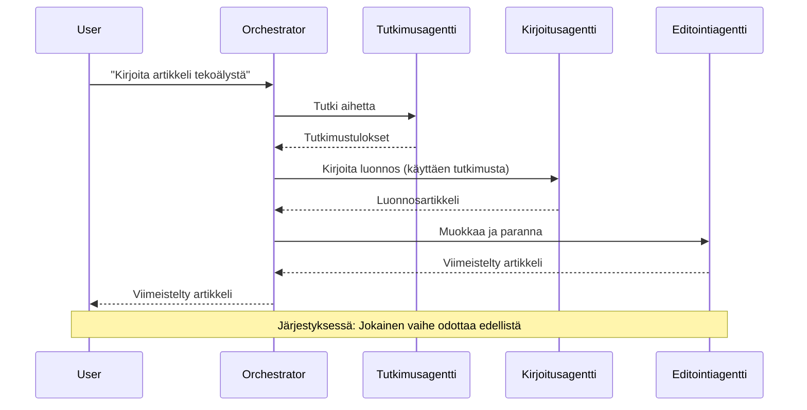
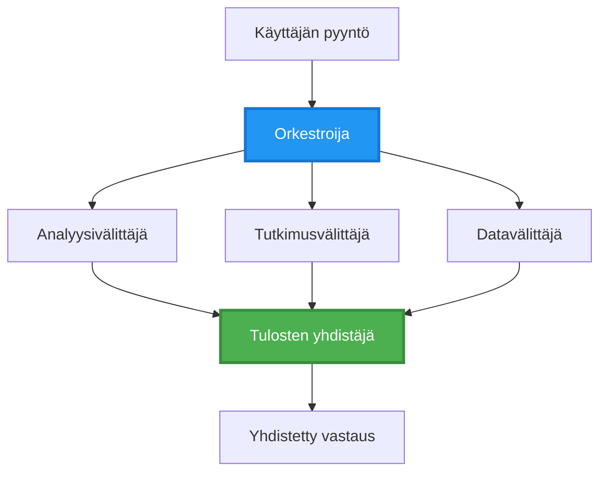
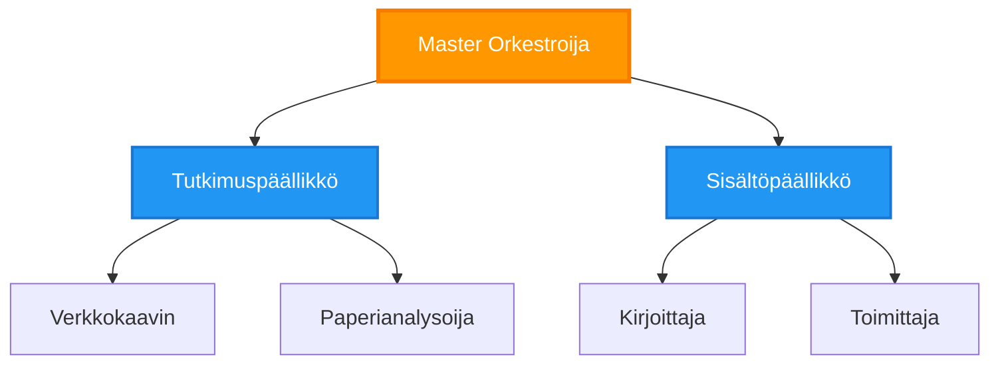
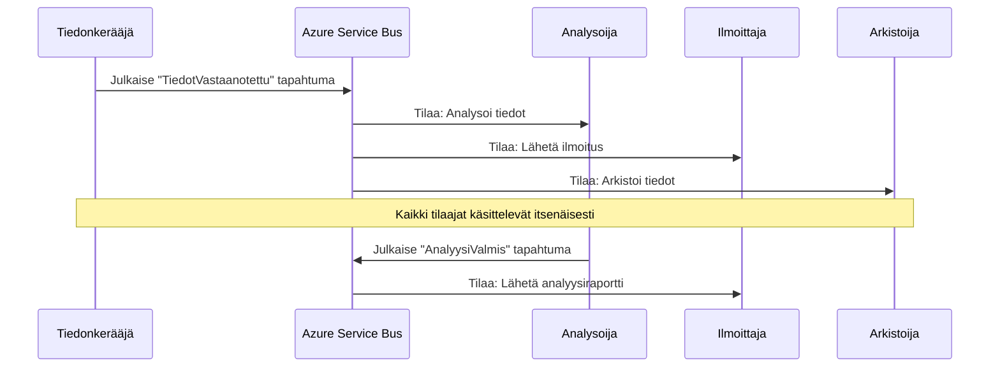
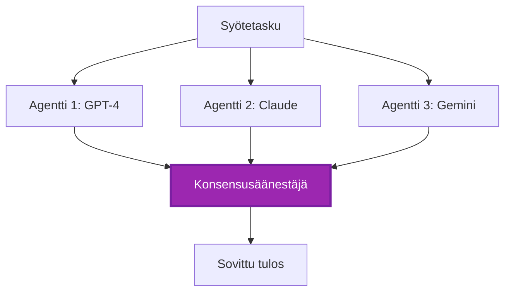
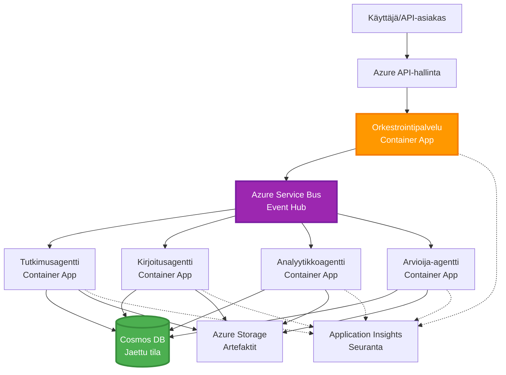

# Moniagenttien koordinointimallit

⏱️ **Arvioitu aika**: 60-75 minuuttia | 💰 **Arvioitu kustannus**: ~$100-300/kuukausi | ⭐ **Monimutkaisuus**: Edistynyt

**📚 Oppimispolku:**
- ← Edellinen: [Kapasiteettisuunnittelu](capacity-planning.md) - Resurssien mitoitus ja skaalausstrategiat
- 🎯 **Olet täällä**: Moniagenttien koordinointimallit (Orkestrointi, viestintä, tilanhallinta)
- → Seuraava: [SKU-valinta](sku-selection.md) - Oikeiden Azure-palveluiden valinta
- 🏠 [Kurssin etusivu](../../README.md)

---

## Mitä opit

Tämän oppitunnin suorittamalla opit:
- Ymmärtämään **moniagenttiarkkitehtuurin** malleja ja niiden käyttötarkoituksia
- Toteuttamaan **orkestrointimalleja** (keskitetty, hajautettu, hierarkkinen)
- Suunnittelemaan **agenttien viestintästrategioita** (synkroninen, asynkroninen, tapahtumapohjainen)
- Hallitsemaan **jaettua tilaa** hajautettujen agenttien välillä
- Ottamaan käyttöön **moniagenttijärjestelmiä** Azuren avulla AZD:llä
- Soveltamaan **koordinointimalleja** todellisiin tekoälytilanteisiin
- Seuraamaan ja vianetsimään hajautettuja agenttijärjestelmiä

## Miksi moniagenttien koordinointi on tärkeää

### Kehitys: Yksittäisestä agentista moniagenttijärjestelmään

**Yksittäinen agentti (yksinkertainen):**
```
User → Agent → Response
```
- ✅ Helppo ymmärtää ja toteuttaa
- ✅ Nopea yksinkertaisissa tehtävissä
- ❌ Rajoittunut yksittäisen mallin kyvykkyyksiin
- ❌ Ei voi rinnakkaistaa monimutkaisia tehtäviä
- ❌ Ei erikoistumista

**Moniagenttijärjestelmä (edistynyt):**
```
           ┌─────────────┐
           │ Orchestrator│
           └──────┬──────┘
        ┌─────────┼─────────┐
        │         │         │
    ┌───▼──┐  ┌──▼───┐  ┌──▼────┐
    │Agent1│  │Agent2│  │Agent3 │
    │(Plan)│  │(Code)│  │(Review)│
    └──────┘  └──────┘  └───────┘
```
- ✅ Erikoistuneet agentit tiettyihin tehtäviin
- ✅ Rinnakkaissuoritus nopeuden vuoksi
- ✅ Modulaarinen ja ylläpidettävä
- ✅ Parempi monimutkaisissa työnkuluissa
- ⚠️ Vaatii koordinointilogiikkaa

**Vertauskuva**: Yksittäinen agentti on kuin yksi henkilö, joka tekee kaikki tehtävät. Moniagenttijärjestelmä on kuin tiimi, jossa jokaisella jäsenellä on erikoistuneet taidot (tutkija, koodari, tarkastaja, kirjoittaja), jotka työskentelevät yhdessä.

---

## Keskeiset koordinointimallit

### Malli 1: Järjestyskoordinaatio (Vastuun ketju)

**Milloin käyttää**: Tehtävät on suoritettava tietyssä järjestyksessä, jokainen agentti rakentaa edellisen tuotoksen päälle.


**Edut:**
- ✅ Selkeä datavirta
- ✅ Helppo vianetsintä
- ✅ Ennustettava suoritusjärjestys

**Rajoitukset:**
- ❌ Hitaampi (ei rinnakkaisuutta)
- ❌ Yksi epäonnistuminen estää koko ketjun
- ❌ Ei voi käsitellä keskinäisesti riippuvia tehtäviä

**Esimerkkikäyttötapaukset:**
- Sisällöntuotantoputki (tutkimus → kirjoitus → editointi → julkaisu)
- Koodin generointi (suunnittelu → toteutus → testaus → käyttöönotto)
- Raporttien luominen (datan keräys → analyysi → visualisointi → yhteenveto)

---

### Malli 2: Rinnakkaiskoordinointi (Fan-Out/Fan-In)

**Milloin käyttää**: Riippumattomat tehtävät voidaan suorittaa samanaikaisesti, tulokset yhdistetään lopuksi.


**Edut:**
- ✅ Nopea (rinnakkaissuoritus)
- ✅ Vikasietoinen (osittaiset tulokset hyväksyttäviä)
- ✅ Skaalautuu horisontaalisesti

**Rajoitukset:**
- ⚠️ Tulokset voivat saapua epäjärjestyksessä
- ⚠️ Tarvitaan yhdistämislogiikkaa
- ⚠️ Monimutkainen tilanhallinta

**Esimerkkikäyttötapaukset:**
- Monilähteinen datan keräys (API:t + tietokannat + verkkosivujen kaavinta)
- Kilpailullinen analyysi (useat mallit tuottavat ratkaisuja, paras valitaan)
- Käännöspalvelut (käännetään useille kielille samanaikaisesti)

---

### Malli 3: Hierarkkinen koordinointi (Manager-Worker)

**Milloin käyttää**: Monimutkaiset työnkulut, joissa on alatehtäviä, delegointi tarpeen.


**Edut:**
- ✅ Käsittelee monimutkaisia työnkulkuja
- ✅ Modulaarinen ja ylläpidettävä
- ✅ Selkeät vastuun rajat

**Rajoitukset:**
- ⚠️ Monimutkaisempi arkkitehtuuri
- ⚠️ Korkeampi viive (useita koordinointitasoja)
- ⚠️ Vaatii kehittynyttä orkestrointia

**Esimerkkikäyttötapaukset:**
- Yrityksen asiakirjojen käsittely (luokittelu → reititys → käsittely → arkistointi)
- Monivaiheiset dataputket (syöttö → puhdistus → muunnos → analyysi → raportointi)
- Monimutkaiset automaatiotyönkulut (suunnittelu → resurssien allokointi → suoritus → seuranta)

---

### Malli 4: Tapahtumapohjainen koordinointi (Publish-Subscribe)

**Milloin käyttää**: Agenttien täytyy reagoida tapahtumiin, halutaan löyhästi kytketty järjestelmä.


**Edut:**
- ✅ Löyhästi kytketty agenttien välillä
- ✅ Helppo lisätä uusia agentteja (vain tilaa tapahtumiin)
- ✅ Asynkroninen käsittely
- ✅ Kestävä (viestien pysyvyys)

**Rajoitukset:**
- ⚠️ Lopullinen johdonmukaisuus
- ⚠️ Monimutkainen vianetsintä
- ⚠️ Viestien järjestyksen haasteet

**Esimerkkikäyttötapaukset:**
- Reaaliaikaiset seurantajärjestelmät (hälytykset, kojelaudat, lokit)
- Monikanavaiset ilmoitukset (sähköposti, SMS, push, Slack)
- Datankäsittelyputket (sama data useille kuluttajille)

---

### Malli 5: Konsensuspohjainen koordinointi (Äänestys/Quorum)

**Milloin käyttää**: Tarvitaan useiden agenttien hyväksyntä ennen etenemistä.


**Edut:**
- ✅ Korkeampi tarkkuus (useita mielipiteitä)
- ✅ Vikasietoinen (vähemmistön epäonnistumiset hyväksyttäviä)
- ✅ Laadunvarmistus sisäänrakennettuna

**Rajoitukset:**
- ❌ Kallis (useita mallikutsuja)
- ❌ Hitaampi (odotetaan kaikkia agentteja)
- ⚠️ Konfliktien ratkaisu tarpeen

**Esimerkkikäyttötapaukset:**
- Sisällön moderointi (useat mallit tarkistavat sisällön)
- Koodin tarkistus (useat linterit/analysoijat)
- Lääketieteellinen diagnoosi (useat tekoälymallit, asiantuntijan validointi)

---

## Arkkitehtuurin yleiskatsaus

### Täydellinen moniagenttijärjestelmä Azurella


**Keskeiset komponentit:**

| Komponentti | Tarkoitus | Azure-palvelu |
|-------------|-----------|---------------|
| **API Gateway** | Sisäänkäynti, nopeuden rajoitus, autentikointi | API Management |
| **Orkestroija** | Koordinoi agenttien työnkulkuja | Container Apps |
| **Viestijono** | Asynkroninen viestintä | Service Bus / Event Hubs |
| **Agentit** | Erikoistuneet tekoälytyöntekijät | Container Apps / Functions |
| **Tilatietokanta** | Jaettu tila, tehtävien seuranta | Cosmos DB |
| **Artefaktivarasto** | Asiakirjat, tulokset, lokit | Blob Storage |
| **Seuranta** | Hajautettu jäljitys, lokit | Application Insights |

---

## Esivaatimukset

### Tarvittavat työkalut

```bash
# Vahvista Azure Developer CLI
azd version
# ✅ Odotettu: azd versio 1.0.0 tai uudempi

# Vahvista Azure CLI
az --version
# ✅ Odotettu: azure-cli 2.50.0 tai uudempi

# Vahvista Docker (paikallista testausta varten)
docker --version
# ✅ Odotettu: Docker versio 20.10 tai uudempi
```

### Azure-vaatimukset

- Aktiivinen Azure-tilaus
- Oikeudet luoda:
  - Container Apps
  - Service Bus -nimialueet
  - Cosmos DB -tilit
  - Tallennustilit
  - Application Insights

### Tietovaatimukset

Sinun tulisi olla suorittanut:
- [Konfiguraation hallinta](../getting-started/configuration.md)
- [Autentikointi ja turvallisuus](../getting-started/authsecurity.md)
- [Mikropalveluesimerkki](../../../../examples/microservices)

---

## Toteutusohje

### Projektin rakenne

```
multi-agent-system/
├── azure.yaml                    # AZD configuration
├── infra/
│   ├── main.bicep               # Main infrastructure
│   ├── core/
│   │   ├── servicebus.bicep     # Message queue
│   │   ├── cosmos.bicep         # State store
│   │   ├── storage.bicep        # Artifact storage
│   │   └── monitoring.bicep     # Application Insights
│   └── app/
│       ├── orchestrator.bicep   # Orchestrator service
│       └── agent.bicep          # Agent template
└── src/
    ├── orchestrator/            # Orchestration logic
    │   ├── app.py
    │   ├── workflows.py
    │   └── Dockerfile
    ├── agents/
    │   ├── research/            # Research agent
    │   ├── writer/              # Writer agent
    │   ├── analyst/             # Analyst agent
    │   └── reviewer/            # Reviewer agent
    └── shared/
        ├── state_manager.py     # Shared state logic
        └── message_handler.py   # Message handling
```

---

## Oppitunti 1: Järjestyskoordinaatiomalli

### Toteutus: Sisällöntuotantoputki

Rakennetaan järjestyksellinen putki: Tutkimus → Kirjoitus → Editointi → Julkaisu

### 1. AZD-konfiguraatio

**Tiedosto: `azure.yaml`**

```yaml
name: content-pipeline
metadata:
  template: multi-agent-sequential@1.0.0

services:
  orchestrator:
    project: ./src/orchestrator
    language: python
    host: containerapp
  
  research-agent:
    project: ./src/agents/research
    language: python
    host: containerapp
  
  writer-agent:
    project: ./src/agents/writer
    language: python
    host: containerapp
  
  editor-agent:
    project: ./src/agents/editor
    language: python
    host: containerapp
```

### 2. Infrastruktuuri: Service Bus koordinointiin

**Tiedosto: `infra/core/servicebus.bicep`**

```bicep
param name string
param location string
param tags object = {}

resource serviceBusNamespace 'Microsoft.ServiceBus/namespaces@2022-10-01-preview' = {
  name: name
  location: location
  tags: tags
  sku: {
    name: 'Standard'
    tier: 'Standard'
  }
  properties: {
    minimumTlsVersion: '1.2'
  }
}

// Queue for orchestrator → research agent
resource researchQueue 'Microsoft.ServiceBus/namespaces/queues@2022-10-01-preview' = {
  parent: serviceBusNamespace
  name: 'research-tasks'
  properties: {
    maxDeliveryCount: 3
    lockDuration: 'PT5M'
    deadLetteringOnMessageExpiration: true
  }
}

// Queue for research agent → writer agent
resource writerQueue 'Microsoft.ServiceBus/namespaces/queues@2022-10-01-preview' = {
  parent: serviceBusNamespace
  name: 'writer-tasks'
  properties: {
    maxDeliveryCount: 3
    lockDuration: 'PT5M'
  }
}

// Queue for writer agent → editor agent
resource editorQueue 'Microsoft.ServiceBus/namespaces/queues@2022-10-01-preview' = {
  parent: serviceBusNamespace
  name: 'editor-tasks'
  properties: {
    maxDeliveryCount: 3
    lockDuration: 'PT5M'
  }
}

output namespace string = serviceBusNamespace.name
output connectionString string = listKeys('${serviceBusNamespace.id}/AuthorizationRules/RootManageSharedAccessKey', serviceBusNamespace.apiVersion).primaryConnectionString
```

### 3. Jaetun tilan hallinta

**Tiedosto: `src/shared/state_manager.py`**

```python
from azure.cosmos import CosmosClient, PartitionKey
from datetime import datetime
import os

class StateManager:
    """Manages shared state across agents using Cosmos DB"""
    
    def __init__(self):
        endpoint = os.environ['COSMOS_ENDPOINT']
        key = os.environ['COSMOS_KEY']
        
        self.client = CosmosClient(endpoint, key)
        self.database = self.client.get_database_client('agent-state')
        self.container = self.database.get_container_client('tasks')
    
    def create_task(self, task_id: str, task_type: str, input_data: dict):
        """Create a new task"""
        task = {
            'id': task_id,
            'type': task_type,
            'status': 'pending',
            'input': input_data,
            'created_at': datetime.utcnow().isoformat(),
            'steps': []
        }
        self.container.create_item(task)
        return task
    
    def update_task_step(self, task_id: str, step_name: str, result: dict):
        """Update task with completed step"""
        task = self.container.read_item(task_id, partition_key=task_id)
        
        task['steps'].append({
            'name': step_name,
            'completed_at': datetime.utcnow().isoformat(),
            'result': result
        })
        
        self.container.replace_item(task_id, task)
        return task
    
    def complete_task(self, task_id: str, final_result: dict):
        """Mark task as complete"""
        task = self.container.read_item(task_id, partition_key=task_id)
        task['status'] = 'completed'
        task['result'] = final_result
        task['completed_at'] = datetime.utcnow().isoformat()
        self.container.replace_item(task_id, task)
        return task
    
    def get_task(self, task_id: str):
        """Retrieve task state"""
        return self.container.read_item(task_id, partition_key=task_id)
```

### 4. Orkestrointipalvelu

**Tiedosto: `src/orchestrator/app.py`**

```python
from flask import Flask, request, jsonify
from azure.servicebus import ServiceBusClient, ServiceBusMessage
import json
import uuid
import os
from shared.state_manager import StateManager

app = Flask(__name__)
state_manager = StateManager()

# Service Bus -yhteys
servicebus_connection_str = os.environ['SERVICEBUS_CONNECTION_STRING']
servicebus_client = ServiceBusClient.from_connection_string(servicebus_connection_str)

@app.route('/health', methods=['GET'])
def health():
    return jsonify({'status': 'healthy', 'service': 'orchestrator'})

@app.route('/create-content', methods=['POST'])
def create_content():
    """
    Sequential workflow: Research → Write → Edit → Publish
    """
    data = request.json
    topic = data.get('topic')
    
    if not topic:
        return jsonify({'error': 'Topic required'}), 400
    
    # Luo tehtävä tilatallennukseen
    task_id = str(uuid.uuid4())
    task = state_manager.create_task(
        task_id=task_id,
        task_type='content_creation',
        input_data={'topic': topic}
    )
    
    # Lähetä viesti tutkimusagentille (ensimmäinen vaihe)
    sender = servicebus_client.get_queue_sender('research-tasks')
    message = ServiceBusMessage(
        body=json.dumps({
            'task_id': task_id,
            'topic': topic,
            'next_queue': 'writer-tasks'  # Minne tulokset lähetetään
        }),
        content_type='application/json'
    )
    
    with sender:
        sender.send_messages(message)
    
    return jsonify({
        'task_id': task_id,
        'status': 'started',
        'workflow': 'sequential',
        'steps': ['research', 'write', 'edit', 'publish'],
        'message': 'Content creation pipeline initiated'
    }), 202

@app.route('/task/<task_id>', methods=['GET'])
def get_task_status(task_id):
    """Check task status"""
    try:
        task = state_manager.get_task(task_id)
        return jsonify(task)
    except Exception as e:
        return jsonify({'error': str(e)}), 404

if __name__ == '__main__':
    app.run(host='0.0.0.0', port=8080)
```

### 5. Tutkimusagentti

**Tiedosto: `src/agents/research/app.py`**

```python
from azure.servicebus import ServiceBusClient, ServiceBusMessage
from openai import AzureOpenAI
import json
import os
import time
from shared.state_manager import StateManager

# Alusta asiakkaat
state_manager = StateManager()
servicebus_client = ServiceBusClient.from_connection_string(
    os.environ['SERVICEBUS_CONNECTION_STRING']
)

openai_client = AzureOpenAI(
    api_key=os.environ['AZURE_OPENAI_API_KEY'],
    api_version="2024-02-01",
    azure_endpoint=os.environ['AZURE_OPENAI_ENDPOINT']
)

def process_research_task(message_data):
    """Process research request and pass to writer"""
    task_id = message_data['task_id']
    topic = message_data['topic']
    next_queue = message_data['next_queue']
    
    print(f"🔬 Researching: {topic}")
    
    # Kutsu Azure OpenAI tutkimusta varten
    response = openai_client.chat.completions.create(
        model="gpt-4",
        messages=[
            {"role": "system", "content": "You are a research assistant. Provide comprehensive research on the given topic."},
            {"role": "user", "content": f"Research this topic thoroughly: {topic}"}
        ],
        max_tokens=1500
    )
    
    research_results = response.choices[0].message.content
    
    # Päivitä tila
    state_manager.update_task_step(
        task_id=task_id,
        step_name='research',
        result={'research': research_results}
    )
    
    # Lähetä seuraavalle agentille (kirjoittajalle)
    sender = servicebus_client.get_queue_sender(next_queue)
    message = ServiceBusMessage(
        body=json.dumps({
            'task_id': task_id,
            'topic': topic,
            'research': research_results,
            'next_queue': 'editor-tasks'
        }),
        content_type='application/json'
    )
    
    with sender:
        sender.send_messages(message)
    
    print(f"✅ Research complete for task {task_id}")

def main():
    """Listen to research queue"""
    receiver = servicebus_client.get_queue_receiver('research-tasks')
    
    print("🔬 Research Agent started, listening for tasks...")
    
    with receiver:
        while True:
            messages = receiver.receive_messages(max_wait_time=5)
            for message in messages:
                try:
                    message_data = json.loads(str(message))
                    process_research_task(message_data)
                    receiver.complete_message(message)
                except Exception as e:
                    print(f"❌ Error processing message: {e}")
                    receiver.abandon_message(message)

if __name__ == '__main__':
    main()
```

### 6. Kirjoittaja-agentti

**Tiedosto: `src/agents/writer/app.py`**

```python
from azure.servicebus import ServiceBusClient, ServiceBusMessage
from openai import AzureOpenAI
import json
import os
from shared.state_manager import StateManager

state_manager = StateManager()
servicebus_client = ServiceBusClient.from_connection_string(
    os.environ['SERVICEBUS_CONNECTION_STRING']
)

openai_client = AzureOpenAI(
    api_key=os.environ['AZURE_OPENAI_API_KEY'],
    api_version="2024-02-01",
    azure_endpoint=os.environ['AZURE_OPENAI_ENDPOINT']
)

def process_writing_task(message_data):
    """Write article based on research"""
    task_id = message_data['task_id']
    topic = message_data['topic']
    research = message_data['research']
    next_queue = message_data['next_queue']
    
    print(f"✍️ Writing article: {topic}")
    
    # Kutsu Azure OpenAI kirjoittamaan artikkeli
    response = openai_client.chat.completions.create(
        model="gpt-4",
        messages=[
            {"role": "system", "content": "You are a professional writer. Write engaging, well-structured articles."},
            {"role": "user", "content": f"Based on this research:\n\n{research}\n\nWrite a comprehensive article about: {topic}"}
        ],
        max_tokens=2000
    )
    
    article_draft = response.choices[0].message.content
    
    # Päivitä tila
    state_manager.update_task_step(
        task_id=task_id,
        step_name='writing',
        result={'draft': article_draft}
    )
    
    # Lähetä toimittajalle
    sender = servicebus_client.get_queue_sender(next_queue)
    message = ServiceBusMessage(
        body=json.dumps({
            'task_id': task_id,
            'topic': topic,
            'draft': article_draft
        }),
        content_type='application/json'
    )
    
    with sender:
        sender.send_messages(message)
    
    print(f"✅ Article draft complete for task {task_id}")

def main():
    """Listen to writer queue"""
    receiver = servicebus_client.get_queue_receiver('writer-tasks')
    
    print("✍️ Writer Agent started, listening for tasks...")
    
    with receiver:
        while True:
            messages = receiver.receive_messages(max_wait_time=5)
            for message in messages:
                try:
                    message_data = json.loads(str(message))
                    process_writing_task(message_data)
                    receiver.complete_message(message)
                except Exception as e:
                    print(f"❌ Error: {e}")
                    receiver.abandon_message(message)

if __name__ == '__main__':
    main()
```

### 7. Editointiagentti

**Tiedosto: `src/agents/editor/app.py`**

```python
from azure.servicebus import ServiceBusClient
from openai import AzureOpenAI
import json
import os
from shared.state_manager import StateManager

state_manager = StateManager()
servicebus_client = ServiceBusClient.from_connection_string(
    os.environ['SERVICEBUS_CONNECTION_STRING']
)

openai_client = AzureOpenAI(
    api_key=os.environ['AZURE_OPENAI_API_KEY'],
    api_version="2024-02-01",
    azure_endpoint=os.environ['AZURE_OPENAI_ENDPOINT']
)

def process_editing_task(message_data):
    """Edit and finalize article"""
    task_id = message_data['task_id']
    topic = message_data['topic']
    draft = message_data['draft']
    
    print(f"📝 Editing article: {topic}")
    
    # Kutsu Azure OpenAI muokkaamaan
    response = openai_client.chat.completions.create(
        model="gpt-4",
        messages=[
            {"role": "system", "content": "You are an expert editor. Improve grammar, clarity, and structure."},
            {"role": "user", "content": f"Edit and improve this article:\n\n{draft}"}
        ],
        max_tokens=2000
    )
    
    final_article = response.choices[0].message.content
    
    # Merkitse tehtävä valmiiksi
    state_manager.complete_task(
        task_id=task_id,
        final_result={
            'topic': topic,
            'final_article': final_article,
            'word_count': len(final_article.split())
        }
    )
    
    print(f"✅ Article finalized for task {task_id}")

def main():
    """Listen to editor queue"""
    receiver = servicebus_client.get_queue_receiver('editor-tasks')
    
    print("📝 Editor Agent started, listening for tasks...")
    
    with receiver:
        while True:
            messages = receiver.receive_messages(max_wait_time=5)
            for message in messages:
                try:
                    message_data = json.loads(str(message))
                    process_editing_task(message_data)
                    receiver.complete_message(message)
                except Exception as e:
                    print(f"❌ Error: {e}")
                    receiver.abandon_message(message)

if __name__ == '__main__':
    main()
```

### 8. Käyttöönotto ja testaus

```bash
# Alusta ja ota käyttöön
azd init
azd up

# Hae orkestroijan URL
ORCHESTRATOR_URL=$(azd env get-values | grep ORCHESTRATOR_URL | cut -d '=' -f2 | tr -d '"')

# Luo sisältö
curl -X POST $ORCHESTRATOR_URL/create-content \
  -H "Content-Type: application/json" \
  -d '{"topic": "The Future of AI in Healthcare"}'
```

**✅ Odotettu tulos:**
```json
{
  "task_id": "a1b2c3d4-e5f6-7890-abcd-ef1234567890",
  "status": "started",
  "workflow": "sequential",
  "steps": ["research", "write", "edit", "publish"],
  "message": "Content creation pipeline initiated"
}
```

**Tarkista tehtävän eteneminen:**
```bash
TASK_ID="a1b2c3d4-e5f6-7890-abcd-ef1234567890"
curl $ORCHESTRATOR_URL/task/$TASK_ID
```

**✅ Odotettu tulos (valmis):**
```json
{
  "id": "a1b2c3d4-e5f6-7890-abcd-ef1234567890",
  "type": "content_creation",
  "status": "completed",
  "steps": [
    {
      "name": "research",
      "completed_at": "2025-11-19T10:30:00Z",
      "result": {"research": "..."}
    },
    {
      "name": "writing",
      "completed_at": "2025-11-19T10:32:00Z",
      "result": {"draft": "..."}
    }
  ],
  "result": {
    "topic": "The Future of AI in Healthcare",
    "final_article": "...",
    "word_count": 1500
  }
}
```

---

## Oppitunti 2: Rinnakkaiskoordinointimalli

### Toteutus: Monilähteinen tutkimusaggregointi

Rakennetaan rinnakkainen järjestelmä, joka kerää tietoa useista lähteistä samanaikaisesti.

### Rinnakkainen orkestroija

**Tiedosto: `src/orchestrator/parallel_workflow.py`**

```python
from flask import Flask, request, jsonify
from azure.servicebus import ServiceBusClient, ServiceBusMessage
import json
import uuid
import os
from shared.state_manager import StateManager

app = Flask(__name__)
state_manager = StateManager()

servicebus_client = ServiceBusClient.from_connection_string(
    os.environ['SERVICEBUS_CONNECTION_STRING']
)

@app.route('/research-parallel', methods=['POST'])
def research_parallel():
    """
    Parallel workflow: Multiple agents work simultaneously
    """
    data = request.json
    query = data.get('query')
    
    task_id = str(uuid.uuid4())
    task = state_manager.create_task(
        task_id=task_id,
        task_type='parallel_research',
        input_data={
            'query': query,
            'agents': ['web', 'academic', 'news', 'social']
        }
    )
    
    # Fan-out: Lähetä kaikille agenteille samanaikaisesti
    agents = [
        ('web-research-queue', 'web'),
        ('academic-research-queue', 'academic'),
        ('news-research-queue', 'news'),
        ('social-research-queue', 'social')
    ]
    
    for queue_name, agent_type in agents:
        sender = servicebus_client.get_queue_sender(queue_name)
        message = ServiceBusMessage(
            body=json.dumps({
                'task_id': task_id,
                'query': query,
                'agent_type': agent_type,
                'result_queue': 'aggregation-queue'
            }),
            content_type='application/json'
        )
        
        with sender:
            sender.send_messages(message)
    
    return jsonify({
        'task_id': task_id,
        'status': 'started',
        'workflow': 'parallel',
        'agents_dispatched': 4,
        'message': 'Parallel research initiated'
    }), 202

if __name__ == '__main__':
    app.run(host='0.0.0.0', port=8080)
```

### Yhdistämislogiikka

**Tiedosto: `src/agents/aggregator/app.py`**

```python
from azure.servicebus import ServiceBusClient
import json
import os
from collections import defaultdict
from shared.state_manager import StateManager

state_manager = StateManager()
servicebus_client = ServiceBusClient.from_connection_string(
    os.environ['SERVICEBUS_CONNECTION_STRING']
)

# Seuraa tuloksia tehtävää kohden
task_results = defaultdict(list)
expected_agents = 4  # verkko, akateeminen, uutiset, sosiaalinen

def process_result(message_data):
    """Aggregate results from parallel agents"""
    task_id = message_data['task_id']
    agent_type = message_data['agent_type']
    result = message_data['result']
    
    # Tallenna tulos
    task_results[task_id].append({
        'agent': agent_type,
        'data': result
    })
    
    print(f"📊 Received result from {agent_type} agent ({len(task_results[task_id])}/{expected_agents})")
    
    # Tarkista, ovatko kaikki agentit valmiita (fan-in)
    if len(task_results[task_id]) == expected_agents:
        print(f"✅ All agents completed for task {task_id}. Aggregating...")
        
        # Yhdistä tulokset
        aggregated = {
            'query': message_data['query'],
            'sources': task_results[task_id],
            'summary': generate_summary(task_results[task_id])
        }
        
        # Merkitse valmiiksi
        state_manager.complete_task(task_id, aggregated)
        
        # Siivoa
        del task_results[task_id]
        
        print(f"✅ Aggregation complete for task {task_id}")

def generate_summary(results):
    """Generate summary from all sources"""
    summaries = [r['data'].get('summary', '') for r in results]
    return '\n\n'.join(summaries)

def main():
    """Listen to aggregation queue"""
    receiver = servicebus_client.get_queue_receiver('aggregation-queue')
    
    print("📊 Aggregator started, listening for results...")
    
    with receiver:
        while True:
            messages = receiver.receive_messages(max_wait_time=5)
            for message in messages:
                try:
                    message_data = json.loads(str(message))
                    process_result(message_data)
                    receiver.complete_message(message)
                except Exception as e:
                    print(f"❌ Error: {e}")
                    receiver.abandon_message(message)

if __name__ == '__main__':
    main()
```

**Rinnakkaismallin edut:**
- ⚡ **4x nopeampi** (agentit toimivat samanaikaisesti)
- 🔄 **Vikasietoinen** (osittaiset tulokset hyväksyttäviä)
- 📈 **Skaalautuva** (lisää agentteja helposti)

---

## Käytännön harjoitukset

### Harjoitus 1: Lisää aikakatkaisun käsittely ⭐⭐ (Keskitaso)

**Tavoite**: Toteuta aikakatkaisulogiikka, jotta aggregaattori ei odota ikuisesti hitaita agentteja.

**Vaiheet**:

1. **Lisää aikakatkaisun seuranta aggregaattoriin:**

```python
from datetime import datetime, timedelta

task_timeouts = {}  # tehtävä_id -> vanhenemisaika

def process_result(message_data):
    task_id = message_data['task_id']
    
    # Aseta aikakatkaisu ensimmäiselle tulokselle
    if task_id not in task_timeouts:
        task_timeouts[task_id] = datetime.utcnow() + timedelta(seconds=30)
    
    task_results[task_id].append({
        'agent': message_data['agent_type'],
        'data': message_data['result']
    })
    
    # Tarkista, onko valmis TAI aikakatkaistu
    if len(task_results[task_id]) == expected_agents or \
       datetime.utcnow() > task_timeouts[task_id]:
        
        print(f"📊 Aggregating with {len(task_results[task_id])}/{expected_agents} results")
        
        aggregated = {
            'query': message_data['query'],
            'sources': task_results[task_id],
            'completed_agents': len(task_results[task_id]),
            'timed_out': len(task_results[task_id]) < expected_agents
        }
        
        state_manager.complete_task(task_id, aggregated)
        
        # Siivous
        del task_results[task_id]
        del task_timeouts[task_id]
```

2. **Testaa keinotekoisilla viiveillä:**

```python
# Yhdessä agentissa lisää viivettä simuloidaksesi hidasta käsittelyä
import time
time.sleep(35)  # Ylittää 30 sekunnin aikakatkaisun
```

3. **Ota käyttöön ja varmista:**

```bash
azd deploy aggregator

# Lähetä tehtävä
curl -X POST $ORCHESTRATOR_URL/research-parallel \
  -H "Content-Type: application/json" \
  -d '{"query": "AI safety research"}'

# Tarkista tulokset 30 sekunnin kuluttua
curl $ORCHESTRATOR_URL/task/$TASK_ID
```

**✅ Onnistumiskriteerit:**
- ✅ Tehtävä valmistuu 30 sekunnissa, vaikka agentit eivät olisi valmiita
- ✅ Vastaus osoittaa osittaiset tulokset (`"timed_out": true`)
- ✅ Saatavilla olevat tulokset palautetaan (3/4 agenttia)

**Aika**: 20-25 minuuttia

---

### Harjoitus 2: Toteuta uudelleenkokeilulogiikka ⭐⭐⭐ (Edistynyt)

**Tavoite**: Yritä epäonnistuneita agenttitehtäviä automaattisesti uudelleen ennen luovuttamista.

**Vaiheet**:

1. **Lisää uudelleenkokeilun seuranta orkestroijaan:**

```python
from dataclasses import dataclass
from typing import Dict

@dataclass
class RetryConfig:
    max_retries: int = 3
    backoff_seconds: int = 5

retry_counts: Dict[str, int] = {}  # viesti_id -> uudelleenyritys_laskuri

def send_with_retry(queue_name: str, message_data: dict, retry_config: RetryConfig):
    """Send message with retry metadata"""
    message_id = message_data.get('message_id', str(uuid.uuid4()))
    message_data['message_id'] = message_id
    message_data['retry_count'] = retry_counts.get(message_id, 0)
    message_data['max_retries'] = retry_config.max_retries
    
    sender = servicebus_client.get_queue_sender(queue_name)
    message = ServiceBusMessage(
        body=json.dumps(message_data),
        content_type='application/json',
        message_id=message_id
    )
    
    with sender:
        sender.send_messages(message)
```

2. **Lisää uudelleenkokeilukäsittelijä agenteille:**

```python
def process_with_retry(message, receiver, process_func):
    """Process message with automatic retry on failure"""
    try:
        message_data = json.loads(str(message))
        
        # Käsittele viesti
        process_func(message_data)
        
        # Onnistui - valmis
        receiver.complete_message(message)
        
    except Exception as e:
        message_id = message.message_id
        retry_count = message_data.get('retry_count', 0)
        max_retries = message_data.get('max_retries', 3)
        
        if retry_count < max_retries:
            # Yritä uudelleen: hylkää ja lisää jonoon uudelleen korotetulla laskurilla
            print(f"⚠️ Retry {retry_count + 1}/{max_retries} for message {message_id}")
            
            message_data['retry_count'] = retry_count + 1
            
            # Lähetä takaisin samaan jonoon viiveellä
            time.sleep(5 * (retry_count + 1))  # Eksponentiaalinen taaksepäin siirtyminen
            send_with_retry(queue_name, message_data, RetryConfig())
            
            receiver.complete_message(message)  # Poista alkuperäinen
        else:
            # Maksimiyritykset ylitetty - siirrä epäonnistuneiden viestien jonoon
            print(f"❌ Max retries exceeded for message {message_id}")
            receiver.dead_letter_message(
                message,
                reason="MaxRetriesExceeded",
                error_description=str(e)
            )
```

3. **Seuraa dead letter -jonoa:**

```python
def monitor_dead_letters():
    """Check dead letter queue for failed messages"""
    receiver = servicebus_client.get_queue_receiver(
        'research-queue',
        sub_queue='deadletter'
    )
    
    with receiver:
        messages = receiver.receive_messages(max_wait_time=5)
        for message in messages:
            print(f"☠️ Dead letter: {message.message_id}")
            print(f"Reason: {message.dead_letter_reason}")
            print(f"Description: {message.dead_letter_error_description}")
```

**✅ Onnistumiskriteerit:**
- ✅ Epäonnistuneet tehtävät yritetään automaattisesti uudelleen (enintään 3 kertaa)
- ✅ Eksponentiaalinen viive uudelleenkokeilujen välillä (5s, 10s, 15s)
- ✅ Maksimiyritysten jälkeen viestit menevät dead letter -jonoon
- ✅ Dead letter -jonoa voidaan seurata ja toistaa

**Aika**: 30-40 minuuttia

---

### Harjoitus 3: Toteuta piirin katkaisija ⭐⭐⭐ (Edistynyt)

**Tavoite**: Estä ketjureaktiomaiset epäonnistumiset lopettamalla pyynnöt epäonnistuneille agenteille.

**Vaiheet**:

1. **Luo piirin katkaisijaluokka:**

```python
from enum import Enum
from datetime import datetime, timedelta

class CircuitState(Enum):
    CLOSED = "closed"      # Normaali toiminta
    OPEN = "open"          # Epäonnistuu, hylkää pyynnöt
    HALF_OPEN = "half_open"  # Testataan, onko palautunut

class CircuitBreaker:
    def __init__(self, failure_threshold=5, timeout_seconds=60):
        self.failure_threshold = failure_threshold
        self.timeout_seconds = timeout_seconds
        self.failure_count = 0
        self.last_failure_time = None
        self.state = CircuitState.CLOSED
    
    def call(self, func):
        """Execute function with circuit breaker protection"""
        if self.state == CircuitState.OPEN:
            # Tarkista, onko aikakatkaisu umpeutunut
            if datetime.utcnow() - self.last_failure_time > timedelta(seconds=self.timeout_seconds):
                self.state = CircuitState.HALF_OPEN
                print("🔄 Circuit breaker: HALF_OPEN (testing)")
            else:
                raise Exception(f"Circuit breaker OPEN for agent. Try again in {self.timeout_seconds}s")
        
        try:
            result = func()
            
            # Onnistui
            if self.state == CircuitState.HALF_OPEN:
                self.state = CircuitState.CLOSED
                self.failure_count = 0
                print("✅ Circuit breaker: CLOSED (recovered)")
            
            return result
            
        except Exception as e:
            self.failure_count += 1
            self.last_failure_time = datetime.utcnow()
            
            if self.failure_count >= self.failure_threshold:
                self.state = CircuitState.OPEN
                print(f"🔴 Circuit breaker: OPEN (too many failures)")
            
            raise e
```

2. **Sovella agenttikutsuihin:**

```python
# Orkestroijassa
agent_circuits = {
    'web': CircuitBreaker(failure_threshold=5, timeout_seconds=60),
    'academic': CircuitBreaker(failure_threshold=5, timeout_seconds=60),
    'news': CircuitBreaker(failure_threshold=5, timeout_seconds=60),
    'social': CircuitBreaker(failure_threshold=5, timeout_seconds=60)
}

def send_to_agent(agent_type, message_data):
    """Send with circuit breaker protection"""
    circuit = agent_circuits[agent_type]
    
    try:
        circuit.call(lambda: send_message(agent_type, message_data))
    except Exception as e:
        print(f"⚠️ Skipping {agent_type} agent: {e}")
        # Jatka muiden agenttien kanssa
```

3. **Testaa piirin katkaisija:**

```bash
# Simuloi toistuvia epäonnistumisia (pysäytä yksi agentti)
az containerapp stop --name web-research-agent --resource-group rg-agents

# Lähetä useita pyyntöjä
for i in {1..10}; do
  curl -X POST $ORCHESTRATOR_URL/research-parallel \
    -H "Content-Type: application/json" \
    -d '{"query": "test query '$i'"}'
  sleep 2
done

# Tarkista lokit - pitäisi nähdä piirin avautuvan 5 epäonnistumisen jälkeen
azd logs orchestrator --tail 50
```

**✅ Onnistumiskriteerit:**
- ✅ 5 epäonnistumisen jälkeen piiri avautuu (hylkää pyynnöt)
- ✅ 60 sekunnin jälkeen piiri menee puoliksi auki (testaa palautumista)
- ✅ Muut agentit jatkavat normaalisti
- ✅ Piiri sulkeutuu automaattisesti, kun agentti palautuu

**Aika**: 40-50 minuuttia

---

## Seuranta ja vianetsintä

### Hajautettu jäljitys Application Insightsilla

**Tiedosto: `src/shared/tracing.py`**

```python
from opencensus.ext.azure.log_exporter import AzureLogHandler
from opencensus.ext.azure.trace_exporter import AzureExporter
from opencensus.trace import config_integration
from opencensus.trace.tracer import Tracer
from opencensus.trace.samplers import AlwaysOnSampler
import logging
import os

# Määritä jäljitys
config_integration.trace_integrations(['requests', 'logging'])

connection_string = os.environ.get('APPLICATIONINSIGHTS_CONNECTION_STRING')

# Luo jäljitin
tracer = Tracer(
    exporter=AzureExporter(connection_string=connection_string),
    sampler=AlwaysOnSampler()
)

# Määritä lokitus
logger = logging.getLogger(__name__)
logger.addHandler(AzureLogHandler(connection_string=connection_string))
logger.setLevel(logging.INFO)

def trace_agent_call(agent_name, task_id, operation):
    """Trace agent operations"""
    with tracer.span(name=f'{agent_name}.{operation}') as span:
        span.add_attribute('agent', agent_name)
        span.add_attribute('task_id', task_id)
        span.add_attribute('operation', operation)
        
        try:
            result = operation()
            span.add_attribute('status', 'success')
            return result
        except Exception as e:
            span.add_attribute('status', 'error')
            span.add_attribute('error', str(e))
            raise
```

### Application Insights -kyselyt

**Seuraa moniagenttien työnkulkuja:**

```kusto
// Trace complete workflow for a task
traces
| where customDimensions.task_id == "a1b2c3d4-..."
| project timestamp, message, customDimensions.agent, customDimensions.operation
| order by timestamp asc
```

**Agenttien suorituskyvyn vertailu:**

```kusto
// Compare agent execution times
dependencies
| where name contains "agent"
| summarize 
    avg_duration = avg(duration),
    p95_duration = percentile(duration, 95),
    count = count()
  by agent = tostring(customDimensions.agent)
| order by avg_duration desc
```

**Epäonnistumisanalyysi:**

```kusto
// Find which agents fail most
exceptions
| where customDimensions.agent != ""
| summarize 
    failure_count = count(),
    unique_errors = dcount(outerMessage)
  by agent = tostring(customDimensions.agent)
| order by failure_count desc
```

---

## Kustannusanalyysi

### Moniagenttijärjestelmän kustannukset (kuukausittaiset arviot)

| Komponentti | Konfiguraatio | Kustannus |
|-------------|---------------|-----------|
| **Orkestroija** | 1 Container App (1 vCPU, 2GB) | $30-50 |
| **4 Agenttia** | 4 Container Apps (0.5 vCPU, 1GB kukin) | $60-120 |
| **Service Bus** | Standard-taso, 10M viestiä | $10-20 |
| **Cosmos DB** | Serverless, 5GB tallennus, 1M RUs | $25-50 |
| **Blob Storage** | 10GB tallennus, 100K operaatiota | $5-10 |
| **Application Insights** | 5GB ingestio | $10-15 |
| **Azure OpenAI** | GPT-4, 10M tokenia | $100-300 |
| **Yhteensä** | | **$240-565/kuukausi** |

### Kustannusten optimointistrategiat

1. **Käytä serverless-ratkaisuja mahdollisuuksien mukaan:**
   ```bicep
   // Cosmos DB serverless (no minimum cost)
   properties: {
     databaseAccountOfferType: 'Standard'
     capabilities: [{ name: 'EnableServerless' }]
   }
   ```

2. **Skaalaa agentit nollaan, kun ne ovat käyttämättömiä:**
   ```bicep
   scale: {
     minReplicas: 0  // Scale to zero when no messages
     maxReplicas: 10
   }
   ```

3. **Käytä eräajoa Service Busissa:**
   ```python
   # Lähetä viestejä erissä (edullisempaa)
   sender.send_messages([message1, message2, message3])
   ```

4. **Välimuista usein käytetyt tulokset:**
   ```python
   # Käytä Azure Cache for Redis
   if cache.exists(query_hash):
       return cache.get(query_hash)
   ```

---

## Parhaat käytännöt

### ✅ TEE:

1. **Käytä idempotentteja operaatioita**
   ```python
   # Agentti voi käsitellä saman viestin turvallisesti useita kertoja
   def process_task(task_id):
       if state_manager.task_exists(task_id):
           print(f"Task {task_id} already processed, skipping")
           return
       # Käsittele tehtävä...
   ```

2. **Toteuta kattava lokitus**
   ```python
   logger.info(f"Agent: {agent_name}, Task: {task_id}, Action: {action}")
   ```

3. **Käytä korrelaatio-ID:tä**
   ```python
   # Välitä tehtävä_id koko työnkulun läpi
   message_data = {
       'task_id': task_id,  # Korrelaatio ID
       'timestamp': datetime.utcnow().isoformat()
   }
   ```

4. **Aseta viestien TTL (time-to-live)**
   ```bicep
   properties: {
     defaultMessageTimeToLive: 'PT1H'  // 1 hour max
   }
   ```

5. **Seuraa dead letter -jonoja**
   ```python
   # Säännöllinen epäonnistuneiden viestien seuranta
   monitor_dead_letters()
   ```

### ❌ ÄLÄ:

1
## Vianmääritysopas

### Ongelma: Viestit jumissa jonossa

**Oireet:**
- Viestit kerääntyvät jonoon
- Agentit eivät käsittele niitä
- Tehtävän tila jumissa "odottaa"

**Diagnoosi:**
```bash
# Tarkista jonon syvyys
az servicebus queue show \
  --namespace-name mybus \
  --name research-tasks \
  --query "countDetails"

# Tarkista agentin kunto
azd logs research-agent --tail 50
```

**Ratkaisut:**

1. **Lisää agenttien replikoita:**
   ```bash
   az containerapp update \
     --name research-agent \
     --min-replicas 3 \
     --max-replicas 10
   ```

2. **Tarkista dead letter -jono:**
   ```bash
   az servicebus queue show \
     --namespace-name mybus \
     --name research-tasks \
     --query "countDetails.deadLetterMessageCount"
   ```

---

### Ongelma: Tehtävä aikakatkaistuu/ei valmistu koskaan

**Oireet:**
- Tehtävän tila pysyy "käynnissä"
- Osa agenteista valmistuu, osa ei
- Ei virheilmoituksia

**Diagnoosi:**
```bash
# Tarkista tehtävän tila
curl $ORCHESTRATOR_URL/task/$TASK_ID

# Tarkista Application Insights
# Suorita kysely: traces | where customDimensions.task_id == "..."
```

**Ratkaisut:**

1. **Toteuta aikakatkaisu aggregaattorissa (Harjoitus 1)**

2. **Tarkista agenttien virheet:**
   ```bash
   azd logs --follow | grep "ERROR\|FAIL"
   ```

3. **Varmista, että kaikki agentit ovat käynnissä:**
   ```bash
   az containerapp list \
     --resource-group rg-agents \
     --query "[].{name:name, status:properties.runningStatus}"
   ```

---

## Lisätietoja

### Virallinen dokumentaatio
- [Azure Service Bus](https://learn.microsoft.com/azure/service-bus-messaging/service-bus-messaging-overview)
- [Cosmos DB](https://learn.microsoft.com/azure/cosmos-db/introduction)
- [Container Apps DAPR](https://learn.microsoft.com/azure/container-apps/dapr-overview)
- [Multi-Agent Design Patterns](https://learn.microsoft.com/azure/architecture/guide/ai/multi-agent-systems)

### Seuraavat askeleet tässä kurssissa
- ← Edellinen: [Kapasiteettisuunnittelu](capacity-planning.md)
- → Seuraava: [SKU-valinta](sku-selection.md)
- 🏠 [Kurssin etusivu](../../README.md)

### Liittyvät esimerkit
- [Mikropalveluesimerkki](../../../../examples/microservices) - Palveluiden viestintämallit
- [Azure OpenAI -esimerkki](../../../../examples/azure-openai-chat) - AI-integraatio

---

## Yhteenveto

**Olet oppinut:**
- ✅ Viisi koordinointimallia (sekventiaalinen, rinnakkainen, hierarkkinen, tapahtumapohjainen, konsensus)
- ✅ Moniagenttiarkkitehtuuri Azurella (Service Bus, Cosmos DB, Container Apps)
- ✅ Tilanhallinta hajautettujen agenttien välillä
- ✅ Aikakatkaisujen käsittely, uudelleenyritot ja virtapiirikatkaisijat
- ✅ Hajautettujen järjestelmien valvonta ja vianmääritys
- ✅ Kustannusten optimointistrategiat

**Keskeiset opit:**
1. **Valitse oikea malli** - Sekventiaalinen järjestettyihin työnkulkuihin, rinnakkainen nopeuteen, tapahtumapohjainen joustavuuteen
2. **Hallitse tilaa huolellisesti** - Käytä Cosmos DB:tä tai vastaavaa jaettuun tilaan
3. **Käsittele virheet sujuvasti** - Aikakatkaisut, uudelleenyritot, virtapiirikatkaisijat, dead letter -jonot
4. **Valvo kaikkea** - Hajautettu jäljitys on välttämätöntä vianmäärityksessä
5. **Optimoi kustannukset** - Skaalaa nollaan, käytä serverless-ratkaisuja, toteuta välimuisti

**Seuraavat askeleet:**
1. Suorita käytännön harjoitukset
2. Rakenna moniagenttijärjestelmä omaan käyttötapaukseesi
3. Tutki [SKU-valintaa](sku-selection.md) suorituskyvyn ja kustannusten optimoimiseksi

---

<!-- CO-OP TRANSLATOR DISCLAIMER START -->
**Vastuuvapauslauseke**:  
Tämä asiakirja on käännetty käyttämällä tekoälypohjaista käännöspalvelua [Co-op Translator](https://github.com/Azure/co-op-translator). Vaikka pyrimme tarkkuuteen, huomioithan, että automaattiset käännökset voivat sisältää virheitä tai epätarkkuuksia. Alkuperäinen asiakirja sen alkuperäisellä kielellä tulisi pitää ensisijaisena lähteenä. Kriittisen tiedon osalta suositellaan ammattimaista ihmiskäännöstä. Emme ole vastuussa väärinkäsityksistä tai virhetulkinnoista, jotka johtuvat tämän käännöksen käytöstä.
<!-- CO-OP TRANSLATOR DISCLAIMER END -->