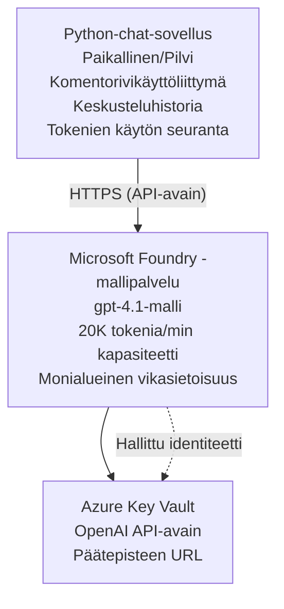

# Microsoft Foundry Models -keskustelusovellus

**Oppimispolku:** Keskitaso ⭐⭐ | **Aika:** 35-45 minuuttia | **Kustannus:** $50-200/kuukausi

Täydellinen Microsoft Foundry Models -keskustelusovellus, joka otetaan käyttöön Azure Developer CLI:n (azd) avulla. Tämä esimerkki näyttää gpt-4.1:n käyttöönoton, suojatun API‑pääsyn ja yksinkertaisen keskustelukäyttöliittymän.

## 🎯 Mitä opit

- Ota käyttöön Microsoft Foundry Models -palvelu gpt-4.1-mallilla
- Suojaa OpenAI API -avaimet Key Vaultilla
- Rakenna yksinkertainen keskustelukäyttöliittymä Pythonilla
- Seuraa tokenien käyttöä ja kustannuksia
- Toteuta pyyntöjen rajoittaminen ja virheenkäsittely

## 📦 Mitä sisältyy

✅ **Microsoft Foundry Models Service** - gpt-4.1-mallin käyttöönotto  
✅ **Python Chat App** - Yksinkertainen komentorivikeskustelukäyttöliittymä  
✅ **Key Vault Integration** - Suojattu API‑avainten tallennus  
✅ **ARM Templates** - Täydellinen infrastruktuuri koodina  
✅ **Cost Monitoring** - Tokenien käytön seuranta  
✅ **Rate Limiting** - Estä käyttökiintiön loppuminen  

## Architecture



## Esivaatimukset

### Vaadittavat

- **Azure Developer CLI (azd)** - [Asennusohje](https://learn.microsoft.com/azure/developer/azure-developer-cli/install-azd)
- **Azure-tilaus**, jossa OpenAI-pääsy - [Pyydä käyttöoikeus](https://aka.ms/oai/access)
- **Python 3.9+** - [Asenna Python](https://www.python.org/downloads/)

### Tarkista esivaatimukset

```bash
# Tarkista azd-versio (vaaditaan 1.5.0 tai uudempi)
azd version

# Varmista Azure-kirjautuminen
azd auth login

# Tarkista Python-versio
python --version  # tai python3 --version

# Varmista OpenAI-pääsy (tarkista Azure-portaalista)
az cognitiveservices account list-skus \
  --kind OpenAI \
  --location eastus
```

> **⚠️ Tärkeää:** Microsoft Foundry Models vaatii sovelluslupahakemuksen. Jos et ole hakenut, käy osoitteessa [aka.ms/oai/access](https://aka.ms/oai/access). Hyväksyntä kestää tyypillisesti 1-2 arkipäivää.

## ⏱️ Käyttöönoton aikataulu

| Vaihe | Kesto | Mitä tapahtuu |
|-------|----------|--------------|
| Esivaatimusten tarkistus | 2-3 minutes | Varmista OpenAI-kiintiön saatavuus |
| Ota infrastruktuuri käyttöön | 8-12 minutes | Luo OpenAI-palvelu, Key Vault ja mallin käyttöönotto |
| Määritä sovellus | 2-3 minutes | Aseta ympäristö ja riippuvuudet |
| **Yhteensä** | **12-18 minutes** | Valmis keskustelemaan gpt-4.1:n kanssa |

**Huom:** Ensimmäinen OpenAI-käyttöönotto voi kestää kauemmin mallin provisioinnin vuoksi.

## Pikakäynnistys

```bash
# Siirry esimerkkiin
cd examples/azure-openai-chat

# Alusta ympäristö
azd env new myopenai

# Ota kaikki käyttöön (infrastruktuuri + konfiguraatio)
azd up
# Sinulta kysytään:
# 1. Valitse Azure-tilaus
# 2. Valitse sijainti, jossa OpenAI on saatavilla (esim. eastus, eastus2, westus)
# 3. Odota 12–18 minuuttia käyttöönoton valmistumista

# Asenna Python-riippuvuudet
pip install -r requirements.txt

# Aloita keskustelu!
python chat.py
```

**Odotettu tulos:**
```
🤖 Microsoft Foundry Models Chat Application
Connected to: gpt-4.1 (eastus)
Type your message (or 'quit' to exit)

You: Hello! Tell me about Microsoft Foundry Models.
Assistant: Microsoft Foundry Models Service provides REST API access to OpenAI's powerful language models including gpt-4.1, GPT-3.5-Turbo, and Embeddings...

[Tokens used: 145 | Estimated cost: $0.0044]
```

## ✅ Vahvista käyttöönotto

### Vaihe 1: Tarkista Azure-resurssit

```bash
# Näytä käyttöön otetut resurssit
azd show

# Odotettu tulostus näyttää:
# - OpenAI-palvelu: (resurssin nimi)
# - Avainvarasto: (resurssin nimi)
# - Käyttöönotto: gpt-4.1
# - Sijainti: eastus (tai valitsemasi alue)
```

### Vaihe 2: Testaa OpenAI API

```bash
# Hae OpenAI-päätepiste ja avain
OPENAI_ENDPOINT=$(azd env get-value AZURE_OPENAI_ENDPOINT)
OPENAI_KEY=$(azd env get-value AZURE_OPENAI_API_KEY)

# Testaa API-kutsu
curl "$OPENAI_ENDPOINT/openai/deployments/gpt-4.1/chat/completions?api-version=2024-08-01-preview" \
  -H "Content-Type: application/json" \
  -H "api-key: $OPENAI_KEY" \
  -d '{
    "messages": [{"role": "user", "content": "Say hello!"}],
    "max_tokens": 50
  }'
```

**Odotettu vastaus:**
```json
{
  "choices": [
    {
      "message": {
        "role": "assistant",
        "content": "Hello! How can I assist you today?"
      }
    }
  ],
  "usage": {
    "prompt_tokens": 8,
    "completion_tokens": 9,
    "total_tokens": 17
  }
}
```

### Vaihe 3: Vahvista Key Vault -käyttöoikeus

```bash
# Luettele salaisuudet Key Vaultissa
KV_NAME=$(azd env get-value AZURE_KEY_VAULT_NAME)

az keyvault secret list \
  --vault-name $KV_NAME \
  --query "[].name" \
  --output table
```

**Odotetut salaisuudet:**
- `openai-api-key`
- `openai-endpoint`

**Onnistumiskriteerit:**
- ✅ OpenAI-palvelu otettu käyttöön gpt-4.1:n kanssa
- ✅ API-kutsu palauttaa kelvollisen vastauksen
- ✅ Salaisuudet tallennettu Key Vaultiin
- ✅ Token-käytön seuranta toimii

## Projektin rakenne

```
azure-openai-chat/
├── README.md                   ✅ This guide
├── azure.yaml                  ✅ AZD configuration
├── infra/                      ✅ Infrastructure as Code
│   ├── main.bicep             ✅ Main Bicep template
│   ├── main.parameters.json   ✅ Parameters
│   └── openai.bicep           ✅ OpenAI resource definition
├── src/                        ✅ Application code
│   ├── chat.py                ✅ Chat interface
│   ├── config.py              ✅ Configuration loader
│   └── requirements.txt       ✅ Python dependencies
└── .gitignore                  ✅ Git ignore rules
```

## Sovelluksen ominaisuudet

### Keskustelukäyttöliittymä (`chat.py`)

Keskustelusovellus sisältää:

- **Keskusteluhistoria** - Säilyttää kontekstin viestien välillä
- **Tokenien laskenta** - Seuraa käyttöä ja arvioi kustannuksia
- **Virheenkäsittely** - Hallitsee siististi rajoituksia ja API-virheitä
- **Kustannusarvio** - Reaaliaikainen kustannuslaskenta per viesti
- **Streaming-tuki** - Valinnaiset suoratoistovastaukset

### Komennot

Chattaillessasi voit käyttää:
- `quit` or `exit` - Lopeta istunto
- `clear` - Tyhjennä keskusteluhistoria
- `tokens` - Näytä kokonaiskäyttö (tokeneina)
- `cost` - Näytä arvioitu kokonaiskustannus

### Konfiguraatio (`config.py`)

Lataa konfiguraatio ympäristömuuttujista:
```python
AZURE_OPENAI_ENDPOINT  # Key Vaultista
AZURE_OPENAI_API_KEY   # Key Vaultista
AZURE_OPENAI_MODEL     # Oletus: gpt-4.1
AZURE_OPENAI_MAX_TOKENS # Oletus: 800
```

## Käyttöesimerkit

### Peruskeskustelu

```bash
python chat.py
```

### Keskustelu mukautetulla mallilla

```bash
export AZURE_OPENAI_MODEL=gpt-35-turbo
python chat.py
```

### Keskustelu suoratoistolla

```bash
python chat.py --stream
```

### Esimerkkikeskustelu

```
You: Explain Microsoft Foundry Models Service in 3 sentences.
Assistant: Microsoft Foundry Models Service is Microsoft Azure's cloud platform offering 
that provides access to OpenAI's powerful language models. It enables developers 
to integrate capabilities like gpt-4.1 into their applications with enterprise-grade 
security and compliance. The service includes features for content filtering, 
abuse monitoring, and responsible AI practices.

[Tokens used: 89 | Estimated cost: $0.0027]

You: What models are available?
Assistant: Microsoft Foundry Models Service offers several model families including gpt-4.1 
(most capable), GPT-3.5-Turbo (faster and cost-effective), and Embeddings models 
for vector search. Each model has different capabilities, pricing, and token limits.

[Tokens used: 67 | Estimated cost: $0.0020]

Total session: 156 tokens | $0.0047
```

## Kustannusten hallinta

### Token-hinnat (gpt-4.1)

| Malli | Syöte (per 1K tokenia) | Tuotos (per 1K tokenia) |
|-------|----------------------|------------------------|
| gpt-4.1 | $0.03 | $0.06 |
| GPT-3.5-Turbo | $0.0015 | $0.002 |

### Arvioidut kuukausikustannukset

Perustuen käyttökuvioihin:

| Käyttötaso | Viestejä/päivä | Tokenit/päivä | Kuukausikustannus |
|-------------|--------------|------------|--------------|
| **Kevyt** | 20 messages | 3,000 tokens | $3-5 |
| **Kohtalainen** | 100 messages | 15,000 tokens | $15-25 |
| **Raskas** | 500 messages | 75,000 tokens | $75-125 |

**Perusinfrastruktuurin kustannus:** $1-2/kuukausi (Key Vault + minimaalinen laskenta)

### Kustannusten optimointivinkkejä

```bash
# 1. Käytä GPT-3.5-Turboa yksinkertaisempiin tehtäviin (20x edullisempi)
export AZURE_OPENAI_MODEL=gpt-35-turbo

# 2. Vähennä maksimitokenien määrää lyhyempiä vastauksia varten
export AZURE_OPENAI_MAX_TOKENS=400

# 3. Seuraa tokenien käyttöä
python chat.py --show-tokens

# 4. Ota käyttöön budjettihälytykset
az consumption budget create \
  --budget-name "openai-budget" \
  --amount 50 \
  --time-grain Monthly
```

## Valvonta

### Näytä tokenien käyttö

```bash
# Azure-portaalissa:
# OpenAI-resurssi → Mittarit → Valitse "Token Transaction"

# Tai Azure CLI:n kautta:
az monitor metrics list \
  --resource $(azd env get-value AZURE_OPENAI_RESOURCE_ID) \
  --metric "TokenTransaction" \
  --start-time $(date -u -d '1 hour ago' '+%Y-%m-%dT%H:%M:%S') \
  --interval PT1M
```

### Näytä API-lokit

```bash
# Diagnostiikkalokkien suoratoisto
az monitor diagnostic-settings create \
  --resource $(azd env get-value AZURE_OPENAI_RESOURCE_ID) \
  --name openai-logs \
  --logs '[{"category": "Audit", "enabled": true}]' \
  --workspace $(azd env get-value LOG_ANALYTICS_WORKSPACE_ID)

# Kyselylokit
az monitor log-analytics query \
  --workspace $(azd env get-value LOG_ANALYTICS_WORKSPACE_ID) \
  --analytics-query "AzureDiagnostics | where Category == 'Audit' | top 10 by TimeGenerated"
```

## Vianmääritys

### Ongelma: "Access Denied" -virhe

**Oireet:** 403 Forbidden API-kutsun yhteydessä

**Ratkaisut:**
```bash
# 1. Varmista, että OpenAI-käyttöoikeus on hyväksytty
az cognitiveservices account show \
  --name $(azd env get-value AZURE_OPENAI_NAME) \
  --resource-group $(azd env get-value AZURE_RESOURCE_GROUP)

# 2. Tarkista, että API-avain on oikea
azd env get-value AZURE_OPENAI_API_KEY

# 3. Varmista, että päätepisteen URL on oikeassa muodossa
azd env get-value AZURE_OPENAI_ENDPOINT
# Pitäisi olla: https://[name].openai.azure.com/
```

### Ongelma: "Rate Limit Exceeded"

**Oireet:** 429 Too Many Requests

**Ratkaisut:**
```bash
# 1. Tarkista nykyinen kiintiö
az cognitiveservices account deployment show \
  --name $(azd env get-value AZURE_OPENAI_NAME) \
  --resource-group $(azd env get-value AZURE_RESOURCE_GROUP) \
  --deployment-name gpt-4.1

# 2. Pyydä kiintiön korotusta (tarvittaessa)
# Siirry Azure-portaaliin → OpenAI-resurssi → Kiintiöt → Pyydä korotusta

# 3. Toteuta uudelleenyrittomekanismi (jo chat.py:ssä)
# Sovellus yrittää automaattisesti uudelleen eksponentiaalisella viiveellä
```

### Ongelma: "Model Not Found"

**Oireet:** 404-virhe käyttöönotossa

**Ratkaisut:**
```bash
# 1. Luettele saatavilla olevat käyttöönotot
az cognitiveservices account deployment list \
  --name $(azd env get-value AZURE_OPENAI_NAME) \
  --resource-group $(azd env get-value AZURE_RESOURCE_GROUP)

# 2. Tarkista mallin nimi ympäristössä
echo $AZURE_OPENAI_MODEL

# 3. Päivitä oikeaan käyttöönoton nimeen
export AZURE_OPENAI_MODEL=gpt-4.1  # tai gpt-35-turbo
```

### Ongelma: Suuri viive

**Oireet:** Hitaat vasteajat (>5 sekuntia)

**Ratkaisut:**
```bash
# 1. Tarkista alueellinen viive
# Ota käyttöön alueelle, joka on lähimpänä käyttäjiä

# 2. Vähennä max_tokens-arvoa nopeampien vastausten saamiseksi
export AZURE_OPENAI_MAX_TOKENS=400

# 3. Käytä suoratoistoa paremman käyttökokemuksen saavuttamiseksi
python chat.py --stream
```

## Turvallisuuden parhaat käytännöt

### 1. Suojaa API-avaimet

```bash
# Älä koskaan lisää avaimia versionhallintaan
# Käytä Key Vaultia (jo määritetty)

# Vaihda avaimia säännöllisesti
az cognitiveservices account keys regenerate \
  --name $(azd env get-value AZURE_OPENAI_NAME) \
  --resource-group $(azd env get-value AZURE_RESOURCE_GROUP) \
  --key-name key1
```

### 2. Toteuta sisällön suodatus

```python
# Microsoft Foundry Models sisältää sisäänrakennetun sisällönsuodatuksen
# Määritä Azure-portaalissa:
# OpenAI-resurssi → Sisällönsuodattimet → Luo mukautettu suodatin

# Luokat: Viha, Seksuaalisuus, Väkivalta, Itsevahingoittelu
# Suodatustasot: Matala, Keskitaso, Korkea
```

### 3. Käytä Managed Identityä (tuotanto)

```bash
# Tuotantokäytössä käytä hallittua identiteettiä
# API-avainten sijaan (edellyttää sovelluksen isännöintiä Azuressa)

# Päivitä infra/openai.bicep niin, että se sisältää:
# identity: { type: 'SystemAssigned' }
```

## Kehitys

### Aja paikallisesti

```bash
# Asenna riippuvuudet
pip install -r src/requirements.txt

# Aseta ympäristömuuttujat
export AZURE_OPENAI_ENDPOINT="https://[name].openai.azure.com/"
export AZURE_OPENAI_API_KEY="your-api-key"
export AZURE_OPENAI_MODEL="gpt-4.1"

# Suorita sovellus
python src/chat.py
```

### Suorita testit

```bash
# Asenna testiriippuvuudet
pip install pytest pytest-cov

# Suorita testit
pytest tests/ -v

# Kattavuuden kanssa
pytest tests/ --cov=src --cov-report=html
```

### Päivitä mallin käyttöönotto

```bash
# Ota käyttöön eri malliversio
az cognitiveservices account deployment create \
  --name $(azd env get-value AZURE_OPENAI_NAME) \
  --resource-group $(azd env get-value AZURE_RESOURCE_GROUP) \
  --deployment-name gpt-35-turbo \
  --model-name gpt-35-turbo \
  --model-version "0613" \
  --model-format OpenAI \
  --sku-capacity 20 \
  --sku-name "Standard"
```

## Siivoaminen

```bash
# Poista kaikki Azure-resurssit
azd down --force --purge

# Tämä poistaa:
# - OpenAI-palvelun
# - Key Vaultin (90 päivän pehmeä poisto käytössä)
# - Resurssiryhmän
# - Kaikki käyttöönotot ja määritykset
```

## Seuraavat askeleet

### Laajenna tätä esimerkkiä

1. **Lisää web-käyttöliittymä** - Rakenna React/Vue-frontend
   ```bash
   # Lisää frontend-palvelu azure.yaml-tiedostoon
   # Julkaise Azure Static Web Apps -palveluun
   ```

2. **Toteuta RAG** - Lisää dokumenttihaku Azure AI Searchilla
   ```python
   # Integroi Azure AI Search
   # Lataa asiakirjat ja luo vektori-indeksi
   ```

3. **Lisää funktiokutsut** - Mahdollista työkalujen käyttö
   ```python
   # Määrittele funktiot tiedostossa chat.py
   # Salli gpt-4.1 kutsua ulkoisia API-rajapintoja
   ```

4. **Monimallinen tuki** - Ota käyttöön useita malleja
   ```bash
   # Lisää gpt-35-turbo- ja upotusmallit
   # Toteuta mallin reitityslogiikka
   ```

### Liittyvät esimerkit

- **[Retail Multi-Agent](../retail-scenario.md)** - Kehittynyt moni-agenttinen arkkitehtuuri
- **[Database App](../../../../examples/database-app)** - Lisää pysyvä tallennus
- **[Container Apps](../../../../examples/container-app)** - Ota käyttöön konttipalveluna

### Oppimisresurssit

- 📚 [AZD For Beginners Course](../../README.md) - Kurssin kotisivu
- 📚 [Microsoft Foundry Models Documentation](https://learn.microsoft.com/azure/ai-services/openai/) - Viralliset dokumentit
- 📚 [OpenAI API Reference](https://platform.openai.com/docs/api-reference) - API-tiedot
- 📚 [Responsible AI](https://www.microsoft.com/ai/responsible-ai) - Parhaat käytännöt

## Lisäresurssit

### Dokumentaatio
- **[Microsoft Foundry Models Service](https://learn.microsoft.com/azure/ai-services/openai/)** - Täydellinen opas
- **[gpt-4.1 Models](https://learn.microsoft.com/azure/ai-services/openai/concepts/models)** - Mallin ominaisuudet
- **[Content Filtering](https://learn.microsoft.com/azure/ai-services/openai/concepts/content-filter)** - Turvaominaisuudet
- **[Azure Developer CLI](https://learn.microsoft.com/azure/developer/azure-developer-cli/)** - azd-referenssi

### Opetusohjelmat
- **[OpenAI Quickstart](https://learn.microsoft.com/azure/ai-services/openai/quickstart)** - Ensimmäinen käyttöönotto
- **[Chat Completions](https://learn.microsoft.com/azure/ai-services/openai/how-to/chatgpt)** - Keskustelusovellusten rakentaminen
- **[Function Calling](https://learn.microsoft.com/azure/ai-services/openai/how-to/function-calling)** - Edistyneet ominaisuudet

### Työkalut
- **[Microsoft Foundry Models Studio](https://oai.azure.com/)** - Verkkopohjainen leikkikenttä
- **[Prompt Engineering Guide](https://platform.openai.com/docs/guides/prompt-engineering)** - Parempien kehotteiden kirjoittaminen
- **[Token Calculator](https://platform.openai.com/tokenizer)** - Arvioi tokenien käyttöä

### Yhteisö
- **[Azure AI Discord](https://discord.gg/azure)** - Hae apua yhteisöltä
- **[GitHub Discussions](https://github.com/Azure-Samples/openai/discussions)** - Kysymys- ja vastausfoorumi
- **[Azure Blog](https://azure.microsoft.com/blog/tag/azure-openai-service/)** - Viimeisimmät päivitykset

---

**🎉 Onnistui!** Olet ottanut Microsoft Foundry Modelsin käyttöön ja rakentanut toimivan keskustelusovelluksen. Ala tutkia gpt-4.1:n kykyjä ja kokeilla erilaisia kehotteita ja käyttötapauksia.

**Kysyttävää?** [Avaa issue](https://github.com/microsoft/AZD-for-beginners/issues) tai katso [UKK](../../resources/faq.md)

**Kustannusvaroitus:** Muista suorittaa `azd down` testauksen jälkeen välttääksesi jatkuvat maksut (noin $50-100/kuukausi aktiivisesta käytöstä).

---

<!-- CO-OP TRANSLATOR DISCLAIMER START -->
**Vastuuvapauslauseke**:
Tämä asiakirja on käännetty käyttämällä tekoälypohjaista käännöspalvelua [Co-op Translator](https://github.com/Azure/co-op-translator). Vaikka pyrimme tarkkuuteen, otathan huomioon, että automaattiset käännökset saattavat sisältää virheitä tai epätarkkuuksia. Alkuperäinen asiakirja sen alkuperäiskielellä on virallinen lähde. Tärkeissä asioissa suositellaan ammattimaista ihmiskäännöstä. Emme ole vastuussa tämän käännöksen käytöstä aiheutuvista väärinymmärryksistä tai tulkinnoista.
<!-- CO-OP TRANSLATOR DISCLAIMER END -->