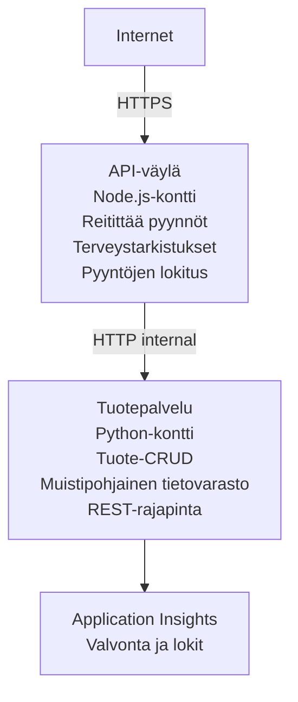

# Microservices Architecture - Container App Example

⏱️ **Arvioitu aika**: 25-35 minuuttia | 💰 **Arvioitu kustannus**: ~$50-100/kuukausi | ⭐ **Monimutkaisuus**: Edistynyt

Yksinkertaistettu mutta toimiva mikropalveluarkkitehtuuri julkaistuna Azure Container Apps -palveluun käyttäen AZD CLI:tä. Tämä esimerkki havainnollistaa palveluiden välistä viestintää, konttien orkestrointia ja valvontaa käytännöllisellä 2-palvelun kokoonpanolla.

> **📚 Oppimistapa**: Tämä esimerkki alkaa vähimmäistason 2-palveluarkkitehtuurilla (API Gateway + Backend Service), jonka voit oikeasti ottaa käyttöön ja oppia siitä. Kun hallitset tämän perustan, annamme ohjeita laajentamiseen täydelliseksi mikropalvelu-ekosysteemiksi.

## Mitä opit

Tästä esimerkistä suoritettuna opit:
- Julkaisemaan useita kontteja Azure Container Appsiin
- Toteuttamaan palveluiden välistä viestintää sisäisellä verkottumisella
- Konfiguroimaan ympäristöön perustuvan autoskaalauksen ja terveystarkastukset
- Valvomaan hajautettuja sovelluksia Application Insightsilla
- Ymmärtämään mikropalveluiden käyttöönotto- ja arkkitehtuurimalleja sekä parhaat käytännöt
- Oppimaan vaiheittaista laajentumista yksinkertaisesta monimutkaiseen arkkitehtuuriin

## Arkkitehtuuri

### Vaihe 1: Mitä rakennamme (sisältyy tähän esimerkkiin)


**Miksi aloittaa yksinkertaisella?**
- ✅ Nopeasti otettavissa käyttöön ja ymmärrettävissä (25-35 minuuttia)
- ✅ Opit keskeiset mikropalvelumallit ilman monimutkaisuutta
- ✅ Toimiva koodi, jota voit muokata ja kokeilla
- ✅ Edullisemmat oppimiskustannukset (~$50-100/kuukausi vs $300-1400/kuukausi)
- ✅ Rakenna varmuutta ennen tietokantojen ja viestijonojen lisäämistä

**Analogiana**: Ajattele tätä kuin ajamisen oppimista. Aloitat tyhjällä parkkipaikalla (2 palvelua), hallitset perusteet ja edistyt sitten kaupunkiliikenteeseen (5+ palvelua tietokantoineen).

### Vaihe 2: Tuleva laajennus (viitearkkitehtuuri)

Kun hallitset 2-palveluarkkitehtuurin, voit laajentaa seuraavasti:

```
Full Architecture (Not Included - For Reference)
├── API Gateway (✅ Included)
├── Product Service (✅ Included)
├── Order Service (🔜 Add next)
├── User Service (🔜 Add next)
├── Notification Service (🔜 Add last)
├── Azure Service Bus (🔜 For async communication)
├── Cosmos DB (🔜 For product persistence)
├── Azure SQL (🔜 For order management)
└── Azure Storage (🔜 For file storage)
```

Katso "Expansion Guide" -osio lopusta vaiheittaisia ohjeita.

## Sisältyvät ominaisuudet

✅ **Service Discovery**: DNS-pohjainen automaattinen tunnistus konttien välillä  
✅ **Kuormanjako**: Sisäänrakennettu kuormantasaus replikoiden välillä  
✅ **Automaattinen skaalautuminen**: Riippumaton skaalautuminen palvelukohtaisesti HTTP-pyyntöjen perusteella  
✅ **Terveysvalvonta**: Liveness- ja readiness-probit molemmille palveluille  
✅ **Hajautettu lokitus**: Keskitetty lokitus Application Insightsilla  
✅ **Sisäinen verkotus**: Turvallinen palveluiden välinen viestintä  
✅ **Konttien orkestrointi**: Automaattinen käyttöönotto ja skaalaus  
✅ **Nolla-viiveiset päivitykset**: Rolling-päivitykset revisiohallinnalla  

## Esivaatimukset

### Vaadittavat työkalut

Ennen aloittamista varmista, että sinulla on seuraavat työkalut asennettuna:

1. **[Azure Developer CLI (azd)](https://learn.microsoft.com/azure/developer/azure-developer-cli/install-azd)** (versio 1.0.0 tai uudempi)
   ```bash
   azd version
   # Odotettu tulos: azd-versio 1.0.0 tai uudempi
   ```

2. **[Azure CLI](https://learn.microsoft.com/cli/azure/install-azure-cli)** (versio 2.50.0 tai uudempi)
   ```bash
   az --version
   # Odotettu tuloste: azure-cli 2.50.0 tai uudempi
   ```

3. **[Docker](https://www.docker.com/get-started)** (paikalliseen kehitykseen/testaukseen - valinnainen)
   ```bash
   docker --version
   # Odotettu tulostus: Docker-versio 20.10 tai uudempi
   ```

### Azure-vaatimukset

- Avoinna oleva **Azure-tilaus** ([luo ilmainen tili](https://azure.microsoft.com/free/))
- Oikeudet luoda resursseja tilillesi
- **Contributor**-rooli tilillä tai resurssiryhmällä

### Tietopohja

Tämä on **edistynyt** esimerkki. Sinun tulisi olla:
- Suorittanut [Simple Flask API example](../../../../../examples/container-app/simple-flask-api) 
- Peruskäsitys mikropalveluarkkitehtuurista
- Tuntemus REST-rajapinnoista ja HTTP:stä
- Ymmärrys konttikäsitteistä

**Uutta Container Appseissa?** Aloita ensin [Simple Flask API example](../../../../../examples/container-app/simple-flask-api) oppiaksesi perusteet.

## Pika-aloitus (Vaiheittain)

### Vaihe 1: kloonaa ja siirry kansioon

```bash
git clone https://github.com/microsoft/AZD-for-beginners.git
cd AZD-for-beginners/examples/container-app/microservices
```

**✓ Onnistumistarkistus**: Varmista, että näet `azure.yaml`:
```bash
ls
# Odotettu: README.md, azure.yaml, infra/, src/
```

### Vaihe 2: Kirjaudu Azureen

```bash
azd auth login
```

Tämä avaa selaimesi Azure-todennusta varten. Kirjaudu sisään Azure-tunnuksillasi.

**✓ Onnistumistarkistus**: Sinun pitäisi nähdä:
```
Logged in to Azure.
```

### Vaihe 3: Alusta ympäristö

```bash
azd init
```

**Kysymykset, jotka näet**:
- **Environment name**: Anna lyhyt nimi (esim. `microservices-dev`)
- **Azure subscription**: Valitse tilauksesi
- **Azure location**: Valitse alue (esim. `eastus`, `westeurope`)

**✓ Onnistumistarkistus**: Sinun pitäisi nähdä:
```
SUCCESS: New project initialized!
```

### Vaihe 4: Ota infrastruktuuri ja palvelut käyttöön

```bash
azd up
```

**Mitä tapahtuu** (kestää 8-12 minuuttia):
1. Luo Container Apps -ympäristön
2. Luo Application Insights valvontaa varten
3. Rakenna API Gateway -kontti (Node.js)
4. Rakenna Product Service -kontti (Python)
5. Julkaisee molemmat kontit Azureen
6. Konfiguroi verkotus ja terveystarkastukset
7. Määrittää valvonta ja lokitus

**✓ Onnistumistarkistus**: Sinun pitäisi nähdä:
```
SUCCESS: Your application was deployed to Azure in X minutes Y seconds.
Endpoint: https://api-gateway-<unique-id>.azurecontainerapps.io
```

**⏱️ Aika**: 8-12 minuuttia

### Vaihe 5: Testaa käyttöönotto

```bash
# Hae yhdyskäytävän päätepiste
GATEWAY_URL=$(azd env get-values | grep API_GATEWAY_URL | cut -d '=' -f2 | tr -d '"')

# Testaa API-yhdyskäytävän kunto
curl $GATEWAY_URL/health

# Odotettu tuloste:
# {"status":"terve","service":"api-gateway","timestamp":"2025-11-19T10:30:00Z"}
```

**Testaa tuote-palvelu gatewayn kautta**:
```bash
# Listaa tuotteet
curl $GATEWAY_URL/api/products

# Odotettu tulos:
# [
#   {"id":1,"name":"Kannettava tietokone","price":999.99,"stock":50},
#   {"id":2,"name":"Hiiri","price":29.99,"stock":200},
#   {"id":3,"name":"Näppäimistö","price":79.99,"stock":150}
# ]
```

**✓ Onnistumistarkistus**: Molemmat päätepisteet palauttavat JSON-dataa ilman virheitä.

---

**🎉 Onnittelut!** Olet julkaissut mikropalveluarkkitehtuurin Azureen!

## Projektin rakenne

Kaikki toteutustiedostot sisältyvät—täydellinen, toimiva esimerkki:

```
microservices/
│
├── README.md                         # This file
├── azure.yaml                        # AZD configuration
├── .gitignore                        # Git ignore patterns
│
├── infra/                           # Infrastructure as Code (Bicep)
│   ├── main.bicep                   # Main orchestration
│   ├── abbreviations.json           # Naming conventions
│   ├── core/                        # Shared infrastructure
│   │   ├── container-apps-environment.bicep  # Container environment + registry
│   │   └── monitor.bicep            # Application Insights + Log Analytics
│   └── app/                         # Service definitions
│       ├── api-gateway.bicep        # API Gateway container app
│       └── product-service.bicep    # Product Service container app
│
└── src/                             # Application source code
    ├── api-gateway/                 # Node.js API Gateway
    │   ├── app.js                   # Express server with routing
    │   ├── package.json             # Node dependencies
    │   └── Dockerfile               # Container definition
    └── product-service/             # Python Product Service
        ├── main.py                  # Flask API with product data
        ├── requirements.txt         # Python dependencies
        └── Dockerfile               # Container definition
```

**Mitä kukin komponentti tekee:**

**Infrastructure (infra/)**:
- `main.bicep`: Orkestroi kaikki Azure-resurssit ja niiden riippuvuudet
- `core/container-apps-environment.bicep`: Luo Container Apps -ympäristön ja Azure Container Registryn
- `core/monitor.bicep`: Asettaa Application Insightsin hajautettuun lokitukseen
- `app/*.bicep`: Yksittäiset container app -määritelmät skaalaus- ja terveystarkastuksineen

**API Gateway (src/api-gateway/)**:
- Julkinen palvelu, joka reitittää pyynnöt taustapalveluille
- Toteuttaa lokituksen, virheenkäsittelyn ja pyynnön välityksen
- Havainnollistaa palveluiden välistä HTTP-viestintää

**Product Service (src/product-service/)**:
- Sisäinen palvelu, jossa on tuotekatalogi (muistissa yksinkertaisuuden vuoksi)
- REST-rajapinta terveystarkastuksilla
- Esimerkki taustapalvelumallista

## Palveluiden yleiskatsaus

### API Gateway (Node.js/Express)

**Portti**: 8080  
**Käyttö**: Julkinen (ulkoisen ingressin kautta)  
**Tarkoitus**: Reitittää saapuvat pyynnöt oikeille taustapalveluille  

**Päätepisteet**:
- `GET /` - Palvelutiedot
- `GET /health` - Terveystarkastus
- `GET /api/products` - Välittää product service -palvelulle (listaa kaikki)
- `GET /api/products/:id` - Välittää product service -palvelulle (hakee id:llä)

**Keskeiset ominaisuudet**:
- Pyynnön reititys axiosilla
- Keskitetty lokitus
- Virheenkäsittely ja aikakatkaisujen hallinta
- Palvelun löytäminen ympäristömuuttujien kautta
- Application Insights -integraatio

**Koodin kohokohta** (`src/api-gateway/app.js`):
```javascript
// Sisäisten palveluiden välinen viestintä
app.get('/api/products', async (req, res) => {
  const response = await axios.get(`${PRODUCT_SERVICE_URL}/products`);
  res.json(response.data);
});
```

### Product Service (Python/Flask)

**Portti**: 8000  
**Käyttö**: Vain sisäinen (ei ulkoista ingressiä)  
**Tarkoitus**: Hallinnoi tuotekatalogia muistissa  

**Päätepisteet**:
- `GET /` - Palvelutiedot
- `GET /health` - Terveystarkastus
- `GET /products` - Listaa kaikki tuotteet
- `GET /products/<id>` - Hakee tuotteen ID:n perusteella

**Keskeiset ominaisuudet**:
- RESTful-rajapinta Flaskilla
- Muistissa oleva tuotetietokanta (yksinkertainen, ei tarvetta tietokannalle)
- Terveystarkastukset probeilla
- Rakenteellinen lokitus
- Application Insights -integraatio

**Tietomalli**:
```python
{
  "id": 1,
  "name": "Laptop",
  "description": "High-performance laptop",
  "price": 999.99,
  "stock": 50
}
```

**Miksi vain sisäinen?**
Product service ei ole julkisesti näkyvissä. Kaikki pyynnöt on kuljetettava API Gatewayn kautta, joka tarjoaa:
- Turvallisuus: Hallittu pääsykohta
- Joustavuus: Taustapalvelun voi vaihtaa vaikuttamatta asiakkaisiin
- Valvonta: Keskitetty pyyntöjen lokitus

## Palveluiden välisen viestinnän ymmärtäminen

### Miten palvelut keskustelevat keskenään

Tässä esimerkissä API Gateway kommunikoi Product Servicen kanssa käyttämällä **sisäisiä HTTP-kutsuja**:

```javascript
// API-välityspalvelin (src/api-gateway/app.js)
const PRODUCT_SERVICE_URL = process.env.PRODUCT_SERVICE_URL;

// Tee sisäinen HTTP-pyyntö
const response = await axios.get(`${PRODUCT_SERVICE_URL}/products`);
```

**Tärkeimmät kohdat**:

1. **DNS-pohjainen löytyminen**: Container Apps tarjoaa automaattisesti DNS:n sisäisille palveluille
   - Product Servicen FQDN: `product-service.internal.<environment>.azurecontainerapps.io`
   - Yksinkertaistettuna: `http://product-service` (Container Apps ratkaisee sen)

2. **Ei julkista altistusta**: Product Servicellä on Bicepissä `external: false`
   - Käytettävissä vain Container Apps -ympäristön sisällä
   - Ei saavutettavissa internetistä

3. **Ympäristömuuttujat**: Palvelu-URL:t injektoidaan käyttöönottoasennossa
   - Bicep välittää sisäisen FQDN:n gatewaylle
   - Ei kovakoodattuja URL-osoitteita sovelluskoodissa

**Analogiana**: Ajattele tätä kuin toimiston huoneita. API Gateway on vastaanottotiski (julkinen), ja Product Service on toimiston huone (vain sisäinen). Vierailijoiden täytyy mennä vastaanoton kautta päästäkseen huoneeseen.

## Käyttöönottoasetukset

### Täysi käyttöönotto (suositeltu)

```bash
# Ota käyttöön infrastruktuuri ja molemmat palvelut
azd up
```

Tämä ottaa käyttöön:
1. Container Apps -ympäristön
2. Application Insightsin
3. Container Registryn
4. API Gateway -kontin
5. Product Service -kontin

**Aika**: 8-12 minuuttia

### Ota käyttöön yksittäinen palvelu

```bash
# Ota käyttöön vain yksi palvelu (ensimmäisen azd up -komennon jälkeen)
azd deploy api-gateway

# Tai ota käyttöön tuotepalvelu
azd deploy product-service
```

**Käyttötapaus**: Kun olet päivittänyt koodia yhdessä palvelussa ja haluat ottaa vain sen palvelun uudelleen käyttöön.

### Päivitä konfiguraatio

```bash
# Muuta skaalausparametreja
azd env set GATEWAY_MAX_REPLICAS 30

# Ota uudelleen käyttöön uusi konfiguraatio
azd up
```

## Konfiguraatio

### Skaalausasetukset

Molemmat palvelut on konfiguroitu HTTP-pohjaisella autoskaalauksella niiden Bicep-tiedostoissa:

**API Gateway**:
- Minimi-replikat: 2 (aina vähintään 2 saatavuuden vuoksi)
- Maksimi-replikat: 20
- Skaalauslaukaisin: 50 samanaikaista pyyntöä per replika

**Product Service**:
- Minimi-replikat: 1 (voi skaalautua nollaan tarvittaessa)
- Maksimi-replikat: 10
- Skaalauslaukaisin: 100 samanaikaista pyyntöä per replika

**Mukauta skaalausta** (kohdassa `infra/app/*.bicep`):
```bicep
scale: {
  minReplicas: 1
  maxReplicas: 10
  rules: [
    {
      name: 'http-scale-rule'
      http: {
        metadata: {
          concurrentRequests: '100'  // Adjust this
        }
      }
    }
  ]
}
```

### Resurssien allokointi

**API Gateway**:
- CPU: 1.0 vCPU
- Muisti: 2 GiB
- Syynä: Käsittelee kaiken ulkoisen liikenteen

**Product Service**:
- CPU: 0.5 vCPU
- Muisti: 1 GiB
- Syynä: Kevyt muistipohjainen toiminta

### Terveystarkastukset

Molemmat palvelut sisältävät liveness- ja readiness-probit:

```bicep
probes: [
  {
    type: 'Liveness'
    httpGet: {
      path: '/health'
      port: 8080
    }
    initialDelaySeconds: 10
    periodSeconds: 30
  }
  {
    type: 'Readiness'
    httpGet: {
      path: '/health'
      port: 8080
    }
    initialDelaySeconds: 5
    periodSeconds: 10
  }
]
```

**Mitä tämä tarkoittaa**:
- **Liveness**: Jos terveystarkastus epäonnistuu, Container Apps käynnistää kontin uudelleen
- **Readiness**: Jos ei ole valmis, Container Apps lopettaa liikenteen reitittämisen kyseiselle replikalle


## Valvonta ja havaittavuus

### Näytä palvelulogit

```bash
# Näytä lokit käyttämällä azd monitoria
azd monitor --logs

# Tai käytä Azure CLI:tä tiettyihin Container Apps -sovelluksiin:
# Suoratoista lokit API-gatewaysta
az containerapp logs show --name api-gateway --resource-group $RG_NAME --follow

# Näytä tuotepalvelun äskettäiset lokit
az containerapp logs show --name product-service --resource-group $RG_NAME --tail 100
```

**Odotettu tulos**:
```
[api-gateway] API Gateway listening on port 8080
[api-gateway] Product Service URL: http://product-service
[api-gateway] GET /api/products 200 - 45ms
[product-service] Retrieved 5 products
```

### Application Insights -kyselyt

Avaa Application Insights Azure-portaalissa ja suorita nämä kyselyt:

**Hidaspyyntöjen löytäminen**:
```kusto
requests
| where timestamp > ago(1h)
| where duration > 1000  // Requests taking >1 second
| summarize count() by name, cloud_RoleName
| order by count_ desc
```

**Palveluiden välisen kutsuketjun seuraaminen**:
```kusto
dependencies
| where timestamp > ago(1h)
| where type == "Http"
| project timestamp, name, target, duration, success
| order by timestamp desc
```

**Virheiden määrä palvelmittain**:
```kusto
exceptions
| where timestamp > ago(24h)
| summarize errorCount = count() by cloud_RoleName, type
| order by errorCount desc
```

**Pyyntöjen määrä ajan funktiona**:
```kusto
requests
| where timestamp > ago(1h)
| summarize requestCount = count() by bin(timestamp, 5m), cloud_RoleName
| render timechart
```

### Pääsy valvontapaneeliin

```bash
# Hae Application Insights -tiedot
azd env get-values | grep APPLICATIONINSIGHTS

# Avaa Azure-portaalin valvonta
az monitor app-insights component show \
  --app $(azd env get-values | grep APPLICATIONINSIGHTS_CONNECTION_STRING | cut -d '=' -f2) \
  --resource-group $(azd env get-values | grep AZURE_RESOURCE_GROUP | cut -d '=' -f2) \
  --query "appId" -o tsv
```

### Live-mittarit

1. Siirry Application Insightsiin Azure-portaalissa
2. Klikkaa "Live Metrics"
3. Näet reaaliaikaiset pyynnöt, epäonnistumiset ja suorituskyvyn
4. Testaa ajamalla: `curl $(azd env get-values | grep API_GATEWAY_URL | cut -d '=' -f2 | tr -d '"')/api/products`

## Käytännön harjoitukset

[Note: See full exercises above in the "Practical Exercises" section for detailed step-by-step exercises including deployment verification, data modification, autoscaling tests, error handling, and adding a third service.]

## Kustannusanalyysi

### Arvioidut kuukausikustannukset (tälle 2-palveluesimerkille)

| Resurssi | Konfiguraatio | Arvioitu kustannus |
|----------|--------------|--------------------|
| API Gateway | 2-20 replikaa, 1 vCPU, 2GB RAM | $30-150 |
| Product Service | 1-10 replikaa, 0.5 vCPU, 1GB RAM | $15-75 |
| Container Registry | Perustaso | $5 |
| Application Insights | 1-2 GB/kuukausi | $5-10 |
| Log Analytics | 1 GB/kuukausi | $3 |
| **Yhteensä** | | **$58-243/kuukausi** |

**Kustannusjako käytön mukaan**:
- **Kevyt liikenne** (testaus/oppiminen): ~$60/kuukausi
- **Kohtalainen liikenne** (pieni tuotanto): ~$120/kuukausi
- **Kova liikenne** (ruuhkainen): ~$240/kuukausi

### Kustannusten optimointivinkkejä

1. **Skaalaa nollaan kehityksessä**:
   ```bicep
   scale: {
     minReplicas: 0  // Save $30-40/month when not in use
     maxReplicas: 10
   }
   ```

2. **Käytä Cosmos DB:lle Consumption-plania** (kun lisäät sen):
   - Maksa vain käytöstäsi
   - Ei vähimmäismaksua

3. **Aseta Application Insightsin sampling**:
   ```javascript
   appInsights.defaultClient.config.samplingPercentage = 50; // Ota 50 % pyynnöistä näyte.
   ```

4. **Siivoa kun et tarvitse**:
   ```bash
   azd down
   ```

### Ilmainen taso vaihtoehdot

Oppimista/testausta varten harkitse:
- Käytä Azure-ilmaiskrediittejä (ensimmäiset 30 päivää)
- Pidä replikoiden määrä minimissä
- Poista testaamisen jälkeen (ei jatkuvia kuluja)

---

## Siivous

Välttääksesi jatkuvia kuluja, poista kaikki resurssit:

```bash
azd down --force --purge
```

**Vahvistuskehotus**:
```
? Total resources to delete: 6, are you sure you want to continue? (y/N)
```

Kirjoita `y` vahvistaaksesi.

**Mitä poistetaan**:
- Container Apps -ympäristö
- Molemmat Container Apps -sovellukset (gateway ja tuotepalvelu)
- Container Registry
- Application Insights
- Log Analytics Workspace
- Resource Group

**✓ Vahvista siivous**:
```bash
az group list --query "[?starts_with(name,'rg-microservices')]" --output table
```

Sen pitäisi palauttaa tyhjä.

---

## Laajennusopas: 2:sta 5+ palveluun

Kun olet hallinnut tämän 2-palvelun arkkitehtuurin, näin voit laajentaa:

### Vaihe 1: Lisää tietokantapysyvyys (seuraava askel)

**Lisää Cosmos DB tuotepalvelulle**:

1. Luo `infra/core/cosmos.bicep`:
   ```bicep
   resource cosmosAccount 'Microsoft.DocumentDB/databaseAccounts@2023-04-15' = {
     name: name
     location: location
     kind: 'GlobalDocumentDB'
     properties: {
       databaseAccountOfferType: 'Standard'
       locations: [{ locationName: location, failoverPriority: 0 }]
     }
   }
   ```

2. Päivitä tuotepalvelu käyttämään Cosmos DB:tä muistissa olevan datan sijaan

3. Arvioitu lisäkustannus: ~$25/month (serverless)

### Vaihe 2: Lisää kolmas palvelu (tilaushallinta)

**Luo tilauspalvelu**:

1. Uusi kansio: `src/order-service/` (Python/Node.js/C#)
2. Uusi Bicep: `infra/app/order-service.bicep`
3. Päivitä API Gateway reitittämään `/api/orders`
4. Lisää Azure SQL Database tilausten pysyvyyttä varten

**Arkkitehtuuri muuttuu**:
```
API Gateway → Product Service (Cosmos DB)
           → Order Service (Azure SQL)
```

### Vaihe 3: Lisää asynkroninen viestintä (Service Bus)

**Toteuta tapahtumapohjainen arkkitehtuuri**:

1. Lisää Azure Service Bus: `infra/core/servicebus.bicep`
2. Tuotepalvelu julkaisee "ProductCreated" -tapahtumia
3. Tilauspalvelu tilaa tuotetapahtumia
4. Lisää ilmoituspalvelu käsittelemään tapahtumia

**Malli**: Pyyntö/Vastaus (HTTP) + Tapahtumapohjainen (Service Bus)

### Vaihe 4: Lisää käyttäjän todennus

**Toteuta käyttäjäpalvelu**:

1. Luo `src/user-service/` (Go/Node.js)
2. Lisää Azure AD B2C tai mukautettu JWT-todennus
3. API Gateway validoi tokenit
4. Palvelut tarkistavat käyttäjäoikeudet

### Vaihe 5: Tuotantovalmius

**Lisää nämä komponentit**:
- Azure Front Door (globaali kuormantasaus)
- Azure Key Vault (salaisuuksien hallinta)
- Azure Monitor Workbooks (mukautetut kojelaudat)
- CI/CD-putki (GitHub Actions)
- Blue-Green -käyttöönotot
- Hallittu identiteetti kaikille palveluille

**Koko tuotantoarkkitehtuurin kustannus**: ~300–1 400 $/kk

---

## Lisätietoja

### Lisädokumentaatio
- [Azure Container Apps -dokumentaatio](https://learn.microsoft.com/azure/container-apps/)
- [Mikropalveluarkkitehtuurin opas](https://learn.microsoft.com/azure/architecture/guide/architecture-styles/microservices)
- [Application Insights hajautettuun jäljitykseen](https://learn.microsoft.com/azure/azure-monitor/app/distributed-tracing)
- [Azure Developer CLI -dokumentaatio](https://learn.microsoft.com/azure/developer/azure-developer-cli/)

### Seuraavat vaiheet tässä kurssissa
- ← Edellinen: [Yksinkertainen Flask-API](../../../../../examples/container-app/simple-flask-api) - Aloittelijan yhden säilön esimerkki
- → Seuraava: [AI-integraatio-opas](../../../../../examples/docs/ai-foundry) - Lisää tekoälymahdollisuuksia
- 🏠 [Kurssin etusivu](../../README.md)

### Vertailu: Milloin käyttää mitä

**Yksittäinen säilösovellus** (Yksinkertainen Flask-API -esimerkki):
- ✅ Yksinkertaiset sovellukset
- ✅ Monoliittinen arkkitehtuuri
- ✅ Nopea käyttöönotto
- ❌ Rajoitettu skaalautuvuus
- **Kustannus**: ~15–50 $/kk

**Mikropalvelut** (Tämä esimerkki):
- ✅ Monimutkaiset sovellukset
- ✅ Palvelukohtainen itsenäinen skaalaus
- ✅ Tiimin autonomia (eri palvelut, eri tiimit)
- ❌ Hallittavuus monimutkaisempi
- **Kustannus**: ~60–250 $/kk

**Kubernetes (AKS)**:
- ✅ Suurin mahdollinen hallinta ja joustavuus
- ✅ Monipilvi-siirrettävyys
- ✅ Kehittynyt verkotus
- ❌ Vaatinee Kubernetes-osaamista
- **Kustannus**: vähintään ~150–500 $/kk

**Suositus**: Aloita Container Appsilla (tämä esimerkki), siirry AKS:iin vain, jos tarvitset Kubernetesiin liittyviä ominaisuuksia.

---

## Usein kysytyt kysymykset

**K: Miksi vain 2 palvelua 5+:n sijaan?**  
V: Opetuksellinen eteneminen. Hallitse perusteet (palvelujen välinen viestintä, valvonta, skaalaus) yksinkertaisella esimerkillä ennen monimutkaisuuden lisäämistä. Tässä opitut mallit pätevät myös 100-palvelun arkkitehtuureihin.

**K: Voinko lisätä lisää palveluita itse?**  
V: Ehdottomasti! Noudata yllä olevaa laajennusopasta. Jokainen uusi palvelu noudattaa samaa kaavaa: luo src-kansio, luo Bicep-tiedosto, päivitä azure.yaml, ota käyttöön.

**K: Onko tämä tuotantovalmis?**  
V: Se on hyvä perusta. Tuotantoon lisää: hallittu identiteetti, Key Vault, pysyvät tietokannat, CI/CD-putki, valvonta-hälytykset ja varmuuskopiointistrategia.

**K: Miksi ei käytetä Dapr:ia tai muuta palveluverkkoa?**  
V: Pidä asiat yksinkertaisina oppimista varten. Kun ymmärrät Container Appsin natiiviverkottumisen, voit lisätä Dapr:in edistyneempiin skenaarioihin.

**K: Miten debuggaan paikallisesti?**  
V: Aja palvelut paikallisesti Dockerilla:
```bash
cd src/api-gateway
docker build -t local-gateway .
docker run -p 8080:8080 -e PRODUCT_SERVICE_URL=http://localhost:8000 local-gateway
```

**K: Voinko käyttää eri ohjelmointikieliä?**  
V: Kyllä! Tämä esimerkki käyttää Node.js:ää (gateway) + Pythonia (tuotepalvelu). Voit yhdistellä mitä tahansa säilöissä toimivia kieliä.

**K: Entä jos minulla ei ole Azure-krediittejä?**  
V: Käytä Azure-ilmaistasoa (ensimmäiset 30 päivää uusille tileille) tai ota käyttöönotto vain lyhyeksi testijaksoksi ja poista välittömästi.

---

> **🎓 Oppimispolun yhteenveto**: Olet oppinut ottamaan käyttöön monipalveluarkkitehtuurin automaattisella skaalauksella, sisäisellä verkottumisella, keskitetyn valvonnan ja tuotantovalmiiden mallien avulla. Tämä perusta valmistaa sinut monimutkaisiin hajautettuihin järjestelmiin ja yritystason mikropalveluarkkitehtuureihin.

**📚 Kurssin navigointi:**
- ← Edellinen: [Yksinkertainen Flask-API](../../../../../examples/container-app/simple-flask-api)
- → Seuraava: [Tietokanta-integraatioesimerkki](../../../../../examples/database-app)
- 🏠 [Kurssin etusivu](../../../README.md)
- 📖 [Container Apps -parhaat käytännöt](../../../docs/chapter-04-infrastructure/deployment-guide.md)

---

<!-- CO-OP TRANSLATOR DISCLAIMER START -->
**Vastuuvapauslauseke**:
Tämä asiakirja on käännetty käyttäen tekoälypohjaista käännöspalvelua [Co-op Translator](https://github.com/Azure/co-op-translator). Vaikka pyrimme tarkkuuteen, huomioithan, että automaattiset käännökset saattavat sisältää virheitä tai epätarkkuuksia. Alkuperäistä asiakirjaa sen alkuperäisellä kielellä on pidettävä määräyksenä olevaa lähdettä. Tärkeän tiedon osalta suositellaan ammattimaista ihmiskäännöstä. Emme ole vastuussa tämän käännöksen käytöstä johtuvista väärinymmärryksistä tai virhetulkintojen seurauksista.
<!-- CO-OP TRANSLATOR DISCLAIMER END -->