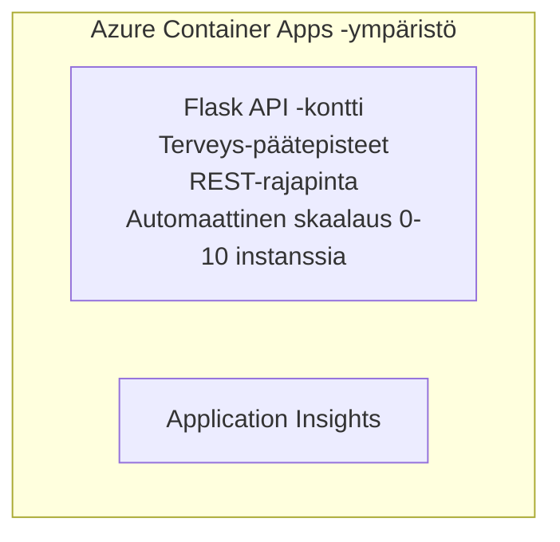

# Yksinkertainen Flask-API - Container App -esimerkki

**Oppimispolku:** Aloittelija ⭐ | **Aika:** 25-35 minuuttia | **Kustannus:** $0-15/month

Täydellinen, toimiva Python Flask REST API, joka on otettu käyttöön Azure Container Appsissa Azure Developer CLI:llä (azd). Tämä esimerkki demonstroi konttien julkaisemista, automaattista skaalausta ja valvonnan perusteita.

## 🎯 Mitä opit

- Julkaista konttisoitu Python-sovellus Azureen
- Konfiguroida automaattinen skaalaus, mukaan lukien skaalaus nollaan
- Toteuttaa health probeja ja readiness-tarkistuksia
- Valvoa sovelluksen lokitietoja ja mittareita
- Käyttää Azure Developer CLI:tä nopeaan käyttöönottoon

## 📦 Mitä sisältyy

✅ **Flask Application** - Täydellinen REST API CRUD-operaatioilla (`src/app.py`)  
✅ **Dockerfile** - Tuotantovalmiin kontin konfiguraatio  
✅ **Bicep Infrastructure** - Container Apps -ympäristö ja API-julkaisu  
✅ **AZD Configuration** - Yhdellä komennolla toimiva käyttöönotto  
✅ **Health Probes** - Konfiguroidut liveness- ja readiness-tarkistukset  
✅ **Auto-scaling** - 0-10 instanssia HTTP-kuorman mukaan  

## Architecture



## Esivaatimukset

### Tarvittavat
- **Azure Developer CLI (azd)** - [Asennusohje](https://learn.microsoft.com/azure/developer/azure-developer-cli/install-azd)
- **Azure subscription** - [Free account](https://azure.microsoft.com/free/)
- **Docker Desktop** - [Install Docker](https://www.docker.com/products/docker-desktop/) (paikalliseen testaamiseen)

### Varmista esivaatimukset

```bash
# Tarkista azd-versio (vaaditaan 1.5.0 tai uudempi)
azd version

# Varmista Azure-kirjautuminen
azd auth login

# Tarkista Docker (valinnainen, paikallista testausta varten)
docker --version
```

## ⏱️ Julkaisun aikataulu

| Phase | Duration | What Happens |
|-------|----------|--------------||
| Environment setup | 30 seconds | Create azd environment |
| Build container | 2-3 minutes | Docker build Flask app |
| Provision infrastructure | 3-5 minutes | Create Container Apps, registry, monitoring |
| Deploy application | 2-3 minutes | Push image and deploy to Container Apps |
| **Total** | **8-12 minutes** | Complete deployment ready |

## Nopea aloitus

```bash
# Siirry esimerkkiin
cd examples/container-app/simple-flask-api

# Alusta ympäristö (valitse yksilöllinen nimi)
azd env new myflaskapi

# Ota kaikki käyttöön (infrastruktuuri + sovellus)
azd up
# Sinulta kysytään:
# 1. Valitse Azure-tilaus
# 2. Valitse sijainti (esim. eastus2)
# 3. Odota 8–12 minuuttia käyttöönoton ajan

# Hanki API-päätepisteesi
azd env get-values

# Testaa API:ta
curl $(azd env get-value API_ENDPOINT)/health
```

**Odotettu tulos:**
```json
{
  "status": "healthy",
  "timestamp": "2025-11-19T10:30:00Z",
  "service": "simple-flask-api",
  "version": "1.0.0"
}
```

## ✅ Vahvista käyttöönotto

### Vaihe 1: Tarkista käyttöönoton tila

```bash
# Näytä käyttöön otetut palvelut
azd show

# Odotettu tuloste näyttää:
# - Palvelu: api
# - Päätepiste: https://ca-api-[env].xxx.azurecontainerapps.io
# - Tila: Käynnissä
```

### Vaihe 2: Testaa API-päätepisteitä

```bash
# Hae API-päätepiste
API_URL=$(azd env get-value API_ENDPOINT)

# Testaa terveydentila
curl $API_URL/health

# Testaa juuripäätepiste
curl $API_URL/

# Luo kohde
curl -X POST $API_URL/api/items \
  -H "Content-Type: application/json" \
  -d '{"name": "Test Item", "description": "My first item"}'

# Hae kaikki kohteet
curl $API_URL/api/items
```

**Onnistumiskriteerit:**
- ✅ Terveys-päätepiste palauttaa HTTP 200
- ✅ Juuri-päätepiste näyttää API-tiedot
- ✅ POST luo kohteen ja palauttaa HTTP 201
- ✅ GET palauttaa luodut kohteet

### Vaihe 3: Katso lokit

```bash
# Suoratoista reaaliaikaisia lokeja komennolla azd monitor
azd monitor --logs

# Tai käytä Azure CLI:tä:
az containerapp logs show --name api --resource-group $RG_NAME --follow

# Sinun pitäisi nähdä:
# - Gunicornin käynnistysviestit
# - HTTP-pyyntöjen lokit
# - Sovelluksen informaatio-lokit
```

## Projektin rakenne

```
simple-flask-api/
├── azure.yaml              # AZD configuration
├── infra/
│   ├── main.bicep         # Main infrastructure
│   ├── main.parameters.json
│   └── app/
│       ├── container-env.bicep
│       └── api.bicep
└── src/
    ├── app.py             # Flask application
    ├── requirements.txt
    └── Dockerfile
```

## API-päätepisteet

| Endpoint | Method | Description |
|----------|--------|-------------|
| `/health` | GET | Terveystarkistus |
| `/api/items` | GET | Listaa kaikki kohteet |
| `/api/items` | POST | Luo uusi kohde |
| `/api/items/{id}` | GET | Hae tietty kohde |
| `/api/items/{id}` | PUT | Päivitä kohde |
| `/api/items/{id}` | DELETE | Poista kohde |

## Asetukset

### Ympäristömuuttujat

```bash
# Aseta mukautettu määritys
azd env set PORT 8000
azd env set LOG_LEVEL info
azd env set MAX_REPLICAS 20
```

### Skaalausasetukset

API skaalaa automaattisesti HTTP-liikenteen mukaan:
- **Min Replicas**: 0 (skaalautuu nollaan ollessa lepotilassa)
- **Max Replicas**: 10
- **Concurrent Requests per Replica**: 50

## Kehitys

### Suorita paikallisesti

```bash
# Asenna riippuvuudet
cd src
pip install -r requirements.txt

# Aja sovellus
python app.py

# Testaa paikallisesti
curl http://localhost:8000/health
```

### Rakenna ja testaa kontti

```bash
# Rakenna Docker-kuva
docker build -t flask-api:local ./src

# Aja kontti paikallisesti
docker run -p 8000:8000 flask-api:local

# Testaa kontti
curl http://localhost:8000/health
```

## Julkaisu

### Täysi käyttöönotto

```bash
# Ota infrastruktuuri ja sovellus käyttöön
azd up
```

### Pelkkä koodin julkaisu

```bash
# Ota käyttöön vain sovelluskoodi (infrastruktuuri ennallaan)
azd deploy api
```

### Päivitä asetuksia

```bash
# Päivitä ympäristömuuttujat
azd env set API_KEY "new-api-key"

# Ota uudelleen käyttöön uudella kokoonpanolla
azd deploy api
```

## Valvonta

### Näytä lokit

```bash
# Suoratoista reaaliaikaiset lokit azd monitor -komennolla
azd monitor --logs

# Tai käytä Azure CLI:tä Container Appsille:
az containerapp logs show --name api --resource-group $RG_NAME --follow

# Näytä viimeiset 100 riviä
az containerapp logs show --name api --resource-group $RG_NAME --tail 100
```

### Seuraa mittareita

```bash
# Avaa Azure Monitor -kojelauta
azd monitor --overview

# Näytä tietyt mittarit
az monitor metrics list \
  --resource $(azd show --output json | jq -r '.services.api.resourceId') \
  --metric "Requests,ResponseTime"
```

## Testaus

### Terveystarkistus

```bash
curl $(azd show --output json | jq -r '.services.api.endpoint')/health
```

Odotettu vastaus:
```json
{
  "status": "healthy",
  "timestamp": "2025-11-19T10:30:00Z"
}
```

### Luo kohde

```bash
curl -X POST $(azd show --output json | jq -r '.services.api.endpoint')/api/items \
  -H "Content-Type: application/json" \
  -d '{"name": "Test Item", "description": "A test item"}'
```

### Hae kaikki kohteet

```bash
curl $(azd show --output json | jq -r '.services.api.endpoint')/api/items
```

## Kustannusten optimointi

Tämä käyttöönotto käyttää skaalausta nollaan, joten maksat vain silloin kun API käsittelee pyyntöjä:

- **Lepo**: ~$0/kuukausi (skaalautuu nollaan)
- **Aktiivinen kustannus**: ~$0.000024/sekunti per instanssi
- **Odotettu kuukausikustannus** (kevyt käyttö): $5-15

### Vähennä kustannuksia edelleen

```bash
# Vähennä suurinta sallittua replikoiden määrää kehitystä varten
azd env set MAX_REPLICAS 3

# Käytä lyhyempää inaktiivisuusaikaa
azd env set SCALE_TO_ZERO_TIMEOUT 300  # 5 minuuttia
```

## Ongelmanratkaisu

### Kontti ei käynnisty

```bash
# Tarkista säiliön lokit Azure CLI:llä
az containerapp logs show --name api --resource-group $RG_NAME --tail 100

# Varmista, että Docker-kuva rakentuu paikallisesti
docker build -t test ./src
```

### API ei ole käytettävissä

```bash
# Varmista, että ingress on ulkoinen
az containerapp show --name api --resource-group rg-simple-flask-api \
  --query properties.configuration.ingress.external
```

### Pitkät vasteajat

```bash
# Tarkista CPU:n ja muistin käyttö
az monitor metrics list \
  --resource $(azd show --output json | jq -r '.services.api.resourceId') \
  --metric "CPUPercentage,MemoryPercentage"

# Lisää resursseja tarvittaessa
az containerapp update --name api --resource-group rg-simple-flask-api \
  --cpu 1.0 --memory 2Gi
```

## Siivous

```bash
# Poista kaikki resurssit
azd down --force --purge
```

## Seuraavat askeleet

### Laajenna tätä esimerkkiä

1. **Add Database** - Integroi Azure Cosmos DB tai SQL Database
   ```bash
   # Lisää Cosmos DB -moduuli infra/main.bicep-tiedostoon
   # Päivitä app.py lisäämällä tietokantayhteys
   ```

2. **Add Authentication** - Ota käyttöön Microsoft Entra ID tai API-avaimet
   ```python
   # Lisää todennusvälikerros tiedostoon app.py
   from functools import wraps
   ```

3. **Set Up CI/CD** - GitHub Actions -työnkulku
   ```yaml
   # Create .github/workflows/deploy.yml
   name: Deploy to Azure
   on: [push]
   ```

4. **Add Managed Identity** - Turvaa pääsy Azure-palveluihin
   ```bicep
   # Update infra/app/api.bicep
   identity: { type: 'SystemAssigned' }
   ```

### Aiheeseen liittyviä esimerkkejä

- **[Tietokantasovellus](../../../../../examples/database-app)** - Täydellinen esimerkki SQL-tietokannalla
- **[Mikropalvelut](../../../../../examples/container-app/microservices)** - Monipalveluarkkitehtuuri
- **[Container Apps - Pääopas](../README.md)** - Kaikki container-kuviot

### Oppimateriaalit

- 📚 [AZD For Beginners Course](../../../README.md) - Kurssin pääsivu
- 📚 [Container Apps Patterns](../README.md) - Lisää julkaisu- ja arkkitehtuurimalleja
- 📚 [AZD Templates Gallery](https://azure.github.io/awesome-azd/) - Yhteisön mallipohjat

## Lisäresurssit

### Dokumentaatio
- **[Flask Documentation](https://flask.palletsprojects.com/)** - Flask-kehyksen opas
- **[Azure Container Apps](https://learn.microsoft.com/azure/container-apps/)** - Viralliset Azure-dokumentit
- **[Azure Developer CLI](https://learn.microsoft.com/azure/developer/azure-developer-cli/)** - azd-komentoviite

### Opetusohjelmat
- **[Container Apps Quickstart](https://learn.microsoft.com/azure/container-apps/quickstart-portal)** - Ota ensimmäinen sovellus käyttöön
- **[Python on Azure](https://learn.microsoft.com/azure/developer/python/)** - Python-kehitysohjeet
- **[Bicep Language](https://learn.microsoft.com/azure/azure-resource-manager/bicep/)** - Infrastructure as code

### Työkalut
- **[Azure Portal](https://portal.azure.com)** - Hallitse resursseja visuaalisesti
- **[VS Code Azure Extension](https://marketplace.visualstudio.com/items?itemName=ms-azuretools.vscode-azurecontainerapps)** - IDE-integraatio

---

**🎉 Onnittelut!** Olet julkaissut tuotantovalmiin Flask-APIn Azure Container Appsiin automaattisella skaalauksella ja valvonnalla.

**Kysymyksiä?** [Open an issue](https://github.com/microsoft/AZD-for-beginners/issues) tai tarkista [UKK](../../../resources/faq.md)

---

<!-- CO-OP TRANSLATOR DISCLAIMER START -->
**Vastuuvapauslauseke**:
Tämä asiakirja on käännetty käyttämällä tekoälypohjaista käännöspalvelua [Co-op Translator](https://github.com/Azure/co-op-translator). Vaikka pyrimme tarkkuuteen, otathan huomioon, että automaattiset käännökset saattavat sisältää virheitä tai epätarkkuuksia. Alkuperäinen asiakirja sen alkuperäiskielellä on virallinen lähde. Tärkeissä asioissa suositellaan ammattimaista ihmiskäännöstä. Emme ole vastuussa tämän käännöksen käytöstä aiheutuvista väärinymmärryksistä tai tulkinnoista.
<!-- CO-OP TRANSLATOR DISCLAIMER END -->