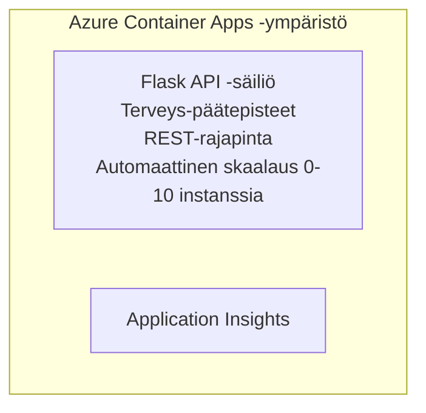

# Yksinkertainen Flask-API - Container App -esimerkki

**Oppimispolku:** Aloittelija ⭐ | **Aika:** 25-35 minuuttia | **Kustannus:** ~$0-15/kuukausi

Täydellinen, toimiva Python Flask REST API, joka on otettu käyttöön Azure Container Appsissa käyttäen Azure Developer CLI:tä (azd). Tämä esimerkki havainnollistaa konttien käyttöönottoa, automaattista skaalausta ja valvonnan perusteita.

## 🎯 Mitä opit

- Ota konttisoitu Python-sovellus käyttöön Azuren ympäristöön
- Määritä automaattinen skaalaus scale-to-zero -toiminnolla
- Toteuta terveystarkistukset ja readiness-tarkistukset
- Seuraa sovelluksen lokitietoja ja mittareita
- Käytä Azure Developer CLI:tä nopeaan käyttöönottoon

## 📦 Mitä sisältyy

✅ **Flask-sovellus** - Täydellinen REST API CRUD-operaatioilla (`src/app.py`)  
✅ **Dockerfile** - Tuotantovalmiit konttiasetukset  
✅ **Bicep Infrastructure** - Container Apps -ympäristö ja API:n käyttöönotto  
✅ **AZD Configuration** - Yhden komennon käyttöönotto  
✅ **Health Probes** - Liveness- ja readiness-tarkistukset konfiguroitu  
✅ **Auto-scaling** - 0-10 replikaa HTTP-kuorman perusteella  

## Arkkitehtuuri


## Esivaatimukset

### Tarvittavat
- **Azure Developer CLI (azd)** - [Asennusopas](https://learn.microsoft.com/azure/developer/azure-developer-cli/install-azd)
- **Azure subscription** - [Ilmainen tili](https://azure.microsoft.com/free/)
- **Docker Desktop** - [Asenna Docker](https://www.docker.com/products/docker-desktop/) (paikallista testausta varten)

### Vahvista esivaatimukset

```bash
# Tarkista azd-versio (tarvitaan versiota 1.5.0 tai uudempaa)
azd version

# Varmista Azure-kirjautuminen
azd auth login

# Tarkista Docker (valinnainen, paikalliseen testaukseen)
docker --version
```

## ⏱️ Käyttöönoton aikajana

| Phase | Duration | What Happens |
|-------|----------|--------------||
| Environment setup | 30 seconds | Create azd environment |
| Build container | 2-3 minutes | Docker build Flask app |
| Provision infrastructure | 3-5 minutes | Create Container Apps, registry, monitoring |
| Deploy application | 2-3 minutes | Push image and deploy to Container Apps |
| **Total** | **8-12 minutes** | Complete deployment ready |

## Pikakäynnistys

```bash
# Siirry esimerkkiin
cd examples/container-app/simple-flask-api

# Alusta ympäristö (valitse yksilöllinen nimi)
azd env new myflaskapi

# Ota kaikki käyttöön (infrastruktuuri + sovellus)
azd up
# Sinulta kysytään:
# 1. Valitse Azure-tilaus
# 2. Valitse sijainti (esim. eastus2)
# 3. Odota 8–12 minuuttia käyttöönottoa varten

# Hanki API-päätepisteesi
azd env get-values

# Testaa API
curl $(azd env get-value API_ENDPOINT)/health
```

**Odotettu tulos:**
```json
{
  "status": "healthy",
  "timestamp": "2025-11-19T10:30:00Z",
  "service": "simple-flask-api",
  "version": "1.0.0"
}
```

## ✅ Varmista käyttöönotto

### Vaihe 1: Tarkista käyttöönoton tila

```bash
# Näytä käyttöön otetut palvelut
azd show

# Odotettu tuloste näyttää:
# - Palvelu: api
# - Päätepiste: https://ca-api-[env].xxx.azurecontainerapps.io
# - Tila: Käynnissä
```

### Vaihe 2: Testaa API-päätepisteet

```bash
# Hae API-päätepiste
API_URL=$(azd env get-value API_ENDPOINT)

# Testaa palvelun kunto
curl $API_URL/health

# Testaa juuripäätepiste
curl $API_URL/

# Luo kohde
curl -X POST $API_URL/api/items \
  -H "Content-Type: application/json" \
  -d '{"name": "Test Item", "description": "My first item"}'

# Hae kaikki kohteet
curl $API_URL/api/items
```

**Onnistumiskriteerit:**
- ✅ Terveys-päätepiste palauttaa HTTP 200
- ✅ Juuri-päätepiste näyttää API-tiedot
- ✅ POST luo kohteen ja palauttaa HTTP 201
- ✅ GET palauttaa luodut kohteet

### Vaihe 3: Katso lokit

```bash
# Striimaa reaaliaikaisia lokeja käyttäen azd monitoria
azd monitor --logs

# Tai käytä Azure CLI:tä:
az containerapp logs show --name api --resource-group $RG_NAME --follow

# Näet:
# - Gunicornin käynnistysviestit
# - HTTP-pyyntöjen lokit
# - Sovelluksen informaatio-lokit
```

## Projektin rakenne

```
simple-flask-api/
├── azure.yaml              # AZD configuration
├── infra/
│   ├── main.bicep         # Main infrastructure
│   ├── main.parameters.json
│   └── app/
│       ├── container-env.bicep
│       └── api.bicep
└── src/
    ├── app.py             # Flask application
    ├── requirements.txt
    └── Dockerfile
```

## API-päätepisteet

| Päätepiste | Metodi | Kuvaus |
|----------|--------|-------------|
| `/health` | GET | Terveystarkistus |
| `/api/items` | GET | Listaa kaikki kohteet |
| `/api/items` | POST | Luo uusi kohde |
| `/api/items/{id}` | GET | Hae tietty kohde |
| `/api/items/{id}` | PUT | Päivitä kohde |
| `/api/items/{id}` | DELETE | Poista kohde |

## Konfiguraatio

### Ympäristömuuttujat

```bash
# Aseta mukautettu kokoonpano
azd env set PORT 8000
azd env set LOG_LEVEL info
azd env set MAX_REPLICAS 20
```

### Skaalauskonfiguraatio

API skaalautuu automaattisesti HTTP-liikenteen mukaan:
- **Min Replicas**: 0 (skaalaa nollaan, kun se on lepotilassa)
- **Max Replicas**: 10
- **Concurrent Requests per Replica**: 50

## Kehitys

### Suorita paikallisesti

```bash
# Asenna riippuvuudet
cd src
pip install -r requirements.txt

# Käynnistä sovellus
python app.py

# Testaa paikallisesti
curl http://localhost:8000/health
```

### Rakenna ja testaa kontti

```bash
# Rakenna Docker-kuva
docker build -t flask-api:local ./src

# Suorita kontti paikallisesti
docker run -p 8000:8000 flask-api:local

# Testaa kontti
curl http://localhost:8000/health
```

## Käyttöönotto

### Täysi käyttöönotto

```bash
# Ota käyttöön infrastruktuuri ja sovellus
azd up
```

### Pelkkä koodin käyttöönotto

```bash
# Ota käyttöön vain sovelluskoodi (infrastruktuuri ennallaan)
azd deploy api
```

### Päivitä konfiguraatio

```bash
# Päivitä ympäristömuuttujat
azd env set API_KEY "new-api-key"

# Ota uudelleen käyttöön uusi kokoonpano
azd deploy api
```

## Valvonta

### Näytä lokit

```bash
# Striimaa reaaliaikaisia lokeja azd monitorilla
azd monitor --logs

# Tai käytä Azure CLI:tä Container Appsille:
az containerapp logs show --name api --resource-group $RG_NAME --follow

# Näytä viimeiset 100 riviä
az containerapp logs show --name api --resource-group $RG_NAME --tail 100
```

### Seuraa mittareita

```bash
# Avaa Azure Monitor -kojelaudan
azd monitor --overview

# Näytä tietyt mittarit
az monitor metrics list \
  --resource $(azd show --output json | jq -r '.services.api.resourceId') \
  --metric "Requests,ResponseTime"
```

## Testaus

### Terveystarkistus

```bash
curl $(azd show --output json | jq -r '.services.api.endpoint')/health
```

Odotettu vastaus:
```json
{
  "status": "healthy",
  "timestamp": "2025-11-19T10:30:00Z"
}
```

### Luo kohde

```bash
curl -X POST $(azd show --output json | jq -r '.services.api.endpoint')/api/items \
  -H "Content-Type: application/json" \
  -d '{"name": "Test Item", "description": "A test item"}'
```

### Hae kaikki kohteet

```bash
curl $(azd show --output json | jq -r '.services.api.endpoint')/api/items
```

## Kustannusten optimointi

Tässä käyttöönotossa käytetään scale-to-zero -mallia, joten maksat vain, kun API käsittelee pyyntöjä:

- **Lepokustannus**: ~$0/kuukausi (skaalattu nollaan)
- **Aktiivinen kustannus**: ~$0.000024/sekunti per replikka
- **Odotettu kuukausikustannus** (kevyt käyttö): $5-15

### Vähennä kustannuksia lisää

```bash
# Vähennä kehitysympäristön maksimireplikoiden määrää
azd env set MAX_REPLICAS 3

# Käytä lyhyempää tyhjäkäyntiaikaa
azd env set SCALE_TO_ZERO_TIMEOUT 300  # 5 minuuttia
```

## Vianetsintä

### Kontti ei käynnisty

```bash
# Tarkista säilön lokit Azure CLI:n avulla
az containerapp logs show --name api --resource-group $RG_NAME --tail 100

# Varmista, että Docker-kuva rakentuu paikallisesti
docker build -t test ./src
```

### API ei ole saavutettavissa

```bash
# Varmista, että ingress on ulkoinen
az containerapp show --name api --resource-group rg-simple-flask-api \
  --query properties.configuration.ingress.external
```

### Korkeat vasteajat

```bash
# Tarkista suorittimen ja muistin käyttö
az monitor metrics list \
  --resource $(azd show --output json | jq -r '.services.api.resourceId') \
  --metric "CPUPercentage,MemoryPercentage"

# Lisää resursseja tarvittaessa
az containerapp update --name api --resource-group rg-simple-flask-api \
  --cpu 1.0 --memory 2Gi
```

## Siivous

```bash
# Poista kaikki resurssit
azd down --force --purge
```

## Seuraavat askeleet

### Laajenna tätä esimerkkiä

1. **Lisää tietokanta** - Integroi Azure Cosmos DB tai SQL Database
   ```bash
   # Lisää Cosmos DB -moduuli tiedostoon infra/main.bicep
   # Päivitä app.py lisäämällä tietokantayhteys
   ```

2. **Lisää todennus** - Ota käyttöön Azure AD tai API-avaimet
   ```python
   # Lisää autentikointiväliohjelma app.py-tiedostoon
   from functools import wraps
   ```

3. **Määritä CI/CD** - GitHub Actions -työnkulku
   ```yaml
   # Create .github/workflows/deploy.yml
   name: Deploy to Azure
   on: [push]
   ```

4. **Lisää hallittu identiteetti** - Suojaa pääsy Azure-palveluihin
   ```bicep
   # Update infra/app/api.bicep
   identity: { type: 'SystemAssigned' }
   ```

### Liittyvät esimerkit

- **[Tietokantasovellus](../../../../../examples/database-app)** - Täydellinen esimerkki SQL-tietokannan kanssa
- **[Mikropalvelut](../../../../../examples/container-app/microservices)** - Monipalveluarkkitehtuuri
- **[Container Apps -opas](../README.md)** - Kaikki konttimallit

### Oppimateriaalit

- 📚 [AZD aloittelijoille -kurssi](../../../README.md) - Kurssin pääsivu
- 📚 [Container Apps -mallit](../README.md) - Lisää käyttöönotto-malleja
- 📚 [AZD-mallien galleria](https://azure.github.io/awesome-azd/) - Yhteisön mallit

## Lisäresurssit

### Dokumentaatio
- **[Flask-dokumentaatio](https://flask.palletsprojects.com/)** - Flask-kehyksen opas
- **[Azure Container Apps](https://learn.microsoft.com/azure/container-apps/)** - Viralliset Azure-dokumentit
- **[Azure Developer CLI](https://learn.microsoft.com/azure/developer/azure-developer-cli/)** - azd-komentojen viite

### Opetusohjeet
- **[Container Apps Quickstart](https://learn.microsoft.com/azure/container-apps/quickstart-portal)** - Ota ensimmäinen sovellus käyttöön
- **[Python on Azure](https://learn.microsoft.com/azure/developer/python/)** - Python-kehitysopas
- **[Bicep-kieli](https://learn.microsoft.com/azure/azure-resource-manager/bicep/)** - Infrastruktuuri koodina

### Työkalut
- **[Azure Portal](https://portal.azure.com)** - Hallitse resursseja visuaalisesti
- **[VS Code Azure Extension](https://marketplace.visualstudio.com/items?itemName=ms-azuretools.vscode-azurecontainerapps)** - IDE-integraatio

---

**🎉 Onnittelut!** Olet ottanut tuotantovalmiin Flask-API:n käyttöön Azure Container Appsissa automaattisella skaalauksella ja valvonnalla.

**Kysymyksiä?** [Lähetä ongelma](https://github.com/microsoft/AZD-for-beginners/issues) tai katso [UKK](../../../resources/faq.md)

---

<!-- CO-OP TRANSLATOR DISCLAIMER START -->
**Disclaimer**:
Tämä asiakirja on käännetty tekoälykäännöspalvelulla [Co-op Translator](https://github.com/Azure/co-op-translator). Vaikka pyrimme tarkkuuteen, ota huomioon, että automaattiset käännökset saattavat sisältää virheitä tai epätarkkuuksia. Alkuperäistä asiakirjaa sen alkuperäisellä kielellä on pidettävä määräävänä lähteenä. Kriittisten tietojen osalta suositellaan ammattimaista ihmiskäännöstä. Emme ole vastuussa tästä käännöksestä aiheutuvista väärinymmärryksistä tai virhetulkinnoista.
<!-- CO-OP TRANSLATOR DISCLAIMER END -->