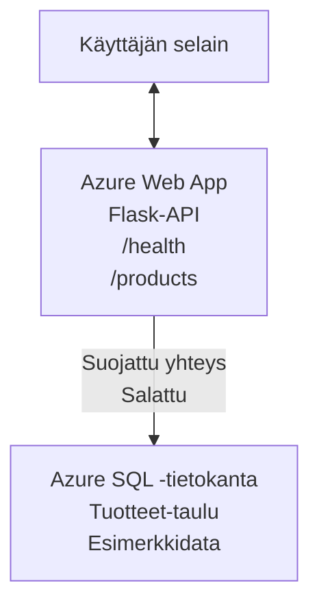

# Microsoft SQL -tietokannan ja web-sovelluksen käyttöönotto AZD:llä

⏱️ **Arvioitu aika**: 20-30 minuuttia | 💰 **Arvioidut kustannukset**: ~$15-25/kk | ⭐ **Vaativuustaso**: Keskitaso

Tässä **täydellisessä, toimivassa esimerkissä** näytetään, miten käyttää [Azure Developer CLI (azd)](https://learn.microsoft.com/azure/developer/azure-developer-cli/) Python Flask -web-sovelluksen ja Microsoft SQL -tietokannan käyttöönottoon Azureen. Kaikki koodi sisältyy ja on testattu—ei ulkoisia riippuvuuksia.

## Mitä opit

Tämän esimerkin suorittamisen jälkeen osaat:
- Ottaaa käyttöön monikerroksisen sovelluksen (web-sovellus + tietokanta) infrastruktuurin koodina
- Konfiguroida turvalliset tietokantayhteydet ilman kovakoodaamista
- Valvoa sovelluksen tilaa Application Insightsin avulla
- Hallita Azure-resursseja tehokkaasti AZD CLI:llä
- Noudata Azuren parhaita käytäntöjä turvallisuuden, kustannusten optimoinnin ja havaittavuuden osalta

## Skenaarion yleiskatsaus
- **Web App**: Python Flask -REST-API tietokantayhteydellä
- **Database**: Azure SQL Database sisältäen esimerkkitietoja
- **Infrastructure**: Provisionoitu Bicepillä (modulaariset, uudelleenkäytettävät mallipohjat)
- **Deployment**: Täysin automatisoitu `azd`-komennoilla
- **Monitoring**: Application Insights lokitusta ja telemetriaa varten

## Esivaatimukset

### Tarvittavat työkalut

Ennen aloittamista varmista, että seuraavat työkalut ovat asennettuina:

1. **[Azure CLI](https://learn.microsoft.com/cli/azure/install-azure-cli)** (versio 2.50.0 tai uudempi)
   ```sh
   az --version
   # Odotettu tuloste: azure-cli 2.50.0 tai uudempi
   ```

2. **[Azure Developer CLI (azd)](https://learn.microsoft.com/azure/developer/azure-developer-cli/install-azd)** (versio 1.0.0 tai uudempi)
   ```sh
   azd version
   # Odotettu tuloste: azd versio 1.0.0 tai uudempi
   ```

3. **[Python 3.8+](https://www.python.org/downloads/)** (paikallista kehitystä varten)
   ```sh
   python --version
   # Odotettu tulos: Python 3.8 tai uudempi
   ```

4. **[Docker](https://www.docker.com/get-started)** (valinnainen, paikalliseen konttikehitykseen)
   ```sh
   docker --version
   # Odotettu tulostus: Dockerin versio 20.10 tai uudempi
   ```

### Azure-vaatimukset

- Aktiivinen **Azure-tilaus** ([luo ilmainen tili](https://azure.microsoft.com/free/))
- Oikeudet luoda resursseja tilauksessasi
- **Owner** tai **Contributor** -rooli tilauksessa tai resurssiryhmässä

### Ennakkovaatimukset

Tämä on **keskitasoinen** esimerkki. Sinun tulisi olla perehtynyt:
- Perus komentorivitoimintoihin
- Pilvipalvelun peruskäsitteisiin (resurssit, resurssiryhmät)
- Peruskäsitykseen web-sovelluksista ja tietokannoista

**Uusi AZD:n käyttäjä?** Aloita [Getting Started guide](../../docs/chapter-01-foundation/azd-basics.md) ensin.

## Arkkitehtuuri

Tämä esimerkki ottaa käyttöön kaksikerroksisen arkkitehtuurin, joka sisältää web-sovelluksen ja SQL-tietokannan:



**Resurssien käyttöönotto:**
- **Resource Group**: Säilö kaikille resursseille
- **App Service Plan**: Linux-pohjainen isännöinti (B1-taso kustannustehokkuuden vuoksi)
- **Web App**: Python 3.11 -ajonaikaympäristö Flask-sovelluksella
- **SQL Server**: Hallittu tietokantapalvelin, TLS 1.2 vähintään
- **SQL Database**: Basic-taso (2GB, sopii kehitykseen/testaukseen)
- **Application Insights**: Valvonta ja lokitus
- **Log Analytics Workspace**: Keskitetty lokisäilytys

**Analogiana**: Ajattele tätä ravintolana (web-sovellus) ja walk-in -pakastimena (tietokanta). Asiakkaat tilaavat ruokia ruokalistalta (API-päätepisteet) ja keittiö (Flask-sovellus) hakee aineksia (tietoja) pakastimesta. Ravintolan johtaja (Application Insights) seuraa kaikkea, mitä tapahtuu.

## Kansiorakenne

Kaikki tiedostot sisältyvät tähän esimerkkiin—ei ulkoisia riippuvuuksia:

```
examples/database-app/
│
├── README.md                    # This file
├── azure.yaml                   # AZD configuration file
├── .env.sample                  # Sample environment variables
├── .gitignore                   # Git ignore patterns
│
├── infra/                       # Infrastructure as Code (Bicep)
│   ├── main.bicep              # Main orchestration template
│   ├── abbreviations.json      # Azure naming conventions
│   └── resources/              # Modular resource templates
│       ├── sql-server.bicep    # SQL Server configuration
│       ├── sql-database.bicep  # Database configuration
│       ├── app-service-plan.bicep  # Hosting plan
│       ├── app-insights.bicep  # Monitoring setup
│       └── web-app.bicep       # Web application
│
└── src/
    └── web/                    # Application source code
        ├── app.py              # Flask REST API
        ├── requirements.txt    # Python dependencies
        └── Dockerfile          # Container definition
```

**Mihin kukin tiedosto on tarkoitettu:**
- **azure.yaml**: Kertoo AZD:lle, mitä ja mihin ottaa käyttöön
- **infra/main.bicep**: Orkestroi kaikki Azure-resurssit
- **infra/resources/*.bicep**: Yksittäiset resurssimäärittelyt (modulaariset uudelleenkäyttöä varten)
- **src/web/app.py**: Flask-sovellus, jossa tietokantologiikka
- **requirements.txt**: Python-pakettien riippuvuudet
- **Dockerfile**: Kontitusta varten ohjeet käyttöönottoa varten

## Nopea aloitus (vaihe vaiheelta)

### Vaihe 1: Kloonaa ja siirry kansioon

```sh
git clone https://github.com/microsoft/AZD-for-beginners.git
cd AZD-for-beginners/examples/database-app
```

**✓ Onnistumisen tarkistus**: Varmista, että näet `azure.yaml`-tiedoston ja `infra/`-kansion:
```sh
ls
# Odotettu: README.md, azure.yaml, infra/, src/
```

### Vaihe 2: Kirjaudu Azureen

```sh
azd auth login
```

Tämä avaa selaimesi Azure-todennusta varten. Kirjaudu Azure-kirjautumistiedoillasi.

**✓ Onnistumisen tarkistus**: Näet:
```
Logged in to Azure.
```

### Vaihe 3: Alusta ympäristö

```sh
azd init
```

**Mitä tapahtuu**: AZD luo paikallisen konfiguraation käyttöönottoasi varten.

**Näet seuraavat kehotteet**:
- **Environment name**: Anna lyhyt nimi (esim. `dev`, `myapp`)
- **Azure subscription**: Valitse tilauksesi listasta
- **Azure location**: Valitse alue (esim. `eastus`, `westeurope`)

**✓ Onnistumisen tarkistus**: Näet:
```
SUCCESS: New project initialized!
```

### Vaihe 4: Ota Azure-resurssit käyttöön

```sh
azd provision
```

**Mitä tapahtuu**: AZD ottaa käyttöön koko infrastruktuurin (kesto 5–8 minuuttia):
1. Luo resurssiryhmän
2. Luo SQL Serverin ja tietokannan
3. Luo App Service Planin
4. Luo Web Appin
5. Luo Application Insightsin
6. Konfiguroi verkotus ja turvallisuus

**Sinua pyydetään antamaan**:
- **SQL admin username**: Anna käyttäjänimi (esim. `sqladmin`)
- **SQL admin password**: Anna vahva salasana (tallenna tämä!)

**✓ Onnistumisen tarkistus**: Näet:
```
SUCCESS: Your application was provisioned in Azure in X minutes Y seconds.
You can view the resources created under the resource group rg-<env-name> in Azure Portal:
https://portal.azure.com/#@/resource/subscriptions/.../resourceGroups/rg-<env-name>
```

**⏱️ Aika**: 5-8 minuuttia

### Vaihe 5: Ota sovellus käyttöön

```sh
azd deploy
```

**Mitä tapahtuu**: AZD rakentaa ja ottaa käyttöön Flask-sovelluksesi:
1. Pakkaa Python-sovellus
2. Rakentaa Docker-kontin
3. Pushaa sen Azure Web Appiin
4. Alustaa tietokannan esimerkkidatalla
5. Käynnistää sovelluksen

**✓ Onnistumisen tarkistus**: Näet:
```
SUCCESS: Your application was deployed to Azure in X minutes Y seconds.
You can view the resources created under the resource group rg-<env-name> in Azure Portal:
https://portal.azure.com/#@/resource/subscriptions/.../resourceGroups/rg-<env-name>
```

**⏱️ Aika**: 3-5 minuuttia

### Vaihe 6: Selaa sovellusta

```sh
azd browse
```

Tämä avaa käyttöönotetun web-sovelluksesi selaimeen osoitteessa `https://app-<unique-id>.azurewebsites.net`

**✓ Onnistumisen tarkistus**: Näet JSON-outputin:
```json
{
  "message": "Welcome to the Database App API",
  "endpoints": {
    "/": "This help message",
    "/health": "Health check endpoint",
    "/products": "List all products",
    "/products/<id>": "Get product by ID"
  }
}
```

### Vaihe 7: Testaa API-päätepisteet

**Health Check** (tarkista tietokantayhteys):
```sh
curl https://app-<your-id>.azurewebsites.net/health
```

**Odotettu vastaus**:
```json
{
  "status": "healthy",
  "database": "connected"
}
```

**List Products** (esimerkkidata):
```sh
curl https://app-<your-id>.azurewebsites.net/products
```

**Odotettu vastaus**:
```json
[
  {
    "id": 1,
    "name": "Laptop",
    "description": "High-performance laptop",
    "price": 1299.99,
    "created_at": "2025-11-19T10:30:00"
  },
  ...
]
```

**Get Single Product**:
```sh
curl https://app-<your-id>.azurewebsites.net/products/1
```

**✓ Onnistumisen tarkistus**: Kaikki päätepisteet palauttavat JSON-dataa ilman virheitä.

---

**🎉 Onneksi olkoon!** Olet onnistuneesti ottanut web-sovelluksen ja tietokannan käyttöön Azureen käyttäen AZD:ää.

## Konfiguraation syväluotaus

### Ympäristömuuttujat

Salaisuuksia hallitaan turvallisesti Azure App Service -konfiguraation kautta—**ei koskaan kovakoodata lähdekoodiin**.

**AZD asettaa automaattisesti**:
- `SQL_CONNECTION_STRING`: Tietokantayhteys salatuilla tunnuksilla
- `APPLICATIONINSIGHTS_CONNECTION_STRING`: Telemetrian seurantaosoite
- `SCM_DO_BUILD_DURING_DEPLOYMENT`: Mahdollistaa automaattisen riippuvuuksien asennuksen

**Missä salaisuudet säilytetään**:
1. `azd provision` -komennon aikana annat SQL-tunnukset turvallisen kehotteen kautta
2. AZD tallentaa ne paikalliseen `.azure/<env-name>/.env` -tiedostoon (git-ignored)
3. AZD injektoi ne Azure App Service -konfiguraatioon (salattu levossa)
4. Sovellus lukee ne ajonaikana `os.getenv()`-kutsulla

### Paikallinen kehitys

Paikallista testausta varten luo `.env`-tiedosto mallista:

```sh
cp .env.sample .env
# Muokkaa .env-tiedostoa paikallista tietokantayhteyttä varten
```

**Paikallisen kehityksen työnkulku**:
```sh
# Asenna riippuvuudet
cd src/web
pip install -r requirements.txt

# Aseta ympäristömuuttujat
export SQL_CONNECTION_STRING="your-local-connection-string"

# Suorita sovellus
python app.py
```

**Testaa paikallisesti**:
```sh
curl http://localhost:8000/health
# Odotettu: {"tila": "terve", "tietokanta": "yhdistetty"}
```

### Infrastruktuuri koodina

Kaikki Azure-resurssit on määritelty **Bicep-malleissa** (`infra/`-kansio):

- **Modulaarinen rakenne**: Jokaisella resurssityypillä on oma tiedosto uudelleenkäyttöä varten
- **Parametrisoitu**: Mukauta SKUja, alueita, nimeämiskäytäntöjä
- **Parhaat käytännöt**: Seuraa Azuren nimeämisstandardeja ja turvallisuus oletuksia
- **Versionhallinta**: Infrastruktuurin muutokset seurataan Gitissä

**Mukautusesimerkki**:
Muuta tietokannan tasoa muokkaamalla `infra/resources/sql-database.bicep`:
```bicep
sku: {
  name: 'Standard'  // Changed from 'Basic'
  tier: 'Standard'
  capacity: 10
}
```

## Turvallisuuden parhaat käytännöt

Tämä esimerkki noudattaa Azuren turvallisuuden parhaita käytäntöjä:

### 1. **Ei salaisuuksia lähdekoodissa**
- ✅ Tunnukset tallennetaan Azure App Service -konfiguraatioon (salattu)
- ✅ `.env`-tiedostot jätetään Gitin ulkopuolelle `.gitignore`-asetuksella
- ✅ Salaisuudet annetaan turvallisina parametreina provisioinnin yhteydessä

### 2. **Salatut yhteydet**
- ✅ TLS 1.2 vähintään SQL Serverille
- ✅ HTTPS pakotettu Web Appille
- ✅ Tietokantayhteydet käyttävät salattuja kanavia

### 3. **Verkon turvallisuus**
- ✅ SQL Serverin palomuuri konfiguroitu sallimaan vain Azuren palvelut
- ✅ Julkinen verkkoyhteys rajoitettu (voidaan lisätä Private Endpoints)
- ✅ FTPS poistettu käytöstä Web Appissa

### 4. **Todennus ja valtuutus**
- ⚠️ **Nykyinen**: SQL-todennus (käyttäjänimi/salasana)
- ✅ **Tuotantosuositus**: Käytä Azure Managed Identityä salasanoitta tapahtuvaan todennukseen

**Päivitys Managed Identityyn** (tuotantoon):
1. Ota hallittu identiteetti käyttöön Web Appissa
2. Myönnä identiteetille SQL-oikeudet
3. Päivitä yhteysmerkkijono käyttämään hallittua identiteettiä
4. Poista salasanoihin perustuva todennus

### 5. **Tarkastus ja vaatimustenmukaisuus**
- ✅ Application Insights kirjaa kaikki pyynnöt ja virheet
- ✅ SQL-tietokannan auditointi käytössä (konfiguroitavissa vaatimusten mukaisesti)
- ✅ Kaikki resurssit on tagattu hallintaa varten

**Turvallisuustarkistuslista ennen tuotantoa**:
- [ ] Ota Azure Defender for SQL käyttöön
- [ ] Konfiguroi Private Endpoints SQL-tietokannalle
- [ ] Ota käyttöön Web Application Firewall (WAF)
- [ ] Ota käyttöön Azure Key Vault salaisuuksien kiertoa varten
- [ ] Konfiguroi Microsoft Entra ID -todennus
- [ ] Ota diagnostiikkalokit käyttöön kaikille resursseille

## Kustannusoptimointi

**Arvioidut kuukausikustannukset** (tilanne marraskuu 2025):

| Resurssi | SKU/Taso | Arvioidut kustannukset |
|----------|----------|------------------------|
| App Service Plan | B1 (Basic) | ~$13/kk |
| SQL Database | Basic (2GB) | ~$5/kk |
| Application Insights | Pay-as-you-go | ~$2/kk (vähäinen liikenne) |
| **Yhteensä** | | **~$20/kk** |

**💡 Säästövinkkejä**:

1. **Käytä ilmaista tasoa oppimiseen**:
   - App Service: F1-taso (ilmainen, rajatut tunnit)
   - SQL Database: Käytä Azure SQL Database serverless -vaihtoehtoa
   - Application Insights: 5GB/kk ilmainen syöttö

2. **Pysäytä resurssit, kun et käytä niitä**:
   ```sh
   # Pysäytä web-sovellus (tietokanta veloittaa edelleen)
   az webapp stop --name <app-name> --resource-group <rg-name>
   
   # Käynnistä uudelleen tarvittaessa
   az webapp start --name <app-name> --resource-group <rg-name>
   ```

3. **Poista kaikki testauksen jälkeen**:
   ```sh
   azd down
   ```
   Tämä poistaa KAIKKI resurssit ja lopettaa maksut.

4. **Kehitys vs. tuotannon SKUt**:
   - **Development**: Basic-taso (käytetty tässä esimerkissä)
   - **Production**: Standard/Premium-taso redundanssilla

**Kustannusseuranta**:
- Näytä kustannukset [Azure Cost Management](https://portal.azure.com/#view/Microsoft_Azure_CostManagement)
- Määritä kustannushälytykset yllätyksien välttämiseksi
- Tagaa kaikki resurssit `azd-env-name`-tagilla seurannan helpottamiseksi

**Ilmainen vaihtoehto**:
Oppimista varten voit muokata `infra/resources/app-service-plan.bicep`:
```bicep
sku: {
  name: 'F1'  // Free tier
  tier: 'Free'
}
```
**Huom**: Ilmaisella tasolla on rajoituksia (60 min/päivä CPU, ei aina päällä).

## Valvonta ja havaittavuus

### Application Insights -integraatio

Tämä esimerkki sisältää **Application Insightsin** kattavaa valvontaa varten:

**Mitä seurataan**:
- ✅ HTTP-pyynnöt (latenssi, tilakoodit, päätepisteet)
- ✅ Sovellusvirheet ja poikkeukset
- ✅ Mukautettu lokitus Flask-sovelluksesta
- ✅ Tietokantayhteyden tila
- ✅ Suorituskykymittarit (CPU, muisti)

**Pääsy Application Insightsiin**:
1. Avaa [Azure Portal](https://portal.azure.com)
2. Siirry resurssiryhmääsi (`rg-<env-name>`)
3. Klikkaa Application Insights -resurssia (`appi-<unique-id>`)

**Hyödylliset kyselyt** (Application Insights → Logs):

**Näytä kaikki pyynnöt**:
```kusto
requests
| where timestamp > ago(1h)
| order by timestamp desc
| project timestamp, name, url, resultCode, duration
```

**Etsi virheitä**:
```kusto
exceptions
| where timestamp > ago(24h)
| order by timestamp desc
| project timestamp, type, outerMessage, operation_Name
```

**Tarkista health-päätepiste**:
```kusto
requests
| where name contains "health"
| summarize count() by resultCode, bin(timestamp, 1h)
```

### SQL-tietokannan auditointi

**SQL-tietokannan auditointi on käytössä** seuraamaan:
- Tietokannan käyttökuvioita
- Epäonnistuneita kirjautumisyrityksiä
- Skeeman muutoksia
- Datan käyttöä (vaatimustenmukaisuutta varten)

**Pääsy auditointilokeihin**:
1. Azure Portal → SQL Database → Auditing
2. Tarkastele lokeja Log Analytics -workspace:ssa

### Reaaliaikainen valvonta

**Näytä reaaliaikaiset mittarit**:
1. Application Insights → Live Metrics
2. Näe pyynnöt, epäonnistumiset ja suorituskyky reaaliajassa

**Määritä hälytykset**:
Luo hälytyksiä kriittisille tapahtumille:
- HTTP 500 -virheitä > 5 viidessä minuutissa
- Tietokantayhteyksien epäonnistumiset
- Korkeat vasteajat (>2 sekuntia)

**Esimerkinomainen hälytyksen luonti**:
```sh
az monitor metrics alert create \
  --name "High-Response-Time" \
  --resource-group <rg-name> \
  --scopes <app-insights-resource-id> \
  --condition "avg requests/duration > 2000" \
  --description "Alert when response time exceeds 2 seconds"
```

## Vianmääritys
### Yleisiä ongelmia ja ratkaisuja

#### 1. `azd provision` fails with "Location not available"

**Oire**:
```
Error: The subscription is not registered for the resource type 'components' in the location 'centralus'.
```

**Ratkaisu**:
Valitse toinen Azure-alue tai rekisteröi resurssitoimittaja:
```sh
az provider register --namespace Microsoft.Insights
```

#### 2. SQL-yhteys epäonnistuu käyttöönoton aikana

**Oire**:
```
pyodbc.OperationalError: ('08001', '[08001] [Microsoft][ODBC Driver 18 for SQL Server]TCP Provider...')
```

**Ratkaisu**:
- Varmista, että SQL Serverin palomuuri sallii Azure-palvelut (määritetään automaattisesti)
- Tarkista, että SQL-järjestelmänvalvojan salasana syötettiin oikein `azd provision` -komennon aikana
- Varmista, että SQL Server on täysin provisionoitu (voi kestää 2-3 minuuttia)

**Varmista yhteys**:
```sh
# Avaa Azure-portaali ja siirry SQL Database → Query editoriin
# Yritä muodostaa yhteys tunnuksillasi
```

#### 3. Web-sovellus näyttää "Application Error"

**Oire**:
Selain näyttää yleisen virhesivun.

**Ratkaisu**:
Tarkista sovelluksen lokit:
```sh
# Näytä viimeisimmät lokit
az webapp log tail --name <app-name> --resource-group <rg-name>
```

**Yleiset syyt**:
- Puuttuvat ympäristömuuttujat (tarkista App Service → Konfiguraatio)
- Python-pakettien asennus epäonnistui (tarkista käyttöönoton lokit)
- Tietokannan alustuksen virhe (tarkista SQL-yhteydet)

#### 4. `azd deploy` epäonnistuu "Build Error" -virheen kanssa

**Oire**:
```
Error: Failed to build project
```

**Ratkaisu**:
- Varmista, ettei `requirements.txt`-tiedostossa ole syntaksivirheitä
- Tarkista, että Python 3.11 on määritetty tiedostossa `infra/resources/web-app.bicep`
- Varmista, että Dockerfile käyttää oikeaa peruskuvaa

**Debuggaa paikallisesti**:
```sh
cd src/web
docker build -t test-app .
docker run -p 8000:8000 test-app
```

#### 5. "Unauthorized" AZD-komentoja ajettaessa

**Oire**:
```
ERROR: (Unauthorized) The client '<id>' with object id '<id>' does not have authorization
```

**Ratkaisu**:
Kirjaudu uudelleen Azureen:
```sh
# Tarvitaan AZD-työnkuluissa
azd auth login

# Valinnainen, jos käytät myös Azure CLI -komentoja suoraan
az login
```

Varmista, että sinulla on oikeat käyttöoikeudet (Contributor-rooli) tilauksessa.

#### 6. Korkeat tietokantakustannukset

**Oire**:
Odottamaton Azure-lasku.

**Ratkaisu**:
- Tarkista, unohtoitko suorittaa `azd down` testauksen jälkeen
- Varmista, että SQL Database käyttää Basic-tasoista palvelua (ei Premium)
- Tarkista kustannukset Azure Cost Management -palvelussa
- Aseta kustannusilmoituksia

### Hanki apua

**Näytä kaikki AZD-ympäristömuuttujat**:
```sh
azd env get-values
```

**Tarkista käyttöönoton tila**:
```sh
az webapp show --name <app-name> --resource-group <rg-name> --query state
```

**Avaa sovelluksen lokit**:
```sh
az webapp log download --name <app-name> --resource-group <rg-name> --log-file app-logs.zip
```

**Tarvitsetko lisäapua?**
- [AZD vianetsintäopas](../../docs/chapter-07-troubleshooting/common-issues.md)
- [Azure App Servicen vianetsintä](https://learn.microsoft.com/azure/app-service/troubleshoot-diagnostic-logs)
- [Azure SQL - vianetsintä](https://learn.microsoft.com/azure/azure-sql/database/troubleshoot-common-errors-issues)

## Käytännön harjoitukset

### Harjoitus 1: Varmista käyttöönotto (aloittelija)

**Tavoite**: Varmista, että kaikki resurssit on otettu käyttöön ja sovellus toimii.

**Vaiheet**:
1. Listaa kaikki resurssit resurssiryhmässäsi:
   ```sh
   az resource list --resource-group rg-<env-name> --output table
   ```
   **Odotettu**: 6-7 resurssia (Web App, SQL Server, SQL Database, App Service Plan, Application Insights, Log Analytics)

2. Testaa kaikki API-päätepisteet:
   ```sh
   curl https://app-<your-id>.azurewebsites.net/
   curl https://app-<your-id>.azurewebsites.net/health
   curl https://app-<your-id>.azurewebsites.net/products
   curl https://app-<your-id>.azurewebsites.net/products/1
   ```
   **Odotettu**: Kaikki palauttavat kelvollisen JSONin ilman virheitä

3. Tarkista Application Insights:
   - Siirry Application Insightsiin Azure-portaalissa
   - Siirry kohtaan "Live Metrics"
   - Päivitä selain web-sovelluksessa
   **Odotettu**: Näet saapuvat pyynnöt reaaliajassa

**Onnistumisen kriteerit**: Kaikki 6-7 resurssia ovat olemassa, kaikki päätepisteet palauttavat tietoa, Live Metrics näyttää toimintaa.

---

### Harjoitus 2: Lisää uusi API-päätepiste (keskitaso)

**Tavoite**: Laajenna Flask-sovellusta uudella päätepisteellä.

**Alkukoodi**: Nykyiset päätepisteet tiedostossa `src/web/app.py`

**Vaiheet**:
1. Muokkaa `src/web/app.py`-tiedostoa ja lisää uusi päätepiste `get_product()`-funktion jälkeen:
   ```python
   @app.route('/products/search/<keyword>')
   def search_products(keyword):
       """Search products by name or description."""
       try:
           conn = get_db_connection()
           cursor = conn.cursor()
           cursor.execute(
               "SELECT id, name, description, price, created_at FROM products WHERE name LIKE ? OR description LIKE ?",
               (f'%{keyword}%', f'%{keyword}%')
           )
           
           products = []
           for row in cursor.fetchall():
               products.append({
                   'id': row[0],
                   'name': row[1],
                   'description': row[2],
                   'price': float(row[3]) if row[3] else None,
                   'created_at': row[4].isoformat() if row[4] else None
               })
           
           cursor.close()
           conn.close()
           
           logger.info(f"Search for '{keyword}' returned {len(products)} results")
           return jsonify(products), 200
           
       except Exception as e:
           logger.error(f"Error searching products: {str(e)}")
           return jsonify({'error': str(e)}), 500
   ```

2. Ota päivitetty sovellus käyttöön:
   ```sh
   azd deploy
   ```

3. Testaa uutta päätepistettä:
   ```sh
   curl https://app-<your-id>.azurewebsites.net/products/search/laptop
   ```
   **Odotettu**: Palauttaa tuotteet, jotka vastaavat hakua "laptop"

**Onnistumisen kriteerit**: Uusi päätepiste toimii, palauttaa suodatettuja tuloksia ja näkyy Application Insightsin lokeissa.

---

### Harjoitus 3: Lisää valvonta ja ilmoitukset (edistynyt)

**Tavoite**: Ota käyttöön proaktiivinen valvonta ja ilmoitukset.

**Vaiheet**:
1. Luo hälytys HTTP 500 -virheille:
   ```sh
   # Hae Application Insights -resurssin tunnus
   AI_ID=$(az monitor app-insights component show \
     --app appi-<your-id> \
     --resource-group rg-<env-name> \
     --query id -o tsv)
   
   # Luo hälytys
   az monitor metrics alert create \
     --name "High-Error-Rate" \
     --resource-group rg-<env-name> \
     --scopes $AI_ID \
     --condition "count requests/failed > 5" \
     --window-size 5m \
     --evaluation-frequency 1m \
     --description "Alert when >5 failed requests in 5 minutes"
   ```

2. Laukaise hälytys aiheuttamalla virheitä:
   ```sh
   # Pyydä olematonta tuotetta
   for i in {1..10}; do curl https://app-<your-id>.azurewebsites.net/products/999; done
   ```

3. Tarkista, laukaistiinko hälytys:
   - Azure Portal → Alerts → Alert Rules
   - Tarkista sähköpostisi (jos määritetty)

**Onnistumisen kriteerit**: Hälyssääntö on luotu, laukeaa virheissä, ilmoitukset vastaanotetaan.

---

### Harjoitus 4: Muutokset tietokantaskemaan (edistynyt)

**Tavoite**: Lisää uusi taulu ja muokkaa sovellusta käyttämään sitä.

**Vaiheet**:
1. Yhdistä SQL-tietokantaan Azure-portaalin Query Editorin kautta

2. Luo uusi `categories`-taulu:
   ```sql
   CREATE TABLE categories (
       id INT PRIMARY KEY IDENTITY(1,1),
       name NVARCHAR(50) NOT NULL,
       description NVARCHAR(200)
   );
   
   INSERT INTO categories (name, description) VALUES
   ('Electronics', 'Electronic devices and accessories'),
   ('Office Supplies', 'Office equipment and supplies');
   
   -- Add category to products table
   ALTER TABLE products ADD category_id INT;
   UPDATE products SET category_id = 1; -- Set all to Electronics
   ```

3. Päivitä `src/web/app.py` lisäämään kategorian tiedot vastauksiin

4. Ota käyttöön ja testaa

**Onnistumisen kriteerit**: Uusi taulu on olemassa, tuotteissa näytetään kategoriatiedot, sovellus toimii edelleen.

---

### Harjoitus 5: Toteuta välimuisti (asiantuntija)

**Tavoite**: Lisää Azure Redis Cache suorituskyvyn parantamiseksi.

**Vaiheet**:
1. Lisää Redis Cache tiedostoon `infra/main.bicep`
2. Päivitä `src/web/app.py` välimuistittamaan tuotekyselyt
3. Mittaa suorituskyvyn parannus Application Insightsilla
4. Vertaa vastausaikoja ennen ja jälkeen välimuistituksen

**Onnistumisen kriteerit**: Redis on otettu käyttöön, välimuistitus toimii, vastausajat paranevat yli 50 %.

**Vinkki**: Aloita [Azure Cache for Redis -dokumentaatiosta](https://learn.microsoft.com/azure/azure-cache-for-redis/).

---

## Siivous

To avoid ongoing charges, delete all resources when done:

```sh
azd down
```

**Vahvistuskehotus**:
```
? Total resources to delete: 7, are you sure you want to continue? (y/N)
```

Kirjoita `y` vahvistaaksesi.

**✓ Onnistumisen tarkistus**: 
- Kaikki resurssit on poistettu Azure-portaalista
- Ei jatkuvia kustannuksia
- Paikallinen `.azure/<env-name>`-kansio voidaan poistaa

**Vaihtoehto** (säilytä infrastruktuuri, poista data):
```sh
# Poista vain resurssiryhmä (säilytä AZD-asetukset)
az group delete --name rg-<env-name> --yes
```
## Lisätietoja

### Aiheeseen liittyvä dokumentaatio
- [Azure Developer CLI -dokumentaatio](https://learn.microsoft.com/azure/developer/azure-developer-cli/)
- [Azure SQL Database -dokumentaatio](https://learn.microsoft.com/azure/azure-sql/database/)
- [Azure App Service -dokumentaatio](https://learn.microsoft.com/azure/app-service/)
- [Application Insights -dokumentaatio](https://learn.microsoft.com/azure/azure-monitor/app/app-insights-overview)
- [Bicep-kielen referenssi](https://learn.microsoft.com/azure/azure-resource-manager/bicep/)

### Seuraavat askeleet tässä kurssissa
- **[Container Apps -esimerkki](../../../../examples/container-app)**: Ota mikropalvelut käyttöön Azure Container Appseilla
- **[AI-integrointiohje](../../../../docs/ai-foundry)**: Lisää tekoälyominaisuuksia sovellukseesi
- **[Käyttöönoton parhaat käytännöt](../../docs/chapter-04-infrastructure/deployment-guide.md)**: Tuotantokäyttöönoton mallit

### Edistyneet aiheet
- **Hallinnoitu identiteetti**: Poista salasanat ja käytä Microsoft Entra ID -todennusta
- **Yksityiset päätepisteet**: Varmista tietokantayhteydet virtuaaliverkon sisällä
- **CI/CD-integraatio**: Automatisoi käyttöönotot GitHub Actionsilla tai Azure DevOpsilla
- **Moniympäristöisyys**: Perusta kehitys-, testi- ja tuotantoympäristöt
- **Tietokantamigraatiot**: Käytä Alembicia tai Entity Frameworkia skeeman versionhallintaan

### Vertailu muihin lähestymistapoihin

**AZD vs. ARM-mallit**:
- ✅ AZD: Korkeamman tason abstraktio, yksinkertaisemmat komennot
- ⚠️ ARM: Sanallisesti laajempi, tarjoaa yksityiskohtaista hallintaa

**AZD vs. Terraform**:
- ✅ AZD: Azure-spesifinen, integroitu Azure-palveluihin
- ⚠️ Terraform: Monipilvituki, laajempi ekosysteemi

**AZD vs. Azure-portaali**:
- ✅ AZD: Toistettavissa, versionhallittu, automatisoitavissa
- ⚠️ Portaali: Manuaaliset klikkaukset, vaikea toistaa

**Ajattele AZD:tä**: Docker Compose Azuren kannalta — yksinkertaistettu konfiguraatio monimutkaisiin käyttöönottoihin.

---

## Usein kysytyt kysymykset

**K: Voinko käyttää eri ohjelmointikieltä?**  
V: Kyllä! Korvaa `src/web/` Node.js:llä, C#:lla, Go:lla tai millä tahansa kielellä. Päivitä `azure.yaml` ja Bicep vastaavasti.

**K: Kuinka lisään enemmän tietokantoja?**  
V: Lisää toinen SQL Database -moduuli tiedostoon `infra/main.bicep` tai käytä PostgreSQL/MySQL Azure Database -palveluista.

**K: Voinko käyttää tätä tuotannossa?**  
V: Tämä on lähtökohta. Tuotantoon lisää: hallinnoitu identiteetti, yksityiset päätepisteet, vikasietoisuus, varmuuskopiointistrategia, WAF ja parannettu valvonta.

**K: Entä jos haluan käyttää konteja koodin käyttöönoton sijaan?**  
V: Tutustu [Container Apps -esimerkkiin](../../../../examples/container-app), joka käyttää Docker-kontteja läpi koko sovelluksen.

**K: Kuinka yhdistän tietokantaan paikalliselta koneeltani?**  
V: Lisää IP-osoitteesi SQL Serverin palomuuriin:
```sh
az sql server firewall-rule create \
  --resource-group rg-<env-name> \
  --server sql-<unique-id> \
  --name AllowMyIP \
  --start-ip-address <your-ip> \
  --end-ip-address <your-ip>
```

**K: Voinko käyttää olemassa olevaa tietokantaa uuden luomisen sijaan?**  
V: Kyllä, muokkaa `infra/main.bicep` viittaamaan olemassa olevaan SQL Serveriin ja päivitä yhteysmerkkijonon parametrit.

> **Huomautus:** Tämä esimerkki esittelee parhaat käytännöt web-sovelluksen ja tietokannan käyttöönottoon AZD:llä. Se sisältää toimivaa koodia, kattavan dokumentaation ja käytännön harjoituksia oppimisen tukemiseksi. Tuotantokäyttöönottoa varten tarkastele organisaatiollesi tarpeellisia turvallisuus-, skaalaus-, vaatimustenmukaisuus- ja kustannusvaatimuksia.

**📚 Kurssin navigointi:**
- ← Edellinen: [Container Apps -esimerkki](../../../../examples/container-app)
- → Seuraava: [AI-integrointiohje](../../../../docs/ai-foundry)
- 🏠 [Kurssin etusivu](../../README.md)

---

<!-- CO-OP TRANSLATOR DISCLAIMER START -->
**Vastuuvapauslauseke**:
Tämä asiakirja on käännetty käyttämällä tekoälypohjaista käännöspalvelua [Co-op Translator](https://github.com/Azure/co-op-translator). Vaikka pyrimme tarkkuuteen, otathan huomioon, että automaattiset käännökset saattavat sisältää virheitä tai epätarkkuuksia. Alkuperäinen asiakirja sen alkuperäiskielellä on virallinen lähde. Tärkeissä asioissa suositellaan ammattimaista ihmiskäännöstä. Emme ole vastuussa tämän käännöksen käytöstä aiheutuvista väärinymmärryksistä tai tulkinnoista.
<!-- CO-OP TRANSLATOR DISCLAIMER END -->