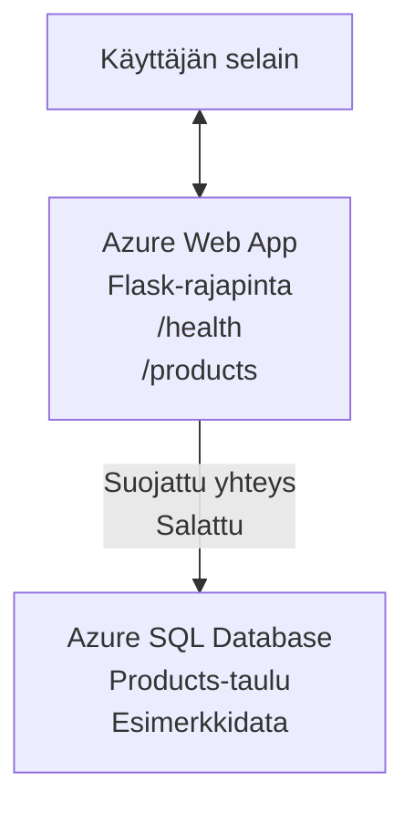

# Deploying a Microsoft SQL Database and Web App with AZD

⏱️ **Arvioitu aika**: 20–30 minuuttia | 💰 **Arvioidut kustannukset**: ~15–25 $/kk | ⭐ **Vaikeustaso**: Keskitaso

Tämä **täydellinen, toimiva esimerkki** näyttää, miten voit käyttää [Azure Developer CLI (azd)](https://learn.microsoft.com/azure/developer/azure-developer-cli/) -työkalua Python Flask -verkkosovelluksen ja Microsoft SQL -tietokannan käyttöönottoon Azureen. Kaikki koodi sisältyy ja on testattu—ei ulkoisia riippuvuuksia vaadita.

## Mitä opit

Suorittamalla tämän esimerkin opit:
- Ottamaan käyttöön monikerroksisen sovelluksen (web-sovellus + tietokanta) infrastruktuuri-koodina
- Konfiguroimaan turvalliset tietokantayhteydet ilman kovakoodattuja salaisuuksia
- Valvomaan sovelluksen terveyttä Application Insightsilla
- Hallitsemaan Azure-resursseja tehokkaasti AZD CLI:llä
- Noudattamaan Azuren parhaita käytäntöjä tietoturvan, kustannusten optimoinnin ja havaittavuuden osalta

## Tilannekuvaus
- **Web App**: Python Flask REST API tietokantayhteydellä
- **Database**: Azure SQL Database esimerkkidatalla
- **Infrastructure**: Provisionoitu Bicepillä (modulaariset, uudelleenkäytettävät templatet)
- **Deployment**: Täysin automatisoitu `azd`-komennoilla
- **Monitoring**: Application Insights lokitukseen ja telemetriaan

## Esivaatimukset

### Tarvittavat työkalut

Ennen aloittamista varmista, että sinulla on seuraavat työkalut asennettuna:

1. **[Azure CLI](https://learn.microsoft.com/cli/azure/install-azure-cli)** (versio 2.50.0 tai uudempi)
   ```sh
   az --version
   # Odotettu tuloste: azure-cli 2.50.0 tai uudempi
   ```

2. **[Azure Developer CLI (azd)](https://learn.microsoft.com/azure/developer/azure-developer-cli/install-azd)** (versio 1.0.0 tai uudempi)
   ```sh
   azd version
   # Odotettu tulos: azd versio 1.0.0 tai uudempi
   ```

3. **[Python 3.8+](https://www.python.org/downloads/)** (paikalliseen kehitykseen)
   ```sh
   python --version
   # Odotettu tulostus: Python 3.8 tai uudempi
   ```

4. **[Docker](https://www.docker.com/get-started)** (valinnainen, paikalliseen konttikehitykseen)
   ```sh
   docker --version
   # Odotettu tulostus: Dockerin versio 20.10 tai uudempi
   ```

### Azure-vaatimukset

- Aktiivinen **Azure-tilaus** ([luo ilmainen tili](https://azure.microsoft.com/free/))
- Oikeudet resurssien luomiseen tilauksessasi
- **Owner** tai **Contributor** -rooli tilauksessa tai resurssiryhmässä

### Osaamisvaatimukset

Tämä on **keskitasoinen** esimerkki. Sinun tulisi tuntea:
- Perustason komentorivin käyttö
- Pilvipalveluiden peruskäsitteet (resurssit, resurssiryhmät)
- Perusymmärrys web-sovelluksista ja tietokannoista

**Uusi AZD:lle?** Aloita [Aloitusopas](../../docs/chapter-01-foundation/azd-basics.md) -osiosta ensin.

## Arkkitehtuuri

Tämä esimerkki ottaa käyttöön kaksikerroksisen arkkitehtuurin web-sovelluksella ja SQL-tietokannalla:


**Resurssien käyttöönotto:**
- **Resource Group**: Kaikkien resurssien säilö
- **App Service Plan**: Linux-pohjainen hosting (B1-taso kustannustehokkuutta varten)
- **Web App**: Python 3.11 -ympäristö Flask-sovelluksella
- **SQL Server**: Hallinnoitu tietokantapalvelin, vähintään TLS 1.2
- **SQL Database**: Basic-taso (2GB, sopii kehitykseen/testaukseen)
- **Application Insights**: Valvonta ja lokitus
- **Log Analytics Workspace**: Keskitetty lokitallennus

**Analogiana**: Ajattele tätä kuin ravintolaa (web-sovellus) ja keittiön kylmävarastoa (tietokanta). Asiakkaat tilaavat ruokalistalta (API-päätepisteet), ja keittiö (Flask-sovellus) hakee ainekset (data) kylmävarastosta. Ravintolapäällikkö (Application Insights) seuraa kaikkea tapahtuvaa.

## Kansiorakenne

Kaikki tiedostot sisältyvät tähän esimerkkiin—ei ulkoisia riippuvuuksia:

```
examples/database-app/
│
├── README.md                    # This file
├── azure.yaml                   # AZD configuration file
├── .env.sample                  # Sample environment variables
├── .gitignore                   # Git ignore patterns
│
├── infra/                       # Infrastructure as Code (Bicep)
│   ├── main.bicep              # Main orchestration template
│   ├── abbreviations.json      # Azure naming conventions
│   └── resources/              # Modular resource templates
│       ├── sql-server.bicep    # SQL Server configuration
│       ├── sql-database.bicep  # Database configuration
│       ├── app-service-plan.bicep  # Hosting plan
│       ├── app-insights.bicep  # Monitoring setup
│       └── web-app.bicep       # Web application
│
└── src/
    └── web/                    # Application source code
        ├── app.py              # Flask REST API
        ├── requirements.txt    # Python dependencies
        └── Dockerfile          # Container definition
```

**Mitä kukin tiedosto tekee:**
- **azure.yaml**: Ilmoittaa AZD:lle mitä ottaa käyttöön ja mihin
- **infra/main.bicep**: Orkestroi kaikki Azure-resurssit
- **infra/resources/*.bicep**: Yksittäiset resurssimäärittelyt (modulaarisia uudelleenkäyttöä varten)
- **src/web/app.py**: Flask-sovellus tietokantalogiiikalla
- **requirements.txt**: Python-pakettien riippuvuudet
- **Dockerfile**: Kontitusohjeet käyttöönottoa varten

## Pikakäynnistys (vaihe vaiheelta)

### Vaihe 1: Kloonaa ja siirry kansioon

```sh
git clone https://github.com/microsoft/AZD-for-beginners.git
cd AZD-for-beginners/examples/database-app
```

**✓ Onnistumistarkistus**: Varmista, että näet `azure.yaml` ja `infra/`-kansion:
```sh
ls
# Odotetaan: README.md, azure.yaml, infra/, src/
```

### Vaihe 2: Todennus Azureen

```sh
azd auth login
```

Tämä avaa selaimesi Azuren todennusta varten. Kirjaudu sisään Azure-kirjautumistiedoillasi.

**✓ Onnistumistarkistus**: Sinun pitäisi nähdä:
```
Logged in to Azure.
```

### Vaihe 3: Alusta ympäristö

```sh
azd init
```

**Mitä tapahtuu**: AZD luo paikallisen konfiguraation käyttöönotollesi.

**Kehoteet, jotka näet**:
- **Environment name**: Anna lyhyt nimi (esim. `dev`, `myapp`)
- **Azure subscription**: Valitse tilauksesi listasta
- **Azure location**: Valitse alue (esim. `eastus`, `westeurope`)

**✓ Onnistumistarkistus**: Sinun pitäisi nähdä:
```
SUCCESS: New project initialized!
```

### Vaihe 4: Provisionoi Azure-resurssit

```sh
azd provision
```

**Mitä tapahtuu**: AZD ottaa käyttöön kaiken infrastruktuurin (kestää 5–8 minuuttia):
1. Luo resurssiryhmän
2. Luo SQL Serverin ja tietokannan
3. Luo App Service Planin
4. Luo Web Appin
5. Luo Application Insightsin
6. Konfiguroi verkotus ja tietoturva

**Sinulta kysytään**:
- **SQL admin username**: Anna käyttäjänimi (esim. `sqladmin`)
- **SQL admin password**: Anna vahva salasana (tallenna tämä!)

**✓ Onnistumistarkistus**: Sinun pitäisi nähdä:
```
SUCCESS: Your application was provisioned in Azure in X minutes Y seconds.
You can view the resources created under the resource group rg-<env-name> in Azure Portal:
https://portal.azure.com/#@/resource/subscriptions/.../resourceGroups/rg-<env-name>
```

**⏱️ Aika**: 5–8 minuuttia

### Vaihe 5: Ota sovellus käyttöön

```sh
azd deploy
```

**Mitä tapahtuu**: AZD rakentaa ja ottaa Flask-sovelluksesi käyttöön:
1. Pakkaa Python-sovellus
2. Rakentaa Docker-kontin
3. Työntää sen Azure Web Appiin
4. Alustaa tietokannan esimerkkidatalla
5. Käynnistää sovelluksen

**✓ Onnistumistarkistus**: Sinun pitäisi nähdä:
```
SUCCESS: Your application was deployed to Azure in X minutes Y seconds.
You can view the resources created under the resource group rg-<env-name> in Azure Portal:
https://portal.azure.com/#@/resource/subscriptions/.../resourceGroups/rg-<env-name>
```

**⏱️ Aika**: 3–5 minuuttia

### Vaihe 6: Selaa sovellusta

```sh
azd browse
```

Tämä avaa käyttöön otetun web-sovelluksesi selaimessa osoitteessa `https://app-<unique-id>.azurewebsites.net`

**✓ Onnistumistarkistus**: Sinun pitäisi nähdä JSON-tulostus:
```json
{
  "message": "Welcome to the Database App API",
  "endpoints": {
    "/": "This help message",
    "/health": "Health check endpoint",
    "/products": "List all products",
    "/products/<id>": "Get product by ID"
  }
}
```

### Vaihe 7: Testaa API-päätepisteet

**Health Check** (varmista tietokantayhteys):
```sh
curl https://app-<your-id>.azurewebsites.net/health
```

**Odotettu vastaus**:
```json
{
  "status": "healthy",
  "database": "connected"
}
```

**List Products** (esimerkkidata):
```sh
curl https://app-<your-id>.azurewebsites.net/products
```

**Odotettu vastaus**:
```json
[
  {
    "id": 1,
    "name": "Laptop",
    "description": "High-performance laptop",
    "price": 1299.99,
    "created_at": "2025-11-19T10:30:00"
  },
  ...
]
```

**Get Single Product**:
```sh
curl https://app-<your-id>.azurewebsites.net/products/1
```

**✓ Onnistumistarkistus**: Kaikki päätepisteet palauttavat JSON-dataa ilman virheitä.

---

**🎉 Onnittelut!** Olet onnistuneesti ottanut web-sovelluksen tietokannan kanssa käyttöön Azureen käyttäen AZD:tä.

## Konfiguraation syväluotaus

### Ympäristömuuttujat

Salaisuuksia hallitaan turvallisesti Azure App Servicen konfiguraatiolla—**älä koskaan kovakoodaa lähdekoodiin**.

**AZD konfiguroi automaattisesti**:
- `SQL_CONNECTION_STRING`: Tietokantayhteys salatuilla tunnuksilla
- `APPLICATIONINSIGHTS_CONNECTION_STRING`: Telemetrian seurantaosoite
- `SCM_DO_BUILD_DURING_DEPLOYMENT`: Mahdollistaa riippuvuuksien automaattisen asennuksen

**Missä salaisuudet säilytetään**:
1. `azd provision`-komennon aikana annat SQL-tunnukset turvallisesti kehotteessa
2. AZD tallentaa ne paikalliseen `.azure/<env-name>/.env`-tiedostoon (git-ignored)
3. AZD lisää ne Azure App Service -konfiguraatioon (salattu levossa)
4. Sovellus lukee ne `os.getenv()`-kutsuin ajon aikana

### Paikallinen kehitys

Paikallista testausta varten luo `.env`-tiedosto esimerkistä:

```sh
cp .env.sample .env
# Muokkaa .env-tiedostoa paikallisella tietokantayhteydelläsi
```

**Paikallisen kehityksen työnkulku**:
```sh
# Asenna riippuvuudet
cd src/web
pip install -r requirements.txt

# Aseta ympäristömuuttujat
export SQL_CONNECTION_STRING="your-local-connection-string"

# Suorita sovellus
python app.py
```

**Testaa paikallisesti**:
```sh
curl http://localhost:8000/health
# Odotettu: {"status": "healthy", "database": "connected"}
```

### Infrastructure as Code

Kaikki Azure-resurssit on määritelty **Bicep-templaten** tiedostoissa (`infra/`-kansio):

- **Modulaarinen suunnittelu**: Jokaisella resurssityypillä on oma tiedosto uudelleenkäytettävyyttä varten
- **Parametrisoitu**: Mukauta SKUja, alueita, nimeämiskäytäntöjä
- **Parhaat käytännöt**: Seuraa Azuren nimeämisstandardeja ja tietoturva-asetuksia
- **Versiohallinta**: Infrastruktuurin muutokset seurataan Gitissä

**Mukautusesimerkki**:
Muuta tietokannan tasoa muokkaamalla `infra/resources/sql-database.bicep`:
```bicep
sku: {
  name: 'Standard'  // Changed from 'Basic'
  tier: 'Standard'
  capacity: 10
}
```

## Tietoturvan parhaat käytännöt

Tämä esimerkki noudattaa Azuren tietoturvan parhaita käytäntöjä:

### 1. **Ei salaisuuksia lähdekoodissa**
- ✅ Tunnukset säilytetään Azure App Service -konfiguraatiossa (salattu)
- ✅ `.env`-tiedostot on suljettu Gitistä `.gitignore`-asetuksella
- ✅ Salaisuudet annetaan turvallisesti parametrina provisioinnin aikana

### 2. **Salatut yhteydet**
- ✅ TLS 1.2 vähintään SQL Serverille
- ✅ HTTPS-vaatimuksen pakottaminen Web Appissa
- ✅ Tietokantayhteydet käyttävät salattuja kanavia

### 3. **Verkon suojaus**
- ✅ SQL Serverin palomuuri konfiguroitu sallimaan vain Azure-palvelut
- ✅ Julkinen verkkoyhteys rajoitettu (voidaan lukita lisää Private Endpointeilla)
- ✅ FTPS poistettu käytöstä Web Appissa

### 4. **Todennus & valtuutus**
- ⚠️ **Tällä hetkellä**: SQL-autentikaatio (käyttäjätunnus/salasana)
- ✅ **Tuotantosuositus**: Käytä Azure Managed Identityä salasanojen sijaan

**Päivitys Managed Identityyn** (tuotantoon):
1. Ota hallinnoitu identiteetti käyttöön Web Appissa
2. Anna identiteetille SQL-oikeudet
3. Päivitä yhteysmerkkijono käyttämään hallittua identiteettiä
4. Poista salasanaan perustuva autentikointi

### 5. **Auditointi & vaatimustenmukaisuus**
- ✅ Application Insights kirjaa kaikki pyynnöt ja virheet
- ✅ SQL Database -auditointi otettu käyttöön (voidaan konfiguroida vaatimustenmukaisuuteen)
- ✅ Kaikki resurssit on tagattu hallintaa varten

**Tietoturvalista ennen tuotantoon siirtymistä**:
- [ ] Ota Azure Defender for SQL käyttöön
- [ ] Konfiguroi Private Endpointit SQL-tietokannalle
- [ ] Ota Web Application Firewall (WAF) käyttöön
- [ ] Ota käyttöön Azure Key Vault salaisuuksien kiertoa varten
- [ ] Konfiguroi Azure AD -todennus
- [ ] Ota diagnostiikkalokit käyttöön kaikille resursseille

## Kustannusten optimointi

**Arvioidut kuukausikustannukset** (tilanne marraskuu 2025):

| Resurssi | SKU/Taso | Arvioitu kustannus |
|----------|----------|--------------------|
| App Service Plan | B1 (Basic) | ~13 $/kk |
| SQL Database | Basic (2GB) | ~5 $/kk |
| Application Insights | Pay-as-you-go | ~2 $/kk (vähäinen liikenne) |
| **Yhteensä** | | **~20 $/kk** |

**💡 Kustannussäästövinkkejä**:

1. **Käytä ilmaistasoa oppimiseen**:
   - App Service: F1-taso (ilmainen, rajoitetut tunnit)
   - SQL Database: Käytä Azure SQL Database serverless -vaihtoehtoa
   - Application Insights: 5GB/kk ilmaista ingestiota

2. **Pysäytä resurssit, kun et käytä niitä**:
   ```sh
   # Pysäytä web-sovellus (tietokanta kuitenkin veloittaa edelleen)
   az webapp stop --name <app-name> --resource-group <rg-name>
   
   # Käynnistä uudelleen tarvittaessa
   az webapp start --name <app-name> --resource-group <rg-name>
   ```

3. **Poista kaikki testauksen jälkeen**:
   ```sh
   azd down
   ```
   Tämä poistaa KAIKKI resurssit ja lopettaa laskutuksen.

4. **Kehitys- vs. tuotantotason SKUt**:
   - **Kehitys**: Basic-taso (käytetty tässä esimerkissä)
   - **Tuotanto**: Standard/Premium-taso redundanssilla

**Kustannusseuranta**:
- Tarkastele kustannuksia [Azure Cost Management](https://portal.azure.com/#view/Microsoft_Azure_CostManagement)
- Määritä kustannushälytykset yllätyksien välttämiseksi
- Taggaa kaikki resurssit `azd-env-name`-tagilla seurannan helpottamiseksi

**Ilmaisen tason vaihtoehto**:
Oppimista varten voit muokata `infra/resources/app-service-plan.bicep`:
```bicep
sku: {
  name: 'F1'  // Free tier
  tier: 'Free'
}
```
**Huom**: Ilmaistasolla on rajoituksia (60 min/vrk CPU, ei always-on).

## Valvonta & havaittavuus

### Application Insights -integraatio

Tämä esimerkki sisältää **Application Insightsin** kattavaan valvontaan:

**Mitä valvotaan**:
- ✅ HTTP-pyynnöt (latenssi, tilakoodit, päätepisteet)
- ✅ Sovellusvirheet ja poikkeukset
- ✅ Räätälöity lokitus Flask-sovelluksesta
- ✅ Tietokantayhteyden tila
- ✅ Suorituskykymittarit (CPU, muisti)

**Pääsy Application Insightsiin**:
1. Avaa [Azure Portal](https://portal.azure.com)
2. Siirry resurssiryhmääsi (`rg-<env-name>`)
3. Klikkaa Application Insights -resurssia (`appi-<unique-id>`)

**Hyödylliset kyselyt** (Application Insights → Logs):

**Näytä kaikki pyynnöt**:
```kusto
requests
| where timestamp > ago(1h)
| order by timestamp desc
| project timestamp, name, url, resultCode, duration
```

**Etsi virheitä**:
```kusto
exceptions
| where timestamp > ago(24h)
| order by timestamp desc
| project timestamp, type, outerMessage, operation_Name
```

**Tarkista health-päätepiste**:
```kusto
requests
| where name contains "health"
| summarize count() by resultCode, bin(timestamp, 1h)
```

### SQL-tietokannan auditointi

**SQL Database -auditointi on käytössä** seurannan vuoksi:
- Tietokannan käyttökuviot
- Epäonnistuneet kirjautumisyritykset
- Skeeman muutokset
- Datan käyttö (vaatimustenmukaisuutta varten)

**Pääsy audit-lokeihin**:
1. Azure Portal → SQL Database → Auditing
2. Katso lokit Log Analytics -workspaceissa

### Reaaliaikainen valvonta

**Näytä Live Metrics**:
1. Application Insights → Live Metrics
2. Näet pyynnöt, virheet ja suorituskyvyn reaaliajassa

**Määritä hälytykset**:
Luo hälytyksiä kriittisille tapahtumille:
- HTTP 500 -virheet > 5 viidessä minuutissa
- Tietokantayhteyksien epäonnistumiset
- Korkeat vasteajat (>2 sekuntia)

**Esimerkkihälytyksen luominen**:
```sh
az monitor metrics alert create \
  --name "High-Response-Time" \
  --resource-group <rg-name> \
  --scopes <app-insights-resource-id> \
  --condition "avg requests/duration > 2000" \
  --description "Alert when response time exceeds 2 seconds"
```

## Vianmääritys
### Yleisiä ongelmia ja ratkaisuja

#### 1. `azd provision` epäonnistuu ilmoituksella "Location not available"

**Oire**:
```
Error: The subscription is not registered for the resource type 'components' in the location 'centralus'.
```

**Ratkaisu**:
Valitse toinen Azure-alue tai rekisteröi resurssitoimittaja:
```sh
az provider register --namespace Microsoft.Insights
```

#### 2. SQL-yhteys epäonnistuu käyttöönoton aikana

**Oire**:
```
pyodbc.OperationalError: ('08001', '[08001] [Microsoft][ODBC Driver 18 for SQL Server]TCP Provider...')
```

**Ratkaisu**:
- Varmista, että SQL Serverin palomuuri sallii Azure-palvelut (määritetään automaattisesti)
- Tarkista, että SQL-järjestelmänvalvojan salasana syötettiin oikein `azd provision` -komennon aikana
- Varmista, että SQL Server on täysin provisioitu (voi kestää 2–3 minuuttia)

**Vahvista yhteys**:
```sh
# Azure-portaalista siirry SQL Database → Query editoriin
# Yritä muodostaa yhteys tunnistetiedoillasi
```

#### 3. Web App Shows "Application Error"

**Oire**:
Selain näyttää yleisen virhesivun.

**Ratkaisu**:
Tarkista sovelluksen lokit:
```sh
# Näytä viimeisimmät lokit
az webapp log tail --name <app-name> --resource-group <rg-name>
```

**Yleisiä syitä**:
- Puuttuvat ympäristömuuttujat (tarkista App Service → Configuration)
- Python-pakettien asennus epäonnistui (tarkista käyttöönoton lokit)
- Tietokannan alustuksen virhe (tarkista SQL-yhteydet)

#### 4. `azd deploy` epäonnistuu virheellä "Build Error"

**Oire**:
```
Error: Failed to build project
```

**Ratkaisu**:
- Varmista, että `requirements.txt`-tiedostossa ei ole syntaksivirheitä
- Tarkista, että Python 3.11 on määritetty tiedostossa `infra/resources/web-app.bicep`
- Varmista, että Dockerfilessä on oikea peruskuva

**Vianmääritys paikallisesti**:
```sh
cd src/web
docker build -t test-app .
docker run -p 8000:8000 test-app
```

#### 5. "Unauthorized" AZD-komentojen suorittamisen yhteydessä

**Oire**:
```
ERROR: (Unauthorized) The client '<id>' with object id '<id>' does not have authorization
```

**Ratkaisu**:
Kirjaudu uudelleen Azureen:
```sh
# Pakollinen AZD-työnkuluissa
azd auth login

# Valinnainen, jos käytät myös Azure CLI -komentoja suoraan
az login
```

Varmista, että sinulla on oikeat käyttöoikeudet (Contributor-rooli) tilaukseen.

#### 6. Korkeat tietokantakustannukset

**Oire**:
Odottamaton Azure-lasku.

**Ratkaisu**:
- Tarkista, ettet unohtanut suorittaa `azd down`-komentoa testauksen jälkeen
- Varmista, että SQL Database käyttää Basic-tasoa (ei Premium)
- Tarkista kulut Azure Cost Managementissa
- Ota käyttöön kustannushälytykset

### Apua

**Näytä kaikki AZD-ympäristömuuttujat**:
```sh
azd env get-values
```

**Tarkista käyttöönoton tila**:
```sh
az webapp show --name <app-name> --resource-group <rg-name> --query state
```

**Pääsy sovelluksen lokitietoihin**:
```sh
az webapp log download --name <app-name> --resource-group <rg-name> --log-file app-logs.zip
```

**Tarvitsetko lisää apua?**
- [AZD-vianmääritysohje](../../docs/chapter-07-troubleshooting/common-issues.md)
- [Azure App Service -vianmääritys](https://learn.microsoft.com/azure/app-service/troubleshoot-diagnostic-logs)
- [Azure SQL -vianmääritys](https://learn.microsoft.com/azure/azure-sql/database/troubleshoot-common-errors-issues)

## Käytännön harjoitukset

### Harjoitus 1: Vahvista käyttöönotto (Aloittelija)

**Tavoite**: Varmistaa, että kaikki resurssit on otettu käyttöön ja sovellus toimii.

**Vaiheet**:
1. Listaa kaikki resurssit resurssiryhmässäsi:
   ```sh
   az resource list --resource-group rg-<env-name> --output table
   ```
   **Odotettu**: 6–7 resurssia (Web App, SQL Server, SQL Database, App Service Plan, Application Insights, Log Analytics)

2. Testaa kaikki API-päätepisteet:
   ```sh
   curl https://app-<your-id>.azurewebsites.net/
   curl https://app-<your-id>.azurewebsites.net/health
   curl https://app-<your-id>.azurewebsites.net/products
   curl https://app-<your-id>.azurewebsites.net/products/1
   ```
   **Odotettu**: Kaikki palauttavat kelvollista JSONia ilman virheitä

3. Tarkista Application Insights:
   - Siirry Application Insightsiin Azure-portaalissa
   - Siirry "Live Metrics" -näkymään
   - Päivitä selaimesi web-sovelluksen sivulla
   **Odotettu**: Näet pyyntöjen ilmestyvän reaaliajassa

**Onnistumisen kriteerit**: Kaikki 6–7 resurssia ovat olemassa, kaikki päätepisteet palauttavat dataa, Live Metrics näyttää toimintaa.

---

### Harjoitus 2: Lisää uusi API-päätepiste (Keskitaso)

**Tavoite**: Laajenna Flask-sovellusta uudella päätepisteellä.

**Alkukoodi**: Nykyiset päätepisteet tiedostossa `src/web/app.py`

**Vaiheet**:
1. Muokkaa `src/web/app.py`-tiedostoa ja lisää uusi päätepiste `get_product()`-funktion jälkeen:
   ```python
   @app.route('/products/search/<keyword>')
   def search_products(keyword):
       """Search products by name or description."""
       try:
           conn = get_db_connection()
           cursor = conn.cursor()
           cursor.execute(
               "SELECT id, name, description, price, created_at FROM products WHERE name LIKE ? OR description LIKE ?",
               (f'%{keyword}%', f'%{keyword}%')
           )
           
           products = []
           for row in cursor.fetchall():
               products.append({
                   'id': row[0],
                   'name': row[1],
                   'description': row[2],
                   'price': float(row[3]) if row[3] else None,
                   'created_at': row[4].isoformat() if row[4] else None
               })
           
           cursor.close()
           conn.close()
           
           logger.info(f"Search for '{keyword}' returned {len(products)} results")
           return jsonify(products), 200
           
       except Exception as e:
           logger.error(f"Error searching products: {str(e)}")
           return jsonify({'error': str(e)}), 500
   ```

2. Ota päivitetty sovellus käyttöön:
   ```sh
   azd deploy
   ```

3. Testaa uusi päätepiste:
   ```sh
   curl https://app-<your-id>.azurewebsites.net/products/search/laptop
   ```
   **Odotettu**: Palauttaa tuotteet, jotka vastaavat hakua "laptop"

**Onnistumisen kriteerit**: Uusi päätepiste toimii, palauttaa suodatetut tulokset, näkyy Application Insights -lokitiedoissa.

---

### Harjoitus 3: Lisää valvonta ja hälytykset (Edistynyt)

**Tavoite**: Ota käyttöön proaktiivinen valvonta hälytyksillä.

**Vaiheet**:
1. Luo hälytys HTTP 500 -virheille:
   ```sh
   # Hae Application Insights -resurssin tunniste
   AI_ID=$(az monitor app-insights component show \
     --app appi-<your-id> \
     --resource-group rg-<env-name> \
     --query id -o tsv)
   
   # Luo hälytys
   az monitor metrics alert create \
     --name "High-Error-Rate" \
     --resource-group rg-<env-name> \
     --scopes $AI_ID \
     --condition "count requests/failed > 5" \
     --window-size 5m \
     --evaluation-frequency 1m \
     --description "Alert when >5 failed requests in 5 minutes"
   ```

2. Laukaise hälytys aiheuttamalla virheitä:
   ```sh
   # Pyydä olematonta tuotetta
   for i in {1..10}; do curl https://app-<your-id>.azurewebsites.net/products/999; done
   ```

3. Tarkista, laukesiko hälytys:
   - Azure Portal → Alerts → Alert Rules
   - Tarkista sähköpostisi (jos konfiguroitu)

**Onnistumisen kriteerit**: Hälyssääntö on luotu, laukeaa virheissä, ilmoitukset vastaanotetaan.

---

### Harjoitus 4: Tietokannan skeeman muutokset (Edistynyt)

**Tavoite**: Lisää uusi taulu ja muokkaa sovellusta käyttämään sitä.

**Vaiheet**:
1. Yhdistä SQL-tietokantaan Azure-portaalin Query Editorin kautta

2. Luo uusi `categories`-taulu:
   ```sql
   CREATE TABLE categories (
       id INT PRIMARY KEY IDENTITY(1,1),
       name NVARCHAR(50) NOT NULL,
       description NVARCHAR(200)
   );
   
   INSERT INTO categories (name, description) VALUES
   ('Electronics', 'Electronic devices and accessories'),
   ('Office Supplies', 'Office equipment and supplies');
   
   -- Add category to products table
   ALTER TABLE products ADD category_id INT;
   UPDATE products SET category_id = 1; -- Set all to Electronics
   ```

3. Päivitä `src/web/app.py` lisäämään kategorian tiedot vastauksiin

4. Ota käyttöön ja testaa

**Onnistumisen kriteerit**: Uusi taulu on olemassa, tuotteet näyttävät kategorian tiedot, sovellus toimii edelleen.

---

### Harjoitus 5: Ota välimuisti käyttöön (Asiantuntija)

**Tavoite**: Lisää Azure Redis Cache parantamaan suorituskykyä.

**Vaiheet**:
1. Lisää Redis Cache tiedostoon `infra/main.bicep`
2. Päivitä `src/web/app.py` välimuistitusta varten tuotteiden kyselyille
3. Mittaa suorituskyvyn parannus Application Insightsin avulla
4. Vertaa vastauksen aikoja ennen ja jälkeen välimuistin

**Onnistumisen kriteerit**: Redis on otettu käyttöön, välimuistitus toimii, vasteajat paranevat yli 50 %.

**Vinkki**: Aloita [Azure Cache for Redis -dokumentaatio](https://learn.microsoft.com/azure/azure-cache-for-redis/).

---

## Siivous

Jatkuvien kulujen välttämiseksi poista kaikki resurssit, kun olet valmis:

```sh
azd down
```

**Vahvistuskehotus**:
```
? Total resources to delete: 7, are you sure you want to continue? (y/N)
```

Kirjoita `y` vahvistaaksesi.

**✓ Onnistumisen tarkistus**: 
- Kaikki resurssit on poistettu Azure-portaalista
- Ei jatkuvia kuluja
- Paikallinen `.azure/<env-name>`-kansio voidaan poistaa

**Vaihtoehto** (pidä infrastruktuuri, poista data):
```sh
# Poista vain resurssiryhmä (säilytä AZD-konfiguraatio)
az group delete --name rg-<env-name> --yes
```
## Lisätietoja

### Liittyvä dokumentaatio
- [Azure Developer CLI -dokumentaatio](https://learn.microsoft.com/azure/developer/azure-developer-cli/)
- [Azure SQL Database -dokumentaatio](https://learn.microsoft.com/azure/azure-sql/database/)
- [Azure App Service -dokumentaatio](https://learn.microsoft.com/azure/app-service/)
- [Application Insights -dokumentaatio](https://learn.microsoft.com/azure/azure-monitor/app/app-insights-overview)
- [Bicep-kielen viite](https://learn.microsoft.com/azure/azure-resource-manager/bicep/)

### Seuraavat askeleet tässä kurssissa
- **[Container Apps -esimerkki](../../../../examples/container-app)**: Ota käyttöön mikropalvelut Azure Container Appsin avulla
- **[AI-integraatio-opas](../../../../docs/ai-foundry)**: Lisää sovellukseesi tekoälyominaisuuksia
- **[Käyttöönoton parhaat käytännöt](../../docs/chapter-04-infrastructure/deployment-guide.md)**: Tuotantokäyttöönoton mallit

### Edistyneet aiheet
- **Managed Identity**: Poista salasanat ja käytä Azure AD -todennusta
- **Private Endpoints**: Suojaa tietokantayhteydet virtuaaliverkon sisällä
- **CI/CD Integration**: Automatisoi käyttöönotot GitHub Actionsilla tai Azure DevOpsilla
- **Multi-Environment**: Määritä kehitys-, testi- ja tuotantoympäristöt
- **Database Migrations**: Käytä Alembicia tai Entity Frameworkiä skeeman versiointiin

### Vertailu muihin lähestymistapoihin

**AZD vs. ARM Templates**:
- ✅ AZD: Korkeamman tason abstraktio, yksinkertaisemmat komennot
- ⚠️ ARM: Yksityiskohtaisempi, hienojakoisempi hallinta

**AZD vs. Terraform**:
- ✅ AZD: Azure-lähtöinen, integroitu Azure-palveluihin
- ⚠️ Terraform: Monipilvituki, laajempi ekosysteemi

**AZD vs. Azure Portal**:
- ✅ AZD: Toistettavissa, versionhallittu, automatisoitavissa
- ⚠️ Portal: Manuaaliset klikkaukset, vaikea toistaa

Ajattele AZD:ta kuten Docker Composea Azuren varten—yksinkertaistettu konfiguraatio monimutkaisille käyttöönotolle.

---

## Usein kysytyt kysymykset

**K: Voinko käyttää eri ohjelmointikieltä?**  
V: Kyllä! Korvaa `src/web/` Node.js:llä, C#:lla, Go:lla tai millä tahansa kielellä. Päivitä `azure.yaml` ja Bicep vastaavasti.

**K: Kuinka lisään lisää tietokantoja?**  
V: Lisää toinen SQL Database -moduuli tiedostoon `infra/main.bicep` tai käytä PostgreSQL/MySQL:ää Azure Database -palveluista.

**K: Voinko käyttää tätä tuotannossa?**  
V: Tämä on lähtökohta. Tuotantoon lisää: managed identity, private endpoints, redundanssi, varmuuskopiointistrategia, WAF ja laajennettu valvonta.

**K: Entä jos haluan käyttää kontteja koodin sijaan?**  
V: Tutustu [Container Apps -esimerkkiin](../../../../examples/container-app), joka käyttää Docker-kontteja kauttaaltaan.

**K: Kuinka yhdistän tietokantaan paikalliselta koneeltani?**  
V: Lisää IP-osoitteesi SQL Serverin palomuuriin:
```sh
az sql server firewall-rule create \
  --resource-group rg-<env-name> \
  --server sql-<unique-id> \
  --name AllowMyIP \
  --start-ip-address <your-ip> \
  --end-ip-address <your-ip>
```

**K: Voinko käyttää olemassa olevaa tietokantaa uuden luomisen sijaan?**  
V: Kyllä, muokkaa `infra/main.bicep`-tiedostoa viittaamaan olemassa olevaan SQL Serveriin ja päivitä yhteysmerkkijonomuuttujat.

> **Huom:** Tässä esimerkissä esitellään parhaat käytännöt web-sovelluksen ja tietokannan käyttöönottoon AZD:n avulla. Se sisältää toimivan koodin, kattavan dokumentaation ja käytännön harjoituksia oppimisen vahvistamiseksi. Tuotantokäyttöönottoa varten tarkista organisaatiollesi ominaiset turvallisuus-, skaalautuvuus-, vaatimustenmukaisuus- ja kustannusvaatimukset.

**📚 Kurssin navigointi:**
- ← Edellinen: [Container Apps -esimerkki](../../../../examples/container-app)
- → Seuraava: [AI-integraatio-opas](../../../../docs/ai-foundry)
- 🏠 [Kurssin etusivu](../../README.md)

---

<!-- CO-OP TRANSLATOR DISCLAIMER START -->
**Vastuuvapauslauseke**:
Tämä asiakirja on käännetty käyttämällä tekoälypohjaista käännöspalvelua [Co-op Translator](https://github.com/Azure/co-op-translator). Vaikka pyrimme tarkkuuteen, on syytä huomioida, että automaattiset käännökset saattavat sisältää virheitä tai epätarkkuuksia. Alkuperäistä asiakirjaa sen alkuperäiskielellä tulee pitää virallisena lähteenä. Tärkeiden tietojen osalta suositellaan ammattimaista ihmiskäännöstä. Emme ole vastuussa tämän käännöksen käytöstä aiheutuvista väärinymmärryksistä tai virheellisistä tulkinnoista.
<!-- CO-OP TRANSLATOR DISCLAIMER END -->