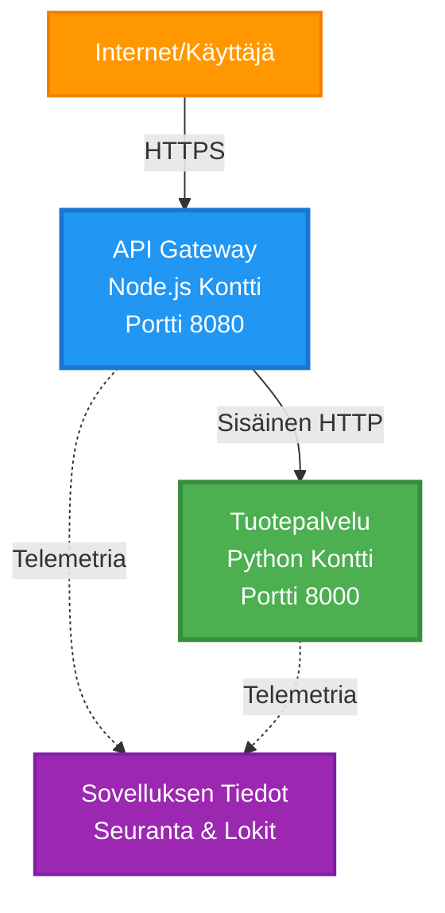
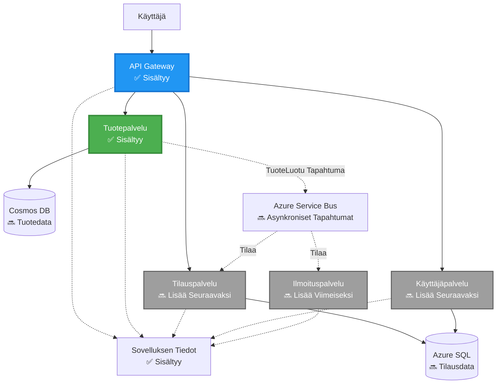
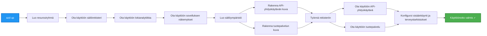
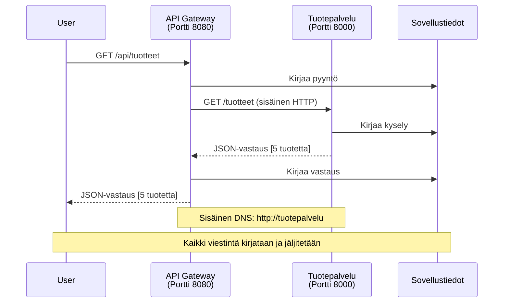

<!--
CO_OP_TRANSLATOR_METADATA:
{
  "original_hash": "eb3a4803a1e80a7f2e64f6bf63738c0f",
  "translation_date": "2025-11-21T18:26:01+00:00",
  "source_file": "examples/microservices/README.md",
  "language_code": "fi"
}
-->
# Mikropalveluarkkitehtuuri - Esimerkki konttisovelluksesta

⏱️ **Arvioitu aika**: 25-35 minuuttia | 💰 **Arvioidut kustannukset**: ~$50-100/kk | ⭐ **Vaikeustaso**: Edistynyt

**📚 Oppimispolku:**
- ← Edellinen: [Yksinkertainen Flask API](../../../../examples/container-app/simple-flask-api) - Yhden kontin perusteet
- 🎯 **Olet täällä**: Mikropalveluarkkitehtuuri (2-palvelun perusta)
- → Seuraava: [AI-integraatio](../../../../docs/ai-foundry) - Lisää älykkyyttä palveluihisi
- 🏠 [Kurssin etusivu](../../README.md)

---

**Yksinkertaistettu mutta toimiva** mikropalveluarkkitehtuuri, joka on otettu käyttöön Azure Container Apps -ympäristössä AZD CLI:n avulla. Tämä esimerkki havainnollistaa palveluiden välistä viestintää, konttien orkestrointia ja valvontaa käytännöllisellä kahden palvelun kokoonpanolla.

> **📚 Oppimistapa**: Tämä esimerkki alkaa minimaalisella kahden palvelun arkkitehtuurilla (API Gateway + Backend-palvelu), jonka voit oikeasti ottaa käyttöön ja oppia siitä. Kun hallitset tämän perustan, tarjoamme ohjeita laajentamiseen täyteen mikropalveluekosysteemiin.

## Mitä opit

Tämän esimerkin suorittamalla opit:
- Ottamaan käyttöön useita kontteja Azure Container Apps -ympäristössä
- Toteuttamaan palveluiden välistä viestintää sisäisellä verkolla
- Konfiguroimaan ympäristöön perustuvaa skaalautumista ja terveystarkastuksia
- Valvomaan hajautettuja sovelluksia Application Insightsin avulla
- Ymmärtämään mikropalveluiden käyttöönoton malleja ja parhaita käytäntöjä
- Laajentamaan arkkitehtuuria yksinkertaisesta monimutkaisempaan vaiheittain

## Arkkitehtuuri

### Vaihe 1: Mitä rakennamme (sisältyy tähän esimerkkiin)


**Komponenttien tiedot:**

| Komponentti | Tarkoitus | Pääsy | Resurssit |
|-------------|-----------|-------|-----------|
| **API Gateway** | Ohjaa ulkoiset pyynnöt taustapalveluille | Julkinen (HTTPS) | 1 vCPU, 2GB RAM, 2-20 replikaa |
| **Tuotepalvelu** | Hallinnoi tuoteluetteloa muistissa olevilla tiedoilla | Vain sisäinen | 0.5 vCPU, 1GB RAM, 1-10 replikaa |
| **Application Insights** | Keskitetty lokitus ja hajautettu jäljitys | Azure-portaali | 1-2 GB/kk datan keräys |

**Miksi aloittaa yksinkertaisesti?**
- ✅ Ota käyttöön ja ymmärrä nopeasti (25-35 minuuttia)
- ✅ Opettele mikropalveluiden perusmallit ilman monimutkaisuutta
- ✅ Toimiva koodi, jota voit muokata ja kokeilla
- ✅ Alhaisemmat oppimiskustannukset (~$50-100/kk vs $300-1400/kk)
- ✅ Rakenna itseluottamusta ennen tietokantojen ja viestijonojen lisäämistä

**Vertauskuva**: Ajattele tätä kuin ajamaan oppimista. Aloitat tyhjältä parkkipaikalta (2 palvelua), hallitset perusteet ja siirryt sitten kaupunkiliikenteeseen (5+ palvelua tietokantojen kanssa).

### Vaihe 2: Tulevaisuuden laajennus (viitearkkitehtuuri)

Kun hallitset kahden palvelun arkkitehtuurin, voit laajentaa:


Katso "Laajennusopas" -osio lopusta vaiheittaisia ohjeita varten.

## Mukana olevat ominaisuudet

✅ **Palveluiden löytäminen**: Automaattinen DNS-pohjainen löytö konttien välillä  
✅ **Kuormantasaus**: Sisäänrakennettu kuormantasaus replikoiden välillä  
✅ **Automaattinen skaalaus**: Palvelukohtainen skaalaus HTTP-pyyntöjen perusteella  
✅ **Terveysvalvonta**: Liveness- ja readiness-probet molemmille palveluille  
✅ **Hajautettu lokitus**: Keskitetty lokitus Application Insightsin avulla  
✅ **Sisäinen verkko**: Turvallinen palveluiden välinen viestintä  
✅ **Konttien orkestrointi**: Automaattinen käyttöönotto ja skaalaus  
✅ **Keskeytyksettömät päivitykset**: Rolling-päivitykset ja versioiden hallinta  

## Esivaatimukset

### Tarvittavat työkalut

Varmista ennen aloittamista, että sinulla on nämä työkalut asennettuna:

1. **[Azure Developer CLI (azd)](https://learn.microsoft.com/azure/developer/azure-developer-cli/install-azd)** (versio 1.0.0 tai uudempi)
   ```bash
   azd version
   # Odotettu tulos: azd versio 1.0.0 tai uudempi
   ```

2. **[Azure CLI](https://learn.microsoft.com/cli/azure/install-azure-cli)** (versio 2.50.0 tai uudempi)
   ```bash
   az --version
   # Odotettu tulos: azure-cli 2.50.0 tai uudempi
   ```

3. **[Docker](https://www.docker.com/get-started)** (paikalliseen kehitykseen/testaukseen - valinnainen)
   ```bash
   docker --version
   # Odotettu tulos: Docker-versio 20.10 tai uudempi
   ```

### Tarkista asennus

Suorita nämä komennot varmistaaksesi, että olet valmis:

```bash
# Tarkista Azure Developer CLI
azd version
# ✅ Odotettu: azd versio 1.0.0 tai uudempi

# Tarkista Azure CLI
az --version
# ✅ Odotettu: azure-cli 2.50.0 tai uudempi

# Tarkista Docker (valinnainen)
docker --version
# ✅ Odotettu: Docker versio 20.10 tai uudempi
```

**Onnistumiskriteeri**: Kaikki komennot palauttavat versionumerot, jotka vastaavat vähimmäisvaatimuksia tai ylittävät ne.

### Azure-vaatimukset

- Aktiivinen **Azure-tilaus** ([luo ilmainen tili](https://azure.microsoft.com/free/))
- Oikeudet resurssien luomiseen tilauksessasi
- **Contributor**-rooli tilauksessa tai resurssiryhmässä

### Tietämyksen esivaatimukset

Tämä on **edistyneen tason** esimerkki. Sinulla tulisi olla:
- Suoritettuna [Yksinkertainen Flask API -esimerkki](../../../../examples/container-app/simple-flask-api) 
- Perustiedot mikropalveluarkkitehtuurista
- REST API:en ja HTTP:n tuntemus
- Konttien käsitteiden ymmärrys

**Uusi Container Apps -ympäristössä?** Aloita [Yksinkertainen Flask API -esimerkistä](../../../../examples/container-app/simple-flask-api) oppiaksesi perusteet.

## Pika-aloitus (vaiheittain)

### Vaihe 1: Kloonaa ja siirry hakemistoon

```bash
git clone https://github.com/microsoft/AZD-for-beginners.git
cd AZD-for-beginners/examples/microservices
```

**✓ Onnistumisen tarkistus**: Varmista, että näet `azure.yaml`-tiedoston:
```bash
ls
# Odotettu: README.md, azure.yaml, infra/, src/
```

### Vaihe 2: Todennus Azureen

```bash
azd auth login
```

Tämä avaa selaimen Azure-todennusta varten. Kirjaudu sisään Azure-tunnuksillasi.

**✓ Onnistumisen tarkistus**: Sinun pitäisi nähdä:
```
Logged in to Azure.
```

### Vaihe 3: Ympäristön alustaminen

```bash
azd init
```

**Näet seuraavat kehotteet**:
- **Ympäristön nimi**: Anna lyhyt nimi (esim. `microservices-dev`)
- **Azure-tilaus**: Valitse tilauksesi
- **Azure-sijainti**: Valitse alue (esim. `eastus`, `westeurope`)

**✓ Onnistumisen tarkistus**: Sinun pitäisi nähdä:
```
SUCCESS: New project initialized!
```

### Vaihe 4: Infrastruktuurin ja palveluiden käyttöönotto

```bash
azd up
```

**Mitä tapahtuu** (kestää 8-12 minuuttia):


**✓ Onnistumisen tarkistus**: Sinun pitäisi nähdä:
```
SUCCESS: Your application was deployed to Azure in X minutes Y seconds.
Endpoint: https://api-gateway-<unique-id>.azurecontainerapps.io
```

**⏱️ Aika**: 8-12 minuuttia

### Vaihe 5: Testaa käyttöönotto

```bash
# Hanki yhdyskäytävän päätepiste
GATEWAY_URL=$(azd env get-values | grep API_GATEWAY_URL | cut -d '=' -f2 | tr -d '"')

# Testaa API Gatewayn terveys
curl $GATEWAY_URL/health
```

**✅ Odotettu tulos:**
```json
{
  "status": "healthy",
  "service": "api-gateway",
  "timestamp": "2025-11-19T10:30:00Z"
}
```

**Testaa tuotepalvelua gatewayn kautta**:
```bash
# Listaa tuotteet
curl $GATEWAY_URL/api/products
```

**✅ Odotettu tulos:**
```json
[
  {"id":1,"name":"Laptop","price":999.99,"stock":50},
  {"id":2,"name":"Mouse","price":29.99,"stock":200},
  {"id":3,"name":"Keyboard","price":79.99,"stock":150}
]
```

**✓ Onnistumisen tarkistus**: Molemmat päätepisteet palauttavat JSON-dataa ilman virheitä.

---

**🎉 Onnittelut!** Olet ottanut mikropalveluarkkitehtuurin käyttöön Azuren alustalla!

## Projektin rakenne

Kaikki toteutustiedostot sisältyvät—tämä on täydellinen, toimiva esimerkki:

```
microservices/
│
├── README.md                         # This file
├── azure.yaml                        # AZD configuration
├── .gitignore                        # Git ignore patterns
│
├── infra/                           # Infrastructure as Code (Bicep)
│   ├── main.bicep                   # Main orchestration
│   ├── abbreviations.json           # Naming conventions
│   ├── core/                        # Shared infrastructure
│   │   ├── container-apps-environment.bicep  # Container environment + registry
│   │   └── monitor.bicep            # Application Insights + Log Analytics
│   └── app/                         # Service definitions
│       ├── api-gateway.bicep        # API Gateway container app
│       └── product-service.bicep    # Product Service container app
│
└── src/                             # Application source code
    ├── api-gateway/                 # Node.js API Gateway
    │   ├── app.js                   # Express server with routing
    │   ├── package.json             # Node dependencies
    │   └── Dockerfile               # Container definition
    └── product-service/             # Python Product Service
        ├── main.py                  # Flask API with product data
        ├── requirements.txt         # Python dependencies
        └── Dockerfile               # Container definition
```

**Mitä kukin komponentti tekee:**

**Infrastruktuuri (infra/):**
- `main.bicep`: Orkestroi kaikki Azure-resurssit ja niiden riippuvuudet
- `core/container-apps-environment.bicep`: Luo Container Apps -ympäristön ja Azure Container Registryn
- `core/monitor.bicep`: Määrittää Application Insightsin hajautettua lokitusta varten
- `app/*.bicep`: Yksittäisten konttisovellusten määritelmät skaalaus- ja terveystarkastuksilla

**API Gateway (src/api-gateway/):**
- Julkinen palvelu, joka ohjaa pyynnöt taustapalveluille
- Toteuttaa lokituksen, virheenkäsittelyn ja pyyntöjen välittämisen
- Havainnollistaa palveluiden välistä HTTP-viestintää

**Tuotepalvelu (src/product-service/):**
- Sisäinen palvelu, jossa tuoteluettelo (yksinkertaisuuden vuoksi muistissa)
- REST API terveystarkastuksilla
- Esimerkki taustapalvelun mallista

## Palveluiden yleiskatsaus

### API Gateway (Node.js/Express)

**Portti**: 8080  
**Pääsy**: Julkinen (ulkoinen ingress)  
**Tarkoitus**: Ohjaa saapuvat pyynnöt oikeille taustapalveluille  

**Päätepisteet**:
- `GET /` - Palvelun tiedot
- `GET /health` - Terveystarkastuspäätepiste
- `GET /api/products` - Ohjaa tuotepalveluun (listaa kaikki)
- `GET /api/products/:id` - Ohjaa tuotepalveluun (hakee ID:n perusteella)

**Keskeiset ominaisuudet**:
- Pyyntöjen ohjaus axiosilla
- Keskitetty lokitus
- Virheenkäsittely ja aikakatkaisujen hallinta
- Palveluiden löytäminen ympäristömuuttujien avulla
- Application Insights -integraatio

**Koodin kohokohta** (`src/api-gateway/app.js`):
```javascript
// Sisäinen palveluviestintä
app.get('/api/products', async (req, res) => {
  const response = await axios.get(`${PRODUCT_SERVICE_URL}/products`, {
    timeout: 5000
  });
  res.json(response.data);
});
```

### Tuotepalvelu (Python/Flask)

**Portti**: 8000  
**Pääsy**: Vain sisäinen (ei ulkoista ingressiä)  
**Tarkoitus**: Hallinnoi tuoteluetteloa muistissa olevilla tiedoilla  

**Päätepisteet**:
- `GET /` - Palvelun tiedot
- `GET /health` - Terveystarkastuspäätepiste
- `GET /products` - Listaa kaikki tuotteet
- `GET /products/<id>` - Hakee tuotteen ID:n perusteella

**Keskeiset ominaisuudet**:
- RESTful API Flaskilla
- Muistissa oleva tuotetietokanta (yksinkertainen, ei tietokantaa tarvittu)
- Terveysvalvonta probeilla
- Rakenteellinen lokitus
- Application Insights -integraatio

**Tietomalli**:
```python
{
  "id": 1,
  "name": "Laptop",
  "description": "High-performance laptop",
  "price": 999.99,
  "stock": 50
}
```

**Miksi vain sisäinen pääsy?**
Tuotepalvelua ei altisteta julkisesti. Kaikki pyynnöt kulkevat API Gatewayn kautta, mikä tarjoaa:
- Turvallisuuden: Hallittu pääsykohta
- Joustavuuden: Taustapalvelua voi muuttaa vaikuttamatta asiakkaisiin
- Valvonnan: Keskitetty pyyntöjen lokitus

## Palveluiden välinen viestintä

### Miten palvelut keskustelevat keskenään


Tässä esimerkissä API Gateway kommunikoi tuotepalvelun kanssa **sisäisillä HTTP-kutsuilla**:

```javascript
// API-yhdyskäytävä (src/api-gateway/app.js)
const PRODUCT_SERVICE_URL = process.env.PRODUCT_SERVICE_URL;

// Tee sisäinen HTTP-pyyntö
const response = await axios.get(`${PRODUCT_SERVICE_URL}/products`);
```

**Keskeiset kohdat**:

1. **DNS-pohjainen löytö**: Container Apps tarjoaa automaattisesti DNS:n sisäisille palveluille
   - Tuotepalvelun FQDN: `product-service.internal.<environment>.azurecontainerapps.io`
   - Yksinkertaistettuna: `http://product-service` (Container Apps ratkaisee sen)

2. **Ei julkista altistusta**: Tuotepalvelulla on `external: false` Bicep-tiedostossa
   - Vain Container Apps -ympäristön sisällä saavutettavissa
   - Ei pääsyä internetistä

3. **Ympäristömuuttujat**: Palvelu-URL:t injektoidaan käyttöönoton aikana
   - Bicep välittää sisäisen FQDN:n gatewaylle
   - Ei kovakoodattuja URL-osoitteita sovelluskoodissa

**Vertauskuva**: Ajattele tätä kuin toimistohuoneita. API Gateway on vastaanottotiski (julkinen), ja tuotepalvelu on toimistohuone (vain sisäinen). Vierailijoiden on mentävä vastaanoton kautta päästäkseen toimistoon.
3. Ota molemmat palvelut uudelleen käyttöön:

```bash
azd deploy product-service
azd deploy api-gateway
```

4. Testaa uutta päätepistettä:

```bash
GATEWAY_URL=$(azd env get-values | grep API_GATEWAY_URL | cut -d '=' -f2 | tr -d '"')

# Luo uusi tuote
curl -X POST $GATEWAY_URL/api/products \
  -H "Content-Type: application/json" \
  -d '{"name":"USB Cable","price":9.99,"stock":500}'
```

**✅ Odotettu tulos:**
```json
{"id":6,"name":"USB Cable","description":"","price":9.99,"stock":500}
```

5. Varmista, että se näkyy listassa:

```bash
curl $GATEWAY_URL/api/products
# Pitäisi nyt näyttää 6 tuotetta, mukaan lukien uusi USB-kaapeli
```

**Onnistumiskriteerit**:
- ✅ POST-pyyntö palauttaa HTTP 201
- ✅ Uusi tuote näkyy GET /api/products -listauksessa
- ✅ Tuotteella on automaattisesti kasvava ID

**Aika**: 10-15 minuuttia

---

### Harjoitus 2: Muokkaa automaattisen skaalaamisen sääntöjä ⭐⭐ (Keskitaso)

**Tavoite**: Muuta Product Service skaalautumaan aggressiivisemmin

**Lähtökohta**: `infra/app/product-service.bicep`

**Vaiheet**:

1. Avaa `infra/app/product-service.bicep` ja etsi `scale`-lohko (noin rivillä 95)

2. Muuta seuraavasti:
```bicep
scale: {
  minReplicas: 1
  maxReplicas: 10
  rules: [
    {
      name: 'http-scale-rule'
      http: {
        metadata: {
          concurrentRequests: '100'  // OLD
        }
      }
    }
  ]
}
```

Muuta tähän:
```bicep
scale: {
  minReplicas: 2  // Always have 2 running
  maxReplicas: 20  // Allow more scaling
  rules: [
    {
      name: 'http-scale-rule'
      http: {
        metadata: {
          concurrentRequests: '20'  // Scale at lower threshold
        }
      }
    }
  ]
}
```

3. Ota infrastruktuuri uudelleen käyttöön:

```bash
azd up
```

4. Varmista uusi skaalauskonfiguraatio:

```bash
az containerapp show \
  --name $(azd env get-values | grep PRODUCT_SERVICE | head -1 | cut -d '/' -f5) \
  --resource-group $(azd env get-values | grep AZURE_RESOURCE_GROUP | cut -d '=' -f2 | tr -d '"') \
  --query "properties.template.scale" -o json
```

**✅ Odotettu tulos:**
```json
{
  "minReplicas": 2,
  "maxReplicas": 20,
  "rules": [...]
}
```

5. Testaa skaalausta kuormituksella:

```bash
# Luo samanaikaisia pyyntöjä
for i in {1..500}; do curl $GATEWAY_URL/api/products & done

# Tarkkaile skaalausta
azd logs product-service --follow
# Etsi: Container Apps -skaalaustapahtumia
```

**Onnistumiskriteerit**:
- ✅ Product Service käyttää aina vähintään 2 replikaa
- ✅ Kuormituksen aikana skaalautuu yli 2 replikan
- ✅ Azure-portaalissa näkyvät uudet skaalaussäännöt

**Aika**: 15-20 minuuttia

---

### Harjoitus 3: Lisää mukautettu seurantakysely ⭐⭐ (Keskitaso)

**Tavoite**: Luo mukautettu Application Insights -kysely tuotteen API-suorituskyvyn seuraamiseen

**Vaiheet**:

1. Siirry Application Insights -resurssiin Azure-portaalissa:
   - Mene Azure-portaaliin
   - Etsi resurssiryhmäsi (rg-microservices-*)
   - Klikkaa Application Insights -resurssia

2. Valitse vasemmalta "Logs"

3. Luo tämä kysely:

```kusto
requests
| where timestamp > ago(1h)
| where name contains "products"
| summarize 
    RequestCount = count(),
    AvgDuration = avg(duration),
    P95Duration = percentile(duration, 95),
    SuccessRate = 100.0 * countif(success == true) / count()
  by bin(timestamp, 5m)
| render timechart
```

4. Klikkaa "Run" suorittaaksesi kyselyn

5. Tallenna kysely:
   - Klikkaa "Save"
   - Nimeä: "Product API Performance"
   - Kategoria: "Performance"

6. Luo testiliikennettä:

```bash
for i in {1..100}; do curl $GATEWAY_URL/api/products; sleep 1; done
```

7. Päivitä kysely nähdäksesi tiedot

**✅ Odotettu tulos:**
- Kaavio, joka näyttää pyyntöjen määrän ajan kuluessa
- Keskimääräinen kesto < 500 ms
- Onnistumisprosentti = 100 %
- Aikavälit 5 minuutin välein

**Onnistumiskriteerit**:
- ✅ Kysely näyttää yli 100 pyyntöä
- ✅ Onnistumisprosentti on 100 %
- ✅ Keskimääräinen kesto < 500 ms
- ✅ Kaavio näyttää 5 minuutin aikavälit

**Oppimistulos**: Ymmärrä, miten palvelun suorituskykyä seurataan mukautetuilla kyselyillä

**Aika**: 10-15 minuuttia

---

### Harjoitus 4: Toteuta uudelleenyrittojen logiikka ⭐⭐⭐ (Edistynyt)

**Tavoite**: Lisää uudelleenyrittojen logiikka API Gatewayhin, kun Product Service on tilapäisesti poissa käytöstä

**Lähtökohta**: `src/api-gateway/app.js`

**Vaiheet**:

1. Asenna uudelleenyrittojen kirjasto:

```bash
cd src/api-gateway
npm install axios-retry --save
cd ../..
```

2. Päivitä `src/api-gateway/app.js` (lisää axios-tuonnin jälkeen):

```javascript
const axiosRetry = require('axios-retry');

// Määritä uudelleenyrittämislogiikka
axiosRetry(axios, {
  retries: 3,
  retryDelay: (retryCount) => {
    return retryCount * 1000; // 1s, 2s, 3s
  },
  retryCondition: (error) => {
    // Yritä uudelleen verkkovirheiden tai 5xx-vastausten yhteydessä
    return axiosRetry.isNetworkOrIdempotentRequestError(error) ||
           (error.response && error.response.status >= 500);
  }
});

console.log('Retry logic configured: 3 retries with exponential backoff');
```

3. Ota API Gateway uudelleen käyttöön:

```bash
azd deploy api-gateway
```

4. Testaa uudelleenyrittojen toimintaa simuloimalla palvelun vika:

```bash
# Skaalaa tuotepalvelu nollaan (simuloi vika)
az containerapp update \
  --name $(azd env get-values | grep PRODUCT_SERVICE | head -1 | cut -d '/' -f5) \
  --resource-group $(azd env get-values | grep AZURE_RESOURCE_GROUP | cut -d '=' -f2 | tr -d '"') \
  --min-replicas 0 \
  --max-replicas 0

# Yritä käyttää tuotteita (yrittää uudelleen 3 kertaa)
time curl -v $GATEWAY_URL/api/products
# Tarkkaile: Vastaus kestää ~6 sekuntia (1s + 2s + 3s yritykset)

# Palauta tuotepalvelu
az containerapp update \
  --name $(azd env get-values | grep PRODUCT_SERVICE | head -1 | cut -d '/' -f5) \
  --resource-group $(azd env get-values | grep AZURE_RESOURCE_GROUP | cut -d '=' -f2 | tr -d '"') \
  --min-replicas 1 \
  --max-replicas 10
```

5. Tarkastele uudelleenyrittojen lokitietoja:

```bash
azd logs api-gateway --tail 50
# Etsi: Uudelleenyrittoviestit
```

**✅ Odotettu toiminta:**
- Pyynnöt yrittävät uudelleen 3 kertaa ennen epäonnistumista
- Jokainen uudelleenyrittokerta odottaa pidempään (1s, 2s, 3s)
- Onnistuneet pyynnöt palvelun uudelleenkäynnistyksen jälkeen
- Lokit näyttävät uudelleenyrittojen määrän

**Onnistumiskriteerit**:
- ✅ Pyynnöt yrittävät uudelleen 3 kertaa ennen epäonnistumista
- ✅ Jokainen uudelleenyrittokerta odottaa pidempään (eksponentiaalinen viive)
- ✅ Onnistuneet pyynnöt palvelun uudelleenkäynnistyksen jälkeen
- ✅ Lokit näyttävät uudelleenyrittojen määrän

**Oppimistulos**: Ymmärrä mikropalveluiden resilienssimallit (piirikatkaisijat, uudelleenyritot, aikakatkaisut)

**Aika**: 20-25 minuuttia

---

## Tietojen tarkistuspiste

Kun olet suorittanut tämän esimerkin, varmista ymmärryksesi:

### 1. Palveluiden välinen viestintä ✓

Testaa tietosi:
- [ ] Osaatko selittää, miten API Gateway löytää Product Servicen? (DNS-pohjainen palvelunlöytö)
- [ ] Mitä tapahtuu, jos Product Service on poissa käytöstä? (Gateway palauttaa 503-virheen)
- [ ] Miten lisäisit kolmannen palvelun? (Luo uusi Bicep-tiedosto, lisää main.bicep-tiedostoon, luo src-kansio)

**Käytännön tarkistus:**
```bash
# Simuloi palvelun vika
az containerapp update --name <product-service-name> --min-replicas 0 --max-replicas 0
curl $GATEWAY_URL/api/products
# ✅ Odotettu: 503 Palvelu ei ole käytettävissä

# Palauta palvelu
az containerapp update --name <product-service-name> --min-replicas 1 --max-replicas 10
```

### 2. Seuranta ja näkyvyys ✓

Testaa tietosi:
- [ ] Mistä näet hajautetut lokit? (Application Insights Azure-portaalissa)
- [ ] Miten seuraat hitaita pyyntöjä? (Kusto-kysely: `requests | where duration > 1000`)
- [ ] Osaatko tunnistaa, mikä palvelu aiheutti virheen? (Tarkista `cloud_RoleName`-kenttä lokeista)

**Käytännön tarkistus:**
```bash
# Luo hitaan pyynnön simulointi
curl "$GATEWAY_URL/api/products?delay=2000"

# Kysy Application Insightsista hitaita pyyntöjä
# Siirry Azure-portaaliin → Application Insights → Lokit
# Suorita: requests | where duration > 1000 | project timestamp, name, duration, cloud_RoleName
```

### 3. Skaalaus ja suorituskyky ✓

Testaa tietosi:
- [ ] Mikä laukaisee automaattisen skaalaamisen? (HTTP samanaikaiset pyyntösäännöt: 50 gatewaylle, 100 tuotteelle)
- [ ] Kuinka monta replikaa on nyt käynnissä? (Tarkista `az containerapp revision list` -komennolla)
- [ ] Miten skaalaisit Product Servicen 5 replikan tasolle? (Päivitä minReplicas Bicep-tiedostossa)

**Käytännön tarkistus:**
```bash
# Luo kuormaa testataksesi automaattista skaalausta
for i in {1..1000}; do curl $GATEWAY_URL/api/products & done

# Tarkkaile replikoiden lisääntymistä
azd logs api-gateway --follow
# ✅ Odotettu: Näe skaalaustapahtumat lokissa
```

**Onnistumiskriteerit**: Osaat vastata kaikkiin kysymyksiin ja vahvistaa ne käytännön komennoilla.

---

## Kustannusanalyysi

### Arvioidut kuukausikustannukset (tälle 2-palvelun esimerkille)

| Resurssi | Konfiguraatio | Arvioitu kustannus |
|----------|---------------|--------------------|
| API Gateway | 2-20 replikaa, 1 vCPU, 2GB RAM | $30-150 |
| Product Service | 1-10 replikaa, 0.5 vCPU, 1GB RAM | $15-75 |
| Container Registry | Perustaso | $5 |
| Application Insights | 1-2 GB/kk | $5-10 |
| Log Analytics | 1 GB/kk | $3 |
| **Yhteensä** | | **$58-243/kk** |

### Kustannusten jakautuminen käytön mukaan

**Kevyt liikenne** (testaus/oppiminen): ~60 $/kk
- API Gateway: 2 replikaa × 24/7 = $30
- Product Service: 1 replika × 24/7 = $15
- Seuranta + rekisteri = $13

**Kohtalainen liikenne** (pieni tuotanto): ~120 $/kk
- API Gateway: 5 keskimääräistä replikaa = $75
- Product Service: 3 keskimääräistä replikaa = $45
- Seuranta + rekisteri = $13

**Korkea liikenne** (kiireiset ajat): ~240 $/kk
- API Gateway: 15 keskimääräistä replikaa = $225
- Product Service: 8 keskimääräistä replikaa = $120
- Seuranta + rekisteri = $13

### Kustannusten optimointivinkit

1. **Skaalaa nollaan kehitystä varten**:
   ```bicep
   scale: {
     minReplicas: 0  // Save $30-40/month when not in use
     maxReplicas: 10
   }
   ```

2. **Käytä kulutuspohjaista suunnitelmaa Cosmos DB:lle** (kun lisäät sen):
   - Maksat vain käytöstä
   - Ei minimimaksua

3. **Aseta Application Insights -näytteenotto**:
   ```javascript
   appInsights.defaultClient.config.samplingPercentage = 50; // Ota näytteeksi 50 % pyynnöistä
   ```

4. **Siivoa tarpeettomat resurssit**:
   ```bash
   azd down --force --purge
   ```

### Ilmaisen tason vaihtoehdot

Oppimista/testausta varten harkitse:
- ✅ Käytä Azuren ilmaisia krediittejä ($200 ensimmäisen 30 päivän aikana uusille tileille)
- ✅ Pidä minimireplikoiden määrä alhaisena (säästää ~50 % kustannuksista)
- ✅ Poista resurssit testauksen jälkeen (ei jatkuvia maksuja)
- ✅ Skaalaa nollaan oppimissessioiden välillä

**Esimerkki**: Tämän esimerkin ajaminen 2 tuntia/päivä × 30 päivää = ~5 $/kk 60 $/kk sijaan

---

## Vianmäärityksen pikaopas

### Ongelma: `azd up` epäonnistuu viestillä "Subscription not found"

**Ratkaisu**:
```bash
# Kirjaudu uudelleen sisään selkeällä tilauksella
az account set --subscription <your-subscription-id>
azd env set AZURE_SUBSCRIPTION_ID <your-subscription-id>
azd up
```

### Ongelma: API Gateway palauttaa 503 "Product service unavailable"

**Diagnosoi**:
```bash
# Tarkista tuotepalvelun lokit
azd logs product-service --tail 50

# Tarkista tuotepalvelun tila
az containerapp show \
  --name $(azd env get-values | grep PRODUCT_SERVICE | head -1 | cut -d '/' -f5) \
  --resource-group $(azd env get-values | grep AZURE_RESOURCE_GROUP | cut -d '=' -f2 | tr -d '"') \
  --query "properties.runningStatus"
```

**Yleiset syyt**:
1. Product Service ei käynnistynyt (tarkista Python-virheet lokeista)
2. Terveystarkastus epäonnistuu (varmista, että `/health`-päätepiste toimii)
3. Konttikuvan rakentaminen epäonnistui (tarkista rekisteristä kuva)

### Ongelma: Automaattinen skaalaus ei toimi

**Diagnosoi**:
```bash
# Tarkista nykyinen replika määrä
az containerapp revision list \
  --name $(azd env get-values | grep API_GATEWAY | head -1 | cut -d '/' -f5) \
  --resource-group $(azd env get-values | grep AZURE_RESOURCE_GROUP | cut -d '=' -f2 | tr -d '"') \
  --query "[].properties.replicas"

# Luo kuormaa testattavaksi
for i in {1..1000}; do curl $GATEWAY_URL/api/products & done

# Tarkkaile skaalaustapahtumia
azd logs api-gateway --follow | grep -i scale
```

**Yleiset syyt**:
1. Kuormitus ei riitä skaalaussäännön laukaisemiseen (tarvitaan >50 samanaikaista pyyntöä)
2. Maksimireplikoiden määrä on jo saavutettu (tarkista Bicep-konfiguraatio)
3. Skaalaussääntö on väärin määritetty Bicepissä (tarkista concurrentRequests-arvo)

### Ongelma: Application Insights ei näytä lokeja

**Diagnosoi**:
```bash
# Varmista, että yhteysmerkkijono on asetettu
azd env get-values | grep APPLICATIONINSIGHTS

# Tarkista, lähettävätkö palvelut telemetriaa
az monitor app-insights component show \
  --app $(azd env get-values | grep APPLICATIONINSIGHTS_NAME | cut -d '=' -f2 | tr -d '"') \
  --resource-group $(azd env get-values | grep AZURE_RESOURCE_GROUP | cut -d '=' -f2 | tr -d '"') \
  --query "properties.InstrumentationKey"
```

**Yleiset syyt**:
1. Yhteysmerkkijonoa ei ole välitetty kontille (tarkista ympäristömuuttujat)
2. Application Insights SDK ei ole konfiguroitu (tarkista tuonnit koodissa)
3. Palomuuri estää telemetrian (harvinaista, tarkista verkon säännöt)

### Ongelma: Docker-rakennus epäonnistuu paikallisesti

**Diagnosoi**:
```bash
# Testaa API Gateway -rakennetta
cd src/api-gateway
docker build -t test-gateway .

# Testaa Product Service -rakennetta
cd ../product-service
docker build -t test-product .
```

**Yleiset syyt**:
1. Puuttuvat riippuvuudet package.json/requirements.txt-tiedostossa
2. Dockerfile-syntaksivirheet
3. Verkkoyhteysongelmat riippuvuuksien lataamisessa

**Yhä jumissa?** Katso [Yleiset ongelmat -opas](../../docs/troubleshooting/common-issues.md) tai [Azure Container Apps Troubleshooting](https://learn.microsoft.com/azure/container-apps/troubleshooting)

---

## Siivous

Välttääksesi jatkuvat maksut, poista kaikki resurssit:

```bash
azd down --force --purge
```

**Vahvistuskehotus**:
```
? Total resources to delete: 6, are you sure you want to continue? (y/N)
```

Kirjoita `y` vahvistaaksesi.

**Mitä poistetaan**:
- Container Apps -ympäristö
- Molemmat Container Apps (gateway & product service)
- Container Registry
- Application Insights
- Log Analytics -työtila
- Resurssiryhmä

**✓ Vahvista siivous**:
```bash
az group list --query "[?starts_with(name,'rg-microservices')]" --output table
```

Tulos pitäisi olla tyhjä.

---

## Laajennusopas: 2 palvelusta 5+ palveluun

Kun olet hallinnut tämän 2-palvelun arkkitehtuurin, voit laajentaa seuraavasti:

### Vaihe 1: Lisää tietokantapersistenssi (Seuraava askel)

**Lisää Cosmos DB Product Servicelle**:

1. Luo `infra/core/cosmos.bicep`:
   ```bicep
   resource cosmosAccount 'Microsoft.DocumentDB/databaseAccounts@2023-04-15' = {
     name: name
     location: location
     kind: 'GlobalDocumentDB'
     properties: {
       databaseAccountOfferType: 'Standard'
       consistencyPolicy: { defaultConsistencyLevel: 'Session' }
       locations: [{ locationName: location, failoverPriority: 0 }]
     }
   }
   ```

2. Päivitä Product Service käyttämään Azure Cosmos DB Python SDK:ta in-memory-datan sijaan

3. Arvioidut lisäkustannukset: ~25 $/kk (serverless)

### Vaihe 2: Lisää kolmas palvelu (Order Management)

**Luo Order Service**:

1. Uusi kansio: `src/order-service/` (Python/Node.js/C#)
2. Uusi Bicep: `infra/app/order-service.bicep`
3. Päivitä API Gateway reitittämään `/api/orders`
4. Lisää Azure SQL Database tilausten tallentamiseen

**Arkkitehtuuri muuttuu**:
```
API Gateway → Product Service (Cosmos DB)
           → Order Service (Azure SQL)
```

### Vaihe 3: Lisää asynkroninen viestintä (Service Bus)

**Toteuta tapahtumapohjainen arkkitehtuuri**:

1. Lisää Azure Service Bus: `infra/core/servicebus.bicep`
2. Product Service julkaisee "ProductCreated"-tapahtumia
3. Order Service tilaa tuotetapahtumat
4. Lisää Notification Service käsittelemään tapahtumia

**Malli**: Pyyntö/vastaus (HTTP) + tapahtumapohjainen (Service Bus)

### Vaihe 4: Lisää käyttäjäautentikointi

**Toteuta User Service**:

1. Luo `src/user-service/` (Go/Node.js)
2. Lisää Azure AD B2C tai mukautettu JWT-autentikointi
3. API Gateway tarkistaa tokenit ennen reititystä
4. Palvelut tarkistavat käyttäjän oikeudet

### Vaihe 5: Valmius tuotantoon

**Lisää nämä komponentit**:
- ✅ Azure Front Door (globaali kuormituksen tasapainotus)
- ✅ Azure Key Vault (salaisuuksien hallinta)
- ✅ Azure Monitor Workbooks (mukautetut kojelaudat)
- ✅ CI/CD-putki (GitHub Actions)
- ✅ Blue-Green Deployments
- ✅ Hallittu identiteetti kaikille palveluille

**Täysi tuotantoarkkitehtuurin kustannus**: ~300-1,400 $/kk

---

## Lue lisää

### Aiheeseen liittyvä dokumentaatio
- [Azure Container Apps Documentation](https://learn.microsoft.com/azure/container-apps/)
- [Microservices Architecture Guide](https://learn.microsoft.com/azure/architecture/guide/architecture-styles/microservices)
- [Application Insights for Distributed Tracing](https://learn.microsoft.com/azure/azure-monitor/app/distributed-tracing)
- [Azure Developer CLI Documentation](https://learn.microsoft.com/azure/developer/azure-developer-cli/)

### Seuraavat askeleet tässä kurssissa
- ← Edellinen: [Yksinkertainen Flask API](../../../../examples/container-app/simple-flask-api) - Aloittelijan yhden kontin esimerkki
- → Seuraava: [AI-integraatio-opas](../../../../docs/ai-foundry) - Lisää tekoälyominaisuuksia
- 🏠 [Kurssin etusivu](../../README.md)

### Vertailu: Milloin käyttää mitä

| Ominaisuus | Yksi kontti | Mikropalvelut (Tämä) | Kubernetes (AKS) |
|------------|-------------|----------------------|------------------|
| **Käyttötapaus** | Yksinkertaiset sovellukset | Monimutkaiset sovellukset | Yrityssovellukset |
| **Skaalautuvuus** | Yksi palvelu | Palvelukohtainen skaalaus | Maksimaalinen joustavuus |
| **Monimutkaisuus** | Matala | Keskitaso | Korkea |
| **Tiimin koko** | 1-3 kehittäjää | 3-10 kehittäjää | 10+ kehittäjää |
| **Kustannus** | ~15-50 $/kk | ~60-250 $/kk | ~150-500 $/kk |
| **Käyttöönottoaika** | 5-10 minuuttia | 8-12 minuuttia | 15-30 minuuttia |
| **Paras käyttö** | MVP:t, prototyypit | Tuotantosovellukset | Monipilvi, edistynyt verkottuminen |

**Suositus**: Aloita Container Appsilla (tämä esimerkki), siirry AKS:ään vain, jos tarvitset Kubernetes-spesifisiä ominaisuuksia.

---

## Usein kysytyt kysymykset

**K: Miksi vain 2 palvelua eikä 5+?**  
V: Opetuksellinen eteneminen. Hallitse perusteet (palveluiden välinen viestintä, valvonta, skaalaus) yksinkertaisella esimerkillä ennen kuin lisäät monimutkaisuutta. Tässä opitut mallit pätevät myös 100-palvelun arkkitehtuureihin.

**K: Voinko lisätä itse enemmän palveluita?**  
V: Ehdottomasti! Seuraa yllä olevaa laajennusopasta. Jokainen uusi palvelu noudattaa samaa kaavaa: luo src-kansio, luo Bicep-tiedosto, päivitä azure.yaml, ota käyttöön.

**K: Onko tämä tuotantovalmis?**  
V: Tämä on vahva perusta. Tuotantokäyttöön lisää: hallittu identiteetti, Key Vault, pysyvät tietokannat, CI/CD-putki, valvontahälytykset ja varmuuskopiointistrategia.

**K: Miksi ei käytetä Dapria tai muuta palveluverkkoa?**  
V: Pidä oppiminen yksinkertaisena. Kun ymmärrät Container Appsin natiivin verkottumisen, voit lisätä Daprin edistyneisiin skenaarioihin (tilanhallinta, pub/sub, sidonnat).

**K: Miten voin debugata paikallisesti?**  
V: Aja palvelut paikallisesti Dockerilla:  
```bash
cd src/api-gateway
docker build -t local-gateway .
docker run -p 8080:8080 -e PRODUCT_SERVICE_URL=http://localhost:8000 local-gateway
```
  
**K: Voinko käyttää eri ohjelmointikieliä?**  
V: Kyllä! Tämä esimerkki näyttää Node.js:n (gateway) + Pythonin (tuotepalvelu). Voit yhdistää mitä tahansa kontteissa toimivia kieliä: C#, Go, Java, Ruby, PHP jne.

**K: Entä jos minulla ei ole Azure-krediittejä?**  
V: Käytä Azuren ilmaista tasoa (ensimmäiset 30 päivää uusilla tileillä saat $200 krediittejä) tai ota käyttöön lyhyitä testijaksoja ja poista heti. Tämä esimerkki maksaa noin $2/päivä.

**K: Miten tämä eroaa Azure Kubernetes Servicestä (AKS)?**  
V: Container Apps on yksinkertaisempi (ei vaadi Kubernetes-osaamista) mutta vähemmän joustava. AKS antaa täyden Kubernetes-hallinnan, mutta vaatii enemmän asiantuntemusta. Aloita Container Appsilla, siirry AKS:ään tarvittaessa.

**K: Voinko käyttää tätä olemassa olevien Azure-palveluiden kanssa?**  
V: Kyllä! Voit yhdistää olemassa oleviin tietokantoihin, tallennustileihin, Service Busiin jne. Päivitä Bicep-tiedostot viittaamaan olemassa oleviin resursseihin uusien luomisen sijaan.

---

> **🎓 Oppimispolun yhteenveto**: Olet oppinut ottamaan käyttöön monipalveluarkkitehtuurin automaattisella skaalaamisella, sisäisellä verkottumisella, keskitetyllä valvonnalla ja tuotantovalmiilla malleilla. Tämä perusta valmistaa sinut monimutkaisiin hajautettuihin järjestelmiin ja yritystason mikropalveluarkkitehtuureihin.

**📚 Kurssin navigointi:**  
- ← Edellinen: [Yksinkertainen Flask API](../../../../examples/container-app/simple-flask-api)  
- → Seuraava: [Tietokantaintegraatioesimerkki](../../../../database-app)  
- 🏠 [Kurssin etusivu](../../README.md)  
- 📖 [Container Apps parhaat käytännöt](../../docs/deployment/deployment-guide.md)

---

**✨ Onnittelut!** Olet suorittanut mikropalveluesimerkin. Nyt ymmärrät, miten rakentaa, ottaa käyttöön ja valvoa hajautettuja sovelluksia Azure Container Appsilla. Valmis lisäämään tekoälyominaisuuksia? Tutustu [AI-integraatio-oppaaseen](../../../../docs/ai-foundry)!

---

<!-- CO-OP TRANSLATOR DISCLAIMER START -->
**Vastuuvapauslauseke**:  
Tämä asiakirja on käännetty käyttämällä tekoälypohjaista käännöspalvelua [Co-op Translator](https://github.com/Azure/co-op-translator). Vaikka pyrimme tarkkuuteen, huomioithan, että automaattiset käännökset voivat sisältää virheitä tai epätarkkuuksia. Alkuperäinen asiakirja sen alkuperäisellä kielellä tulisi pitää ensisijaisena lähteenä. Tärkeissä tiedoissa suositellaan ammattimaista ihmiskäännöstä. Emme ole vastuussa väärinkäsityksistä tai virhetulkinnoista, jotka johtuvat tämän käännöksen käytöstä.
<!-- CO-OP TRANSLATOR DISCLAIMER END -->