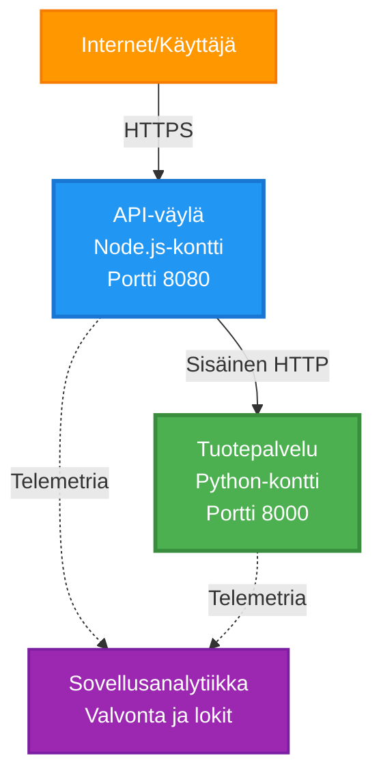
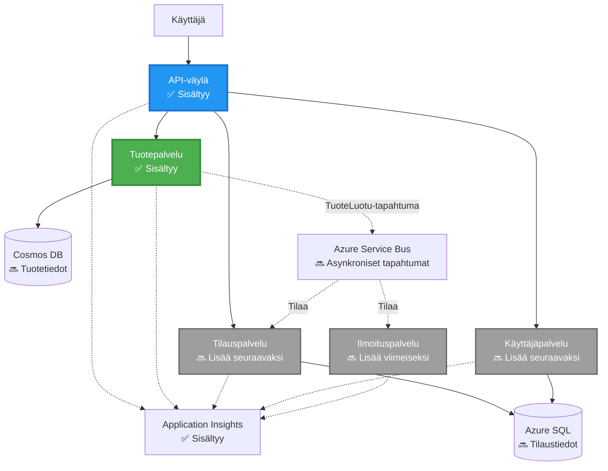
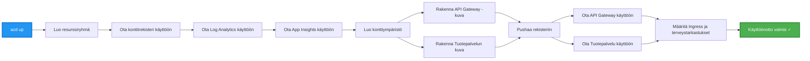
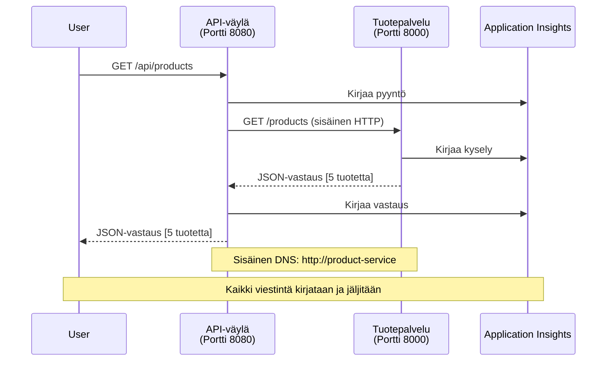

# Microservices Architecture - Container App Example

⏱️ **Arvioitu aika**: 25–35 minuuttia | 💰 **Arvioidut kulut**: ~$50–100/kk | ⭐ **Vaativuus**: Edistynyt

**📚 Oppimispolku:**
- ← Edellinen: [Simple Flask API](../../../../examples/container-app/simple-flask-api) - Yhden kontin perusteet
- 🎯 **Olet tässä**: Microservices Architecture (2-palvelun perusta)
- → Seuraava: [AI Integration](../../../../docs/ai-foundry) - Lisää älykkyyttä palveluihisi
- 🏠 [Course Home](../../README.md)

---

Yksinkertaistettu mutta toimiva mikropalveluarkkitehtuuri, joka otetaan käyttöön Azure Container Appsissa AZD CLI:llä. Tämä esimerkki demonstroi palveluiden välistä viestintää, konttien orkestrointia ja valvontaa käytännöllisellä 2-palvelun kokoonpanolla.

> **📚 Oppimistapa**: Tämä esimerkki alkaa minimillisellä 2-palvelun arkkitehtuurilla (API Gateway + Backend Service), jonka voit todella ottaa käyttöön ja oppia siitä. Perusteiden hallittuasi annamme ohjeita laajentumiselle täydeksi mikropalvelu-ekosysteemiksi.

## Mitä opit

Tämän esimerkin suorittamalla:
- Ota useita kontteja käyttöön Azure Container Appsissa
- Toteuta palveluiden välinen viestintä sisäisellä verkottumisella
- Konfiguroi ympäristöön perustuva skaalaus ja terveystarkastukset
- Valvo hajautettuja sovelluksia Application Insightsilla
- Ymmärrä mikropalvelujen käyttöönottoon liittyviä malleja ja parhaita käytäntöjä
- Opit asteittaisen laajentamisen yksinkertaisesta monimutkaiseen arkkitehtuuriin

## Arkkitehtuuri

### Vaihe 1: Mitä rakennamme (sisältyy tähän esimerkkiin)


```mermaid
graph TB
    Internet[Internet/Käyttäjä]
    Gateway[API-väylä<br/>Node.js-kontti<br/>Portti 8080]
    Product[Tuotepalvelu<br/>Python-kontti<br/>Portti 8000]
    AppInsights[Sovellusanalytiikka<br/>Valvonta ja lokit]
    
    Internet -->|HTTPS| Gateway
    Gateway -->|Sisäinen HTTP| Product
    Gateway -.->|Telemetria| AppInsights
    Product -.->|Telemetria| AppInsights
    
    style Gateway fill:#2196F3,stroke:#1976D2,stroke-width:3px,color:#fff
    style Product fill:#4CAF50,stroke:#388E3C,stroke-width:3px,color:#fff
    style Internet fill:#FF9800,stroke:#F57C00,stroke-width:2px,color:#fff
    style AppInsights fill:#9C27B0,stroke:#7B1FA2,stroke-width:2px,color:#fff
```
**Komponenttien tiedot:**

| Component | Purpose | Access | Resources |
|-----------|---------|--------|-----------|
| **API Gateway** | Reitittää ulkoiset pyynnöt backend-palveluille | Public (HTTPS) | 1 vCPU, 2GB RAM, 2-20 replicas |
| **Product Service** | Hallinnoi tuotekatalogia muistissa olevalla datalla | Internal only | 0.5 vCPU, 1GB RAM, 1-10 replicas |
| **Application Insights** | Keskitetty lokitus ja hajautettu jäljitys | Azure Portal | 1-2 GB/month data ingestion |

**Miksi aloittaa yksinkertaisella?**
- ✅ Ota käyttöön ja ymmärrä nopeasti (25–35 minuuttia)
- ✅ Opi ydinaskeleet mikropalveluissa ilman monimutkaisuutta
- ✅ Toimiva koodi, jota voit muokata ja kokeilla
- ✅ Edullisempi oppimiseen (~$50–100/kk vs $300–1400/kk)
- ✅ Rakenna varmuutta ennen tietokantojen ja viestijonojen lisäämistä

**Analogiana**: Ajattele tätä ajamisen oppimisena. Aloitat tyhjältä parkkipaikalta (2 palvelua), opit perusteet ja siirryt sitten kaupunkiliikenteeseen (5+ palvelua tietokantoineen).

### Vaihe 2: Tuleva laajentuminen (viitearkkitehtuuri)

Kun hallitset 2-palvelun arkkitehtuurin, voit laajentaa:


```mermaid
graph TB
    User[Käyttäjä]
    Gateway[API-väylä<br/>✅ Sisältyy]
    Product[Tuotepalvelu<br/>✅ Sisältyy]
    Order[Tilauspalvelu<br/>🔜 Lisää seuraavaksi]
    UserSvc[Käyttäjäpalvelu<br/>🔜 Lisää seuraavaksi]
    Notify[Ilmoituspalvelu<br/>🔜 Lisää viimeiseksi]
    
    CosmosDB[(Cosmos DB<br/>🔜 Tuotetiedot)]
    AzureSQL[(Azure SQL<br/>🔜 Tilaustiedot)]
    ServiceBus[Azure Service Bus<br/>🔜 Asynkroniset tapahtumat]
    AppInsights[Application Insights<br/>✅ Sisältyy]
    
    User --> Gateway
    Gateway --> Product
    Gateway --> Order
    Gateway --> UserSvc
    
    Product --> CosmosDB
    Order --> AzureSQL
    UserSvc --> AzureSQL
    
    Product -.->|TuoteLuotu-tapahtuma| ServiceBus
    ServiceBus -.->|Tilaa| Notify
    ServiceBus -.->|Tilaa| Order
    
    Gateway -.-> AppInsights
    Product -.-> AppInsights
    Order -.-> AppInsights
    UserSvc -.-> AppInsights
    Notify -.-> AppInsights
    
    style Product fill:#4CAF50,stroke:#388E3C,stroke-width:3px,color:#fff
    style Gateway fill:#2196F3,stroke:#1976D2,stroke-width:3px,color:#fff
    style Order fill:#9E9E9E,stroke:#616161,stroke-width:2px,color:#fff
    style UserSvc fill:#9E9E9E,stroke:#616161,stroke-width:2px,color:#fff
    style Notify fill:#9E9E9E,stroke:#616161,stroke-width:2px,color:#fff
```
Katso "Expansion Guide" -osio lopusta vaiheittaisiin ohjeisiin.

## Sisältyvät ominaisuudet

✅ **Palvelun löytäminen**: Automaattinen DNS-perusteinen löytäminen konttien välillä  
✅ **Kuormantasauksen**: Sisäänrakennettu kuormantasaus replikoiden kesken  
✅ **Automaattinen skaalaus**: Riippumaton skaalaus per palvelu HTTP-pyyntöjen perusteella  
✅ **Terveysvalvonta**: Liveness- ja readiness-probet molemmille palveluille  
✅ **Hajautettu lokitus**: Keskitetty lokitus Application Insightsilla  
✅ **Sisäinen verkotus**: Turvallinen palveluiden välinen viestintä  
✅ **Konttien orkestrointi**: Automaattinen käyttöönotto ja skaalaus  
✅ **Nollakatkon päivitykset**: Rolling-updates revisiohallinnalla  

## Esivaatimukset

### Vaadittavat työkalut

Ennen aloittamista varmista, että sinulla on nämä työkalut asennettuna:

1. **[Azure Developer CLI (azd)](https://learn.microsoft.com/azure/developer/azure-developer-cli/install-azd)** (versio 1.0.0 tai uudempi)
   ```bash
   azd version
   # Odotettu tuloste: azd versio 1.0.0 tai uudempi
   ```

2. **[Azure CLI](https://learn.microsoft.com/cli/azure/install-azure-cli)** (versio 2.50.0 tai uudempi)
   ```bash
   az --version
   # Odotettu tuloste: azure-cli 2.50.0 tai uudempi
   ```

3. **[Docker](https://www.docker.com/get-started)** (paikalliseen kehitykseen/testaukseen - valinnainen)
   ```bash
   docker --version
   # Odotettu tuloste: Docker-versio 20.10 tai uudempi
   ```

### Varmista asetuksesi

Suorita nämä komennot varmistaaksesi, että olet valmis:

```bash
# Tarkista Azure Developer CLI
azd version
# ✅ Odotettu: azd-versio 1.0.0 tai uudempi

# Tarkista Azure CLI
az --version
# ✅ Odotettu: azure-cli 2.50.0 tai uudempi

# Tarkista Docker (valinnainen)
docker --version
# ✅ Odotettu: Docker-versio 20.10 tai uudempi
```

**Onnistumiskriteeri**: Kaikki komennot palauttavat versionumerot, jotka vastaavat tai ylittävät minimivaatimukset.

### Azure-vaatimukset

- Avoin **Azure-tilaus** ([luo ilmainen tili](https://azure.microsoft.com/free/))
- Oikeudet luoda resursseja tilillesi
- **Contributor**-rooli tilillä tai resurssiryhmässä

### Tietopohjan vaatimukset

Tämä on **edistyneen tason** esimerkki. Sinun tulisi olla:
- Suorittanut [Simple Flask API example](../../../../examples/container-app/simple-flask-api) 
- Perustiedot mikropalveluarkkitehtuurista
- Tuntemus REST-rajapinnoista ja HTTP:stä
- Ymmärrys konttikonsepteista

**Uusi Container Apps -käyttäjä?** Aloita ensin [Simple Flask API example](../../../../examples/container-app/simple-flask-api) oppiaksesi perusteet.

## Pika-aloitus (askel askeleelta)

### Vaihe 1: Klonaa ja siirry

```bash
git clone https://github.com/microsoft/AZD-for-beginners.git
cd AZD-for-beginners/examples/microservices
```

**✓ Onnistumistarkistus**: Varmista, että näet `azure.yaml`:
```bash
ls
# Odotettavat: README.md, azure.yaml, infra/, src/
```

### Vaihe 2: Kirjaudu Azureen

```bash
azd auth login
```

Tämä avaa selaimesi Azure-todennusta varten. Kirjaudu Azure-kirjautumistiedoillasi.

**✓ Onnistumistarkistus**: Sinun pitäisi nähdä:
```
Logged in to Azure.
```

### Vaihe 3: Alusta ympäristö

```bash
azd init
```

**Kehotukset, jotka näet**:
- **Environment name**: Anna lyhyt nimi (esim. `microservices-dev`)
- **Azure subscription**: Valitse tilauksesi
- **Azure location**: Valitse alue (esim. `eastus`, `westeurope`)

**✓ Onnistumistarkistus**: Sinun pitäisi nähdä:
```
SUCCESS: New project initialized!
```

### Vaihe 4: Ota infrastruktuuri ja palvelut käyttöön

```bash
azd up
```

**Mitä tapahtuu** (kestää 8–12 minuuttia):


```mermaid
graph LR
    A[azd up] --> B[Luo resurssiryhmä]
    B --> C[Ota konttirekisteri käyttöön]
    C --> D[Ota Log Analytics käyttöön]
    D --> E[Ota App Insights käyttöön]
    E --> F[Luo konttiympäristö]
    F --> G[Rakenna API Gateway -kuva]
    F --> H[Rakenna Tuotepalvelun kuva]
    G --> I[Pushaa rekisteriin]
    H --> I
    I --> J[Ota API Gateway käyttöön]
    I --> K[Ota Tuotepalvelu käyttöön]
    J --> L[Määritä Ingress ja terveystarkastukset]
    K --> L
    L --> M[Käyttöönotto valmis ✓]
    
    style A fill:#2196F3,stroke:#1976D2,stroke-width:3px,color:#fff
    style M fill:#4CAF50,stroke:#388E3C,stroke-width:3px,color:#fff
```
**✓ Onnistumistarkistus**: Sinun pitäisi nähdä:
```
SUCCESS: Your application was deployed to Azure in X minutes Y seconds.
Endpoint: https://api-gateway-<unique-id>.azurecontainerapps.io
```

**⏱️ Aika**: 8–12 minuuttia

### Vaihe 5: Testaa käyttöönotto

```bash
# Hae yhdyskäytävän päätepiste
GATEWAY_URL=$(azd env get-values | grep API_GATEWAY_URL | cut -d '=' -f2 | tr -d '"')

# Testaa API-yhdyskäytävän kunto
curl $GATEWAY_URL/health
```

**✅ Odotettu tulos:**
```json
{
  "status": "healthy",
  "service": "api-gateway",
  "timestamp": "2025-11-19T10:30:00Z"
}
```

**Testaa Product Service gatewayn kautta**:
```bash
# Listaa tuotteet
curl $GATEWAY_URL/api/products
```

**✅ Odotettu tulos:**
```json
[
  {"id":1,"name":"Laptop","price":999.99,"stock":50},
  {"id":2,"name":"Mouse","price":29.99,"stock":200},
  {"id":3,"name":"Keyboard","price":79.99,"stock":150}
]
```

**✓ Onnistumistarkistus**: Molempien päätepisteiden pitäisi palauttaa JSON-dataa ilman virheitä.

---

**🎉 Onnittelut!** Olet ottanut mikropalveluarkkitehtuurin käyttöön Azureen!

## Projektin rakenne

Kaikki toteutustiedostot sisältyvät—tässä on täydellinen, toimiva esimerkki:

```
microservices/
│
├── README.md                         # This file
├── azure.yaml                        # AZD configuration
├── .gitignore                        # Git ignore patterns
│
├── infra/                           # Infrastructure as Code (Bicep)
│   ├── main.bicep                   # Main orchestration
│   ├── abbreviations.json           # Naming conventions
│   ├── core/                        # Shared infrastructure
│   │   ├── container-apps-environment.bicep  # Container environment + registry
│   │   └── monitor.bicep            # Application Insights + Log Analytics
│   └── app/                         # Service definitions
│       ├── api-gateway.bicep        # API Gateway container app
│       └── product-service.bicep    # Product Service container app
│
└── src/                             # Application source code
    ├── api-gateway/                 # Node.js API Gateway
    │   ├── app.js                   # Express server with routing
    │   ├── package.json             # Node dependencies
    │   └── Dockerfile               # Container definition
    └── product-service/             # Python Product Service
        ├── main.py                  # Flask API with product data
        ├── requirements.txt         # Python dependencies
        └── Dockerfile               # Container definition
```

**Mitä kukin komponentti tekee:**

**Infrastructure (infra/)**:
- `main.bicep`: Orkestroi kaikki Azure-resurssit ja niiden riippuvuudet
- `core/container-apps-environment.bicep`: Luo Container Apps -ympäristön ja Azure Container Registryn
- `core/monitor.bicep`: Asettaa Application Insightsin hajautettuun lokitukseen
- `app/*.bicep`: Yksittäiset container app -määritelmät skaalaus- ja terveystarkastuksilla

**API Gateway (src/api-gateway/)**:
- Julkisivuinen palvelu, joka reitittää pyynnöt backend-palveluille
- Toteuttaa lokituksen, virheenkäsittelyn ja pyynnön edelleenlähetyksen
- Demonstroi palveluiden välistä HTTP-viestintää

**Product Service (src/product-service/)**:
- Sisäinen palvelu, joka sisältää tuotekatalogin (muistissa yksinkertaisuuden vuoksi)
- REST-rajapinta terveystarkastuksilla
- Esimerkki backend-mikropalvelumallista

## Palveluiden yleiskuva

### API Gateway (Node.js/Express)

**Portti**: 8080  
**Käyttö**: Julkinen (ulkoinen ingress)  
**Tarkoitus**: Reitittää saapuvat pyynnöt oikeille backend-palveluille  

**Päätepisteet**:
- `GET /` - Tietoja palvelusta
- `GET /health` - Terveystarkastus
- `GET /api/products` - Edelleenlähetys Product Serviceen (listaa kaikki)
- `GET /api/products/:id` - Edelleenlähetys Product Serviceen (hae ID:llä)

**Keskeiset ominaisuudet**:
- Pyyntöjen reititys axiosilla
- Keskitetty lokitus
- Virheenkäsittely ja aikakatkaisut
- Palvelun löytäminen ympäristömuuttujien kautta
- Application Insights -integraatio

**Koodikohokohta** (`src/api-gateway/app.js`):
```javascript
// Sisäisten palveluiden välinen viestintä
app.get('/api/products', async (req, res) => {
  const response = await axios.get(`${PRODUCT_SERVICE_URL}/products`, {
    timeout: 5000
  });
  res.json(response.data);
});
```

### Product Service (Python/Flask)

**Portti**: 8000  
**Käyttö**: Vain sisäinen (ei ulkoista ingressiä)  
**Tarkoitus**: Hallinnoi tuotekatalogia muistissa olevalla datalla  

**Päätepisteet**:
- `GET /` - Tietoja palvelusta
- `GET /health` - Terveystarkastus
- `GET /products` - Listaa kaikki tuotteet
- `GET /products/<id>` - Hae tuote ID:llä

**Keskeiset ominaisuudet**:
- RESTful-rajapinta Flaskilla
- Muistissa oleva tuotekanta (yksinkertainen, ei tarvetta tietokannalle)
- Terveystilan valvonta probeilla
- Rakenteellinen lokitus
- Application Insights -integraatio

**Tietomalli**:
```python
{
  "id": 1,
  "name": "Laptop",
  "description": "High-performance laptop",
  "price": 999.99,
  "stock": 50
}
```

**Miksi vain sisäinen?**
Product Service ei ole julkisesti saatavilla. Kaikki pyynnöt on ohjattava API Gatewayn kautta, joka tarjoaa:
- Turvallisuus: Hallittu pääsy
- Joustavuus: Taustapalvelun voi vaihtaa ilman, että asiakkaat huomaavat
- Valvonta: Keskitetty pyyntöjen lokitus

## Palveluiden välisen viestinnän ymmärtäminen

### Miten palvelut keskustelevat keskenään


```mermaid
sequenceDiagram
    participant User
    participant Gateway as API-väylä<br/>(Portti 8080)
    participant Product as Tuotepalvelu<br/>(Portti 8000)
    participant AI as Application Insights
    
    User->>Gateway: GET /api/products
    Gateway->>AI: Kirjaa pyyntö
    Gateway->>Product: GET /products (sisäinen HTTP)
    Product->>AI: Kirjaa kysely
    Product-->>Gateway: JSON-vastaus [5 tuotetta]
    Gateway->>AI: Kirjaa vastaus
    Gateway-->>User: JSON-vastaus [5 tuotetta]
    
    Note over Gateway,Product: Sisäinen DNS: http://product-service
    Note over User,AI: Kaikki viestintä kirjataan ja jäljitään
```
Tässä esimerkissä API Gateway kommunikoi Product Servicen kanssa käyttämällä **sisäisiä HTTP-kutsuja**:

```javascript
// API-välityspalvelin (src/api-gateway/app.js)
const PRODUCT_SERVICE_URL = process.env.PRODUCT_SERVICE_URL;

// Tee sisäinen HTTP-pyyntö
const response = await axios.get(`${PRODUCT_SERVICE_URL}/products`);
```

**Keskeiset kohdat**:

1. **DNS-pohjainen löytäminen**: Container Apps tarjoaa automaattisesti DNS:n sisäisille palveluille
   - Product Service FQDN: `product-service.internal.<environment>.azurecontainerapps.io`
   - Yksinkertaistettuna: `http://product-service` (Container Apps ratkaisee sen)

2. **Ei julkista altistusta**: Product Service:llä on Bicepissä `external: false`
   - Saavutettavissa vain Container Apps -ympäristön sisällä
   - Ei saavutettavissa internetistä

3. **Ympäristömuuttujat**: Palvelu-URLit injektoidaan käyttöönoton yhteydessä
   - Bicep välittää sisäisen FQDN:n gatewaylle
   - Ei kovakoodattuja URL:eja sovelluskoodissa

**Vertauskuva**: Ajattele tätä toimistohuoneina. API Gateway on vastaanottotiski (julkinen), ja Product Service on toimistohuone (vain sisäinen). Vierailijoiden täytyy mennä vastaanoton kautta päästäkseen toimistoon.

## Käyttöönoton vaihtoehdot

### Täysi käyttöönotto (suositeltu)

```bash
# Ota käyttöön infrastruktuuri ja molemmat palvelut
azd up
```

Tämä ottaa käyttöön:
1. Container Apps -ympäristön
2. Application Insightsin
3. Container Registryn
4. API Gateway -kontin
5. Product Service -kontin

**Aika**: 8–12 minuuttia

### Ota käyttöön yksittäinen palvelu

```bash
# Ota käyttöön vain yksi palvelu (ensimmäisen azd up -komennon jälkeen)
azd deploy api-gateway

# Tai ota käyttöön tuotepalvelu
azd deploy product-service
```

**Käyttötapaus**: Kun olet päivittänyt koodia yhdessä palvelussa ja haluat ottaa vain kyseisen palvelun uudelleen käyttöön.

### Päivitä määrityksiä

```bash
# Muuta skaalausparametreja
azd env set GATEWAY_MAX_REPLICAS 30

# Ota uudelleen käyttöön uudella kokoonpanolla
azd up
```

## Konfiguraatio

### Skaalausasetukset

Molemmat palvelut on konfiguroitu HTTP-pohjaiseen autoskaalauksiin Bicep-tiedostoissaan:

**API Gateway**:
- Minimi replikoita: 2 (aina vähintään 2 käytettävyysvarmuuden vuoksi)
- Maksimi replikoita: 20
- Skaalauslaukaisin: 50 samanaikaista pyyntöä per replika

**Product Service**:
- Minimi replikoita: 1 (voi skaalautua nollaan tarvittaessa)
- Maksimi replikoita: 10
- Skaalauslaukaisin: 100 samanaikaista pyyntöä per replika

**Mukauta skaalausta** (tiedostossa `infra/app/*.bicep`):
```bicep
scale: {
  minReplicas: 1
  maxReplicas: 10
  rules: [
    {
      name: 'http-scale-rule'
      http: {
        metadata: {
          concurrentRequests: '100'  // Adjust this
        }
      }
    }
  ]
}
```

### Resurssien allokointi

**API Gateway**:
- CPU: 1.0 vCPU
- Muisti: 2 GiB
- Perustelu: Käsittelee kaiken ulkoisen liikenteen

**Product Service**:
- CPU: 0.5 vCPU
- Muisti: 1 GiB
- Perustelu: Kevyt muistipohjainen toiminta

### Terveystarkastukset

Molemmat palvelut sisältävät liveness- ja readiness-probet:

```bicep
probes: [
  {
    type: 'Liveness'
    httpGet: {
      path: '/health'
      port: 8080
    }
    initialDelaySeconds: 10
    periodSeconds: 30
  }
  {
    type: 'Readiness'
    httpGet: {
      path: '/health'
      port: 8080
    }
    initialDelaySeconds: 5
    periodSeconds: 10
  }
]
```

**Mitä tämä tarkoittaa**:
- **Liveness**: Jos terveystarkastus epäonnistuu, Container Apps käynnistää kontin uudelleen
- **Readiness**: Jos ei ole valmis, Container Apps lakkaa reitittämästä liikennettä kyseiselle replikalle

## Valvonta ja havaittavuus

### Näytä palvelulokit

```bash
# Näytä lokit azd monitorilla
azd monitor --logs

# Tai käytä Azure CLI:tä tiettyihin Container Apps -sovelluksiin:
# Suoratoista lokit API Gatewaysta
az containerapp logs show --name api-gateway --resource-group $RG_NAME --follow

# Näytä tuotepalvelun viimeaikaiset lokit
az containerapp logs show --name product-service --resource-group $RG_NAME --tail 100
```

**Odotettu tulos**:
```
[api-gateway] API Gateway listening on port 8080
[api-gateway] Product Service URL: http://product-service
[api-gateway] GET /api/products 200 - 45ms
[product-service] Retrieved 5 products
```

### Application Insights -kyselyt

Avaa Application Insights Azure-portaalissa, ja suorita sitten nämä kyselyt:

**Löydä hitaita pyyntöjä**:
```kusto
requests
| where timestamp > ago(1h)
| where duration > 1000  // Requests taking >1 second
| summarize count() by name, cloud_RoleName
| order by count_ desc
```

**Seuraa palveluiden välisiä kutsuja**:
```kusto
dependencies
| where timestamp > ago(1h)
| where type == "Http"
| project timestamp, name, target, duration, success
| order by timestamp desc
```

**Virheprosentti palvelmittain**:
```kusto
exceptions
| where timestamp > ago(24h)
| summarize errorCount = count() by cloud_RoleName, type
| order by errorCount desc
```

**Pyyntömäärä ajan yli**:
```kusto
requests
| where timestamp > ago(1h)
| summarize requestCount = count() by bin(timestamp, 5m), cloud_RoleName
| render timechart
```

### Käytä valvontapaneelia

```bash
# Hae Application Insights -tiedot
azd env get-values | grep APPLICATIONINSIGHTS

# Avaa Azure-portaalin valvonta
az monitor app-insights component show \
  --app $(azd env get-values | grep APPLICATIONINSIGHTS_CONNECTION_STRING | cut -d '=' -f2) \
  --resource-group $(azd env get-values | grep AZURE_RESOURCE_GROUP | cut -d '=' -f2) \
  --query "appId" -o tsv
```

### Live Metrics

1. Siirry Application Insightsiin Azure-portaalissa
2. Klikkaa "Live Metrics"
3. Näet reaaliaikaiset pyynnöt, virheet ja suorituskyvyn
4. Testaa ajamalla: `curl $(azd env get-values | grep API_GATEWAY_URL | cut -d '=' -f2 | tr -d '"')/api/products`

## Käytännön harjoitukset

### Harjoitus 1: Lisää uusi tuote-päätepiste ⭐ (Helppo)

**Tavoite**: Lisää POST-päätepiste uusien tuotteiden luomiseksi

**Aloituskohta**: `src/product-service/main.py`

**Vaiheet**:

1. Lisää tämä päätepiste `get_product`-funktion jälkeen tiedostossa `main.py`:

```python
@app.route('/products', methods=['POST'])
def create_product():
    """Create a new product"""
    data = request.get_json()
    
    # Tarkista pakolliset kentät
    if not data or 'name' not in data or 'price' not in data:
        return jsonify({'error': 'Missing required fields: name, price'}), 400
    
    new_id = max(p['id'] for p in products) + 1
    new_product = {
        'id': new_id,
        'name': data['name'],
        'description': data.get('description', ''),
        'price': float(data['price']),
        'stock': int(data.get('stock', 0))
    }
    products.append(new_product)
    logger.info(f"Created product {new_id}")
    return jsonify(new_product), 201
```

2. Lisää POST-reitti API Gatewayhin (`src/api-gateway/app.js`):

```javascript
// Lisää tämä GET /api/products-reitin jälkeen
app.post('/api/products', async (req, res) => {
  try {
    console.log(`Forwarding POST request to ${PRODUCT_SERVICE_URL}/products`);
    const response = await axios.post(`${PRODUCT_SERVICE_URL}/products`, req.body, {
      timeout: 5000
    });
    res.status(201).json(response.data);
  } catch (error) {
    console.error('Error calling product service:', error.message);
    res.status(503).json({
      error: 'Product service unavailable',
      message: error.message
    });
  }
});
```

3. Ota molemmat palvelut uudelleen käyttöön:

```bash
azd deploy product-service
azd deploy api-gateway
```

4. Testaa uutta päätepistettä:

```bash
GATEWAY_URL=$(azd env get-values | grep API_GATEWAY_URL | cut -d '=' -f2 | tr -d '"')

# Luo uusi tuote
curl -X POST $GATEWAY_URL/api/products \
  -H "Content-Type: application/json" \
  -d '{"name":"USB Cable","price":9.99,"stock":500}'
```

**✅ Odotettu tulos:**
```json
{"id":6,"name":"USB Cable","description":"","price":9.99,"stock":500}
```

5. Varmista, että se näkyy listassa:

```bash
curl $GATEWAY_URL/api/products
# Tulisi nyt näyttää 6 tuotetta, mukaan lukien uusi USB-kaapeli
```

**Onnistumiskriteerit**:
- ✅ POST-pyyntö palauttaa HTTP 201
- ✅ Uusi tuote näkyy GET /api/products -listassa
- ✅ Tuotteella on automaattisesti kasvava ID

**Aika**: 10-15 minuuttia

---

### Tehtävä 2: Muokkaa automaattisen skaalauksen sääntöjä ⭐⭐ (Keskitaso)

**Tavoite**: Muuta Product Service -palvelua skaalautumaan aggressiivisemmin

**Lähtökohta**: `infra/app/product-service.bicep`

**Vaiheet**:

1. Avaa `infra/app/product-service.bicep` ja etsi `scale`-lohko (noin riviltä 95)

2. Vaihda tästä:
```bicep
scale: {
  minReplicas: 1
  maxReplicas: 10
  rules: [
    {
      name: 'http-scale-rule'
      http: {
        metadata: {
          concurrentRequests: '100'  // OLD
        }
      }
    }
  ]
}
```

Muuta muotoon:
```bicep
scale: {
  minReplicas: 2  // Always have 2 running
  maxReplicas: 20  // Allow more scaling
  rules: [
    {
      name: 'http-scale-rule'
      http: {
        metadata: {
          concurrentRequests: '20'  // Scale at lower threshold
        }
      }
    }
  ]
}
```

3. Ota infrastruktuuri uudelleen käyttöön:

```bash
azd up
```

4. Varmista uusi skaalauskonfiguraatio:

```bash
az containerapp show \
  --name $(azd env get-values | grep PRODUCT_SERVICE | head -1 | cut -d '/' -f5) \
  --resource-group $(azd env get-values | grep AZURE_RESOURCE_GROUP | cut -d '=' -f2 | tr -d '"') \
  --query "properties.template.scale" -o json
```

**✅ Odotettu tulos:**
```json
{
  "minReplicas": 2,
  "maxReplicas": 20,
  "rules": [...]
}
```

5. Testaa automaattista skaalausta kuormituksella:

```bash
# Generoi samanaikaisia pyyntöjä
for i in {1..500}; do curl $GATEWAY_URL/api/products & done

# Seuraa skaalausta Azure CLI:llä
az containerapp logs show --name product-service --resource-group $RG_NAME --follow
# Etsi: Container Apps -skaalaustapahtumia
```

**Onnistumiskriteerit**:
- ✅ Product Service pyörii aina vähintään 2 instanssilla
- ✅ Kuormituksen alla skaalaa yli 2 instanssiin
- ✅ Azure Portal näyttää uudet skaalaussäännöt

**Aika**: 15-20 minuuttia

---

### Tehtävä 3: Lisää mukautettu valvontakysely ⭐⭐ (Keskitaso)

**Tavoite**: Luo mukautettu Application Insights -kysely tuotteen API:n suorituskyvyn seuraamiseen

**Vaiheet**:

1. Siirry Application Insightsiin Azure-portaalissa:
   - Siirry Azure-portaaliin
   - Etsi resurssiryhmäsi (rg-microservices-*)
   - Klikkaa Application Insights -resurssia

2. Klikkaa vasemman laidan valikosta "Logs"

3. Luo tämä kysely:

```kusto
requests
| where timestamp > ago(1h)
| where name contains "products"
| summarize 
    RequestCount = count(),
    AvgDuration = avg(duration),
    P95Duration = percentile(duration, 95),
    SuccessRate = 100.0 * countif(success == true) / count()
  by bin(timestamp, 5m)
| render timechart
```

4. Klikkaa "Run" suorittaaksesi kyselyn

5. Tallenna kysely:
   - Klikkaa "Save"
   - Nimi: "Tuote-API:n suorituskyky"
   - Kategoria: "Suorituskyky"

6. Generoi testiliikennettä:

```bash
for i in {1..100}; do curl $GATEWAY_URL/api/products; sleep 1; done
```

7. Päivitä kysely nähdäksesi tiedot

**✅ Odotettu tulos:**
- Kaavio, joka näyttää pyyntömäärät ajan kuluessa
- Keskimääräinen kesto < 500ms
- Onnistumisaste = 100%
- 5 minuutin aikavälit

**Onnistumiskriteerit**:
- ✅ Kysely näyttää yli 100 pyyntöä
- ✅ Onnistumisaste on 100%
- ✅ Keskimääräinen kesto < 500ms
- ✅ Kaavio näyttää 5 minuutin aikavälit

**Oppimistavoite**: Ymmärrä, miten valvot palvelun suorituskykyä mukautetuilla kyselyillä

**Aika**: 10-15 minuuttia

---

### Tehtävä 4: Toteuta uudelleenyrityslogiikka ⭐⭐⭐ (Edistynyt)

**Tavoite**: Lisää uudelleenyrityslogiikka API Gatewayhin, kun Product Service on tilapäisesti poissa käytöstä

**Lähtökohta**: `src/api-gateway/app.js`

**Vaiheet**:

1. Asenna retry-kirjasto:

```bash
cd src/api-gateway
npm install axios-retry --save
cd ../..
```

2. Päivitä `src/api-gateway/app.js` (lisää axios-importin jälkeen):

```javascript
const axiosRetry = require('axios-retry');

// Määritä uudelleenyritysten logiikka
axiosRetry(axios, {
  retries: 3,
  retryDelay: (retryCount) => {
    return retryCount * 1000; // 1s, 2s, 3s
  },
  retryCondition: (error) => {
    // Yritä uudelleen verkkovirheissä tai 5xx-vastauksissa
    return axiosRetry.isNetworkOrIdempotentRequestError(error) ||
           (error.response && error.response.status >= 500);
  }
});

console.log('Retry logic configured: 3 retries with exponential backoff');
```

3. Ota API Gateway uudelleen käyttöön:

```bash
azd deploy api-gateway
```

4. Testaa uudelleenyrityskäytöstä simuloimalla palvelun vika:

```bash
# Skaalaa tuotepalvelu nollaan (simuloi vikaa)
az containerapp update \
  --name $(azd env get-values | grep PRODUCT_SERVICE | head -1 | cut -d '/' -f5) \
  --resource-group $(azd env get-values | grep AZURE_RESOURCE_GROUP | cut -d '=' -f2 | tr -d '"') \
  --min-replicas 0 \
  --max-replicas 0

# Yritä käyttää tuotteita (yritetään uudelleen 3 kertaa)
time curl -v $GATEWAY_URL/api/products
# Huomaa: Vastaus kestää ~6 sekuntia (1 s + 2 s + 3 s uudelleenyrityksissä)

# Palauta tuotepalvelu
az containerapp update \
  --name $(azd env get-values | grep PRODUCT_SERVICE | head -1 | cut -d '/' -f5) \
  --resource-group $(azd env get-values | grep AZURE_RESOURCE_GROUP | cut -d '=' -f2 | tr -d '"') \
  --min-replicas 1 \
  --max-replicas 10
```

5. Katso uudelleenyrityslogit:

```bash
az containerapp logs show --name api-gateway --resource-group $RG_NAME --tail 50
# Etsi: Viestit uudelleenyrityksistä
```

**✅ Odotettu käyttäytyminen:**
- Pyynnöt yrittävät uudelleen 3 kertaa ennen epäonnistumista
- Jokainen uudelleenyrittokerta odottaa pidempään (1s, 2s, 3s)
- Onnistuneet pyynnöt palvelun uudelleenkäynnistyksen jälkeen
- Lokit näyttävät uudelleenyrittokerrat

**Onnistumiskriteerit**:
- ✅ Pyynnöt yrittävät uudelleen 3 kertaa ennen epäonnistumista
- ✅ Jokainen uudelleenyrittokerta odottaa pidempään (eksponentiaalinen viive)
- ✅ Onnistuneet pyynnöt palvelun uudelleenkäynnistyksen jälkeen
- ✅ Lokit näyttävät uudelleenyrittokerrat

**Oppimistavoite**: Ymmärrä kestävyyden mallit mikropalveluissa (circuit breakers, uudelleenyrittämiset, aikakatkaisut)

**Aika**: 20-25 minuuttia

---

## Tietämyskatsaus

Suoritettuasi tämän esimerkin, varmista ymmärryksesi:

### 1. Palveluiden välinen viestintä ✓

Testaa tietosi:
- [ ] Voitko selittää, miten API Gateway löytää Product Service -palvelun? (DNS-pohjainen palvelun löydettävyys)
- [ ] Mitä tapahtuu, jos Product Service on alhaalla? (Gateway palauttaa 503-virheen)
- [ ] Kuinka lisäisit kolmannen palvelun? (Luo uusi Bicep-tiedosto, lisää main.bicepiin, luo src-kansio)

**Käytännön tarkistus:**
```bash
# Simuloi palvelun vikaantuminen
az containerapp update --name <product-service-name> --min-replicas 0 --max-replicas 0
curl $GATEWAY_URL/api/products
# ✅ Odotettu: 503 Palvelu ei ole käytettävissä

# Palauta palvelu
az containerapp update --name <product-service-name> --min-replicas 1 --max-replicas 10
```

### 2. Valvonta ja havaittavuus ✓

Testaa tietosi:
- [ ] Missä näet hajautetut lokit? (Application Insights Azure-portaalissa)
- [ ] Miten seuraat hitaita pyyntöjä? (Kusto-kysely: `requests | where duration > 1000`)
- [ ] Pystytkö tunnistamaan, mikä palvelu aiheutti virheen? (Tarkista lokien `cloud_RoleName`-kenttä)

**Käytännön tarkistus:**
```bash
# Luo hitaan pyynnön simulointi
curl "$GATEWAY_URL/api/products?delay=2000"

# Hae Application Insightsista hitaita pyyntöjä
# Siirry Azure-portaaliin → Application Insights → Lokit
# Suorita: requests | where duration > 1000 | project timestamp, name, duration, cloud_RoleName
```

### 3. Skaalaus ja suorituskyky ✓

Testaa tietosi:
- [ ] Mikä laukaisee automaattisen skaalauksen? (HTTP samanaikaisten pyyntöjen säännöt: 50 gatewaylle, 100 productille)
- [ ] Kuinka monta replikaa toimii nyt? (Tarkista komennolla `az containerapp revision list`)
- [ ] Miten skaalaisit Product Service -palvelun 5 replikan tasolle? (Päivitä minReplicas Bicepissä)

**Käytännön tarkistus:**
```bash
# Luo kuormitusta autoskaalauksen testaamiseksi
for i in {1..1000}; do curl $GATEWAY_URL/api/products & done

# Seuraa replikoiden lisääntymistä Azure CLI:n avulla
az containerapp logs show --name api-gateway --resource-group $RG_NAME --follow
# ✅ Odotettu: Näet skaalaustapahtumat lokeissa
```

**Onnistumiskriteeri**: Pystyt vastaamaan kaikkiin kysymyksiin ja varmistamaan ne käytännön komennoilla.

---

## Kustannusanalyysi

### Arvioidut kuukausikustannukset (tälle 2-palvelun esimerkkille)

| Resurssi | Konfiguraatio | Arvioidut kustannukset |
|----------|--------------|------------------------|
| API Gateway | 2-20 replikaa, 1 vCPU, 2GB RAM | $30-150 |
| Product Service | 1-10 replikaa, 0.5 vCPU, 1GB RAM | $15-75 |
| Container Registry | Basic-taso | $5 |
| Application Insights | 1-2 GB/kuukausi | $5-10 |
| Log Analytics | 1 GB/kuukausi | $3 |
| **Yhteensä** | | **$58-243/kuukausi** |

### Kustannuserittely käytön mukaan

**Kevyt liikenne** (testaus/oppiminen): ~$60/kuukausi
- API Gateway: 2 replikaa × 24/7 = $30
- Product Service: 1 replika × 24/7 = $15
- Valvonta + Registry = $13

**Kohtalainen liikenne** (pieni tuotanto): ~$120/kuukausi
- API Gateway: 5 avg replikaa = $75
- Product Service: 3 avg replikaa = $45
- Valvonta + Registry = $13

**Korkea liikenne** (ruuhka-ajat): ~$240/kuukausi
- API Gateway: 15 avg replikaa = $225
- Product Service: 8 avg replikaa = $120
- Valvonta + Registry = $13

### Kustannusten optimointivinkit

1. **Skaalaa nollaan kehitystä varten**:
   ```bicep
   scale: {
     minReplicas: 0  // Save $30-40/month when not in use
     maxReplicas: 10
   }
   ```

2. **Käytä Consumption-suunnitelmaa Cosmos DB:lle** (kun lisäät sen):
   - Maksa vain käytön mukaan
   - Ei vähimmäismaksua

3. **Aseta Application Insightsin näytteistys**:
   ```javascript
   appInsights.defaultClient.config.samplingPercentage = 50; // Ota 50 % pyynnöistä näytteeksi.
   ```

4. **Siivoa kun ei tarvita**:
   ```bash
   azd down --force --purge
   ```

### Ilmaiset vaihtoehdot

Oppimiseen/testaukseen harkitse:
- ✅ Käytä Azure-ilmaissaldoa ($200 ensimmäisille 30 päivälle uusille tileille)
- ✅ Pidä replikat minimissä (säästää ~50% kustannuksista)
- ✅ Poista testauksen jälkeen (ei jatkuvia kuluja)
- ✅ Skaalaa nollaan oppituntien välillä

**Esimerkki**: Tämän esimerkin ajaminen 2 tuntia/päivä × 30 päivää = ~$5/kuukausi $60/kuukauden sijaan

---

## Vianmäärityksen pikaopas

### Ongelma: `azd up` epäonnistuu viestillä "Subscription not found"

**Ratkaisu**:
```bash
# Kirjaudu uudelleen nimenomaisen tilauksen kanssa
az account set --subscription <your-subscription-id>
azd env set AZURE_SUBSCRIPTION_ID <your-subscription-id>
azd up
```

### Ongelma: API Gateway palauttaa 503 "Product service unavailable"

**Diagnoosi**:
```bash
# Tarkista tuotepalvelun lokit Azure CLI:n avulla
az containerapp logs show --name product-service --resource-group $RG_NAME --tail 50

# Tarkista tuotepalvelun kunto
az containerapp show \
  --name $(azd env get-values | grep PRODUCT_SERVICE | head -1 | cut -d '/' -f5) \
  --resource-group $(azd env get-values | grep AZURE_RESOURCE_GROUP | cut -d '=' -f2 | tr -d '"') \
  --query "properties.runningStatus"
```

**Yleiset syyt**:
1. Product service ei käynnistynyt (tarkista lokit Python-virheiden varalta)
2. Health check epäonnistuu (varmista että `/health`-päätepiste toimii)
3. Konttikuvan build epäonnistui (tarkista rekisteristä kuva)

### Ongelma: Automaattinen skaalaus ei toimi

**Diagnoosi**:
```bash
# Tarkista replikoiden nykyinen määrä
az containerapp revision list \
  --name $(azd env get-values | grep API_GATEWAY | head -1 | cut -d '/' -f5) \
  --resource-group $(azd env get-values | grep AZURE_RESOURCE_GROUP | cut -d '=' -f2 | tr -d '"') \
  --query "[].properties.replicas"

# Generoi kuormitusta testaukseen
for i in {1..1000}; do curl $GATEWAY_URL/api/products & done

# Seuraa skaalaustapahtumia Azure CLI:llä
az containerapp logs show --name api-gateway --resource-group $RG_NAME --follow | grep -i scale
```

**Yleiset syyt**:
1. Kuorma ei ole tarpeeksi korkea skaalaussäännön laukaisemiseen (tarvitaan >50 samanaikaista pyyntöä)
2. Suurin replika-määrä on jo saavutettu (tarkista Bicep-konfiguraatio)
3. Skaalaussääntö on väärin konfiguroitu Bicepissä (tarkista concurrentRequests-arvo)

### Ongelma: Application Insights ei näytä lokitietoja

**Diagnoosi**:
```bash
# Varmista, että yhteysmerkkijono on asetettu
azd env get-values | grep APPLICATIONINSIGHTS

# Tarkista, lähettävätkö palvelut telemetriaa
az monitor app-insights component show \
  --app $(azd env get-values | grep APPLICATIONINSIGHTS_NAME | cut -d '=' -f2 | tr -d '"') \
  --resource-group $(azd env get-values | grep AZURE_RESOURCE_GROUP | cut -d '=' -f2 | tr -d '"') \
  --query "properties.InstrumentationKey"
```

**Yleiset syyt**:
1. Yhteysmerkkijonoa ei ole välitetty kontille (tarkista ympäristömuuttujat)
2. Application Insights SDK:ta ei ole konfiguroitu (tarkista importit koodissa)
3. Palomuuri estää telemetrian (harvinaista, tarkista verkon säännöt)

### Ongelma: Docker build epäonnistuu paikallisesti

**Diagnoosi**:
```bash
# Testaa API Gatewayn rakennus
cd src/api-gateway
docker build -t test-gateway .

# Testaa Product Servicen rakennus
cd ../product-service
docker build -t test-product .
```

**Yleiset syyt**:
1. Puuttuvat riippuvuudet package.json/requirements.txt-tiedostoissa
2. Dockerfilen syntaksivirheet
3. Verkko-ongelmat riippuvuuksien lataamisessa

**Yhä jumissa?** Katso [Yleiset ongelmat -opas](../../docs/chapter-07-troubleshooting/common-issues.md) tai [Azure Container Apps -vianmääritys](https://learn.microsoft.com/azure/container-apps/troubleshooting)

---

## Siivous

Jatkuvien maksujen välttämiseksi poista kaikki resurssit:

```bash
azd down --force --purge
```

**Vahvistuskehotus**:
```
? Total resources to delete: 6, are you sure you want to continue? (y/N)
```

Kirjoita `y` vahvistaaksesi.

**Mitä poistetaan**:
- Container Apps -ympäristö
- Molemmat Container Appsit (gateway ja product service)
- Container Registry
- Application Insights
- Log Analytics -työtila
- Resurssiryhmä

**✓ Vahvista poisto**:
```bash
az group list --query "[?starts_with(name,'rg-microservices')]" --output table
```

Palauttaa tyhjän.

---

## Laajennusopas: 2 palvelusta 5+ palveluun

Kun olet hallinnut tämän 2-palvelun arkkitehtuurin, näin voit laajentaa:

### Vaihe 1: Lisää tietokantapysyvyys (seuraava askel)

**Lisää Cosmos DB Product Service -palvelulle**:

1. Luo `infra/core/cosmos.bicep`:
   ```bicep
   resource cosmosAccount 'Microsoft.DocumentDB/databaseAccounts@2023-04-15' = {
     name: name
     location: location
     kind: 'GlobalDocumentDB'
     properties: {
       databaseAccountOfferType: 'Standard'
       consistencyPolicy: { defaultConsistencyLevel: 'Session' }
       locations: [{ locationName: location, failoverPriority: 0 }]
     }
   }
   ```

2. Päivitä product service käyttämään Azure Cosmos DB Python SDK:ta muistissa pidetyn datan sijaan

3. Arvioitu lisäkustannus: ~$25/kuukausi (serverless)

### Vaihe 2: Lisää kolmas palvelu (tilausten hallinta)

**Luo Order Service**:

1. Uusi kansio: `src/order-service/` (Python/Node.js/C#)
2. Uusi Bicep: `infra/app/order-service.bicep`
3. Päivitä API Gateway reitittämään `/api/orders`
4. Lisää Azure SQL Database tilausten pysyvyyttä varten

**Arkkitehtuuri muuttuu**:
```
API Gateway → Product Service (Cosmos DB)
           → Order Service (Azure SQL)
```

### Vaihe 3: Lisää asynkroninen viestintä (Service Bus)

**Ota käyttöön tapahtumapohjainen arkkitehtuuri**:

1. Lisää Azure Service Bus: `infra/core/servicebus.bicep`
2. Product Service julkaisee "ProductCreated" -tapahtumia
3. Order Service tilaa tuotetapahtumia
4. Lisää Notification Service käsittelemään tapahtumia

**Malli**: Request/Response (HTTP) + tapahtumapohjainen (Service Bus)

### Vaihe 4: Lisää käyttäjän todennus

**Toteuta käyttäjäpalvelu**:

1. Luo `src/user-service/` (Go/Node.js)
2. Lisää Azure AD B2C tai mukautettu JWT-todennus
3. API Gateway validoi tokenit ennen reititystä
4. Palvelut tarkistavat käyttäjäoikeudet

### Vaihe 5: Tuotantovalmius

**Lisää nämä komponentit**:
- ✅ Azure Front Door (globaali kuormantasaus)
- ✅ Azure Key Vault (salaisuuksien hallinta)
- ✅ Azure Monitor Workbooks (mukautetut kojelaudat)
- ✅ CI/CD-putki (GitHub Actions)
- ✅ Blue-Green -käyttöönotot
- ✅ Hallinnoitu identiteetti kaikille palveluille

**Koko tuotantoarkkitehtuurin kustannus**: ~ $300-1,400/kuukausi

---

## Lisätietoja

### Aiheeseen liittyvä dokumentaatio
- [Azure Container Apps -dokumentaatio](https://learn.microsoft.com/azure/container-apps/)
- [Mikropalveluarkkitehtuurin opas](https://learn.microsoft.com/azure/architecture/guide/architecture-styles/microservices)
- [Application Insights hajautettuun jäljitykseen](https://learn.microsoft.com/azure/azure-monitor/app/distributed-tracing)
- [Azure Developer CLI -dokumentaatio](https://learn.microsoft.com/azure/developer/azure-developer-cli/)

### Seuraavat askeleet tässä kurssissa
- ← Edellinen: [Yksinkertainen Flask API](../../../../examples/container-app/simple-flask-api) - Aloittelijan yhden kontin esimerkki
- → Seuraava: [AI-integraatio-opas](../../../../docs/ai-foundry) - Lisää AI-ominaisuuksia
- 🏠 [Kurssin etusivu](../../README.md)

### Vertailu: Milloin käyttää mitä

| Ominaisuus | Yksi kontti | Mikropalvelut (tämä) | Kubernetes (AKS) |
|---------|-----------------|---------------------|------------------|
| **Käyttötapaus** | Yksinkertaiset sovellukset | Monimutkaiset sovellukset | Yrityssovellukset |
| **Skaalautuvuus** | Yksi palvelu | Palvelukohtainen skaalaus | Maksimaalinen joustavuus |
| **Monimutkaisuus** | Matala | Keskitaso | Korkea |
| **Tiimin koko** | 1-3 kehittäjää | 3-10 kehittäjää | 10+ kehittäjää |
| **Kustannukset** | ~$15-50/kuukausi | ~$60-250/kuukausi | ~$150-500/kuukausi |
| **Käyttöönottoaika** | 5-10 minuuttia | 8-12 minuuttia | 15-30 minuuttia |
| **Parhaiten sopii** | MVPs, prototyypit | Tuotantosovellukset | Monipilvi, edistynyt verkotus |

**Suositus**: Aloita Container Appsilla (tässä esimerkissä), siirry AKS:ään vain jos tarvitset Kubernetes-spesifisiä ominaisuuksia.

---

## Usein kysytyt kysymykset

**Q: Miksi vain 2 palvelua 5+:n sijaan?**  
A: Opetuksellinen eteneminen. Hallitse perusteet (palvelujen välinen kommunikointi, monitorointi, skaalaus) yksinkertaisella esimerkillä ennen monimutkaisuuden lisäämistä. Tässä opitut mallit pätevät satojen palveluiden arkkitehtuureihin.

**Q: Voinko lisätä lisää palveluita itse?**  
A: Ehdottomasti! Noudata yllä olevaa laajennusopasta. Jokainen uusi palvelu noudattaa samaa kaavaa: luo src-kansio, luo Bicep-tiedosto, päivitä azure.yaml, ota käyttöön.

**Q: Onko tämä tuotantovalmiina?**  
A: Se on vankka perusta. Tuotantokäyttöön lisää: hallittu identiteetti, Key Vault, pysyvät tietokannat, CI/CD-putki, monitorointihälytykset ja varmuuskopiointistrategia.

**Q: Miksi ei käytetä Dapr:ia tai muuta service meshia?**  
A: Pidä oppiminen yksinkertaisena. Kun ymmärrät Container Appsin natiivin verkottumisen, voit lisätä Dapr:in edistyneempiin skenaarioihin (tilanhallinta, pub/sub, sidonnat).

**Q: Kuinka debuggaan paikallisesti?**  
A: Aja palvelut paikallisesti Dockerilla:
```bash
cd src/api-gateway
docker build -t local-gateway .
docker run -p 8080:8080 -e PRODUCT_SERVICE_URL=http://localhost:8000 local-gateway
```

**Q: Voinko käyttää eri ohjelmointikieliä?**  
A: Kyllä! Tämä esimerkki näyttää Node.js:n (gateway) + Pythonin (product service). Voit yhdistää mitä tahansa kontissa toimivia kieliä: C#, Go, Java, Ruby, PHP, jne.

**Q: Entä jos minulla ei ole Azure-luottoja?**  
A: Käytä Azuren ilmaistasoa (uudet tilit saavat ensimmäisiksi 30 päiväksi 200 $ krediittejä) tai ota käyttöön vain lyhyeksi testijaksoksi ja poista heti. Tämä esimerkki maksaa ~2 $/päivä.

**Q: Miten tämä eroaa Azure Kubernetes Service (AKS):stä?**  
A: Container Apps on yksinkertaisempi (ei Kubernetes-osaamista tarvita), mutta vähemmän joustava. AKS antaa sinulle täyden Kubernetes-kontrollin, mutta vaatii enemmän osaamista. Aloita Container Appsilla, siirry AKS:ään tarpeen mukaan.

**Q: Voinko käyttää tätä olemassa olevien Azure-palvelujen kanssa?**  
A: Kyllä! Voit yhdistää olemassa oleviin tietokantoihin, tallennustileihin, Service Busiin jne. Päivitä Bicep-tiedostot viittaamaan olemassa oleviin resursseihin luomisen sijaan.

---

> **🎓 Oppimispolun yhteenveto**: Olet oppinut ottamaan käyttöön monipalveluarkkitehtuurin automaattisella skaalauksella, sisäisellä verkottumisella, keskitetyn monitoroinnin ja tuotantovalmiiden mallien avulla. Tämä perusta valmentaa sinua monimutkaisiin hajautettuihin järjestelmiin ja yritystason mikropalveluarkkitehtuureihin.

**📚 Kurssin navigointi:**
- ← Edellinen: [Simple Flask API](../../../../examples/container-app/simple-flask-api)
- → Seuraava: [Tietokannan integrointiesimerkki](../../../../database-app)
- 🏠 [Kurssin etusivu](../../README.md)
- 📖 [Container Apps - parhaat käytännöt](../../docs/chapter-04-infrastructure/deployment-guide.md)

---

**✨ Onnittelut!** Olet suorittanut mikropalveluesimerkin. Ymmärrät nyt, miten rakentaa, ottaa käyttöön ja valvoa hajautettuja sovelluksia Azure Container Appsissa. Valmis lisäämään tekoälyominaisuuksia? Tutustu [AI Integration Guide](../../../../docs/ai-foundry)!

---

<!-- CO-OP TRANSLATOR DISCLAIMER START -->
Vastuuvapauslauseke:
Tämä asiakirja on käännetty tekoälypohjaisella käännöspalvelulla Co-op Translator (https://github.com/Azure/co-op-translator). Vaikka pyrimme tarkkuuteen, otathan huomioon, että automaattikäännöksissä saattaa esiintyä virheitä tai epätarkkuuksia. Alkuperäistä asiakirjaa sen alkuperäisellä kielellä tulisi pitää määräävänä lähteenä. Tärkeää tietoa varten suositellaan ammattimaista ihmiskäännöstä. Emme ole vastuussa tämän käännöksen käytöstä aiheutuvista väärinymmärryksistä tai virheellisistä tulkinnoista.
<!-- CO-OP TRANSLATOR DISCLAIMER END -->