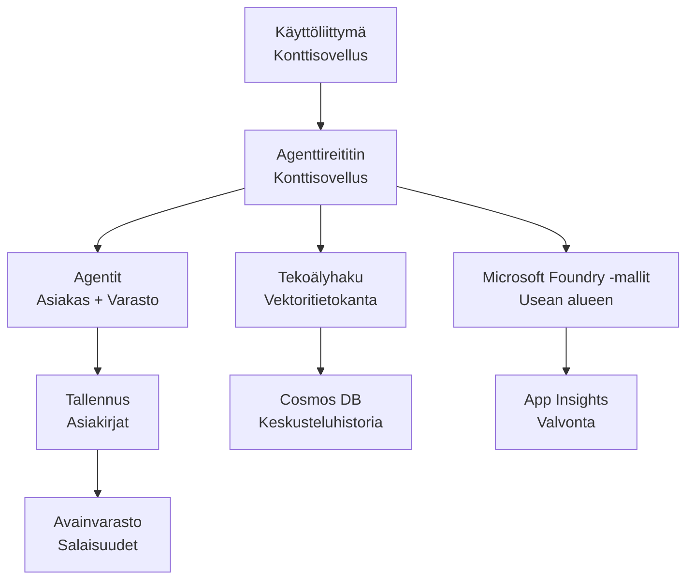

# Retail-monitoimijaratkaisu - Infrastruktuurimalli

**Luku 5: Tuotantokäyttöönoton paketti**
- **📚 Kurssin kotisivu**: [AZD Aloittelijoille](../../README.md)
- **📖 Liittyvä luku**: [Luku 5: Moni-agenttiset tekoälyratkaisut](../../README.md#-chapter-5-multi-agent-ai-solutions-advanced)
- **📝 Skenaario-opas**: [Täydellinen arkkitehtuuri](../retail-scenario.md)
- **🎯 Pikakäyttöönotto**: [One-Click Deployment](#-quick-deployment)

> **⚠️ VAIN INFRASTRUKTUURIMALLI**  
> Tämä ARM-malli ottaa käyttöön **Azure-resursseja** moni-agenttijärjestelmää varten.  
>  
> **Mitä otetaan käyttöön (15-25 minuuttia):**
> - ✅ Microsoft Foundry -mallipalvelut (gpt-4.1, gpt-4.1-mini, upotukset 3 alueella)
> - ✅ AI Search -palvelu (tyhjä, valmis indeksin luontiin)
> - ✅ Container Apps (paikkamerkkikuvat, valmiina koodillesi)
> - ✅ Storage, Cosmos DB, Key Vault, Application Insights
>  
> **Mitä EI sisälly (vaatii kehitystä):**
> - ❌ Agentin toteutuskoodi (Customer Agent, Inventory Agent)
> - ❌ Reitityslogiikka ja API-päätepisteet
> - ❌ Frontend-keskustelukäyttöliittymä
> - ❌ Hakemistoarkkitehtuurit ja datan putkistot
> - ❌ **Arvioitu kehitystyö: 80-120 tuntia**
>  
> **Käytä tätä mallia jos:**
> - ✅ Haluat provisioida Azure-infrastruktuurin moni-agenttiprojektille
> - ✅ Aiot kehittää agenttien toteutuksen erikseen
> - ✅ Tarvitset tuotantovalmiin infrastruktuuriperustan
>  
> **Älä käytä jos:**
> - ❌ Odotat toimivaa moni-agenttidemoa heti
> - ❌ Etsit täydellisiä sovelluskoodiesimerkkejä

## Yleiskatsaus

Tämä hakemisto sisältää kattavan Azure Resource Manager (ARM) -mallin moni-agenttisen asiakastukijärjestelmän **infrastruktuuriperustan** käyttöönottoon. Malli provisioi kaikki tarvittavat Azure-palvelut, oikein konfiguroituina ja toisiinsa kytkettyinä, valmiina sovelluskehitystä varten.

**Käyttöönoton jälkeen sinulla on:** Tuotantovalmiit Azure-infrastruktuurit  
**Järjestelmän viimeistely vaatii:** Agenttikoodin, frontendin ja datakonfiguraation (katso [Arkkitehtuuriopas](../retail-scenario.md))

## 🎯 Mitä otetaan käyttöön

### Ydininfra (tila käyttöönoton jälkeen)

✅ **Microsoft Foundry -mallipalvelut** (valmiina API-kutsuihin)
  - Primäärialue: gpt-4.1 -asennus (20K TPM kapasiteetti)
  - Sekundäärialue: gpt-4.1-mini -asennus (10K TPM kapasiteetti)
  - Tertiaarialue: Tekstien upotusmalli (30K TPM kapasiteetti)
  - Arviointialue: gpt-4.1 grader -malli (15K TPM kapasiteetti)
  - **Tila:** Täysin toiminnallinen - API-kutsut käytettävissä välittömästi

✅ **Azure AI Search** (Tyhjä - valmis konfiguroitavaksi)
  - Vektorihakutoiminnot käytössä
  - Standard-taso, 1 partitio, 1 replika
  - **Tila:** Palvelu käynnissä, mutta indeksi pitää luoda
  - **Toimenpide:** Luo hakemisto omalla skeemallasi

✅ **Azure Storage Account** (Tyhjä - valmis latauksiin)
  - Blob-kontit: `documents`, `uploads`
  - Suojattu konfiguraatio (vain HTTPS, ei julkista pääsyä)
  - **Tila:** Valmis vastaanottamaan tiedostoja
  - **Toimenpide:** Lataa tuotetietosi ja dokumenttisi

⚠️ **Container Apps -ympäristö** (Paikkamerkkikuvat otettu käyttöön)
  - Agentin reititysappi (nginx oletuskuva)
  - Frontend-appi (nginx oletuskuva)
  - Automaattinen skaalaus konfiguroitu (0-10 instanssia)
  - **Tila:** Paikkamerkkisäiliöt käynnissä
  - **Toimenpide:** Rakenna ja ota käyttöön agenttisovelluksesi

✅ **Azure Cosmos DB** (Tyhjä - valmis datalle)
  - Tietokanta ja säiliö esikonfiguroitu
  - Optimoitu pienviiveisiin operaatioihin
  - TTL käytössä automaattista puhdistusta varten
  - **Tila:** Valmis tallentamaan keskusteluhistoriaa

✅ **Azure Key Vault** (Valinnainen - valmis salaisuuksille)
  - Soft delete käytössä
  - RBAC konfiguroitu hallituille identiteeteille
  - **Tila:** Valmis säilyttämään API-avaimia ja yhteysmerkkijonoja

✅ **Application Insights** (Valinnainen - valvonta aktiivinen)
  - Yhdistetty Log Analytics -työtilaan
  - Mukautetut mittarit ja hälytykset konfiguroitu
  - **Tila:** Valmis vastaanottamaan telemetriaa sovelluksistasi

✅ **Document Intelligence** (Valmiina API-kutsuihin)
  - S0-taso tuotantokuormituksille
  - **Tila:** Valmis käsittelemään ladattuja dokumentteja

✅ **Bing Search API** (Valmiina API-kutsuihin)
  - S1-taso reaaliaikaisiin hakuisiin
  - **Tila:** Valmis verkkohakukyselyihin

### Käyttöönoton tilat

| Mode | OpenAI Capacity | Container Instances | Search Tier | Storage Redundancy | Best For |
|------|-----------------|---------------------|-------------|-------------------|----------|
| **Minimal** | 10K-20K TPM | 0-2 replicas | Basic | LRS (Local) | Dev/test, oppiminen, proof-of-concept |
| **Standard** | 30K-60K TPM | 2-5 replicas | Standard | ZRS (Zone) | Tuotanto, kohtalainen liikenne (<10K käyttäjää) |
| **Premium** | 80K-150K TPM | 5-10 replicas, zone-redundant | Premium | GRS (Geo) | Enterprise, korkea liikenne (>10K käyttäjää), 99.99% SLA |

**Kustannusvaikutus:**
- **Minimal → Standard:** ~4x kustannusten kasvu ($100-370/kk → $420-1,450/kk)
- **Standard → Premium:** ~3x kustannusten kasvu ($420-1,450/kk → $1,150-3,500/kk)
- **Valitse perustuen:** Odotettuun kuormaan, SLA-vaatimuksiin, budjettiin

**Kapanssisuunnittelu:**
- **TPM (Tokens Per Minute):** Yhteensä kaikkien malliasennusten yli
- **Container Instances:** Automaattisen skaalauksen alue (min-max replika)
- **Search Tier:** Vaikuttaa kyselysuorituskykyyn ja indeksin kokorajoihin

## 📋 Esivaatimukset

### Vaadittavat työkalut
1. **Azure CLI** (versio 2.50.0 tai uudempi)
   ```bash
   az --version  # Tarkista versio
   az login      # Tunnistaudu
   ```

2. **Aktiivinen Azure-tilaus** omistaja- tai kontribuuttori-oikeuksilla
   ```bash
   az account show  # Vahvista tilaus
   ```

### Vaaditut Azure-kiintiöt

Ennen käyttöönottoa varmista riittävät kiintiöt kohdealueillasi:

```bash
# Tarkista Microsoft Foundry -mallien saatavuus alueellasi
az cognitiveservices account list-skus \
  --kind OpenAI \
  --location eastus2

# Varmista OpenAI-kiintiö (esimerkki gpt-4.1:stä)
az cognitiveservices usage list \
  --location eastus2 \
  --query "[?name.value=='OpenAI.Standard.gpt-4.1']"

# Tarkista Container Apps -kiintiö
az provider show \
  --namespace Microsoft.App \
  --query "resourceTypes[?resourceType=='managedEnvironments'].locations"
```

**Vähimmäisvaadittavat kiintiöt:**
- **Microsoft Foundry Models:** 3-4 malliasennusta eri alueilla
  - gpt-4.1: 20K TPM (Tokens Per Minute)
  - gpt-4.1-mini: 10K TPM
  - text-embedding-ada-002: 30K TPM
  - **Huom:** gpt-4.1 saattaa olla jonotuslistalla joillakin alueilla - tarkista [mallien saatavuus](https://learn.microsoft.com/azure/ai-services/openai/concepts/models)
- **Container Apps:** Hallittu ympäristö + 2-10 kontti-instanssia
- **AI Search:** Standard-taso (Basic ei riitä vektorihakuun)
- **Cosmos DB:** Standard provisioned throughput

**Jos kiintiö ei riitä:**
1. Mene Azure Portal → Quotas → Request increase
2. Tai käytä Azure CLI:
   ```bash
   az support tickets create \
     --ticket-name "OpenAI-Quota-Increase" \
     --severity "minimal" \
     --description "Request quota increase for Microsoft Foundry Models gpt-4.1 in eastus2"
   ```
3. Harkitse vaihtoehtoisia alueita, joilla on saatavuutta

## 🚀 Pikakäyttöönotto

### Vaihtoehto 1: Azure CLI:n käyttö

```bash
# Kloonaa tai lataa mallipohjatiedostot
git clone <repository-url>
cd examples/retail-multiagent-arm-template

# Tee käyttöönotto-skriptistä suoritettava
chmod +x deploy.sh

# Ota käyttöön oletusasetuksilla
./deploy.sh -g myResourceGroup

# Ota tuotantokäyttöön premium-ominaisuuksilla
./deploy.sh -g myProdRG -e prod -m premium -l eastus2
```

### Vaihtoehto 2: Azure-portaalin käyttö

[](https://portal.azure.com/#create/Microsoft.Template/uri/https%3A%2F%2Fraw.githubusercontent.com%2Fmicrosoft%2Fazd-for-beginners%2Fmain%2Fexamples%2Fretail-multiagent-arm-template%2Fazuredeploy.json)

### Vaihtoehto 3: Suora Azure CLI -käyttö

```bash
# Luo resurssiryhmä
az group create --name myResourceGroup --location eastus2

# Ota malli käyttöön
az deployment group create \
  --resource-group myResourceGroup \
  --template-file azuredeploy.json \
  --parameters azuredeploy.parameters.json
```

## ⏱️ Käyttöönoton aikataulu

### Mitä odottaa

| Phase | Duration | What Happens |
|-------|----------|--------------||
| **Template Validation** | 30-60 seconds | Azure validoi ARM-mallin syntaksin ja parametrit |
| **Resource Group Setup** | 10-20 seconds | Luo resurssiryhmän (tarvittaessa) |
| **OpenAI Provisioning** | 5-8 minutes | Luo 3-4 OpenAI-tiliä ja asentaa mallit |
| **Container Apps** | 3-5 minutes | Luo ympäristön ja ottaa käyttöön paikkamerkkisäiliöt |
| **Search & Storage** | 2-4 minutes | Provisioi AI Search -palvelu ja tallennustilit |
| **Cosmos DB** | 2-3 minutes | Luo tietokannan ja konfiguroi säiliöt |
| **Monitoring Setup** | 2-3 minutes | Asettaa Application Insightsin ja Log Analyticsin |
| **RBAC Configuration** | 1-2 minutes | Konfiguroi hallitut identiteetit ja oikeudet |
| **Total Deployment** | **15-25 minutes** | Koko infrastruktuuri valmis |

**Käyttöönoton jälkeen:**
- ✅ **Infrastruktuuri valmis:** Kaikki Azure-palvelut provisionoitu ja käynnissä
- ⏱️ **Sovelluskehitys:** 80-120 tuntia (sinun vastuullasi)
- ⏱️ **Indeksin konfigurointi:** 15-30 minuuttia (vaatii oman skeemasi)
- ⏱️ **Datan lataus:** Vaihtelee datasetin koon mukaan
- ⏱️ **Testaus & validointi:** 2-4 tuntia

---

## ✅ Vahvista käyttöönoton onnistuminen

### Vaihe 1: Tarkista resurssien provisiointi (2 minuuttia)

```bash
# Varmista, että kaikki resurssit on otettu käyttöön onnistuneesti.
az resource list \
  --resource-group myResourceGroup \
  --query "[?provisioningState!='Succeeded'].{Name:name, Status:provisioningState, Type:type}" \
  --output table
```

**Odotettu:** Tyhjä taulukko (kaikki resurssit näyttävät "Succeeded" -tilan)

### Vaihe 2: Vahvista Microsoft Foundry -malliasennukset (3 minuuttia)

```bash
# Luettele kaikki OpenAI-tilit
az cognitiveservices account list \
  --resource-group myResourceGroup \
  --query "[?kind=='OpenAI'].{Name:name, Location:location, Status:properties.provisioningState}" \
  --output table

# Tarkista mallien käyttöönotot ensisijaiselle alueelle
OPENAI_NAME=$(az cognitiveservices account list \
  --resource-group myResourceGroup \
  --query "[?kind=='OpenAI'] | [0].name" -o tsv)

az cognitiveservices account deployment list \
  --name $OPENAI_NAME \
  --resource-group myResourceGroup \
  --output table
```

**Odotettu:** 
- 3-4 OpenAI-tiliä (primäärinen, sekundäärinen, tertiäärinen, arviointialue)
- 1-2 malliasennusta per tili (gpt-4.1, gpt-4.1-mini, text-embedding-ada-002)

### Vaihe 3: Testaa infrastruktuurin päätepisteet (5 minuuttia)

```bash
# Hae Container App -URL-osoitteet
az containerapp list \
  --resource-group myResourceGroup \
  --query "[].{Name:name, URL:properties.configuration.ingress.fqdn, Status:properties.runningStatus}" \
  --output table

# Testaa reitittimen päätepistettä (paikkamerkkikuva vastaa)
ROUTER_URL=$(az containerapp show \
  --name retail-router \
  --resource-group myResourceGroup \
  --query "properties.configuration.ingress.fqdn" -o tsv)

echo "Testing: https://$ROUTER_URL"
curl -I https://$ROUTER_URL || echo "Container running (placeholder image - expected)"
```

**Odotettu:** 
- Container Apps näyttää "Running" -tilan
- Paikkamerkki nginx vastaa HTTP 200 tai 404 (ei sovelluskoodia vielä)

### Vaihe 4: Vahvista Microsoft Foundry -mallien API-käyttö (3 minuuttia)

```bash
# Hae OpenAI-päätepiste ja avain
OPENAI_ENDPOINT=$(az cognitiveservices account show \
  --name $OPENAI_NAME \
  --resource-group myResourceGroup \
  --query "properties.endpoint" -o tsv)

OPENAI_KEY=$(az cognitiveservices account keys list \
  --name $OPENAI_NAME \
  --resource-group myResourceGroup \
  --query "key1" -o tsv)

# Testaa gpt-4.1-käyttöönottoa
curl "${OPENAI_ENDPOINT}openai/deployments/gpt-4.1/chat/completions?api-version=2024-08-01-preview" \
  -H "Content-Type: application/json" \
  -H "api-key: $OPENAI_KEY" \
  -d '{
    "messages": [{"role": "user", "content": "Say hello"}],
    "max_tokens": 10
  }'
```

**Odotettu:** JSON-vastaus chat completionista (vahvistaa OpenAI:n toimivuuden)

### Mitä toimii vs. mitä ei

**✅ Toimii käyttöönoton jälkeen:**
- Microsoft Foundry -mallit asennettu ja hyväksyvät API-kutsuja
- AI Search -palvelu käynnissä (tyhjä, indeksejä ei vielä)
- Container Apps käynnissä (paikkamerkki nginx-kuvat)
- Tallennustilit saatavilla ja valmiit latauksiin
- Cosmos DB valmis dataoperaatioihin
- Application Insights kerää infrastruktuuri-telemetriaa
- Key Vault valmis salaisuuksien tallennukseen

**❌ Ei vielä toiminnassa (vaatii kehitystä):**
- Agenttipäätepisteet (ei sovelluskoodia vielä)
- Chat-toiminnallisuus (vaatii frontendin + backendin toteutuksen)
- Hakukyselyt (ei hakemistoa luotuna)
- Dokumenttien käsittelyputki (ei dataa ladattu)
- Mukautettu telemetria (vaatii sovellusten instrumentoinnin)

**Seuraavat askeleet:** Katso [Post-Deployment Configuration](#-post-deployment-next-steps) kehittääksesi ja ottaaksesi sovelluksesi käyttöön

---

## ⚙️ Konfigurointivaihtoehdot

### Mallin parametrit

| Parameter | Type | Default | Description |
|-----------|------|---------|-------------|
| `projectName` | string | "retail" | Etuliite kaikille resurssinimille |
| `location` | string | Resource group location | Primäärinen käyttöönottoalue |
| `secondaryLocation` | string | "westus2" | Sekundäärinen alue moni-aluekäyttöönotolle |
| `tertiaryLocation` | string | "francecentral" | Alue upotusmallille |
| `environmentName` | string | "dev" | Ympäristön nimike (dev/staging/prod) |
| `deploymentMode` | string | "standard" | Käyttöönoton konfiguraatio (minimal/standard/premium) |
| `enableMultiRegion` | bool | true | Ota moni-aluekäyttöönotto käyttöön |
| `enableMonitoring` | bool | true | Ota Application Insights ja lokitus käyttöön |
| `enableSecurity` | bool | true | Ota Key Vault ja vahvistettu suojaus käyttöön |

### Parametrien mukauttaminen

Muokkaa `azuredeploy.parameters.json`:

```json
{
  "$schema": "https://schema.management.azure.com/schemas/2019-04-01/deploymentParameters.json#",
  "contentVersion": "1.0.0.0",
  "parameters": {
    "projectName": {
      "value": "mycompany"
    },
    "environmentName": {
      "value": "prod"
    },
    "deploymentMode": {
      "value": "premium"
    },
    "location": {
      "value": "eastus2"
    }
  }
}
```

## 🏗️ Arkkitehtuurin yleiskatsaus


## 📖 Käyttöönotto-skriptin käyttö

`deploy.sh`-skripti tarjoaa interaktiivisen käyttöönoton kokemuksen:

```bash
# Näytä ohje
./deploy.sh --help

# Perusasennus
./deploy.sh -g myResourceGroup

# Edistynyt käyttöönotto mukautetuilla asetuksilla
./deploy.sh \
  -g myProductionRG \
  -p companyname \
  -e prod \
  -m premium \
  -l eastus2

# Kehityskäyttöönotto ilman monialueisuutta
./deploy.sh \
  -g myDevRG \
  -e dev \
  -m minimal \
  --no-multi-region \
  --no-security
```

### Skriptin ominaisuudet

- ✅ **Esivaatimusten validointi** (Azure CLI, kirjautumistila, mallin tiedostot)
- ✅ **Resurssiryhmän hallinta** (luo, jos puuttuu)
- ✅ **Mallin validointi** ennen käyttöönottoa
- ✅ **Edistymisen seuranta** värillisellä tulostuksella
- ✅ **Käyttöönoton outputit** näytetään
- ✅ **Post-käyttöönoton ohjeistus**

## 📊 Seuraa käyttöönottoa

### Tarkista käyttöönoton tila

```bash
# Listaa käyttöönotot
az deployment group list --resource-group myResourceGroup --output table

# Hae käyttöönoton tiedot
az deployment group show \
  --resource-group myResourceGroup \
  --name retail-deployment-YYYYMMDD-HHMMSS

# Seuraa käyttöönoton etenemistä
az deployment group create \
  --resource-group myResourceGroup \
  --template-file azuredeploy.json \
  --parameters azuredeploy.parameters.json \
  --verbose
```

### Käyttöönoton lähtötiedot

Onnistuneen käyttöönoton jälkeen seuraavat outputit ovat saatavilla:

- **Frontend URL**: Julkinen päätepiste web-käyttöliittymälle
- **Router URL**: API-päätepiste agentin reitittimelle
- **OpenAI Endpoints**: Primääriset ja sekundääriset OpenAI-palvelupäätepisteet
- **Search Service**: Azure AI Search -palvelun päätepiste
- **Storage Account**: Tallent tilin nimi dokumenteille
- **Key Vault**: Key Vaultin nimi (jos otettu käyttöön)
- **Application Insights**: Valvontapalvelun nimi (jos otettu käyttöön)

## 🔧 Post-käyttöönotto: Seuraavat askeleet
> **📝 Tärkeää:** Infrastruktuuri on otettu käyttöön, mutta sinun täytyy kehittää ja ottaa käyttöön sovelluskoodi.

### Vaihe 1: Kehitä agenttisovellukset (Sinun vastuullasi)

The ARM template creates **empty Container Apps** with placeholder nginx images. Sinun täytyy:

**Vaadittava kehitys:**
1. **Agenttien toteutus** (30-40 tuntia)
   - Asiakaspalveluagentti gpt-4.1-integraatiolla
   - Varastoagentti gpt-4.1-mini-integraatiolla
   - Agenttien reitityslogiikka

2. **Frontend-kehitys** (20-30 tuntia)
   - Chat-käyttöliittymä (React/Vue/Angular)
   - Tiedostojen latausominaisuus
   - Vastausten renderöinti ja muotoilu

3. **Backend-palvelut** (12-16 tuntia)
   - FastAPI- tai Express-reititin
   - Autentikointivälikerros
   - Telemetriaintegraatio

Katso: [Arkkitehtuuriopas](../retail-scenario.md) saadaksesi yksityiskohtaisia toteutusmalleja ja koodiesimerkkejä

### Vaihe 2: Määritä AI Search Index (15-30 minuuttia)

Luo hakemisto, joka vastaa tietomalliasi:

```bash
# Hae hakupalvelun tiedot
SEARCH_NAME=$(az search service list \
  --resource-group myResourceGroup \
  --query "[0].name" -o tsv)

SEARCH_KEY=$(az search admin-key show \
  --service-name $SEARCH_NAME \
  --resource-group myResourceGroup \
  --query "primaryKey" -o tsv)

# Luo indeksi skeemasi mukaisesti (esimerkki)
curl -X POST "https://${SEARCH_NAME}.search.windows.net/indexes?api-version=2023-11-01" \
  -H "Content-Type: application/json" \
  -H "api-key: ${SEARCH_KEY}" \
  -d '{
    "name": "products",
    "fields": [
      {"name": "id", "type": "Edm.String", "key": true},
      {"name": "title", "type": "Edm.String", "searchable": true},
      {"name": "content", "type": "Edm.String", "searchable": true},
      {"name": "category", "type": "Edm.String", "filterable": true},
      {"name": "content_vector", "type": "Collection(Edm.Single)", 
       "searchable": true, "dimensions": 1536, "vectorSearchProfile": "default"}
    ],
    "vectorSearch": {
      "algorithms": [{"name": "default", "kind": "hnsw"}],
      "profiles": [{"name": "default", "algorithm": "default"}]
    }
  }'
```

**Resurssit:**
- [AI-hakuindeksin skeeman suunnittelu](https://learn.microsoft.com/azure/search/search-what-is-an-index)
- [Vektorihaun määritys](https://learn.microsoft.com/azure/search/vector-search-how-to-create-index)

### Vaihe 3: Lataa tietosi (Aika vaihtelee)

Kun sinulla on tuotetiedot ja dokumentit:

```bash
# Hae tallennustilin tiedot
STORAGE_NAME=$(az storage account list \
  --resource-group myResourceGroup \
  --query "[0].name" -o tsv)

STORAGE_KEY=$(az storage account keys list \
  --account-name $STORAGE_NAME \
  --resource-group myResourceGroup \
  --query "[0].value" -o tsv)

# Lataa asiakirjasi
az storage blob upload-batch \
  --destination documents \
  --source /path/to/your/product/docs \
  --account-name $STORAGE_NAME \
  --account-key $STORAGE_KEY

# Esimerkki: Lataa yksittäinen tiedosto
az storage blob upload \
  --container-name documents \
  --name "product-manual.pdf" \
  --file /path/to/product-manual.pdf \
  --account-name $STORAGE_NAME \
  --account-key $STORAGE_KEY
```

### Vaihe 4: Rakenna ja ota sovelluksesi käyttöön (8-12 tuntia)

Kun olet kehittänyt agenttikoodisi:

```bash
# 1. Luo Azure Container Registry (tarvittaessa)
az acr create \
  --name myregistry \
  --resource-group myResourceGroup \
  --sku Basic

# 2. Rakenna ja työnnä agenttireitittimen kuva
docker build -t myregistry.azurecr.io/agent-router:v1 /path/to/your/router/code
az acr login --name myregistry
docker push myregistry.azurecr.io/agent-router:v1

# 3. Rakenna ja työnnä frontend-kuva
docker build -t myregistry.azurecr.io/frontend:v1 /path/to/your/frontend/code
docker push myregistry.azurecr.io/frontend:v1

# 4. Päivitä Container Apps -sovellukset käyttäen kuviasi
az containerapp update \
  --name retail-router \
  --resource-group myResourceGroup \
  --image myregistry.azurecr.io/agent-router:v1

az containerapp update \
  --name retail-frontend \
  --resource-group myResourceGroup \
  --image myregistry.azurecr.io/frontend:v1

# 5. Määritä ympäristömuuttujat
az containerapp update \
  --name retail-router \
  --resource-group myResourceGroup \
  --set-env-vars \
    OPENAI_ENDPOINT=secretref:openai-endpoint \
    OPENAI_KEY=secretref:openai-key \
    SEARCH_ENDPOINT=secretref:search-endpoint \
    SEARCH_KEY=secretref:search-key
```

### Vaihe 5: Testaa sovellustasi (2-4 tuntia)

```bash
# Hanki sovelluksesi URL-osoite
ROUTER_URL=$(az containerapp show \
  --name retail-router \
  --resource-group myResourceGroup \
  --query "properties.configuration.ingress.fqdn" -o tsv)

# Testaa agentin päätepiste (kun koodisi on otettu käyttöön)
curl -X POST "https://${ROUTER_URL}/chat" \
  -H "Content-Type: application/json" \
  -d '{
    "message": "Hello, I need help with my order",
    "agent": "customer"
  }'

# Tarkista sovelluksen lokit
az containerapp logs show \
  --name retail-router \
  --resource-group myResourceGroup \
  --follow
```

### Toteutusresurssit

**Arkkitehtuuri ja suunnittelu:**
- 📖 [Täydellinen arkkitehtuuriopas](../retail-scenario.md) - Yksityiskohtaiset toteutusmallit
- 📖 [Moni-agenttien suunnittelumallit](https://learn.microsoft.com/azure/architecture/ai-ml/guide/multi-agent-systems)

**Koodiesimerkit:**
- 🔗 [Microsoft Foundry Models Chat -näyte](https://github.com/Azure-Samples/azure-search-openai-demo) - RAG-malli
- 🔗 [Semantic Kernel](https://github.com/microsoft/semantic-kernel) - Agenttikehys (C#)
- 🔗 [LangChain Azure](https://github.com/langchain-ai/langchain) - Agenttien orkestrointi (Python)
- 🔗 [AutoGen](https://github.com/microsoft/autogen) - Moni-agenttikeskustelut

**Arvioitu kokonaisvaiva:**
- Infrastruktuurin käyttöönotto: 15-25 minuuttia (✅ Valmis)
- Sovelluskehitys: 80-120 tuntia (🔨 Sinun työsi)
- Testaus ja optimointi: 15-25 tuntia (🔨 Sinun työsi)

## 🛠️ Vianetsintä

### Yleisiä ongelmia

#### 1. Microsoft Foundry Models -kiintiö ylitetty

```bash
# Tarkista nykyinen kiintiön käyttö
az cognitiveservices usage list --location eastus2

# Pyydä kiintiön korotusta
az support tickets create \
  --ticket-name "OpenAI-Quota-Increase" \
  --severity "minimal" \
  --description "Request quota increase for Microsoft Foundry Models in region X"
```

#### 2. Container Apps -käyttöönotto epäonnistui

```bash
# Tarkista säilösovelluksen lokit
az containerapp logs show \
  --name retail-router \
  --resource-group myResourceGroup \
  --follow

# Käynnistä säilösovellus uudelleen
az containerapp revision restart \
  --name retail-router \
  --resource-group myResourceGroup
```

#### 3. Hakupalvelun alustaminen

```bash
# Tarkista hakupalvelun tila
az search service show \
  --name <search-service-name> \
  --resource-group myResourceGroup

# Testaa hakupalvelun yhteyden toimivuus
curl -X GET "https://<search-service-name>.search.windows.net/indexes?api-version=2023-11-01" \
  -H "api-key: <search-admin-key>"
```

### Käyttöönoton vahvistus

```bash
# Varmista, että kaikki resurssit on luotu
az resource list \
  --resource-group myResourceGroup \
  --output table

# Tarkista resurssien kunto
az resource list \
  --resource-group myResourceGroup \
  --query "[?provisioningState!='Succeeded'].{Name:name, Status:provisioningState, Type:type}" \
  --output table
```

## 🔐 Turvallisuusnäkökohdat

### Avainhallinta
- Kaikki salaisuudet tallennetaan Azure Key Vaultiin (kun käytössä)
- Container apps käyttävät hallittua identiteettiä todennukseen
- Tallennustilit on asetettu turvallisilla oletusasetuksilla (vain HTTPS, ei julkista blob-käyttöä)

### Verkon turvallisuus
- Container apps käyttävät sisäverkkoa aina kun mahdollista
- Hakupalvelu on konfiguroitu yksityisillä päätepisteillä
- Cosmos DB on konfiguroitu vähäisimmillä tarvittavilla käyttöoikeuksilla

### RBAC-määritys
```bash
# Anna hallitulle identiteetille tarvittavat roolit
az role assignment create \
  --assignee <container-app-managed-identity> \
  --role "Cognitive Services OpenAI User" \
  --scope <openai-resource-id>
```

## 💰 Kustannusten optimointi

### Kustannusarviot (kuukausittain, USD)

| Taso | OpenAI | Container Apps | Haku | Tallennus | Kok. arvio |
|------|--------|----------------|--------|---------|------------|
| Minimi | $50-200 | $20-50 | $25-100 | $5-20 | $100-370 |
| Vakio | $200-800 | $100-300 | $100-300 | $20-50 | $420-1450 |
| Premium | $500-2000 | $300-800 | $300-600 | $50-100 | $1150-3500 |

### Kustannusseuranta

```bash
# Määritä budjettihälytykset
az consumption budget create \
  --account-name <subscription-id> \
  --budget-name "retail-budget" \
  --amount 500 \
  --time-grain Monthly \
  --start-date 2024-01-01 \
  --end-date 2024-12-31
```

## 🔄 Päivitykset ja ylläpito

### Mallin päivitykset
- Pidä ARM-mallien tiedostot versionhallinnassa
- Testaa muutokset ensin kehitysympäristössä
- Käytä inkrementaalista käyttöönotto-tilaa päivityksissä

### Resurssipäivitykset
```bash
# Päivitä uusilla parametreilla
az deployment group create \
  --resource-group myResourceGroup \
  --template-file azuredeploy.json \
  --parameters azuredeploy.parameters.json \
  --mode Incremental
```

### Varmuuskopiointi ja palautus
- Cosmos DB:n automaattinen varmuuskopiointi käytössä
- Key Vaultin pehmeä poisto (soft delete) käytössä
- Container appien revisiot säilytetään palautusta varten

## 📞 Tuki

- **Malliongelmat**: [GitHub Issues](https://github.com/microsoft/azd-for-beginners/issues)
- **Azure-tuki**: [Azure Support Portal](https://portal.azure.com/#blade/Microsoft_Azure_Support/HelpAndSupportBlade)
- **Yhteisö**: [Azure AI Discord](https://discord.gg/microsoft-azure)

---

**⚡ Valmiina ottamaan moni-agenttiratkaisusi käyttöön?**

Aloita komennolla: `./deploy.sh -g myResourceGroup`

---

<!-- CO-OP TRANSLATOR DISCLAIMER START -->
**Disclaimer**:
Tämä asiakirja on käännetty tekoälykäännöspalvelulla [Co-op Translator](https://github.com/Azure/co-op-translator). Vaikka pyrimme tarkkuuteen, huomioithan, että automaattikäännöksissä voi esiintyä virheitä tai epätarkkuuksia. Alkuperäistä asiakirjaa sen alkuperäisellä kielellä tulisi pitää auktoritatiivisena lähteenä. Tärkeiden tietojen osalta suositellaan ammattimaista inhimillistä käännöstä. Emme ole vastuussa tämän käännöksen käytöstä aiheutuvista väärinymmärryksistä tai virhetulkinnoista.
<!-- CO-OP TRANSLATOR DISCLAIMER END -->