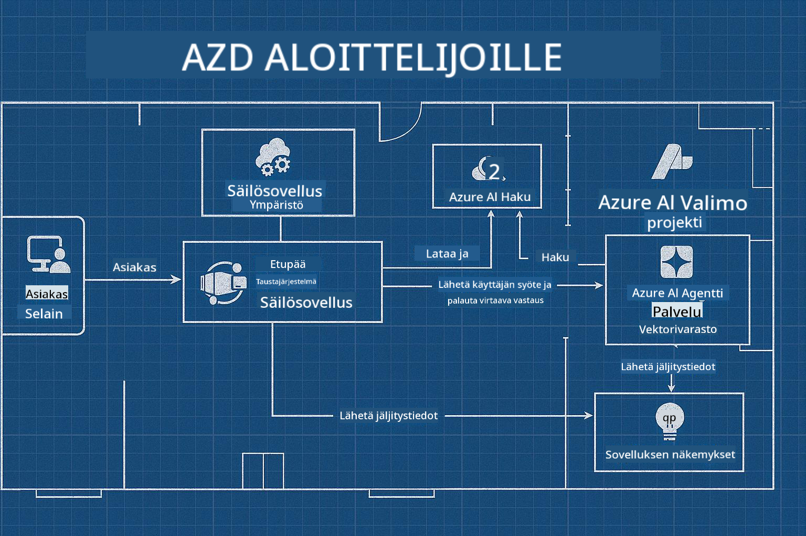

<!--
CO_OP_TRANSLATOR_METADATA:
{
  "original_hash": "245d24997bbcf2bae93bb2a503845d37",
  "translation_date": "2025-09-23T11:57:58+00:00",
  "source_file": "workshop/README.md",
  "language_code": "fi"
}
-->
# AZD AI-kehittäjien työpaja

## AZD-mallit

Yritystason tekoälysovelluksen rakentaminen omaan käyttötarkoitukseesi on hyvin samanlaista kuin oman kodin rakentaminen. Voit suunnitella sen itse, rakentaa sen pala palalta ja ottaa vastuun siitä, että se täyttää kaikki hallinnointi- ja kehitysohjeet.

**TAI ....**

Voit työskennellä arkkitehdin kanssa, joka voi antaa sinulle _pohjapiirroksen_ aloituskodille ja sitten mukauttaa sen tarpeidesi mukaan. Tämä antaa sinulle mahdollisuuden keskittyä siihen, mikä tekee **kodistasi** erityisen, ja antaa asiantuntijoiden huolehtia sähköistyksestä, putkistosta ja muista riippuvuuksista.

**Tämä on ajatus [AI-sovellusmallien](https://ai.azure.com/templates) takana** - sarja pohjapiirroksia erilaisten tekoälysovellusten "kotien" rakentamiseen riippuen ydintarpeistasi ja riippuvuuksistasi.

## Mallien mukauttaminen

Mallit on suunniteltu toimimaan [Azure AI Foundryn](https://ai.azure.com) kanssa. Ajattele tätä alustaa "rakennusurakoitsijanasi", jolla on pääsy kaikkiin resursseihin, työkaluihin ja asiantuntemukseen, joita tarvitset työn suorittamiseen!

Sinun tarvitsee vain valita [aloitusmallisi](https://learn.microsoft.com/en-us/azure/ai-foundry/how-to/develop/ai-template-get-started). Esimerkiksi keskitymme _Get Started with AI Agents_ -malliin rakentaaksemme sinulle "Agentic AI Home" -ratkaisun, joka sisältää ominaisuuksia, kuten AI-haku, Red Teaming, arvioinnit, jäljitys, valvonta ja paljon muuta!



Sinun tarvitsee vain varata aika arkkitehdin kanssa, joka opastaa sinua mukautusprosessissa. [GitHub Copilot for Azure](https://learn.microsoft.com/en-us/azure/developer/github-copilot-azure/get-started) voi olla tuo opas. Voit "keskustella sen kanssa" seuraavasti:

- Oppia mallisi Azure-ominaisuuksista
- Ottaa käyttöön Azure-resursseja
- Saada tietoa käyttöönotostasi
- Diagnosoida ja ratkaista ongelmia!

Tässä työpajassa opimme _purkamaan_ olemassa olevan mallin (oppimaan, mitä se tarjoaa) ja sitten _mukauttamaan_ sen (täyttämään vaatimuksemme) - askel kerrallaan.

AI-mallit **saavat sen toimimaan** - työpajan suorittamalla opit **tekemään siitä omasi**.

----

**Työpajan navigointi**
- **📚 Kurssin kotisivu**: [AZD aloittelijoille](../README.md)
- **📖 Aiheeseen liittyvät luvut**: Kattaa [Luku 1](../README.md#-chapter-1-foundation--quick-start), [Luku 2](../README.md#-chapter-2-ai-first-development-recommended-for-ai-developers) ja [Luku 5](../README.md#-chapter-5-multi-agent-ai-solutions-advanced)
- **🛠️ Käytännön laboratorio**: [AI-työpajalaboratorio](../docs/ai-foundry/ai-workshop-lab.md)
- **🚀 Seuraavat vaiheet**: [Työpajan moduulit](../../../workshop)

Tervetuloa käytännön työpajaan, jossa opit käyttämään Azure Developer CLI:tä (AZD) tekoälysovellusten käyttöönottoon keskittyen. Tämä työpaja on suunniteltu viemään sinut AZD:n perusteista tuotantovalmiiden tekoälyratkaisujen käyttöönottoon.

## Työpajan yleiskatsaus

**Kesto:** 2-3 tuntia  
**Taso:** Aloittelijasta keskitason osaajaksi  
**Esitiedot:** Perustiedot Azuresta, komentorivityökaluista ja tekoälykonsepteista

### Mitä opit

- **AZD:n perusteet**: Infrastruktuuri koodina AZD:n avulla
- 🤖 **Tekoälypalveluiden integrointi**: Azure OpenAI:n, AI-haun ja muiden tekoälypalveluiden käyttöönotto
- **Konttien käyttöönotto**: Azure Container Apps -palvelun käyttö tekoälysovelluksille
- **Tietoturvan parhaat käytännöt**: Hallitun identiteetin ja turvallisten asetusten toteuttaminen
- **Valvonta ja näkyvyys**: Application Insightsin käyttöönotto tekoälykuormille
- **Tuotantokuvioita**: Yritystason käyttöönoton strategiat

## Työpajan rakenne

### Moduuli 1: AZD:n perusteet (30 minuuttia)
- AZD:n asennus ja konfigurointi
- AZD-projektirakenteen ymmärtäminen
- Ensimmäinen AZD-käyttöönotto
- **Laboratorio**: Yksinkertaisen verkkosovelluksen käyttöönotto

### Moduuli 2: Azure OpenAI -integraatio (45 minuuttia)
- Azure OpenAI -resurssien määrittäminen
- Mallien käyttöönoton strategiat
- API-käytön ja autentikoinnin konfigurointi
- **Laboratorio**: Keskustelusovelluksen käyttöönotto GPT-4:llä

### Moduuli 3: RAG-sovellukset (45 minuuttia)
- Azure AI Search -integraatio
- Dokumenttien käsittely Azure Document Intelligencen avulla
- Vektorikaaret ja semanttinen haku
- **Laboratorio**: Dokumenttien kysymys-vastausjärjestelmän rakentaminen

### Moduuli 4: Tuotantokäyttöönotto (30 minuuttia)
- Container Apps -konfigurointi
- Skaalaus ja suorituskyvyn optimointi
- Valvonta ja lokitus
- **Laboratorio**: Käyttöönotto tuotantoon näkyvyyden kanssa

### Moduuli 5: Edistyneet kuviot (15 minuuttia)
- Moniympäristökäyttöönotot
- CI/CD-integraatio
- Kustannusoptimointistrategiat
- **Yhteenveto**: Tuotantovalmiuden tarkistuslista

## Esitiedot

### Tarvittavat työkalut

Asenna nämä työkalut ennen työpajaa:

```bash
# Azure Developer CLI
curl -fsSL https://aka.ms/install-azd.sh | bash

# Azure CLI
curl -sL https://aka.ms/InstallAzureCLIDeb | sudo bash

# Git
sudo apt-get install git

# Docker
curl -fsSL https://get.docker.com -o get-docker.sh
sudo sh get-docker.sh

# Python 3.10+
sudo apt-get install python3.10 python3.10-venv python3-pip
```

### Azure-tilin asetukset

1. **Azure-tilaus**: [Rekisteröidy ilmaiseksi](https://azure.microsoft.com/free/)  
2. **Azure OpenAI -pääsy**: [Pyydä pääsyä](https://aka.ms/oai/access)  
3. **Vaaditut oikeudet**:  
   - Contributor-rooli tilauksessa tai resurssiryhmässä  
   - User Access Administrator (RBAC-tehtäville)  

### Esitietojen tarkistus

Suorita tämä skripti varmistaaksesi asetuksesi:

```bash
#!/bin/bash
echo "Verifying workshop prerequisites..."

# Check AZD installation
if command -v azd &> /dev/null; then
    echo "✅ Azure Developer CLI: $(azd --version)"
else
    echo "❌ Azure Developer CLI not found"
fi

# Check Azure CLI
if command -v az &> /dev/null; then
    echo "✅ Azure CLI: $(az --version | head -n1)"
else
    echo "❌ Azure CLI not found"
fi

# Check Docker
if command -v docker &> /dev/null; then
    echo "✅ Docker: $(docker --version)"
else
    echo "❌ Docker not found"
fi

# Check Python
if command -v python3 &> /dev/null; then
    echo "✅ Python: $(python3 --version)"
else
    echo "❌ Python 3 not found"
fi

# Check Azure login
if az account show &> /dev/null; then
    echo "✅ Azure: Logged in as $(az account show --query user.name -o tsv)"
else
    echo "❌ Azure: Not logged in (run 'az login')"
fi

echo "Setup verification complete!"
```

## Työpajamateriaalit

### Laboratoriotehtävät

Jokainen moduuli sisältää käytännön laboratorioita aloituskoodilla ja vaiheittaisilla ohjeilla:

- **[lab-1-azd-basics/](../../../workshop/lab-1-azd-basics)** - Ensimmäinen AZD-käyttöönotto  
- **[lab-2-openai-chat/](../../../workshop/lab-2-openai-chat)** - Keskustelusovellus Azure OpenAI:lla  
- **[lab-3-rag-search/](../../../workshop/lab-3-rag-search)** - RAG-sovellus AI-haulla  
- **[lab-4-production/](../../../workshop/lab-4-production)** - Tuotantokäyttöönottokuvioita  
- **[lab-5-advanced/](../../../workshop/lab-5-advanced)** - Edistyneet käyttöönoton skenaariot  

### Viitemateriaalit

- **[AI Foundry -integraatio-opas](../docs/ai-foundry/azure-ai-foundry-integration.md)** - Kattavat integraatiokuviot  
- **[AI-mallien käyttöönotto-opas](../docs/ai-foundry/ai-model-deployment.md)** - Mallien käyttöönoton parhaat käytännöt  
- **[Tuotantotason tekoälykäytännöt](../docs/ai-foundry/production-ai-practices.md)** - Yritystason käyttöönoton kuviot  
- **[Tekoälyn vianmääritysopas](../docs/troubleshooting/ai-troubleshooting.md)** - Yleiset ongelmat ja ratkaisut  

### Esimerkkimallit

Pikakäynnistysmallit yleisiin tekoälytilanteisiin:

```
workshop/templates/
├── minimal-chat/          # Basic OpenAI chat app
├── rag-application/       # RAG with AI Search
├── multi-model/          # Multiple AI services
└── production-ready/     # Enterprise template
```

## Aloittaminen

### Vaihtoehto 1: GitHub Codespaces (suositeltu)

Nopein tapa aloittaa työpaja:

[](https://github.com/codespaces/new?hide_repo_select=true&ref=main&repo=YOUR_REPO_ID)

### Vaihtoehto 2: Paikallinen kehitys

1. **Kloonaa työpajarepositorio:**  
```bash
git clone https://github.com/YOUR_ORG/AZD-for-beginners.git
cd AZD-for-beginners/workshop
```

2. **Kirjaudu sisään Azureen:**  
```bash
az login
azd auth login
```

3. **Aloita laboratoriosta 1:**  
```bash
cd lab-1-azd-basics
cat README.md  # Follow the instructions
```

### Vaihtoehto 3: Ohjaajan vetämä työpaja

Jos osallistut ohjaajan vetämään istuntoon:

- 🎥 **Työpajan tallenne**: [Saatavilla pyynnöstä](https://aka.ms/azd-ai-workshop)  
- 💬 **Discord-yhteisö**: [Liity saadaksesi tukea](https://aka.ms/foundry/discord)  
- **Työpajapalaute**: [Jaa kokemuksesi](https://aka.ms/azd-workshop-feedback)  

## Työpajan aikataulu

### Itseopiskelu (3 tuntia)

```
⏰ 00:00 - 00:30  Module 1: AZD Foundations
⏰ 00:30 - 01:15  Module 2: Azure OpenAI Integration
⏰ 01:15 - 02:00  Module 3: RAG Applications
⏰ 02:00 - 02:30  Module 4: Production Deployment
⏰ 02:30 - 02:45  Module 5: Advanced Patterns
⏰ 02:45 - 03:00  Q&A and Next Steps
```

### Ohjaajan vetämä istunto (2,5 tuntia)

```
⏰ 00:00 - 00:15  Welcome & Prerequisites Check
⏰ 00:15 - 00:40  Module 1: Live Demo + Lab
⏰ 00:40 - 01:20  Module 2: OpenAI Integration
⏰ 01:20 - 01:30  Break
⏰ 01:30 - 02:10  Module 3: RAG Applications
⏰ 02:10 - 02:30  Module 4: Production Patterns
⏰ 02:30 - 02:45  Module 5: Advanced Topics
⏰ 02:45 - 03:00  Q&A and Resources
```

## Onnistumiskriteerit

Työpajan lopussa osaat:

✅ **Ottaa käyttöön tekoälysovelluksia** AZD-mallien avulla  
✅ **Määrittää Azure OpenAI** -palvelut turvallisesti  
✅ **Rakentaa RAG-sovelluksia** Azure AI Search -integraatiolla  
✅ **Toteuttaa tuotantokuvioita** yritystason tekoälykuormille  
✅ **Valvoa ja ratkaista ongelmia** tekoälysovellusten käyttöönotossa  
✅ **Soveltaa kustannusoptimointistrategioita** tekoälykuormille  

## Yhteisö ja tuki

### Työpajan aikana

- 🙋 **Kysymykset**: Käytä työpajan chattia tai nosta käsi  
- 🐛 **Ongelmat**: Tarkista [vianmääritysopas](../docs/troubleshooting/ai-troubleshooting.md)  
- **Vinkit**: Jaa löytöjäsi muiden osallistujien kanssa  

### Työpajan jälkeen

- 💬 **Discord**: [Azure AI Foundry -yhteisö](https://aka.ms/foundry/discord)  
- **GitHub-ongelmat**: [Ilmoita malliongelmista](https://github.com/YOUR_ORG/AZD-for-beginners/issues)  
- 📧 **Palaute**: [Työpajan arviointilomake](https://aka.ms/azd-workshop-feedback)  

## Seuraavat vaiheet

### Jatka oppimista

1. **Edistyneet skenaariot**: Tutustu [monialuekäyttöönottoihin](../docs/ai-foundry/production-ai-practices.md#multi-region-deployment)  
2. **CI/CD-integraatio**: Määritä [GitHub Actions -työnkulut](../docs/deployment/github-actions.md)  
3. **Mukautetut mallit**: Luo omia [AZD-malleja](../docs/getting-started/custom-templates.md)  

### Sovella projekteissasi

1. **Arviointi**: Käytä [valmiuslistaa](./production-readiness-checklist.md)  
2. **Mallit**: Aloita [tekoälykohtaisilla malleillamme](../../../workshop/templates)  
3. **Tuki**: Liity [Azure AI Foundry Discordiin](https://aka.ms/foundry/discord)  

### Jaa onnistumisesi

- ⭐ **Tähdellä repositorio**, jos tämä työpaja auttoi sinua  
- 🐦 **Jaa sosiaalisessa mediassa** tunnisteilla #AzureDeveloperCLI #AzureAI  
- 📝 **Kirjoita blogikirjoitus** tekoälyn käyttöönoton matkasta  

---

## Työpajapalaute

Palautteesi auttaa meitä parantamaan työpajakokemusta:

| Osa-alue | Arvosana (1-5) | Kommentit |
|----------|----------------|-----------|
| Sisällön laatu | ⭐⭐⭐⭐⭐ | |
| Käytännön laboratoriot | ⭐⭐⭐⭐⭐ | |
| Dokumentaatio | ⭐⭐⭐⭐⭐ | |
| Vaikeustaso | ⭐⭐⭐⭐⭐ | |
| Kokonaiskokemus | ⭐⭐⭐⭐⭐ | |

**Lähetä palaute**: [Työpajan arviointilomake](https://aka.ms/azd-workshop-feedback)

---

**Edellinen:** [Tekoälyn vianmääritysopas](../docs/troubleshooting/ai-troubleshooting.md) | **Seuraava:** Aloita [Laboratorio 1: AZD:n perusteet](../../../workshop/lab-1-azd-basics)

**Valmis aloittamaan tekoälysovellusten rakentamisen AZD:llä?**

[Aloita Laboratorio 1: AZD:n perusteet →](./lab-1-azd-basics/README.md)

---

