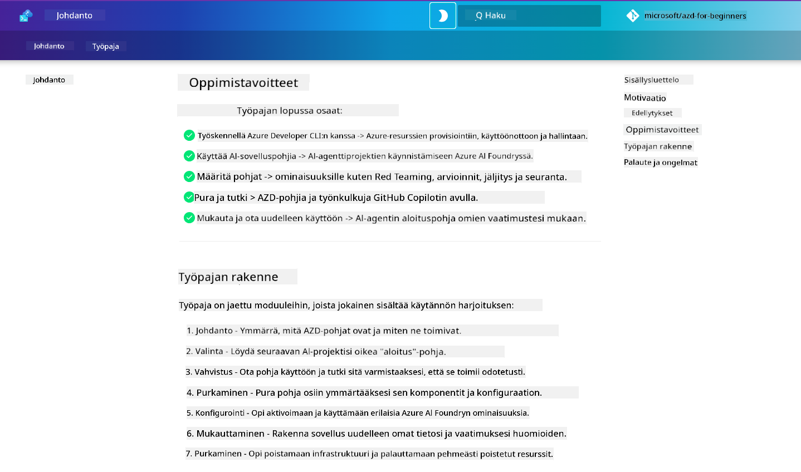

<!--
CO_OP_TRANSLATOR_METADATA:
{
  "original_hash": "9cc966416ab431c38b2ab863884b196c",
  "translation_date": "2025-09-24T22:33:40+00:00",
  "source_file": "workshop/README.md",
  "language_code": "fi"
}
-->
# AZD AI-kehittäjien työpaja

Tervetuloa Azure Developer CLI (AZD) -työpajaan, jossa keskitytään tekoälysovellusten käyttöönottoon. Tämä työpaja auttaa sinua ymmärtämään AZD-mallipohjia käytännössä kolmessa vaiheessa:

1. **Tutustuminen** - löydä sinulle sopiva mallipohja.
1. **Käyttöönotto** - ota käyttöön ja varmista, että se toimii.
1. **Mukauttaminen** - muokkaa ja kehitä mallipohjaa omiin tarpeisiisi!

Työpajan aikana tutustut myös keskeisiin kehittäjätyökaluihin ja -työnkulkuihin, jotka auttavat sinua tehostamaan koko kehitysprosessiasi.

<br/>

## Selaimen kautta käytettävä opas

Työpajan oppitunnit ovat Markdown-muodossa. Voit selata niitä suoraan GitHubissa tai avata selaimen kautta esikatselun, kuten alla olevassa kuvassa.



Jos haluat käyttää tätä vaihtoehtoa, haarauta repositorio omaan profiiliisi ja käynnistä GitHub Codespaces. Kun VS Code -pääte on aktiivinen, kirjoita tämä komento:

```bash title="" linenums="0"
mkdocs serve > /dev/null 2>&1 &
```

Muutaman sekunnin kuluttua näet ponnahdusikkunan. Valitse vaihtoehto `Avaa selaimessa`. Verkkopohjainen opas avautuu nyt uuteen selaimen välilehteen. Esikatselun edut:

1. **Sisäänrakennettu haku** - löydä avainsanoja tai oppitunteja nopeasti.
1. **Kopiointikuvake** - vie hiiri koodilohkojen päälle nähdäksesi tämän vaihtoehdon.
1. **Teeman vaihtaminen** - vaihda tumma ja vaalea teema.
1. **Apua** - napsauta alatunnisteen Discord-kuvaketta liittyäksesi!

<br/>

## Työpajan yleiskatsaus

**Kesto:** 3-4 tuntia  
**Taso:** Aloittelija - Keskitaso  
**Esitiedot:** Perustiedot Azuresta, tekoälykonsepteista, VS Codesta ja komentorivityökaluista.

Tämä on käytännönläheinen työpaja, jossa opit tekemällä. Kun olet suorittanut harjoitukset, suosittelemme tutustumaan AZD For Beginners -opetussuunnitelmaan jatkaaksesi oppimista turvallisuus- ja tuottavuuskäytännöistä.

| Aika | Moduuli  | Tavoite |
|:---|:---|:---|
| 15 min | [Johdanto](docs/instructions/0-Introduction.md) | Aseta tavoitteet ja ymmärrä päämäärät |
| 30 min | [Valitse AI-mallipohja](docs/instructions/1-Select-AI-Template.md) | Tutki vaihtoehtoja ja valitse aloituspohja | 
| 30 min | [Vahvista AI-mallipohja](docs/instructions/2-Validate-AI-Template.md) | Ota oletusratkaisu käyttöön Azureen |
| 30 min | [Pura AI-mallipohja](docs/instructions/3-Deconstruct-AI-Template.md) | Tutki rakennetta ja konfiguraatiota |
| 30 min | [Konfiguroi AI-mallipohja](docs/instructions/4-Configure-AI-Template.md) | Aktivoi ja kokeile käytettävissä olevia ominaisuuksia |
| 30 min | [Mukauta AI-mallipohja](docs/instructions/5-Customize-AI-Template.md) | Sovita mallipohja omiin tarpeisiisi |
| 30 min | [Pura infrastruktuuri](docs/instructions/6-Teardown-Infrastructure.md) | Siivoa ja vapauta resurssit |
| 15 min | [Yhteenveto ja seuraavat askeleet](docs/instructions/7-Wrap-up.md) | Oppimisresurssit, työpajahaaste |

<br/>

## Mitä opit

AZD-mallipohjaa voi ajatella oppimisympäristönä, jossa voit tutkia erilaisia ominaisuuksia ja työkaluja Azure AI Foundryn kokonaisvaltaiseen kehitykseen. Työpajan lopussa sinulla pitäisi olla intuitiivinen käsitys eri työkaluista ja konsepteista tässä kontekstissa.

| Konsepti  | Tavoite |
|:---|:---|
| **Azure Developer CLI** | Ymmärrä työkalukomennot ja työnkulut |
| **AZD-mallipohjat**| Ymmärrä projektin rakenne ja konfiguraatio |
| **Azure AI Agent**| Provisionoi ja ota käyttöön Azure AI Foundry -projekti |
| **Azure AI Search**| Mahdollista kontekstin suunnittelu agenteilla |
| **Havainnointi**| Tutki jäljitystä, seurantaa ja arviointeja |
| **Red Teaming**| Tutki hyökkäystestauksia ja niiden torjuntaa |

<br/>

## Työpajan rakenne

Työpaja on rakennettu viemään sinut matkalle mallipohjan löytämisestä käyttöönottoon, purkamiseen ja mukauttamiseen - käyttäen virallista [Getting Started with AI Agents](https://github.com/Azure-Samples/get-started-with-ai-agents) -aloitusmallipohjaa perustana.

### [Moduuli 1: Valitse AI-mallipohja](docs/instructions/1-Select-AI-Template.md) (30 min)

- Mitä AI-mallipohjat ovat?
- Mistä löydän AI-mallipohjia?
- Kuinka voin aloittaa AI-agenttien rakentamisen?
- **Lab**: Pikakäynnistys GitHub Codespacesilla

### [Moduuli 2: Vahvista AI-mallipohja](docs/instructions/2-Validate-AI-Template.md) (30 min)

- Mikä on AI-mallipohjan arkkitehtuuri?
- Mikä on AZD-kehitystyönkulku?
- Kuinka voin saada apua AZD-kehityksessä?
- **Lab**: Ota käyttöön ja vahvista AI-agenttien mallipohja

### [Moduuli 3: Pura AI-mallipohja](docs/instructions/3-Deconstruct-AI-Template.md) (30 min)

- Tutki ympäristöäsi `.azure/`-hakemistossa
- Tutki resurssiasetuksiasi `infra/`-hakemistossa
- Tutki AZD-konfiguraatiotasi `azure.yaml`-tiedostoissa
- **Lab**: Muokkaa ympäristömuuttujia ja ota käyttöön uudelleen

### [Moduuli 4: Konfiguroi AI-mallipohja](docs/instructions/4-Configure-AI-Template.md) (30 min)
- Tutki: Retrieval Augmented Generation
- Tutki: Agenttien arviointi ja Red Teaming
- Tutki: Jäljitys ja seuranta
- **Lab**: Tutki AI-agenttia + havainnointia 

### [Moduuli 5: Mukauta AI-mallipohja](docs/instructions/5-Customize-AI-Template.md) (30 min)
- Määritä: PRD skenaariovaatimuksilla
- Konfiguroi: Ympäristömuuttujat AZD:lle
- Toteuta: Elinkaarikoukut lisätehtäville
- **Lab**: Mukauta mallipohja omaan skenaarioon

### [Moduuli 6: Pura infrastruktuuri](docs/instructions/6-Teardown-Infrastructure.md) (30 min)
- Kertaus: Mitä AZD-mallipohjat ovat?
- Kertaus: Miksi käyttää Azure Developer CLI:tä?
- Seuraavat askeleet: Kokeile eri mallipohjaa!
- **Lab**: Poista infrastruktuuri ja siivoa

<br/>

## Työpajahaaste

Haluatko haastaa itsesi tekemään enemmän? Tässä muutamia projektiehdotuksia - tai jaa omat ideasi kanssamme!

| Projekti | Kuvaus |
|:---|:---|
|1. **Pura monimutkainen AI-mallipohja** | Käytä esitettyä työnkulkua ja työkaluja ja katso, voitko ottaa käyttöön, vahvistaa ja mukauttaa eri AI-ratkaisumallipohjaa. _Mitä opit?_|
|2. **Mukauta omaan skenaarioosi**  | Kokeile kirjoittaa PRD (Product Requirements Document) eri skenaariolle. Käytä sitten GitHub Copilotia mallipohjarepositoriossasi Agent Model -tilassa ja pyydä sitä luomaan mukauttamistyönkulku sinulle. _Mitä opit? Kuinka voisit parantaa näitä ehdotuksia?_|
| | |

## Onko palautetta?

1. Lähetä ongelma tähän repositorioon - merkitse se `Workshop`-tunnisteella.
1. Liity Azure AI Foundry Discordiin - verkostoidu muiden kanssa!


| | | 
|:---|:---|
| **📚 Kurssin kotisivu**| [AZD For Beginners](../README.md)|
| **📖 Dokumentaatio** | [Aloita AI-mallipohjien kanssa](https://learn.microsoft.com/en-us/azure/ai-foundry/how-to/develop/ai-template-get-started)|
| **🛠️AI-mallipohjat** | [Azure AI Foundry Templates](https://ai.azure.com/templates) |
|**🚀 Seuraavat askeleet** | [Ota haaste vastaan](../../../workshop) |
| | |

<br/>

---

**Edellinen:** [AI-vianetsintäopas](../docs/troubleshooting/ai-troubleshooting.md) | **Seuraava:** Aloita [Lab 1: AZD Basics](../../../workshop/lab-1-azd-basics)

**Valmis aloittamaan tekoälysovellusten rakentamisen AZD:llä?**

[Aloita Lab 1: AZD Foundations →](./lab-1-azd-basics/README.md)

---

