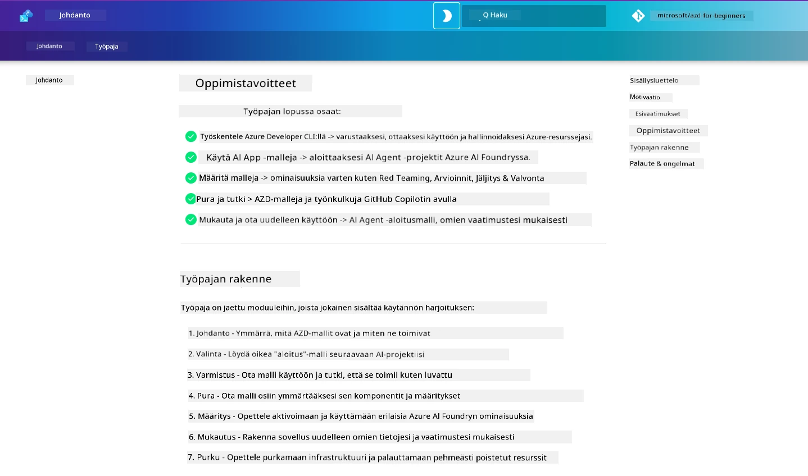

<div align="center">
  <div style="background: linear-gradient(135deg, #0078d4, #106ebe); border-radius: 10px; padding: 20px; margin: 20px 0; box-shadow: 0 4px 15px rgba(0, 120, 212, 0.3); border: 2px solid #005a9e;">
    <h2 style="color: white; margin: 0; font-size: 24px; text-shadow: 1px 1px 2px rgba(0,0,0,0.3);">
      🎯 AZD AI-kehittäjien työpaja
    </h2>
    <p style="color: white; margin: 10px 0 0 0; font-size: 16px; text-shadow: 1px 1px 2px rgba(0,0,0,0.3);">
      <strong>Käytännönläheinen työpaja AI-sovellusten rakentamiseen Azure Developer CLI:llä.</strong><br>
      Suorita 7 moduulia hallitaksesi AZD-pohjia ja AI:n käyttöönoton työnkulkuja.
    </p>
    <div style="margin-top: 15px;">
      <span style="background: rgba(255,255,255,0.2); padding: 5px 10px; border-radius: 15px; color: white; font-size: 14px;">
        📅 Viimeksi päivitetty: maaliskuu 2026
      </span>
    </div>
  </div>
</div>

# AZD AI-kehittäjien työpaja

Tervetuloa käytännönläheiseen työpajaan, jossa opit Azure Developer CLI:n (AZD) käytön erityisesti AI-sovellusten käyttöönottoon. Tämä työpaja auttaa sinua saamaan soveltavan ymmärryksen AZD-pohjista kolmessa vaiheessa:

1. **Tutustuminen** - löydä sinulle sopiva pohja.
1. **Käyttöönotto** - ota käyttöön ja varmista, että se toimii
1. **Mukauttaminen** - muokkaa ja iteroi tehdäksesi siitä oman!

Tämän työpajan aikana tutustut myös keskeisiin kehittäjätyökaluihin ja työnkulkuihin, jotka auttavat virtaviivaistamaan koko kehitysprosessiasi.

<br/>

## Selainpohjainen opas

Työpajan oppitunnit ovat Markdown-muodossa. Voit selata niitä suoraan GitHubissa - tai avata selainpohjaisen esikatselun kuten alla olevassa kuvakaappauksessa.



Käyttääksesi tätä vaihtoehtoa - tee fork repositoriosta omaan profiiliisi ja käynnistä GitHub Codespaces. Kun VS Code -terminaali on aktiivinen, kirjoita tämä komento:

This browser preview works in GitHub Codespaces, dev containers, or a local clone with Python and MkDocs installed.

```bash title="" linenums="0"
mkdocs serve > /dev/null 2>&1 &
```

Sekunnin kuluttua näet ponnahdusikkunan. Valitse vaihtoehto `Open in browser`. Selainpohjainen opas avautuu nyt uudessa selaimen välilehdessä. Tämän esikatselun etuja:

1. **Sisäänrakennettu haku** - löydä avainsanat tai oppitunnit nopeasti.
1. **Kopiointikuvake** - siirrä hiiri koodilohkojen päälle nähdäksesi tämän vaihtoehdon
1. **Teeman vaihto** - vaihda tummaan ja vaaleaan teemaan
1. **Hanki apua** - klikkaa Discord-ikonia alatunnisteessa liittyäksesi!

<br/>

## Työpajan yleiskuva

**Kesto:** 3–4 tuntia  
**Taso:** Aloittelijasta keskitasolle  
**Esivaatimukset:** Tuntemus Azuresta, AI-käsitteistä, VS Codesta ja komentorivityökaluista.

Tämä on käytännönläheinen työpaja, jossa opit tekemällä. Kun olet suorittanut harjoitukset, suosittelemme tarkastelemaan AZD For Beginners -opetussuunnitelmaa jatkaaksesi oppimista turvallisuuden ja tuottavuuden parhaiden käytäntöjen parissa.

| Time| Module  | Objective |
|:---|:---|:---|
| 15 mins | [Introduction](docs/instructions/0-Introduction.md) | Aseta puitteet, ymmärrä tavoitteet |
| 30 mins | [Select AI Template](docs/instructions/1-Select-AI-Template.md) | Tutki vaihtoehtoja ja valitse aloituspohja | 
| 30 mins | [Validate AI Template](docs/instructions/2-Validate-AI-Template.md) | Ota oletusratkaisu käyttöön Azureen |
| 30 mins | [Deconstruct AI Template](docs/instructions/3-Deconstruct-AI-Template.md) | Tutki rakennetta ja konfiguraatiota |
| 30 mins | [Configure AI Template](docs/instructions/4-Configure-AI-Template.md) | Aktivoi ja kokeile saatavilla olevia ominaisuuksia |
| 30 mins | [Customize AI Template](docs/instructions/5-Customize-AI-Template.md) | Mukauta pohjaa tarpeisiisi |
| 30 mins | [Teardown Infrastructure](docs/instructions/6-Teardown-Infrastructure.md) | Puhdista ja vapauta resurssit |
| 15 mins | [Wrap-Up & Next Steps](docs/instructions/7-Wrap-up.md) | Oppimateriaalit, työpajan haaste |

<br/>

## Mitä opit

Ajattele AZD-pohjaa oppimisalueena, jossa voit tutkia erilaisia ominaisuuksia ja työkaluja täysimittaista kehitystä varten Microsoft Foundry -ympäristössä. Tämän työpajan lopussa sinulla pitäisi olla intuitiivinen käsitys eri työkaluista ja konsepteista tässä kontekstissa.

| Concept  | Objective |
|:---|:---|
| **Azure Developer CLI** | Ymmärrä työkalun komennot ja työnkulut|
| **AZD Templates**| Ymmärrä projektin rakenne ja konfiguraatio|
| **Azure AI Agent**| Provisionoi ja ota käyttöön Microsoft Foundry -projekti  |
| **Azure AI Search**| Mahdollista kontekstin hyödyntäminen agenteilla |
| **Observability**| Tutki jäljittämistä, valvontaa ja arviointeja |
| **Red Teaming**| Tutki vastustavia testauksia ja lieventämistoimia |

<br/>

## Työpajan rakenne

Työpaja on suunniteltu viemään sinut matkalle pohjan löytämisestä käyttöönottoon, purkamiseen ja mukauttamiseen - käyttäen virallista [Getting Started with AI Agents](https://github.com/Azure-Samples/get-started-with-ai-agents) -aloituspohjaa perustana.

### [Module 1: Select AI Template](docs/instructions/1-Select-AI-Template.md) (30 mins)

- Mitä AI-pohjat ovat?
- Mistä löydän AI-pohjia?
- Miten pääsen alkuun AI-agenttien rakentamisessa?
- **Lab**: Pikakäynnistys Codespacesissa tai dev-containerissa

### [Module 2: Validate AI Template](docs/instructions/2-Validate-AI-Template.md) (30 mins)

- Mikä on AI-pohjan arkkitehtuuri?
- Mikä on AZD-kehitystyönkulku?
- Mistä saan apua AZD-kehitykseen?
- **Lab**: Ota AI Agents -pohja käyttöön ja varmista toimivuus

### [Module 3: Deconstruct AI Template](docs/instructions/3-Deconstruct-AI-Template.md) (30 mins)

- Tutki ympäristöäsi kansiossa `.azure/` 
- Tutki resurssiasetuksiasi kansiossa `infra/` 
- Tutki AZD-konfiguraatiotasi tiedostoissa `azure.yaml`s
- **Lab**: Muokkaa ympäristömuuttujia & ota uudelleen käyttöön

### [Module 4: Configure AI Template](docs/instructions/4-Configure-AI-Template.md) (30 mins)
- Tutki: Retrieval Augmented Generation
- Tutki: Agenttien arviointi & Red Teaming
- Tutki: Jäljittäminen & valvonta
- **Lab**: Tutki AI-agenttia + observabilitya

### [Module 5: Customize AI Template](docs/instructions/5-Customize-AI-Template.md) (30 mins)
- Määrittele: PRD skenaariovaatimuksilla
- Konfiguroi: Ympäristömuuttujat AZD:lle
- Toteuta: Elinkaarihookit lisätehtäville
- **Lab**: Mukauta pohjaa omaan skenaarioosi

### [Module 6: Teardown Infrastructure](docs/instructions/6-Teardown-Infrastructure.md) (30 mins)
- Kertaus: Mitä AZD-pohjat ovat?
- Kertaus: Miksi käyttää Azure Developer CLI:tä?
- Seuraavat askeleet: Kokeile eri pohjaa!
- **Lab**: Poista infrastruktuuri käytöstä & siivous

<br/>

## Työpajan haaste

Haluatko haastaa itsesi tekemään enemmän? Tässä on joitain projektiehdotuksia - tai jaa ideasi kanssamme!!

| Project | Description |
|:---|:---|
|1. **Deconstruct A Complex AI Template** | Käytä aiemmin esiteltyä työnkulkua ja työkaluja ja katso, pystytkö ottamaan käyttöön, validoimaan ja mukauttamaan eri AI-ratkaisupohjan. _Mitä opit?_|
|2. **Customize With Your Scenario**  | Yritä kirjoittaa PRD (Product Requirements Document) eri skenaariota varten. Käytä sitten GitHub Copilotia pohjarepossasi Agent Model -tilassa - ja pyydä sitä luomaan mukautustyönkulku sinulle. _Mitä opit? Miten voisit parantaa näitä ehdotuksia?_|
| | |

## Onko palautetta?

1. Luo issue tähän repoosi - merkitse se `Workshop` helpottamaan löytymistä.
1. Liity Microsoft Foundry Discordiin - verkostoidu muiden osallistujien kanssa!


| | | 
|:---|:---|
| **📚 Kurssin etusivu**| [AZD For Beginners](../README.md)|
| **📖 Dokumentaatio** | [Get started with AI templates](https://learn.microsoft.com/en-us/azure/ai-foundry/how-to/develop/ai-template-get-started)|
| **🛠️AI Templates** | [Microsoft Foundry Templates](https://ai.azure.com/templates) |
|**🚀 Seuraavat askeleet** | [Begin Workshop](#työpajan-yleiskuva) |
| | |

<br/>

---

**Navigaatio:** [Main Course](../README.md) | [Introduction](docs/instructions/0-Introduction.md) | [Module 1: Select Template](docs/instructions/1-Select-AI-Template.md)

**Valmis aloittamaan AI-sovellusten rakentamisen AZD:llä?**

[Aloita työpaja: Introduktio →](docs/instructions/0-Introduction.md)

---

<!-- CO-OP TRANSLATOR DISCLAIMER START -->
**Vastuuvapauslauseke**:
Tämä asiakirja on käännetty käyttämällä tekoälykäännöspalvelua [Co-op Translator](https://github.com/Azure/co-op-translator). Vaikka pyrimme tarkkuuteen, huomioithan, että automatisoiduissa käännöksissä saattaa esiintyä virheitä tai epätarkkuuksia. Alkuperäistä asiakirjaa sen alkuperäisellä kielellä tulisi pitää virallisena lähteenä. Tärkeiden tietojen osalta suositellaan ammattimaista, ihmisen tekemää käännöstä. Emme ole vastuussa mahdollisista väärinkäsityksistä tai virheellisistä tulkinnoista, jotka johtuvat tämän käännöksen käytöstä.
<!-- CO-OP TRANSLATOR DISCLAIMER END -->