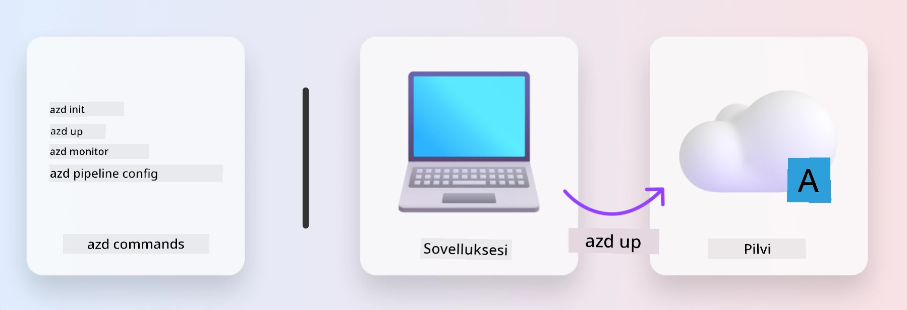
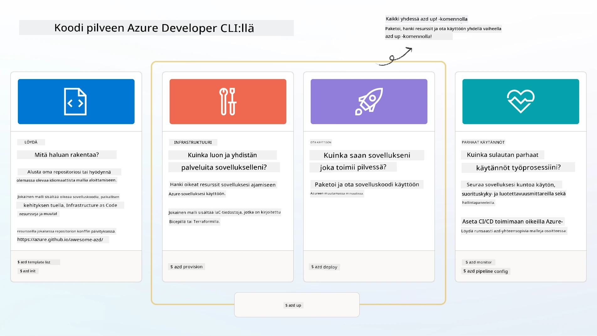

# 1. Valitse mallipohja

!!! tip "TÄMÄN OSION LOPUSSA OSAA"

    - [ ] Kuvata, mitä AZD-mallipohjat ovat
    - [ ] Löytää ja käyttää AZD-mallipohjia tekoälyä varten
    - [ ] Aloittaa AI Agents -mallipohjan käytön
    - [ ] **Lab 1:** AZD Quickstart GitHub Codespaces -ympäristössä

---

## 1. Rakentajan vertauskuva

Modernin yrityskäyttöön sopivan tekoälysovelluksen rakentaminen _alusta alkaen_ voi tuntua pelottavalta. Se on vähän kuin rakentaisi uuden kotinsa itse, tiili tiileltä. Kyllä, se on mahdollista! Mutta se ei ole tehokkain tapa saavuttaa haluttu lopputulos!

Sen sijaan aloitamme usein olemassa olevasta _suunnittelupiirustuksesta_ ja työskentelemme arkkitehdin kanssa mukauttaaksemme sen omiin tarpeisiimme. Juuri tätä lähestymistapaa kannattaa käyttää älykkäiden sovellusten rakentamisessa. Ensin löydetään hyvä suunnitteluarkkitehtuuri, joka sopii ongelma-alueeseen. Sitten työskennellään ratkaisun arkkitehdin kanssa mukauttaakseen ja kehittääkseen ratkaisua tiettyyn käyttötapaukseen.

Mutta mistä löydämme nämä suunnittelupiirustukset? Ja miten löydämme arkkitehdin, joka on valmis opettamaan meitä mukauttamaan ja ottamaan nämä piirustukset käyttöön itse? Tässä työpajassa vastaamme näihin kysymyksiin esittelemällä kolme teknologiaa:

1. [Azure Developer CLI](https://aka.ms/azd) - avoimen lähdekoodin työkalu, joka nopeuttaa kehittäjän matkaa paikallisesta kehityksestä (build) pilveen (ship).
1. [Azure AI Foundry Templates](https://ai.azure.com/templates) - standardisoidut avoimen lähdekoodin arkistot, jotka sisältävät esimerkkikoodia, infrastruktuuria ja konfiguraatiotiedostoja tekoälyratkaisun arkkitehtuurin käyttöönottoon.
1. [GitHub Copilot Agent Mode](https://code.visualstudio.com/docs/copilot/chat/chat-agent-mode) - Azure-tietoon perustuva koodausagentti, joka voi ohjata meitä koodipohjan navigoinnissa ja muutosten tekemisessä - luonnollisella kielellä.

Näiden työkalujen avulla voimme nyt _löytää_ oikean mallipohjan, _ottaa sen käyttöön_ varmistaaksemme sen toimivuuden ja _mukauttaa_ sen omiin tarpeisiimme. Sukelletaan syvemmälle ja opitaan, miten nämä toimivat.

---

## 2. Azure Developer CLI

[Azure Developer CLI](https://learn.microsoft.com/en-us/azure/developer/azure-developer-cli/) (tai `azd`) on avoimen lähdekoodin komentorivityökalu, joka voi nopeuttaa koodin siirtymistä pilveen kehittäjäystävällisten komentojen avulla, jotka toimivat johdonmukaisesti IDE-ympäristössä (kehitys) ja CI/CD-ympäristössä (devops).

`azd`-työkalun avulla käyttöönotto voi olla näin yksinkertaista:

- `azd init` - Alustaa uuden tekoälyprojektin olemassa olevasta AZD-mallipohjasta.
- `azd up` - Luo infrastruktuurin ja ottaa sovelluksen käyttöön yhdellä komennolla.
- `azd monitor` - Tarjoaa reaaliaikaista seurantaa ja diagnostiikkaa käyttöön otetulle sovellukselle.
- `azd pipeline config` - Määrittää CI/CD-putket automatisoimaan käyttöönoton Azureen.

**🎯 | HARJOITUS**: <br/> Tutki `azd`-komentorivityökalua GitHub Codespaces -ympäristössäsi nyt. Aloita kirjoittamalla tämä komento nähdäksesi, mitä työkalu voi tehdä:

```bash title="" linenums="0"
azd help
```



---

## 3. AZD-mallipohja

Jotta `azd` voi toimia, sen täytyy tietää, mitä infrastruktuuria luodaan, mitä konfiguraatioasetuksia käytetään ja mitä sovellusta otetaan käyttöön. Tässä [AZD-mallipohjat](https://learn.microsoft.com/en-us/azure/developer/azure-developer-cli/azd-templates?tabs=csharp) tulevat mukaan.

AZD-mallipohjat ovat avoimen lähdekoodin arkistoja, jotka yhdistävät esimerkkikoodin infrastruktuuriin ja konfiguraatiotiedostoihin, joita tarvitaan ratkaisun arkkitehtuurin käyttöönottoon.
Käyttämällä _Infrastructure-as-Code_ (IaC) -lähestymistapaa, ne mahdollistavat resurssimääritelmien ja konfiguraatioasetusten versionhallinnan (kuten sovelluksen lähdekoodin) - luoden uudelleenkäytettäviä ja johdonmukaisia työnkulkuja projektin käyttäjille.

Kun luot tai käytät AZD-mallipohjaa _oma_ käyttötapaukseesi, harkitse näitä kysymyksiä:

1. Mitä olet rakentamassa? → Onko olemassa mallipohjaa, jossa on aloituskoodi kyseiseen käyttötapaukseen?
1. Miten ratkaisusi on arkkitehturoidu? → Onko olemassa mallipohjaa, jossa on tarvittavat resurssit?
1. Miten ratkaisusi otetaan käyttöön? → Ajattele `azd deploy` -komentoa esikäsittely- ja jälkikäsittelykoukkujen kanssa!
1. Miten voit optimoida sen edelleen? → Ajattele sisäänrakennettua seurantaa ja automaatioputkia!

**🎯 | HARJOITUS**: <br/> 
Vieraile [Awesome AZD](https://azure.github.io/awesome-azd/) -galleriassa ja käytä suodattimia tutkiaksesi yli 250 mallipohjaa, jotka ovat tällä hetkellä saatavilla. Katso, löydätkö mallipohjan, joka vastaa _sinun_ käyttötapauksesi vaatimuksia.



---

## 4. Tekoälysovellusten mallipohjat

---

