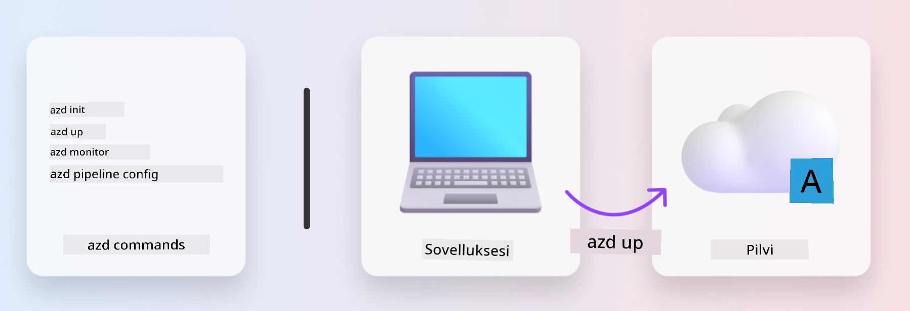
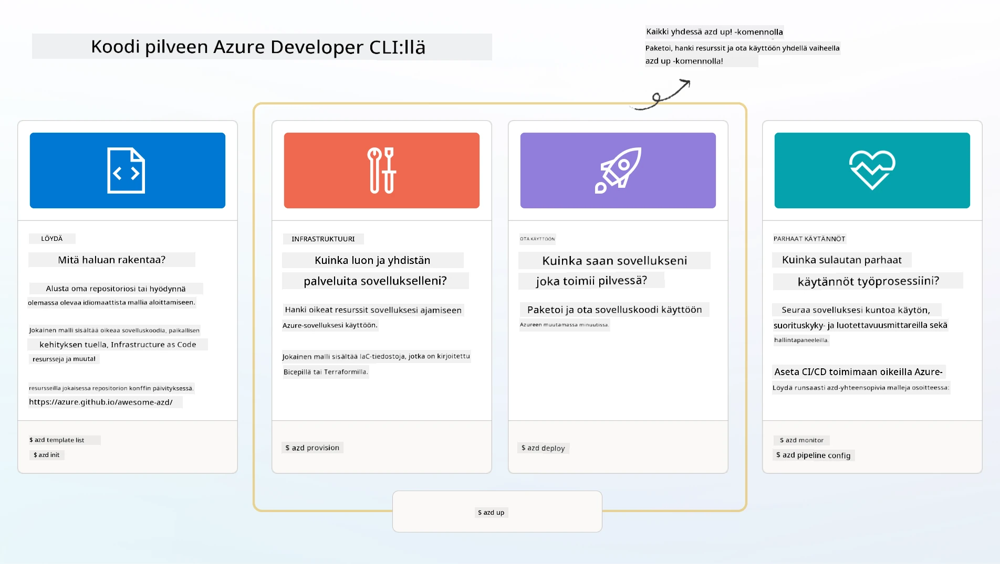

# 1. Valitse malli

!!! tip "TÄMÄN MODUULIN LOPPUUN MENNESSÄ OSAAT:"

    - [ ] Kuvaile, mitä AZD-mallit ovat
    - [ ] Löydä ja käytä AZD-malleja tekoälyä varten
    - [ ] Aloita AI Agents -mallin käyttö
    - [ ] **Lab 1:** AZD nopea aloitus Codespacesissa tai kehityssäiliössä

---

## 1. Rakentajan vertauskuva

Moderneista yritysvalmiista tekoälysovelluksista _alusta alkaen_ voi olla pelottavaa rakentaa. Se on vähän kuin rakentaisit uuden kotisi itse, tiili tiileltä. Kyllä, se on mahdollista! Mutta se ei ole tehokkain tapa saavuttaa toivottu lopputulos! 

Sen sijaan usein aloitetaan olemassa olevalla _suunnitelmapiirroksella_ ja tehdään yhteistyötä arkkitehdin kanssa räätälöidäksemme sen omiin tarpeisiimme. Ja juuri tällainen lähestymistapa kannattaa ottaa älykkäiden sovellusten rakentamisessa. Etsi ensin hyvä arkkitehtuurisuunnitelma, joka sopii ongelmaasi. Työskentele sitten ratkaisun arkkitehdin kanssa räätälöidäksesi ja kehittääksesi ratkaisun juuri sinun skenaariollesi.

Mutta mistä löydämme nämä suunnitelmapiirrokset? Entä miten löydämme arkkitehdin, joka on valmis opettamaan meille, kuinka räätälöidä ja ottaa nämä suunnitelmat käyttöön itse? Tässä työpajassa vastaamme näihin kysymyksiin esittelemällä kolme teknologiaa:

1. [Azure Developer CLI](https://aka.ms/azd) - avoimen lähdekoodin työkalu, joka nopeuttaa kehittäjän polkua paikallisesta kehityksestä (build) pilveen käyttöönottoon (ship).
1. [Microsoft Foundry Templates](https://ai.azure.com/templates) - standardisoituja avoimen lähdekoodin arkistoja, jotka sisältävät esimerkkikoodia, infrastruktuuri- ja konfiguraatiotiedostoja tekoälyratkaisun arkkitehtuurin käyttöönottoa varten.
1. [GitHub Copilot Agent Mode](https://code.visualstudio.com/docs/copilot/chat/chat-agent-mode) - koodausagentti, joka pohjautuu Azure-osaamiseen ja voi ohjata meitä koodikannan läpikäynnissä ja muutosten tekemisessä luonnollisen kielen avulla.

Näiden työkalujen avulla voimme nyt _löytää_ oikean mallin, _ottaa sen käyttöön_ varmistaaksemme, että se toimii, ja _räätälöidä_ sen vastaamaan erityisiä skenaarioitamme. Sukelletaan sisään ja opitaan, miten nämä toimivat.


---

## 2. Azure Developer CLI

The [Azure Developer CLI](https://learn.microsoft.com/en-us/azure/developer/azure-developer-cli/) (or `azd`) on avoimen lähdekoodin komentorivityökalu, joka voi nopeuttaa koodista pilveen -matkaasi kehittäjäystävällisillä komennoilla, jotka toimivat johdonmukaisesti IDE- (kehitys) ja CI/CD- (devops)ympäristöissä.

With `azd`, your deployment journey can be as simple as:

- `azd init` - Alustaa uuden tekoälyprojektin olemassa olevasta AZD-mallista.
- `azd up` - Provisionoi infrastruktuurin ja ottaa sovelluksesi käyttöön yhdellä komennolla.
- `azd monitor` - Hanki reaaliaikaista valvontaa ja diagnostiikkaa käyttöönotetulle sovelluksellesi.
- `azd pipeline config` - Konfiguroi CI/CD-putket automatisoimaan käyttöönoton Azureen.

**🎯 | HARJOITUS**: <br/> Tutki `azd`-komentorivityökalua nykyisessä työpaja-ympäristössäsi nyt. Tämä voi olla GitHub Codespaces, dev container, tai paikallinen klooni, jossa edellytykset ovat asennettuna. Aloita kirjoittamalla tämä komento nähdäksesi, mitä työkalu osaa:

```bash title="" linenums="0"
azd help
```



---

## 3. AZD-malli

Jotta `azd` voi tehdä tämän, sen täytyy tietää provisionoitava infrastruktuuri, pakotettavat konfiguraatioasetukset ja julkaistava sovellus. Tässä kohtaa [AZD-mallit](https://learn.microsoft.com/en-us/azure/developer/azure-developer-cli/azd-templates?tabs=csharp) tulevat mukaan. 

AZD-mallit ovat avoimen lähdekoodin arkistoja, jotka yhdistävät esimerkkikoodin infrastruktuuri- ja konfiguraatiotiedostoihin, jotka vaaditaan ratkaisun arkkitehtuurin käyttöönottoon.
Käyttämällä _Infrastructure-as-Code_ (IaC) -lähestymistapaa ne sallivat mallin resurssimäärittelyjen ja konfiguraatioasetusten olla versionhallinnassa (samoin kuin sovelluksen lähdekoodi) - luoden uudelleenkäytettäviä ja johdonmukaisia työnkulkuja projektin käyttäjille.

Kun luot tai käytät uudelleen AZD-mallia omaasi skenaarioosi, harkitse näitä kysymyksiä:

1. What are you building? → Onko olemassa mallia, joka sisältää aloituskoodin kyseiseen skenaarioon?
1. How is your solution architected? → Onko olemassa malli, joka sisältää tarvittavat resurssit?
1. How is your solution deployed? → Ajattele `azd deploy` -komentoa esikäsittely- ja jälkikäsittelykoukuilla!
1. How can you optimize it further? → Ajattele sisäänrakennettua valvontaa ja automaatioputkia!

**🎯 | HARJOITUS**: <br/> 
Vieraile [Awesome AZD](https://azure.github.io/awesome-azd/) -galleriassa ja käytä suodattimia tutkiaksesi yli 250 saatavilla olevaa mallia. Katso, löydätkö sellaisen, joka vastaa _sinun_ skenaarion vaatimuksia.



---

## 4. Tekoälysovellusten mallipohjat

Tekoälyä hyödyntäville sovelluksille Microsoft tarjoaa erikoistuneita malleja, joissa on **Microsoft Foundry** ja **Foundry Agents**. Nämä mallit nopeuttavat matkaasi kohti älykkäitä, tuotantovalmiita sovelluksia.

### Microsoft Foundry & Foundry Agents -mallit

Valitse alla malli käyttöönottoa varten. Jokainen malli on saatavilla [Awesome AZD](https://azure.github.io/awesome-azd/) -sivustolla ja voidaan alustaa yhdellä komennolla.

| Template | Description | Deploy Command |
|----------|-------------|----------------|
| **[AI Chat with RAG](https://azure.github.io/awesome-azd/?tags=ai&tags=rag)** | Keskustelusovellus, joka käyttää Retrieval Augmented Generationia Microsoft Foundryn avulla | `azd init -t azure-samples/azure-search-openai-demo` |
| **[Foundry Agent Service Starter](https://azure.github.io/awesome-azd/?tags=ai&tags=agents)** | Rakenna tekoälyagentteja Foundry Agents -tekniikalla autonomisiin tehtävien suorittamiseen | `azd init -t azure-samples/foundry-agent-service-starter` |
| **[Multi-Agent Orchestration](https://azure.github.io/awesome-azd/?tags=ai&tags=agents)** | Koordinoi useita Foundry-agentteja monimutkaisiin työnkulkuihin | `azd init -t azure-samples/multi-agent-orchestration` |
| **[AI Document Intelligence](https://azure.github.io/awesome-azd/?tags=ai&tags=document)** | Uuttaa ja analysoi asiakirjoja Microsoft Foundryn malleilla | `azd init -t azure-samples/ai-document-processing` |
| **[Conversational AI Bot](https://azure.github.io/awesome-azd/?tags=ai&tags=bot)** | Rakenna älykkäitä chattibotteja Microsoft Foundryn integraation avulla | `azd init -t azure-samples/ai-chat-protocol` |
| **[AI Image Generation](https://azure.github.io/awesome-azd/?tags=ai&tags=dalle)** | Luo kuvia DALL-E:llä Microsoft Foundryn kautta | `azd init -t azure-samples/ai-image-generation` |
| **[Semantic Kernel Agent](https://azure.github.io/awesome-azd/?tags=ai&tags=semantic-kernel)** | Tekoälyagentteja, jotka käyttävät Semantic Kernelia Foundry-agenttien kanssa | `azd init -t azure-samples/semantic-kernel-agent` |
| **[AutoGen Multi-Agent](https://azure.github.io/awesome-azd/?tags=ai&tags=autogen)** | Moniagenttijärjestelmiä AutoGen-kehyksen avulla | `azd init -t azure-samples/autogen-multi-agent` |

### Pika-aloitus

1. **Selaa malleja**: Vieraile [https://azure.github.io/awesome-azd/] ja suodata `AI`, `Agents`, tai `Microsoft Foundry`
2. **Valitse mallisi**: Valitse sellainen, joka vastaa käyttötapaustasi
3. **Alusta**: Suorita valitun mallin `azd init` -komento
4. **Ota käyttöön**: Suorita `azd up` provisionoidaksesi ja ottaaksesi käyttöön

**🎯 | HARJOITUS**: <br/>
Valitse yksi yllä olevista malleista skenaariosi perusteella:

- **Rakennatko chatbotin?** → Aloita **AI Chat with RAG**- tai **Conversational AI Bot** -mallilla
- **Tarvitsetko autonomisia agentteja?** → Kokeile **Foundry Agent Service Starter**- tai **Multi-Agent Orchestration** -mallia
- **Käsitteletkö asiakirjoja?** → Käytä **AI Document Intelligence** -mallia
- **Haluatko tekoälyn koodiapua?** → Tutustu **Semantic Kernel Agent**- tai **AutoGen Multi-Agent** -malleihin

```bash title="Example: Deploy the AI Chat with RAG template" linenums="0"
azd init -t azure-samples/azure-search-openai-demo
azd up
```

!!! info "Tutustu lisämalleihin"
    The [Awesome AZD Gallery](https://azure.github.io/awesome-azd/) sisältää yli 250 mallia. Käytä suodattimia löytääksesi malleja, jotka vastaavat erityisvaatimuksiasi kielen, kehyksen ja Azure-palveluiden osalta.

---

<!-- CO-OP TRANSLATOR DISCLAIMER START -->
**Vastuuvapauslauseke**:
Tämä asiakirja on käännetty käyttämällä tekoälypohjaista käännöspalvelua [Co-op Translator](https://github.com/Azure/co-op-translator). Vaikka pyrimme tarkkuuteen, ota huomioon, että automaattisissa käännöksissä voi esiintyä virheitä tai epätarkkuuksia. Alkuperäistä asiakirjaa sen alkuperäiskielellä tulee pitää määräävänä lähteenä. Tärkeissä asioissa suositellaan ammattimaista ihmiskäännöstä. Emme ole vastuussa tämän käännöksen käytöstä aiheutuvista väärinkäsityksistä tai virhetulkinnoista.
<!-- CO-OP TRANSLATOR DISCLAIMER END -->