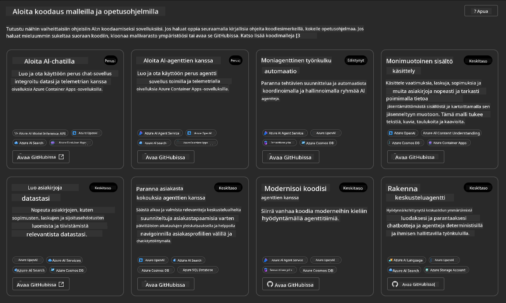
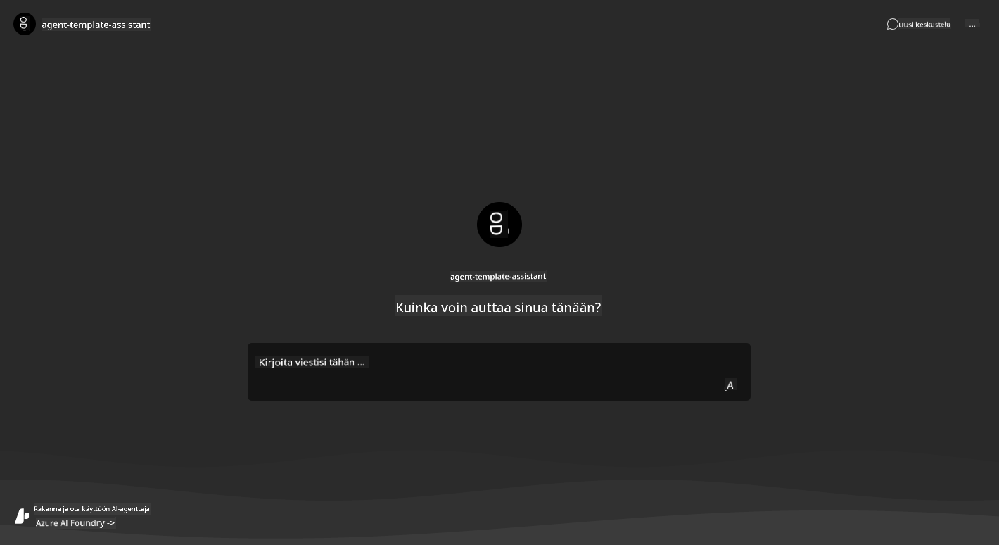
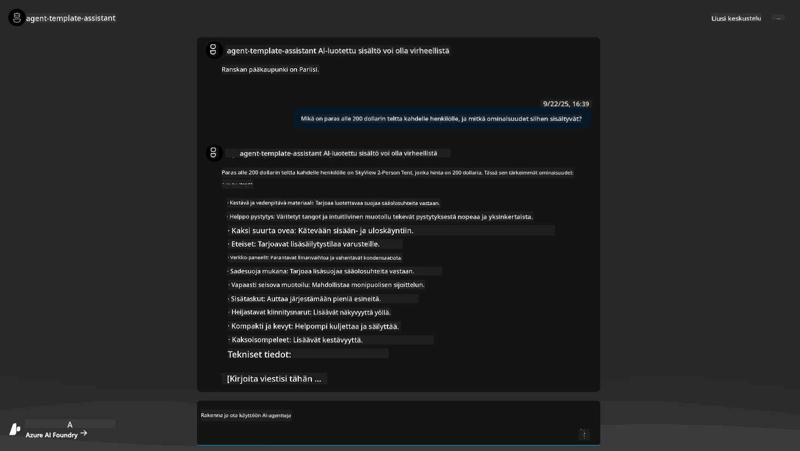
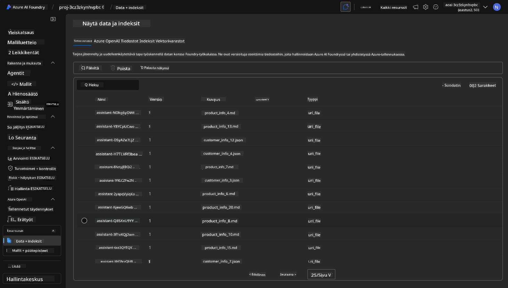
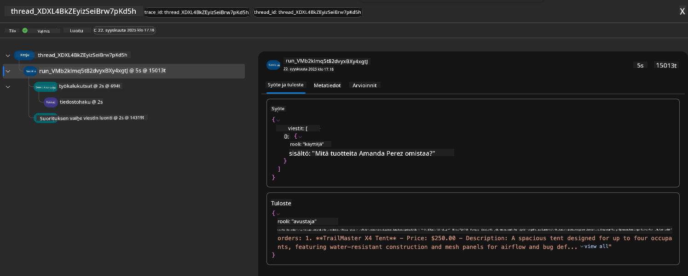
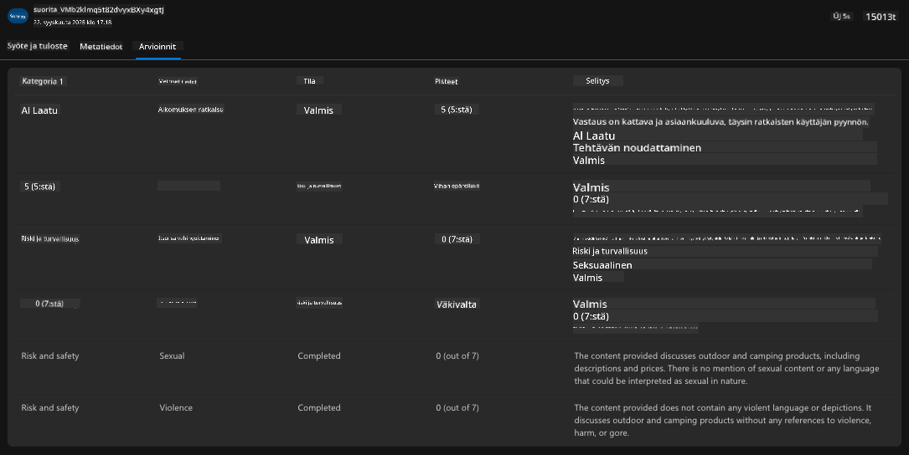
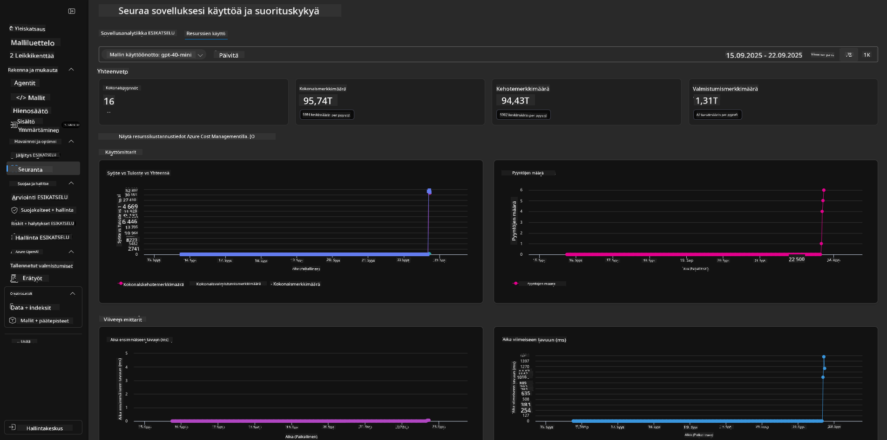

<!--
CO_OP_TRANSLATOR_METADATA:
{
  "original_hash": "7816c6ec50c694c331e7c6092371be4d",
  "translation_date": "2025-09-24T22:49:17+00:00",
  "source_file": "workshop/docs/instructions/2-Validate-AI-Template.md",
  "language_code": "fi"
}
-->
# 2. Mallin validointi

!!! tip "TÄMÄN OSION LOPUSSA OSAAAT"

    - [ ] Analysoida tekoälyratkaisun arkkitehtuuria
    - [ ] Ymmärtää AZD:n käyttöönoton työnkulun
    - [ ] Käyttää GitHub Copilotia AZD:n käytön apuna
    - [ ] **Lab 2:** Tekoälyagenttien mallin käyttöönotto ja validointi

---

## 1. Johdanto

[Azure Developer CLI](https://learn.microsoft.com/en-us/azure/developer/azure-developer-cli/) eli `azd` on avoimen lähdekoodin komentorivityökalu, joka yksinkertaistaa kehittäjän työnkulkua sovellusten rakentamisessa ja käyttöönotossa Azureen.

[AZD-mallit](https://learn.microsoft.com/azure/developer/azure-developer-cli/azd-templates) ovat standardoituja arkistoja, jotka sisältävät esimerkkisovelluskoodia, _infrastruktuurikoodia_ ja `azd`-konfiguraatiotiedostoja yhtenäisen ratkaisun arkkitehtuurin luomiseksi. Infrastruktuurin käyttöönotto on yhtä helppoa kuin `azd provision` -komennon käyttö, kun taas `azd up` mahdollistaa infrastruktuurin käyttöönoton **ja** sovelluksen käyttöönoton yhdellä kertaa!

Tämän ansiosta sovelluskehitysprosessin aloittaminen voi olla yhtä helppoa kuin oikean _AZD-aloitusmallin_ löytäminen, joka vastaa sovelluksesi ja infrastruktuurisi tarpeita, ja arkiston mukauttaminen omiin vaatimuksiisi.

Ennen kuin aloitamme, varmista, että Azure Developer CLI on asennettu.

1. Avaa VS Code -pääte ja kirjoita tämä komento:

      ```bash title="" linenums="0"
      azd version
      ```

1. Näet jotain tällaista!

      ```bash title="" linenums="0"
      azd version 1.19.0 (commit b3d68cea969b2bfbaa7b7fa289424428edb93e97)
      ```

**Olet nyt valmis valitsemaan ja ottamaan mallin käyttöön azd:llä**

---

## 2. Mallin valinta

Azure AI Foundry -alusta sisältää [joukon suositeltuja AZD-malleja](https://learn.microsoft.com/en-us/azure/ai-foundry/how-to/develop/ai-template-get-started), jotka kattavat suosittuja ratkaisuskenaarioita, kuten _moniagenttityönkulun automatisointi_ ja _monimodaalinen sisällön käsittely_. Voit myös tutustua näihin malleihin Azure AI Foundry -portaalissa.

1. Siirry osoitteeseen [https://ai.azure.com/templates](https://ai.azure.com/templates)
1. Kirjaudu Azure AI Foundry -portaaliin, kun sinua pyydetään - näet jotain tällaista.



**Perusvaihtoehdot** ovat aloitusmallejasi:

1. [ ] [Get Started with AI Chat](https://github.com/Azure-Samples/get-started-with-ai-chat), joka ottaa käyttöön yksinkertaisen chat-sovelluksen _omilla tiedoillasi_ Azure Container Appsissa. Käytä tätä tutustuaksesi yksinkertaiseen tekoälychatbot-skenaarioon.
1. [X] [Get Started with AI Agents](https://github.com/Azure-Samples/get-started-with-ai-agents), joka ottaa käyttöön standardin tekoälyagentin (Azure AI Agent Service). Käytä tätä tutustuaksesi agenttipohjaisiin tekoälyratkaisuihin, jotka sisältävät työkaluja ja malleja.

Avaa toinen linkki uudessa selaimen välilehdessä (tai napsauta `Open in GitHub` liittyvää korttia varten). Näet tämän AZD-mallin arkiston. Tutustu README-tiedostoon minuutin ajan. Sovelluksen arkkitehtuuri näyttää tältä:


---

## 3. Mallin aktivointi

Kokeillaan ottaa tämä malli käyttöön ja varmistetaan, että se on toimiva. Seuraamme [Getting Started](https://github.com/Azure-Samples/get-started-with-ai-agents?tab=readme-ov-file#getting-started) -osion ohjeita.

1. Napsauta [tätä linkkiä](https://github.com/codespaces/new/Azure-Samples/get-started-with-ai-agents) - vahvista oletustoiminto `Create codespace`
1. Tämä avaa uuden selaimen välilehden - odota, että GitHub Codespaces -istunto latautuu
1. Avaa VS Code -pääte Codespacesissa - kirjoita seuraava komento:

   ```bash title="" linenums="0"
   azd up
   ```

Suorita työnkulun vaiheet, jotka tämä käynnistää:

1. Sinua pyydetään kirjautumaan Azureen - seuraa ohjeita todentamiseen
1. Anna ympäristöllesi yksilöllinen nimi - esim. käytin `nitya-mshack-azd`
1. Tämä luo `.azure/`-kansion - näet alikansion ympäristön nimellä
1. Sinua pyydetään valitsemaan tilauksen nimi - valitse oletus
1. Sinua pyydetään sijaintia - käytä `East US 2`

Nyt odotat, että käyttöönotto valmistuu. **Tämä kestää 10-15 minuuttia**

1. Kun valmis, konsolissasi näkyy ONNISTUMISVIESTI, kuten tämä:
      ```bash title="" linenums="0"
      SUCCESS: Your up workflow to provision and deploy to Azure completed in 10 minutes 17 seconds.
      ```
1. Azure-portaalissasi on nyt provisionoitu resurssiryhmä kyseisellä ympäristön nimellä:

      

1. **Olet nyt valmis validoimaan käyttöön otetun infrastruktuurin ja sovelluksen**.

---

## 4. Mallin validointi

1. Siirry Azure-portaalin [Resurssiryhmät](https://portal.azure.com/#browse/resourcegroups) -sivulle - kirjaudu sisään, kun sinua pyydetään
1. Napsauta ympäristön nimen RG:tä - näet yllä olevan sivun

      - napsauta Azure Container Apps -resurssia
      - napsauta _Essentials_-osion (oikea yläkulma) Application URL -linkkiä

1. Näet isännöidyn sovelluksen käyttöliittymän, kuten tämä:

   

1. Kokeile kysyä muutama [esimerkkikysymys](https://github.com/Azure-Samples/get-started-with-ai-agents/blob/main/docs/sample_questions.md)

      1. Kysy: ```What is the capital of France?``` 
      1. Kysy: ```What's the best tent under $200 for two people, and what features does it include?```

1. Saat vastauksia, jotka ovat samanlaisia kuin alla. _Mutta miten tämä toimii?_ 

      

---

## 5. Agentin validointi

Azure Container App ottaa käyttöön päätepisteen, joka yhdistyy tekoälyagenttiin, joka on provisionoitu tämän mallin Azure AI Foundry -projektissa. Katsotaanpa, mitä tämä tarkoittaa.

1. Palaa Azure-portaalin _Yleiskatsaus_-sivulle resurssiryhmällesi

1. Napsauta `Azure AI Foundry` -resurssia luettelossa

1. Näet tämän. Napsauta `Go to Azure AI Foundry Portal` -painiketta. 
   

1. Näet Foundry-projektisivun tekoälysovelluksellesi
   

1. Napsauta `Agents` - näet projektisi oletusagentin
   

1. Valitse se - ja näet agentin tiedot. Huomaa seuraavat asiat:

      - Agentti käyttää oletuksena File Search -toimintoa (aina)
      - Agentin `Knowledge` osoittaa, että sillä on 32 tiedostoa ladattuna (tiedostohakuun)
      

1. Etsi vasemman valikon `Data+indexes`-vaihtoehto ja napsauta saadaksesi lisätietoja. 

      - Näet 32 tietotiedostoa ladattuna tiedoksi.
      - Nämä vastaavat 12 asiakastiedostoa ja 20 tuotetiedostoa `src/files`-kansiossa 
      

**Olet validoinut agentin toiminnan!** 

1. Agentin vastaukset perustuvat näiden tiedostojen sisältämään tietoon. 
1. Voit nyt esittää kysymyksiä, jotka liittyvät näihin tietoihin, ja saada perusteltuja vastauksia.
1. Esimerkki: `customer_info_10.json` kuvaa "Amanda Perezin" tekemät 3 ostosta.

Palaa selaimen välilehteen, jossa on Container App -päätepiste, ja kysy: `What products does Amanda Perez own?`. Näet jotain tällaista:


---

## 6. Agenttien leikkikenttä

Rakennetaan hieman enemmän intuitiota Azure AI Foundryn ominaisuuksista ottamalla agentti kokeiluun Agents Playgroundissa. 

1. Palaa Azure AI Foundryn `Agents`-sivulle - valitse oletusagentti
1. Napsauta `Try in Playground` -vaihtoehtoa - saat Playground-käyttöliittymän, kuten tämä
1. Kysy sama kysymys: `What products does Amanda Perez own?`

    

Saat saman (tai samanlaisen) vastauksen - mutta saat myös lisätietoja, joita voit käyttää sovelluksesi laadun, kustannusten ja suorituskyvyn ymmärtämiseen. Esimerkiksi:

1. Huomaa, että vastaus viittaa tiedostotietoihin, joita käytettiin vastauksen "perustamiseen".
1. Vie hiiri minkä tahansa näiden tiedostotunnisteiden päälle - vastaavatko tiedot kyselyäsi ja näytettyä vastausta?

Näet myös _tilastot_-rivillä vastauksen alla. 

1. Vie hiiri minkä tahansa mittarin päälle - esim. Safety. Näet jotain tällaista.
1. Vastaako arvioitu luokitus intuitiotasi vastauksen turvallisuustasosta?

      

---x

## 7. Sisäänrakennettu havainnointi

Havainnointi tarkoittaa sovelluksen instrumentointia tuottamaan dataa, jota voidaan käyttää sen toiminnan ymmärtämiseen, virheiden korjaamiseen ja optimointiin. Saadaksesi käsityksen tästä:

1. Napsauta `View Run Info` -painiketta - näet tämän näkymän. Tämä on esimerkki [Agentin jäljityksestä](https://learn.microsoft.com/en-us/azure/ai-foundry/how-to/develop/trace-agents-sdk#view-trace-results-in-the-azure-ai-foundry-agents-playground) toiminnassa. _Voit myös saada tämän näkymän napsauttamalla Thread Logs -valikkoa._

   - Saat käsityksen agentin suoritusvaiheista ja käytetyistä työkaluista
   - Ymmärrä kokonais Token-määrä (vs. ulostulotokenien käyttö) vastauksessa
   - Ymmärrä viive ja missä aikaa kuluu suorituksessa

      

1. Napsauta `Metadata`-välilehteä nähdäksesi lisäominaisuuksia suoritukselle, jotka voivat tarjota hyödyllistä kontekstia virheiden korjaamiseen myöhemmin.   

      

1. Napsauta `Evaluations`-välilehteä nähdäksesi automaattiset arviot agentin vastauksesta. Näihin kuuluvat turvallisuusarviot (esim. Itsevahingoittaminen) ja agenttikohtaiset arviot (esim. Tarkoituksen ratkaisu, Tehtävän noudattaminen).

      

1. Viimeisenä mutta ei vähäisimpänä, napsauta `Monitoring`-välilehteä sivuvalikossa.

      - Valitse `Resource usage`-välilehti näytetyssä sivussa - ja tarkastele mittareita.
      - Seuraa sovelluksen käyttöä kustannusten (tokenit) ja kuormituksen (pyynnöt) osalta.
      - Seuraa sovelluksen viivettä ensimmäiseen tavuun (syötteen käsittely) ja viimeiseen tavuun (ulostulo).

      

---

## 8. Ympäristömuuttujat

Tähän mennessä olemme käyneet läpi käyttöönoton selaimessa - ja varmistaneet, että infrastruktuuri on provisionoitu ja sovellus toimii. Mutta työskennelläksemme sovelluksen kanssa _koodipohjaisesti_, meidän on konfiguroitava paikallinen kehitysympäristömme tarvittavilla muuttujilla, jotka liittyvät näihin resursseihin. `azd` tekee tämän helpoksi.

1. Azure Developer CLI [käyttää ympäristömuuttujia](https://learn.microsoft.com/en-us/azure/developer/azure-developer-cli/manage-environment-variables?tabs=bash) tallentaakseen ja hallitakseen konfiguraatioasetuksia sovellusten käyttöönottoa varten.

1. Ympäristömuuttujat tallennetaan `.azure/<env-name>/.env` -tiedostoon - tämä rajaa ne käyttöönoton aikana käytettyyn `env-name`-ympäristöön ja auttaa eristämään ympäristöt eri käyttöönottojen välillä samassa arkistossa.

1. Ympäristömuuttujat ladataan automaattisesti `azd`-komennolla aina, kun se suorittaa tietyn komennon (esim. `azd up`). Huomaa, että `azd` ei automaattisesti lue _käyttöjärjestelmätason_ ympäristömuuttujia (esim. asetettu shellissä) - sen sijaan käytä `azd set env` ja `azd get env` siirtääksesi tietoja skriptien sisällä.

Kokeillaan muutamia komentoja:

1. Hae kaikki ympäristömuuttujat, jotka on asetettu `azd`-ympäristössä:

      ```bash title="" linenums="0"
      azd env get-values
      ```
      
      Näet jotain tällaista:

      ```bash title="" linenums="0"
      AZURE_AI_AGENT_DEPLOYMENT_NAME="gpt-4o-mini"
      AZURE_AI_AGENT_NAME="agent-template-assistant"
      AZURE_AI_EMBED_DEPLOYMENT_NAME="text-embedding-3-small"
      AZURE_AI_EMBED_DIMENSIONS=100
      ...
      ```

1. Hae tietty arvo - esim. haluan tietää, onko `AZURE_AI_AGENT_MODEL_NAME`-arvo asetettu

      ```bash title="" linenums="0"
      azd env get-value AZURE_AI_AGENT_MODEL_NAME 
      ```
      
      Näet jotain tällaista - sitä ei asetettu oletuksena!

      ```bash title="" linenums="0"
      ERROR: key 'AZURE_AI_AGENT_MODEL_NAME' not found in the environment values
      ```

1. Aseta uusi ympäristömuuttuja `azd`:lle. Tässä päivitämme agenttimallin nimen. _Huom: kaikki tehdyt muutokset näkyvät välittömästi `.azure/<env-name>/.env`-tiedostossa.

      ```bash title="" linenums="0"
      azd env set AZURE_AI_AGENT_MODEL_NAME gpt-4.1
      azd env set AZURE_AI_AGENT_MODEL_VERSION 2025-04-14
      azd env set AZURE_AI_AGENT_DEPLOYMENT_CAPACITY 150
      ```

      Nyt meidän pitäisi löytää arvo asetettuna:

      ```bash title="" linenums="0"
      azd env get-value AZURE_AI_AGENT_MODEL_NAME 
      ```

1. Huomaa, että jotkut resurssit ovat pysyviä (esim. mallin käyttöönotot) ja vaativat enemmän kuin pelkän `azd up`-komennon pakottaakseen uudelleenkäyttöönoton. Kokeillaan alkuperäisen käyttöönoton purkamista ja uudelleenkäyttöönottoa muutetuilla ympäristömuuttujilla.

1. **Päivitä** Jos olet aiemmin ottanut infrastruktuurin käyttöön azd-mallilla - voit _päivittää_ paikallisten ympäristömuuttujien tilan Azure-käyttöönoton nykytilan perusteella käyttämällä tätä komentoa:
      ```bash title="" linenums="0"
      azd env refresh
      ```

      Tämä on tehokas tapa _synkronoida_ ympäristömuuttujat kahden tai useamman paikallisen kehitysympäristön välillä (esim. tiimi, jossa on useita kehittäjiä) - mahdollistaen, että käyttöönotettu infrastruktuuri toimii ympäristömuuttujien tilan peruslähteenä. Tiimin jäsenet voivat yksinkertaisesti _päivittää_ muuttujat pysyäkseen synkronoituna.

---

## 9. Onnittelut 🏆

Olet juuri suorittanut alusta loppuun kulkevan työnkulun, jossa:

- [X] Valitsit haluamasi AZD-mallin
- [X] Käynnistit mallin GitHub Codespacesissa
- [X] Otit mallin käyttöön ja varmistit sen toimivuuden

---

