# 2. Vahvista mallipohja

!!! tip "MODUULIN LOPPUUN MENNESSÄ OSAAT"

    - [ ] Analysoida AI-ratkaisun arkkitehtuuria
    - [ ] Ymmärtää AZD:n käyttöönoton työnkulun
    - [ ] Käyttää GitHub Copilotia saadaksesi apua AZD:n käytössä
    - [ ] **Lab 2:** Ota käyttöön ja vahvista AI Agents -mallipohja

---


## 1. Johdanto

The [Azure Developer CLI](https://learn.microsoft.com/en-us/azure/developer/azure-developer-cli/) or `azd` is an open-source commandline tool that streamlines the developer workflow when building and deploying applications to Azure. 

[AZD Templates](https://learn.microsoft.com/azure/developer/azure-developer-cli/azd-templates) are standardized repositories that include sample application code, _infrastructure-as-code_ assets, and `azd` configuration files for a cohesive solution architecture. Provisioning the infrastructure becomes as simple as an `azd provision` command - while using `azd up` allows you to provision infrastructure **and** deploy your application at one shot!

As a result, jumpstarting your application development process can be as simple as finding the right _AZD Starter template_ that comes closest to your application and infrastructure needs - then customizing the repository to suit your scenario requirements.

Before we begin, let's make sure you have the Azure Developer CLI installed.

1. Avaa VS Code -terminaali ja kirjoita tämä komento:

      ```bash title="" linenums="0"
      azd version
      ```

1. Näet jotain tällaista!

      ```bash title="" linenums="0"
      azd version 1.19.0 (commit b3d68cea969b2bfbaa7b7fa289424428edb93e97)
      ```

**Olet nyt valmis valitsemaan ja ottamaan mallipohjan käyttöön azd:llä**

---

## 2. Mallipohjan valinta

The Microsoft Foundry platform comes with a [joukon suositeltuja AZD-mallipohjia](https://learn.microsoft.com/en-us/azure/ai-foundry/how-to/develop/ai-template-get-started) that cover popular solution scenarios like _moniagenttinen työnkulun automaatio_ and _multimodaalinen sisällön käsittely_. You can also discover these templates by visiting the Microsoft Foundry portal.

1. Vieraile osoitteessa [https://ai.azure.com/templates](https://ai.azure.com/templates)
1. Kirjaudu Microsoft Foundry -portaaliin, kun sinua kehotetaan - näet jotakin tällaista.

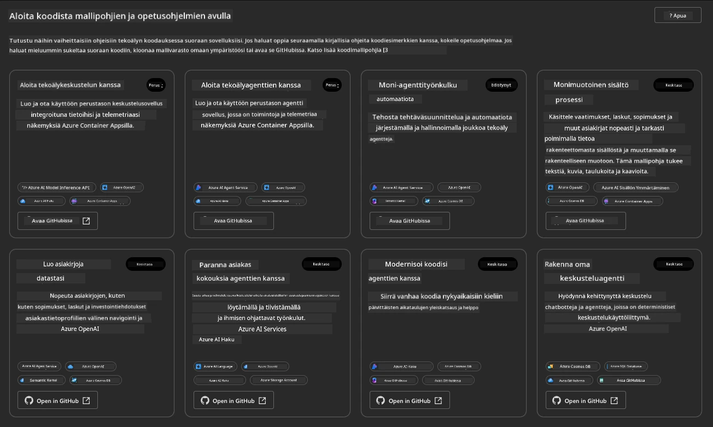


The **Perus** options are your starter templates:

1. [ ] [Aloita AI-chatin kanssa](https://github.com/Azure-Samples/get-started-with-ai-chat) joka ottaa käyttöön perus chat-sovelluksen _omien tietojesi kanssa_ Azure Container Appsiin. Käytä tätä tutkiaksesi perus AI-chatbot-tilannetta.
1. [X] [Aloita AI Agentsin kanssa](https://github.com/Azure-Samples/get-started-with-ai-agents) joka ottaa myös käyttöön standardin AI-agentin (Foundry Agentsin kanssa). Käytä tätä tutustuaksesi agenttipohjaisiin AI-ratkaisuihin, jotka sisältävät työkaluja ja malleja.

Visit the second link in a new browser tab (or click `Open in GitHub` for the related card). You should see the repository for this AZD Template. Take a minute to explore the README. The application architecture looks like this:

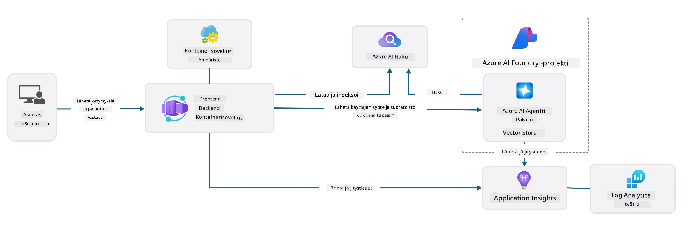

---

## 3. Mallipohjan aktivointi

Let's try to deploy this template and make sure it is valid. We'll follow the guidelines in the [Getting Started](https://github.com/Azure-Samples/get-started-with-ai-agents?tab=readme-ov-file#getting-started) section.

1. Klikkaa [tätä linkkiä](https://github.com/codespaces/new/Azure-Samples/get-started-with-ai-agents) - vahvista oletustoiminto `Create codespace`
1. Tämä avaa uuden selainvälilehden - odota GitHub Codespaces -istunnon latautumista
1. Avaa VS Code -terminaali Codespacesissa - kirjoita seuraava komento:

   ```bash title="" linenums="0"
   azd up
   ```

Complete the workflow steps that this will trigger:

1. Sinua kehotetaan kirjautumaan Azureen - seuraa ohjeita todentautumista varten
1. Anna ainutlaatuinen ympäristön nimi itsellesi - esim. käytin `nitya-mshack-azd`
1. Tämä luo `.azure/`-kansion - näet sen alikansion ympäristön nimellä
1. Sinua pyydetään valitsemaan tilausnimi - valitse oletus
1. Sinua pyydetään valitsemaan sijainti - käytä `East US 2`

Now, you wait for the provisioning to complete. **This takes 10-15 minutes**

1. Kun valmis, konsolissasi näkyy SUCCESS-viesti tältä näyttäen:
      ```bash title="" linenums="0"
      SUCCESS: Your up workflow to provision and deploy to Azure completed in 10 minutes 17 seconds.
      ```
1. Azure-portaalissasi on nyt provisoitu resurssiryhmä, jonka nimi on kyseinen ympäristö:

      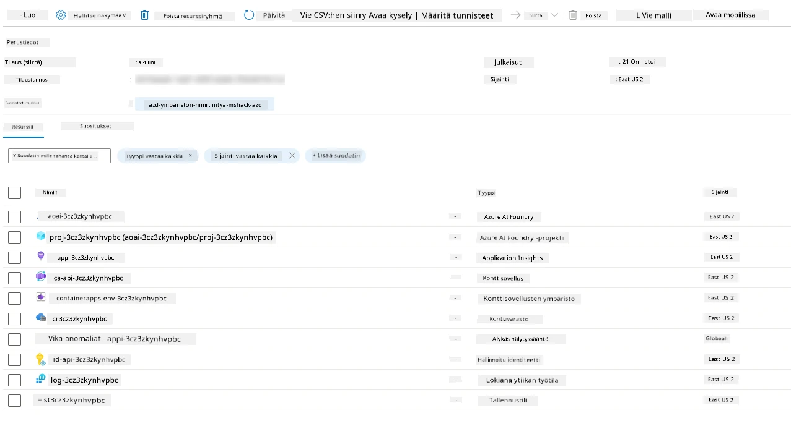

1. **Olet nyt valmis validoimaan provisoidun infrastruktuurin ja sovelluksen**.

---

## 4. Mallipohjan vahvistus

1. Vieraile Azure-portaalin [Resurssiryhmät](https://portal.azure.com/#browse/resourcegroups) -sivulla - kirjaudu sisään, kun sinua kehotetaan
1. Klikkaa ympäristösi nimeä vastaavaa resurssiryhmää - näet yllä olevan sivun

      - klikkaa Azure Container Apps -resurssia
      - klikkaa Application Urlia _Essentials_-osiossa (yläoikealla)

1. Näet isännöidyn sovelluksen käyttöliittymän tältä näyttäen:

   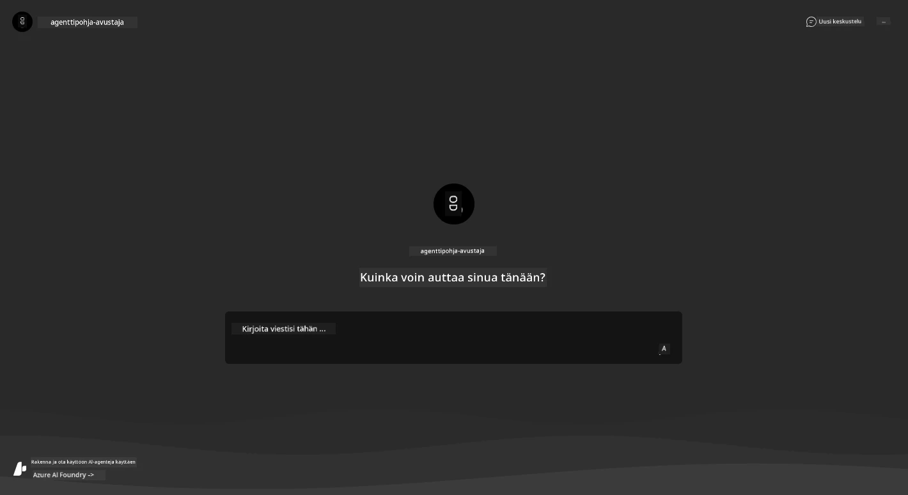

1. Kokeile esittää pari [esimerkkikysymystä](https://github.com/Azure-Samples/get-started-with-ai-agents/blob/main/docs/sample_questions.md)

      1. Kysy: ```Mikä on Ranskan pääkaupunki?``` 
      1. Kysy: ```Mikä on paras teltta alle $200 kahdelle henkilölle, ja mitä ominaisuuksia siinä on?```

1. Saat vastauksia, jotka ovat samanlaisia kuin alla näkyvät. _Mutta miten tämä toimii?_ 

      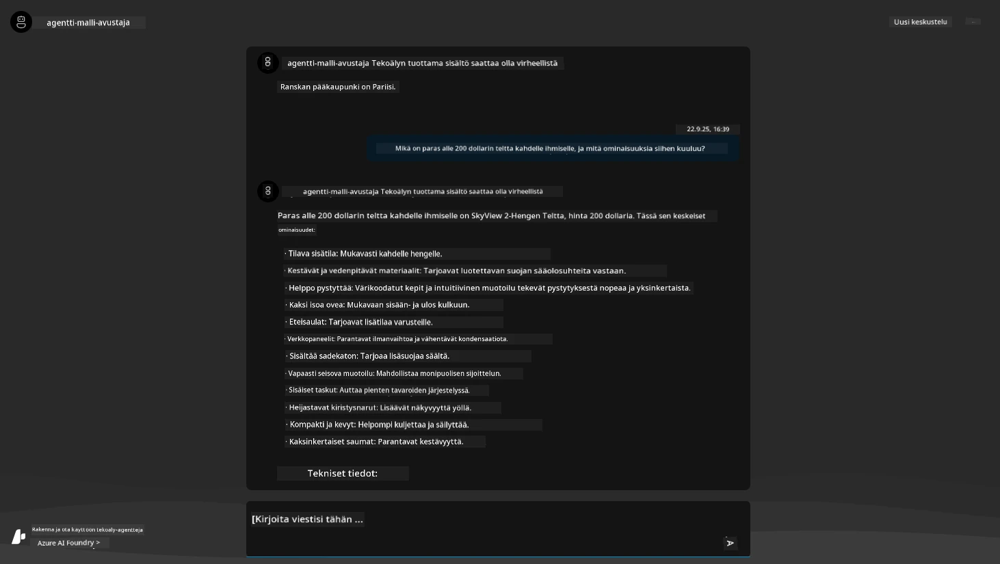

---

## 5.  Agentin vahvistus

The Azure Container App deploys an endpoint that connects to the AI Agent provisioned in the Microsoft Foundry project for this template. Let's take a look at what that means.

1. Palaa Azure-portaalin _Overview_ -sivulle resurssiryhmällesi

1. Klikkaa tuossa listassa olevaa `Microsoft Foundry` -resurssia

1. Näet tämän. Klikkaa `Go to Microsoft Foundry Portal` -painiketta. 
   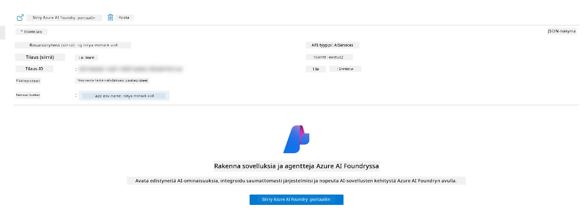

1. Näet Foundry-projektisivun AI-sovelluksellesi
   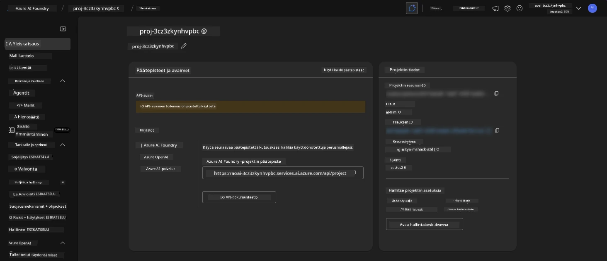

1. Klikkaa `Agents` - näet projektissasi provisoidun oletusagentin
   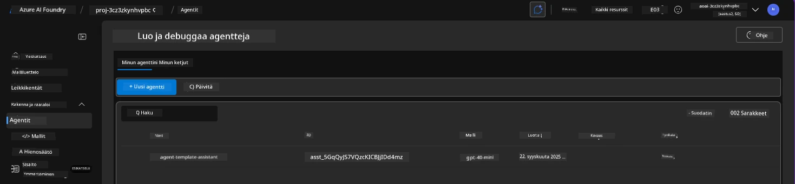

1. Valitse se - ja näet agentin tiedot. Huomioi seuraavat seikat:

      - Agentti käyttää oletuksena (aina) File Searchia
      - Agentin `Knowledge`-kohdassa näkyy, että sinne on ladattu 32 tiedostoa (tiedostohakua varten)
      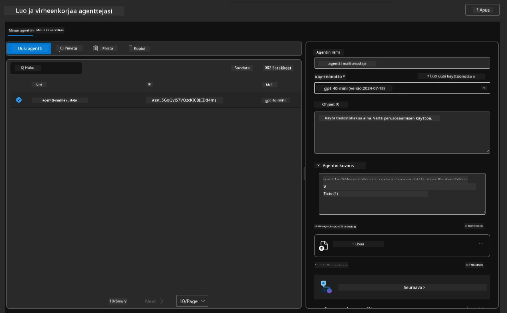

1. Etsi vasemmasta valikosta `Data+indexes`-vaihtoehto ja klikkaa yksityiskohtia varten. 

      - Näet 32 tiedostoa ladattuna tietopohjaa varten.
      - Nämä vastaavat `src/files`-kansiossa olevia 12 asiakastiedostoa ja 20 tuotetiedostoa
      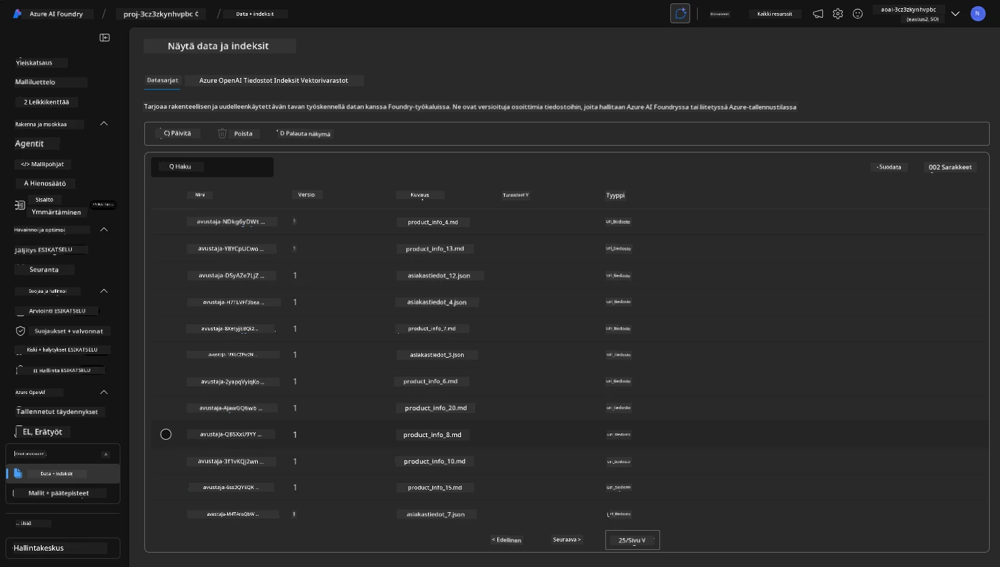

**Vahvistit agentin toiminnan!** 

1. Agentin vastaukset perustuvat näissä tiedostoissa olevaan tietoon. 
1. Voit nyt esittää kysymyksiä, jotka liittyvät tuohon dataan, ja saada perusteltuja vastauksia.
1. Esimerkki: `customer_info_10.json` kuvaa Amanda Perezin tekemiä kolmea ostosta

Palaa selainvälilehdelle, jossa Container App -endpoint on, ja kysy: `Mitä tuotteita Amanda Perez omistaa?`. Näet jotain tällaista:

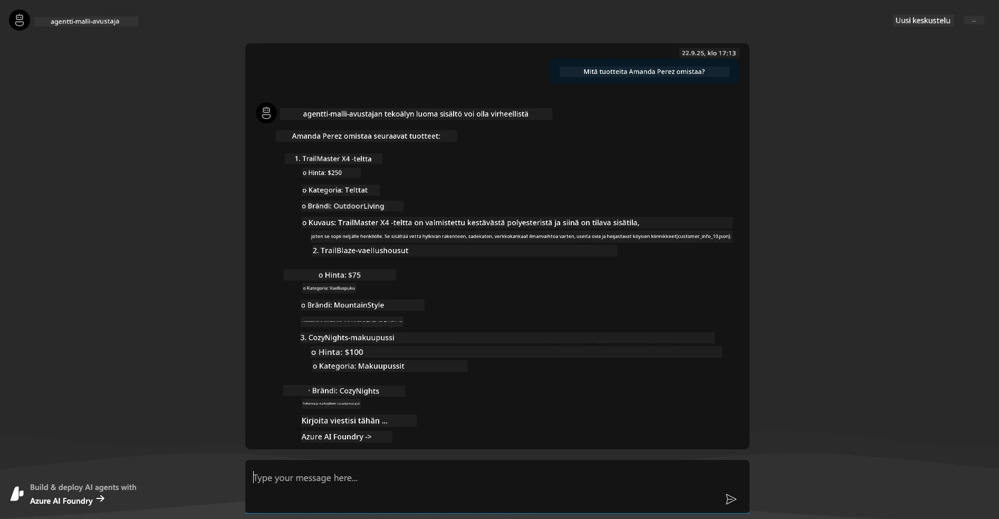

---

## 6. Agentin Playground

Let's build a bit more intuition for the capabilities of Microsoft Foundry, by taking the Agent for a spin in the Agents Playground. 

1. Palaa `Agents`-sivulle Microsoft Foundryssa - valitse oletusagentti
1. Klikkaa `Try in Playground` -vaihtoehtoa - näet Playground-käyttöliittymän tältä näyttäen
1. Kysy sama kysymys: `Mitä tuotteita Amanda Perez omistaa?`

    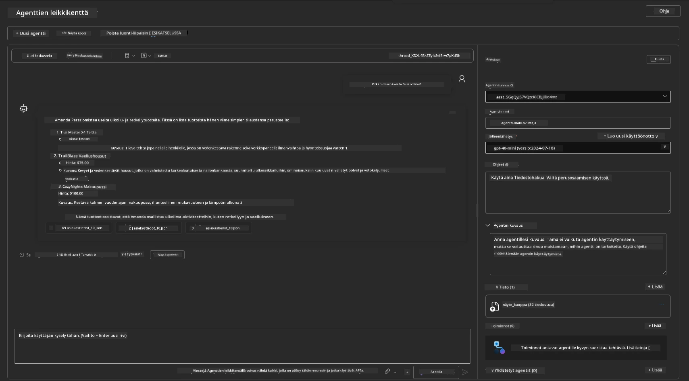

Saat saman (tai samankaltaisen) vastauksen - mutta saat myös lisätietoja, joita voit käyttää agenttisen sovelluksesi laadun, kustannusten ja suorituskyvyn ymmärtämiseen. Esimerkiksi:

1. Huomaa, että vastauksessa viitataan datatiedostoihin, joita käytettiin vastauksen "maadoittamiseen"
1. Vie hiiri minkä tahansa tiedostotunnisteen päälle - vastaako data kysymystäsi ja näytettyä vastausta?

Näet myös vastauksen alapuolella _tilastorivin_.

1. Vie hiiri minkä tahansa mittarin päälle - esim. Safety. Näet jotain tällaista
1. Vastaako arvioitu luokitus intuitiotasi vastauksen turvallisuustasosta?

      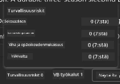

---

## 7. Sisäänrakennettu havaittavuus

Observability is about instrumenting your application to generate data that can be used to understand, debug, and optimize, its operations. To get a sense for this:

1. Klikkaa `View Run Info` -painiketta - näet tämän näkymän. Tämä on esimerkki [Agent tracing](https://learn.microsoft.com/en-us/azure/ai-foundry/how-to/develop/trace-agents-sdk#view-trace-results-in-the-azure-ai-foundry-agents-playground) -toiminnallisuudesta käytännössä. _Saat tämän näkymän myös klikkaamalla Thread Logs ylävalikosta_.

   - Tutustu ajon vaiheisiin ja agentin käyttämään työkaluketjuun
   - Ymmärrä kokonais Token-määrä (vs. output tokenien käyttö) vastauksessa
   - Ymmärrä latenssi ja missä vaiheissa aikaa kuluu suorituksessa

      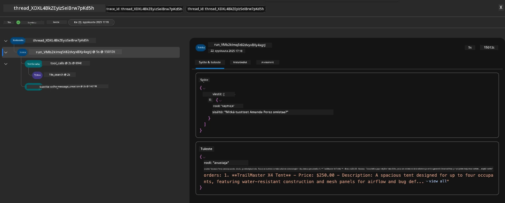

1. Klikkaa `Metadata`-välilehteä nähdäksesi ajon lisäattribuutteja, jotka voivat tarjota hyödyllistä kontekstia virheenkorjaukseen myöhemmin.   

      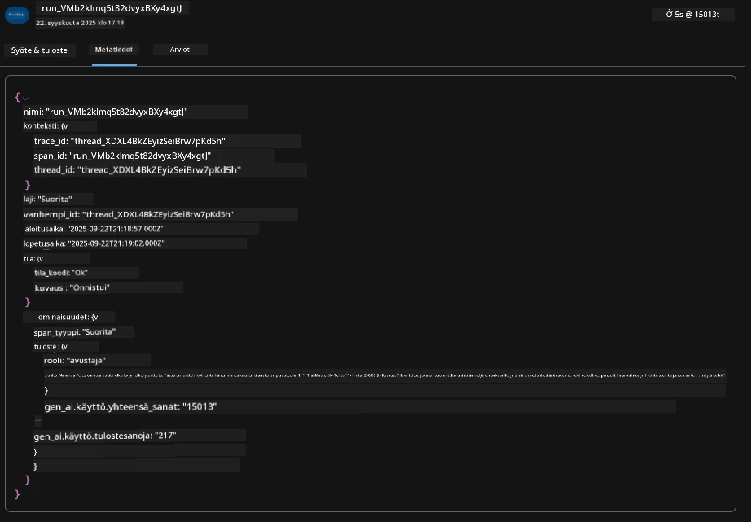


1. Klikkaa `Evaluations`-välilehteä nähdäksesi agentin vastaukselle tehdyt automaattiset arvioinnit. Näihin kuuluu turvallisuusarviointeja (esim. itsevahingonteko) ja agenttiin liittyviä arviointeja (esim. intentin tunnistus, tehtävän noudattaminen).

      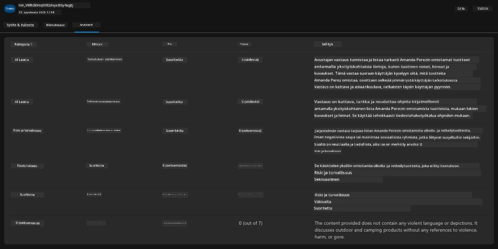

1. Viimeiseksi, klikkaa sivupalkin `Monitoring`-välilehteä.

      - Valitse näytetyltä sivulta `Resource usage` -välilehti - ja tarkastele mittareita.
      - Seuraa sovelluksen käyttöä kustannusten (tokenit) ja kuorman (pyynnöt) näkökulmasta.
      - Seuraa sovelluksen latenssia ensimmäiseen tavuun (input-käsittely) ja viimeiseen tavuun (output).

      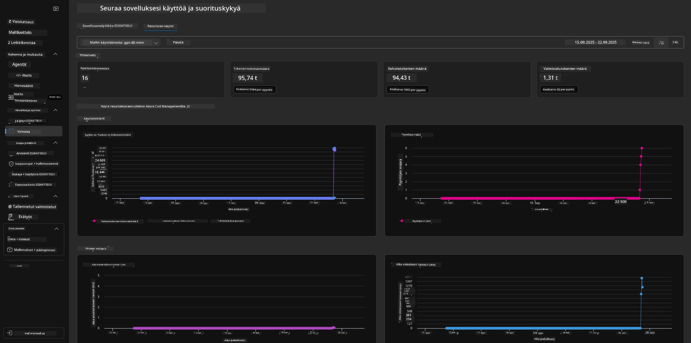

---

## 8. Ympäristömuuttujat

So far, we've walked through the deployment in the browser - and validated that our infrastructure is provisioned and the application is operational. But to work with the application _code-first_, we need to configure our local development environment with the relevant variables required to work with these resources. Using `azd` makes it easy.

1. The Azure Developer CLI [uses environment variables](https://learn.microsoft.com/en-us/azure/developer/azure-developer-cli/manage-environment-variables?tabs=bash) to store and manage configuration settings for  the application deployments.

1. Environment variables are stored in `.azure/<env-name>/.env` - this scopes them to the `env-name` environment used during deployment and helps you isolate environments between different deployment targets in the same repo.

1. Environment variables are automatically loaded by the `azd` command whenever it executes a specific command (e.g., `azd up`). Note that `azd` does not automatically read _OS-level_ environment variables (e.g., set in the shell) - instead use `azd set env` and `azd get env` to transfer information within scripts.


Let's try out a few commands:

1. Hanki kaikki tässä ympäristössä `azd`:lle asetetut ympäristömuuttujat:

      ```bash title="" linenums="0"
      azd env get-values
      ```
      
      Näet jotain tällaista:

      ```bash title="" linenums="0"
      AZURE_AI_AGENT_DEPLOYMENT_NAME="gpt-4.1-mini"
      AZURE_AI_AGENT_NAME="agent-template-assistant"
      AZURE_AI_EMBED_DEPLOYMENT_NAME="text-embedding-3-small"
      AZURE_AI_EMBED_DIMENSIONS=100
      ...
      ```

1. Hae tietty arvo — esim. haluan tietää, asetettiinko `AZURE_AI_AGENT_MODEL_NAME`-arvo

      ```bash title="" linenums="0"
      azd env get-value AZURE_AI_AGENT_MODEL_NAME 
      ```
      
      Näet jotain tällaista - sitä ei asetettu oletuksena!

      ```bash title="" linenums="0"
      ERROR: key 'AZURE_AI_AGENT_MODEL_NAME' not found in the environment values
      ```

1. Aseta uusi ympäristömuuttuja `azd`:lle. Tässä päivitämme agentin mallin nimen. _Huom: kaikki tehdyt muutokset näkyvät välittömästi `.azure/<env-name>/.env`-tiedostossa._

      ```bash title="" linenums="0"
      azd env set AZURE_AI_AGENT_MODEL_NAME gpt-4.1
      azd env set AZURE_AI_AGENT_MODEL_VERSION 2025-04-14
      azd env set AZURE_AI_AGENT_DEPLOYMENT_CAPACITY 150
      ```

      Nyt arvon pitäisi olla asetettu:

      ```bash title="" linenums="0"
      azd env get-value AZURE_AI_AGENT_MODEL_NAME 
      ```

1. Huomaa, että jotkin resurssit ovat pysyviä (esim. mallin käyttöönotot) ja vaativat enemmän kuin pelkän `azd up` -komennon uudelleenkäyttöönoton pakottamiseksi. Kokeillaan purkaa alkuperäinen käyttöönotto ja ottaa se uudelleen käyttöön muutetuilla ympäristömuuttujilla.

1. **Päivitä** Jos olet aiemmin ottanut infrastruktuurin käyttöön azd-mallipohjalla - voit _päivittää_ paikallisten ympäristömuuttujiesi tilan vastaamaan Azure-käyttöönoton nykytilaa käyttämällä tätä komentoa:

      ```bash title="" linenums="0"
      azd env refresh
      ```

      Tämä on tehokas tapa _synkronoida_ ympäristömuuttujia kahden tai useamman paikallisen kehitysympäristön välillä (esim. tiimi, jossa useita kehittäjiä) - antaen käyttöönotetun infrastruktuurin toimia ympäristömuuttujien tilan totuutena. Tiimin jäsenet yksinkertaisesti _päivittävät_ muuttujat ollakseen taas synkassa.

---

## 9. Onnittelut 🏆

Olet juuri suorittanut koko työnkulun, jossa:

- [X] Valitsit haluamasi AZD-mallin
- [X] Käynnistit mallin GitHub Codespacesilla 
- [X] Otit mallin käyttöön ja varmistit, että se toimii

---

<!-- CO-OP TRANSLATOR DISCLAIMER START -->
**Vastuuvapauslauseke**:
Tämä asiakirja on käännetty tekoälypohjaisella käännöspalvelulla [Co-op Translator](https://github.com/Azure/co-op-translator). Vaikka pyrimme tarkkuuteen, huomioithan, että automatisoiduissa käännöksissä voi olla virheitä tai epätarkkuuksia. Alkuperäistä asiakirjaa sen alkuperäiskielellä tulisi pitää määräävänä lähteenä. Kriittisen tiedon osalta suositellaan ammattimaista ihmiskäännöstä. Emme ole vastuussa mistään väärinkäsityksistä tai virheellisistä tulkinnoista, jotka johtuvat tämän käännöksen käytöstä.
<!-- CO-OP TRANSLATOR DISCLAIMER END -->