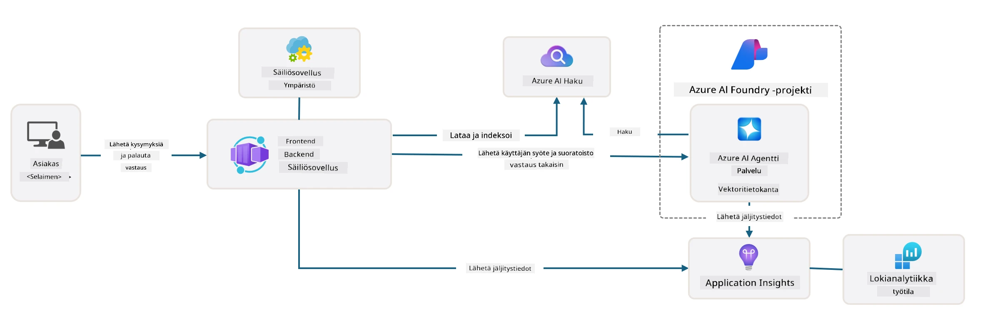

# 3. Pura mallipohja

!!! tip "TÄMÄN MODUULIN LOPPUUN MENNESSÄ OSAAT"

    - [ ] Ota GitHub Copilot käyttöön MCP-palvelimilla Azure-apua varten
    - [ ] Ymmärtää AZD-mallin kansiorakenne ja komponentit
    - [ ] Tutkia Infrastructure-as-Code (Bicep) -järjestelymalleja
    - [ ] **Lab 3:** Käytä GitHub Copilotia tutkiaksesi ja ymmärtääksesi repositorion arkkitehtuuria 

---


With AZD templates and the Azure Developer CLI (`azd`) we can quickly jumpstart our AI development journey with standardized repositories that provide sample code, infrastructure and configuration files - in the form of a ready-to-deploy _aloitusprojekti_.

**Mutta nyt meidän täytyy ymmärtää projektin rakenne ja koodikanta - ja pystyä muokkaamaan AZD-mallia - ilman aiempaa kokemusta tai ymmärrystä AZD:stä!**

---

## 1. Ota GitHub Copilot käyttöön

### 1.1 Asenna GitHub Copilot Chat

On aika tutustua [GitHub Copilot with Agent Mode](https://code.visualstudio.com/docs/copilot/chat/chat-agent-mode). Nyt voimme käyttää luonnollista kieltä kuvaillaksemme tehtävämme korkealla tasolla ja saada apua sen suorittamiseen. Tätä labraa varten käytämme [Copilot Free plan](https://github.com/github-copilot/signup) -suunnitelmaa, jolla on kuukausittainen rajoitus täydennyksille ja chat-keskusteluille.

Laajennus voidaan asentaa marketplace:sta, mutta sen pitäisi olla jo käytettävissä Codespaces-ympäristössäsi. _Klikkaa Copilot-kuvakkeen avattavasta valikosta `Open Chat` - ja kirjoita kehotteeksi esim. `What can you do?`_ - sinulta saatetaan pyytää kirjautumista. **GitHub Copilot Chat on valmis**.

### 1.2. Asenna MCP-palvelimet

Jotta Agent-tila olisi tehokas, sen täytyy saada käyttöön oikeat työkalut tiedonhankintaan tai toimien suorittamiseen. Tässä MCP-palvelimet voivat auttaa. Määritämme seuraavat palvelimet:

1. [Azure MCP Server](../../../../../workshop/docs/instructions)
1. [Microsoft Docs MCP Server](../../../../../workshop/docs/instructions)

Aktivoidaksesi nämä:

1. Luo tiedosto nimeltä `.vscode/mcp.json` jos sitä ei ole
1. Kopioi seuraava tiedostoon - ja käynnistä palvelimet!
   ```json title=".vscode/mcp.json"
   {
      "servers": {
         "Azure MCP Server": {
            "command": "npx",
            "args": [
            "-y",
            "@azure/mcp@latest",
            "server",
            "start"
            ]
         },
         "microsoft.docs.mcp": {
            "type": "http",
            "url": "https://learn.microsoft.com/api/mcp"
         }
      }
   }
   ```

??? warning "Saatat saada virheilmoituksen, että `npx` ei ole asennettu (laajentaaksesi korjauksen napsauta)"

      Korjataksesi tämän avaa `.devcontainer/devcontainer.json` -tiedosto ja lisää tämä rivi features-osioon. Rakenna sitten säiliö uudelleen. Sinulla pitäisi nyt olla `npx` asennettuna.

      ```title="" linenums="0"
         "features": {
            "ghcr.io/devcontainers/features/node:1": {},
            ...
         },
      ```

---

### 1.3. Testaa GitHub Copilot Chat

**Käytä ensin `az login` todentaaksesi Azuren VS Code -komentoriviltä.**

Sinun pitäisi nyt pystyä kysymään Azure-tilisi tilasta ja esittämään kysymyksiä käyttöön otetuista resursseista tai konfiguraatiosta. Kokeile näitä kehotteita:

1. `List my Azure resource groups`
1. `#foundry list my current deployments`

Voit myös kysyä Azure-dokumentaatiosta ja saada vastauksia, jotka perustuvat Microsoft Docs MCP -palvelimeen. Kokeile näitä kehotteita:

1. `#microsoft_docs_search What is Azure Developer CLI?`
1. `#microsoft_docs_search Show me a Python tutorial to chat with deployed model`

Tai voit pyytää koodikatkelmia tehtävän suorittamiseksi. Kokeile tätä kehotetta.

1. `Give me a Python code example that uses AAD for an interactive chat client`

`Ask`-tilassa tämä antaa koodia, jonka voit kopioida ja kokeilla. `Agent`-tilassa se voi mennä askeleen pidemmälle ja luoda tarvittavat resurssit puolestasi - mukaan lukien asennusskriptit ja dokumentaation - auttaakseen tehtävän suorittamisessa.

**Olet nyt varustautunut aloittamaan mallivaraston tutkimisen**

---

## 2. Pura arkkitehtuuri

??? prompt "KYSY: Selitä sovelluksen arkkitehtuuri tiedostossa docs/images/architecture.png yhdellä kappaleella"

      Tämä sovellus on Azureen rakennettu tekoälyllä tehostettu chat-sovellus, joka demonstroi modernia agenttipohjaista arkkitehtuuria. Ratkaisu keskittyy Azure Container Appiin, joka isännöi pääsovelluskoodia, käsittelee käyttäjän syötettä ja tuottaa älykkäitä vastauksia AI-agentin kautta. 
      
      Arkkitehtuuri hyödyntää Microsoft Foundry Projectia AI-ominaisuuksien perustana, yhdistäen Azure AI Services -palveluihin, jotka tarjoavat taustalla olevat kielimallit (esimerkiksi gpt-4.1-mini) ja agenttitoiminnallisuuden. Käyttäjävuorovaikutukset virtaavat React-pohjaisen frontendin kautta FastAPI-backendiin, joka kommunikoi AI-agenttipalvelun kanssa kontekstuaalisten vastausten tuottamiseksi. 
      
      Järjestelmä sisältää tiedonhakuominaisuuksia joko tiedostohakuominaisuuden tai Azure AI Search -palvelun kautta, jolloin agentti voi käyttää ja viitata ladattuihin dokumentteihin. Operatiivisen erinomaisuuden takaamiseksi arkkitehtuuri sisältää kattavan valvonnan Application Insightsin ja Log Analytics Workspacen kautta jäljitykselle, lokitukselle ja suorituskyvyn optimoinnille. 
      
      Azure Storage tarjoaa blob-tallennustilan sovelluksen tiedoille ja tiedostojen latauksille, kun taas Managed Identity varmistaa suojatun pääsyn Azure-resurssien välillä ilman salasanojen tallentamista. Koko ratkaisu on suunniteltu skaalautuvaksi ja ylläpidettäväksi: säilöity sovellus skaalaa automaattisesti kysynnän mukaan ja tarjoaa sisäänrakennetun turvallisuuden, valvonnan ja CI/CD-ominaisuudet Azuren hallinnoidun palveluekosysteemin kautta.



---

## 3. Repositorion rakenne

!!! prompt "KYSY: Selitä mallin kansiorakenne. Aloita visuaalisella hierarkkisella kaaviolla."

??? info "VASTAUS: Visuaalinen hierarkkinen kaavio"

      ```bash title="" 
      get-started-with-ai-agents/
      ├── 📋 Konfigurointi ja käyttöönotto
      │   ├── azure.yaml                    # Azure Developer CLI -määritys
      │   ├── docker-compose.yaml           # Paikalliset kehityskontit
      │   ├── pyproject.toml                # Python-projektin määritys
      │   ├── requirements-dev.txt          # Kehityksen riippuvuudet
      │   └── .devcontainer/                # VS Code devcontainer-asetukset
      │
      ├── 🏗️ Infrastruktuuri (infra/)
      │   ├── main.bicep                    # Pääinfrastruktuurin malli
      │   ├── api.bicep                     # API:iin liittyvät resurssit
      │   ├── main.parameters.json          # Infrastruktuurin parametrit
      │   └── core/                         # Modulaariset infrastruktuurikomponentit
      │       ├── ai/                       # AI-palveluiden asetukset
      │       ├── host/                     # Isännöintiin liittyvä infrastruktuuri
      │       ├── monitor/                  # Valvonta ja lokitus
      │       ├── search/                   # Azure AI Search -asetukset
      │       ├── security/                 # Turvallisuus ja identiteetti
      │       └── storage/                  # Tallennustilin asetukset
      │
      ├── 💻 Sovelluslähdekoodi (src/)
      │   ├── api/                          # Backend-API
      │   │   ├── main.py                   # FastAPI-sovelluksen aloituspiste
      │   │   ├── routes.py                 # API-reittien määrittelyt
      │   │   ├── search_index_manager.py   # Hakutoiminnallisuus
      │   │   ├── data/                     # API:n datankäsittely
      │   │   ├── static/                   # Staattiset verkkoresurssit
      │   │   └── templates/                # HTML-mallit
      │   ├── frontend/                     # React/TypeScript -frontend
      │   │   ├── package.json              # Node.js-riippuvuudet
      │   │   ├── vite.config.ts            # Vite-käännösasetukset
      │   │   └── src/                      # Frontend-lähdekoodi
      │   ├── data/                         # Esimerkkidatatiedostot
      │   │   └── embeddings.csv            # Ennaltalasketut upotukset
      │   ├── files/                        # Tietopohjan tiedostot
      │   │   ├── customer_info_*.json      # Asiakastiedon näytteet
      │   │   └── product_info_*.md         # Tuotedokumentaatio
      │   ├── Dockerfile                    # Säiliökonfiguraatio
      │   └── requirements.txt              # Python-riippuvuudet
      │
      ├── 🔧 Automaatio ja skriptit (scripts/)
      │   ├── postdeploy.sh/.ps1           # Julkaisun jälkeinen määritys
      │   ├── setup_credential.sh/.ps1     # Tunnistetietojen määritys
      │   ├── validate_env_vars.sh/.ps1    # Ympäristömuuttujien validointi
      │   └── resolve_model_quota.sh/.ps1  # Mallikiintiöiden hallinta
      │
      ├── 🧪 Testaus ja arviointi
      │   ├── tests/                        # Yksikkö- ja integraatiotestit
      │   │   └── test_search_index_manager.py
      │   ├── evals/                        # Agentin arviointikehys
      │   │   ├── evaluate.py               # Arvioinnin suorittaja
      │   │   ├── eval-queries.json         # Testikyselyt
      │   │   └── eval-action-data-path.json
      │   ├── sandbox/                      # Kehitysalusta
      │   │   ├── 1-quickstart.py           # Aloittamisen esimerkit
      │   │   └── aad-interactive-chat.py   # Autentikointi-esimerkit
      │   └── airedteaming/                 # AI:n turvallisuusarviointi
      │       └── ai_redteaming.py          # Red team -testaus
      │
      ├── 📚 Dokumentaatio (docs/)
      │   ├── deployment.md                 # Julkaisun opas
      │   ├── local_development.md          # Paikallisen kehitysympäristön ohjeet
      │   ├── troubleshooting.md            # Yleiset ongelmat ja korjaukset
      │   ├── azure_account_setup.md        # Azure-tilin vaatimukset
      │   └── images/                       # Dokumentaation resurssit
      │
      └── 📄 Projektin metatiedot
         ├── README.md                     # Projektin yleiskatsaus
         ├── CODE_OF_CONDUCT.md           # Yhteisön pelisäännöt
         ├── CONTRIBUTING.md              # Ohjeet osallistumiseen
         ├── LICENSE                      # Lisenssiehdot
         └── next-steps.md                # Julkaisun jälkeinen opastus
      ```

### 3.1. Ydin sovellusarkkitehtuuri

Tämä malli noudattaa **full-stack web -sovellus** -mallia, jossa on:

- **Backend**: Python FastAPI Azure AI -integraatiolla
- **Frontend**: TypeScript/React Vite-rakennusjärjestelmällä
- **Infrastruktuuri**: Azure Bicep -mallit pilvipalveluresursseille
- **Säilöinti**: Docker yhdenmukaista käyttöönottoa varten

### 3.2 Infra-as-Code (Bicep)

Infrastruktuurikerros käyttää **Azure Bicep** -malleja, jotka on järjestetty modulaarisesti:

   - **`main.bicep`**: Orkestroi kaikki Azure-resurssit
   - **`core/` modules**: Uudelleenkäytettäviä komponentteja eri palveluille
      - AI-palvelut (Microsoft Foundry Models, AI Search)
      - Säilöisännöinti (Azure Container Apps)
      - Valvonta (Application Insights, Log Analytics)
      - Turvallisuus (Key Vault, Managed Identity)

### 3.3 Sovelluslähdekoodi (`src/`)

**Backend-API (`src/api/`)**:

- FastAPI-pohjainen REST-API
- Foundry Agents -integraatio
- Hakemistoindeksin hallinta tiedonhakuun
- Tiedostojen lataus- ja käsittelyominaisuudet

**Frontend (`src/frontend/`)**:

- Moderni React/TypeScript SPA
- Vite nopeaan kehitykseen ja optimoituihin rakennuksiin
- Chat-käyttöliittymä agenttien vuorovaikutukselle

**Tietopohja (`src/files/`)**:

- Esimerkkiasiakas- ja tuotetiedot
- Demonstroi tiedostopohjaista tiedonhakua
- JSON- ja Markdown-esimerkit


### 3.4 DevOps ja automaatio

**Skriptit (`scripts/`)**:

- Monialustaiset PowerShell- ja Bash-skriptit
- Ympäristön validointi ja asetukset
- Julkaisun jälkeinen konfigurointi
- Mallikiintiöiden hallinta

**Azure Developer CLI -integraatio**:

- `azure.yaml` -määritys `azd`-työnkuluissa
- Automaattinen provisiointi ja käyttöönotto
- Ympäristömuuttujien hallinta

### 3.5 Testaus ja laadunvarmistus

**Arviointikehys (`evals/`)**:

- Agentin suorituskyvyn arviointi
- Kysely-vastaus -laadun testaus
- Automaattinen arviointiputki

**AI-turvallisuus (`airedteaming/`)**:

- Red team -testaus AI-turvallisuuden varmistamiseksi
- Turvallisuusaukkojen skannaus
- Vastuulliset AI-käytännöt

---

## 4. Onnittelut 🏆

Käytit onnistuneesti GitHub Copilot Chatia MCP-palvelimien kanssa tutkiaksesi repositoriota.

- [X] Aktivoit GitHub Copilotin Azurea varten
- [X] Ymmärsit sovellusarkkitehtuurin
- [X] Tutkit AZD-mallin rakennetta

Tämä antaa sinulle käsityksen tämän mallin _infrastruktuuri-koodina_ -resursseista. Seuraavaksi tarkastelemme AZD:n konfiguraatiotiedostoa.

---

<!-- CO-OP TRANSLATOR DISCLAIMER START -->
**Vastuuvapauslauseke**:
Tämä asiakirja on käännetty käyttämällä tekoälypohjaista käännöspalvelua [Co-op Translator](https://github.com/Azure/co-op-translator). Vaikka pyrimme tarkkuuteen, huomioithan, että automaattiset käännökset voivat sisältää virheitä tai epätarkkuuksia. Alkuperäistä asiakirjaa sen alkuperäisellä kielellä tulee pitää virallisena lähteenä. Kriittisten tietojen osalta suositellaan ammattimaista ihmiskäännöstä. Emme ole vastuussa tästä käännöksestä johtuvista väärinymmärryksistä tai virheellisistä tulkinnoista.
<!-- CO-OP TRANSLATOR DISCLAIMER END -->