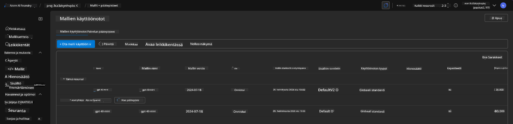
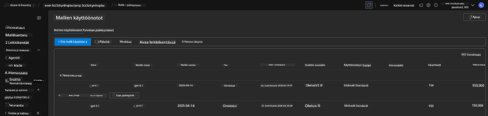

<!--
CO_OP_TRANSLATOR_METADATA:
{
  "original_hash": "6539a34c770f3ceff282370d72ee74dc",
  "translation_date": "2025-09-24T22:45:34+00:00",
  "source_file": "workshop/docs/instructions/6-Teardown-Infrastructure.md",
  "language_code": "fi"
}
-->
# 6. Purkaa infrastruktuuri

!!! tip "TÄMÄN OSION LOPUSSA OSAAAT"

    - [ ] Kohde
    - [ ] Kohde
    - [ ] Kohde

---

## Bonusharjoitukset

Ennen kuin puramme projektin, käytä muutama minuutti avoimeen tutkimiseen.

!!! danger "NITYA-TODO: Laadi joitakin ehdotuksia kokeiltavaksi"

---

## Infrastruktuurin purkaminen

1. Infrastruktuurin purkaminen on yhtä helppoa kuin:

      ```bash title="" linenums="0"
      azd down --purge
      ```
1. `--purge`-lippu varmistaa, että myös pehmeästi poistetut Cognitive Service -resurssit poistetaan, jolloin näiden resurssien varaama kiintiö vapautuu. Kun prosessi on valmis, näet jotain tällaista:

      ```bash title="" linenums="0"
      ? Total resources to delete: 11, are you sure you want to continue? Yes
      Deleting your resources can take some time.
      (✓) Done: Deleted resource group rg-nitya-mshack-azd
      (✓) Done: Purging Cognitive Account: aoai-3cz3zkynhvpbc

      SUCCESS: Your application was removed from Azure in 11 minutes 4 seconds.
      ```

1. (Valinnainen) Jos nyt suoritat `azd up` uudelleen, huomaat, että gpt-4.1-malli otetaan käyttöön, koska ympäristömuuttuja on muutettu (ja tallennettu) paikalliseen `.azure`-kansioon.

      Tässä ovat mallin käyttöönotot **ennen**:

      

      Ja tässä ne ovat **jälkeen**:
      

---

