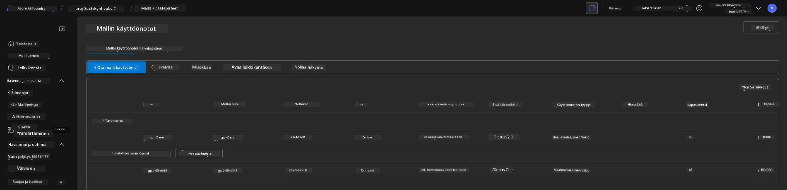
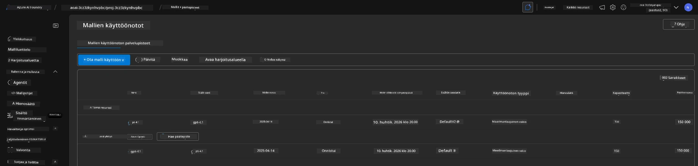

# 6. Infrastruktuurin purku

!!! tip "TÄMÄN MODUULIN LOPUSSA OSAAT"

    - [ ] Ymmärtää resurssien siivouksen ja kustannustenhallinnan merkityksen
    - [ ] Käyttää `azd down` infrastruktuurin turvalliseen purkamiseen
    - [ ] Palauttaa pehmeästi poistetut Cognitive Services -palvelut tarvittaessa
    - [ ] **Harjoitus 6:** Siivota Azure-resurssit ja varmistaa poisto

---

## Lisätehtävät

Before we tear down the project, take a few minutes to do some open-ended exploration.

!!! info "Kokeile näitä tutkimuskehotteita"

    **Kokeile GitHub Copilotia:**
    
    1. Kysy: `What other AZD templates could I try for multi-agent scenarios?`
    2. Kysy: `How can I customize the agent instructions for a healthcare use case?`
    3. Kysy: `What environment variables control cost optimization?`
    
    **Tutki Azure-portaalia:**
    
    1. Tarkastele Application Insights -mittareita käyttöönotossasi
    2. Tarkista provisioitujen resurssien kustannusanalyysi
    3. Tutki Microsoft Foundry -portaalin agentin kokeilualue vielä kerran

---

## Infrastruktuurin poisto

1. Infrastruktuurin purkaminen on yhtä helppoa kuin:
      
      ```bash title="" linenums="0"
      azd down --purge
      ```
1. The `--purge`-lippu varmistaa, että se myös poistaa pehmeästi poistetut Cognitive Service -resurssit, vapauttaen niiden varaaman kvotan. Kun operaatio on valmis, näet jotain tällaista:
      
      ```bash title="" linenums="0"
      ? Total resources to delete: 11, are you sure you want to continue? Yes
      Deleting your resources can take some time.
      (✓) Done: Deleted resource group rg-nitya-mshack-azd
      (✓) Done: Purging Cognitive Account: aoai-3cz3zkynhvpbc

      SUCCESS: Your application was removed from Azure in 11 minutes 4 seconds.
      ```

1. (Valinnainen) Jos suoritat nyt `azd up` uudelleen, huomaat, että gpt-4.1-malli otetaan käyttöön, koska ympäristömuuttuja vaihdettiin (ja tallennettiin) paikallisessa `.azure`-kansiossa. 

      Tässä mallin käyttöönotot **ennen**:

      

      Ja tässä se on **jälkeen**:
      

---

<!-- CO-OP TRANSLATOR DISCLAIMER START -->
Vastuuvapauslauseke:
Tämä asiakirja on käännetty käyttämällä tekoälypohjaista käännöspalvelua Co-op Translator (https://github.com/Azure/co-op-translator). Vaikka pyrimme tarkkuuteen, huomioithan, että automaattiset käännökset voivat sisältää virheitä tai epätarkkuuksia. Alkuperäistä asiakirjaa sen alkuperäisellä kielellä tulee pitää määräävänä lähteenä. Tärkeiden tietojen osalta suositellaan ammattimaista ihmiskäännöstä. Emme ole vastuussa mistään tämän käännöksen käytöstä johtuvista väärinymmärryksistä tai virheellisistä tulkinnoista.
<!-- CO-OP TRANSLATOR DISCLAIMER END -->