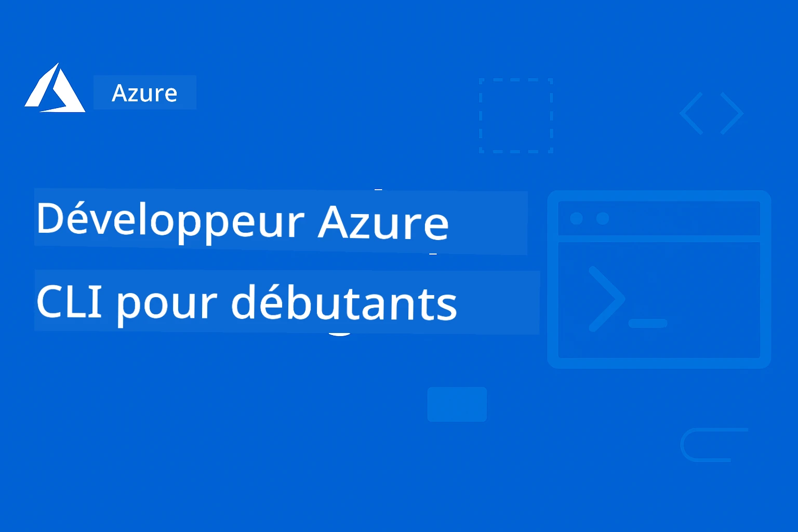

# AZD Pour Débutants : Un Parcours d'Apprentissage Structuré

 

[](https://GitHub.com/microsoft/azd-for-beginners/watchers/)
[](https://GitHub.com/microsoft/azd-for-beginners/network/)
[](https://GitHub.com/microsoft/azd-for-beginners/stargazers/)

[](https://discord.gg/microsoft-azure)
[](https://discord.gg/nTYy5BXMWG)

## Commencer avec ce Cours

Suivez ces étapes pour débuter votre parcours d’apprentissage AZD :

1. **Forkez le Dépôt** : Cliquez sur [](https://GitHub.com/microsoft/azd-for-beginners/fork)
2. **Clonez le Dépôt** : `git clone https://github.com/microsoft/azd-for-beginners.git`
3. **Rejoignez la Communauté** : [Communautés Azure Discord](https://discord.com/invite/ByRwuEEgH4) pour un support expert
4. **Choisissez Votre Parcours d’Apprentissage** : Sélectionnez un chapitre ci-dessous qui correspond à votre niveau d’expérience

### Support Multilingue

#### Traductions Automatiques (Toujours à Jour)

<!-- CO-OP TRANSLATOR LANGUAGES TABLE START -->
[Arabe](../ar/README.md) | [Bengali](../bn/README.md) | [Bulgare](../bg/README.md) | [Birman (Myanmar)](../my/README.md) | [Chinois (Simplifié)](../zh-CN/README.md) | [Chinois (Traditionnel, Hong Kong)](../zh-HK/README.md) | [Chinois (Traditionnel, Macao)](../zh-MO/README.md) | [Chinois (Traditionnel, Taïwan)](../zh-TW/README.md) | [Croate](../hr/README.md) | [Tchèque](../cs/README.md) | [Danois](../da/README.md) | [Néerlandais](../nl/README.md) | [Estonien](../et/README.md) | [Finnois](../fi/README.md) | [Français](./README.md) | [Allemand](../de/README.md) | [Grec](../el/README.md) | [Hébreu](../he/README.md) | [Hindi](../hi/README.md) | [Hongrois](../hu/README.md) | [Indonésien](../id/README.md) | [Italien](../it/README.md) | [Japonais](../ja/README.md) | [Kannada](../kn/README.md) | [Coréen](../ko/README.md) | [Lituanien](../lt/README.md) | [Malais](../ms/README.md) | [Malayalam](../ml/README.md) | [Marathi](../mr/README.md) | [Népalais](../ne/README.md) | [Pidgin Nigérian](../pcm/README.md) | [Norvégien](../no/README.md) | [Persan (Farsi)](../fa/README.md) | [Polonais](../pl/README.md) | [Portugais (Brésil)](../pt-BR/README.md) | [Portugais (Portugal)](../pt-PT/README.md) | [Pendjabi (Gurmukhi)](../pa/README.md) | [Roumain](../ro/README.md) | [Russe](../ru/README.md) | [Serbe (Cyrillique)](../sr/README.md) | [Slovaque](../sk/README.md) | [Slovène](../sl/README.md) | [Espagnol](../es/README.md) | [Swahili](../sw/README.md) | [Suédois](../sv/README.md) | [Tagalog (Philippin)](../tl/README.md) | [Tamoul](../ta/README.md) | [Télougou](../te/README.md) | [Thaï](../th/README.md) | [Turc](../tr/README.md) | [Ukrainien](../uk/README.md) | [Ourdou](../ur/README.md) | [Vietnamien](../vi/README.md)

> **Préférez Cloner Localement ?**

> Ce dépôt inclut plus de 50 traductions de langues ce qui augmente considérablement la taille du téléchargement. Pour cloner sans les traductions, utilisez un sparse checkout :
> ```bash
> git clone --filter=blob:none --sparse https://github.com/microsoft/AZD-for-beginners.git
> cd AZD-for-beginners
> git sparse-checkout set --no-cone '/*' '!translations' '!translated_images'
> ```
> Cela vous donne tout ce dont vous avez besoin pour compléter le cours avec un téléchargement beaucoup plus rapide.
<!-- CO-OP TRANSLATOR LANGUAGES TABLE END -->

## Présentation du Cours

Maîtrisez Azure Developer CLI (azd) à travers des chapitres structurés conçus pour un apprentissage progressif. **Focus spécial sur le déploiement d’applications IA avec intégration Microsoft Foundry.**

### Pourquoi Ce Cours est Essentiel pour les Développeurs Modernes

Basé sur les insights de la communauté Microsoft Foundry Discord, **45% des développeurs souhaitent utiliser AZD pour des charges de travail IA** mais rencontrent des difficultés avec :
- Architectures IA complexes multi-services
- Bonnes pratiques de déploiement IA en production  
- Intégration et configuration des services Azure IA
- Optimisation des coûts pour les charges IA
- Résolution de problèmes spécifiques au déploiement IA

### Objectifs d’Apprentissage

En complétant ce cours structuré, vous allez :
- **Maîtriser les Fondamentaux d’AZD** : Concepts de base, installation, configuration
- **Déployer des Applications IA** : Utiliser AZD avec les services Microsoft Foundry
- **Implémenter Infrastructure as Code** : Gérer les ressources Azure avec des templates Bicep
- **Résoudre les Problèmes de Déploiement** : Identifier et corriger les erreurs courantes
- **Optimiser pour la Production** : Sécurité, scalabilité, monitoring et gestion des coûts
- **Construire des Solutions Multi-Agents** : Déployer des architectures IA complexes

## 📚 Chapitres d’Apprentissage

*Sélectionnez votre parcours d’apprentissage selon votre niveau d’expérience et objectifs*

### 🚀 Chapitre 1 : Fondations & Démarrage Rapide
**Prérequis** : Abonnement Azure, connaissances de base en ligne de commande  
**Durée** : 30-45 minutes  
**Complexité** : ⭐

#### Ce que vous apprendrez
- Comprendre les fondamentaux de Azure Developer CLI
- Installer AZD sur votre plateforme
- Votre premier déploiement réussi

#### Ressources d’apprentissage
- **🎯 Débutez Ici** : [Qu’est-ce que Azure Developer CLI ?](../..)
- **📖 Théorie** : [Bases d’AZD](docs/getting-started/azd-basics.md) - Concepts clés et terminologie
- **⚙️ Installation** : [Installation & Configuration](docs/getting-started/installation.md) - Guides spécifiques à la plateforme
- **🛠️ Pratique** : [Votre Premier Projet](docs/getting-started/first-project.md) - Tutoriel pas à pas
- **📋 Référence Rapide** : [Fiche de Commandes](resources/cheat-sheet.md)

#### Exercices Pratiques
```bash
# Vérification rapide de l'installation
azd version

# Déployez votre première application
azd init --template todo-nodejs-mongo
azd up
```

**💡 Résultat du Chapitre** : Déployer avec succès une application web simple sur Azure en utilisant AZD

**✅ Validation du Succès :**
```bash
# Après avoir terminé le chapitre 1, vous devriez être capable de :
azd version              # Affiche la version installée
azd init --template todo-nodejs-mongo  # Initialise le projet
azd up                  # Déploie sur Azure
azd show                # Affiche l'URL de l'application en cours d'exécution
# L'application s'ouvre dans le navigateur et fonctionne
azd down --force --purge  # Nettoie les ressources
```

**📊 Temps Investi :** 30-45 minutes  
**📈 Niveau Après :** Capable de déployer des applications basiques de manière autonome

**✅ Validation du Succès :**
```bash
# Après avoir terminé le Chapitre 1, vous devriez être capable de :
azd version              # Affiche la version installée
azd init --template todo-nodejs-mongo  # Initialise le projet
azd up                  # Déploie sur Azure
azd show                # Affiche l'URL de l'application en cours d'exécution
# L'application s'ouvre dans le navigateur et fonctionne
azd down --force --purge  # Nettoie les ressources
```

**📊 Temps Investi :** 30-45 minutes  
**📈 Niveau Après :** Capable de déployer des applications basiques de manière autonome

---

### 🤖 Chapitre 2 : Développement AI-First (Recommandé pour les Développeurs IA)
**Prérequis** : Chapitre 1 terminé  
**Durée** : 1-2 heures  
**Complexité** : ⭐⭐

#### Ce que vous apprendrez
- Intégration Microsoft Foundry avec AZD
- Déploiement d’applications alimentées par IA
- Compréhension des configurations de services IA

#### Ressources d’apprentissage
- **🎯 Débutez Ici** : [Intégration Microsoft Foundry](docs/microsoft-foundry/microsoft-foundry-integration.md)
- **📖 Modèles** : [Déploiement de modèles IA](docs/microsoft-foundry/ai-model-deployment.md) - Déployer et gérer des modèles IA
- **🛠️ Atelier** : [Laboratoire IA](docs/microsoft-foundry/ai-workshop-lab.md) - Préparez vos solutions IA pour AZD
- **🎥 Guide Interactif** : [Matériel de l’Atelier](workshop/README.md) - Apprentissage via navigateur avec MkDocs * Environnement DevContainer
- **📋 Modèles** : [Modèles Microsoft Foundry](../..)
- **📝 Exemples** : [Exemples de Déploiement AZD](examples/README.md)

#### Exercices Pratiques
```bash
# Déployez votre première application d'IA
azd init --template azure-search-openai-demo
azd up

# Essayez des modèles d'IA supplémentaires
azd init --template openai-chat-app-quickstart
azd init --template agent-openai-python-prompty
```

**💡 Résultat du Chapitre** : Déployer et configurer une application de chat alimentée par IA avec capacités RAG

**✅ Validation du Succès :**
```bash
# Après le chapitre 2, vous devriez être capable de :
azd init --template azure-search-openai-demo
azd up
# Tester l'interface de chat IA
# Poser des questions et obtenir des réponses alimentées par l'IA avec des sources
# Vérifier que l'intégration de la recherche fonctionne
azd monitor  # Vérifier que Application Insights affiche la télémétrie
azd down --force --purge
```

**📊 Temps Investi :** 1-2 heures  
**📈 Niveau Après :** Capable de déployer et configurer des applications IA prêtes pour la production  
**💰 Sensibilisation aux Coûts :** Comprendre les coûts de développement ($80-150/mois) et production ($300-3500/mois)

#### 💰 Considérations de Coûts pour les Déploiements IA

**Environnement de Développement (Estimé $80-150/mois) :**
- Azure OpenAI (paiement à l’usage) : 0-50 $/mois (selon usage de tokens)
- AI Search (niveau basique) : 75 $/mois
- Container Apps (consommation) : 0-20 $/mois
- Stockage (Standard) : 1-5 $/mois

**Environnement de Production (Estimé $300-3 500+/mois) :**
- Azure OpenAI (PTU pour performance constante) : 3 000 $+/mois OU Paiement à l’usage avec volume élevé
- AI Search (niveau standard) : 250 $/mois
- Container Apps (dédié) : 50-100 $/mois
- Application Insights : 5-50 $/mois
- Stockage (Premium) : 10-50 $/mois

**💡 Astuces d’Optimisation des Coûts :**
- Utiliser Azure OpenAI en **niveau gratuit** pour l’apprentissage (50 000 tokens/mois inclus)
- Exécuter `azd down` pour désallouer les ressources hors développement actif
- Démarrer par un modèle de facturation à la consommation, passer au PTU uniquement en production
- Utiliser `azd provision --preview` pour estimer les coûts avant déploiement
- Activer l’auto-scaling : ne payer que la consommation réelle

**Surveillance des Coûts :**
```bash
# Vérifiez les coûts mensuels estimés
azd provision --preview

# Surveillez les coûts réels dans le portail Azure
az consumption budget list --resource-group <your-rg>
```

---

### ⚙️ Chapitre 3 : Configuration & Authentification
**Prérequis** : Chapitre 1 terminé  
**Durée** : 45-60 minutes  
**Complexité** : ⭐⭐

#### Ce que vous apprendrez
- Configuration et gestion des environnements
- Authentification et meilleures pratiques de sécurité
- Nommage et organisation des ressources

#### Ressources d’apprentissage
- **📖 Configuration** : [Guide de Configuration](docs/getting-started/configuration.md) - Mise en place des environnements
- **🔐 Sécurité** : [Modèles d’authentification et identité managée](docs/getting-started/authsecurity.md) - Modèles d’authentification
- **📝 Exemples** : [Exemple d’application base de données](examples/database-app/README.md) - Exemples AZD avec base de données

#### Exercices Pratiques
- Configurer plusieurs environnements (dev, staging, prod)
- Mettre en place une authentification par identité managée
- Implémenter des configurations spécifiques à chaque environnement

**💡 Résultat du Chapitre** : Gérer plusieurs environnements avec une authentification et une sécurité appropriée

---

### 🏗️ Chapitre 4 : Infrastructure as Code & Déploiement
**Prérequis** : Chapitres 1-3 terminés  
**Durée** : 1-1,5 heures  
**Complexité** : ⭐⭐⭐

#### Ce que vous apprendrez
- Modèles avancés de déploiement
- Infrastructure as Code avec Bicep
- Stratégies de provisioning des ressources

#### Ressources d’apprentissage
- **📖 Déploiement** : [Guide de Déploiement](docs/deployment/deployment-guide.md) - Flux de travail complet
- **🏗️ Provisioning** : [Provisioning des ressources](docs/deployment/provisioning.md) - Gestion des ressources Azure
- **📝 Exemples** : [Exemple Container App](../../examples/container-app) - Déploiements conteneurisés

#### Exercices Pratiques
- Créer des templates Bicep personnalisés
- Déployer des applications multi-services
- Implémenter des stratégies de déploiement blue-green

**💡 Résultat du Chapitre** : Déployer des applications complexes multi-services en utilisant des templates d’infrastructure personnalisés

---

### 🎯 Chapitre 5 : Solutions IA Multi-Agent (Avancé)
**Prérequis** : Chapitres 1-2 terminés  
**Durée** : 2-3 heures  
**Complexité** : ⭐⭐⭐⭐
#### Ce que vous apprendrez
- Modèles d'architecture multi-agents
- Orchestration et coordination des agents
- Déploiements IA prêts pour la production

#### Ressources d'apprentissage
- **🤖 Projet en vedette** : [Solution Multi-Agent Retail](examples/retail-scenario.md) - Implémentation complète
- **🛠️ Modèles ARM** : [Package Template ARM](../../examples/retail-multiagent-arm-template) - Déploiement en un clic
- **📖 Architecture** : [Modèles de coordination multi-agents](/docs/pre-deployment/coordination-patterns.md) - Modèles

#### Exercices pratiques
```bash
# Déployer la solution complète multi-agent pour le commerce de détail
cd examples/retail-multiagent-arm-template
./deploy.sh

# Explorer les configurations des agents
az deployment group show --resource-group <rg-name> --name <deployment-name>
```

**💡 Résultat du chapitre** : Déployer et gérer une solution IA multi-agent prête pour la production avec des agents Client et Inventaire

---

### 🔍 Chapitre 6 : Validation & Planification Pré-déploiement
**Prérequis** : Chapitre 4 terminé  
**Durée** : 1 heure  
**Complexité** : ⭐⭐

#### Ce que vous apprendrez
- Planification de capacité et validation des ressources
- Stratégies de sélection SKU
- Vérifications préalables et automatisation

#### Ressources d'apprentissage
- **📊 Planification** : [Planification de capacité](docs/pre-deployment/capacity-planning.md) - Validation des ressources
- **💰 Sélection** : [Sélection SKU](docs/pre-deployment/sku-selection.md) - Choix rentables
- **✅ Validation** : [Vérifications préalables](docs/pre-deployment/preflight-checks.md) - Scripts automatisés

#### Exercices pratiques
- Exécuter des scripts de validation de capacité
- Optimiser les sélections SKU pour le coût
- Mettre en œuvre des contrôles automatisés pré-déploiement

**💡 Résultat du chapitre** : Valider et optimiser les déploiements avant exécution

---

### 🚨 Chapitre 7 : Dépannage & Debugging
**Prérequis** : N'importe quel chapitre de déploiement terminé  
**Durée** : 1-1.5 heures  
**Complexité** : ⭐⭐

#### Ce que vous apprendrez
- Approches systématiques de débogage
- Problèmes courants et solutions
- Dépannage spécifique à l'IA

#### Ressources d'apprentissage
- **🔧 Problèmes courants** : [Problèmes courants](docs/troubleshooting/common-issues.md) - FAQ et solutions
- **🕵️ Guide de débogage** : [Guide de débogage](docs/troubleshooting/debugging.md) - Stratégies étape par étape
- **🤖 Problèmes IA** : [Dépannage spécifique à l'IA](docs/troubleshooting/ai-troubleshooting.md) - Problèmes des services IA

#### Exercices pratiques
- Diagnostiquer des échecs de déploiement
- Résoudre des problèmes d'authentification
- Déboguer la connectivité des services IA

**💡 Résultat du chapitre** : Diagnostiquer et résoudre de manière autonome les problèmes courants de déploiement

---

### 🏢 Chapitre 8 : Modèles de Production & Entreprise
**Prérequis** : Chapitres 1-4 terminés  
**Durée** : 2-3 heures  
**Complexité** : ⭐⭐⭐⭐

#### Ce que vous apprendrez
- Stratégies de déploiement en production
- Modèles de sécurité d'entreprise
- Surveillance et optimisation des coûts

#### Ressources d'apprentissage
- **🏭 Production** : [Bonnes pratiques IA en production](docs/microsoft-foundry/production-ai-practices.md) - Modèles entreprise
- **📝 Exemples** : [Exemple Microservices](../../examples/microservices) - Architectures complexes
- **📊 Surveillance** : [Intégration Application Insights](docs/pre-deployment/application-insights.md) - Monitoring

#### Exercices pratiques
- Implémenter les modèles de sécurité d'entreprise
- Mettre en place une surveillance complète
- Déployer en production avec gouvernance adaptée

**💡 Résultat du chapitre** : Déployer des applications prêtes pour l’entreprise avec capacités de production complètes

---

## 🎓 Aperçu de l'atelier : Expérience d'apprentissage pratique

> **⚠️ STATUT DE L'ATELIER : Développement actif**  
> Les supports de l'atelier sont en cours de développement et de raffinement. Les modules principaux sont fonctionnels, mais certaines sections avancées sont incomplètes. Nous travaillons activement à la finalisation de tous les contenus. [Suivez les progrès →](workshop/README.md)

### Supports d'atelier interactifs
**Apprentissage pratique complet avec outils accessibles dans le navigateur et exercices guidés**

Nos supports d'atelier offrent une expérience d'apprentissage structurée et interactive qui complète le programme basé sur les chapitres ci-dessus. L'atelier est conçu pour l'auto-apprentissage et les sessions dirigées.

#### 🛠️ Fonctionnalités de l'atelier
- **Interface basée navigateur** : Atelier complet propulsé par MkDocs avec recherche, copier, et thèmes
- **Intégration GitHub Codespaces** : Configuration de l'environnement de développement en un clic
- **Parcours d'apprentissage structuré** : 7 exercices guidés (3,5 heures au total)
- **Découverte → Déploiement → Personnalisation** : Méthodologie progressive
- **Environnement DevContainer interactif** : Outils et dépendances préconfigurés

#### 📚 Structure de l'atelier
L'atelier suit une méthodologie **Découverte → Déploiement → Personnalisation** :

1. **Phase Découverte** (45 min)
   - Explorer les templates et services Microsoft Foundry
   - Comprendre les modèles d'architecture multi-agents
   - Examiner les prérequis et exigences de déploiement

2. **Phase Déploiement** (2 heures)
   - Déploiement pratique d’applications IA avec AZD
   - Configurer les services et points de terminaison Azure AI
   - Implémenter les modèles de sécurité et d’authentification

3. **Phase Personnalisation** (45 min)
   - Modifier les applications pour des cas d’usage spécifiques
   - Optimiser le déploiement en production
   - Mettre en œuvre la surveillance et la gestion des coûts

#### 🚀 Démarrer l'atelier
```bash
# Option 1 : GitHub Codespaces (Recommandé)
# Cliquez sur "Code" → "Créer un espace de code sur main" dans le dépôt

# Option 2 : Développement local
git clone https://github.com/microsoft/azd-for-beginners.git
cd azd-for-beginners/workshop
# Suivez les instructions d'installation dans workshop/README.md
```

#### 🎯 Résultats d’apprentissage de l’atelier
En complétant l’atelier, les participants seront capables de :
- **Déployer des applications IA en production** : Utiliser AZD avec les services Microsoft Foundry
- **Maîtriser les architectures multi-agents** : Mettre en œuvre des solutions IA coordonnées
- **Appliquer les meilleures pratiques de sécurité** : Configurer l’authentification et contrôle d’accès
- **Optimiser pour la montée en charge** : Concevoir des déploiements performants et rentables
- **Résoudre les problèmes de déploiement** : Diagnostiquer et corriger les problèmes courants de manière autonome

#### 📖 Ressources de l’atelier
- **🎥 Guide interactif** : [Supports d’atelier](workshop/README.md) - Environnement d’apprentissage basé navigateur
- **📋 Instructions étape par étape** : [Exercices guidés](../../workshop/docs/instructions) - Tutoriaux détaillés
- **🛠️ Laboratoire IA** : [Atelier IA](docs/microsoft-foundry/ai-workshop-lab.md) - Exercices orientés IA
- **💡 Démarrage rapide** : [Guide de configuration](workshop/README.md#quick-start) - Configuration de l’environnement

**Idéal pour** : Formation en entreprise, cursus universitaires, auto-apprentissage, bootcamps développeurs.

---

## 📖 Qu'est-ce que Azure Developer CLI ?

Azure Developer CLI (azd) est une interface en ligne de commande centrée développeur qui accélère la création et le déploiement d'applications vers Azure. Elle fournit :

- **Déploiements basés sur templates** – Utilisation de modèles préconçus pour des modèles d’applications courants
- **Infrastructure as Code** – Gestion des ressources Azure avec Bicep ou Terraform  
- **Flux de travail intégrés** – Provisionnement, déploiement et surveillance fluide des applications
- **Conviviale pour développeurs** – Optimisée pour la productivité et l’expérience développeur

### **AZD + Microsoft Foundry : Parfait pour les déploiements IA**

**Pourquoi AZD pour les solutions IA ?** AZD répond aux principaux défis rencontrés par les développeurs IA :

- **Templates prêts pour IA** – Modèles préconfigurés pour Azure OpenAI, Cognitive Services, et charges ML
- **Déploiements IA sécurisés** – Modèles intégrés pour services IA, clés API, et points de terminaison modèles  
- **Modèles IA en production** – Bonnes pratiques pour des déploiements IA évolutifs et rentables
- **Flux de travail IA de bout en bout** – Du développement modèle au déploiement production avec surveillance adéquate
- **Optimisation des coûts** – Gestion intelligente des ressources et stratégies de montée en charge pour IA
- **Intégration Microsoft Foundry** – Connexion fluide au catalogue et points de terminaison Microsoft Foundry

---

## 🎯 Bibliothèque de Templates & Exemples

### En vedette : Templates Microsoft Foundry
**Commencez ici si vous déployez des applications IA !**

> **Note :** Ces templates démontrent divers modèles IA. Certains sont des exemples externes Azure, d’autres des implémentations locales.

| Template | Chapitre | Complexité | Services | Type |
|----------|---------|------------|----------|------|
| [**Démarrer avec le chat IA**](https://github.com/Azure-Samples/get-started-with-ai-chat) | Chapitre 2 | ⭐⭐ | AzureOpenAI + Azure AI Model Inference API + Azure AI Search + Azure Container Apps + Application Insights | Externe |
| [**Démarrer avec agents IA**](https://github.com/Azure-Samples/get-started-with-ai-agents) | Chapitre 2 | ⭐⭐ | Azure AI Agent Service + AzureOpenAI + Azure AI Search + Azure Container Apps + Application Insights| Externe |
| [**Démonstration Azure Search + OpenAI**](https://github.com/Azure-Samples/azure-search-openai-demo) | Chapitre 2 | ⭐⭐ | AzureOpenAI + Azure AI Search + App Service + Storage | Externe |
| [**Démarrage rapide OpenAI Chat App**](https://github.com/Azure-Samples/openai-chat-app-quickstart) | Chapitre 2 | ⭐ | AzureOpenAI + Container Apps + Application Insights | Externe |
| [**Agent OpenAI Python Prompty**](https://github.com/Azure-Samples/agent-openai-python-prompty) | Chapitre 5 | ⭐⭐⭐ | AzureOpenAI + Azure Functions + Prompty | Externe |
| [**Contoso Chat RAG**](https://github.com/Azure-Samples/contoso-chat) | Chapitre 8 | ⭐⭐⭐⭐ | AzureOpenAI + AI Search + Cosmos DB + Container Apps | Externe |
| [**Solution Multi-Agent Retail**](examples/retail-scenario.md) | Chapitre 5 | ⭐⭐⭐⭐ | AzureOpenAI + AI Search + Storage + Container Apps + Cosmos DB | **Local** |

### En vedette : Scénarios Complets d’Apprentissage
**Templates applicatifs prêts pour la production liés aux chapitres d’apprentissage**

| Template | Chapitre d'apprentissage | Complexité | Apprentissage clé |
|----------|--------------------------|------------|-------------------|
| [**openai-chat-app-quickstart**](https://github.com/Azure-Samples/openai-chat-app-quickstart) | Chapitre 2 | ⭐ | Modèles de base de déploiement IA |
| [**azure-search-openai-demo**](https://github.com/Azure-Samples/azure-search-openai-demo) | Chapitre 2 | ⭐⭐ | Implémentation RAG avec Azure AI Search |
| [**ai-document-processing**](https://github.com/Azure-Samples/ai-document-processing) | Chapitre 4 | ⭐⭐ | Intégration Document Intelligence |
| [**agent-openai-python-prompty**](https://github.com/Azure-Samples/agent-openai-python-prompty) | Chapitre 5 | ⭐⭐⭐ | Framework agent et appels de fonctions |
| [**contoso-chat**](https://github.com/Azure-Samples/contoso-chat) | Chapitre 8 | ⭐⭐⭐ | Orchestration IA d’entreprise |
| [**retail-multi-agent-solution**](examples/retail-scenario.md) | Chapitre 5 | ⭐⭐⭐⭐ | Architecture multi-agent avec agents Client et Inventaire |

### Apprentissage par type d’exemple

> **📌 Exemples locaux vs. externes :**  
> **Exemples locaux** (dans ce dépôt) = prêts à l’emploi  
> **Exemples externes** (Azure Samples) = à cloner depuis les dépôts liés

#### Exemples Locaux (Prêts à l'emploi)
- [**Solution Multi-Agent Retail**](examples/retail-scenario.md) - Implémentation complète prête pour la production avec templates ARM
  - Architecture multi-agent (agents Client + Inventaire)
  - Surveillance et évaluation complètes
  - Déploiement en un clic via template ARM

#### Exemples Locaux - Applications Conteneurisées (Chapitres 2-5)
**Exemples complets de déploiement conteneur dans ce dépôt :**
- [**Exemples Container App**](examples/container-app/README.md) - Guide complet des déploiements conteneurisés
  - [API Flask simple](../../examples/container-app/simple-flask-api) - API REST basique avec scale-to-zero
  - [Architecture Microservices](../../examples/container-app/microservices) - Déploiement multi-service production
  - Modèles démarrage rapide, production, avancés
  - Guide surveillance, sécurité, optimisation coûts

#### Exemples Externes - Applications Simples (Chapitres 1-2)
**Cloner ces dépôts Azure Samples pour démarrer :**
- [Application Web Simple - Node.js + MongoDB](https://github.com/Azure-Samples/todo-nodejs-mongo) - Modèles de déploiement de base
- [Site statique - React SPA](https://github.com/Azure-Samples/todo-csharp-sql-swa-func) - Déploiement contenu statique
- [Container App - Python Flask](https://github.com/Azure-Samples/container-apps-store-api-microservice) - Déploiement API REST

#### Exemples Externes - Intégration Base de Données (Chapitres 3-4)  
- [Application base de données - C# + SQL](https://github.com/Azure-Samples/todo-csharp-sql) - Modèles connexion base de données
- [Fonctions + Cosmos DB](https://github.com/Azure-Samples/todo-python-mongo-swa-func) - Workflow données serverless

#### Exemples Externes - Modèles avancés (Chapitres 4-8)
- [Microservices Java](https://github.com/Azure-Samples/java-microservices-aca-lab) - Architectures multi-services
- [Container Apps Jobs](https://github.com/Azure-Samples/container-apps-jobs) - Traitement en arrière-plan  
- [Pipeline ML Entreprise](https://github.com/Azure-Samples/mlops-v2) - Modèles ML prêts pour production

### Collections de Templates Externes
- [**Galerie officielle AZD Template**](https://azure.github.io/awesome-azd/) - Collection sélectionnée de templates officiels et communautaires
- [**Modèles Azure Developer CLI**](https://learn.microsoft.com/en-us/azure/developer/azure-developer-cli/azd-templates) - documentation des modèles Microsoft Learn
- [**Répertoire d’exemples**](examples/README.md) - exemples d’apprentissage locaux avec explications détaillées

---

## 📚 Ressources et références d’apprentissage

### Références rapides
- [**Fiche de commandes**](resources/cheat-sheet.md) - Commandes azd essentielles organisées par chapitre
- [**Glossaire**](resources/glossary.md) - Terminologie Azure et azd  
- [**FAQ**](resources/faq.md) - Questions courantes organisées par chapitre d’apprentissage
- [**Guide d’étude**](resources/study-guide.md) - Exercices pratiques complets

### Ateliers pratiques
- [**Laboratoire atelier IA**](docs/microsoft-foundry/ai-workshop-lab.md) - Rendez vos solutions IA déployables avec AZD (2-3 heures)
- [**Guide d’atelier interactif**](workshop/README.md) - Atelier basé sur navigateur avec MkDocs et environnement DevContainer
- [**Parcours d’apprentissage structuré**](../../workshop/docs/instructions) - Exercices guidés en 7 étapes (Découverte → Déploiement → Personnalisation)
- [**Atelier AZD pour débutants**](workshop/README.md) - Matériel complet d’atelier pratique avec intégration GitHub Codespaces

### Ressources d’apprentissage externes
- Documentation Azure Developer CLI (https://learn.microsoft.com/en-us/azure/developer/azure-developer-cli/)
- Centre d’architecture Azure (https://learn.microsoft.com/en-us/azure/architecture/)
- Calculateur de prix Azure (https://azure.microsoft.com/pricing/calculator/)
- Statut Azure (https://status.azure.com/)

---

## 🔧 Guide rapide de dépannage

**Problèmes courants rencontrés par les débutants et solutions immédiates :**

### ❌ "azd : commande introuvable"

```bash
# Installer d'abord AZD
# Windows (PowerShell) :
winget install microsoft.azd

# macOS :
brew tap azure/azd && brew install azd

# Linux :
curl -fsSL https://aka.ms/install-azd.sh | bash

# Vérifier l'installation
azd version
```

### ❌ "Aucune souscription trouvée" ou "Souscription non définie"

```bash
# Lister les abonnements disponibles
az account list --output table

# Définir l'abonnement par défaut
az account set --subscription "<subscription-id-or-name>"

# Configurer pour l'environnement AZD
azd env set AZURE_SUBSCRIPTION_ID "<subscription-id>"

# Vérifier
az account show
```

### ❌ "Quota insuffisant" ou "Quota dépassé"

```bash
# Essayez différentes régions Azure
azd env set AZURE_LOCATION "westus2"
azd up

# Ou utilisez des SKU plus petits en développement
# Modifiez infra/main.parameters.json:
{
  "sku": "B1"  // Instead of "P1V2"
}
```

### ❌ Échec de "azd up" à mi-chemin

```bash
# Option 1 : Nettoyer et réessayer
azd down --force --purge
azd up

# Option 2 : Corriger uniquement l'infrastructure
azd provision

# Option 3 : Vérifier les journaux détaillés
azd show
azd logs
```

### ❌ "Authentification échouée" ou "Token expiré"

```bash
# Ré-authentifier
az logout
az login

azd auth logout
azd auth login

# Vérifier l'authentification
az account show
```

### ❌ "Ressource déjà existante" ou conflits de nommage

```bash
# AZD génère des noms uniques, mais en cas de conflit :
azd down --force --purge

# Essayez alors à nouveau avec un environnement neuf
azd env new dev-v2
azd up
```

### ❌ Déploiement du modèle trop long

**Temps d’attente normaux :**
- Application web simple : 5-10 minutes
- Application avec base de données : 10-15 minutes
- Applications IA : 15-25 minutes (provisionnement OpenAI lent)

```bash
# Vérifier la progression
azd show

# Si bloqué >30 minutes, vérifier le portail Azure :
azd monitor
# Rechercher les déploiements échoués
```

### ❌ "Permission refusée" ou "Interdit"

```bash
# Vérifiez votre rôle Azure
az role assignment list --assignee $(az account show --query user.name -o tsv)

# Vous avez besoin d'au moins le rôle "Contributeur"
# Demandez à votre administrateur Azure d'accorder :
# - Contributeur (pour les ressources)
# - Administrateur d'accès utilisateur (pour les affectations de rôle)
```

### ❌ URL de l’application déployée introuvable

```bash
# Afficher tous les points de terminaison du service
azd show

# Ou ouvrir le portail Azure
azd monitor

# Vérifier le service spécifique
azd env get-values
# Rechercher les variables *_URL
```

### 📚 Ressources complètes de dépannage

- **Guide des problèmes courants :** [Solutions détaillées](docs/troubleshooting/common-issues.md)
- **Problèmes spécifiques à l’IA :** [Dépannage IA](docs/troubleshooting/ai-troubleshooting.md)
- **Guide de débogage :** [Débogage pas à pas](docs/troubleshooting/debugging.md)
- **Obtenir de l’aide :** [Azure Discord](https://discord.gg/microsoft-azure) #azure-developer-cli

---

## 🔧 Guide rapide de dépannage

**Problèmes courants rencontrés par les débutants et solutions immédiates :**

<details>
<summary><strong>❌ "azd : commande introuvable"</strong></summary>

```bash
# Installez d'abord AZD
# Windows (PowerShell) :
winget install microsoft.azd

# macOS :
brew tap azure/azd && brew install azd

# Linux :
curl -fsSL https://aka.ms/install-azd.sh | bash

# Vérifiez l'installation
azd version
```
</details>

<details>
<summary><strong>❌ "Aucune souscription trouvée" ou "Souscription non définie"</strong></summary>

```bash
# Lister les abonnements disponibles
az account list --output table

# Définir l'abonnement par défaut
az account set --subscription "<subscription-id-or-name>"

# Configurer pour l'environnement AZD
azd env set AZURE_SUBSCRIPTION_ID "<subscription-id>"

# Vérifier
az account show
```
</details>

<details>
<summary><strong>❌ "Quota insuffisant" ou "Quota dépassé"</strong></summary>

```bash
# Essayez différentes régions Azure
azd env set AZURE_LOCATION "westus2"
azd up

# Ou utilisez des SKU plus petits en développement
# Modifiez infra/main.parameters.json :
{
  "sku": "B1"  // Instead of "P1V2"
}
```
</details>

<details>
<summary><strong>❌ Échec de "azd up" à mi-chemin</strong></summary>

```bash
# Option 1 : Nettoyer et réessayer
azd down --force --purge
azd up

# Option 2 : Réparer uniquement l'infrastructure
azd provision

# Option 3 : Vérifier les journaux détaillés
azd show
azd logs
```
</details>

<details>
<summary><strong>❌ "Authentification échouée" ou "Token expiré"</strong></summary>

```bash
# Ré-authentifier
az logout
az login

azd auth logout
azd auth login

# Vérifier l'authentification
az account show
```
</details>

<details>
<summary><strong>❌ "Ressource déjà existante" ou conflits de nommage</strong></summary>

```bash
# AZD génère des noms uniques, mais en cas de conflit :
azd down --force --purge

# Puis réessayez avec un nouvel environnement
azd env new dev-v2
azd up
```
</details>

<details>
<summary><strong>❌ Déploiement du modèle trop long</strong></summary>

**Temps d’attente normaux :**
- Application web simple : 5-10 minutes
- Application avec base de données : 10-15 minutes
- Applications IA : 15-25 minutes (provisionnement OpenAI lent)

```bash
# Vérifier la progression
azd show

# Si bloqué >30 minutes, vérifier le portail Azure :
azd monitor
# Rechercher les déploiements échoués
```
</details>

<details>
<summary><strong>❌ "Permission refusée" ou "Interdit"</strong></summary>

```bash
# Vérifiez votre rôle Azure
az role assignment list --assignee $(az account show --query user.name -o tsv)

# Vous avez besoin d'au moins le rôle "Collaborateur"
# Demandez à votre administrateur Azure d'accorder :
# - Collaborateur (pour les ressources)
# - Administrateur d'accès utilisateur (pour les attributions de rôle)
```
</details>

<details>
<summary><strong>❌ URL de l’application déployée introuvable</strong></summary>

```bash
# Afficher tous les points de terminaison du service
azd show

# Ou ouvrir le portail Azure
azd monitor

# Vérifier un service spécifique
azd env get-values
# Rechercher les variables *_URL
```
</details>

### 📚 Ressources complètes de dépannage

- **Guide des problèmes courants :** [Solutions détaillées](docs/troubleshooting/common-issues.md)
- **Problèmes spécifiques à l’IA :** [Dépannage IA](docs/troubleshooting/ai-troubleshooting.md)
- **Guide de débogage :** [Débogage pas à pas](docs/troubleshooting/debugging.md)
- **Obtenir de l’aide :** [Azure Discord](https://discord.gg/microsoft-azure) #azure-developer-cli

---

## 🎓 Finalisation du cours & Certification

### Suivi de progression
Suivez votre progression d’apprentissage à travers chaque chapitre :

- [ ] **Chapitre 1** : Fondations & Démarrage rapide ✅
- [ ] **Chapitre 2** : Développement orienté IA ✅  
- [ ] **Chapitre 3** : Configuration & Authentification ✅
- [ ] **Chapitre 4** : Infrastructure as Code & Déploiement ✅
- [ ] **Chapitre 5** : Solutions IA multi-agents ✅
- [ ] **Chapitre 6** : Validation & planification pré-déploiement ✅
- [ ] **Chapitre 7** : Dépannage & débogage ✅
- [ ] **Chapitre 8** : Production & modèles d’entreprise ✅

### Vérification des connaissances
Après chaque chapitre, vérifiez vos connaissances en :
1. **Exercice pratique** : Effectuer le déploiement pratique du chapitre
2. **Vérification des connaissances** : Revoir la FAQ du chapitre
3. **Discussion communautaire** : Partager votre expérience sur Azure Discord
4. **Chapitre suivant** : Passer au niveau de complexité suivant

### Avantages de la finalisation du cours
Après avoir terminé tous les chapitres, vous aurez :
- **Expérience production** : Déployé de réelles applications IA sur Azure
- **Compétences professionnelles** : Capacités de déploiement prêtes pour l’entreprise  
- **Reconnaissance communautaire** : Membre actif de la communauté développeurs Azure
- **Avancement de carrière** : Expertise AZD et IA très demandée

---

## 🤝 Communauté & Support

### Obtenir de l’aide & Support
- **Problèmes techniques** : [Signaler bugs et demander fonctionnalités](https://github.com/microsoft/azd-for-beginners/issues)
- **Questions d’apprentissage** : [Communauté Microsoft Azure Discord](https://discord.gg/microsoft-azure) et [](https://discord.gg/nTYy5BXMWG)
- **Aide spécifique IA** : Rejoignez le [](https://discord.gg/nTYy5BXMWG)
- **Documentation** : [Documentation officielle Azure Developer CLI](https://learn.microsoft.com/en-us/azure/developer/azure-developer-cli/)

### Informations communautaires depuis Microsoft Foundry Discord

**Résultats récents du sondage sur le canal #Azure :**
- **45 %** des développeurs veulent utiliser AZD pour les charges de travail IA
- **Principaux défis** : Déploiements multi-services, gestion des identifiants, préparation production  
- **Vœux les plus exprimés** : Modèles IA spécifiques, guides dépannage, bonnes pratiques

**Rejoignez notre communauté pour :**
- Partager vos expériences AZD + IA et obtenir de l’aide
- Accéder aux aperçus anticipés de nouveaux modèles IA
- Contribuer aux bonnes pratiques de déploiement IA
- Influencer le développement futur des fonctionnalités IA + AZD

### Contribution au cours
Nous accueillons les contributions ! Veuillez lire notre [Guide de contribution](CONTRIBUTING.md) pour des détails sur :
- **Améliorations de contenu** : Enrichir chapitres et exemples existants
- **Nouveaux exemples** : Ajouter des scénarios et modèles réalistes  
- **Traduction** : Aider à maintenir le support multilingue
- **Rapports de bugs** : Améliorer précision et clarté
- **Normes communautaires** : Respecter nos directives inclusives

---

## 📄 Informations sur le cours

### Licence
Ce projet est sous licence MIT License - voir le fichier [LICENSE](../../LICENSE) pour les détails.

### Ressources Microsoft Learning associées

Notre équipe produit d’autres cours d’apprentissage complets :

<!-- CO-OP TRANSLATOR OTHER COURSES START -->
### LangChain
[](https://aka.ms/langchain4j-for-beginners)
[](https://aka.ms/langchainjs-for-beginners?WT.mc_id=m365-94501-dwahlin)
[](https://github.com/microsoft/langchain-for-beginners?WT.mc_id=m365-94501-dwahlin)
---

### Azure / Edge / MCP / Agents
[](https://github.com/microsoft/AZD-for-beginners?WT.mc_id=academic-105485-koreyst)
[](https://github.com/microsoft/edgeai-for-beginners?WT.mc_id=academic-105485-koreyst)
[](https://github.com/microsoft/mcp-for-beginners?WT.mc_id=academic-105485-koreyst)
[](https://github.com/microsoft/ai-agents-for-beginners?WT.mc_id=academic-105485-koreyst)

---
 
### Série IA générative
[](https://github.com/microsoft/generative-ai-for-beginners?WT.mc_id=academic-105485-koreyst)
[-9333EA?style=for-the-badge&labelColor=E5E7EB&color=9333EA)](https://github.com/microsoft/Generative-AI-for-beginners-dotnet?WT.mc_id=academic-105485-koreyst)
[-C084FC?style=for-the-badge&labelColor=E5E7EB&color=C084FC)](https://github.com/microsoft/generative-ai-for-beginners-java?WT.mc_id=academic-105485-koreyst)
[-E879F9?style=for-the-badge&labelColor=E5E7EB&color=E879F9)](https://github.com/microsoft/generative-ai-with-javascript?WT.mc_id=academic-105485-koreyst)

---
 
### Apprentissage de base
[](https://aka.ms/ml-beginners?WT.mc_id=academic-105485-koreyst)
[](https://aka.ms/datascience-beginners?WT.mc_id=academic-105485-koreyst)
[](https://aka.ms/ai-beginners?WT.mc_id=academic-105485-koreyst)
[](https://github.com/microsoft/Security-101?WT.mc_id=academic-96948-sayoung)
[](https://aka.ms/webdev-beginners?WT.mc_id=academic-105485-koreyst)
[](https://aka.ms/iot-beginners?WT.mc_id=academic-105485-koreyst)
[](https://github.com/microsoft/xr-development-for-beginners?WT.mc_id=academic-105485-koreyst)

---
 
### Série Copilot
[](https://aka.ms/GitHubCopilotAI?WT.mc_id=academic-105485-koreyst)
[](https://github.com/microsoft/mastering-github-copilot-for-dotnet-csharp-developers?WT.mc_id=academic-105485-koreyst)
[](https://github.com/microsoft/CopilotAdventures?WT.mc_id=academic-105485-koreyst)
<!-- CO-OP TRANSLATOR OTHER COURSES END -->

---

## 🗺️ Navigation du cours

**🚀 Prêt à commencer à apprendre ?**

**Débutants** : Commencez par [Chapitre 1 : Fondations & démarrage rapide](../..)  
**Développeurs en IA** : Passez à [Chapitre 2 : Développement IA First](../..)  
**Développeurs expérimentés** : Commencez par [Chapitre 3 : Configuration & authentification](../..)

**Étapes suivantes** : [Commencez le Chapitre 1 - Bases AZD](docs/getting-started/azd-basics.md) →

---

<!-- CO-OP TRANSLATOR DISCLAIMER START -->
**Avertissement** :  
Ce document a été traduit à l’aide du service de traduction automatique [Co-op Translator](https://github.com/Azure/co-op-translator). Bien que nous nous efforçions d’assurer l’exactitude, veuillez noter que les traductions automatisées peuvent contenir des erreurs ou des inexactitudes. Le document original dans sa langue native doit être considéré comme la source faisant foi. Pour toute information critique, une traduction professionnelle humaine est recommandée. Nous ne saurions être tenus responsables des malentendus ou des interprétations erronées résultant de l’utilisation de cette traduction.
<!-- CO-OP TRANSLATOR DISCLAIMER END -->