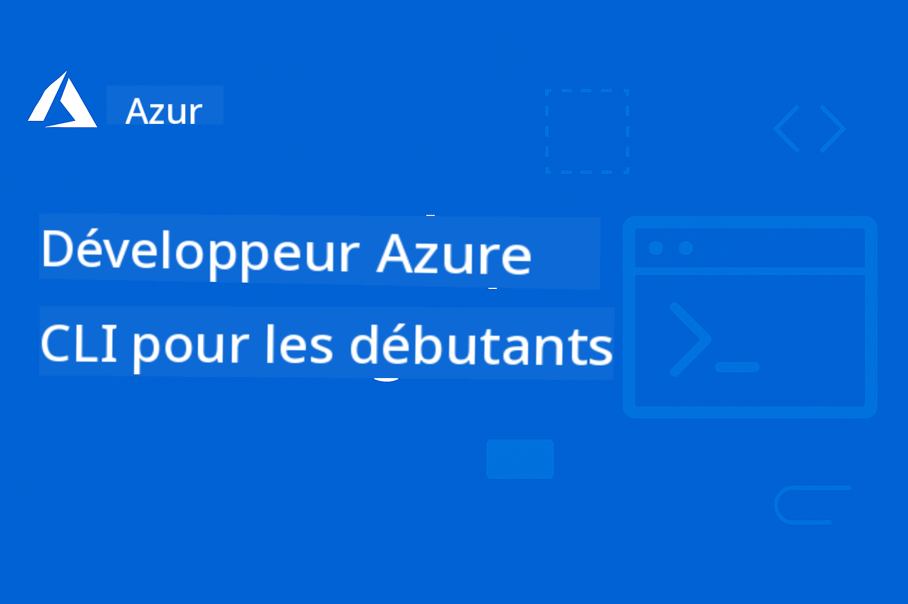

<!--
CO_OP_TRANSLATOR_METADATA:
{
  "original_hash": "05c30c9e5ed7951c72855108c6788034",
  "translation_date": "2025-12-24T22:42:50+00:00",
  "source_file": "README.md",
  "language_code": "fr"
}
-->
# AZD pour débutants : Un parcours d'apprentissage structuré

 

[](https://GitHub.com/microsoft/azd-for-beginners/watchers/)
[](https://GitHub.com/microsoft/azd-for-beginners/network/)
[](https://GitHub.com/microsoft/azd-for-beginners/stargazers/)

[](https://discord.gg/microsoft-azure)
[](https://discord.gg/nTYy5BXMWG)

## Commencer ce cours

Suivez ces étapes pour commencer votre parcours d'apprentissage AZD :

1. **Faites un fork du dépôt**: Click [](https://GitHub.com/microsoft/azd-for-beginners/fork)
2. **Clonez le dépôt**: `git clone https://github.com/microsoft/azd-for-beginners.git`
3. **Rejoignez la communauté**: [Azure Discord Communities](https://discord.com/invite/ByRwuEEgH4) pour un support d'experts
4. **Choisissez votre parcours d'apprentissage**: Sélectionnez un chapitre ci-dessous correspondant à votre niveau d'expérience

### Support multilingue

#### Traductions automatisées (toujours à jour)

<!-- CO-OP TRANSLATOR LANGUAGES TABLE START -->
[Arabe](../ar/README.md) | [Bengali](../bn/README.md) | [Bulgare](../bg/README.md) | [Birman (Myanmar)](../my/README.md) | [Chinois (simplifié)](../zh/README.md) | [Chinois (traditionnel, Hong Kong)](../hk/README.md) | [Chinois (traditionnel, Macau)](../mo/README.md) | [Chinois (traditionnel, Taiwan)](../tw/README.md) | [Croate](../hr/README.md) | [Tchèque](../cs/README.md) | [Danois](../da/README.md) | [Néerlandais](../nl/README.md) | [Estonien](../et/README.md) | [Finnois](../fi/README.md) | [Français](./README.md) | [Allemand](../de/README.md) | [Grec](../el/README.md) | [Hébreu](../he/README.md) | [Hindi](../hi/README.md) | [Hongrois](../hu/README.md) | [Indonésien](../id/README.md) | [Italien](../it/README.md) | [Japonais](../ja/README.md) | [Kannada](../kn/README.md) | [Coréen](../ko/README.md) | [Lituanien](../lt/README.md) | [Malais](../ms/README.md) | [Malayalam](../ml/README.md) | [Marathi](../mr/README.md) | [Népalais](../ne/README.md) | [Pidgin nigérian](../pcm/README.md) | [Norvégien](../no/README.md) | [Persan (Farsi)](../fa/README.md) | [Polonais](../pl/README.md) | [Portugais (Brésil)](../br/README.md) | [Portugais (Portugal)](../pt/README.md) | [Punjabi (Gurmukhi)](../pa/README.md) | [Roumain](../ro/README.md) | [Russe](../ru/README.md) | [Serbe (cyrillique)](../sr/README.md) | [Slovaque](../sk/README.md) | [Slovène](../sl/README.md) | [Espagnol](../es/README.md) | [Swahili](../sw/README.md) | [Suédois](../sv/README.md) | [Tagalog (philippin)](../tl/README.md) | [Tamoul](../ta/README.md) | [Télougou](../te/README.md) | [Thaï](../th/README.md) | [Turc](../tr/README.md) | [Ukrainien](../uk/README.md) | [Ourdou](../ur/README.md) | [Vietnamien](../vi/README.md)
<!-- CO-OP TRANSLATOR LANGUAGES TABLE END -->

## Aperçu du cours

Maîtrisez Azure Developer CLI (azd) à travers des chapitres structurés conçus pour un apprentissage progressif. **Accent particulier sur le déploiement d'applications IA avec intégration Microsoft Foundry.**

### Pourquoi ce cours est essentiel pour les développeurs modernes

Basé sur les retours de la communauté Discord Microsoft Foundry, **45 % des développeurs souhaitent utiliser AZD pour des charges de travail IA** mais rencontrent des difficultés avec :
- Architectures IA complexes multi-services
- Bonnes pratiques de déploiement d'IA en production  
- Intégration et configuration des services Azure IA
- Optimisation des coûts pour les charges de travail IA
- Dépannage des problèmes spécifiques au déploiement IA

### Objectifs d'apprentissage

En complétant ce cours structuré, vous allez :
- **Maîtriser les fondamentaux d'AZD** : concepts de base, installation et configuration
- **Déployer des applications IA** : utiliser AZD avec les services Microsoft Foundry
- **Implémenter l'infrastructure en tant que code** : gérer les ressources Azure avec des templates Bicep
- **Dépanner les déploiements** : résoudre les problèmes courants et déboguer
- **Optimiser pour la production** : sécurité, montée en charge, supervision et gestion des coûts
- **Construire des solutions multi-agents** : déployer des architectures IA complexes

## 📚 Chapitres d'apprentissage

*Sélectionnez votre parcours d'apprentissage en fonction de votre niveau d'expérience et de vos objectifs*

### 🚀 Chapitre 1 : Fondations et démarrage rapide
**Prérequis** : abonnement Azure, connaissances de base en ligne de commande  
**Durée** : 30-45 minutes  
**Complexité** : ⭐

#### Ce que vous apprendrez
- Comprendre les fondamentaux d'Azure Developer CLI
- Installer AZD sur votre plateforme
- Votre premier déploiement réussi

#### Ressources d'apprentissage
- **🎯 Commencez ici** : [Qu'est-ce que Azure Developer CLI ?](../..)
- **📖 Théorie** : [Notions de base sur AZD](docs/getting-started/azd-basics.md) - Concepts et terminologie essentiels
- **⚙️ Installation** : [Installation & configuration](docs/getting-started/installation.md) - Guides spécifiques à la plateforme
- **🛠️ Pratique** : [Votre premier projet](docs/getting-started/first-project.md) - Tutoriel pas à pas
- **📋 Référence rapide** : [Fiche mémo des commandes](resources/cheat-sheet.md)

#### Exercices pratiques
```bash
# Vérification rapide de l'installation
azd version

# Déployez votre première application
azd init --template todo-nodejs-mongo
azd up
```

**💡 Résultat du chapitre**: Déployer avec succès une application web simple sur Azure en utilisant AZD

**✅ Validation du succès :**
```bash
# Après avoir terminé le chapitre 1, vous devriez être en mesure de :
azd version              # Affiche la version installée
azd init --template todo-nodejs-mongo  # Initialise le projet
azd up                  # Déploie sur Azure
azd show                # Affiche l'URL de l'application en cours d'exécution
# L'application s'ouvre dans le navigateur et fonctionne
azd down --force --purge  # Nettoie les ressources
```

**📊 Investissement en temps :** 30-45 minutes  
**📈 Niveau de compétence après :** Peut déployer des applications basiques de manière autonome

**✅ Validation du succès :**
```bash
# Après avoir terminé le chapitre 1, vous devriez être en mesure de :
azd version              # Affiche la version installée
azd init --template todo-nodejs-mongo  # Initialise le projet
azd up                  # Déploie sur Azure
azd show                # Affiche l'URL de l'application en cours d'exécution
# L'application s'ouvre dans le navigateur et fonctionne
azd down --force --purge  # Nettoie les ressources
```

**📊 Investissement en temps :** 30-45 minutes  
**📈 Niveau de compétence après :** Peut déployer des applications basiques de manière autonome

---

### 🤖 Chapitre 2 : Développement axé IA (Recommandé pour les développeurs IA)
**Prérequis** : Chapitre 1 complété  
**Durée** : 1-2 heures  
**Complexité** : ⭐⭐

#### Ce que vous apprendrez
- Intégration de Microsoft Foundry avec AZD
- Déploiement d'applications propulsées par l'IA
- Compréhension des configurations des services IA

#### Ressources d'apprentissage
- **🎯 Commencez ici** : [Intégration Microsoft Foundry](docs/microsoft-foundry/microsoft-foundry-integration.md)
- **📖 Modèles** : [Déploiement de modèles IA](docs/microsoft-foundry/ai-model-deployment.md) - Déployer et gérer des modèles IA
- **🛠️ Atelier** : [Laboratoire d'atelier IA](docs/microsoft-foundry/ai-workshop-lab.md) - Préparez vos solutions IA pour AZD
- **🎥 Guide interactif** : [Matériel de l'atelier](workshop/README.md) - Apprentissage dans le navigateur avec MkDocs * DevContainer Environment
- **📋 Modèles** : [Modèles Microsoft Foundry](../..)
- **📝 Exemples** : [Exemples de déploiement AZD](examples/README.md)

#### Exercices pratiques
```bash
# Déployez votre première application d'IA
azd init --template azure-search-openai-demo
azd up

# Essayez d'autres modèles d'IA
azd init --template openai-chat-app-quickstart
azd init --template agent-openai-python-prompty
```

**💡 Résultat du chapitre**: Déployer et configurer une application de chat propulsée par l'IA avec des capacités RAG

**✅ Validation du succès :**
```bash
# Après le chapitre 2, vous devriez être en mesure de :
azd init --template azure-search-openai-demo
azd up
# Tester l'interface de chat de l'IA
# Poser des questions et obtenir des réponses alimentées par l'IA, accompagnées de sources
# Vérifier que l'intégration de la recherche fonctionne
azd monitor  # Vérifier qu'Application Insights affiche des données de télémétrie
azd down --force --purge
```

**📊 Investissement en temps :** 1-2 heures  
**📈 Niveau de compétence après :** Peut déployer et configurer des applications IA prêtes pour la production  
**💰 Connaissance des coûts :** Comprendre des coûts de dev estimés à 80-150 $/mois, coûts de production 300-3 500 $/mois

#### 💰 Considérations de coût pour les déploiements IA

**Environnement de développement (estimé 80-150 $/mois) :**
- Azure OpenAI (paiement à l'utilisation) : $0-50/mois (basé sur l'utilisation des jetons)
- Recherche IA (niveau Basic) : $75/mois
- Container Apps (consommation) : $0-20/mois
- Stockage (Standard) : $1-5/mois

**Environnement de production (estimé 300-3 500+ $/mois) :**
- Azure OpenAI (PTU pour des performances cohérentes) : $3 000+/mois OU paiement à l'utilisation en cas de volume élevé
- Recherche IA (niveau Standard) : $250/mois
- Container Apps (dédié) : $50-100/mois
- Application Insights : $5-50/mois
- Stockage (Premium) : $10-50/mois

**💡 Conseils d'optimisation des coûts :**
- Utilisez le **niveau gratuit** d'Azure OpenAI pour l'apprentissage (50 000 jetons/mois inclus)
- Exécutez `azd down` pour désallouer les ressources lorsque vous ne développez pas activement
- Commencez par la facturation à la consommation, passez à PTU uniquement pour la production
- Utilisez `azd provision --preview` pour estimer les coûts avant le déploiement
- Activez la mise à l'échelle automatique : payez uniquement pour l'utilisation réelle

**Surveillance des coûts :**
```bash
# Vérifier les coûts mensuels estimés
azd provision --preview

# Surveiller les coûts réels dans le portail Azure
az consumption budget list --resource-group <your-rg>
```

---

### ⚙️ Chapitre 3 : Configuration et authentification
**Prérequis** : Chapitre 1 complété  
**Durée** : 45-60 minutes  
**Complexité** : ⭐⭐

#### Ce que vous apprendrez
- Configuration et gestion des environnements
- Authentification et bonnes pratiques de sécurité
- Nommage et organisation des ressources

#### Ressources d'apprentissage
- **📖 Configuration** : [Guide de configuration](docs/getting-started/configuration.md) - Mise en place des environnements
- **🔐 Sécurité** : [Modèles d'authentification et identité gérée](docs/getting-started/authsecurity.md) - Modèles d'authentification
- **📝 Exemples** : [Exemple d'application de base de données](examples/database-app/README.md) - Exemples AZD pour bases de données

#### Exercices pratiques
- Configurer plusieurs environnements (dev, staging, prod)
- Mettre en place l'authentification par identité gérée
- Implémenter des configurations spécifiques à l'environnement

**💡 Résultat du chapitre**: Gérer plusieurs environnements avec une authentification et une sécurité appropriées

---

### 🏗️ Chapitre 4 : Infrastructure as Code et déploiement
**Prérequis** : Chapitres 1-3 complétés  
**Durée** : 1-1,5 heures  
**Complexité** : ⭐⭐⭐

#### Ce que vous apprendrez
- Modèles de déploiement avancés
- Infrastructure as Code avec Bicep
- Stratégies de provisionnement des ressources

#### Ressources d'apprentissage
- **📖 Déploiement** : [Guide de déploiement](docs/deployment/deployment-guide.md) - Flux de travail complets
- **🏗️ Provisioning** : [Approvisionnement des ressources](docs/deployment/provisioning.md) - Gestion des ressources Azure
- **📝 Exemples** : [Exemple d'application conteneurisée](../../examples/container-app) - Déploiements conteneurisés

#### Exercices pratiques
- Créer des templates Bicep personnalisés
- Déployer des applications multi-services
- Implémenter des stratégies de déploiement blue-green

**💡 Résultat du chapitre**: Déployer des applications multi-services complexes en utilisant des templates d'infrastructure personnalisés

---

### 🎯 Chapitre 5 : Solutions IA multi-agents (Avancé)
**Prérequis** : Chapitres 1-2 complétés  
**Durée** : 2-3 heures  
**Complexité** : ⭐⭐⭐⭐

#### Ce que vous apprendrez
- Patrons d'architecture multi-agents
- Orchestration et coordination des agents
- Déploiements IA prêts pour la production

#### Ressources d'apprentissage
- **🤖 Projet vedette** : [Solution multi-agent pour le commerce de détail](examples/retail-scenario.md) - Implémentation complète
- **🛠️ ARM Templates**: [Package de modèles ARM](../../examples/retail-multiagent-arm-template) - Déploiement en un clic
- **📖 Architecture**: [Patrons de coordination multi-agents](/docs/pre-deployment/coordination-patterns.md) - Modèles

#### Exercices pratiques
```bash
# Déployer la solution multi-agents complète pour le commerce de détail
cd examples/retail-multiagent-arm-template
./deploy.sh

# Explorer les configurations des agents
az deployment group show --resource-group <rg-name> --name <deployment-name>
```

**💡 Résultat du chapitre**: Déployer et gérer une solution d'IA multi-agents prête pour la production avec des agents Customer et Inventory

---

### 🔍 Chapitre 6: Validation et planification pré-déploiement
**Prérequis**: Chapitre 4 terminé  
**Durée**: 1 heure  
**Complexité**: ⭐⭐

#### Ce que vous apprendrez
- Planification de capacité et validation des ressources
- Stratégies de sélection de SKU
- Vérifications préalables et automatisation

#### Ressources d'apprentissage
- **📊 Planification**: [Planification de capacité](docs/pre-deployment/capacity-planning.md) - Validation des ressources
- **💰 Sélection**: [Sélection de SKU](docs/pre-deployment/sku-selection.md) - Choix rentables
- **✅ Validation**: [Vérifications préalables](docs/pre-deployment/preflight-checks.md) - Scripts automatisés

#### Exercices pratiques
- Exécuter des scripts de validation de capacité
- Optimiser la sélection des SKU pour réduire les coûts
- Mettre en place des vérifications préalables automatisées

**💡 Résultat du chapitre**: Valider et optimiser les déploiements avant l'exécution

---

### 🚨 Chapitre 7: Dépannage & Débogage
**Prérequis**: Au moins un chapitre de déploiement terminé  
**Durée**: 1-1,5 heures  
**Complexité**: ⭐⭐

#### Ce que vous apprendrez
- Approches systématiques de débogage
- Problèmes courants et solutions
- Dépannage spécifique à l'IA

#### Ressources d'apprentissage
- **🔧 Problèmes courants**: [Problèmes courants](docs/troubleshooting/common-issues.md) - FAQ et solutions
- **🕵️ Débogage**: [Guide de débogage](docs/troubleshooting/debugging.md) - Stratégies pas à pas
- **🤖 Problèmes IA**: [Dépannage spécifique à l'IA](docs/troubleshooting/ai-troubleshooting.md) - Problèmes des services IA

#### Exercices pratiques
- Diagnostiquer les échecs de déploiement
- Résoudre les problèmes d'authentification
- Déboguer la connectivité des services IA

**💡 Résultat du chapitre**: Diagnostiquer et résoudre de manière autonome les problèmes de déploiement courants

---

### 🏢 Chapitre 8: Modèles de production et d'entreprise
**Prérequis**: Chapitres 1-4 terminés  
**Durée**: 2-3 heures  
**Complexité**: ⭐⭐⭐⭐

#### Ce que vous apprendrez
- Stratégies de déploiement en production
- Modèles de sécurité pour l'entreprise
- Surveillance et optimisation des coûts

#### Ressources d'apprentissage
- **🏭 Production**: [Bonnes pratiques IA en production](docs/microsoft-foundry/production-ai-practices.md) - Modèles pour l'entreprise
- **📝 Exemples**: [Exemple de microservices](../../examples/microservices) - Architectures complexes
- **📊 Surveillance**: [Intégration Application Insights](docs/pre-deployment/application-insights.md) - Surveillance

#### Exercices pratiques
- Mettre en œuvre des modèles de sécurité d'entreprise
- Configurer une surveillance complète
- Déployer en production avec une gouvernance appropriée

**💡 Résultat du chapitre**: Déployer des applications prêtes pour l'entreprise avec des capacités de production complètes

---

## 🎓 Aperçu de l'atelier : Expérience d'apprentissage pratique

> **⚠️ ÉTAT DE L'ATELIER: En développement actif**  
> Les supports de l'atelier sont actuellement en cours d'élaboration et d'affinement. Les modules principaux sont fonctionnels, mais certaines sections avancées sont incomplètes. Nous travaillons activement à la finalisation de tout le contenu. [Suivre l'avancement →](workshop/README.md)

### Matériel interactif de l'atelier
**Apprentissage pratique complet avec outils basés sur le navigateur et exercices guidés**

Nos supports d'atelier offrent une expérience d'apprentissage structurée et interactive qui complète le programme par chapitres ci-dessus. L'atelier est conçu pour l'auto-apprentissage et les sessions dirigées par un instructeur.

#### 🛠️ Fonctionnalités de l'atelier
- **Interface basée sur le navigateur**: Atelier complet propulsé par MkDocs avec fonctionnalités de recherche, copie et thème
- **Intégration GitHub Codespaces**: Configuration de l'environnement de développement en un clic
- **Parcours d'apprentissage structuré**: Exercices guidés en 7 étapes (3,5 heures au total)
- **Découverte → Déploiement → Personnalisation**: Méthodologie progressive
- **Environnement DevContainer interactif**: Outils et dépendances préconfigurés

#### 📚 Structure de l'atelier
L'atelier suit une méthodologie **Découverte → Déploiement → Personnalisation**:

1. **Phase de découverte** (45 min)
   - Explorer les modèles et services Microsoft Foundry
   - Comprendre les modèles d'architecture multi-agents
   - Revoir les exigences de déploiement et les prérequis

2. **Phase de déploiement** (2 heures)
   - Déploiement pratique d'applications IA avec AZD
   - Configurer les services Azure AI et les endpoints
   - Mettre en œuvre des modèles de sécurité et d'authentification

3. **Phase de personnalisation** (45 min)
   - Adapter les applications à des cas d'utilisation spécifiques
   - Optimiser pour le déploiement en production
   - Mettre en place la surveillance et la gestion des coûts

#### 🚀 Commencer avec l'atelier
```bash
# Option 1 : GitHub Codespaces (Recommandé)
# Cliquez sur "Code" → "Créer un codespace sur main" dans le dépôt

# Option 2 : Développement local
git clone https://github.com/microsoft/azd-for-beginners.git
cd azd-for-beginners/workshop
# Suivez les instructions d'installation dans workshop/README.md
```

#### 🎯 Résultats d'apprentissage de l'atelier
En complétant l'atelier, les participants pourront:
- **Déployer des applications IA en production**: Utiliser AZD avec les services Microsoft Foundry
- **Maîtriser les architectures multi-agents**: Mettre en œuvre des solutions d'agents IA coordonnées
- **Mettre en œuvre les meilleures pratiques de sécurité**: Configurer l'authentification et le contrôle d'accès
- **Optimiser pour l'échelle**: Concevoir des déploiements performants et économiques
- **Dépanner les déploiements**: Résoudre les problèmes courants de manière autonome

#### 📖 Ressources de l'atelier
- **🎥 Guide interactif**: [Matériel de l'atelier](workshop/README.md) - Environnement d'apprentissage basé sur le navigateur
- **📋 Instructions étape par étape**: [Exercices guidés](../../workshop/docs/instructions) - Guides détaillés
- **🛠️ Lab de l'atelier IA**: [AI Workshop Lab](docs/microsoft-foundry/ai-workshop-lab.md) - Exercices axés IA
- **💡 Démarrage rapide**: [Guide d'installation de l'atelier](workshop/README.md#quick-start) - Configuration de l'environnement

**Idéal pour**: formation en entreprise, cours universitaires, apprentissage en autonomie, et bootcamps pour développeurs.

---

## 📖 Qu'est-ce que Azure Developer CLI?

Azure Developer CLI (azd) est une interface en ligne de commande centrée sur les développeurs qui accélère le processus de création et de déploiement d'applications sur Azure. Il offre:

- **Déploiements basés sur des modèles** - Utiliser des modèles préconçus pour des architectures d'application courantes
- **Infrastructure en tant que code** - Gérer les ressources Azure avec Bicep ou Terraform  
- **Flux de travail intégrés** - Provisionner, déployer et surveiller les applications de manière transparente
- **Convivial pour les développeurs** - Optimisé pour la productivité et l'expérience des développeurs

### **AZD + Microsoft Foundry: Parfait pour les déploiements IA**

**Pourquoi AZD pour les solutions IA?** AZD répond aux principaux défis rencontrés par les développeurs IA:

- **Modèles prêts pour l'IA** - Modèles préconfigurés pour Azure OpenAI, Cognitive Services et charges de travail ML
- **Déploiements IA sécurisés** - Modèles de sécurité intégrés pour les services IA, les clés API et les endpoints de modèles  
- **Modèles IA pour la production** - Bonnes pratiques pour des déploiements d'applications IA évolutifs et économiques
- **Flux de travail IA de bout en bout** - Du développement de modèles au déploiement en production avec une surveillance appropriée
- **Optimisation des coûts** - Allocation intelligente des ressources et stratégies d'auto-scaling pour les charges de travail IA
- **Intégration Microsoft Foundry** - Connexion transparente au catalogue de modèles et aux endpoints Microsoft Foundry

---

## 🎯 Bibliothèque de modèles et d'exemples

### En vedette : Modèles Microsoft Foundry
**Commencez ici si vous déployez des applications IA !**

> **Remarque :** Ces modèles démontrent divers modèles IA. Certains sont des Azure Samples externes, d'autres sont des implémentations locales.

| Modèle | Chapitre | Complexité | Services | Type |
|----------|---------|------------|----------|------|
| [**Get started with AI chat**](https://github.com/Azure-Samples/get-started-with-ai-chat) | Chapitre 2 | ⭐⭐ | AzureOpenAI + Azure AI Model Inference API + Azure AI Search + Azure Container Apps + Application Insights | Externe |
| [**Get started with AI agents**](https://github.com/Azure-Samples/get-started-with-ai-agents) | Chapitre 2 | ⭐⭐ | Azure AI Agent Service + AzureOpenAI + Azure AI Search + Azure Container Apps + Application Insights| Externe |
| [**Azure Search + OpenAI Demo**](https://github.com/Azure-Samples/azure-search-openai-demo) | Chapitre 2 | ⭐⭐ | AzureOpenAI + Azure AI Search + App Service + Storage | Externe |
| [**OpenAI Chat App Quickstart**](https://github.com/Azure-Samples/openai-chat-app-quickstart) | Chapitre 2 | ⭐ | AzureOpenAI + Container Apps + Application Insights | Externe |
| [**Agent OpenAI Python Prompty**](https://github.com/Azure-Samples/agent-openai-python-prompty) | Chapitre 5 | ⭐⭐⭐ | AzureOpenAI + Azure Functions + Prompty | Externe |
| [**Contoso Chat RAG**](https://github.com/Azure-Samples/contoso-chat) | Chapitre 8 | ⭐⭐⭐⭐ | AzureOpenAI + AI Search + Cosmos DB + Container Apps | Externe |
| [**Retail Multi-Agent Solution**](examples/retail-scenario.md) | Chapitre 5 | ⭐⭐⭐⭐ | AzureOpenAI + AI Search + Storage + Container Apps + Cosmos DB | **Local** |

### En vedette : Scénarios d'apprentissage complets
**Modèles d'applications prêts pour la production associés aux chapitres d'apprentissage**

| Template | Chapitre d'apprentissage | Complexité | Principaux apprentissages |
|----------|------------------|------------|--------------|
| [**openai-chat-app-quickstart**](https://github.com/Azure-Samples/openai-chat-app-quickstart) | Chapitre 2 | ⭐ | Patrons de déploiement IA de base |
| [**azure-search-openai-demo**](https://github.com/Azure-Samples/azure-search-openai-demo) | Chapitre 2 | ⭐⭐ | Implémentation RAG avec Azure AI Search |
| [**ai-document-processing**](https://github.com/Azure-Samples/ai-document-processing) | Chapitre 4 | ⭐⭐ | Intégration Document Intelligence |
| [**agent-openai-python-prompty**](https://github.com/Azure-Samples/agent-openai-python-prompty) | Chapitre 5 | ⭐⭐⭐ | Framework d'agents et appel de fonctions |
| [**contoso-chat**](https://github.com/Azure-Samples/contoso-chat) | Chapitre 8 | ⭐⭐⭐ | Orchestration IA d'entreprise |
| [**retail-multi-agent-solution**](examples/retail-scenario.md) | Chapitre 5 | ⭐⭐⭐⭐ | Architecture multi-agents avec agents Customer et Inventory |

### Apprendre par type d'exemple

> **📌 Exemples locaux vs externes :**  
> **Exemples locaux** (dans ce repo) = Prêts à l'emploi immédiatement  
> **Exemples externes** (Azure Samples) = Cloner depuis les dépôts liés

#### Exemples locaux (Prêts à l'emploi)
- [**Retail Multi-Agent Solution**](examples/retail-scenario.md) - Implémentation complète prête pour la production avec des modèles ARM
  - Architecture multi-agents (agents Customer + Inventory)
  - Surveillance et évaluation complètes
  - Déploiement en un clic via modèle ARM

#### Exemples locaux - Applications conteneurisées (Chapitres 2-5)
**Exemples complets de déploiement de conteneurs dans ce dépôt :**
- [**Exemples d'applications Container**](examples/container-app/README.md) - Guide complet des déploiements conteneurisés
  - [Simple Flask API](../../examples/container-app/simple-flask-api) - API REST basique avec scale-to-zero
  - [Architecture microservices](../../examples/container-app/microservices) - Déploiement multi-services prêt pour la production
  - Démarrage rapide, production et modèles de déploiement avancés
  - Conseils pour la surveillance, la sécurité et l'optimisation des coûts

#### Exemples externes - Applications simples (Chapitres 1-2)
**Clonez ces dépôts Azure Samples pour commencer :**
- [Simple Web App - Node.js + MongoDB](https://github.com/Azure-Samples/todo-nodejs-mongo) - Modèles de déploiement de base
- [Static Website - React SPA](https://github.com/Azure-Samples/todo-csharp-sql-swa-func) - Déploiement de site statique
- [Container App - Python Flask](https://github.com/Azure-Samples/container-apps-store-api-microservice) - Déploiement d'API REST

#### Exemples externes - Intégration de base de données (Chapitres 3-4)  
- [Database App - C# + SQL](https://github.com/Azure-Samples/todo-csharp-sql) - Modèles de connectivité aux bases de données
- [Functions + Cosmos DB](https://github.com/Azure-Samples/todo-python-mongo-swa-func) - Flux de données serverless

#### Exemples externes - Modèles avancés (Chapitres 4-8)
- [Java Microservices](https://github.com/Azure-Samples/java-microservices-aca-lab) - Architectures multi-services
- [Container Apps Jobs](https://github.com/Azure-Samples/container-apps-jobs) - Traitement en arrière-plan  
- [Enterprise ML Pipeline](https://github.com/Azure-Samples/mlops-v2) - Modèles ML prêts pour la production

### Collections de modèles externes
- [**Galerie officielle des modèles AZD**](https://azure.github.io/awesome-azd/) - Collection sélectionnée de modèles officiels et communautaires
- [**Modèles Azure Developer CLI**](https://learn.microsoft.com/en-us/azure/developer/azure-developer-cli/azd-templates) - Documentation des modèles Microsoft Learn
- [**Répertoire d'exemples**](examples/README.md) - Exemples locaux d'apprentissage avec explications détaillées

---

## 📚 Ressources d'apprentissage & références

### Références rapides
- [**Fiche de commandes**](resources/cheat-sheet.md) - Commandes azd essentielles organisées par chapitre
- [**Glossaire**](resources/glossary.md) - Terminologie Azure et azd  
- [**FAQ**](resources/faq.md) - Questions fréquentes organisées par chapitre d'apprentissage
- [**Guide d'étude**](resources/study-guide.md) - Exercices pratiques complets

### Ateliers pratiques
- [**Atelier IA (Laboratoire)**](docs/microsoft-foundry/ai-workshop-lab.md) - Rendez vos solutions IA déployables avec AZD (2-3 heures)
- [**Guide d'atelier interactif**](workshop/README.md) - Atelier basé sur le navigateur avec MkDocs et l'environnement DevContainer
- [**Structured Learning Path**](../../workshop/docs/instructions) -exercices guidés en 7 étapes (Discovery → Deployment → Customization)
- [**Atelier AZD pour débutants**](workshop/README.md) - Matériel complet d'atelier pratique avec intégration GitHub Codespaces

### Ressources d'apprentissage externes
- [Azure Developer CLI Documentation](https://learn.microsoft.com/en-us/azure/developer/azure-developer-cli/)
- [Azure Architecture Center](https://learn.microsoft.com/en-us/azure/architecture/)
- [Azure Pricing Calculator](https://azure.microsoft.com/pricing/calculator/)
- [Azure Status](https://status.azure.com/)

---

## 🔧 Guide de dépannage rapide

**Problèmes courants rencontrés par les débutants et solutions immédiates :**

### ❌ "azd : commande introuvable"

```bash
# Installez d'abord AZD
# Windows (PowerShell):
winget install microsoft.azd

# macOS:
brew tap azure/azd && brew install azd

# Linux:
curl -fsSL https://aka.ms/install-azd.sh | bash

# Vérifiez l'installation
azd version
```

### ❌ "Aucun abonnement trouvé" ou "Abonnement non défini"

```bash
# Lister les abonnements disponibles
az account list --output table

# Définir l'abonnement par défaut
az account set --subscription "<subscription-id-or-name>"

# Définir pour l'environnement AZD
azd env set AZURE_SUBSCRIPTION_ID "<subscription-id>"

# Vérifier
az account show
```

### ❌ "InsufficientQuota" ou "Quota dépassé"

```bash
# Essayez une autre région Azure
azd env set AZURE_LOCATION "westus2"
azd up

# Ou utilisez des SKU plus petits en développement
# Modifiez infra/main.parameters.json:
{
  "sku": "B1"  // Instead of "P1V2"
}
```

### ❌ "azd up" échoue en cours d'exécution

```bash
# Option 1 : Nettoyer et réessayer
azd down --force --purge
azd up

# Option 2 : Réparer uniquement l'infrastructure
azd provision

# Option 3 : Vérifier les journaux détaillés
azd show
azd logs
```

### ❌ "Authentification échouée" ou "Jeton expiré"

```bash
# Réauthentifier
az logout
az login

azd auth logout
azd auth login

# Vérifier l'authentification
az account show
```

### ❌ "Ressource déjà existante" ou conflits de nommage

```bash
# AZD génère des noms uniques, mais en cas de conflit :
azd down --force --purge

# Puis réessayez avec un nouvel environnement
azd env new dev-v2
azd up
```

### ❌ Le déploiement du modèle prend trop de temps

**Temps d'attente normaux :**
- Application web simple: 5-10 minutes
- Application avec base de données: 10-15 minutes
- Applications IA: 15-25 minutes (la provision d'OpenAI est lente)

```bash
# Vérifier l'avancement
azd show

# Si bloqué plus de 30 minutes, vérifiez le portail Azure:
azd monitor
# Recherchez les déploiements échoués
```

### ❌ "Permission refusée" ou "Interdit"

```bash
# Vérifiez votre rôle Azure
az role assignment list --assignee $(az account show --query user.name -o tsv)

# Vous avez besoin au minimum du rôle "Contributor"
# Demandez à votre administrateur Azure d'accorder:
# - Contributor (pour les ressources)
# - User Access Administrator (pour l'attribution des rôles)
```

### ❌ Impossible de trouver l'URL de l'application déployée

```bash
# Afficher tous les points de terminaison des services
azd show

# Ou ouvrir le portail Azure
azd monitor

# Vérifier un service spécifique
azd env get-values
# Rechercher les variables *_URL
```

### 📚 Ressources complètes de dépannage

- **Guide des problèmes courants :** [Solutions détaillées](docs/troubleshooting/common-issues.md)
- **Problèmes spécifiques à l'IA :** [Dépannage IA](docs/troubleshooting/ai-troubleshooting.md)
- **Guide de débogage :** [Débogage étape par étape](docs/troubleshooting/debugging.md)
- **Obtenir de l'aide :** [Azure Discord](https://discord.gg/microsoft-azure) #azure-developer-cli

---

## 🔧 Guide de dépannage rapide

**Problèmes courants rencontrés par les débutants et solutions immédiates :**

<details>
<summary><strong>❌ "azd : commande introuvable"</strong></summary>

```bash
# Installez d'abord AZD
# Windows (PowerShell):
winget install microsoft.azd

# macOS:
brew tap azure/azd && brew install azd

# Linux:
curl -fsSL https://aka.ms/install-azd.sh | bash

# Vérifiez l'installation
azd version
```
</details>

<details>
<summary><strong>❌ "Aucun abonnement trouvé" ou "Abonnement non défini"</strong></summary>

```bash
# Lister les abonnements disponibles
az account list --output table

# Définir l'abonnement par défaut
az account set --subscription "<subscription-id-or-name>"

# Définir pour l'environnement AZD
azd env set AZURE_SUBSCRIPTION_ID "<subscription-id>"

# Vérifier
az account show
```
</details>

<details>
<summary><strong>❌ "InsufficientQuota" ou "Quota dépassé"</strong></summary>

```bash
# Essayez une autre région Azure
azd env set AZURE_LOCATION "westus2"
azd up

# Ou utilisez des SKUs plus petits en développement
# Modifier infra/main.parameters.json:
{
  "sku": "B1"  // Instead of "P1V2"
}
```
</details>

<details>
<summary><strong>❌ "azd up" échoue en cours d'exécution</strong></summary>

```bash
# Option 1 : Nettoyer et réessayer
azd down --force --purge
azd up

# Option 2 : Réparer uniquement l'infrastructure
azd provision

# Option 3 : Vérifier les journaux détaillés
azd show
azd logs
```
</details>

<details>
<summary><strong>❌ "Authentification échouée" ou "Jeton expiré"</strong></summary>

```bash
# Réauthentifier
az logout
az login

azd auth logout
azd auth login

# Vérifier l'authentification
az account show
```
</details>

<details>
<summary><strong>❌ "Ressource déjà existante" ou conflits de nommage</strong></summary>

```bash
# AZD génère des noms uniques, mais en cas de conflit :
azd down --force --purge

# Ensuite, réessayez avec un nouvel environnement
azd env new dev-v2
azd up
```
</details>

<details>
<summary><strong>❌ Le déploiement du modèle prend trop de temps</strong></summary>

**Temps d'attente normaux :**
- Application web simple: 5-10 minutes
- Application avec base de données: 10-15 minutes
- Applications IA: 15-25 minutes (la provision d'OpenAI est lente)

```bash
# Vérifier l'avancement
azd show

# Si bloqué pendant plus de 30 minutes, vérifiez le portail Azure:
azd monitor
# Recherchez les déploiements échoués
```
</details>

<details>
<summary><strong>❌ "Permission refusée" ou "Interdit"</strong></summary>

```bash
# Vérifiez votre rôle Azure
az role assignment list --assignee $(az account show --query user.name -o tsv)

# Vous devez au minimum avoir le rôle "Contributor"
# Demandez à votre administrateur Azure d'accorder :
# - Contributor (pour les ressources)
# - User Access Administrator (pour l'attribution des rôles)
```
</details>

<details>
<summary><strong>❌ Impossible de trouver l'URL de l'application déployée</strong></summary>

```bash
# Afficher tous les points de terminaison de service
azd show

# Ou ouvrez le portail Azure
azd monitor

# Vérifier un service spécifique
azd env get-values
# Recherchez les variables *_URL
```
</details>

### 📚 Ressources complètes de dépannage

- **Guide des problèmes courants :** [Solutions détaillées](docs/troubleshooting/common-issues.md)
- **Problèmes spécifiques à l'IA :** [Dépannage IA](docs/troubleshooting/ai-troubleshooting.md)
- **Guide de débogage :** [Débogage étape par étape](docs/troubleshooting/debugging.md)
- **Obtenir de l'aide :** [Azure Discord](https://discord.gg/microsoft-azure) #azure-developer-cli

---

## 🎓 Fin du cours et certification

### Suivi de progression
Suivez votre progression d'apprentissage à travers chaque chapitre :

- [ ] **Chapitre 1**: Fondations & Démarrage rapide ✅
- [ ] **Chapitre 2**: Développement axé IA ✅  
- [ ] **Chapitre 3**: Configuration & Authentification ✅
- [ ] **Chapitre 4**: Infrastructure en tant que code & Déploiement ✅
- [ ] **Chapitre 5**: Solutions IA multi-agents ✅
- [ ] **Chapitre 6**: Validation et planification avant déploiement ✅
- [ ] **Chapitre 7**: Dépannage & Débogage ✅
- [ ] **Chapitre 8**: Production & Modèles d'entreprise ✅

### Vérification des acquis
Après avoir terminé chaque chapitre, vérifiez vos connaissances en :
1. **Exercice pratique** : réalisez le déploiement pratique du chapitre
2. **Contrôle des connaissances** : consultez la section FAQ de votre chapitre
3. **Discussion communautaire** : partagez votre expérience sur Azure Discord
4. **Chapitre suivant** : passez au niveau de complexité suivant

### Avantages de la fin du cours
Une fois tous les chapitres terminés, vous aurez :
- **Expérience en production** : déploiement d'applications IA réelles sur Azure
- **Compétences professionnelles** : capacités de déploiement prêtes pour l'entreprise  
- **Reconnaissance communautaire** : membre actif de la communauté des développeurs Azure
- **Avancement de carrière** : expertise recherchée en déploiement AZD et IA

---

## 🤝 Communauté et support

### Obtenir de l'aide et support
- **Problèmes techniques** : [Signaler des bugs et demander des fonctionnalités](https://github.com/microsoft/azd-for-beginners/issues)
- **Questions d'apprentissage** : [Communauté Microsoft Azure Discord](https://discord.gg/microsoft-azure) and [](https://discord.gg/nTYy5BXMWG)
- **Aide spécifique à l'IA** : Rejoignez le [](https://discord.gg/nTYy5BXMWG)
- **Documentation** : [Documentation officielle Azure Developer CLI](https://learn.microsoft.com/en-us/azure/developer/azure-developer-cli/)

### Aperçus de la communauté depuis le Discord Microsoft Foundry

**Résultats récents du sondage sur le canal #Azure :**
- **45%** des développeurs souhaitent utiliser AZD pour des charges de travail IA
- **Principaux défis** : déploiements multi-services, gestion des identifiants, préparation à la production  
- **Les plus demandés** : modèles spécifiques à l'IA, guides de dépannage, bonnes pratiques

**Rejoignez notre communauté pour :**
- Partager vos expériences AZD + IA et obtenir de l'aide
- Accéder aux aperçus anticipés de nouveaux modèles IA
- Contribuer aux meilleures pratiques de déploiement IA
- Influencer le développement futur des fonctionnalités IA + AZD

### Contribuer au cours
Nous accueillons les contributions ! Veuillez lire notre [Guide de contribution](CONTRIBUTING.md) pour les détails sur :
- **Améliorations du contenu** : Améliorer les chapitres et exemples existants
- **Nouveaux exemples** : Ajouter des scénarios et modèles réels  
- **Traduction** : Aider à maintenir le support multilingue
- **Rapports de bogues** : Améliorer l'exactitude et la clarté
- **Normes communautaires** : Suivre nos directives communautaires inclusives

---

## 📄 Informations sur le cours

### Licence
Ce projet est sous licence MIT - voir le [LICENSE](../../LICENSE) file pour les détails.

### Ressources d'apprentissage Microsoft associées

Notre équipe propose d'autres cours d'apprentissage complets :

<!-- CO-OP TRANSLATOR OTHER COURSES START -->
### LangChain
[](https://aka.ms/langchain4j-for-beginners)
[](https://aka.ms/langchainjs-for-beginners?WT.mc_id=m365-94501-dwahlin)

---

### Azure / Edge / MCP / Agents
[](https://github.com/microsoft/AZD-for-beginners?WT.mc_id=academic-105485-koreyst)
[](https://github.com/microsoft/edgeai-for-beginners?WT.mc_id=academic-105485-koreyst)
[](https://github.com/microsoft/mcp-for-beginners?WT.mc_id=academic-105485-koreyst)
[](https://github.com/microsoft/ai-agents-for-beginners?WT.mc_id=academic-105485-koreyst)

---
 
### Generative AI Series
[](https://github.com/microsoft/generative-ai-for-beginners?WT.mc_id=academic-105485-koreyst)
[-9333EA?style=for-the-badge&labelColor=E5E7EB&color=9333EA)](https://github.com/microsoft/Generative-AI-for-beginners-dotnet?WT.mc_id=academic-105485-koreyst)
[-C084FC?style=for-the-badge&labelColor=E5E7EB&color=C084FC)](https://github.com/microsoft/generative-ai-for-beginners-java?WT.mc_id=academic-105485-koreyst)
[-E879F9?style=for-the-badge&labelColor=E5E7EB&color=E879F9)](https://github.com/microsoft/generative-ai-with-javascript?WT.mc_id=academic-105485-koreyst)

---
 
### Core Learning
[](https://aka.ms/ml-beginners?WT.mc_id=academic-105485-koreyst)
[](https://aka.ms/datascience-beginners?WT.mc_id=academic-105485-koreyst)
[](https://aka.ms/ai-beginners?WT.mc_id=academic-105485-koreyst)
[](https://github.com/microsoft/Security-101?WT.mc_id=academic-96948-sayoung)
[](https://aka.ms/webdev-beginners?WT.mc_id=academic-105485-koreyst)
[](https://aka.ms/iot-beginners?WT.mc_id=academic-105485-koreyst)
[](https://github.com/microsoft/xr-development-for-beginners?WT.mc_id=academic-105485-koreyst)

---
 
### Série Copilot
[](https://aka.ms/GitHubCopilotAI?WT.mc_id=academic-105485-koreyst)
[](https://github.com/microsoft/mastering-github-copilot-for-dotnet-csharp-developers?WT.mc_id=academic-105485-koreyst)
[](https://github.com/microsoft/CopilotAdventures?WT.mc_id=academic-105485-koreyst)
<!-- CO-OP TRANSLATOR OTHER COURSES END -->

---

## 🗺️ Navigation du cours

**🚀 Prêt à commencer à apprendre ?**

**Débutants**: Commencez par [Chapitre 1 : Fondations & démarrage rapide](../..)  
**Développeurs IA**: Accédez à [Chapitre 2 : Développement axé sur l'IA](../..)  
**Développeurs expérimentés**: Commencez par [Chapitre 3 : Configuration & authentification](../..)

**Étapes suivantes**: [Commencer le Chapitre 1 - Notions de base AZD](docs/getting-started/azd-basics.md) →

---

<!-- CO-OP TRANSLATOR DISCLAIMER START -->
Clause de non-responsabilité :
Ce document a été traduit à l'aide du service de traduction par IA [Co-op Translator](https://github.com/Azure/co-op-translator). Bien que nous nous efforcions d'assurer l'exactitude, veuillez noter que les traductions automatisées peuvent contenir des erreurs ou des inexactitudes. Le document original, dans sa langue d'origine, doit être considéré comme la source faisant foi. Pour les informations critiques, il est recommandé de recourir à une traduction humaine professionnelle. Nous déclinons toute responsabilité pour tout malentendu ou mauvaise interprétation résultant de l'utilisation de cette traduction.
<!-- CO-OP TRANSLATOR DISCLAIMER END -->