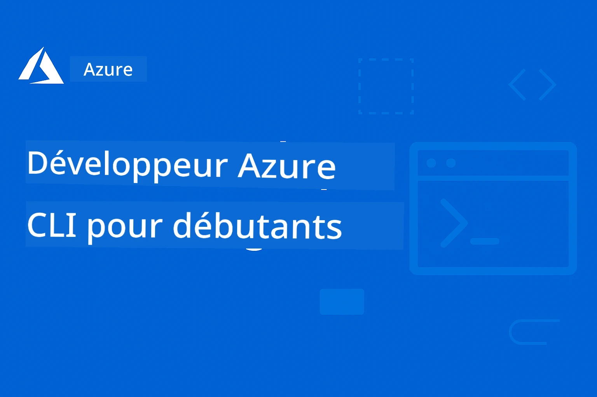

# AZD pour débutants : Un parcours d'apprentissage structuré

 

[](https://GitHub.com/microsoft/azd-for-beginners/watchers/)
[](https://GitHub.com/microsoft/azd-for-beginners/network/)
[](https://GitHub.com/microsoft/azd-for-beginners/stargazers/)

[](https://discord.com/invite/nkVh3dp)
[](https://discord.gg/nTYy5BXMWG)

---

### Traductions Automatiques (Toujours à jour)

<!-- CO-OP TRANSLATOR LANGUAGES TABLE START -->
[Arabe](../ar/README.md) | [Bengali](../bn/README.md) | [Bulgare](../bg/README.md) | [Birman (Myanmar)](../my/README.md) | [Chinois (Simplifié)](../zh-CN/README.md) | [Chinois (Traditionnel, Hong Kong)](../zh-HK/README.md) | [Chinois (Traditionnel, Macao)](../zh-MO/README.md) | [Chinois (Traditionnel, Taïwan)](../zh-TW/README.md) | [Croate](../hr/README.md) | [Tchèque](../cs/README.md) | [Danois](../da/README.md) | [Néerlandais](../nl/README.md) | [Estonien](../et/README.md) | [Finnois](../fi/README.md) | [Français](./README.md) | [Allemand](../de/README.md) | [Grec](../el/README.md) | [Hébreu](../he/README.md) | [Hindi](../hi/README.md) | [Hongrois](../hu/README.md) | [Indonésien](../id/README.md) | [Italien](../it/README.md) | [Japonais](../ja/README.md) | [Kannada](../kn/README.md) | [Khmer](../km/README.md) | [Coréen](../ko/README.md) | [Lituanien](../lt/README.md) | [Malais](../ms/README.md) | [Malayalam](../ml/README.md) | [Marathi](../mr/README.md) | [Népalais](../ne/README.md) | [Pidgin nigérian](../pcm/README.md) | [Norvégien](../no/README.md) | [Persan (Farsi)](../fa/README.md) | [Polonais](../pl/README.md) | [Portugais (Brésil)](../pt-BR/README.md) | [Portugais (Portugal)](../pt-PT/README.md) | [Pendjabi (Gurmukhi)](../pa/README.md) | [Roumain](../ro/README.md) | [Russe](../ru/README.md) | [Serbe (Cyrillique)](../sr/README.md) | [Slovaque](../sk/README.md) | [Slovène](../sl/README.md) | [Espagnol](../es/README.md) | [Swahili](../sw/README.md) | [Suédois](../sv/README.md) | [Tagalog (Filipino)](../tl/README.md) | [Tamoul](../ta/README.md) | [Télougou](../te/README.md) | [Thaï](../th/README.md) | [Turc](../tr/README.md) | [Ukrainien](../uk/README.md) | [Ourdou](../ur/README.md) | [Vietnamien](../vi/README.md)

> **Vous préférez cloner localement ?**
>
> Ce dépôt inclut plus de 50 traductions linguistiques, ce qui augmente considérablement la taille du téléchargement. Pour cloner sans les traductions, utilisez le sparse checkout :
>
> **Bash / macOS / Linux :**
> ```bash
> git clone --filter=blob:none --sparse https://github.com/microsoft/AZD-for-beginners.git
> cd AZD-for-beginners
> git sparse-checkout set --no-cone '/*' '!translations' '!translated_images'
> ```
>
> **CMD (Windows) :**
> ```cmd
> git clone --filter=blob:none --sparse https://github.com/microsoft/AZD-for-beginners.git
> cd AZD-for-beginners
> git sparse-checkout set --no-cone "/*" "!translations" "!translated_images"
> ```
>
> Cela vous donne tout ce dont vous avez besoin pour compléter le cours avec un téléchargement beaucoup plus rapide.
<!-- CO-OP TRANSLATOR LANGUAGES TABLE END -->

## 🆕 Quoi de neuf aujourd'hui dans azd

Azure Developer CLI s'est étendu au-delà des applications web et API traditionnelles. Aujourd'hui, azd est l'outil unique pour déployer **n'importe quelle** application sur Azure — y compris les applications alimentées par l'IA et les agents intelligents.

Voici ce que cela signifie pour vous :

- **Les agents IA sont désormais des charges de travail azd de première classe.** Vous pouvez initialiser, déployer et gérer des projets d'agents IA en utilisant le même workflow `azd init` → `azd up` que vous connaissez déjà.
- **L'intégration Microsoft Foundry** apporte le déploiement de modèles, l'hébergement d’agents et la configuration des services IA directement dans l’écosystème des modèles azd.
- **Le workflow principal n’a pas changé.** Que vous déployiez une application todo, un microservice ou une solution IA multi-agent, les commandes sont les mêmes.

Si vous avez déjà utilisé azd, la prise en charge de l'IA est une extension naturelle — pas un outil séparé ni un parcours avancé. Si vous commencez fraîchement, vous apprendrez un seul workflow qui fonctionne pour tout.

---

## 🚀 Qu'est-ce que Azure Developer CLI (azd) ?

**Azure Developer CLI (azd)** est un outil en ligne de commande convivial pour les développeurs qui facilite le déploiement d'applications sur Azure. Au lieu de créer et connecter manuellement des dizaines de ressources Azure, vous pouvez déployer des applications entières avec une seule commande.

### La magie de `azd up`

```bash
# Cette commande unique fait tout :
# ✅ Crée toutes les ressources Azure
# ✅ Configure le réseau et la sécurité
# ✅ Construit le code de votre application
# ✅ Déploie sur Azure
# ✅ Vous fournit une URL fonctionnelle
azd up
```

**C’est tout !** Pas de clics dans le portail Azure, pas de modèles ARM complexes à apprendre au préalable, pas de configuration manuelle – juste des applications opérationnelles sur Azure.

---

## ❓ Azure Developer CLI vs Azure CLI : Quelle différence ?

C'est la question la plus courante pour les débutants. Voici la réponse simple :

| Fonctionnalité | **Azure CLI (`az`)** | **Azure Developer CLI (`azd`)** |
|----------------|----------------------|---------------------------------|
| **Objectif** | Gérer des ressources Azure individuelles | Déployer des applications complètes |
| **Approche** | Axée sur l'infrastructure | Axée sur l'application |
| **Exemple** | `az webapp create --name myapp...` | `azd up` |
| **Courbe d'apprentissage** | Connaître les services Azure | Connaître votre application |
| **Destiné à** | DevOps, Infrastructure | Développeurs, prototypage |

### Analogie simple

- **Azure CLI** est comme avoir tous les outils pour construire une maison - marteaux, scies, clous. Vous pouvez tout construire, mais vous devez connaître la construction.
- **Azure Developer CLI** est comme engager un entrepreneur - vous décrivez ce que vous voulez, et il gère la construction.

### Quand utiliser lequel

| Scénario | Utilisez celui-ci |
|----------|-------------------|
| "Je veux déployer rapidement mon application web" | `azd up` |
| "Je dois créer juste un compte de stockage" | `az storage account create` |
| "Je construis une application IA complète" | `azd init --template azure-search-openai-demo` |
| "Je dois débuguer une ressource Azure spécifique" | `az resource show` |
| "Je veux un déploiement prêt pour la production en quelques minutes" | `azd up --environment production` |

### Ils fonctionnent ensemble !

AZD utilise Azure CLI en arrière-plan. Vous pouvez utiliser les deux :
```bash
# Déployez votre application avec AZD
azd up

# Ensuite, affinez des ressources spécifiques avec Azure CLI
az webapp config set --name myapp --always-on true
```

---

## 🌟 Trouvez des modèles dans Awesome AZD

Ne partez pas de zéro ! **Awesome AZD** est la collection communautaire de modèles prêts à déployer :

| Ressource | Description |
|-----------|-------------|
| 🔗 [**Galerie Awesome AZD**](https://azure.github.io/awesome-azd/) | Parcourez plus de 200 modèles avec un déploiement en un clic |
| 🔗 [**Soumettre un modèle**](https://github.com/Azure/awesome-azd/issues) | Contribuez votre propre modèle à la communauté |
| 🔗 [**Répertoire GitHub**](https://github.com/Azure/awesome-azd) | Étoilez et explorez les sources |

### Modèles IA populaires d’Awesome AZD

```bash
# Chat RAG avec les modèles Microsoft Foundry + Recherche IA
azd init --template azure-search-openai-demo

# Application de chat IA rapide
azd init --template openai-chat-app-quickstart

# Agents d'IA avec les agents Foundry
azd init --template get-started-with-ai-agents
```

---

## 🎯 Commencer en 3 étapes

Avant de commencer, assurez-vous que votre machine est prête pour le modèle que vous souhaitez déployer :

**Windows :**
```powershell
.\validate-setup.ps1
```

**macOS / Linux :**
```bash
bash ./validate-setup.sh
```

Si un contrôle requis échoue, corrigez-le d’abord puis continuez avec le démarrage rapide.

### Étape 1 : Installer AZD (2 minutes)

**Windows :**
```powershell
winget install microsoft.azd
```

**macOS :**
```bash
brew tap azure/azd && brew install azd
```

**Linux :**
```bash
curl -fsSL https://aka.ms/install-azd.sh | bash
```

### Étape 2 : Authentifiez-vous pour AZD

```bash
# Optionnel si vous prévoyez d'utiliser directement des commandes Azure CLI dans ce cours
az login

# Requis pour les workflows AZD
azd auth login
```

Si vous ne savez pas lequel choisir, suivez le flux complet d’installation dans [Installation & Setup](docs/chapter-01-foundation/installation.md#authentication-setup).

### Étape 3 : Déployez votre première application

```bash
# Initialiser à partir d'un modèle
azd init --template todo-nodejs-mongo

# Déployer sur Azure (crée tout !)
azd up
```

**🎉 C’est tout !** Votre application est désormais en ligne sur Azure.

### Nettoyage (N'oubliez pas !)

```bash
# Remove all resources when done experimenting
azd down --force --purge
```

---

## 📚 Comment utiliser ce cours

Ce cours est conçu pour un **apprentissage progressif** — commencez là où vous êtes à l’aise et progressez à votre rythme :

| Votre expérience | Commencez ici |
|------------------|--------------|
| **Nouveau sur Azure** | [Chapitre 1 : Fondations](#-chapter-1-foundation--quick-start) |
| **Connaissance d’Azure, nouveau sur AZD** | [Chapitre 1 : Fondations](#-chapter-1-foundation--quick-start) |
| **Envie de déployer des applications IA** | [Chapitre 2 : Développement AI-First](#-chapter-2-ai-first-development-recommended-for-ai-developers) |
| **Envie de pratiquer en mains propres** | [🎓 Atelier interactif](workshop/README.md) - labo guidé de 3-4 heures |
| **Besoin de modèles pour la production** | [Chapitre 8 : Production & Entreprise](#-chapter-8-production--enterprise-patterns) |

### Installation rapide

1. **Forkez ce dépôt** : [](https://GitHub.com/microsoft/azd-for-beginners/fork)
2. **Clonez-le** : `git clone https://github.com/YOUR-USERNAME/azd-for-beginners.git`
3. **Obtenez de l’aide** : [Communauté Azure Discord](https://discord.com/invite/ByRwuEEgH4)

> **Vous préférez cloner localement ?**

> Ce dépôt inclut plus de 50 traductions linguistiques, ce qui augmente considérablement la taille du téléchargement. Pour cloner sans les traductions, utilisez le sparse checkout :
> ```bash
> git clone --filter=blob:none --sparse https://github.com/microsoft/AZD-for-beginners.git
> cd AZD-for-beginners
> git sparse-checkout set --no-cone '/*' '!translations' '!translated_images'
> ```
> Cela vous donne tout ce dont vous avez besoin pour compléter le cours avec un téléchargement beaucoup plus rapide.


## Aperçu du cours

Maîtrisez Azure Developer CLI (azd) à travers des chapitres structurés conçus pour l'apprentissage progressif. **Focalisation spéciale sur le déploiement d’applications IA avec intégration Microsoft Foundry.**

### Pourquoi ce cours est essentiel pour les développeurs modernes

D’après les retours de la communauté Microsoft Foundry Discord, **45% des développeurs veulent utiliser AZD pour les charges IA** mais rencontrent des difficultés avec :
- Architectures IA multi-services complexes
- Bonnes pratiques pour le déploiement IA en production  
- Intégration et configuration des services IA Azure
- Optimisation des coûts pour charges IA
- Résolution de problèmes spécifiques au déploiement IA

### Objectifs d’apprentissage

En suivant ce cours structuré, vous allez :
- **Maîtriser les fondamentaux d’AZD** : concepts clés, installation et configuration
- **Déployer des applications IA** : utiliser AZD avec les services Microsoft Foundry
- **Implémenter l’infrastructure as code** : gérer les ressources Azure avec des templates Bicep
- **Résoudre les problèmes de déploiement** : détection et résolution des erreurs courantes
- **Optimiser pour la production** : sécurité, montée en charge, surveillance, gestion des coûts
- **Construire des solutions multi-agents** : déployer des architectures IA complexes

## Avant de commencer : comptes, accès et hypothèses

Avant de débuter le Chapitre 1, assurez-vous d’avoir ce qui suit. Les étapes d’installation ultérieures dans ce guide supposent que ces bases sont déjà en place.
- **Un abonnement Azure** : Vous pouvez utiliser un abonnement existant de votre travail ou de votre propre compte, ou créer un [essai gratuit](https://aka.ms/azurefreetrial) pour commencer.
- **Autorisation de créer des ressources Azure** : Pour la plupart des exercices, vous devez avoir au moins un accès **Contributeur** sur l’abonnement ou le groupe de ressources cible. Certains chapitres supposent aussi que vous pouvez créer des groupes de ressources, des identités managées et des attributions RBAC.
- [**Un compte GitHub**](https://github.com) : Utile pour forker le dépôt, suivre vos propres modifications et utiliser GitHub Codespaces pour l’atelier.
- **Prérequis d’exécution des modèles** : Certains modèles nécessitent des outils locaux tels que Node.js, Python, Java ou Docker. Exécutez le validateur d’installation avant de commencer pour détecter rapidement tout outil manquant.
- **Familiarité de base avec le terminal** : Vous n’avez pas besoin d’être expert, mais vous devriez être à l’aise pour exécuter des commandes comme `git clone`, `azd auth login` et `azd up`.

> **Vous travaillez dans un abonnement d’entreprise ?**  
> Si votre environnement Azure est géré par un administrateur, confirmez à l’avance que vous pouvez déployer des ressources dans l’abonnement ou le groupe de ressources que vous comptez utiliser. Sinon, demandez un abonnement sandbox ou un accès Contributeur avant de commencer.

> **Nouveau sur Azure ?**  
> Commencez par votre propre essai Azure ou abonnement à la consommation à https://aka.ms/azurefreetrial afin de pouvoir compléter les exercices de bout en bout sans attendre des validations au niveau du locataire.

## 🗺️ Carte du cours : Navigation rapide par chapitre

Chaque chapitre dispose d’un README dédié avec les objectifs d’apprentissage, démarrages rapides et exercices :

| Chapitre | Sujet | Leçons | Durée | Complexité |
|---------|-------|---------|----------|------------|
| **[Ch 1 : Fondations](docs/chapter-01-foundation/README.md)** | Premiers pas | [Bases de AZD](docs/chapter-01-foundation/azd-basics.md) &#124; [Installation](docs/chapter-01-foundation/installation.md) &#124; [Premier projet](docs/chapter-01-foundation/first-project.md) | 30 à 45 min | ⭐ |
| **[Ch 2 : Développement IA](docs/chapter-02-ai-development/README.md)** | Applications AI-First | [Intégration Foundry](docs/chapter-02-ai-development/microsoft-foundry-integration.md) &#124; [Agents IA](docs/chapter-02-ai-development/agents.md) &#124; [Déploiement modèle IA](docs/chapter-02-ai-development/ai-model-deployment.md) &#124; [Atelier](docs/chapter-02-ai-development/ai-workshop-lab.md) | 1 à 2 h | ⭐⭐ |
| **[Ch 3 : Configuration](docs/chapter-03-configuration/README.md)** | Authentification & Sécurité | [Configuration](docs/chapter-03-configuration/configuration.md) &#124; [Auth & Sécurité](docs/chapter-03-configuration/authsecurity.md) | 45 à 60 min | ⭐⭐ |
| **[Ch 4 : Infrastructure](docs/chapter-04-infrastructure/README.md)** | IaC & Déploiement | [Guide de déploiement](docs/chapter-04-infrastructure/deployment-guide.md) &#124; [Provisionnement](docs/chapter-04-infrastructure/provisioning.md) | 1 à 1,5 h | ⭐⭐⭐ |
| **[Ch 5 : Multi-Agent](docs/chapter-05-multi-agent/README.md)** | Solutions AI multi-agent | [Scénario Retail](examples/retail-scenario.md) &#124; [Patrons de coordination](docs/chapter-06-pre-deployment/coordination-patterns.md) | 2 à 3 h | ⭐⭐⭐⭐ |
| **[Ch 6 : Pré-Déploiement](docs/chapter-06-pre-deployment/README.md)** | Planification & Validation | [Vérifications préalables](docs/chapter-06-pre-deployment/preflight-checks.md) &#124; [Planification capacité](docs/chapter-06-pre-deployment/capacity-planning.md) &#124; [Choix SKU](docs/chapter-06-pre-deployment/sku-selection.md) &#124; [App Insights](docs/chapter-06-pre-deployment/application-insights.md) | 1 h | ⭐⭐ |
| **[Ch 7 : Dépannage](docs/chapter-07-troubleshooting/README.md)** | Debug & Correction | [Problèmes courants](docs/chapter-07-troubleshooting/common-issues.md) &#124; [Debugging](docs/chapter-07-troubleshooting/debugging.md) &#124; [Problèmes IA](docs/chapter-07-troubleshooting/ai-troubleshooting.md) | 1 à 1,5 h | ⭐⭐ |
| **[Ch 8 : Production](docs/chapter-08-production/README.md)** | Patrons en entreprise | [Bonnes pratiques production](docs/chapter-08-production/production-ai-practices.md) | 2 à 3 h | ⭐⭐⭐⭐ |
| **[🎓 Atelier](workshop/README.md)** | Laboratoire pratique | [Introduction](workshop/docs/instructions/0-Introduction.md) &#124; [Sélection](workshop/docs/instructions/1-Select-AI-Template.md) &#124; [Validation](workshop/docs/instructions/2-Validate-AI-Template.md) &#124; [Déconstruction](workshop/docs/instructions/3-Deconstruct-AI-Template.md) &#124; [Configuration](workshop/docs/instructions/4-Configure-AI-Template.md) &#124; [Personnalisation](workshop/docs/instructions/5-Customize-AI-Template.md) &#124; [Suppression](workshop/docs/instructions/6-Teardown-Infrastructure.md) &#124; [Conclusion](workshop/docs/instructions/7-Wrap-up.md) | 3 à 4 h | ⭐⭐ |

**Durée totale du cours :** ~10-14 heures | **Progression des compétences :** Débutant → Prêt pour production

---

## 📚 Chapitres d’apprentissage

*Choisissez votre parcours d’apprentissage selon votre niveau et vos objectifs*

### 🚀 Chapitre 1 : Fondations et démarrage rapide  
**Prérequis** : abonnement Azure, connaissances de base en ligne de commande  
**Durée** : 30-45 minutes  
**Complexité** : ⭐

#### Ce que vous apprendrez  
- Comprendre les fondamentaux de l’Azure Developer CLI  
- Installer AZD sur votre plateforme  
- Votre premier déploiement réussi

#### Ressources d’apprentissage  
- **🎯 Commencez ici** : [Qu’est-ce que Azure Developer CLI ?](#what-is-azure-developer-cli)  
- **📖 Théorie** : [Bases AZD](docs/chapter-01-foundation/azd-basics.md) - Concepts clés et terminologie  
- **⚙️ Installation** : [Installation & Configuration](docs/chapter-01-foundation/installation.md) - Guides spécifiques à la plateforme  
- **🛠️ Pratique** : [Premier projet](docs/chapter-01-foundation/first-project.md) - Tutoriel pas à pas  
- **📋 Référence rapide** : [Fiche de commandes](resources/cheat-sheet.md)

#### Exercices pratiques  
```bash
# Vérification rapide de l'installation
azd version

# Déployez votre première application
azd init --template todo-nodejs-mongo
azd up
```
  
**💡 Résultat Chapitre** : Déployer avec succès une application web simple sur Azure avec AZD

**✅ Validation du succès :**  
```bash
# Après avoir terminé le Chapitre 1, vous devriez être capable de :
azd version              # Affiche la version installée
azd init --template todo-nodejs-mongo  # Initialise le projet
azd up                  # Déploie sur Azure
azd show                # Affiche l'URL de l'application en cours d'exécution
# L'application s'ouvre dans le navigateur et fonctionne
azd down --force --purge  # Nettoie les ressources
```
  
**📊 Temps estimé :** 30-45 minutes  
**📈 Niveau après :** Capable de déployer des applications basiques de manière autonome  
**📈 Niveau après :** Capable de déployer des applications basiques de manière autonome

---

### 🤖 Chapitre 2 : Développement IA-First (Recommandé pour les développeurs IA)  
**Prérequis** : Chapitre 1 terminé  
**Durée** : 1-2 heures  
**Complexité** : ⭐⭐

#### Ce que vous apprendrez  
- Intégration Microsoft Foundry avec AZD  
- Déploiement d’applications alimentées par l’IA  
- Comprendre les configurations des services IA

#### Ressources d’apprentissage  
- **🎯 Commencez ici** : [Intégration Microsoft Foundry](docs/chapter-02-ai-development/microsoft-foundry-integration.md)  
- **🤖 Agents IA** : [Guide Agents IA](docs/chapter-02-ai-development/agents.md) - Déployer des agents intelligents avec AZD  
- **📖 Patrons** : [Déploiement modèle IA](docs/chapter-02-ai-development/ai-model-deployment.md) - Déployer et gérer des modèles IA  
- **🛠️ Atelier** : [Atelier IA](docs/chapter-02-ai-development/ai-workshop-lab.md) - Rendre vos solutions IA compatibles AZD  
- **🎥 Guide interactif** : [Matériel Atelier](workshop/README.md) - Apprentissage en navigateur avec MkDocs * Environnement DevContainer  
- **📋 Modèles** : [Modèles Microsoft Foundry](#ressources-de-l’atelier)  
- **📝 Exemples** : [Exemples déploiement AZD](examples/README.md)

#### Exercices pratiques  
```bash
# Déployez votre première application IA
azd init --template azure-search-openai-demo
azd up

# Essayez des modèles IA supplémentaires
azd init --template openai-chat-app-quickstart
azd init --template agent-openai-python-prompty
```
  
**💡 Résultat Chapitre** : Déployer et configurer une application de chat IA avec capacités RAG

**✅ Validation du succès :**  
```bash
# Après le chapitre 2, vous devriez être capable de :
azd init --template azure-search-openai-demo
azd up
# Tester l'interface de chat IA
# Poser des questions et obtenir des réponses alimentées par l'IA avec des sources
# Vérifier que l'intégration de la recherche fonctionne
azd monitor  # Vérifier qu'Application Insights affiche la télémétrie
azd down --force --purge
```
  
**📊 Temps estimé :** 1-2 heures  
**📈 Niveau après :** Capable de déployer et configurer des applications IA prêtes pour la production  
**💰 Sensibilisation aux coûts :** Comprendre 80-150$/mois en dev, 300-3500$/mois en production

#### 💰 Considérations sur les coûts des déploiements IA

**Environnement de développement (estimé à 80-150$/mois) :**  
- Modèles Microsoft Foundry (paiement à l’usage) : 0-50$/mois (en fonction de l’usage des tokens)  
- Recherche IA (niveau Basic) : 75$/mois  
- Container Apps (consommation) : 0-20$/mois  
- Stockage (Standard) : 1-5$/mois

**Environnement de production (estimé à 300-3 500+$/mois) :**  
- Modèles Microsoft Foundry (PTU pour performance constante) : 3 000+$/mois OU paiement à l’usage avec volume élevé  
- Recherche IA (niveau Standard) : 250$/mois  
- Container Apps (dédié) : 50-100$/mois  
- Application Insights : 5-50$/mois  
- Stockage (Premium) : 10-50$/mois

**💡 Conseils d’optimisation des coûts :**  
- Utilisez les modèles Microsoft Foundry en **niveau gratuit** pour apprendre (Azure OpenAI inclut 50 000 tokens/mois)  
- Exécutez `azd down` pour désallouer les ressources quand vous ne développez pas activement  
- Commencez par une facturation à la consommation, passez au PTU uniquement en production  
- Utilisez `azd provision --preview` pour estimer les coûts avant déploiement  
- Activez l’auto-scaling : payez uniquement l’usage réel

**Surveillance des coûts :**  
```bash
# Vérifier les coûts mensuels estimés
azd provision --preview

# Surveiller les coûts réels dans le portail Azure
az consumption budget list --resource-group <your-rg>
```
  
---

### ⚙️ Chapitre 3 : Configuration & Authentification  
**Prérequis** : Chapitre 1 terminé  
**Durée** : 45-60 minutes  
**Complexité** : ⭐⭐

#### Ce que vous apprendrez  
- Configuration et gestion des environnements  
- Bonnes pratiques en authentification et sécurité  
- Nommage et organisation des ressources

#### Ressources d’apprentissage  
- **📖 Configuration** : [Guide de configuration](docs/chapter-03-configuration/configuration.md) - Mise en place des environnements  
- **🔐 Sécurité** : [Patrons d’authentification et identité managée](docs/chapter-03-configuration/authsecurity.md)  
- **📝 Exemples** : [Exemple d’application base de données](examples/database-app/README.md) - Exemples AZD bases de données

#### Exercices pratiques  
- Configurer plusieurs environnements (dev, staging, prod)  
- Mettre en place une authentification par identité managée  
- Implémenter des configurations spécifiques par environnement

**💡 Résultat Chapitre** : Gérer plusieurs environnements avec authentification et sécurité adéquates

---

### 🏗️ Chapitre 4 : Infrastructure en tant que Code & Déploiement  
**Prérequis** : Chapitres 1-3 terminés  
**Durée** : 1 à 1,5 heures  
**Complexité** : ⭐⭐⭐

#### Ce que vous apprendrez  
- Patrons avancés de déploiement  
- Infrastructure as Code avec Bicep  
- Stratégies de provisionnement de ressources

#### Ressources d’apprentissage  
- **📖 Déploiement** : [Guide de déploiement](docs/chapter-04-infrastructure/deployment-guide.md) - Workflows complets  
- **🏗️ Provisionnement** : [Provisionnement ressources](docs/chapter-04-infrastructure/provisioning.md) - Gestion des ressources Azure  
- **📝 Exemples** : [Exemple Container App](../../examples/container-app) - Déploiements conteneurisés

#### Exercices pratiques  
- Créer des templates Bicep personnalisés  
- Déployer des applications multi-services  
- Implémenter des stratégies de déploiement blue-green

**💡 Résultat Chapitre** : Déployer des applications multi-services complexes avec des templates d’infrastructure personnalisés

---

### 🎯 Chapitre 5 : Solutions IA Multi-Agent (Avancé)  
**Prérequis** : Chapitres 1-2 terminés  
**Durée** : 2 à 3 heures  
**Complexité** : ⭐⭐⭐⭐

#### Ce que vous apprendrez  
- Patrons d’architecture multi-agent  
- Orchestration et coordination d’agents  
- Déploiements IA prêts pour production

#### Ressources d’apprentissage  
- **🤖 Projet phare** : [Solution multi-agent Retail](examples/retail-scenario.md) - Implémentation complète  
- **🛠️ Templates ARM** : [Package template ARM multi-agent retail](../../examples/retail-multiagent-arm-template) - Déploiement en un clic  
- **📖 Architecture** : [Patrons de coordination multi-agent](docs/chapter-06-pre-deployment/coordination-patterns.md) - Patrons

#### Exercices pratiques  
```bash
# Déployer la solution complète multi-agent de vente au détail
cd examples/retail-multiagent-arm-template
./deploy.sh

# Explorer les configurations des agents
az deployment group show --resource-group <rg-name> --name <deployment-name>
```
  
**💡 Résultat Chapitre** : Déployer et gérer une solution IA multi-agent prête pour la production avec agents Client et Inventaire

---

### 🔍 Chapitre 6 : Validation & Planification Pré-Déploiement  
**Prérequis** : Chapitre 4 terminé  
**Durée** : 1 heure  
**Complexité** : ⭐⭐
#### Ce que vous apprendrez
- Planification de la capacité et validation des ressources
- Stratégies de sélection des SKU
- Contrôles préalables et automatisation

#### Ressources d'apprentissage
- **📊 Planification** : [Planification de la capacité](docs/chapter-06-pre-deployment/capacity-planning.md) – Validation des ressources
- **💰 Sélection** : [Sélection des SKU](docs/chapter-06-pre-deployment/sku-selection.md) – Choix rentables
- **✅ Validation** : [Contrôles préalables](docs/chapter-06-pre-deployment/preflight-checks.md) – Scripts automatisés

#### Exercices pratiques
- Exécuter les scripts de validation de capacité
- Optimiser les sélections de SKU pour le coût
- Mettre en œuvre des contrôles automatisés avant déploiement

**💡 Résultat du chapitre** : Valider et optimiser les déploiements avant exécution

---

### 🚨 Chapitre 7 : Dépannage & Debugging
**Prérequis** : Tout chapitre de déploiement terminé  
**Durée** : 1 à 1,5 heure  
**Complexité** : ⭐⭐

#### Ce que vous apprendrez
- Approches systémiques de débogage
- Problèmes courants et solutions
- Dépannage spécifique à l'IA

#### Ressources d'apprentissage
- **🔧 Problèmes courants** : [Problèmes courants](docs/chapter-07-troubleshooting/common-issues.md) – FAQ et solutions
- **🕵️ Guide de débogage** : [Guide de débogage](docs/chapter-07-troubleshooting/debugging.md) – Stratégies étape par étape
- **🤖 Problèmes IA** : [Dépannage spécifique à l'IA](docs/chapter-07-troubleshooting/ai-troubleshooting.md) – Problèmes des services IA

#### Exercices pratiques
- Diagnostiquer les échecs de déploiement
- Résoudre les problèmes d'authentification
- Debuguer la connectivité des services IA

**💡 Résultat du chapitre** : Diagnostiquer et résoudre de manière autonome les problèmes courants de déploiement

---

### 🏢 Chapitre 8 : Production & Modèles Entreprise
**Prérequis** : Chapitres 1 à 4 terminés  
**Durée** : 2 à 3 heures  
**Complexité** : ⭐⭐⭐⭐

#### Ce que vous apprendrez
- Stratégies de déploiement en production
- Modèles de sécurité d'entreprise
- Surveillance et optimisation des coûts

#### Ressources d'apprentissage
- **🏭 Production** : [Bonnes pratiques IA en production](docs/chapter-08-production/production-ai-practices.md) – Modèles d'entreprise
- **📝 Exemples** : [Exemple microservices](../../examples/microservices) – Architectures complexes
- **📊 Surveillance** : [Intégration Application Insights](docs/chapter-06-pre-deployment/application-insights.md) – Surveillance

#### Exercices pratiques
- Mettre en œuvre des modèles de sécurité d'entreprise
- Configurer une surveillance complète
- Déployer en production avec gouvernance appropriée

**💡 Résultat du chapitre** : Déployer des applications prêtes pour l’entreprise avec toutes les capacités de production

---

## 🎓 Aperçu de l’atelier : Expérience d’apprentissage pratique

> **⚠️ STATUT DE L’ATELIER : Développement actif**  
> Les supports de l’atelier sont en cours de développement et d’affinement. Les modules principaux fonctionnent, mais certaines sections avancées sont incomplètes. Nous travaillons activement à finaliser tout le contenu. [Suivre la progression →](workshop/README.md)

### Supports interactifs de l’atelier
**Apprentissage pratique complet avec outils en navigateur et exercices guidés**

Nos supports d’atelier offrent une expérience d’apprentissage structurée et interactive qui complète le cursus en chapitres ci-dessus. L’atelier est conçu pour un apprentissage autonome et des sessions dirigées par un instructeur.

#### 🛠️ Caractéristiques de l’atelier
- **Interface basée sur navigateur** : Atelier complet propulsé par MkDocs avec recherche, copie et fonctionnalités de thème
- **Intégration GitHub Codespaces** : Configuration d’environnement de développement en un clic
- **Parcours d’apprentissage structuré** : 8 modules avec exercices guidés (3-4 heures au total)
- **Méthodologie progressive** : Introduction → Sélection → Validation → Déconstruction → Configuration → Personnalisation → Démantèlement → Conclusion
- **Environnement DevContainer interactif** : Outils et dépendances préconfigurés

#### 📚 Structure des modules de l’atelier
L’atelier suit une **méthodologie progressive en 8 modules** vous menant de la découverte à la maîtrise du déploiement :

| Module | Sujet | Ce que vous ferez | Durée |
|--------|-------|-------------------|-------|
| **0. Introduction** | Aperçu de l’atelier | Comprendre objectifs, prérequis et structure de l’atelier | 15 min |
| **1. Sélection** | Découverte des templates | Explorer les modèles AZD et choisir celui adapté à votre scénario IA | 20 min |
| **2. Validation** | Déployer & vérifier | Déployer le modèle avec `azd up` et valider le fonctionnement de l’infrastructure | 30 min |
| **3. Déconstruction** | Comprendre la structure | Utiliser GitHub Copilot pour explorer architecture, fichiers Bicep et organisation du code | 30 min |
| **4. Configuration** | Plongée dans azure.yaml | Maîtriser la configuration `azure.yaml`, hooks du cycle de vie, variables d’environnement | 30 min |
| **5. Personnalisation** | Adaptez à votre scénario | Activer AI Search, tracing, évaluation et personnaliser pour votre cas | 45 min |
| **6. Démantèlement** | Nettoyer | Supprimer proprement les ressources avec `azd down --purge` | 15 min |
| **7. Conclusion** | Prochaines étapes | Revue des acquis, concepts clés, poursuite de l’apprentissage | 15 min |

**Flux de l’atelier :**  
```
Introduction → Selection → Validation → Deconstruction → Configuration → Customization → Teardown → Wrap-up
     ↓            ↓           ↓              ↓               ↓              ↓            ↓           ↓
  Overview    Find the     Deploy &      Explore        Master         Customize     Clean up    Review &
             right        verify        code &        azure.yaml      for your      resources   next steps
             template                   structure                     scenario
```
  
#### 🚀 Démarrage de l’atelier  
```bash
# Option 1 : GitHub Codespaces (Recommandé)
# Cliquez sur "Code" → "Créer un codespace sur main" dans le dépôt

# Option 2 : Développement local
git clone https://github.com/microsoft/azd-for-beginners.git
cd azd-for-beginners/workshop
# Suivez les instructions d'installation dans workshop/README.md
```
  
#### 🎯 Résultats d’apprentissage de l’atelier  
En complétant l’atelier, les participants seront capables de :  
- **Déployer des applications IA en production** : Utiliser AZD avec les services Microsoft Foundry  
- **Maîtriser les architectures multi-agents** : Implémenter des solutions d’agents IA coordonnées  
- **Appliquer les meilleures pratiques de sécurité** : Configurer authentification et contrôle d’accès  
- **Optimiser pour la montée en charge** : Concevoir des déploiements performants et rentables  
- **Dépanner les déploiements** : Résoudre les problèmes courants de manière autonome

#### 📖 Ressources de l’atelier
- **🎥 Guide interactif** : [Supports de l’atelier](workshop/README.md) – Environnement d’apprentissage en navigateur
- **📋 Instructions module par module** :
  - [0. Introduction](workshop/docs/instructions/0-Introduction.md) – Aperçu et objectifs
  - [1. Sélection](workshop/docs/instructions/1-Select-AI-Template.md) – Trouver et choisir un template IA
  - [2. Validation](workshop/docs/instructions/2-Validate-AI-Template.md) – Déployer et valider les modèles
  - [3. Déconstruction](workshop/docs/instructions/3-Deconstruct-AI-Template.md) – Explorer l’architecture du template
  - [4. Configuration](workshop/docs/instructions/4-Configure-AI-Template.md) – Maîtriser azure.yaml
  - [5. Personnalisation](workshop/docs/instructions/5-Customize-AI-Template.md) – Adapter au cas d’usage
  - [6. Démantèlement](workshop/docs/instructions/6-Teardown-Infrastructure.md) – Supprimer les ressources
  - [7. Conclusion](workshop/docs/instructions/7-Wrap-up.md) – Bilan et suite
- **🛠️ Laboratoire IA Atelier** : [Laboratoire IA Atelier](docs/chapter-02-ai-development/ai-workshop-lab.md) – Exercices centrés IA
- **💡 Démarrage rapide** : [Guide de configuration de l’atelier](workshop/README.md#quick-start) – Configuration de l’environnement

**Idéal pour** : Formation en entreprise, cursus universitaires, apprentissage autonome et bootcamps développeurs.

---

## 📖 Approfondissement : Capacités d’AZD

Au-delà des bases, AZD fournit des fonctionnalités puissantes pour les déploiements en production :

- **Déploiements basés sur templates** – Utiliser des modèles pré-construits pour des patrons d’application courants
- **Infrastructure as Code** – Gérer les ressources Azure avec Bicep ou Terraform  
- **Flux de travail intégrés** – Provisionner, déployer et surveiller les applications de façon fluide
- **Orienté développeur** – Optimisé pour la productivité et l’expérience développeur

### **AZD + Microsoft Foundry : Parfait pour les déploiements IA**

**Pourquoi AZD pour les solutions IA ?** AZD répond aux principaux défis rencontrés par les développeurs IA :

- **Templates prêts pour IA** – Modèles préconfigurés pour Microsoft Foundry Models, services cognitifs et charges ML
- **Déploiements IA sécurisés** – Modèles de sécurité intégrés pour services IA, clés API et points de terminaison de modèles  
- **Modèles IA en production** – Bonnes pratiques pour applications IA scalables et rentables
- **Flux IA de bout en bout** – Du développement du modèle au déploiement production avec surveillance adéquate
- **Optimisation des coûts** – Allocation intelligente des ressources et stratégies de montée en charge pour IA
- **Intégration Microsoft Foundry** – Connexion fluide au catalogue de modèles et points de terminaison Foundry

---

## 🎯 Bibliothèque de templates & exemples

### À la une : Templates Microsoft Foundry  
**Commencez ici si vous déployez des applications IA !**

> **Note :** Ces templates démontrent divers modèles IA. Certains sont des échantillons Azure externes, d’autres des implémentations locales.

| Template | Chapitre | Complexité | Services | Type |
|----------|----------|------------|----------|------|
| [**Get started with AI chat**](https://github.com/Azure-Samples/get-started-with-ai-chat) | Chapitre 2 | ⭐⭐ | AzureOpenAI + Azure AI Model Inference API + Azure AI Search + Azure Container Apps + Application Insights | Externe |
| [**Get started with AI agents**](https://github.com/Azure-Samples/get-started-with-ai-agents) | Chapitre 2 | ⭐⭐ | Agents Foundry + AzureOpenAI + Azure AI Search + Azure Container Apps + Application Insights | Externe |
| [**Azure Search + OpenAI Demo**](https://github.com/Azure-Samples/azure-search-openai-demo) | Chapitre 2 | ⭐⭐ | AzureOpenAI + Azure AI Search + App Service + Stockage | Externe |
| [**OpenAI Chat App Quickstart**](https://github.com/Azure-Samples/openai-chat-app-quickstart) | Chapitre 2 | ⭐ | AzureOpenAI + Container Apps + Application Insights | Externe |
| [**Agent OpenAI Python Prompty**](https://github.com/Azure-Samples/agent-openai-python-prompty) | Chapitre 5 | ⭐⭐⭐ | AzureOpenAI + Azure Functions + Prompty | Externe |
| [**Contoso Chat RAG**](https://github.com/Azure-Samples/contoso-chat) | Chapitre 8 | ⭐⭐⭐⭐ | AzureOpenAI + AI Search + Cosmos DB + Container Apps | Externe |
| [**Retail Multi-Agent Solution**](examples/retail-scenario.md) | Chapitre 5 | ⭐⭐⭐⭐ | AzureOpenAI + AI Search + Stockage + Container Apps + Cosmos DB | **Local** |

### À la une : Scénarios d’apprentissage complets  
**Templates d’applications prêtes pour la production liés aux chapitres**

| Template | Chapitre d’apprentissage | Complexité | Apprentissage clé |
|----------|---------------------------|------------|-------------------|
| [**openai-chat-app-quickstart**](https://github.com/Azure-Samples/openai-chat-app-quickstart) | Chapitre 2 | ⭐ | Modèles de base de déploiement IA |
| [**azure-search-openai-demo**](https://github.com/Azure-Samples/azure-search-openai-demo) | Chapitre 2 | ⭐⭐ | Implémentation RAG avec Azure AI Search |
| [**ai-document-processing**](https://github.com/Azure-Samples/ai-document-processing) | Chapitre 4 | ⭐⭐ | Intégration Intelligence documentaire |
| [**agent-openai-python-prompty**](https://github.com/Azure-Samples/agent-openai-python-prompty) | Chapitre 5 | ⭐⭐⭐ | Framework agent et appels de fonctions |
| [**contoso-chat**](https://github.com/Azure-Samples/contoso-chat) | Chapitre 8 | ⭐⭐⭐ | Orchestration IA d’entreprise |
| [**retail-multi-agent-solution**](examples/retail-scenario.md) | Chapitre 5 | ⭐⭐⭐⭐ | Architecture multi-agent avec agents Client et Inventaire |

### Apprentissage par type d’exemple

> **📌 Exemples locaux vs externes :**  
> **Exemples locaux** (dans ce dépôt) = Utilisables immédiatement  
> **Exemples externes** (Azure Samples) = Cloner depuis les dépôts liés

#### Exemples locaux (prêts à l’usage)
- [**Retail Multi-Agent Solution**](examples/retail-scenario.md) – Implémentation complète prête pour production avec templates ARM
  - Architecture multi-agent (agents Client + Inventaire)
  - Surveillance et évaluation complètes
  - Déploiement en un clic via template ARM

#### Exemples locaux – Applications conteneurisées (chapitres 2-5)
**Exemples complets de déploiement conteneur dans ce dépôt :**
- [**Exemples d’applications conteneurisées**](examples/container-app/README.md) – Guide complet des déploiements conteneurisés
  - [API Flask simple](../../examples/container-app/simple-flask-api) – API REST basique avec scale-to-zero
  - [Architecture microservices](../../examples/container-app/microservices) – Déploiement multi-services prêt pour production
  - Modèles rapide, production et avancé
  - Guide sur surveillance, sécurité et optimisation des coûts

#### Exemples externes – Applications simples (chapitres 1-2)
**Cloner ces dépôts Azure Samples pour commencer :**
- [Application web simple - Node.js + MongoDB](https://github.com/Azure-Samples/todo-nodejs-mongo) – Modèles de déploiement basiques
- [Site statique - React SPA](https://github.com/Azure-Samples/todo-csharp-sql-swa-func) – Déploiement de contenu statique
- [Application conteneur - Python Flask](https://github.com/Azure-Samples/container-apps-store-api-microservice) – Déploiement API REST

#### Exemples externes – Intégration base de données (chapitres 3-4)  
- [Application Base de Données - C# + SQL](https://github.com/Azure-Samples/todo-csharp-sql) - Modèles de connectivité aux bases de données
- [Fonctions + Cosmos DB](https://github.com/Azure-Samples/todo-python-mongo-swa-func) - Workflow de données sans serveur

#### Exemples Externes - Modèles Avancés (Chapitres 4-8)
- [Microservices Java](https://github.com/Azure-Samples/java-microservices-aca-lab) - Architectures multi-services
- [Jobs Container Apps](https://github.com/Azure-Samples/container-apps-jobs) - Traitement en arrière-plan  
- [Pipeline ML Entreprise](https://github.com/Azure-Samples/mlops-v2) - Modèles ML prêts pour la production

### Collections de Templates Externes
- [**Galerie Officielle de Templates AZD**](https://azure.github.io/awesome-azd/) - Collection organisée de templates officiels et communautaires
- [**Templates Azure Developer CLI**](https://learn.microsoft.com/en-us/azure/developer/azure-developer-cli/azd-templates) - Documentation des templates Microsoft Learn
- [**Répertoire d’Exemples**](examples/README.md) - Exemples locaux d’apprentissage avec explications détaillées

---

## 📚 Ressources d’Apprentissage & Références

### Références Rapides
- [**Fiche Commandes**](resources/cheat-sheet.md) - Commandes azd essentielles organisées par chapitre
- [**Glossaire**](resources/glossary.md) - Terminologie Azure et azd  
- [**FAQ**](resources/faq.md) - Questions courantes organisées par chapitre d’apprentissage
- [**Guide d’Étude**](resources/study-guide.md) - Exercices pratiques complets

### Ateliers Pratiques
- [**Atelier AI**](docs/chapter-02-ai-development/ai-workshop-lab.md) - Rendre vos solutions IA déployables avec AZD (2-3 heures)
- [**Atelier Interactif**](workshop/README.md) - Exercices guidés en 8 modules avec MkDocs et GitHub Codespaces
  - Suit : Introduction → Sélection → Validation → Déconstruction → Configuration → Personnalisation → Démontage → Conclusion

### Ressources d’Apprentissage Externes
- [Documentation Azure Developer CLI](https://learn.microsoft.com/en-us/azure/developer/azure-developer-cli/)
- [Centre d’Architecture Azure](https://learn.microsoft.com/en-us/azure/architecture/)
- [Calculateur de Prix Azure](https://azure.microsoft.com/pricing/calculator/)
- [Statut Azure](https://status.azure.com/)

### Compétences Agents IA pour Votre Éditeur
- [**Compétences Microsoft Azure sur skills.sh**](https://skills.sh/microsoft/github-copilot-for-azure) - 37 compétences d’agents ouvertes pour Azure AI, Foundry, déploiement, diagnostics, optimisation des coûts, et plus. Installez-les dans GitHub Copilot, Cursor, Claude Code, ou tout agent supporté :
  ```bash
  npx skills add microsoft/github-copilot-for-azure
  ```

---

## 🔧 Guide Rapide de Dépannage

**Problèmes courants rencontrés par les débutants et solutions immédiates :**

<details>
<summary><strong>❌ "azd : commande introuvable"</strong></summary>

```bash
# Installer d'abord AZD
# Windows (PowerShell) :
winget install microsoft.azd

# macOS :
brew tap azure/azd && brew install azd

# Linux :
curl -fsSL https://aka.ms/install-azd.sh | bash

# Vérifier l'installation
azd version
```
</details>

<details>
<summary><strong>❌ "Aucun abonnement trouvé" ou "Abonnement non défini"</strong></summary>

```bash
# Lister les abonnements disponibles
az account list --output table

# Définir l'abonnement par défaut
az account set --subscription "<subscription-id-or-name>"

# Définir pour l'environnement AZD
azd env set AZURE_SUBSCRIPTION_ID "<subscription-id>"

# Vérifier
az account show
```
</details>

<details>
<summary><strong>❌ "Quota insuffisant" ou "Quota dépassé"</strong></summary>

```bash
# Essayez une autre région Azure
azd env set AZURE_LOCATION "westus2"
azd up

# Ou utilisez des SKU plus petits en développement
# Modifiez infra/main.parameters.json :
{
  "sku": "B1"  // Instead of "P1V2"
}
```
</details>

<details>
<summary><strong>❌ "azd up" échoue à mi-chemin</strong></summary>

```bash
# Option 1 : Nettoyer et réessayer
azd down --force --purge
azd up

# Option 2 : Réparer uniquement l'infrastructure
azd provision

# Option 3 : Vérifier le statut détaillé
azd show

# Option 4 : Vérifier les journaux dans Azure Monitor
azd monitor --logs
```
</details>

<details>
<summary><strong>❌ "Échec d’authentification" ou "Token expiré"</strong></summary>

```bash
# Ré-authentifiez-vous pour AZD
azd auth logout
azd auth login

# Optionnel : actualisez également Azure CLI si vous exécutez des commandes az
az logout
az login

# Vérifiez l'authentification
az account show
```
</details>

<details>
<summary><strong>❌ "Ressource déjà existante" ou conflits de noms</strong></summary>

```bash
# AZD génère des noms uniques, mais en cas de conflit :
azd down --force --purge

# Puis réessayez avec un nouvel environnement
azd env new dev-v2
azd up
```
</details>

<details>
<summary><strong>❌ Le déploiement du template prend trop de temps</strong></summary>

**Temps d’attente habituels :**
- Application web simple : 5-10 minutes
- Application avec base de données : 10-15 minutes
- Applications IA : 15-25 minutes (le provisioning OpenAI est lent)

```bash
# Vérifier la progression
azd show

# Si bloqué >30 minutes, vérifier le portail Azure :
azd monitor --overview
# Rechercher les déploiements échoués
```
</details>

<details>
<summary><strong>❌ "Permission refusée" ou "Interdit"</strong></summary>

```bash
# Vérifiez votre rôle Azure
az role assignment list --assignee $(az account show --query user.name -o tsv)

# Vous avez besoin d'au moins le rôle "Contributeur"
# Demandez à votre administrateur Azure d'accorder :
# - Contributeur (pour les ressources)
# - Administrateur de l'accès utilisateur (pour les affectations de rôles)
```
</details>

<details>
<summary><strong>❌ Impossible de trouver l’URL de l’application déployée</strong></summary>

```bash
# Afficher tous les points de terminaison du service
azd show

# Ou ouvrir le portail Azure
azd monitor

# Vérifier un service spécifique
azd env get-values
# Rechercher les variables *_URL
```
</details>

### 📚 Ressources Complètes de Dépannage

- **Guide des Problèmes Courants :** [Solutions détaillées](docs/chapter-07-troubleshooting/common-issues.md)
- **Problèmes Spécifiques IA :** [Dépannage IA](docs/chapter-07-troubleshooting/ai-troubleshooting.md)
- **Guide de Debugging :** [Débogage étape par étape](docs/chapter-07-troubleshooting/debugging.md)
- **Obtenez de l’aide :** [Discord Azure](https://discord.gg/microsoft-azure) #azure-developer-cli

---

## 🎓 Achèvement de Cours & Certification

### Suivi de Progression
Suivez votre progression d’apprentissage pour chaque chapitre :

- [ ] **Chapitre 1** : Fondations & Démarrage Rapide ✅
- [ ] **Chapitre 2** : Développement AI-First ✅  
- [ ] **Chapitre 3** : Configuration & Authentification ✅
- [ ] **Chapitre 4** : Infrastructure as Code & Déploiement ✅
- [ ] **Chapitre 5** : Solutions AI Multi-Agent ✅
- [ ] **Chapitre 6** : Validation et Planification avant Déploiement ✅
- [ ] **Chapitre 7** : Dépannage & Debugging ✅
- [ ] **Chapitre 8** : Modèles Production & Entreprise ✅

### Vérification des Acquis
Après chaque chapitre, vérifiez vos connaissances en :
1. **Exercice Pratique** : Compléter le déploiement pratique du chapitre
2. **Contrôle des Connaissances** : Réviser la section FAQ du chapitre
3. **Discussion Communautaire** : Partager votre expérience sur Discord Azure
4. **Chapitre Suivant** : Passer au niveau de complexité suivant

### Avantages à la Fin du Cours
Après avoir terminé tous les chapitres, vous aurez :
- **Expérience en Production** : Déployé de vraies applications IA sur Azure
- **Compétences Professionnelles** : Capacités de déploiement prêtes pour l’entreprise  
- **Reconnaissance Communautaire** : Membre actif de la communauté des développeurs Azure
- **Avancement de Carrière** : Expertise AZD et IA recherchée

---

## 🤝 Communauté & Support

### Obtenir de l’Aide & du Support
- **Problèmes Techniques** : [Signaler bugs et demander des fonctionnalités](https://github.com/microsoft/azd-for-beginners/issues)
- **Questions d’Apprentissage** : [Communauté Microsoft Azure Discord](https://discord.gg/microsoft-azure) et [](https://discord.gg/nTYy5BXMWG)
- **Aide Spécifique IA** : Rejoignez le [](https://discord.gg/nTYy5BXMWG)
- **Documentation** : [Documentation officielle Azure Developer CLI](https://learn.microsoft.com/en-us/azure/developer/azure-developer-cli/)

### Perspectives Communautaires depuis Microsoft Foundry Discord

**Résultats récents du sondage du canal #Azure :**
- **45 %** des développeurs veulent utiliser AZD pour les charges IA
- **Principaux défis** : Déploiements multi-services, gestion des identifiants, préparation à la production  
- **Le plus demandé** : Templates spécifiques IA, guides de dépannage, meilleures pratiques

**Rejoignez notre communauté pour :**
- Partager vos expériences AZD + IA et obtenir de l’aide
- Accéder à des aperçus anticipés des nouveaux templates IA
- Contribuer aux meilleures pratiques de déploiement IA
- Influencer le développement futur des fonctionnalités IA + AZD

### Contributions au Cours
Nous accueillons les contributions ! Veuillez lire notre [Guide de Contribution](CONTRIBUTING.md) pour les détails sur :
- **Améliorations de Contenu** : Améliorer les chapitres et exemples existants
- **Nouveaux Exemples** : Ajouter des scénarios et templates réels  
- **Traduction** : Aider à maintenir le support multilingue
- **Rapport de Bugs** : Améliorer la précision et la clarté
- **Standards Communautaires** : Suivre nos directives communautaires inclusives

---

## 📄 Informations sur le Cours

### Licence
Ce projet est sous licence MIT - voir le fichier [LICENSE](../../LICENSE) pour plus de détails.

### Ressources Microsoft Learning Associées

Notre équipe produit d’autres cours d’apprentissage complets :

<!-- CO-OP TRANSLATOR OTHER COURSES START -->
### LangChain
[](https://aka.ms/langchain4j-for-beginners)
[](https://aka.ms/langchainjs-for-beginners?WT.mc_id=m365-94501-dwahlin)
[](https://github.com/microsoft/langchain-for-beginners?WT.mc_id=m365-94501-dwahlin)
---

### Azure / Edge / MCP / Agents
[](https://github.com/microsoft/AZD-for-beginners?WT.mc_id=academic-105485-koreyst)
[](https://github.com/microsoft/edgeai-for-beginners?WT.mc_id=academic-105485-koreyst)
[](https://github.com/microsoft/mcp-for-beginners?WT.mc_id=academic-105485-koreyst)
[](https://github.com/microsoft/ai-agents-for-beginners?WT.mc_id=academic-105485-koreyst)

---
 
### Série Intelligence Artificielle Générative
[](https://github.com/microsoft/generative-ai-for-beginners?WT.mc_id=academic-105485-koreyst)
[-9333EA?style=for-the-badge&labelColor=E5E7EB&color=9333EA)](https://github.com/microsoft/Generative-AI-for-beginners-dotnet?WT.mc_id=academic-105485-koreyst)
[-C084FC?style=for-the-badge&labelColor=E5E7EB&color=C084FC)](https://github.com/microsoft/generative-ai-for-beginners-java?WT.mc_id=academic-105485-koreyst)
[-E879F9?style=for-the-badge&labelColor=E5E7EB&color=E879F9)](https://github.com/microsoft/generative-ai-with-javascript?WT.mc_id=academic-105485-koreyst)

---
 
### Apprentissage Fondamental
[](https://aka.ms/ml-beginners?WT.mc_id=academic-105485-koreyst)
[](https://aka.ms/datascience-beginners?WT.mc_id=academic-105485-koreyst)
[](https://aka.ms/ai-beginners?WT.mc_id=academic-105485-koreyst)
[](https://github.com/microsoft/Security-101?WT.mc_id=academic-96948-sayoung)
[](https://aka.ms/webdev-beginners?WT.mc_id=academic-105485-koreyst)
[](https://aka.ms/iot-beginners?WT.mc_id=academic-105485-koreyst)
[](https://github.com/microsoft/xr-development-for-beginners?WT.mc_id=academic-105485-koreyst)

---
 
### Série Copilot
[](https://aka.ms/GitHubCopilotAI?WT.mc_id=academic-105485-koreyst)
[](https://github.com/microsoft/mastering-github-copilot-for-dotnet-csharp-developers?WT.mc_id=academic-105485-koreyst)
[](https://github.com/microsoft/CopilotAdventures?WT.mc_id=academic-105485-koreyst)
<!-- CO-OP TRANSLATOR OTHER COURSES END -->

---

## 🗺️ Navigation du cours

**🚀 Prêt à commencer à apprendre ?**

**Débutants** : Commencez par [Chapitre 1 : Fondations & Démarrage rapide](#-chapter-1-foundation--quick-start)  
**Développeurs IA** : Passez à [Chapitre 2 : Développement AI-First](#-chapter-2-ai-first-development-recommended-for-ai-developers)  
**Développeurs expérimentés** : Commencez par [Chapitre 3 : Configuration & Authentification](#️-chapter-3-configuration--authentication)

**Étapes suivantes** : [Commencer le Chapitre 1 - Notions de base AZD](docs/chapter-01-foundation/azd-basics.md) →

---

<!-- CO-OP TRANSLATOR DISCLAIMER START -->
**Avertissement** :  
Ce document a été traduit à l’aide du service de traduction automatique [Co-op Translator](https://github.com/Azure/co-op-translator). Bien que nous fassions tout notre possible pour assurer l’exactitude, veuillez noter que les traductions automatiques peuvent contenir des erreurs ou des inexactitudes. Le document original dans sa langue native doit être considéré comme la source faisant autorité. Pour les informations critiques, une traduction professionnelle humaine est recommandée. Nous ne sommes pas responsables des malentendus ou des mauvaises interprétations résultant de l’utilisation de cette traduction.
<!-- CO-OP TRANSLATOR DISCLAIMER END -->