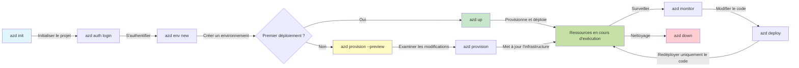
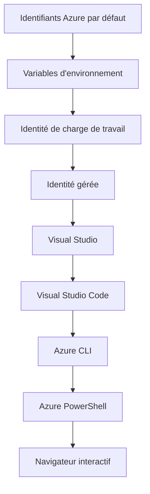

# AZD Basics - Comprendre Azure Developer CLI

# AZD Basics - Concepts de base et fondamentaux

**Chapter Navigation:**
- **📚 Course Home**: [AZD pour débutants](../../README.md)
- **📖 Current Chapter**: Chapitre 1 - Fondation & Démarrage rapide
- **⬅️ Previous**: [Aperçu du cours](../../README.md#-chapter-1-foundation--quick-start)
- **➡️ Next**: [Installation et configuration](installation.md)
- **🚀 Next Chapter**: [Chapitre 2 : Développement axé sur l'IA](../chapter-02-ai-development/microsoft-foundry-integration.md)

## Introduction

Cette leçon vous présente Azure Developer CLI (azd), un outil en ligne de commande puissant qui accélère votre passage du développement local au déploiement sur Azure. Vous apprendrez les concepts fondamentaux, les fonctionnalités principales, et comprendrez comment azd simplifie le déploiement d'applications cloud-native.

## Learning Goals

À la fin de cette leçon, vous allez :
- Comprendre ce qu'est Azure Developer CLI et son objectif principal
- Apprendre les concepts clés des modèles, environnements et services
- Explorer les principales fonctionnalités, notamment le développement piloté par des modèles et l'infrastructure en tant que code
- Comprendre la structure du projet azd et le flux de travail
- Être prêt à installer et configurer azd pour votre environnement de développement

## Learning Outcomes

Après avoir terminé cette leçon, vous serez en mesure de :
- Expliquer le rôle d'azd dans les flux de travail modernes de développement cloud
- Identifier les composants de la structure d'un projet azd
- Décrire comment les modèles, environnements et services fonctionnent ensemble
- Comprendre les avantages de l'infrastructure en tant que code avec azd
- Reconnaître les différentes commandes azd et leurs objectifs

## What is Azure Developer CLI (azd)?

Azure Developer CLI (azd) est un outil en ligne de commande conçu pour accélérer votre passage du développement local au déploiement sur Azure. Il simplifie le processus de création, déploiement et gestion d'applications cloud-native sur Azure.

### 🎯 Why Use AZD? A Real-World Comparison

Comparons le déploiement d'une simple application web avec une base de données :

#### ❌ WITHOUT AZD: Manual Azure Deployment (30+ minutes)

```bash
# Étape 1 : Créer le groupe de ressources
az group create --name myapp-rg --location eastus

# Étape 2 : Créer le plan App Service
az appservice plan create --name myapp-plan \
  --resource-group myapp-rg \
  --sku B1 --is-linux

# Étape 3 : Créer l'application Web
az webapp create --name myapp-web-unique123 \
  --resource-group myapp-rg \
  --plan myapp-plan \
  --runtime "NODE:18-lts"

# Étape 4 : Créer un compte Cosmos DB (10-15 minutes)
az cosmosdb create --name myapp-cosmos-unique123 \
  --resource-group myapp-rg \
  --kind MongoDB

# Étape 5 : Créer la base de données
az cosmosdb mongodb database create \
  --account-name myapp-cosmos-unique123 \
  --resource-group myapp-rg \
  --name tododb

# Étape 6 : Créer une collection
az cosmosdb mongodb collection create \
  --account-name myapp-cosmos-unique123 \
  --resource-group myapp-rg \
  --database-name tododb \
  --name todos

# Étape 7 : Obtenir la chaîne de connexion
CONN_STR=$(az cosmosdb keys list \
  --name myapp-cosmos-unique123 \
  --resource-group myapp-rg \
  --type connection-strings \
  --query "connectionStrings[0].connectionString" -o tsv)

# Étape 8 : Configurer les paramètres de l'application
az webapp config appsettings set \
  --name myapp-web-unique123 \
  --resource-group myapp-rg \
  --settings MONGODB_URI="$CONN_STR"

# Étape 9 : Activer la journalisation
az webapp log config --name myapp-web-unique123 \
  --resource-group myapp-rg \
  --application-logging filesystem \
  --detailed-error-messages true

# Étape 10 : Configurer Application Insights
az monitor app-insights component create \
  --app myapp-insights \
  --location eastus \
  --resource-group myapp-rg

# Étape 11 : Lier App Insights à l'application Web
INSTRUMENTATION_KEY=$(az monitor app-insights component show \
  --app myapp-insights \
  --resource-group myapp-rg \
  --query "instrumentationKey" -o tsv)

az webapp config appsettings set \
  --name myapp-web-unique123 \
  --resource-group myapp-rg \
  --settings APPINSIGHTS_INSTRUMENTATIONKEY="$INSTRUMENTATION_KEY"

# Étape 12 : Compiler l'application localement
npm install
npm run build

# Étape 13 : Créer le package de déploiement
zip -r app.zip . -x "*.git*" "node_modules/*"

# Étape 14 : Déployer l'application
az webapp deployment source config-zip \
  --resource-group myapp-rg \
  --name myapp-web-unique123 \
  --src app.zip

# Étape 15 : Attendre et prier pour que ça marche 🙏
# (Pas de validation automatisée, tests manuels requis)
```

**Problems:**
- ❌ 15+ commands to remember and execute in order
- ❌ 30-45 minutes of manual work
- ❌ Easy to make mistakes (typos, wrong parameters)
- ❌ Connection strings exposed in terminal history
- ❌ No automated rollback if something fails
- ❌ Hard to replicate for team members
- ❌ Different every time (not reproducible)

#### ✅ WITH AZD: Automated Deployment (5 commands, 10-15 minutes)

```bash
# Étape 1 : Initialiser à partir du modèle
azd init --template todo-nodejs-mongo

# Étape 2 : S'authentifier
azd auth login

# Étape 3 : Créer l'environnement
azd env new dev

# Étape 4 : Prévisualiser les modifications (optionnel mais recommandé)
azd provision --preview

# Étape 5 : Tout déployer
azd up

# ✨ Terminé ! Tout est déployé, configuré et surveillé
```

**Benefits:**
- ✅ **5 commands** vs. 15+ manual steps
- ✅ **10-15 minutes** total time (mostly waiting for Azure)
- ✅ **Zero errors** - automated and tested
- ✅ **Secrets managed securely** via Key Vault
- ✅ **Automatic rollback** on failures
- ✅ **Fully reproducible** - same result every time
- ✅ **Team-ready** - anyone can deploy with same commands
- ✅ **Infrastructure as Code** - version controlled Bicep templates
- ✅ **Built-in monitoring** - Application Insights configured automatically

### 📊 Time & Error Reduction

| Metric | Manual Deployment | AZD Deployment | Improvement |
|:-------|:------------------|:---------------|:------------|
| **Commandes** | 15+ | 5 | 67% de moins |
| **Temps** | 30-45 min | 10-15 min | 60% plus rapide |
| **Taux d'erreur** | ~40% | <5% | Réduction de 88% |
| **Cohérence** | Low (manual) | 100% (automated) | Perfect |
| **Intégration de l'équipe** | 2-4 hours | 30 minutes | 75% plus rapide |
| **Temps de restauration** | 30+ min (manual) | 2 min (automated) | 93% plus rapide |

## Core Concepts

### Templates
Les modèles sont la base d'azd. Ils contiennent:
- **Code de l'application** - Votre code source et dépendances
- **Définitions d'infrastructure** - Ressources Azure définies en Bicep ou Terraform
- **Fichiers de configuration** - Paramètres et variables d'environnement
- **Scripts de déploiement** - Flux de déploiement automatisés

### Environments
Les environnements représentent différentes cibles de déploiement:
- **Development** - For testing and development
- **Staging** - Pre-production environment
- **Production** - Live production environment

Each environment maintains its own:
- Groupe de ressources Azure
- Paramètres de configuration
- État du déploiement

### Services
Les services sont les éléments constitutifs de votre application:
- **Frontend** - Applications web, SPAs
- **Backend** - APIs, microservices
- **Database** - Solutions de stockage de données
- **Storage** - Stockage de fichiers et de blobs

## Key Features

### 1. Template-Driven Development
```bash
# Parcourir les modèles disponibles
azd template list

# Initialiser à partir d'un modèle
azd init --template <template-name>
```

### 2. Infrastructure as Code
- **Bicep** - Langage spécifique au domaine d'Azure
- **Terraform** - Outil d'infrastructure multi-cloud
- **ARM Templates** - Modèles Azure Resource Manager

### 3. Integrated Workflows
```bash
# Processus de déploiement complet
azd up            # Provisionnement + déploiement : entièrement automatisé pour la configuration initiale

# 🧪 NOUVEAU : Prévisualiser les modifications d'infrastructure avant le déploiement (SÉCURISÉ)
azd provision --preview    # Simuler le déploiement de l'infrastructure sans effectuer de modifications

azd provision     # Créer des ressources Azure — utilisez ceci si vous mettez à jour l'infrastructure
azd deploy        # Déployer le code de l'application ou le redéployer après une mise à jour
azd down          # Nettoyer les ressources
```

#### 🛡️ Safe Infrastructure Planning with Preview
The `azd provision --preview` command is a game-changer for safe deployments:
- **Dry-run analysis** - Montre ce qui sera créé, modifié ou supprimé
- **Zero risk** - Aucun changement réel n'est apporté à votre environnement Azure
- **Team collaboration** - Partagez les résultats de l'aperçu avant le déploiement
- **Cost estimation** - Comprenez le coût des ressources avant de vous engager

```bash
# Exemple de flux de travail d'aperçu
azd provision --preview           # Voir ce qui va changer
# Examinez la sortie, discutez-en avec l'équipe
azd provision                     # Appliquez les modifications en toute confiance
```

### 📊 Visual: AZD Development Workflow


**Workflow Explanation:**
1. **Init** - Démarrer avec un modèle ou un nouveau projet
2. **Auth** - S'authentifier auprès d'Azure
3. **Environment** - Créer un environnement de déploiement isolé
4. **Preview** - 🆕 Toujours prévisualiser d'abord les modifications d'infrastructure (bonne pratique)
5. **Provision** - Créer/mettre à jour les ressources Azure
6. **Deploy** - Déployer le code de votre application
7. **Monitor** - Surveiller les performances de l'application
8. **Iterate** - Apporter des modifications et redéployer le code
9. **Cleanup** - Supprimer les ressources une fois terminé

### 4. Environment Management
```bash
# Créer et gérer des environnements
azd env new <environment-name>
azd env select <environment-name>
azd env list
```

## 📁 Project Structure

A typical azd project structure:
```
my-app/
├── .azd/                    # azd configuration
│   └── config.json
├── .azure/                  # Azure deployment artifacts
├── .devcontainer/          # Development container config
├── .github/workflows/      # GitHub Actions
├── .vscode/               # VS Code settings
├── infra/                 # Infrastructure code
│   ├── main.bicep        # Main infrastructure template
│   ├── main.parameters.json
│   └── modules/          # Reusable modules
├── src/                  # Application source code
│   ├── api/             # Backend services
│   └── web/             # Frontend application
├── azure.yaml           # azd project configuration
└── README.md
```

## 🔧 Configuration Files

### azure.yaml
The main project configuration file:
```yaml
name: my-awesome-app
metadata:
  template: my-template@1.0.0

services:
  web:
    project: ./src/web
    language: js
    host: appservice
  api:
    project: ./src/api
    language: js
    host: appservice

hooks:
  preprovision:
    shell: pwsh
    run: echo "Preparing to provision..."
```

### .azure/config.json
Environment-specific configuration:
```json
{
  "version": 1,
  "defaultEnvironment": "dev",
  "environments": {
    "dev": {
      "subscriptionId": "your-subscription-id",
      "location": "eastus"
    }
  }
}
```

## 🎪 Common Workflows with Hands-On Exercises

> **💡 Astuce d'apprentissage:** Suivez ces exercices dans l'ordre pour développer progressivement vos compétences AZD.

### 🎯 Exercise 1: Initialize Your First Project

**Goal:** Create an AZD project and explore its structure

**Steps:**
```bash
# Utilisez un modèle éprouvé
azd init --template todo-nodejs-mongo

# Explorez les fichiers générés
ls -la  # Affichez tous les fichiers, y compris les fichiers cachés

# Fichiers clés créés :
# - azure.yaml (configuration principale)
# - infra/ (code d'infrastructure)
# - src/ (code de l'application)
```

**✅ Succès:** Vous avez azure.yaml, infra/ et src/ directories

---

### 🎯 Exercise 2: Deploy to Azure

**Goal:** Complete end-to-end deployment

**Steps:**
```bash
# 1. Authentifiez-vous
az login && azd auth login

# 2. Créez un environnement
azd env new dev
azd env set AZURE_LOCATION eastus

# 3. Prévisualisez les modifications (RECOMMANDÉ)
azd provision --preview

# 4. Déployez tout
azd up

# 5. Vérifiez le déploiement
azd show    # 6. Affichez l'URL de votre application
```

**Expected Time:** 10-15 minutes  
**✅ Succès:** L'URL de l'application s'ouvre dans le navigateur

---

### 🎯 Exercise 3: Multiple Environments

**Goal:** Deploy to dev and staging

**Steps:**
```bash
# Dev existe déjà, créer staging
azd env new staging
azd env set AZURE_LOCATION westus2
azd up

# Basculer entre eux
azd env list
azd env select dev
```

**✅ Succès:** Deux groupes de ressources distincts dans le portail Azure

---

### 🛡️ Clean Slate: `azd down --force --purge`

When you need to completely reset:

```bash
azd down --force --purge
```

**What it does:**
- `--force`: Pas d'invite de confirmation
- `--purge`: Supprime tout l'état local et les ressources Azure

**Use when:**
- Le déploiement a échoué en cours de route
- Changement de projet
- Besoin d'un nouveau départ

---

## 🎪 Original Workflow Reference

### Starting a New Project
```bash
# Méthode 1 : Utiliser un modèle existant
azd init --template todo-nodejs-mongo

# Méthode 2 : Partir de zéro
azd init

# Méthode 3 : Utiliser le répertoire courant
azd init .
```

### Development Cycle
```bash
# Configurer l'environnement de développement
azd auth login
azd env new dev
azd env select dev

# Déployer tout
azd up

# Faire des modifications et redéployer
azd deploy

# Nettoyer une fois terminé
azd down --force --purge # La commande dans l'Azure Developer CLI est une **réinitialisation complète** de votre environnement — particulièrement utile lorsque vous dépannez des déploiements échoués, que vous nettoyez des ressources orphelines ou que vous préparez un nouveau redéploiement.
```

## Understanding `azd down --force --purge`
La commande `azd down --force --purge` est un moyen puissant pour démanteler complètement votre environnement azd et toutes les ressources associées. Voici une répartition de ce que fait chaque option :
```
--force
```
- Ignore les invites de confirmation.
- Utile pour l'automatisation ou les scripts lorsque l'entrée manuelle n'est pas possible.
- Garantit que l'arrêt se déroule sans interruption, même si le CLI détecte des incohérences.

```
--purge
```
Supprime **toutes les métadonnées associées**, y compris:
État de l'environnement
Dossier local `.azure`
Informations de déploiement en cache
Empêche azd de « se souvenir » des déploiements précédents, ce qui peut provoquer des problèmes tels que des groupes de ressources non appariés ou des références de registre obsolètes.


### Why use both?
Lorsque vous êtes bloqué avec `azd up` en raison d'un état persistant ou de déploiements partiels, cette combinaison garantit une **remise à zéro complète**.

C'est particulièrement utile après des suppressions manuelles de ressources dans le portail Azure ou lors du changement de modèles, d'environnements ou de conventions de nommage des groupes de ressources.


### Managing Multiple Environments
```bash
# Créer un environnement de préproduction
azd env new staging
azd env select staging
azd up

# Revenir à l'environnement de développement
azd env select dev

# Comparer les environnements
azd env list
```

## 🔐 Authentication and Credentials

Comprendre l'authentification est crucial pour des déploiements azd réussis. Azure utilise plusieurs méthodes d'authentification, et azd exploite la même chaîne d'identifiants utilisée par les autres outils Azure.

### Azure CLI Authentication (`az login`)

Avant d'utiliser azd, vous devez vous authentifier auprès d'Azure. La méthode la plus courante est d'utiliser Azure CLI :

```bash
# Connexion interactive (ouvre le navigateur)
az login

# Connexion avec un locataire spécifique
az login --tenant <tenant-id>

# Connexion avec un principal de service
az login --service-principal -u <app-id> -p <password> --tenant <tenant-id>

# Vérifier l'état de la connexion actuelle
az account show

# Lister les abonnements disponibles
az account list --output table

# Définir l'abonnement par défaut
az account set --subscription <subscription-id>
```

### Authentication Flow
1. **Interactive Login**: Ouvre votre navigateur par défaut pour l'authentification
2. **Device Code Flow**: Pour les environnements sans accès au navigateur
3. **Service Principal**: Pour les scénarios d'automatisation et de CI/CD
4. **Managed Identity**: Pour les applications hébergées sur Azure

### DefaultAzureCredential Chain

`DefaultAzureCredential` est un type d'identifiant qui offre une expérience d'authentification simplifiée en essayant automatiquement plusieurs sources d'identifiants dans un ordre spécifique :

#### Credential Chain Order

#### 1. Environment Variables
```bash
# Définir des variables d'environnement pour le principal de service
export AZURE_CLIENT_ID="<app-id>"
export AZURE_CLIENT_SECRET="<password>"
export AZURE_TENANT_ID="<tenant-id>"
```

#### 2. Workload Identity (Kubernetes/GitHub Actions)
Utilisé automatiquement dans:
- Azure Kubernetes Service (AKS) avec Workload Identity
- GitHub Actions avec fédération OIDC
- Autres scénarios d'identité fédérée

#### 3. Managed Identity
Pour des ressources Azure telles que:
- Machines virtuelles
- App Service
- Azure Functions
- Instances de conteneurs

```bash
# Vérifier si l'on s'exécute sur une ressource Azure avec une identité gérée
az account show --query "user.type" --output tsv
# Renvoie : "servicePrincipal" si une identité gérée est utilisée
```

#### 4. Developer Tools Integration
- **Visual Studio**: Utilise automatiquement le compte connecté
- **VS Code**: Utilise les identifiants de l'extension Azure Account
- **Azure CLI**: Utilise les identifiants `az login` (le plus courant pour le développement local)

### AZD Authentication Setup

```bash
# Méthode 1 : Utiliser Azure CLI (Recommandé pour le développement)
az login
azd auth login  # Utilise les identifiants Azure CLI existants

# Méthode 2 : Authentification directe azd
azd auth login --use-device-code  # Pour les environnements sans interface graphique

# Méthode 3 : Vérifier l'état d'authentification
azd auth login --check-status

# Méthode 4 : Déconnexion et réauthentification
azd auth logout
azd auth login
```

### Authentication Best Practices

#### For Local Development
```bash
# 1. Se connecter avec Azure CLI
az login

# 2. Vérifier que l'abonnement est correct
az account show
az account set --subscription "Your Subscription Name"

# 3. Utiliser azd avec les informations d'identification existantes
azd auth login
```

#### For CI/CD Pipelines
```yaml
# GitHub Actions example
- name: Azure Login
  uses: azure/login@v1
  with:
    creds: ${{ secrets.AZURE_CREDENTIALS }}

- name: Deploy with azd
  run: |
    azd auth login --client-id ${{ secrets.AZURE_CLIENT_ID }} \
                    --client-secret ${{ secrets.AZURE_CLIENT_SECRET }} \
                    --tenant-id ${{ secrets.AZURE_TENANT_ID }}
    azd up --no-prompt
```

#### For Production Environments
- Utilisez **Managed Identity** lors de l'exécution sur des ressources Azure
- Utilisez **Service Principal** pour les scénarios d'automatisation
- Évitez de stocker des identifiants dans le code ou les fichiers de configuration
- Utilisez **Azure Key Vault** pour les configurations sensibles

### Common Authentication Issues and Solutions

#### Problème : « Aucun abonnement trouvé »
```bash
# Solution : Définir l'abonnement par défaut
az account list --output table
az account set --subscription "<subscription-id>"
azd env set AZURE_SUBSCRIPTION_ID "<subscription-id>"
```

#### Problème : « Autorisations insuffisantes »
```bash
# Solution : vérifier et attribuer les rôles requis
az role assignment list --assignee $(az account show --query user.name --output tsv)

# Rôles requis courants :
# - Contributeur (pour la gestion des ressources)
# - Administrateur d'accès utilisateur (pour l'attribution des rôles)
```

#### Problème : « Jeton expiré »
```bash
# Solution : se réauthentifier
az logout
az login
azd auth logout
azd auth login
```

### Authentication in Different Scenarios

#### Développement local
```bash
# Compte de développement personnel
az login
azd auth login
```

#### Développement en équipe
```bash
# Utiliser un locataire spécifique pour l'organisation
az login --tenant contoso.onmicrosoft.com
azd auth login
```

#### Scénarios multi-tenant
```bash
# Basculer entre les locataires
az login --tenant tenant1.onmicrosoft.com
# Déployer vers le locataire 1
azd up

az login --tenant tenant2.onmicrosoft.com  
# Déployer vers le locataire 2
azd up
```

### Security Considerations

1. **Stockage des identifiants**: Ne stockez jamais d'identifiants dans le code source
2. **Limitation de la portée**: Utilisez le principe du moindre privilège pour les service principals
3. **Rotation des jetons**: Faites régulièrement tourner les secrets des service principals
4. **Traçabilité**: Surveillez les activités d'authentification et de déploiement
5. **Sécurité réseau**: Utilisez des endpoints privés lorsque c'est possible

### Troubleshooting Authentication

```bash
# Déboguer les problèmes d'authentification
azd auth login --check-status
az account show
az account get-access-token

# Commandes de diagnostic courantes
whoami                          # Contexte de l'utilisateur actuel
az ad signed-in-user show      # Détails de l'utilisateur Azure AD
az group list                  # Tester l'accès aux ressources
```

## Understanding `azd down --force --purge`

### Discovery
```bash
azd template list              # Parcourir les modèles
azd template show <template>   # Détails du modèle
azd init --help               # Options d'initialisation
```

### Project Management
```bash
azd show                     # Aperçu du projet
azd env show                 # Environnement actuel
azd config list             # Paramètres de configuration
```

### Monitoring
```bash
azd monitor                  # Ouvrir la surveillance du portail Azure
azd monitor --logs           # Afficher les journaux de l'application
azd monitor --live           # Afficher les métriques en temps réel
azd pipeline config          # Configurer CI/CD
```

## Best Practices

### 1. Use Meaningful Names
```bash
# Bon
azd env new production-east
azd init --template web-app-secure

# Évitez
azd env new env1
azd init --template template1
```

### 2. Leverage Templates
- Commencez avec des modèles existants
- Personnalisez selon vos besoins
- Créez des modèles réutilisables pour votre organisation

### 3. Environment Isolation
- Utilisez des environnements séparés pour dev/staging/prod
- Ne déployez jamais directement en production depuis une machine locale
- Utilisez des pipelines CI/CD pour les déploiements en production

### 4. Configuration Management
- Utilisez des variables d'environnement pour les données sensibles
- Conservez la configuration dans le contrôle de version
- Documentez les paramètres spécifiques à l'environnement

## Learning Progression

### Débutant (Semaine 1-2)
1. Installer azd et s'authentifier
2. Déployer un modèle simple
3. Comprendre la structure du projet
4. Apprendre les commandes de base (up, down, deploy)

### Intermédiaire (Semaine 3-4)
1. Personnaliser les modèles
2. Gérer plusieurs environnements
3. Comprendre le code d'infrastructure
4. Mettre en place des pipelines CI/CD

### Avancé (Semaine 5+)
1. Créer des modèles personnalisés
2. Modèles d'infrastructure avancés
3. Déploiements multi-région
4. Configurations de niveau entreprise

## Next Steps

**📖 Poursuivre l'apprentissage du chapitre 1 :**
- [Installation et configuration](installation.md) - Installer et configurer azd
- [Votre premier projet](first-project.md) - Tutoriel pratique complet
- [Guide de configuration](configuration.md) - Options de configuration avancées

**🎯 Ready for Next Chapter?**
- [Chapitre 2: Développement axé sur l'IA](../chapter-02-ai-development/microsoft-foundry-integration.md) - Commencez à créer des applications d'IA

## Ressources supplémentaires

- [Aperçu d'Azure Developer CLI](https://learn.microsoft.com/en-us/azure/developer/azure-developer-cli/)
- [Galerie de modèles](https://azure.github.io/awesome-azd/)
- [Exemples de la communauté](https://github.com/Azure-Samples)

---

## 🙋 Foire aux questions

### Questions générales

**Q: What's the difference between AZD and Azure CLI?**

A: Azure CLI (`az`) is for managing individual Azure resources. AZD (`azd`) is for managing entire applications:

```bash
# Azure CLI - gestion des ressources de bas niveau
az webapp create --name myapp --resource-group rg
az sql server create --name myserver --resource-group rg
# ...beaucoup plus de commandes nécessaires

# AZD - gestion au niveau de l'application
azd up  # Déploie l'application entière avec toutes ses ressources
```

**Think of it this way:**
- `az` = Opérer sur des briques Lego individuelles
- `azd` = Travailler avec des ensembles Lego complets

---

**Q: Do I need to know Bicep or Terraform to use AZD?**

A: No! Start with templates:
```bash
# Utilisez le modèle existant - aucune connaissance en IaC requise
azd init --template todo-nodejs-mongo
azd up
```

You can learn Bicep later to customize infrastructure. Templates provide working examples to learn from.

---

**Q: How much does it cost to run AZD templates?**

A: Costs vary by template. Most development templates cost $50-150/month:

```bash
# Prévisualiser les coûts avant le déploiement
azd provision --preview

# Nettoyez toujours lorsque vous ne l'utilisez pas
azd down --force --purge  # Supprime toutes les ressources
```

**Pro tip:** Use free tiers where available:
- App Service: F1 (Free) tier
- Azure OpenAI: 50,000 tokens/month free
- Cosmos DB: 1000 RU/s free tier

---

**Q: Can I use AZD with existing Azure resources?**

A: Yes, but it's easier to start fresh. AZD works best when it manages the full lifecycle. For existing resources:

```bash
# Option 1 : Importer des ressources existantes (avancé)
azd init
# Puis modifiez infra/ pour référencer les ressources existantes

# Option 2 : Repartir de zéro (recommandé)
azd init --template matching-your-stack
azd up  # Crée un nouvel environnement
```

---

**Q: How do I share my project with teammates?**

A: Commit the AZD project to Git (but NOT the .azure folder):

```bash
# Déjà présent dans .gitignore par défaut
.azure/        # Contient des secrets et des données d'environnement
*.env          # Variables d'environnement

# Membres de l'équipe ensuite :
git clone <your-repo>
azd auth login
azd env new <their-name>-dev
azd up
```

Everyone gets identical infrastructure from the same templates.

---

### Troubleshooting Questions

**Q: "azd up" failed halfway. What do I do?**

A: Check the error, fix it, then retry:

```bash
# Afficher les journaux détaillés
azd show

# Correctifs courants :

# 1. Si le quota est dépassé :
azd env set AZURE_LOCATION "westus2"  # Essayez une autre région

# 2. Si conflit de nom de ressource :
azd down --force --purge  # Repartir de zéro
azd up  # Réessayer

# 3. Si l'authentification a expiré :
az login
azd auth login
azd up
```

**Most common issue:** Wrong Azure subscription selected
```bash
az account list --output table
az account set --subscription "<correct-subscription>"
```

---

**Q: How do I deploy just code changes without reprovisioning?**

A: Use `azd deploy` instead of `azd up`:

```bash
azd up          # Première fois : provisionnement + déploiement (lent)

# Apportez des modifications au code...

azd deploy      # Les fois suivantes : déploiement uniquement (rapide)
```

Speed comparison:
- `azd up`: 10-15 minutes (provisions infrastructure)
- `azd deploy`: 2-5 minutes (code only)

---

**Q: Can I customize the infrastructure templates?**

A: Yes! Edit the Bicep files in `infra/`:

```bash
# Après azd init
cd infra/
code main.bicep  # Modifier dans VS Code

# Prévisualiser les modifications
azd provision --preview

# Appliquer les modifications
azd provision
```

**Tip:** Start small - change SKUs first:
```bicep
// infra/main.bicep
sku: {
  name: 'B1'  // Change to 'P1V2' for production
}
```

---

**Q: How do I delete everything AZD created?**

A: One command removes all resources:

```bash
azd down --force --purge

# Cela supprime :
# - Toutes les ressources Azure
# - Le groupe de ressources
# - L'état de l'environnement local
# - Les données de déploiement mises en cache
```

**Always run this when:**
- Test d'un modèle terminé
- Passage à un projet différent
- Repartir à zéro

**Cost savings:** Deleting unused resources = $0 charges

---

**Q: What if I accidentally deleted resources in Azure Portal?**

A: AZD state can get out of sync. Clean slate approach:

```bash
# 1. Supprimer l'état local
azd down --force --purge

# 2. Repartir à zéro
azd up

# Alternative: Laisser AZD détecter et corriger
azd provision  # Créera les ressources manquantes
```

---

### Advanced Questions

**Q: Can I use AZD in CI/CD pipelines?**

A: Yes! GitHub Actions example:

```yaml
# .github/workflows/deploy.yml
name: Deploy with AZD

on:
  push:
    branches: [main]

jobs:
  deploy:
    runs-on: ubuntu-latest
    steps:
      - uses: actions/checkout@v2
      
      - name: Install azd
        run: curl -fsSL https://aka.ms/install-azd.sh | bash
      
      - name: Azure Login
        run: |
          azd auth login \
            --client-id ${{ secrets.AZURE_CLIENT_ID }} \
            --client-secret ${{ secrets.AZURE_CLIENT_SECRET }} \
            --tenant-id ${{ secrets.AZURE_TENANT_ID }}
      
      - name: Deploy
        run: azd up --no-prompt
```

---

**Q: How do I handle secrets and sensitive data?**

A: AZD integrates with Azure Key Vault automatically:

```bash
# Les secrets sont stockés dans Key Vault, pas dans le code
azd env set DATABASE_PASSWORD "$(openssl rand -base64 32)"

# AZD effectue automatiquement :
# 1. Crée un Key Vault
# 2. Stocke le secret
# 3. Accorde à l'application l'accès via Managed Identity
# 4. Injecte au moment de l'exécution
```

**Never commit:**
- `.azure/` folder (contains environment data)
- `.env` files (local secrets)
- Connection strings

---

**Q: Can I deploy to multiple regions?**

A: Yes, create environment per region:

```bash
# Environnement Est des États-Unis
azd env new prod-eastus
azd env set AZURE_LOCATION eastus
azd up

# Environnement Europe de l'Ouest
azd env new prod-westeurope
azd env set AZURE_LOCATION westeurope
azd up

# Chaque environnement est indépendant
azd env list
```

For true multi-region apps, customize Bicep templates to deploy to multiple regions simultaneously.

---

**Q: Where can I get help if I'm stuck?**

1. **AZD Documentation:** https://learn.microsoft.com/azure/developer/azure-developer-cli/
2. **GitHub Issues:** https://github.com/Azure/azure-dev/issues
3. **Discord:** [Azure Discord](https://discord.gg/microsoft-azure) - #azure-developer-cli channel
4. **Stack Overflow:** Tag `azure-developer-cli`
5. **This Course:** [Troubleshooting Guide](../chapter-07-troubleshooting/common-issues.md)

**Pro tip:** Before asking, run:
```bash
azd show       # Affiche l'état actuel
azd version    # Affiche votre version
```
Incluez ces informations dans votre question pour une aide plus rapide.

---

## 🎓 Et ensuite ?

Vous comprenez maintenant les fondamentaux d'AZD. Choisissez votre voie :

### 🎯 Pour les débutants:
1. **Next:** [Installation et configuration](installation.md) - Install AZD on your machine
2. **Then:** [Votre premier projet](first-project.md) - Deploy your first app
3. **Practice:** Complétez les 3 exercices de cette leçon

### 🚀 Pour les développeurs IA:
1. **Skip to:** [Chapitre 2: Développement axé sur l'IA](../chapter-02-ai-development/microsoft-foundry-integration.md)
2. **Deploy:** Start with `azd init --template get-started-with-ai-chat`
3. **Learn:** Build while you deploy

### 🏗️ Pour les développeurs expérimentés:
1. **Review:** [Guide de configuration](configuration.md) - Advanced settings
2. **Explore:** [Infrastructure as Code](../chapter-04-infrastructure/provisioning.md) - Bicep deep dive
3. **Build:** Créez des modèles personnalisés pour votre stack

---

**Chapter Navigation:**
- **📚 Course Home**: [AZD pour débutants](../../README.md)
- **📖 Current Chapter**: Chapitre 1 - Foundation & Quick Start  
- **⬅️ Previous**: [Aperçu du cours](../../README.md#-chapter-1-foundation--quick-start)
- **➡️ Next**: [Installation et configuration](installation.md)
- **🚀 Next Chapter**: [Chapitre 2: Développement axé sur l'IA](../chapter-02-ai-development/microsoft-foundry-integration.md)

---

<!-- CO-OP TRANSLATOR DISCLAIMER START -->
Clause de non-responsabilité :
Ce document a été traduit à l'aide du service de traduction par IA Co-op Translator (https://github.com/Azure/co-op-translator). Bien que nous nous efforcions d'assurer l'exactitude, veuillez noter que les traductions automatiques peuvent contenir des erreurs ou des inexactitudes. Le document original, dans sa langue d'origine, doit être considéré comme la source faisant foi. Pour les informations critiques, il est recommandé de recourir à une traduction professionnelle réalisée par un traducteur humain. Nous ne pouvons être tenus responsables d'éventuels malentendus ou interprétations erronées résultant de l'utilisation de cette traduction.
<!-- CO-OP TRANSLATOR DISCLAIMER END -->