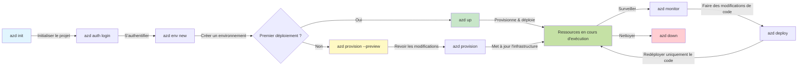
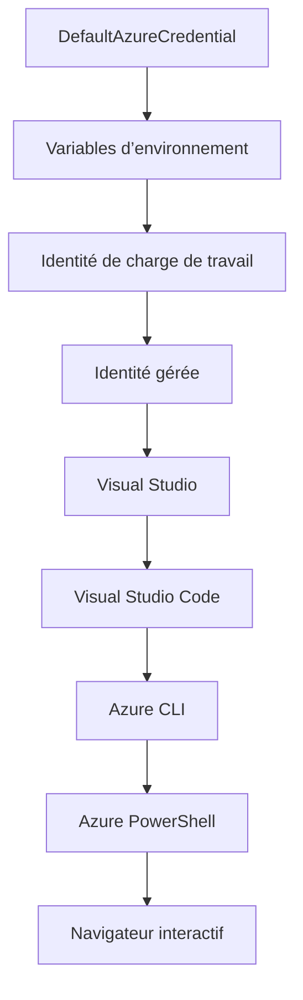

# AZD Basics - Comprendre Azure Developer CLI

# AZD Basics - Concepts de Base et Fondamentaux

**Navigation du Chapitre :**
- **📚 Accueil du Cours** : [AZD Pour Débutants](../../README.md)
- **📖 Chapitre Actuel** : Chapitre 1 - Fondation & Démarrage Rapide
- **⬅️ Précédent** : [Aperçu du Cours](../../README.md#-chapter-1-foundation--quick-start)
- **➡️ Suivant** : [Installation & Configuration](installation.md)
- **🚀 Chapitre Suivant** : [Chapitre 2 : Développement AI-First](../chapter-02-ai-development/microsoft-foundry-integration.md)

## Introduction

Cette leçon vous présente Azure Developer CLI (azd), un outil en ligne de commande puissant qui accélère votre parcours depuis le développement local jusqu’au déploiement sur Azure. Vous apprendrez les concepts fondamentaux, les fonctionnalités principales, et comprendrez comment azd simplifie le déploiement d’applications cloud-native.

## Objectifs d’apprentissage

À la fin de cette leçon, vous serez capable de :
- Comprendre ce qu’est Azure Developer CLI et son objectif principal
- Apprendre les concepts clés des templates, environnements et services
- Explorer les fonctionnalités clés incluant le développement guidé par template et l’Infrastructure as Code
- Comprendre la structure de projet et le flux de travail azd
- Être prêt à installer et configurer azd pour votre environnement de développement

## Résultats d’apprentissage

Après avoir terminé cette leçon, vous pourrez :
- Expliquer le rôle d’azd dans les flux de travail de développement cloud modernes
- Identifier les composants de la structure d’un projet azd
- Décrire comment les templates, environnements et services fonctionnent ensemble
- Comprendre les bénéfices de l’Infrastructure as Code avec azd
- Reconnaître différentes commandes azd et leurs utilisations

## Qu’est-ce que Azure Developer CLI (azd) ?

Azure Developer CLI (azd) est un outil en ligne de commande conçu pour accélérer votre parcours depuis le développement local jusqu’au déploiement sur Azure. Il simplifie le processus de construction, déploiement et gestion d’applications cloud-native sur Azure.

### Que pouvez-vous déployer avec azd ?

azd supporte une large gamme de charges de travail—et la liste ne cesse de s’allonger. Aujourd’hui, vous pouvez utiliser azd pour déployer :

| Type de charge de travail | Exemples | Même flux de travail ? |
|---------------------------|----------|-----------------------|
| **Applications traditionnelles** | Applications web, APIs REST, sites statiques | ✅ `azd up` |
| **Services et microservices** | Container Apps, Function Apps, backends multi-services | ✅ `azd up` |
| **Applications propulsées par IA** | Applications de chat avec Microsoft Foundry Models, solutions RAG avec AI Search | ✅ `azd up` |
| **Agents intelligents** | Agents hébergés par Foundry, orchestrations multi-agents | ✅ `azd up` |

La clé est que **le cycle de vie azd reste identique quel que soit ce que vous déployez**. Vous initialisez un projet, provisionnez l’infrastructure, déployez votre code, surveillez votre application, et nettoyez—qu’il s’agisse d’un simple site web ou d’un agent IA sophistiqué.

Cette continuité est voulue. azd considère les capacités d’IA comme un autre type de service que votre application peut utiliser, pas comme quelque chose de fondamentalement différent. Un endpoint de chat alimenté par Microsoft Foundry Models est, du point de vue d’azd, simplement un autre service à configurer et déployer.

### 🎯 Pourquoi utiliser AZD ? Une comparaison réelle

Comparons le déploiement d’une simple application web avec base de données :

#### ❌ SANS AZD : Déploiement Azure manuel (30+ minutes)

```bash
# Étape 1 : Créer le groupe de ressources
az group create --name myapp-rg --location eastus

# Étape 2 : Créer le plan de service d’application
az appservice plan create --name myapp-plan \
  --resource-group myapp-rg \
  --sku B1 --is-linux

# Étape 3 : Créer l’application Web
az webapp create --name myapp-web-unique123 \
  --resource-group myapp-rg \
  --plan myapp-plan \
  --runtime "NODE:18-lts"

# Étape 4 : Créer un compte Cosmos DB (10-15 minutes)
az cosmosdb create --name myapp-cosmos-unique123 \
  --resource-group myapp-rg \
  --kind MongoDB

# Étape 5 : Créer la base de données
az cosmosdb mongodb database create \
  --account-name myapp-cosmos-unique123 \
  --resource-group myapp-rg \
  --name tododb

# Étape 6 : Créer la collection
az cosmosdb mongodb collection create \
  --account-name myapp-cosmos-unique123 \
  --resource-group myapp-rg \
  --database-name tododb \
  --name todos

# Étape 7 : Obtenir la chaîne de connexion
CONN_STR=$(az cosmosdb keys list \
  --name myapp-cosmos-unique123 \
  --resource-group myapp-rg \
  --type connection-strings \
  --query "connectionStrings[0].connectionString" -o tsv)

# Étape 8 : Configurer les paramètres de l’application
az webapp config appsettings set \
  --name myapp-web-unique123 \
  --resource-group myapp-rg \
  --settings MONGODB_URI="$CONN_STR"

# Étape 9 : Activer la journalisation
az webapp log config --name myapp-web-unique123 \
  --resource-group myapp-rg \
  --application-logging filesystem \
  --detailed-error-messages true

# Étape 10 : Configurer Application Insights
az monitor app-insights component create \
  --app myapp-insights \
  --location eastus \
  --resource-group myapp-rg

# Étape 11 : Lier App Insights à l’application Web
INSTRUMENTATION_KEY=$(az monitor app-insights component show \
  --app myapp-insights \
  --resource-group myapp-rg \
  --query "instrumentationKey" -o tsv)

az webapp config appsettings set \
  --name myapp-web-unique123 \
  --resource-group myapp-rg \
  --settings APPINSIGHTS_INSTRUMENTATIONKEY="$INSTRUMENTATION_KEY"

# Étape 12 : Construire l’application localement
npm install
npm run build

# Étape 13 : Créer le package de déploiement
zip -r app.zip . -x "*.git*" "node_modules/*"

# Étape 14 : Déployer l’application
az webapp deployment source config-zip \
  --resource-group myapp-rg \
  --name myapp-web-unique123 \
  --src app.zip

# Étape 15 : Attendre et prier pour que ça fonctionne 🙏
# (Pas de validation automatisée, test manuel requis)
```

**Problèmes :**
- ❌ Plus de 15 commandes à mémoriser et exécuter dans l’ordre
- ❌ 30-45 minutes de travail manuel
- ❌ Facile de faire des erreurs (fautes de frappe, mauvais paramètres)
- ❌ Chaînes de connexion exposées dans l’historique du terminal
- ❌ Pas de rollback automatique en cas d’échec
- ❌ Difficile à reproduire pour les membres de l’équipe
- ❌ Différent à chaque fois (non reproductible)

#### ✅ AVEC AZD : Déploiement automatisé (5 commandes, 10-15 minutes)

```bash
# Étape 1 : Initialiser à partir du modèle
azd init --template todo-nodejs-mongo

# Étape 2 : Authentifier
azd auth login

# Étape 3 : Créer l'environnement
azd env new dev

# Étape 4 : Prévisualiser les changements (optionnel mais recommandé)
azd provision --preview

# Étape 5 : Déployer tout
azd up

# ✨ Terminé ! Tout est déployé, configuré et surveillé
```

**Avantages :**
- ✅ **5 commandes** vs. plus de 15 étapes manuelles
- ✅ **10-15 minutes** temps total (majoritairement attente Azure)
- ✅ **Moins d’erreurs manuelles** - flux de travail cohérent guidé par template
- ✅ **Gestion sécurisée des secrets** - beaucoup de templates utilisent un stockage secret géré par Azure
- ✅ **Déploiements répétables** - même flux de travail à chaque fois
- ✅ **Entièrement reproductible** - même résultat à chaque fois
- ✅ **Prêt pour l’équipe** - n’importe qui peut déployer avec les mêmes commandes
- ✅ **Infrastructure as Code** - templates Bicep versionnés
- ✅ **Monitoring intégré** - Application Insights configuré automatiquement

### 📊 Réduction du temps et des erreurs

| Indicateur | Déploiement Manuel | Déploiement AZD | Amélioration |
|:-----------|:-------------------|:----------------|:-------------|
| **Commandes** | 15+ | 5 | 67% en moins |
| **Temps** | 30-45 min | 10-15 min | 60% plus rapide |
| **Taux d’erreur** | ~40% | <5% | 88% réduction |
| **Cohérence** | Faible (manuel) | 100% (automatisé) | Parfait |
| **Intégration équipe** | 2-4 heures | 30 minutes | 75% plus rapide |
| **Rollback** | 30+ min (manuel) | 2 min (automatisé) | 93% plus rapide |

## Concepts Clés

### Templates
Les templates sont la base d’azd. Ils contiennent :
- **Code de l’application** - Votre code source et dépendances
- **Définitions d’infrastructure** - Ressources Azure définies en Bicep ou Terraform
- **Fichiers de configuration** - Paramètres et variables d’environnement
- **Scripts de déploiement** - Flux de travail de déploiement automatisés

### Environnements
Les environnements représentent différentes cibles de déploiement :
- **Développement** - Pour tests et développement
- **Préproduction** - Environnement de préproduction
- **Production** - Environnement de production en direct

Chaque environnement maintient son propre :
- Groupe de ressources Azure
- Paramètres de configuration
- État du déploiement

### Services
Les services sont les blocs de construction de votre application :
- **Frontend** - Applications web, SPA
- **Backend** - APIs, microservices
- **Base de données** - Solutions de stockage de données
- **Stockage** - Stockage de fichiers et blobs

## Fonctionnalités Clés

### 1. Développement guidé par template
```bash
# Parcourir les modèles disponibles
azd template list

# Initialiser à partir d'un modèle
azd init --template <template-name>
```

### 2. Infrastructure as Code
- **Bicep** - Langage spécifique Azure
- **Terraform** - Outil d’infrastructure multi-cloud
- **Templates ARM** - Templates Azure Resource Manager

### 3. Flux de travail intégrés
```bash
# Flux de travail de déploiement complet
azd up            # Provisionner + Déployer ceci est automatique pour la première configuration

# 🧪 NOUVEAU : Prévisualisez les changements d'infrastructure avant le déploiement (SÉCURISÉ)
azd provision --preview    # Simulez le déploiement de l'infrastructure sans effectuer de modifications

azd provision     # Créez des ressources Azure si vous mettez à jour l'infrastructure, utilisez ceci
azd deploy        # Déployez le code de l'application ou redéployez le code de l'application après la mise à jour
azd down          # Nettoyez les ressources
```

#### 🛡️ Planification sécurisée de l’infrastructure avec Preview
La commande `azd provision --preview` est révolutionnaire pour des déploiements sûrs :
- **Analyse dry-run** - Montre ce qui sera créé, modifié ou supprimé
- **Zéro risque** - Aucun changement réel n’est fait sur votre environnement Azure
- **Collaboration en équipe** - Partagez les résultats du preview avant déploiement
- **Estimation des coûts** - Comprenez les coûts des ressources avant l’engagement

```bash
# Exemple de flux de travail d'aperçu
azd provision --preview           # Voir ce qui va changer
# Examiner le résultat, discuter avec l'équipe
azd provision                     # Appliquer les modifications en toute confiance
```

### 📊 Visuel : Flux de travail de développement AZD


```mermaid
graph LR
    A[azd init] -->|Initialiser le projet| B[azd auth login]
    B -->|S'authentifier| C[azd env new]
    C -->|Créer un environnement| D{Premier déploiement ?}
    D -->|Oui| E[azd up]
    D -->|Non| F[azd provision --preview]
    F -->|Revoir les modifications| G[azd provision]
    E -->|Provisionne & déploie| H[Ressources en cours d'exécution]
    G -->|Met à jour l'infrastructure| H
    H -->|Surveiller| I[azd monitor]
    I -->|Faire des modifications de code| J[azd deploy]
    J -->|Redéployer uniquement le code| H
    H -->|Nettoyer| K[azd down]
    
    style A fill:#e1f5fe
    style E fill:#c8e6c9
    style F fill:#fff9c4
    style H fill:#c5e1a5
    style K fill:#ffcdd2
```
**Explication du flux :**
1. **Init** - Débutez avec un template ou un nouveau projet
2. **Auth** - Authentifiez-vous avec Azure
3. **Environment** - Créez un environnement de déploiement isolé
4. **Preview** - 🆕 Toujours prévisualiser les changements d’infrastructure d’abord (bonne pratique)
5. **Provision** - Créez/mettre à jour les ressources Azure
6. **Deploy** - Poussez votre code d’application
7. **Monitor** - Surveillez la performance de l’application
8. **Iterate** - Faites des changements et redéployez le code
9. **Cleanup** - Supprimez les ressources quand terminé

### 4. Gestion des environnements
```bash
# Créer et gérer des environnements
azd env new <environment-name>
azd env select <environment-name>
azd env list
```

### 5. Extensions et commandes IA

azd utilise un système d’extensions pour ajouter des capacités au-delà du CLI de base. Ceci est particulièrement utile pour les charges de travail IA :

```bash
# Lister les extensions disponibles
azd extension list

# Installer l'extension des agents Foundry
azd extension install azure.ai.agents

# Initialiser un projet d'agent IA à partir d'un manifeste
azd ai agent init -m agent-manifest.yaml

# Démarrer le serveur MCP pour le développement assisté par IA (Alpha)
azd mcp start
```

> Les extensions sont couvertes en détail dans [Chapitre 2 : Développement AI-First](../chapter-02-ai-development/agents.md) et dans la référence [Commandes AZD AI CLI](../chapter-08-production/production-ai-practices.md#azd-ai-cli-commands-and-extensions).

## 📁 Structure du Projet

Structure typique d’un projet azd :
```
my-app/
├── .azd/                    # azd configuration
│   └── config.json
├── .azure/                  # Azure deployment artifacts
├── .devcontainer/          # Development container config
├── .github/workflows/      # GitHub Actions
├── .vscode/               # VS Code settings
├── infra/                 # Infrastructure code
│   ├── main.bicep        # Main infrastructure template
│   ├── main.parameters.json
│   └── modules/          # Reusable modules
├── src/                  # Application source code
│   ├── api/             # Backend services
│   └── web/             # Frontend application
├── azure.yaml           # azd project configuration
└── README.md
```

## 🔧 Fichiers de Configuration

### azure.yaml
Le fichier principal de configuration du projet :
```yaml
name: my-awesome-app
metadata:
  template: my-template@1.0.0

services:
  web:
    project: ./src/web
    language: js
    host: appservice
  api:
    project: ./src/api
    language: js
    host: appservice

hooks:
  preprovision:
    shell: pwsh
    run: echo "Preparing to provision..."
```

### .azure/config.json
Configuration spécifique à l’environnement :
```json
{
  "version": 1,
  "defaultEnvironment": "dev",
  "environments": {
    "dev": {
      "subscriptionId": "your-subscription-id",
      "location": "eastus"
    }
  }
}
```

## 🎪 Flux de travail communs avec exercices pratiques

> **💡 Astuce d’apprentissage :** Suivez ces exercices dans l’ordre pour développer vos compétences AZD progressivement.

### 🎯 Exercice 1 : Initialiser votre premier projet

**Objectif :** Créer un projet AZD et explorer sa structure

**Étapes :**
```bash
# Utilisez un modèle éprouvé
azd init --template todo-nodejs-mongo

# Explorez les fichiers générés
ls -la  # Affichez tous les fichiers, y compris les fichiers cachés

# Fichiers clés créés :
# - azure.yaml (configuration principale)
# - infra/ (code d'infrastructure)
# - src/ (code de l'application)
```

**✅ Succès :** Vous avez les répertoires azure.yaml, infra/ et src/

---

### 🎯 Exercice 2 : Déployer sur Azure

**Objectif :** Effectuer un déploiement de bout en bout

**Étapes :**
```bash
# 1. Authentifier
az login && azd auth login

# 2. Créer l'environnement
azd env new dev
azd env set AZURE_LOCATION eastus

# 3. Prévisualiser les modifications (RECOMMANDÉ)
azd provision --preview

# 4. Tout déployer
azd up

# 5. Vérifier le déploiement
azd show    # Voir l'URL de votre application
```

**Temps attendu :** 10-15 minutes  
**✅ Succès :** L’URL de l’application s’ouvre dans le navigateur

---

### 🎯 Exercice 3 : Plusieurs environnements

**Objectif :** Déployer en dev et staging

**Étapes :**
```bash
# Avoir déjà dev, créer staging
azd env new staging
azd env set AZURE_LOCATION westus2
azd up

# Basculer entre eux
azd env list
azd env select dev
```

**✅ Succès :** Deux groupes de ressources distincts dans le portail Azure

---

### 🛡️ Remise à zéro : `azd down --force --purge`

Quand vous devez repartir à zéro complètement :

```bash
azd down --force --purge
```

**Ce que cela fait :**
- `--force` : Pas de demande de confirmation
- `--purge` : Supprime tout l’état local et les ressources Azure

**À utiliser quand :**
- Le déploiement a échoué en cours de route
- Vous changez de projet
- Vous avez besoin d’un nouveau départ

---

## 🎪 Référence du flux original

### Démarrage d’un nouveau projet
```bash
# Méthode 1 : Utiliser un modèle existant
azd init --template todo-nodejs-mongo

# Méthode 2 : Commencer de zéro
azd init

# Méthode 3 : Utiliser le répertoire actuel
azd init .
```

### Cycle de développement
```bash
# Configurer l'environnement de développement
azd auth login
azd env new dev
azd env select dev

# Déployer tout
azd up

# Apporter des modifications et redéployer
azd deploy

# Nettoyer une fois terminé
azd down --force --purge # la commande dans l'Azure Developer CLI est une **réinitialisation complète** de votre environnement—particulièrement utile lorsque vous dépannez des déploiements échoués, nettoyez des ressources orphelines ou préparez un nouveau déploiement.
```

## Comprendre `azd down --force --purge`
La commande `azd down --force --purge` est un moyen puissant de démonter complètement votre environnement azd et toutes les ressources associées. Voici une explication de ce que fait chaque option :
```
--force
```
- Ignore les demandes de confirmation.
- Utile pour l’automatisation ou les scripts où une saisie manuelle n’est pas possible.
- Assure que le démontage se déroule sans interruption, même si le CLI détecte des incohérences.

```
--purge
```
Supprime **toutes les métadonnées associées**, y compris :
État de l’environnement  
Dossier local `.azure`  
Infos de déploiement mises en cache  
Empêche azd de « se souvenir » des déploiements précédents, ce qui pourrait causer des problèmes comme des groupes de ressources décalés ou des références de registre obsolètes.

### Pourquoi utiliser les deux ?
Quand vous êtes bloqué avec `azd up` à cause d’un état persistant ou de déploiements partiels, cette combinaison garantit une **ardoise propre**.

C’est particulièrement utile après des suppressions manuelles de ressources dans le portail Azure ou lors du changement de templates, environnements, ou conventions de nommage des groupes de ressources.

### Gestion de plusieurs environnements
```bash
# Créer un environnement de préproduction
azd env new staging
azd env select staging
azd up

# Revenir à dev
azd env select dev

# Comparer les environnements
azd env list
```

## 🔐 Authentification et Identifiants

Comprendre l’authentification est essentiel pour des déploiements azd réussis. Azure utilise plusieurs méthodes d’authentification, et azd exploite la même chaîne de crédentialisation utilisée par d’autres outils Azure.

### Authentification Azure CLI (`az login`)

Avant d’utiliser azd, vous devez vous authentifier auprès d’Azure. La méthode la plus courante est l’utilisation de Azure CLI :

```bash
# Connexion interactive (ouvre le navigateur)
az login

# Connexion avec un locataire spécifique
az login --tenant <tenant-id>

# Connexion avec un principal de service
az login --service-principal -u <app-id> -p <password> --tenant <tenant-id>

# Vérifier l'état de connexion actuel
az account show

# Lister les abonnements disponibles
az account list --output table

# Définir l'abonnement par défaut
az account set --subscription <subscription-id>
```

### Flux d’authentification
1. **Connexion interactive** : Ouvre votre navigateur par défaut pour l’authentification
2. **Device Code Flow** : Pour les environnements sans accès navigateur
3. **Service Principal** : Pour l’automatisation et les scénarios CI/CD
4. **Identité Managée** : Pour les applications hébergées sur Azure

### Chaîne DefaultAzureCredential

`DefaultAzureCredential` est un type de crédential qui fournit une expérience d’authentification simplifiée en essayant automatiquement plusieurs sources de crédential dans un ordre spécifique :

#### Ordre de la chaîne de crédential

```mermaid
graph TD
    A[DefaultAzureCredential] --> B[Variables d’environnement]
    B --> C[Identité de charge de travail]
    C --> D[Identité gérée]
    D --> E[Visual Studio]
    E --> F[Visual Studio Code]
    F --> G[Azure CLI]
    G --> H[Azure PowerShell]
    H --> I[Navigateur interactif]
```
#### 1. Variables d’environnement
```bash
# Définir les variables d'environnement pour le principal de service
export AZURE_CLIENT_ID="<app-id>"
export AZURE_CLIENT_SECRET="<password>"
export AZURE_TENANT_ID="<tenant-id>"
```

#### 2. Identité de charge de travail (Kubernetes/GitHub Actions)
Utilisé automatiquement dans :
- Azure Kubernetes Service (AKS) avec Identité de charge de travail
- GitHub Actions avec fédération OIDC
- Autres scénarios d’identité fédérée

#### 3. Identité managée
Pour les ressources Azure comme :
- Machines virtuelles
- App Service
- Azure Functions
- Instances de conteneurs

```bash
# Vérifiez si l'exécution se fait sur une ressource Azure avec une identité gérée
az account show --query "user.type" --output tsv
# Renvoie : "servicePrincipal" si une identité gérée est utilisée
```

#### 4. Intégration aux outils développeurs
- **Visual Studio** : utilise automatiquement le compte connecté
- **VS Code** : utilise les credentials de l’extension Azure Account
- **Azure CLI** : utilise les credentials de `az login` (méthode la plus courante pour développement local)

### Configuration de l’authentification AZD

```bash
# Méthode 1 : Utiliser Azure CLI (Recommandé pour le développement)
az login
azd auth login  # Utilise les identifiants Azure CLI existants

# Méthode 2 : Authentification directe azd
azd auth login --use-device-code  # Pour les environnements sans interface

# Méthode 3 : Vérifier l'état de l'authentification
azd auth login --check-status

# Méthode 4 : Déconnexion et ré-authentification
azd auth logout
azd auth login
```

### Bonnes pratiques d’authentification

#### Pour le développement local
```bash
# 1. Connectez-vous avec Azure CLI
az login

# 2. Vérifiez l'abonnement correct
az account show
az account set --subscription "Your Subscription Name"

# 3. Utilisez azd avec les identifiants existants
azd auth login
```

#### Pour les pipelines CI/CD
```yaml
# GitHub Actions example
- name: Azure Login
  uses: azure/login@v1
  with:
    creds: ${{ secrets.AZURE_CREDENTIALS }}

- name: Deploy with azd
  run: |
    azd auth login --client-id ${{ secrets.AZURE_CLIENT_ID }} \
                    --client-secret ${{ secrets.AZURE_CLIENT_SECRET }} \
                    --tenant-id ${{ secrets.AZURE_TENANT_ID }}
    azd up --no-prompt
```

#### Pour les environnements de production
- Utilisez **Identité Managée** lorsque vous êtes sur des ressources Azure
- Utilisez **Service Principal** pour les scénarios d’automatisation
- Évitez de stocker les identifiants dans le code ou les fichiers de configuration
- Utilisez **Azure Key Vault** pour la configuration sensible

### Problèmes courants d’authentification et solutions

#### Problème : "Aucune souscription trouvée"
```bash
# Solution : Définir l'abonnement par défaut
az account list --output table
az account set --subscription "<subscription-id>"
azd env set AZURE_SUBSCRIPTION_ID "<subscription-id>"
```

#### Problème : "Permissions insuffisantes"
```bash
# Solution : Vérifier et attribuer les rôles requis
az role assignment list --assignee $(az account show --query user.name --output tsv)

# Rôles requis courants :
# - Contributeur (pour la gestion des ressources)
# - Administrateur de l'accès des utilisateurs (pour les affectations de rôles)
```

#### Problème : "Jeton expiré"
```bash
# Solution : Ré-authentifiez-vous
az logout
az login
azd auth logout
azd auth login
```

### Authentification dans différents scénarios

#### Développement local
```bash
# Compte de développement personnel
az login
azd auth login
```

#### Développement en équipe
```bash
# Utiliser un locataire spécifique pour l'organisation
az login --tenant contoso.onmicrosoft.com
azd auth login
```

#### Scénarios multi-tenant
```bash
# Basculer entre les locataires
az login --tenant tenant1.onmicrosoft.com
# Déployer vers le locataire 1
azd up

az login --tenant tenant2.onmicrosoft.com  
# Déployer vers le locataire 2
azd up
```

### Considérations de sécurité
1. **Stockage des identifiants** : Ne stockez jamais les identifiants dans le code source  
2. **Limitation de la portée** : Utilisez le principe du moindre privilège pour les principaux services  
3. **Rotation des jetons** : Faites régulièrement tourner les secrets des principaux services  
4. **Piste d’audit** : Surveillez les activités d’authentification et de déploiement  
5. **Sécurité réseau** : Utilisez des points de terminaison privés lorsque c’est possible  

### Dépannage de l’authentification

```bash
# Déboguer les problèmes d'authentification
azd auth login --check-status
az account show
az account get-access-token

# Commandes diagnostics courantes
whoami                          # Contexte utilisateur actuel
az ad signed-in-user show      # Détails de l'utilisateur Azure AD
az group list                  # Tester l'accès aux ressources
```
  
## Comprendre `azd down --force --purge`  

### Découverte  
```bash
azd template list              # Parcourir les modèles
azd template show <template>   # Détails du modèle
azd init --help               # Options d'initialisation
```
  
### Gestion de projet  
```bash
azd show                     # Aperçu du projet
azd env list                # Environnements disponibles et sélection par défaut
azd config show            # Paramètres de configuration
```
  
### Surveillance  
```bash
azd monitor                  # Ouvrir le portail de surveillance Azure
azd monitor --logs           # Voir les journaux d'application
azd monitor --live           # Voir les métriques en direct
azd pipeline config          # Configurer l'intégration et le déploiement continus
```
  
## Bonnes pratiques  

### 1. Utilisez des noms significatifs  
```bash
# Bon
azd env new production-east
azd init --template web-app-secure

# Éviter
azd env new env1
azd init --template template1
```
  
### 2. Exploitez les modèles  
- Commencez avec des modèles existants  
- Personnalisez-les selon vos besoins  
- Créez des modèles réutilisables pour votre organisation  

### 3. Isolement des environnements  
- Utilisez des environnements séparés pour dev/staging/prod  
- Ne déployez jamais directement en production depuis une machine locale  
- Utilisez des pipelines CI/CD pour les déploiements en production  

### 4. Gestion de la configuration  
- Utilisez des variables d’environnement pour les données sensibles  
- Gardez la configuration dans un contrôle de version  
- Documentez les paramètres spécifiques à chaque environnement  

## Progression d’apprentissage  

### Débutant (Semaines 1-2)  
1. Installez azd et authentifiez-vous  
2. Déployez un modèle simple  
3. Comprenez la structure du projet  
4. Apprenez les commandes de base (up, down, deploy)  

### Intermédiaire (Semaines 3-4)  
1. Personnalisez les modèles  
2. Gérez plusieurs environnements  
3. Comprenez le code d’infrastructure  
4. Configurez des pipelines CI/CD  

### Avancé (Semaine 5+)  
1. Créez des modèles personnalisés  
2. Maîtrisez les patterns avancés d’infrastructure  
3. Déploiements multi-régions  
4. Configurations de niveau entreprise  

## Prochaines étapes  

**📖 Continuez l’apprentissage du Chapitre 1 :**  
- [Installation & Configuration](installation.md) - Installez et configurez azd  
- [Votre Premier Projet](first-project.md) - Tutoriel pratique complet  
- [Guide de Configuration](configuration.md) - Options avancées de configuration  

**🎯 Prêt pour le chapitre suivant ?**  
- [Chapitre 2 : Développement axé IA](../chapter-02-ai-development/microsoft-foundry-integration.md) - Commencez à créer des applications IA  

## Ressources supplémentaires  

- [Présentation de Azure Developer CLI](https://learn.microsoft.com/en-us/azure/developer/azure-developer-cli/)  
- [Galerie de modèles](https://azure.github.io/awesome-azd/)  
- [Exemples communautaires](https://github.com/Azure-Samples)  

---

## 🙋 Questions fréquemment posées  

### Questions générales  

**Q : Quelle est la différence entre AZD et Azure CLI ?**  

R : Azure CLI (`az`) sert à gérer des ressources Azure individuelles. AZD (`azd`) sert à gérer des applications complètes :  

```bash
# Azure CLI - Gestion des ressources de bas niveau
az webapp create --name myapp --resource-group rg
az sql server create --name myserver --resource-group rg
# ...beaucoup plus de commandes nécessaires

# AZD - Gestion au niveau de l'application
azd up  # Déploie l'application entière avec toutes les ressources
```
  
**Pensez-y ainsi :**  
- `az` = Manipuler des briques Lego individuelles  
- `azd` = Travailler avec des ensembles de Lego complets  

---

**Q : Dois-je connaître Bicep ou Terraform pour utiliser AZD ?**  

R : Non ! Commencez avec des modèles :  
```bash
# Utilisez un modèle existant - aucune connaissance en IaC requise
azd init --template todo-nodejs-mongo
azd up
```
  
Vous pouvez apprendre Bicep plus tard pour personnaliser l’infrastructure. Les modèles fournissent des exemples fonctionnels dont vous pouvez apprendre.  

---

**Q : Combien coûte l’exécution des modèles AZD ?**  

R : Le coût dépend du modèle. La plupart des modèles de développement coûtent entre 50 $ et 150 $/mois :  

```bash
# Prévisualiser les coûts avant le déploiement
azd provision --preview

# Toujours nettoyer lorsqu'on n'utilise pas
azd down --force --purge  # Supprime toutes les ressources
```
  
**Conseil pro :** Utilisez les offres gratuites quand elles sont disponibles :  
- App Service : niveau F1 (gratuit)  
- Modèles Microsoft Foundry : Azure OpenAI 50 000 tokens/mois gratuits  
- Cosmos DB : niveau gratuit 1000 RU/s  

---

**Q : Puis-je utiliser AZD avec des ressources Azure existantes ?**  

R : Oui, mais il est plus simple de repartir à zéro. AZD fonctionne mieux lorsqu’il gère le cycle de vie complet. Pour les ressources existantes :  

```bash
# Option 1 : Importer des ressources existantes (avancé)
azd init
# Puis modifier infra/ pour référencer les ressources existantes

# Option 2 : Repartir à zéro (recommandé)
azd init --template matching-your-stack
azd up  # Crée un nouvel environnement
```
  
---

**Q : Comment partager mon projet avec mes coéquipiers ?**  

R : Engagez le projet AZD dans Git (mais PAS le dossier .azure) :  

```bash
# Déjà dans .gitignore par défaut
.azure/        # Contient des secrets et des données d'environnement
*.env          # Variables d'environnement

# Membres de l'équipe ensuite :
git clone <your-repo>
azd auth login
azd env new <their-name>-dev
azd up
```
  
Tout le monde obtient la même infrastructure à partir des mêmes modèles.  

---

### Questions de dépannage  

**Q : “azd up” a échoué à mi-chemin. Que faire ?**  

R : Vérifiez l’erreur, corrigez-la, puis réessayez :  

```bash
# Voir les journaux détaillés
azd show

# Correctifs courants :

# 1. Si le quota est dépassé :
azd env set AZURE_LOCATION "westus2"  # Essayez une autre région

# 2. En cas de conflit de nom de ressource :
azd down --force --purge  # Repartir de zéro
azd up  # Réessayer

# 3. Si l'authentification a expiré :
az login
azd auth login
azd up
```
  
**Le problème le plus courant :** Mauvaise souscription Azure sélectionnée  
```bash
az account list --output table
az account set --subscription "<correct-subscription>"
```
  
---

**Q : Comment déployer uniquement des modifications de code sans reprovisionner ?**  

R : Utilisez `azd deploy` au lieu de `azd up` :  

```bash
azd up          # Première fois : provisionner + déployer (lent)

# Faire des modifications de code...

azd deploy      # Fois suivantes : déployer uniquement (rapide)
```
  
Comparaison de vitesse :  
- `azd up` : 10-15 minutes (provisionne l’infrastructure)  
- `azd deploy` : 2-5 minutes (code uniquement)  

---

**Q : Puis-je personnaliser les modèles d’infrastructure ?**  

R : Oui ! Modifiez les fichiers Bicep dans `infra/` :  

```bash
# Après azd init
cd infra/
code main.bicep  # Modifier dans VS Code

# Aperçu des modifications
azd provision --preview

# Appliquer les modifications
azd provision
```
  
**Astuce :** Commencez petit - modifiez d’abord les SKUs :  
```bicep
// infra/main.bicep
sku: {
  name: 'B1'  // Change to 'P1V2' for production
}
```
  
---

**Q : Comment supprimer tout ce qu’AZD a créé ?**  

R : Une commande supprime toutes les ressources :  

```bash
azd down --force --purge

# Ceci supprime :
# - Toutes les ressources Azure
# - Le groupe de ressources
# - L'état de l'environnement local
# - Les données de déploiement en cache
```
  
**Exécutez toujours cela quand :**  
- Vous avez terminé de tester un modèle  
- Vous changez de projet  
- Vous voulez repartir à zéro  

**Économie de coûts :** Supprimer les ressources inutilisées = 0 $ de facturation  

---

**Q : Et si j’ai supprimé des ressources par erreur dans le portail Azure ?**  

R : L’état AZD peut se désynchroniser. Approche nettoyage complet :  

```bash
# 1. Supprimer l'état local
azd down --force --purge

# 2. Repartir à zéro
azd up

# Alternative : Laisser AZD détecter et réparer
azd provision  # Va créer les ressources manquantes
```
  
---

### Questions avancées  

**Q : Puis-je utiliser AZD dans des pipelines CI/CD ?**  

R : Oui ! Exemple avec GitHub Actions :  

```yaml
# .github/workflows/deploy.yml
name: Deploy with AZD

on:
  push:
    branches: [main]

jobs:
  deploy:
    runs-on: ubuntu-latest
    steps:
      - uses: actions/checkout@v2
      
      - name: Install azd
        run: curl -fsSL https://aka.ms/install-azd.sh | bash
      
      - name: Azure Login
        run: |
          azd auth login \
            --client-id ${{ secrets.AZURE_CLIENT_ID }} \
            --client-secret ${{ secrets.AZURE_CLIENT_SECRET }} \
            --tenant-id ${{ secrets.AZURE_TENANT_ID }}
      
      - name: Deploy
        run: azd up --no-prompt
```
  
---

**Q : Comment gérer les secrets et données sensibles ?**  

R : AZD s’intègre automatiquement à Azure Key Vault :  

```bash
# Les secrets sont stockés dans Key Vault, pas dans le code
azd env set DATABASE_PASSWORD "$(openssl rand -base64 32)"

# AZD fait automatiquement :
# 1. Crée un Key Vault
# 2. Stocke le secret
# 3. Accorde l'accès à l'application via une identité gérée
# 4. Injecte au moment de l'exécution
```
  
**Ne jamais engager :**  
- Dossier `.azure/` (contient des données d’environnement)  
- Fichiers `.env` (secrets locaux)  
- Chaînes de connexion  

---

**Q : Puis-je déployer sur plusieurs régions ?**  

R : Oui, créez un environnement par région :  

```bash
# Environnement Est des États-Unis
azd env new prod-eastus
azd env set AZURE_LOCATION eastus
azd up

# Environnement Ouest de l'Europe
azd env new prod-westeurope
azd env set AZURE_LOCATION westeurope
azd up

# Chaque environnement est indépendant
azd env list
```
  
Pour des applications multi-régions véritables, personnalisez les modèles Bicep pour déployer simultanément sur plusieurs régions.  

---

**Q : Où puis-je obtenir de l’aide si je suis bloqué ?**  

1. **Documentation AZD :** https://learn.microsoft.com/azure/developer/azure-developer-cli/  
2. **Problèmes GitHub :** https://github.com/Azure/azure-dev/issues  
3. **Discord :** [Azure Discord](https://discord.gg/microsoft-azure) - canal #azure-developer-cli  
4. **Stack Overflow :** Tag `azure-developer-cli`  
5. **Ce cours :** [Guide de dépannage](../chapter-07-troubleshooting/common-issues.md)  

**Conseil pro :** Avant de poser une question, exécutez :  
```bash
azd show       # Affiche l'état actuel
azd version    # Affiche votre version
```
Incluez ces informations dans votre question pour une aide plus rapide.  

---

## 🎓 Et après ?  

Vous comprenez maintenant les fondamentaux d’AZD. Choisissez votre voie :  

### 🎯 Pour les débutants :  
1. **Suivant :** [Installation & Configuration](installation.md) - Installez AZD sur votre machine  
2. **Puis :** [Votre Premier Projet](first-project.md) - Déployez votre première application  
3. **Pratique :** Complétez les 3 exercices de cette leçon  

### 🚀 Pour les développeurs IA :  
1. **Passez à :** [Chapitre 2 : Développement axé IA](../chapter-02-ai-development/microsoft-foundry-integration.md)  
2. **Déployez :** Commencez avec `azd init --template get-started-with-ai-chat`  
3. **Apprenez :** Construisez tout en déployant  

### 🏗️ Pour les développeurs expérimentés :  
1. **Passez en revue :** [Guide de Configuration](configuration.md) - Paramètres avancés  
2. **Explorez :** [Infrastructure as Code](../chapter-04-infrastructure/provisioning.md) - Approfondissement Bicep  
3. **Construisez :** Créez des modèles personnalisés pour votre stack  

---

**Navigation du chapitre :**  
- **📚 Accueil du cours** : [AZD pour débutants](../../README.md)  
- **📖 Chapitre en cours** : Chapitre 1 - Fondations & Démarrage rapide  
- **⬅️ Précédent** : [Vue d’ensemble du cours](../../README.md#-chapter-1-foundation--quick-start)  
- **➡️ Suivant** : [Installation & Configuration](installation.md)  
- **🚀 Chapitre suivant** : [Chapitre 2 : Développement axé IA](../chapter-02-ai-development/microsoft-foundry-integration.md)

---

<!-- CO-OP TRANSLATOR DISCLAIMER START -->
**Avertissement** :  
Ce document a été traduit à l’aide du service de traduction automatique [Co-op Translator](https://github.com/Azure/co-op-translator). Bien que nous nous efforcions d’assurer l’exactitude, veuillez noter que les traductions automatisées peuvent contenir des erreurs ou des inexactitudes. Le document original dans sa langue d’origine doit être considéré comme la source faisant foi. Pour les informations critiques, une traduction professionnelle humaine est recommandée. Nous ne saurions être tenus responsables des malentendus ou des erreurs d’interprétation résultant de l’utilisation de cette traduction.
<!-- CO-OP TRANSLATOR DISCLAIMER END -->