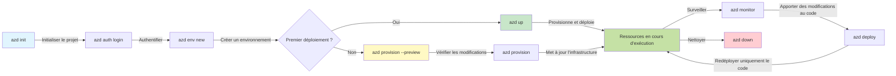
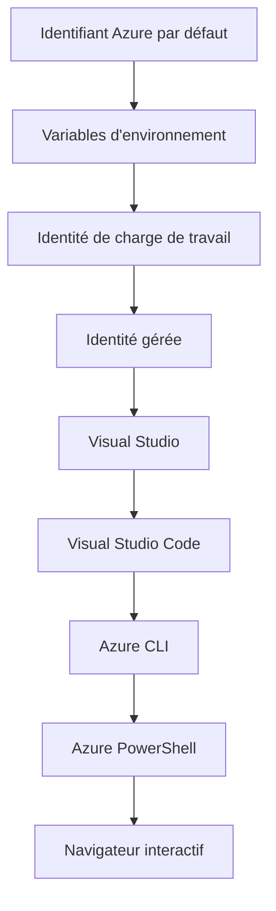

# AZD Basics - Comprendre Azure Developer CLI

# AZD Basics - Concepts de base et fondamentaux

**Navigation du chapitre :**
- **📚 Accueil du cours**: [AZD For Beginners](../../README.md)
- **📖 Chapitre actuel**: Chapitre 1 - Fondations & Démarrage rapide
- **⬅️ Précédent**: [Course Overview](../../README.md#-chapter-1-foundation--quick-start)
- **➡️ Suivant**: [Installation & Setup](installation.md)
- **🚀 Chapitre suivant**: [Chapitre 2 : Développement axé IA](../chapter-02-ai-development/microsoft-foundry-integration.md)

## Introduction

Cette leçon vous présente Azure Developer CLI (azd), un outil en ligne de commande puissant qui accélère votre parcours du développement local au déploiement sur Azure. Vous apprendrez les concepts fondamentaux, les fonctionnalités principales et comprendrez comment azd simplifie le déploiement d'applications cloud-natives.

## Objectifs d'apprentissage

À la fin de cette leçon, vous serez capable de :
- Comprendre ce qu'est Azure Developer CLI et son objectif principal
- Apprendre les concepts clés des templates, des environnements et des services
- Explorer les fonctionnalités clés incluant le développement basé sur des templates et l'Infrastructure en tant que Code
- Comprendre la structure et le flux de travail d'un projet azd
- Être prêt à installer et configurer azd pour votre environnement de développement

## Résultats d'apprentissage

Après avoir terminé cette leçon, vous serez en mesure de :
- Expliquer le rôle d'azd dans les workflows de développement cloud modernes
- Identifier les composants de la structure d'un projet azd
- Décrire comment les templates, les environnements et les services fonctionnent ensemble
- Comprendre les avantages de l'Infrastructure en tant que Code avec azd
- Reconnaître les différentes commandes azd et leurs objectifs

## Qu'est-ce que Azure Developer CLI (azd) ?

Azure Developer CLI (azd) est un outil en ligne de commande conçu pour accélérer votre parcours du développement local au déploiement sur Azure. Il simplifie le processus de construction, de déploiement et de gestion d'applications cloud-natives sur Azure.

### Que pouvez-vous déployer avec azd ?

azd prend en charge une large gamme de charges de travail — et la liste ne cesse de s'allonger. Aujourd'hui, vous pouvez utiliser azd pour déployer :

| Workload Type | Examples | Same Workflow? |
|---------------|----------|----------------|
| **Traditional applications** | Web apps, REST APIs, static sites | ✅ `azd up` |
| **Services and microservices** | Container Apps, Function Apps, multi-service backends | ✅ `azd up` |
| **AI-powered applications** | Chat apps with Microsoft Foundry Models, RAG solutions with AI Search | ✅ `azd up` |
| **Intelligent agents** | Foundry-hosted agents, multi-agent orchestrations | ✅ `azd up` |

L'idée clé est que **le cycle de vie d'azd reste le même quel que soit ce que vous déployez**. Vous initialisez un projet, provisionnez l'infrastructure, déployez votre code, surveillez votre application et nettoyez — que ce soit un site simple ou un agent IA sophistiqué.

Cette continuité est voulue. azd considère les capacités IA comme un autre type de service que votre application peut utiliser, et non comme quelque chose de fondamentalement différent. Un point de terminaison de chat basé sur Microsoft Foundry Models est, du point de vue d'azd, juste un autre service à configurer et déployer.

### 🎯 Pourquoi utiliser AZD? Une comparaison concrète

Comparons le déploiement d'une simple application web avec base de données :

#### ❌ SANS AZD: Déploiement manuel sur Azure (30+ minutes)

```bash
# Étape 1 : Créer un groupe de ressources
az group create --name myapp-rg --location eastus

# Étape 2 : Créer un plan App Service
az appservice plan create --name myapp-plan \
  --resource-group myapp-rg \
  --sku B1 --is-linux

# Étape 3 : Créer l'application Web
az webapp create --name myapp-web-unique123 \
  --resource-group myapp-rg \
  --plan myapp-plan \
  --runtime "NODE:18-lts"

# Étape 4 : Créer un compte Cosmos DB (10-15 minutes)
az cosmosdb create --name myapp-cosmos-unique123 \
  --resource-group myapp-rg \
  --kind MongoDB

# Étape 5 : Créer la base de données
az cosmosdb mongodb database create \
  --account-name myapp-cosmos-unique123 \
  --resource-group myapp-rg \
  --name tododb

# Étape 6 : Créer une collection
az cosmosdb mongodb collection create \
  --account-name myapp-cosmos-unique123 \
  --resource-group myapp-rg \
  --database-name tododb \
  --name todos

# Étape 7 : Obtenir la chaîne de connexion
CONN_STR=$(az cosmosdb keys list \
  --name myapp-cosmos-unique123 \
  --resource-group myapp-rg \
  --type connection-strings \
  --query "connectionStrings[0].connectionString" -o tsv)

# Étape 8 : Configurer les paramètres de l'application
az webapp config appsettings set \
  --name myapp-web-unique123 \
  --resource-group myapp-rg \
  --settings MONGODB_URI="$CONN_STR"

# Étape 9 : Activer la journalisation
az webapp log config --name myapp-web-unique123 \
  --resource-group myapp-rg \
  --application-logging filesystem \
  --detailed-error-messages true

# Étape 10 : Configurer Application Insights
az monitor app-insights component create \
  --app myapp-insights \
  --location eastus \
  --resource-group myapp-rg

# Étape 11 : Lier Application Insights à l'application Web
INSTRUMENTATION_KEY=$(az monitor app-insights component show \
  --app myapp-insights \
  --resource-group myapp-rg \
  --query "instrumentationKey" -o tsv)

az webapp config appsettings set \
  --name myapp-web-unique123 \
  --resource-group myapp-rg \
  --settings APPINSIGHTS_INSTRUMENTATIONKEY="$INSTRUMENTATION_KEY"

# Étape 12 : Construire l'application localement
npm install
npm run build

# Étape 13 : Créer le package de déploiement
zip -r app.zip . -x "*.git*" "node_modules/*"

# Étape 14 : Déployer l'application
az webapp deployment source config-zip \
  --resource-group myapp-rg \
  --name myapp-web-unique123 \
  --src app.zip

# Étape 15 : Attendre et prier pour que ça fonctionne 🙏
# (Aucune validation automatisée, test manuel requis)
```

**Problems:**
- ❌ 15+ commandes à mémoriser et exécuter dans l'ordre
- ❌ 30-45 minutes de travail manuel
- ❌ Facile de commettre des erreurs (typos, mauvais paramètres)
- ❌ Chaînes de connexion exposées dans l'historique du terminal
- ❌ Pas de rollback automatisé si quelque chose échoue
- ❌ Difficile à reproduire pour les membres de l'équipe
- ❌ Différent à chaque fois (non reproductible)

#### ✅ AVEC AZD: Déploiement automatisé (5 commandes, 10-15 minutes)

```bash
# Étape 1 : Initialiser à partir du modèle
azd init --template todo-nodejs-mongo

# Étape 2 : S'authentifier
azd auth login

# Étape 3 : Créer l'environnement
azd env new dev

# Étape 4 : Aperçu des modifications (optionnel mais recommandé)
azd provision --preview

# Étape 5 : Déployer tout
azd up

# ✨ Terminé ! Tout est déployé, configuré et surveillé
```

**Benefits:**
- ✅ **5 commandes** vs. 15+ étapes manuelles
- ✅ **10-15 minutes** au total (principalement en attente d'Azure)
- ✅ **Zéro erreurs** - automatisé et testé
- ✅ **Secrets gérés en toute sécurité** via Key Vault
- ✅ **Rollback automatique** en cas d'échec
- ✅ **Entièrement reproductible** - même résultat à chaque fois
- ✅ **Prêt pour l'équipe** - n'importe qui peut déployer avec les mêmes commandes
- ✅ **Infrastructure en tant que Code** - templates Bicep versionnés
- ✅ **Surveillance intégrée** - Application Insights configuré automatiquement

### 📊 Réduction du temps et des erreurs

| Metric | Manual Deployment | AZD Deployment | Improvement |
|:-------|:------------------|:---------------|:------------|
| **Commands** | 15+ | 5 | 67% fewer |
| **Time** | 30-45 min | 10-15 min | 60% faster |
| **Error Rate** | ~40% | <5% | 88% reduction |
| **Consistency** | Low (manual) | 100% (automated) | Perfect |
| **Team Onboarding** | 2-4 hours | 30 minutes | 75% faster |
| **Rollback Time** | 30+ min (manual) | 2 min (automated) | 93% faster |

## Concepts fondamentaux

### Templates
Les templates sont la base d'azd. Ils contiennent :
- **Code de l'application** - Votre code source et dépendances
- **Définitions d'infrastructure** - Ressources Azure définies en Bicep ou Terraform
- **Fichiers de configuration** - Paramètres et variables d'environnement
- **Scripts de déploiement** - Workflows de déploiement automatisés

### Environnements
Les environnements représentent différentes cibles de déploiement :
- **Development** - Pour les tests et le développement
- **Staging** - Environnement de pré-production
- **Production** - Environnement de production en direct

Chaque environnement conserve son propre :
- Groupe de ressources Azure
- Paramètres de configuration
- État de déploiement

### Services
Les services sont les blocs de construction de votre application :
- **Frontend** - Applications web, SPA
- **Backend** - APIs, microservices
- **Database** - Solutions de stockage de données
- **Storage** - Stockage de fichiers et blobs

## Fonctionnalités clés

### 1. Développement basé sur des templates
```bash
# Parcourir les modèles disponibles
azd template list

# Initialiser à partir d'un modèle
azd init --template <template-name>
```

### 2. Infrastructure en tant que Code
- **Bicep** - Langage spécifique au domaine d'Azure
- **Terraform** - Outil d'infrastructure multi-cloud
- **ARM Templates** - Templates Azure Resource Manager

### 3. Workflows intégrés
```bash
# Flux de déploiement complet
azd up            # Provisionnement + déploiement : entièrement automatisé pour la configuration initiale

# 🧪 NOUVEAU : prévisualisez les modifications d'infrastructure avant le déploiement (SÛR)
azd provision --preview    # Simulez le déploiement de l'infrastructure sans effectuer de modifications

azd provision     # Créez des ressources Azure : si vous mettez à jour l'infrastructure, utilisez ceci
azd deploy        # Déployez le code de l'application ou redéployez-le une fois la mise à jour effectuée
azd down          # Nettoyer les ressources
```

#### 🛡️ Planification sûre de l'infrastructure avec aperçu
La commande `azd provision --preview` change la donne pour des déploiements sûrs :
- **Analyse en simulation** - Montre ce qui sera créé, modifié ou supprimé
- **Zéro risque** - Aucun changement réel n'est effectué dans votre environnement Azure
- **Collaboration d'équipe** - Partagez les résultats de l'aperçu avant le déploiement
- **Estimation des coûts** - Comprenez les coûts des ressources avant de vous engager

```bash
# Exemple de flux de travail d'aperçu
azd provision --preview           # Voir ce qui va changer
# Examiner le résultat, en discuter avec l'équipe
azd provision                     # Appliquer les modifications en toute confiance
```

### 📊 Visuel : Workflow de développement AZD


```mermaid
graph LR
    A[azd init] -->|Initialiser le projet| B[azd auth login]
    B -->|Authentifier| C[azd env new]
    C -->|Créer un environnement| D{Premier déploiement ?}
    D -->|Oui| E[azd up]
    D -->|Non| F[azd provision --preview]
    F -->|Vérifier les modifications| G[azd provision]
    E -->|Provisionne et déploie| H[Ressources en cours d'exécution]
    G -->|Met à jour l'infrastructure| H
    H -->|Surveiller| I[azd monitor]
    I -->|Apporter des modifications au code| J[azd deploy]
    J -->|Redéployer uniquement le code| H
    H -->|Nettoyer| K[azd down]
    
    style A fill:#e1f5fe
    style E fill:#c8e6c9
    style F fill:#fff9c4
    style H fill:#c5e1a5
    style K fill:#ffcdd2
```
**Explication du workflow :**
1. **Init** - Commencez avec un template ou un nouveau projet
2. **Auth** - Authentifiez-vous auprès d'Azure
3. **Environment** - Créez un environnement de déploiement isolé
4. **Preview** - 🆕 Prévisualisez toujours d'abord les changements d'infrastructure (bonne pratique)
5. **Provision** - Créez/mettre à jour les ressources Azure
6. **Deploy** - Poussez le code de votre application
7. **Monitor** - Surveillez les performances de l'application
8. **Iterate** - Apportez des modifications et redéployez le code
9. **Cleanup** - Supprimez les ressources lorsque c'est terminé

### 4. Gestion des environnements
```bash
# Créer et gérer des environnements
azd env new <environment-name>
azd env select <environment-name>
azd env list
```

### 5. Extensions et commandes IA

azd utilise un système d'extensions pour ajouter des capacités au-delà du CLI de base. Ceci est particulièrement utile pour les charges de travail IA :

```bash
# Lister les extensions disponibles
azd extension list

# Installer l'extension Foundry Agents
azd extension install azure.ai.agents

# Initialiser un projet d'agent IA à partir d'un manifeste
azd ai agent init -m agent-manifest.yaml

# Démarrer le serveur MCP pour le développement assisté par IA (Alpha)
azd mcp start
```

> Les extensions sont couvertes en détail dans [Chapitre 2 : Développement axé IA](../chapter-02-ai-development/agents.md) et la référence [AZD AI CLI Commands](../chapter-08-production/production-ai-practices.md#azd-ai-cli-commands-and-extensions).

## 📁 Structure du projet

Une structure de projet azd typique :
```
my-app/
├── .azd/                    # azd configuration
│   └── config.json
├── .azure/                  # Azure deployment artifacts
├── .devcontainer/          # Development container config
├── .github/workflows/      # GitHub Actions
├── .vscode/               # VS Code settings
├── infra/                 # Infrastructure code
│   ├── main.bicep        # Main infrastructure template
│   ├── main.parameters.json
│   └── modules/          # Reusable modules
├── src/                  # Application source code
│   ├── api/             # Backend services
│   └── web/             # Frontend application
├── azure.yaml           # azd project configuration
└── README.md
```

## 🔧 Fichiers de configuration

### azure.yaml
Le fichier de configuration principal du projet :
```yaml
name: my-awesome-app
metadata:
  template: my-template@1.0.0

services:
  web:
    project: ./src/web
    language: js
    host: appservice
  api:
    project: ./src/api
    language: js
    host: appservice

hooks:
  preprovision:
    shell: pwsh
    run: echo "Preparing to provision..."
```

### .azure/config.json
Configuration spécifique à l'environnement :
```json
{
  "version": 1,
  "defaultEnvironment": "dev",
  "environments": {
    "dev": {
      "subscriptionId": "your-subscription-id",
      "location": "eastus"
    }
  }
}
```

## 🎪 Workflows courants avec exercices pratiques

> **💡 Astuce d'apprentissage :** Suivez ces exercices dans l'ordre pour développer progressivement vos compétences AZD.

### 🎯 Exercice 1 : Initialisez votre premier projet

**Objectif :** Créer un projet AZD et explorer sa structure

**Étapes :**
```bash
# Utilisez un modèle éprouvé
azd init --template todo-nodejs-mongo

# Explorez les fichiers générés
ls -la  # Voir tous les fichiers, y compris les fichiers cachés

# Fichiers clés créés :
# - azure.yaml (configuration principale)
# - infra/ (code d'infrastructure)
# - src/ (code de l'application)
```

**✅ Succès :** Vous avez les répertoires azure.yaml, infra/ et src/

---

### 🎯 Exercice 2 : Déployer sur Azure

**Objectif :** Compléter un déploiement de bout en bout

**Étapes :**
```bash
# 1. S'authentifier
az login && azd auth login

# 2. Créer l'environnement
azd env new dev
azd env set AZURE_LOCATION eastus

# 3. Prévisualiser les modifications (RECOMMANDÉ)
azd provision --preview

# 4. Tout déployer
azd up

# 5. Vérifier le déploiement
azd show    # Voir l'URL de votre application
```

**Temps estimé :** 10-15 minutes  
**✅ Succès :** L'URL de l'application s'ouvre dans le navigateur

---

### 🎯 Exercice 3 : Environnements multiples

**Objectif :** Déployer en dev et staging

**Étapes :**
```bash
# Il y a déjà 'dev', créer 'staging'
azd env new staging
azd env set AZURE_LOCATION westus2
azd up

# Basculer entre les deux
azd env list
azd env select dev
```

**✅ Succès :** Deux groupes de ressources séparés dans le portail Azure

---

### 🛡️ Remise à zéro complète : `azd down --force --purge`

Lorsque vous devez réinitialiser complètement :

```bash
azd down --force --purge
```

**Ce que cela fait :**
- `--force`: Pas d'invite de confirmation
- `--purge`: Supprime tout l'état local et les ressources Azure

**À utiliser lorsque :**
- Le déploiement a échoué en cours de route
- Changement de projet
- Besoin d'un nouveau départ

---

## 🎪 Référence du workflow original

### Démarrer un nouveau projet
```bash
# Méthode 1 : Utiliser un modèle existant
azd init --template todo-nodejs-mongo

# Méthode 2 : Partir de zéro
azd init

# Méthode 3 : Utiliser le répertoire courant
azd init .
```

### Cycle de développement
```bash
# Mettre en place l'environnement de développement
azd auth login
azd env new dev
azd env select dev

# Déployer tout
azd up

# Apporter des modifications et redéployer
azd deploy

# Nettoyer une fois terminé
azd down --force --purge # La commande dans l'Azure Developer CLI est une **réinitialisation complète** pour votre environnement—particulièrement utile lorsque vous dépannez des déploiements échoués, nettoyez des ressources orphelines ou préparez un nouveau redéploiement.
```

## Comprendre `azd down --force --purge`
La commande `azd down --force --purge` est un moyen puissant de démanteler complètement votre environnement azd et toutes les ressources associées. Voici une répartition de ce que fait chaque flag :
```
--force
```
- Ignore les invites de confirmation.
- Utile pour l'automatisation ou le scripting lorsque l'entrée manuelle n'est pas possible.
- Garantit que la suppression se déroule sans interruption, même si le CLI détecte des incohérences.

```
--purge
```
Supprime **toutes les métadonnées associées**, y compris :
État de l'environnement
Dossier local `.azure`
Infos de déploiement en cache
Empêche azd de "se souvenir" des déploiements précédents, ce qui peut causer des problèmes comme des groupes de ressources non appariés ou des références de registre obsolètes.


### Pourquoi utiliser les deux ?
Lorsque vous êtes bloqué avec `azd up` à cause d'un état persistant ou de déploiements partiels, cette combinaison garantit une **ardoise propre**.

C'est particulièrement utile après des suppressions manuelles de ressources dans le portail Azure ou lors du changement de templates, d'environnements ou de conventions de nommage des groupes de ressources.


### Gestion de plusieurs environnements
```bash
# Créer un environnement de préproduction
azd env new staging
azd env select staging
azd up

# Revenir à l'environnement de développement
azd env select dev

# Comparer les environnements
azd env list
```

## 🔐 Authentification et identifiants

Comprendre l'authentification est crucial pour des déploiements azd réussis. Azure utilise plusieurs méthodes d'authentification, et azd exploite la même chaîne d'identifiants utilisée par les autres outils Azure.

### Authentification via Azure CLI (`az login`)

Avant d'utiliser azd, vous devez vous authentifier auprès d'Azure. La méthode la plus courante est d'utiliser Azure CLI :

```bash
# Connexion interactive (ouvre le navigateur)
az login

# Connexion avec un locataire spécifique
az login --tenant <tenant-id>

# Connexion avec un principal de service
az login --service-principal -u <app-id> -p <password> --tenant <tenant-id>

# Vérifier l'état de connexion actuel
az account show

# Lister les abonnements disponibles
az account list --output table

# Définir l'abonnement par défaut
az account set --subscription <subscription-id>
```

### Flux d'authentification
1. **Connexion interactive** : Ouvre votre navigateur par défaut pour l'authentification
2. **Device Code Flow** : Pour les environnements sans accès navigateur
3. **Service Principal** : Pour l'automatisation et les scénarios CI/CD
4. **Managed Identity** : Pour les applications hébergées sur Azure

### DefaultAzureCredential Chain

`DefaultAzureCredential` est un type d'identifiant qui fournit une expérience d'authentification simplifiée en essayant automatiquement plusieurs sources d'identifiants dans un ordre spécifique :

#### Ordre de la chaîne d'identifiants

```mermaid
graph TD
    A[Identifiant Azure par défaut] --> B[Variables d'environnement]
    B --> C[Identité de charge de travail]
    C --> D[Identité gérée]
    D --> E[Visual Studio]
    E --> F[Visual Studio Code]
    F --> G[Azure CLI]
    G --> H[Azure PowerShell]
    H --> I[Navigateur interactif]
```
#### 1. Environment Variables
```bash
# Définir les variables d'environnement pour le principal de service
export AZURE_CLIENT_ID="<app-id>"
export AZURE_CLIENT_SECRET="<password>"
export AZURE_TENANT_ID="<tenant-id>"
```

#### 2. Workload Identity (Kubernetes/GitHub Actions)
Utilisé automatiquement dans :
- Azure Kubernetes Service (AKS) avec Workload Identity
- GitHub Actions avec fédération OIDC
- Autres scénarios d'identité fédérée

#### 3. Managed Identity
Pour les ressources Azure telles que :
- Virtual Machines
- App Service
- Azure Functions
- Container Instances

```bash
# Vérifie si le code s'exécute sur une ressource Azure avec une identité gérée
az account show --query "user.type" --output tsv
# Renvoie: "servicePrincipal" si une identité gérée est utilisée
```

#### 4. Intégration des outils de développement
- **Visual Studio** : Utilise automatiquement le compte connecté
- **VS Code** : Utilise les identifiants de l'extension Azure Account
- **Azure CLI** : Utilise les identifiants `az login` (le plus courant pour le développement local)

### Configuration de l'authentification AZD

```bash
# Méthode 1 : Utiliser Azure CLI (recommandé pour le développement)
az login
azd auth login  # Utilise les identifiants Azure CLI existants

# Méthode 2 : Authentification directe avec azd
azd auth login --use-device-code  # Pour les environnements sans interface graphique

# Méthode 3 : Vérifier l'état d'authentification
azd auth login --check-status

# Méthode 4 : Se déconnecter et se réauthentifier
azd auth logout
azd auth login
```

### Bonnes pratiques d'authentification

#### Pour le développement local
```bash
# 1. Se connecter avec Azure CLI
az login

# 2. Vérifier que l'abonnement est correct
az account show
az account set --subscription "Your Subscription Name"

# 3. Utiliser azd avec les identifiants existants
azd auth login
```

#### Pour les pipelines CI/CD
```yaml
# GitHub Actions example
- name: Azure Login
  uses: azure/login@v1
  with:
    creds: ${{ secrets.AZURE_CREDENTIALS }}

- name: Deploy with azd
  run: |
    azd auth login --client-id ${{ secrets.AZURE_CLIENT_ID }} \
                    --client-secret ${{ secrets.AZURE_CLIENT_SECRET }} \
                    --tenant-id ${{ secrets.AZURE_TENANT_ID }}
    azd up --no-prompt
```

#### Pour les environnements de production
- Utilisez **Managed Identity** lorsque vous exécutez sur des ressources Azure
- Utilisez **Service Principal** pour les scénarios d'automatisation
- Évitez de stocker des identifiants dans le code ou les fichiers de configuration
- Utilisez **Azure Key Vault** pour la configuration sensible

### Problèmes courants d'authentification et solutions

#### Problème : "No subscription found"
```bash
# Solution : définir l'abonnement par défaut
az account list --output table
az account set --subscription "<subscription-id>"
azd env set AZURE_SUBSCRIPTION_ID "<subscription-id>"
```

#### Problème : "Insufficient permissions"
```bash
# Solution : vérifier et attribuer les rôles requis
az role assignment list --assignee $(az account show --query user.name --output tsv)

# Rôles requis courants :
# - Contributeur (pour la gestion des ressources)
# - Administrateur de l'accès utilisateur (pour les attributions de rôles)
```

#### Problème : "Token expired"
```bash
# Solution : Se réauthentifier
az logout
az login
azd auth logout
azd auth login
```

### Authentification dans différents scénarios

#### Développement local
```bash
# Compte de développement personnel
az login
azd auth login
```

#### Travail en équipe
```bash
# Utiliser un locataire spécifique pour l'organisation
az login --tenant contoso.onmicrosoft.com
azd auth login
```

#### Scénarios multi-locataires
```bash
# Basculer entre les locataires
az login --tenant tenant1.onmicrosoft.com
# Déployer vers le locataire 1
azd up

az login --tenant tenant2.onmicrosoft.com  
# Déployer vers le locataire 2
azd up
```

### Considérations de sécurité
1. **Stockage des identifiants**: Ne stockez jamais d’identifiants dans le code source
2. **Limitation de la portée**: Appliquez le principe du moindre privilège pour les principals de service
3. **Rotation des jetons**: Faites régulièrement tourner les secrets des principals de service
4. **Piste d'audit**: Surveillez les activités d'authentification et de déploiement
5. **Sécurité réseau**: Utilisez des points de terminaison privés lorsque c'est possible

### Dépannage de l'authentification

```bash
# Déboguer les problèmes d'authentification
azd auth login --check-status
az account show
az account get-access-token

# Commandes de diagnostic courantes
whoami                          # Contexte de l'utilisateur actuel
az ad signed-in-user show      # Détails de l'utilisateur Azure AD
az group list                  # Tester l'accès aux ressources
```

## Comprendre `azd down --force --purge`

### Découverte
```bash
azd template list              # Parcourir les modèles
azd template show <template>   # Détails du modèle
azd init --help               # Options d'initialisation
```

### Gestion de projet
```bash
azd show                     # Vue d'ensemble du projet
azd env show                 # Environnement actuel
azd config list             # Paramètres de configuration
```

### Surveillance
```bash
azd monitor                  # Ouvrir la surveillance du portail Azure
azd monitor --logs           # Afficher les journaux de l'application
azd monitor --live           # Afficher les métriques en temps réel
azd pipeline config          # Configurer l'intégration continue et le déploiement continu
```

## Bonnes pratiques

### 1. Utiliser des noms significatifs
```bash
# Bon
azd env new production-east
azd init --template web-app-secure

# Éviter
azd env new env1
azd init --template template1
```

### 2. Exploiter les modèles
- Commencez par des modèles existants
- Personnalisez selon vos besoins
- Créez des modèles réutilisables pour votre organisation

### 3. Isolation des environnements
- Utilisez des environnements distincts pour dev/staging/prod
- Ne déployez jamais directement en production depuis une machine locale
- Utilisez des pipelines CI/CD pour les déploiements en production

### 4. Gestion de la configuration
- Utilisez des variables d'environnement pour les données sensibles
- Conservez la configuration dans le contrôle de version
- Documentez les paramètres spécifiques à chaque environnement

## Progression d'apprentissage

### Débutant (Semaine 1-2)
1. Installez azd et authentifiez-vous
2. Déployez un modèle simple
3. Comprenez la structure du projet
4. Apprenez les commandes de base (up, down, deploy)

### Intermédiaire (Semaine 3-4)
1. Personnalisez les modèles
2. Gérez plusieurs environnements
3. Comprenez le code d'infrastructure
4. Mettez en place des pipelines CI/CD

### Avancé (Semaine 5+)
1. Créez des modèles personnalisés
2. Schémas d'infrastructure avancés
3. Déploiements multi-région
4. Configurations de niveau entreprise

## Prochaines étapes

**📖 Poursuivre l'apprentissage du Chapitre 1 :**
- [Installation et configuration](installation.md) - Installez et configurez azd
- [Votre premier projet](first-project.md) - Tutoriel pratique complet
- [Guide de configuration](configuration.md) - Options de configuration avancées

**🎯 Prêt pour le prochain chapitre ?**
- [Chapitre 2 : Développement axé IA](../chapter-02-ai-development/microsoft-foundry-integration.md) - Commencez à créer des applications d'IA

## Ressources supplémentaires

- [Présentation d'Azure Developer CLI](https://learn.microsoft.com/en-us/azure/developer/azure-developer-cli/)
- [Galerie de modèles](https://azure.github.io/awesome-azd/)
- [Exemples de la communauté](https://github.com/Azure-Samples)

---

## 🙋 Questions fréquemment posées

### Questions générales

**Q: What's the difference between AZD and Azure CLI?**

A: Azure CLI (`az`) is for managing individual Azure resources. AZD (`azd`) is for managing entire applications:

```bash
# Azure CLI - gestion des ressources de bas niveau
az webapp create --name myapp --resource-group rg
az sql server create --name myserver --resource-group rg
# ...beaucoup d'autres commandes nécessaires

# AZD - gestion au niveau de l'application
azd up  # Déploie l'ensemble de l'application avec toutes ses ressources
```

**Pensez-y ainsi :**
- `az` = Opération sur des briques Lego individuelles
- `azd` = Travailler avec des ensembles Lego complets

---

**Q: Do I need to know Bicep or Terraform to use AZD?**

A: Non ! Commencez par des modèles :
```bash
# Utilisez le modèle existant - aucune connaissance en IaC nécessaire
azd init --template todo-nodejs-mongo
azd up
```

Vous pouvez apprendre Bicep plus tard pour personnaliser l'infrastructure. Les modèles fournissent des exemples fonctionnels dont vous pouvez vous inspirer.

---

**Q: How much does it cost to run AZD templates?**

A: Les coûts varient selon le modèle. La plupart des modèles de développement coûtent 50 à 150 $/mois :

```bash
# Prévisualiser les coûts avant le déploiement
azd provision --preview

# Nettoyez toujours lorsque vous ne l'utilisez pas
azd down --force --purge  # Supprime toutes les ressources
```

**Astuce :** Utilisez les niveaux gratuits lorsque disponibles :
- App Service: F1 (Free) tier
- Microsoft Foundry Models: Azure OpenAI 50 000 jetons/mois gratuits
- Cosmos DB: 1000 RU/s free tier

---

**Q: Can I use AZD with existing Azure resources?**

A: Oui, mais il est plus simple de partir de zéro. AZD fonctionne mieux lorsqu'il gère tout le cycle de vie. Pour des ressources existantes :

```bash
# Option 1 : Importer des ressources existantes (avancé)
azd init
# Puis modifiez infra/ pour référencer les ressources existantes

# Option 2 : Repartir de zéro (recommandé)
azd init --template matching-your-stack
azd up  # Crée un nouvel environnement
```

---

**Q: How do I share my project with teammates?**

A: Mettez le projet AZD dans Git (mais PAS le dossier .azure) :

```bash
# Déjà dans .gitignore par défaut
.azure/        # Contient des secrets et des données d'environnement
*.env          # Variables d'environnement

# Membres de l'équipe ensuite :
git clone <your-repo>
azd auth login
azd env new <their-name>-dev
azd up
```

Tout le monde obtient la même infrastructure à partir des mêmes modèles.

---

### Questions de dépannage

**Q: "azd up" failed halfway. What do I do?**

A: Vérifiez l'erreur, corrigez-la, puis réessayez :

```bash
# Afficher les journaux détaillés
azd show

# Corrections courantes :

# 1. Si le quota est dépassé :
azd env set AZURE_LOCATION "westus2"  # Essayez une autre région

# 2. Si conflit de nom de ressource :
azd down --force --purge  # Repartir de zéro
azd up  # Réessayer

# 3. Si l'authentification a expiré :
az login
azd auth login
azd up
```

**Problème le plus courant :** Abonnement Azure incorrect sélectionné
```bash
az account list --output table
az account set --subscription "<correct-subscription>"
```

---

**Q: How do I deploy just code changes without reprovisioning?**

A: Utilisez `azd deploy` au lieu de `azd up` :

```bash
azd up          # Première fois : provisionnement + déploiement (lent)

# Apportez des modifications au code...

azd deploy      # Les fois suivantes : déploiement uniquement (rapide)
```

Comparaison de vitesse :
- `azd up`: 10-15 minutes (provisionne l'infrastructure)
- `azd deploy`: 2-5 minutes (code uniquement)

---

**Q: Can I customize the infrastructure templates?**

A: Oui ! Modifiez les fichiers Bicep dans `infra/` :

```bash
# Après azd init
cd infra/
code main.bicep  # Modifier dans VS Code

# Aperçu des modifications
azd provision --preview

# Appliquer les modifications
azd provision
```

**Astuce :** Commencez petit - changez d'abord les SKUs :
```bicep
// infra/main.bicep
sku: {
  name: 'B1'  // Change to 'P1V2' for production
}
```

---

**Q: How do I delete everything AZD created?**

A: Une commande supprime toutes les ressources :

```bash
azd down --force --purge

# Cela supprime :
# - Toutes les ressources Azure
# - Le groupe de ressources
# - L'état de l'environnement local
# - Données de déploiement mises en cache
```

**Exécutez toujours ceci lorsque :**
- Tests d'un modèle terminés
- Passage à un projet différent
- Vous souhaitez repartir à zéro

**Économies :** Supprimer les ressources inutilisées = 0 $ de facturation

---

**Q: What if I accidentally deleted resources in Azure Portal?**

A: L'état d'AZD peut être désynchronisé. Approche de remise à zéro :

```bash
# 1. Supprimer l'état local
azd down --force --purge

# 2. Repartir à zéro
azd up

# Alternative : Laisser AZD détecter et corriger
azd provision  # Créera les ressources manquantes
```

---

### Questions avancées

**Q: Can I use AZD in CI/CD pipelines?**

A: Oui ! Exemple avec GitHub Actions :

```yaml
# .github/workflows/deploy.yml
name: Deploy with AZD

on:
  push:
    branches: [main]

jobs:
  deploy:
    runs-on: ubuntu-latest
    steps:
      - uses: actions/checkout@v2
      
      - name: Install azd
        run: curl -fsSL https://aka.ms/install-azd.sh | bash
      
      - name: Azure Login
        run: |
          azd auth login \
            --client-id ${{ secrets.AZURE_CLIENT_ID }} \
            --client-secret ${{ secrets.AZURE_CLIENT_SECRET }} \
            --tenant-id ${{ secrets.AZURE_TENANT_ID }}
      
      - name: Deploy
        run: azd up --no-prompt
```

---

**Q: How do I handle secrets and sensitive data?**

A: AZD s'intègre automatiquement à Azure Key Vault :

```bash
# Les secrets sont stockés dans Key Vault, pas dans le code
azd env set DATABASE_PASSWORD "$(openssl rand -base64 32)"

# AZD effectue automatiquement :
# 1. Crée un Key Vault
# 2. Stocke le secret
# 3. Accorde à l'application l'accès via une identité gérée
# 4. Injecte à l'exécution
```

**Ne validez jamais :**
- `.azure/` folder (contains environment data)
- `.env` files (local secrets)
- Connection strings

---

**Q: Can I deploy to multiple regions?**

A: Oui, créez un environnement par région :

```bash
# Environnement Est des États-Unis
azd env new prod-eastus
azd env set AZURE_LOCATION eastus
azd up

# Environnement Europe de l'Ouest
azd env new prod-westeurope
azd env set AZURE_LOCATION westeurope
azd up

# Chaque environnement est indépendant
azd env list
```

Pour de vraies applications multi-région, personnalisez les modèles Bicep pour déployer simultanément dans plusieurs régions.

---

**Q: Where can I get help if I'm stuck?**

1. **Documentation AZD:** https://learn.microsoft.com/azure/developer/azure-developer-cli/
2. **Issues GitHub:** https://github.com/Azure/azure-dev/issues
3. **Discord:** [Azure Discord](https://discord.gg/microsoft-azure) - #azure-developer-cli channel
4. **Stack Overflow:** Tag `azure-developer-cli`
5. **Ce cours:** [Guide de dépannage](../chapter-07-troubleshooting/common-issues.md)

**Astuce :** Avant de demander, exécutez :
```bash
azd show       # Affiche l'état actuel
azd version    # Affiche votre version
```
Incluez ces informations dans votre question pour obtenir une aide plus rapide.

---

## 🎓 Et ensuite ?

Vous comprenez maintenant les fondamentaux d'AZD. Choisissez votre parcours :

### 🎯 Pour les débutants :
1. **Next:** [Installation et configuration](installation.md) - Installez AZD sur votre machine
2. **Then:** [Votre premier projet](first-project.md) - Déployez votre première application
3. **Practice:** Complétez les 3 exercices de cette leçon

### 🚀 Pour les développeurs IA :
1. **Skip to:** [Chapitre 2 : Développement axé IA](../chapter-02-ai-development/microsoft-foundry-integration.md)
2. **Deploy:** Commencez avec `azd init --template get-started-with-ai-chat`
3. **Learn:** Construisez pendant que vous déployez

### 🏗️ Pour les développeurs expérimentés :
1. **Review:** [Guide de configuration](configuration.md) - Paramètres avancés
2. **Explore:** [Infrastructure en tant que code](../chapter-04-infrastructure/provisioning.md) - Approfondissement Bicep
3. **Build:** Créez des modèles personnalisés pour votre stack

---

**Navigation du chapitre:**
- **📚 Accueil du cours**: [AZD For Beginners](../../README.md)
- **📖 Chapitre actuel**: Chapitre 1 - Fondations et démarrage rapide  
- **⬅️ Précédent**: [Aperçu du cours](../../README.md#-chapter-1-foundation--quick-start)
- **➡️ Suivant**: [Installation et configuration](installation.md)
- **🚀 Chapitre suivant**: [Chapitre 2 : Développement axé IA](../chapter-02-ai-development/microsoft-foundry-integration.md)

---

<!-- CO-OP TRANSLATOR DISCLAIMER START -->
Avertissement :
Ce document a été traduit à l’aide du service de traduction par IA [Co-op Translator](https://github.com/Azure/co-op-translator). Bien que nous nous efforcions d’assurer l’exactitude, veuillez noter que les traductions automatisées peuvent contenir des erreurs ou des inexactitudes. Le document original dans sa langue d’origine doit être considéré comme la source faisant foi. Pour les informations critiques, il est recommandé de recourir à une traduction professionnelle réalisée par un être humain. Nous ne sommes pas responsables des malentendus ou des interprétations erronées résultant de l’utilisation de cette traduction.
<!-- CO-OP TRANSLATOR DISCLAIMER END -->