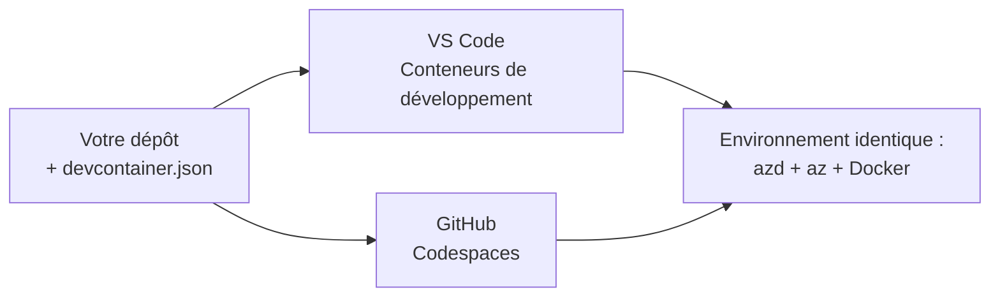

# Conteneurs de dev & GitHub Codespaces pour azd

**Navigation du chapitre :**
- **📚 Accueil du cours**: [AZD pour débutants](../../README.md)
- **📖 Chapitre actuel**: Chapitre 1 - Fondations et démarrage rapide
- **⬅️ Précédent**: [Apportez votre propre application](bring-your-own-app.md)
- **🚀 Chapitre suivant**: [Chapitre 2 : Développement axé sur l'IA](../chapter-02-ai-development/README.md)

> Validé avec `azd 1.25.6` en juin 2026.

## Introduction

Installer azd, le runtime de langage approprié, Docker et l'Azure CLI sur chaque machine est fastidieux — et c'est la raison principale pour laquelle un tutoriel qui "fonctionne sur ma machine" échoue pour quelqu'un d'autre. Un **dev container** résout ce problème en décrivant toute votre chaîne d'outils dans un fichier. Toute personne qui ouvre le projet dans VS Code ou GitHub Codespaces obtient exactement le même environnement, avec azd déjà installé. Cette leçon vous montre comment en ajouter un.

## Objectifs d'apprentissage

À la fin de cette leçon, vous allez :
- Comprendre ce qu'est un dev container et pourquoi il aide avec azd
- Ajouter un minimal `.devcontainer/devcontainer.json` à un projet
- Inclure azd, l'Azure CLI et Docker via les *features* des Dev Containers
- Ouvrir le projet dans GitHub Codespaces ou VS Code

## Résultats d'apprentissage

Après avoir complété cette leçon, vous serez capable de :
- Rédiger un `devcontainer.json` pour un projet azd
- Ajouter azd et les outils Azure sans installations manuelles
- Exécuter `azd up` depuis l'intérieur d'un conteneur ou d'un Codespace

---

## Qu'est-ce qu'un dev container ?

Un dev container est un environnement de développement basé sur Docker défini par un fichier `.devcontainer/devcontainer.json` dans votre dépôt. Lorsque vous ouvrez le projet :

- **VS Code** (avec l'extension Dev Containers) construit le conteneur et s'y attache.
- **GitHub Codespaces** construit le même conteneur dans le cloud et vous offre un éditeur dans le navigateur.

Dans les deux cas, chaque contributeur obtient les mêmes outils — fini le "as-tu installé azd ?".



---

## Étape 1 : Créer le fichier devcontainer

Créez `.devcontainer/devcontainer.json` à la racine de votre projet :

```json
{
  "name": "azd-project",
  "image": "mcr.microsoft.com/devcontainers/base:bookworm",
  "features": {
    "ghcr.io/devcontainers/features/azure-cli:1": {},
    "ghcr.io/azure/azure-dev/azd:latest": {},
    "ghcr.io/devcontainers/features/docker-in-docker:2": {},
    "ghcr.io/devcontainers/features/node:1": {}
  },
  "customizations": {
    "vscode": {
      "extensions": [
        "ms-azuretools.azure-dev",
        "ms-azuretools.vscode-bicep"
      ]
    }
  },
  "forwardPorts": [3000],
  "postCreateCommand": "azd version"
}
```

Ce que fait chaque partie :

| Key | Purpose |
|-----|---------|
| `image` | L'OS de base pour le conteneur |
| `features` | Installateurs préconfigurés — ici : Azure CLI, **azd**, Docker et Node.js |
| `customizations.vscode.extensions` | Installe automatiquement les extensions VS Code pour azd et Bicep |
| `forwardPorts` | Expose le port de votre application à votre navigateur |
| `postCreateCommand` | S'exécute une fois après la construction du conteneur (ici, un contrôle de cohérence) |

> La feature `ghcr.io/azure/azure-dev/azd:latest` est la manière officielle d'obtenir azd dans un conteneur. Épinglez une version spécifique (par exemple `azd:1.25.6`) si vous avez besoin de reproductibilité.

---

## Étape 2 : Adapter la feature à la langue de votre appli

Remplacez la feature `node` par celle que votre application utilise :

```jsonc
// Python project
"ghcr.io/devcontainers/features/python:1": {},

// .NET project
"ghcr.io/devcontainers/features/dotnet:2": {},

// Java project
"ghcr.io/devcontainers/features/java:1": {},

// Go project
"ghcr.io/devcontainers/features/go:1": {}
```

Conservez `docker-in-docker` si votre `host` est `containerapp`, `aks`, ou tout ce qui construit une image de conteneur — azd a besoin de Docker pour construire et pousser des images.

---

## Étape 3 : Ouvrez-le

**Dans VS Code :**
1. Installez l'extension **Dev Containers**.
2. Ouvrez le dossier du projet.
3. Cliquez sur **Reopen in Container** lorsqu'on vous le propose (ou lancez *Dev Containers: Reopen in Container*).

**Dans GitHub Codespaces :**
1. Poussez le dépôt sur GitHub.
2. Cliquez sur **Code → Codespaces → Create codespace on main**.
3. Attendez la construction du conteneur — azd est prêt dans le terminal.

---

## Étape 4 : Déployer depuis l'intérieur du conteneur

Le conteneur a azd préinstallé, donc le flux normal fonctionne simplement :

```bash
azd auth login --use-device-code   # Le code de l'appareil est pratique dans Codespaces
azd up
```

> **Pourquoi `--use-device-code` ?** Dans un conteneur distant ou un Codespace il n'y a pas de navigateur local vers lequel rediriger, donc la connexion par code d'appareil est la méthode fiable. Vous collerez un code dans un onglet de navigateur pour compléter la connexion.

---

## Pièges courants

| Pitfall | Fix |
|---------|-----|
| `azd up` can't build an image | Ajoutez la feature `docker-in-docker` |
| Browser login hangs in Codespaces | Utilisez `azd auth login --use-device-code` |
| Tools differ between teammates | Épinglez les versions des features (par ex. `azd:1.25.6`) |
| App not reachable in browser | Ajoutez le port dans `forwardPorts` |

---

## Résumé

- Un dev container rend votre chaîne d'outils azd reproductible pour tout le monde.
- Ajoutez azd, l'Azure CLI et Docker via les *features* des Dev Containers.
- Adaptez la feature de langage à votre appli et conservez `docker-in-docker` pour les hôtes conteneurs.
- Utilisez la connexion par code d'appareil quand vous êtes dans Codespaces.

---

## 🔗 Navigation

| Direction | Resource |
|-----------|----------|
| **Previous** | [Apportez votre propre application](bring-your-own-app.md) |
| **Chapter Home** | [Chapitre 1 : Fondations et démarrage rapide](README.md) |
| **Next Chapter** | [Chapitre 2 : Développement axé sur l'IA](../chapter-02-ai-development/README.md) |

## 📖 Ressources associées

- [Installation & Setup](installation.md)
- [Command Cheat Sheet](../../resources/cheat-sheet.md)
- [Official Dev Containers specification](https://containers.dev/)
- [azd Dev Container feature](https://github.com/Azure/azure-dev/tree/main/ext/devcontainer)

---

<!-- CO-OP TRANSLATOR DISCLAIMER START -->
**Avertissement** :
Ce document a été traduit à l'aide du service de traduction automatique [Co-op Translator](https://github.com/Azure/co-op-translator). Bien que nous nous efforçions d'assurer l'exactitude, veuillez noter que les traductions automatisées peuvent contenir des erreurs ou des inexactitudes. Le document original dans sa langue native doit être considéré comme la source faisant autorité. Pour les informations critiques, il est recommandé de recourir à une traduction professionnelle réalisée par un humain. Nous ne saurions être tenus responsables des malentendus ou erreurs d'interprétation découlant de l'utilisation de cette traduction.
<!-- CO-OP TRANSLATOR DISCLAIMER END -->