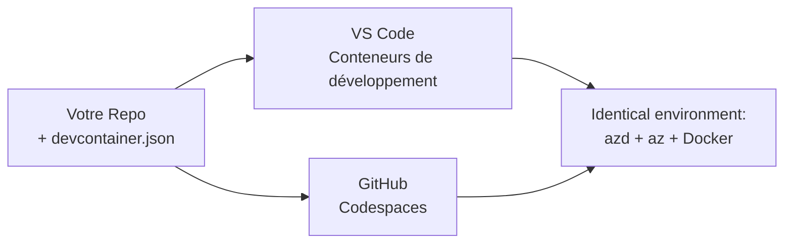

# Conteneurs de développement & GitHub Codespaces pour azd

**Navigation dans le chapitre :**
- **📚 Accueil du cours** : [AZD Pour Débutants](../../README.md)
- **📖 Chapitre actuel** : Chapitre 1 - Fondations & Démarrage rapide
- **⬅️ Précédent** : [Apportez votre propre application](bring-your-own-app.md)
- **🚀 Chapitre suivant** : [Chapitre 2 : Développement axé IA](../chapter-02-ai-development/README.md)

> Validé avec `azd 1.27.1` en juillet 2026.

## Introduction

Installer azd, le runtime du langage adéquat, Docker et l'Azure CLI sur chaque machine est une corvée — et c'est la première raison pour laquelle un tutoriel qui « fonctionne sur ma machine » échoue pour quelqu'un d'autre. Un **conteneur de développement** résout ce problème en décrivant toute votre chaîne d'outils dans un fichier. Toute personne qui ouvre le projet dans VS Code ou GitHub Codespaces obtient exactement le même environnement, avec azd déjà installé. Cette leçon vous montre comment en ajouter un.

## Objectifs d'apprentissage

À la fin de cette leçon, vous allez :
- Comprendre ce qu'est un conteneur de développement et pourquoi il est utile avec azd
- Ajouter un minimal `.devcontainer/devcontainer.json` à un projet
- Inclure azd, l'Azure CLI et Docker via les *fonctionnalités* du conteneur de développement
- Ouvrir le projet dans GitHub Codespaces ou VS Code

## Résultats d'apprentissage

Après avoir terminé cette leçon, vous saurez :
- Rédiger un `devcontainer.json` pour un projet azd
- Ajouter azd et les outils Azure sans installations manuelles
- Exécuter `azd up` depuis l'intérieur d'un conteneur ou d'un Codespace

---

## Qu'est-ce qu'un conteneur de développement ?

Un conteneur de développement est un environnement de développement basé sur Docker défini par un fichier `.devcontainer/devcontainer.json` dans votre dépôt. Lorsque vous ouvrez le projet :

- **VS Code** (avec l'extension Dev Containers) construit le conteneur et s'y connecte.
- **GitHub Codespaces** construit le même conteneur dans le cloud et vous offre un éditeur dans le navigateur.

Dans les deux cas, chaque contributeur obtient des outils identiques — fini les questions du type « as-tu installé azd ? ».



---

## Étape 1 : Créez le fichier devcontainer

Créez `.devcontainer/devcontainer.json` à la racine de votre projet :

```json
{
  "name": "azd-project",
  "image": "mcr.microsoft.com/devcontainers/base:bookworm",
  "features": {
    "ghcr.io/devcontainers/features/azure-cli:1": {},
    "ghcr.io/azure/azure-dev/azd:latest": {},
    "ghcr.io/devcontainers/features/docker-in-docker:2": {},
    "ghcr.io/devcontainers/features/node:1": {}
  },
  "customizations": {
    "vscode": {
      "extensions": [
        "ms-azuretools.azure-dev",
        "ms-azuretools.vscode-bicep"
      ]
    }
  },
  "forwardPorts": [3000],
  "postCreateCommand": "azd version"
}
```

Ce que chaque partie fait :

| Clé | But |
|-----|-----|
| `image` | Le système d'exploitation de base pour le conteneur |
| `features` | Installateurs préconstruits — ici : Azure CLI, **azd**, Docker et Node.js |
| `customizations.vscode.extensions` | Installe automatiquement les extensions VS Code azd et Bicep |
| `forwardPorts` | Expose le port de votre application dans votre navigateur |
| `postCreateCommand` | S'exécute une fois que le conteneur est construit (ici, un contrôle de bon sens) |

> La *feature* `ghcr.io/azure/azure-dev/azd:latest` est la manière officielle d'obtenir azd dans un conteneur. Épinglez une version spécifique (par exemple `azd:1.27.1`) si vous avez besoin de reproductibilité.

---

## Étape 2 : Adaptez la fonctionnalité au langage de votre application

Remplacez la feature `node` par celle correspondant à votre application :

```jsonc
// Python project
"ghcr.io/devcontainers/features/python:1": {},

// .NET project
"ghcr.io/devcontainers/features/dotnet:2": {},

// Java project
"ghcr.io/devcontainers/features/java:1": {},

// Go project
"ghcr.io/devcontainers/features/go:1": {}
```

Gardez `docker-in-docker` si votre `host` est `containerapp`, `aks` ou tout ce qui construit une image conteneur — azd a besoin de Docker pour construire et pousser les images.

---

## Étape 3 : Ouvrez-le

**Dans VS Code :**
1. Installez l'extension **Dev Containers**.
2. Ouvrez le dossier du projet.
3. Cliquez sur **Réouvrir dans le conteneur** lorsqu'on vous le propose (ou lancez *Dev Containers : Reopen in Container*).

**Dans GitHub Codespaces :**
1. Poussez le dépôt sur GitHub.
2. Cliquez sur **Code → Codespaces → Create codespace on main**.
3. Attendez que le conteneur soit construit — azd est prêt dans le terminal.

---

## Étape 4 : Déployez depuis l'intérieur du conteneur

Le conteneur a azd préinstallé, donc le flux normal fonctionne simplement :

```bash
azd auth login --use-device-code   # le code de l’appareil est pratique dans Codespaces
azd up
```

> **Pourquoi `--use-device-code` ?** Dans un conteneur distant ou un Codespace, il n'y a pas de navigateur local vers lequel rediriger, donc l'authentification par code de périphérique est la méthode fiable. Vous collerez un code dans un onglet de navigateur pour terminer la connexion.

---

## Pièges courants

| Piège | Solution |
|---------|---------|
| `azd up` ne peut pas construire une image | Ajoutez la fonctionnalité `docker-in-docker` |
| Connexion via navigateur bloquée dans Codespaces | Utilisez `azd auth login --use-device-code` |
| Outils différents entre coéquipiers | Épinglez les versions des fonctionnalités (ex. : `azd:1.27.1`) |
| Application inaccessible dans le navigateur | Ajoutez le port à `forwardPorts` |

---

## Résumé

- Un conteneur de développement rend votre chaîne d'outils azd reproductible pour tout le monde.
- Ajoutez azd, l'Azure CLI et Docker via des *fonctionnalités* Dev Container.
- Adaptez la fonctionnalité au langage à votre application et conservez `docker-in-docker` pour les hôtes de conteneur.
- Utilisez la connexion via code de périphérique lorsque vous êtes dans Codespaces.

---

## 🔗 Navigation

| Direction | Ressource |
|-----------|----------|
| **Précédent** | [Apportez votre propre application](bring-your-own-app.md) |
| **Accueil du chapitre** | [Chapitre 1 : Fondations & Démarrage rapide](README.md) |
| **Chapitre suivant** | [Chapitre 2 : Développement axé IA](../chapter-02-ai-development/README.md) |

## 📖 Ressources associées

- [Installation & Configuration](installation.md)
- [Fiche mémo des commandes](../../resources/cheat-sheet.md)
- [Spécification officielle des conteneurs Dev](https://containers.dev/)
- [Fonctionnalité azd Dev Container](https://github.com/Azure/azure-dev/tree/main/ext/devcontainer)

---

<!-- CO-OP TRANSLATOR DISCLAIMER START -->
**Avertissement** :
Ce document a été traduit à l'aide du service de traduction automatique [Co-op Translator](https://github.com/Azure/co-op-translator). Bien que nous nous efforçions d'assurer l'exactitude, veuillez noter que les traductions automatisées peuvent contenir des erreurs ou des inexactitudes. Le document original dans sa langue native doit être considéré comme la source faisant autorité. Pour les informations critiques, il est recommandé de recourir à une traduction professionnelle réalisée par un humain. Nous ne saurions être tenus responsables des malentendus ou erreurs d'interprétation découlant de l'utilisation de cette traduction.
<!-- CO-OP TRANSLATOR DISCLAIMER END -->