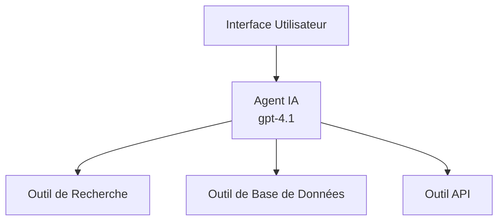
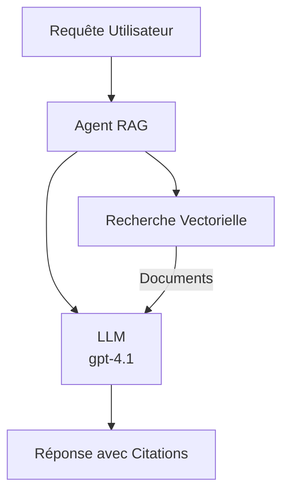
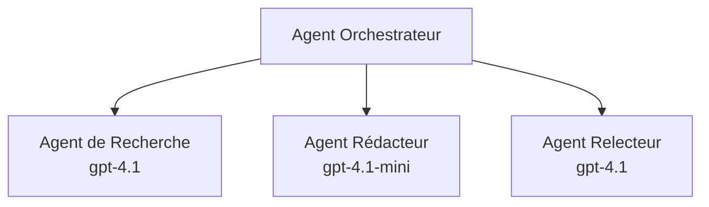

# Agents IA avec Azure Developer CLI

**Navigation dans le Chapitre :**
- **📚 Accueil du cours** : [AZD pour débutants](../../README.md)
- **📖 Chapitre actuel** : Chapitre 2 - Développement axé sur l'IA
- **⬅️ Précédent** : [Intégration Microsoft Foundry](microsoft-foundry-integration.md)
- **➡️ Suivant** : [Déploiement de modèles IA](ai-model-deployment.md)
- **🚀 Avancé** : [Solutions multi-agents](../../examples/retail-scenario.md)

---

## Introduction

Les agents IA sont des programmes autonomes capables de percevoir leur environnement, de prendre des décisions et d'agir pour atteindre des objectifs spécifiques. Contrairement aux chatbots simples qui répondent aux invites, les agents peuvent :

- **Utiliser des outils** - Appeler des API, rechercher dans des bases de données, exécuter du code
- **Planifier et raisonner** - Décomposer des tâches complexes en étapes
- **Apprendre du contexte** - Maintenir une mémoire et adapter leur comportement
- **Collaborer** - Travailler avec d'autres agents (systèmes multi-agents)

Ce guide vous montre comment déployer des agents IA dans Azure en utilisant Azure Developer CLI (azd).

> **Note de validation (2026-03-25) :** Ce guide a été revu avec `azd` `1.23.12` et `azure.ai.agents` `0.1.18-preview`. L'expérience `azd ai` est encore en version preview, vérifiez l'aide de l'extension si vos flags installés diffèrent.

## Objectifs d'apprentissage

En complétant ce guide, vous allez :
- Comprendre ce que sont les agents IA et en quoi ils diffèrent des chatbots
- Déployer des modèles d'agents IA préconstruits avec AZD
- Configurer les agents Foundry pour des agents personnalisés
- Implémenter des modèles d'agents basiques (utilisation d’outils, RAG, multi-agent)
- Surveiller et déboguer les agents déployés

## Résultats d'apprentissage

À l'issue, vous serez capable de :
- Déployer des applications agents IA sur Azure avec une seule commande
- Configurer les outils et capacités d’un agent
- Implémenter la génération augmentée par récupération (RAG) avec des agents
- Concevoir des architectures multi-agents pour des workflows complexes
- Résoudre les problèmes courants liés au déploiement d’agents

---

## 🤖 Qu’est-ce qui différencie un agent d’un chatbot ?

| Fonctionnalité | Chatbot | Agent IA |
|----------------|---------|----------|
| **Comportement** | Répond aux prompts | Prend des actions autonomes |
| **Outils** | Aucun | Peut appeler API, rechercher, exécuter du code |
| **Mémoire** | Basée sur la session uniquement | Mémoire persistante entre sessions |
| **Planification** | Réponse unique | Raisonnement multi-étapes |
| **Collaboration** | Entité unique | Peut collaborer avec d’autres agents |

### Analogie simple

- **Chatbot** = Une personne serviale qui répond aux questions à un guichet d’information
- **Agent IA** = Un assistant personnel capable de passer des appels, prendre des rendez-vous et accomplir des tâches pour vous

---

## 🚀 Démarrage rapide : déployez votre premier agent

### Option 1 : Modèle Foundry Agents (Recommandé)

```bash
# Initialiser le modèle des agents IA
azd init --template get-started-with-ai-agents

# Déployer sur Azure
azd up
```

**Ce qui est déployé :**
- ✅ Foundry Agents
- ✅ Modèles Microsoft Foundry (gpt-4.1)
- ✅ Azure AI Search (pour RAG)
- ✅ Azure Container Apps (interface web)
- ✅ Application Insights (monitoring)

**Durée :** ~15-20 minutes  
**Coût :** ~100-150$/mois (développement)

### Option 2 : Agent OpenAI avec Prompty

```bash
# Initialiser le modèle d'agent basé sur Prompty
azd init --template agent-openai-python-prompty

# Déployer sur Azure
azd up
```

**Ce qui est déployé :**
- ✅ Azure Functions (exécution serveur sans serveur)
- ✅ Modèles Microsoft Foundry
- ✅ Fichiers de configuration Prompty
- ✅ Implémentation d’agent exemple

**Durée :** ~10-15 minutes  
**Coût :** ~50-100$/mois (développement)

### Option 3 : Agent Chat RAG

```bash
# Initialiser le modèle de chat RAG
azd init --template azure-search-openai-demo

# Déployer sur Azure
azd up
```

**Ce qui est déployé :**
- ✅ Modèles Microsoft Foundry
- ✅ Azure AI Search avec données d’exemple
- ✅ Pipeline de traitement de documents
- ✅ Interface chat avec citations

**Durée :** ~15-25 minutes  
**Coût :** ~80-150$/mois (développement)

### Option 4 : Initialisation Agent IA AZD (Preview basé sur manifeste ou template)

Si vous disposez d’un fichier manifeste d’agent, vous pouvez utiliser la commande `azd ai` pour générer directement un projet Foundry Agent Service. Les versions preview récentes ont aussi ajouté la prise en charge de l’initialisation basée sur des templates, donc le flux d’invite exact peut varier selon la version de votre extension.

```bash
# Installer l'extension des agents IA
azd extension install azure.ai.agents

# Optionnel : vérifier la version preview installée
azd extension show azure.ai.agents

# Initialiser à partir d'un manifeste d'agent
azd ai agent init -m agent-manifest.yaml

# Déployer sur Azure
azd up

# Tester l'agent déployé (affiche la latence + le temps jusqu'au premier octet)
azd ai agent invoke
```

**Quand utiliser `azd ai agent init` vs `azd init --template` :**

| Approche | Pour quoi faire | Fonctionnement |
|----------|-----------------|----------------|
| `azd init --template` | Partir d’une app modèle fonctionnelle | Clone un repo template complet avec code + infra |
| `azd ai agent init -m` | Construire à partir de votre propre manifeste agent | Génère la structure projet depuis la définition agent |

> **Astuce :** Utilisez `azd init --template` pour apprendre (Options 1-3 ci-dessus). Utilisez `azd ai agent init` pour construire des agents en production avec vos propres manifestes.

Après `azd up`, la même extension vous guide dans le reste du cycle de vie agent : `azd ai agent invoke` pour tester, `azd ai agent eval generate` et `azd ai agent optimize` pour mesurer et améliorer la qualité, et `azd ai agent delete` pour nettoyer. Consultez [AZD AI CLI Commands](../chapter-08-production/production-ai-practices.md#azd-ai-cli-commands-and-extensions) pour la référence complète.

---

## 🏗️ Modèles d’architecture d’agents

### Modèle 1 : Agent unique avec outils

Le modèle d’agent le plus simple - un agent pouvant utiliser plusieurs outils.



**Idéal pour :**
- Bots support client
- Assistants de recherche
- Agents d’analyse de données

**Template AZD :** `azure-search-openai-demo`

### Modèle 2 : Agent RAG (génération augmentée par récupération)

Un agent qui récupère des documents pertinents avant de générer des réponses.



**Idéal pour :**
- Bases de connaissances d’entreprise
- Systèmes Q&R sur documents
- Recherche conformité et juridique

**Template AZD :** `azure-search-openai-demo`

### Modèle 3 : Système multi-agents

Plusieurs agents spécialisés collaborant sur des tâches complexes.



**Idéal pour :**
- Génération de contenu complexe
- Workflows multi-étapes
- Tâches nécessitant des expertises distinctes

**En savoir plus :** [Modèles de coordination multi-agents](../chapter-06-pre-deployment/coordination-patterns.md)

---

## ⚙️ Configuration des outils agents

Les agents deviennent puissants lorsqu’ils peuvent utiliser des outils. Voici comment configurer les outils courants :

### Configuration des outils dans Foundry Agents

```python
# agent_config.py
from azure.ai.projects import AIProjectClient
from azure.ai.projects.models import FunctionTool, CodeInterpreterTool

# Définir des outils personnalisés
search_tool = FunctionTool(
    name="search_knowledge_base",
    description="Search the company knowledge base for relevant documents",
    parameters={
        "type": "object",
        "properties": {
            "query": {
                "type": "string",
                "description": "The search query"
            }
        },
        "required": ["query"]
    }
)

# Créer un agent avec des outils
agent = project_client.agents.create_agent(
    model="gpt-4.1",
    name="Support Agent",
    instructions="You are a helpful support agent. Use the search tool to find relevant information.",
    tools=[search_tool, CodeInterpreterTool()]
)
```

### Configuration de l’environnement

```bash
# Configurer les variables d'environnement spécifiques à l'agent
azd env set AZURE_OPENAI_MODEL "gpt-4.1"
azd env set AGENT_INSTRUCTIONS "You are a helpful assistant..."
azd env set ENABLE_CODE_INTERPRETER "true"
azd env set ENABLE_FILE_SEARCH "true"

# Déployer avec la configuration mise à jour
azd deploy
```

---

## 📊 Surveillance des agents

### Intégration Application Insights

Tous les templates AZD pour agents incluent Application Insights pour la surveillance :

```bash
# Ouvrir le tableau de bord de surveillance
azd monitor --overview

# Voir les journaux en direct
azd monitor --logs

# Voir les métriques en direct
azd monitor --live
```

### Indicateurs clés à suivre

| Indicateur | Description | Objectif |
|------------|-------------|----------|
| Latence de réponse | Temps pour générer une réponse | < 5 secondes |
| Utilisation de tokens | Tokens par requête | Surveiller pour le coût |
| Taux de réussite appels outils | % d’exécutions outils réussies | > 95% |
| Taux d’erreur | Requêtes agents échouées | < 1% |
| Satisfaction utilisateur | Notes de feedback | > 4.0/5.0 |

### Journalisation personnalisée pour les agents

```python
import os
from azure.monitor.opentelemetry import configure_azure_monitor
from opentelemetry import trace

# Configurer Azure Monitor avec OpenTelemetry
configure_azure_monitor(
    connection_string=os.environ["APPLICATIONINSIGHTS_CONNECTION_STRING"]
)

tracer = trace.get_tracer(__name__)

def log_agent_interaction(user_query, agent_response, tools_used, latency_ms):
    with tracer.start_as_current_span("agent_interaction") as span:
        span.set_attributes({
            "user_query": user_query,
            "response_length": len(agent_response),
            "tools_used": tools_used,
            "latency_ms": latency_ms
        })
```

> **Note :** Installez les packages requis : `pip install azure-monitor-opentelemetry opentelemetry`

---

## 💰 Considérations de coûts

### Coûts mensuels estimés par modèle

| Modèle | Environnement dev | Production |
|---------|------------------|------------|
| Agent unique | 50-100$ | 200-500$ |
| Agent RAG | 80-150$ | 300-800$ |
| Multi-agent (2-3 agents) | 150-300$ | 500-1,500$ |
| Multi-agent entreprise | 300-500$ | 1,500-5,000$+ |

### Conseils d’optimisation des coûts

1. **Utilisez gpt-4.1-mini pour les tâches simples**
   ```bash
   azd env set AZURE_OPENAI_MODEL "gpt-4.1-mini"
   ```

2. **Implémentez la mise en cache pour les requêtes répétées**
   ```python
   from functools import lru_cache
   
   @lru_cache(maxsize=1000)
   def get_cached_response(query_hash):
       return agent.run(query_hash)
   ```

3. **Fixez des limites de tokens par exécution**
   ```python
   # Définir max_completion_tokens lors de l'exécution de l'agent, pas pendant la création
   run = project_client.agents.create_run(
       thread_id=thread.id,
       agent_id=agent.id,
       max_completion_tokens=1000  # Limiter la longueur de la réponse
   )
   ```

4. **Réduisez à zéro la mise à l’échelle quand non utilisé**
   ```bash
   # Les applications conteneurisées s'adaptent automatiquement jusqu'à zéro
   azd env set MIN_REPLICAS "0"
   ```

---

## 🔧 Dépannage des agents

### Problèmes courants et solutions

<details>
<summary><strong>❌ Agent ne répond pas aux appels d’outils</strong></summary>

```bash
# Vérifier si les outils sont correctement enregistrés
azd show

# Vérifier le déploiement OpenAI
az cognitiveservices account deployment list \
  --name $AZURE_OPENAI_NAME \
  --resource-group $RG_NAME

# Vérifier les journaux de l'agent
azd monitor --logs
```

**Causes communes :**
- Signature de fonction outil non conforme
- Permissions requises manquantes
- Point d’API inaccessible
</details>

<details>
<summary><strong>❌ Latence élevée dans les réponses de l’agent</strong></summary>

```bash
# Vérifiez Application Insights pour les goulots d'étranglement
azd monitor --live

# Envisagez d'utiliser un modèle plus rapide
azd env set AZURE_OPENAI_MODEL "gpt-4.1-mini"
azd deploy
```

**Conseils d’optimisation :**
- Utilisez les réponses en streaming
- Mettez en cache les réponses
- Réduisez la taille de la fenêtre contextuelle
</details>

<details>
<summary><strong>❌ Agent retourne des informations incorrectes ou hallucine</strong></summary>

```python
# Améliorer avec de meilleures invites système
instructions = """
You are a helpful assistant. IMPORTANT:
- Only answer based on provided context
- If you don't know, say "I don't know"
- Always cite your sources
- Never make up information
"""

# Ajouter une récupération pour l'ancrage
agent = project_client.agents.create_agent(
    model="gpt-4.1",
    instructions=instructions,
    tools=[FileSearchTool()]  # Ancrer les réponses dans des documents
)
```
</details>

<details>
<summary><strong>❌ Erreurs de dépassement de limite de tokens</strong></summary>

```python
# Implémenter la gestion de la fenêtre de contexte
def truncate_context(messages, max_tokens=8000, model="gpt-4.1"):
    """Keep only recent messages within token limit."""
    import tiktoken
    encoding = tiktoken.encoding_for_model(model)
    total_tokens = 0
    truncated = []
    
    for msg in reversed(messages):
        msg_tokens = len(encoding.encode(msg.content))
        if total_tokens + msg_tokens > max_tokens:
            break
        truncated.insert(0, msg)
        total_tokens += msg_tokens
    
    return truncated
```
</details>

---

## 🎓 Exercices pratiques

### Exercice 1 : Déployer un agent basique (20 minutes)

**Objectif :** Déployer votre premier agent IA avec AZD

```bash
# Étape 1 : Initialiser le modèle
azd init --template get-started-with-ai-agents

# Étape 2 : Se connecter à Azure
azd auth login
# Si vous travaillez avec plusieurs locataires, ajoutez --tenant-id <tenant-id>

# Étape 3 : Déployer
azd up

# Étape 4 : Tester l'agent
# Résultat attendu après le déploiement :
#   Déploiement terminé !
#   Point de terminaison : https://<app-name>.<region>.azurecontainerapps.io
# Ouvrez l'URL indiquée dans la sortie et essayez de poser une question

# Étape 5 : Voir la surveillance
azd monitor --overview

# Étape 6 : Nettoyer
azd down --force --purge
```

**Critères de réussite :**
- [ ] Agent répond aux questions
- [ ] Accès au tableau de bord de surveillance via `azd monitor`
- [ ] Ressources nettoyées avec succès

### Exercice 2 : Ajouter un outil personnalisé (30 minutes)

**Objectif :** Étendre un agent avec un outil personnalisé

1. Déployez le template agent :  
   ```bash
   azd init --template get-started-with-ai-agents
   azd up
   ```
2. Créez une nouvelle fonction outil dans le code de votre agent :  
   ```python
   def get_weather(location: str) -> str:
       """Get current weather for a location."""
       # Appel API au service météo
       return f"Weather in {location}: Sunny, 72°F"
   ```
3. Enregistrez l’outil auprès de l’agent :  
   ```python
   from azure.ai.projects.models import FunctionTool

   weather_tool = FunctionTool(
       name="get_weather",
       description="Get current weather for a location",
       parameters={
           "type": "object",
           "properties": {
               "location": {"type": "string", "description": "City name"}
           },
           "required": ["location"]
       }
   )

   agent = project_client.agents.create_agent(
       model="gpt-4.1",
       name="Weather Agent",
       tools=[weather_tool]
   )
   ```
4. Redéployez et testez :  
   ```bash
   azd deploy
   # Demander : "Quel temps fait-il à Seattle ?"
   # Attendu : L'agent appelle get_weather("Seattle") et retourne les informations météorologiques
   ```

**Critères de réussite :**
- [ ] L’agent reconnaît les requêtes liées à la météo
- [ ] L’outil est appelé correctement
- [ ] La réponse inclut des informations météorologiques

### Exercice 3 : Construire un agent RAG (45 minutes)

**Objectif :** Créer un agent qui répond aux questions à partir de vos documents

```bash
# Étape 1 : Déployer le modèle RAG
azd init --template azure-search-openai-demo
azd up

# Étape 2 : Téléchargez vos documents
# Placez les fichiers PDF/TXT dans le répertoire data/, puis exécutez :
python scripts/prepdocs.py

# Étape 3 : Testez avec des questions spécifiques au domaine
# Ouvrez l'URL de l'application web depuis la sortie azd up
# Posez des questions sur vos documents téléchargés
# Les réponses doivent inclure des références de citation comme [doc.pdf]
```

**Critères de réussite :**
- [ ] L’agent répond à partir des documents uploadés
- [ ] Les réponses incluent des citations
- [ ] Pas d’hallucination sur les questions hors périmètre

---

## 📚 Prochaines étapes

Maintenant que vous comprenez les agents IA, explorez ces sujets avancés :

| Sujet | Description | Lien |
|-------|-------------|------|
| **Systèmes multi-agents** | Construire des systèmes avec plusieurs agents collaboratifs | [Exemple multi-agent retail](../../examples/retail-scenario.md) |
| **Modèles de coordination** | Apprendre les modèles d’orchestration et communication | [Modèles de coordination](../chapter-06-pre-deployment/coordination-patterns.md) |
| **Déploiement en production** | Déploiement d’agents prêts pour l’entreprise | [Pratiques IA production](../chapter-08-production/production-ai-practices.md) |
| **Évaluation des agents** | Tester et évaluer les performances agent | [Dépannage IA](../chapter-07-troubleshooting/ai-troubleshooting.md) |
| **Atelier AI Workshop Lab** | Pratique : rendre votre solution IA prête pour AZD | [AI Workshop Lab](ai-workshop-lab.md) |

---

## 📖 Ressources supplémentaires

### Documentation officielle
- [Microsoft Foundry Agent Service](https://learn.microsoft.com/azure/ai-services/agents/)
- [Microsoft Foundry Agent Service Guide rapide](https://learn.microsoft.com/azure/ai-services/agents/quickstart)
- [Framework Semantic Kernel Agent](https://learn.microsoft.com/semantic-kernel/)

### Templates AZD pour agents
- [Démarrer avec les agents IA](https://github.com/Azure-Samples/get-started-with-ai-agents)
- [Agent OpenAI Python Prompty](https://github.com/Azure-Samples/agent-openai-python-prompty)
- [Démo Azure Search OpenAI](https://github.com/Azure-Samples/azure-search-openai-demo)

### Ressources communautaires
- [Awesome AZD - Templates agents](https://azure.github.io/awesome-azd/?tags=ai-agents)
- [Azure AI Discord](https://discord.gg/microsoft-azure)
- [Microsoft Foundry Discord](https://discord.gg/nTYy5BXMWG)

### Compétences Agents pour votre éditeur
- [**Microsoft Azure Agent Skills**](https://skills.sh/microsoft/github-copilot-for-azure) - Installez des compétences agents IA réutilisables pour Azure dans GitHub Copilot, Cursor, ou tout agent supporté. Inclut des compétences pour [Azure AI](https://skills.sh/microsoft/github-copilot-for-azure/azure-ai), [Microsoft Foundry](https://skills.sh/microsoft/github-copilot-for-azure/microsoft-foundry), [déploiement](https://skills.sh/microsoft/github-copilot-for-azure/azure-deploy) et [diagnostics](https://skills.sh/microsoft/github-copilot-for-azure/azure-diagnostics) :
  ```bash
  npx skills add microsoft/github-copilot-for-azure
  ```

---

**Navigation**
- **Leçon précédente** : [Intégration Microsoft Foundry](microsoft-foundry-integration.md)
- **Leçon suivante** : [Déploiement de modèles IA](ai-model-deployment.md)

---

<!-- CO-OP TRANSLATOR DISCLAIMER START -->
**Avertissement** :
Ce document a été traduit à l'aide du service de traduction automatique [Co-op Translator](https://github.com/Azure/co-op-translator). Bien que nous nous efforçions d'assurer l'exactitude, veuillez noter que les traductions automatisées peuvent contenir des erreurs ou des inexactitudes. Le document original dans sa langue native doit être considéré comme la source faisant autorité. Pour les informations critiques, il est recommandé de recourir à une traduction professionnelle réalisée par un humain. Nous ne saurions être tenus responsables des malentendus ou erreurs d'interprétation découlant de l'utilisation de cette traduction.
<!-- CO-OP TRANSLATOR DISCLAIMER END -->