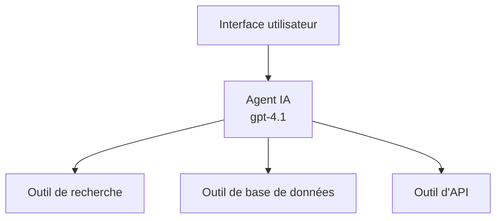
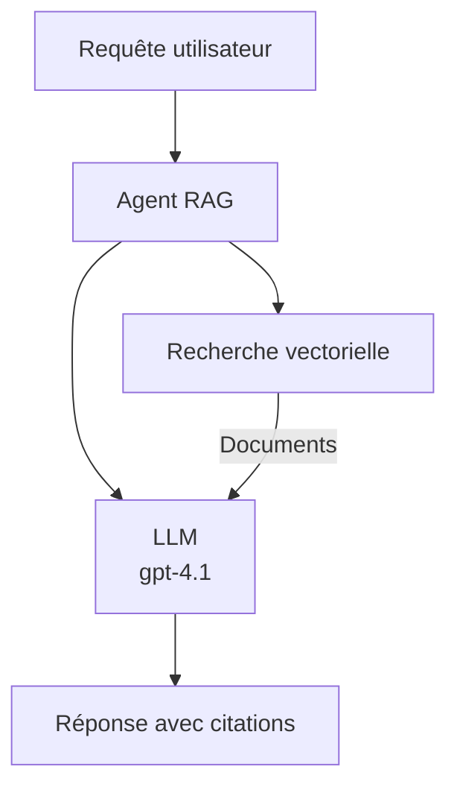
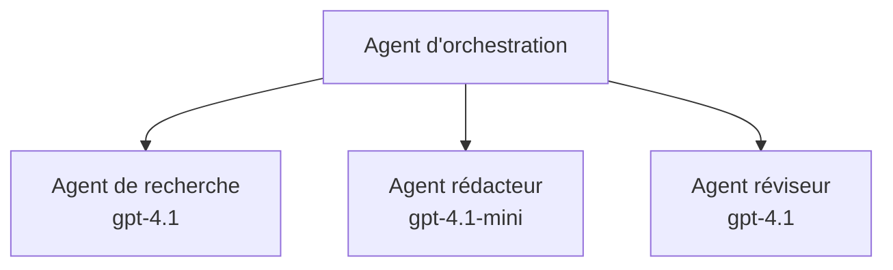

# Agents IA avec Azure Developer CLI

**Chapter Navigation:**
- **📚 Course Home**: [AZD For Beginners](../../README.md)
- **📖 Current Chapter**: Chapter 2 - AI-First Development
- **⬅️ Previous**: [Intégration Microsoft Foundry](microsoft-foundry-integration.md)
- **➡️ Next**: [Déploiement de modèle IA](ai-model-deployment.md)
- **🚀 Advanced**: [Multi-Agent Solutions](../../examples/retail-scenario.md)

---

## Introduction

Les agents IA sont des programmes autonomes capables de percevoir leur environnement, de prendre des décisions et d'agir pour atteindre des objectifs spécifiques. Contrairement aux simples chatbots qui répondent à des invites, les agents peuvent :

- **Utiliser des outils** - Appeler des API, rechercher dans des bases de données, exécuter du code
- **Planifier et raisonner** - Décomposer les tâches complexes en étapes
- **Apprendre du contexte** - Maintenir une mémoire et adapter le comportement
- **Collaborer** - Travailler avec d'autres agents (systèmes multi-agents)

Ce guide vous montre comment déployer des agents IA sur Azure en utilisant Azure Developer CLI (azd).

## Objectifs d'apprentissage

En complétant ce guide, vous pourrez :
- Comprendre ce que sont les agents IA et en quoi ils diffèrent des chatbots
- Déployer des modèles d'agents IA préconstruits à l'aide d'AZD
- Configurer Foundry Agents pour des agents personnalisés
- Mettre en œuvre des modèles d'agents de base (utilisation d'outils, RAG, multi-agent)
- Surveiller et déboguer les agents déployés

## Résultats d'apprentissage

À la fin, vous serez capable de :
- Déployer des applications d'agents IA sur Azure avec une seule commande
- Configurer les outils et capacités des agents
- Mettre en œuvre la génération augmentée par récupération (RAG) avec des agents
- Concevoir des architectures multi-agents pour des flux de travail complexes
- Résoudre les problèmes courants de déploiement d'agents

---

## 🤖 Qu'est-ce qui différencie un agent d'un chatbot?

| Caractéristique | Chatbot | Agent IA |
|---------|---------|----------|
| **Comportement** | Répond aux invites | Effectue des actions autonomes |
| **Outils** | Aucun | Peut appeler des API, rechercher, exécuter du code |
| **Mémoire** | Basée sur la session uniquement | Mémoire persistante entre les sessions |
| **Planification** | Réponse unique | Raisonnement en plusieurs étapes |
| **Collaboration** | Entité unique | Peut travailler avec d'autres agents |

### Analogie simple

- **Chatbot** = Une personne serviable répondant aux questions à un bureau d'information
- **Agent IA** = Un assistant personnel qui peut passer des appels, prendre des rendez-vous et accomplir des tâches pour vous

---

## 🚀 Démarrage rapide: déployez votre premier agent

### Option 1: Modèle Foundry Agents (Recommandé)

```bash
# Initialiser le modèle d'agents IA
azd init --template get-started-with-ai-agents

# Déployer sur Azure
azd up
```

**Ce qui est déployé:** 
- ✅ Foundry Agents
- ✅ Microsoft Foundry Models (gpt-4.1)
- ✅ Azure AI Search (pour le RAG)
- ✅ Azure Container Apps (interface web)
- ✅ Application Insights (monitoring)

**Temps:** ~15-20 minutes
**Coût:** ~$100-150/month (development)

### Option 2: Agent OpenAI avec Prompty

```bash
# Initialiser le modèle d'agent basé sur Prompty
azd init --template agent-openai-python-prompty

# Déployer sur Azure
azd up
```

**Ce qui est déployé:** 
- ✅ Azure Functions (exécution serverless de l'agent)
- ✅ Microsoft Foundry Models
- ✅ Fichiers de configuration Prompty
- ✅ Implémentation d'agent d'exemple

**Temps:** ~10-15 minutes
**Coût:** ~$50-100/month (development)

### Option 3: Agent de chat RAG

```bash
# Initialiser le modèle de chat RAG
azd init --template azure-search-openai-demo

# Déployer sur Azure
azd up
```

**Ce qui est déployé:** 
- ✅ Microsoft Foundry Models
- ✅ Azure AI Search avec des données d'exemple
- ✅ Pipeline de traitement de documents
- ✅ Interface de chat avec citations

**Temps:** ~15-25 minutes
**Coût:** ~$80-150/month (development)

### Option 4: AZD AI Agent Init (basé sur un manifeste)

Si vous avez un fichier manifeste d'agent, vous pouvez utiliser la commande `azd ai` pour générer la structure d'un projet Foundry Agent Service directement:

```bash
# Installer l'extension des agents IA
azd extension install azure.ai.agents

# Initialiser à partir d'un manifeste d'agent
azd ai agent init -m agent-manifest.yaml

# Déployer sur Azure
azd up
```

**Quand utiliser `azd ai agent init` vs `azd init --template`:**

| Approach | Best For | How It Works |
|----------|----------|------|
| `azd init --template` | Starting from a working sample app | Clones a full template repo with code + infra |
| `azd ai agent init -m` | Building from your own agent manifest | Scaffolds project structure from your agent definition |

> **Astuce:** Utilisez `azd init --template` when learning (Options 1-3 above). Utilisez `azd ai agent init` when building production agents with your own manifests. Voir [AZD AI CLI Commands](../chapter-08-production/production-ai-practices.md#azd-ai-cli-commands-and-extensions) pour la référence complète.

---

## 🏗️ Modèles d'architecture d'agents

### Modèle 1: Agent unique avec outils

Le modèle d'agent le plus simple - un agent qui peut utiliser plusieurs outils.


**Idéal pour:**
- Bots de support client
- Assistants de recherche
- Agents d'analyse de données

**AZD Template:** `azure-search-openai-demo`

### Modèle 2: Agent RAG (Retrieval-Augmented Generation)

Un agent qui récupère des documents pertinents avant de générer des réponses.


**Idéal pour:**
- Bases de connaissances d'entreprise
- Systèmes de Q&R sur documents
- Recherche juridique et conformité

**AZD Template:** `azure-search-openai-demo`

### Modèle 3: Système multi-agents

Plusieurs agents spécialisés travaillant ensemble sur des tâches complexes.


**Idéal pour:**
- Génération de contenu complexe
- Flux de travail multi-étapes
- Tâches nécessitant différentes expertises

**En savoir plus:** [Modèles de coordination multi-agents](../chapter-06-pre-deployment/coordination-patterns.md)

---

## ⚙️ Configuration des outils des agents

Les agents deviennent puissants lorsqu'ils peuvent utiliser des outils. Voici comment configurer les outils courants:

### Configuration des outils dans Foundry Agents

```python
# agent_config.py
from azure.ai.projects import AIProjectClient
from azure.ai.projects.models import FunctionTool, CodeInterpreterTool

# Définir des outils personnalisés
search_tool = FunctionTool(
    name="search_knowledge_base",
    description="Search the company knowledge base for relevant documents",
    parameters={
        "type": "object",
        "properties": {
            "query": {
                "type": "string",
                "description": "The search query"
            }
        },
        "required": ["query"]
    }
)

# Créer un agent avec des outils
agent = project_client.agents.create_agent(
    model="gpt-4.1",
    name="Support Agent",
    instructions="You are a helpful support agent. Use the search tool to find relevant information.",
    tools=[search_tool, CodeInterpreterTool()]
)
```

### Configuration de l'environnement

```bash
# Configurer les variables d'environnement spécifiques à l'agent
azd env set AZURE_OPENAI_MODEL "gpt-4.1"
azd env set AGENT_INSTRUCTIONS "You are a helpful assistant..."
azd env set ENABLE_CODE_INTERPRETER "true"
azd env set ENABLE_FILE_SEARCH "true"

# Déployer avec la configuration mise à jour
azd deploy
```

---

## 📊 Surveillance des agents

### Intégration Application Insights

Tous les modèles d'agents AZD incluent Application Insights pour la surveillance:

```bash
# Ouvrir le tableau de bord de surveillance
azd monitor --overview

# Afficher les journaux en temps réel
azd monitor --logs

# Afficher les métriques en temps réel
azd monitor --live
```

### Principales métriques à suivre

| Métrique | Description | Objectif |
|--------|-------------|--------|
| Latence de réponse | Temps pour générer la réponse | < 5 seconds |
| Utilisation de tokens | Tokens par requête | Monitor for cost |
| Taux de réussite des appels d'outils | % d'exécutions d'outils réussies | > 95% |
| Taux d'erreur | Requêtes d'agent échouées | < 1% |
| Satisfaction utilisateur | Feedback scores | > 4.0/5.0 |

### Journalisation personnalisée pour les agents

```python
import os
from azure.monitor.opentelemetry import configure_azure_monitor
from opentelemetry import trace

# Configurer Azure Monitor avec OpenTelemetry
configure_azure_monitor(
    connection_string=os.environ["APPLICATIONINSIGHTS_CONNECTION_STRING"]
)

tracer = trace.get_tracer(__name__)

def log_agent_interaction(user_query, agent_response, tools_used, latency_ms):
    with tracer.start_as_current_span("agent_interaction") as span:
        span.set_attributes({
            "user_query": user_query,
            "response_length": len(agent_response),
            "tools_used": tools_used,
            "latency_ms": latency_ms
        })
```

> **Remarque:** Installez les packages requis: `pip install azure-monitor-opentelemetry opentelemetry`

---

## 💰 Considérations sur les coûts

### Coûts mensuels estimés par modèle

| Modèle | Environnement de dev | Production |
|---------|-----------------|------------|
| Agent unique | $50-100 | $200-500 |
| Agent RAG | $80-150 | $300-800 |
| Multi-agent (2-3 agents) | $150-300 | $500-1,500 |
| Multi-agent entreprise | $300-500 | $1,500-5,000+ |

### Conseils d'optimisation des coûts

1. **Utiliser gpt-4.1-mini pour les tâches simples**
   ```bash
   azd env set AZURE_OPENAI_MODEL "gpt-4.1-mini"
   ```

2. **Mettre en place un cache pour les requêtes répétées**
   ```python
   from functools import lru_cache
   
   @lru_cache(maxsize=1000)
   def get_cached_response(query_hash):
       return agent.run(query_hash)
   ```

3. **Définir des limites de tokens par exécution**
   ```python
   # Définir max_completion_tokens lors de l'exécution de l'agent, pas lors de sa création
   run = project_client.agents.create_run(
       thread_id=thread.id,
       agent_id=agent.id,
       max_completion_tokens=1000  # Limiter la longueur de la réponse
   )
   ```

4. **Mettre à l'échelle à zéro lorsqu'il n'est pas utilisé**
   ```bash
   # Container Apps se mettent automatiquement à l'échelle jusqu'à zéro
   azd env set MIN_REPLICAS "0"
   ```

---

## 🔧 Dépannage des agents

### Problèmes courants et solutions

<details>
<summary><strong>❌ Agent ne répond pas aux appels d'outils</strong></summary>

```bash
# Vérifier si les outils sont correctement enregistrés
azd show

# Vérifier le déploiement d'OpenAI
az cognitiveservices account deployment list \
  --name $AZURE_OPENAI_NAME \
  --resource-group $RG_NAME

# Vérifier les journaux de l'agent
azd monitor --logs
```

**Causes courantes:**
- Incompatibilité de la signature de la fonction d'outil
- Permissions requises manquantes
- Point de terminaison API inaccessible
</details>

<details>
<summary><strong>❌ Latence élevée dans les réponses de l'agent</strong></summary>

```bash
# Consultez Application Insights pour identifier les goulots d'étranglement
azd monitor --live

# Envisagez d'utiliser un modèle plus rapide
azd env set AZURE_OPENAI_MODEL "gpt-4.1-mini"
azd deploy
```

**Conseils d'optimisation:**
- Utiliser des réponses en streaming
- Mettre en œuvre la mise en cache des réponses
- Réduire la taille de la fenêtre de contexte
</details>

<details>
<summary><strong>❌ L'agent renvoie des informations incorrectes ou hallucinées</strong></summary>

```python
# Améliorer en utilisant de meilleurs messages système
instructions = """
You are a helpful assistant. IMPORTANT:
- Only answer based on provided context
- If you don't know, say "I don't know"
- Always cite your sources
- Never make up information
"""

# Ajouter la récupération pour l'ancrage
agent = project_client.agents.create_agent(
    model="gpt-4.1",
    instructions=instructions,
    tools=[FileSearchTool()]  # Fonder les réponses sur des documents
)
```
</details>

<details>
<summary><strong>❌ Erreurs de dépassement de la limite de tokens</strong></summary>

```python
# Implémenter la gestion de la fenêtre de contexte
def truncate_context(messages, max_tokens=8000, model="gpt-4.1"):
    """Keep only recent messages within token limit."""
    import tiktoken
    encoding = tiktoken.encoding_for_model(model)
    total_tokens = 0
    truncated = []
    
    for msg in reversed(messages):
        msg_tokens = len(encoding.encode(msg.content))
        if total_tokens + msg_tokens > max_tokens:
            break
        truncated.insert(0, msg)
        total_tokens += msg_tokens
    
    return truncated
```
</details>

---

## 🎓 Exercices pratiques

### Exercice 1: Déployer un agent de base (20 minutes)

**Objectif:** Déployer votre premier agent IA en utilisant AZD

```bash
# Étape 1 : Initialiser le modèle
azd init --template get-started-with-ai-agents

# Étape 2 : Se connecter à Azure
azd auth login

# Étape 3 : Déployer
azd up

# Étape 4 : Tester l'agent
# Sortie attendue après le déploiement :
#   Déploiement terminé !
#   Point de terminaison : https://<app-name>.<region>.azurecontainerapps.io
# Ouvrez l'URL indiquée dans la sortie et essayez de poser une question

# Étape 5 : Consulter la surveillance
azd monitor --overview

# Étape 6 : Nettoyer
azd down --force --purge
```

**Critères de réussite:**
- [ ] L'agent répond aux questions
- [ ] Peut accéder au tableau de bord de surveillance via `azd monitor`
- [ ] Ressources supprimées avec succès

### Exercice 2: Ajouter un outil personnalisé (30 minutes)

**Objectif:** Étendre un agent avec un outil personnalisé

1. Déployez le modèle d'agent:
   ```bash
   azd init --template get-started-with-ai-agents
   azd up
   ```
2. Créez une nouvelle fonction d'outil dans le code de votre agent:
   ```python
   def get_weather(location: str) -> str:
       """Get current weather for a location."""
       # Appel d'API au service météo
       return f"Weather in {location}: Sunny, 72°F"
   ```
3. Enregistrez l'outil auprès de l'agent:
   ```python
   from azure.ai.projects.models import FunctionTool

   weather_tool = FunctionTool(
       name="get_weather",
       description="Get current weather for a location",
       parameters={
           "type": "object",
           "properties": {
               "location": {"type": "string", "description": "City name"}
           },
           "required": ["location"]
       }
   )

   agent = project_client.agents.create_agent(
       model="gpt-4.1",
       name="Weather Agent",
       tools=[weather_tool]
   )
   ```
4. Redéployez et testez:
   ```bash
   azd deploy
   # Demande : "Quel temps fait-il à Seattle ?"
   # Attendu : L'agent appelle get_weather("Seattle") et renvoie les informations météorologiques
   ```

**Critères de réussite:**
- [ ] L'agent reconnaît les requêtes liées à la météo
- [ ] L'outil est appelé correctement
- [ ] La réponse inclut des informations météorologiques

### Exercice 3: Construire un agent RAG (45 minutes)

**Objectif:** Créer un agent qui répond aux questions à partir de vos documents

```bash
# Étape 1 : Déployer le modèle RAG
azd init --template azure-search-openai-demo
azd up

# Étape 2 : Téléversez vos documents
# Placez les fichiers PDF/TXT dans le répertoire data/, puis exécutez :
python scripts/prepdocs.py

# Étape 3 : Testez avec des questions spécifiques au domaine
# Ouvrez l'URL de l'application web fournie par la sortie de azd up
# Posez des questions sur vos documents téléversés
# Les réponses doivent inclure des références de citation comme [doc.pdf]
```

**Critères de réussite:**
- [ ] L'agent répond à partir des documents téléchargés
- [ ] Les réponses incluent des citations
- [ ] Pas d'hallucination sur les questions hors périmètre

---

## 📚 Prochaines étapes

Maintenant que vous comprenez les agents IA, explorez ces sujets avancés:

| Sujet | Description | Lien |
|-------|-------------|------|
| **Systèmes multi-agents** | Construire des systèmes avec plusieurs agents collaborant | [Exemple multi-agent pour la vente au détail](../../examples/retail-scenario.md) |
| **Modèles de coordination** | Apprendre les modèles d'orchestration et de communication | [Modèles de coordination](../chapter-06-pre-deployment/coordination-patterns.md) |
| **Pratiques AI en production** | Déploiement d'agents prêts pour l'entreprise | [Pratiques AI en production](../chapter-08-production/production-ai-practices.md) |
| **Évaluation des agents** | Tester et évaluer les performances des agents | [Dépannage IA](../chapter-07-troubleshooting/ai-troubleshooting.md) |
| **Atelier pratique IA** | Pratique : rendez votre solution IA prête pour AZD | [Atelier pratique IA](ai-workshop-lab.md) |

---

## 📖 Ressources supplémentaires

### Documentation officielle
- [Azure AI Agent Service](https://learn.microsoft.com/azure/ai-services/agents/)
- [Azure AI Foundry Agent Service Quickstart](https://learn.microsoft.com/azure/ai-services/agents/quickstart)
- [Semantic Kernel Agent Framework](https://learn.microsoft.com/semantic-kernel/)

### Modèles AZD pour agents
- [Commencer avec les agents IA](https://github.com/Azure-Samples/get-started-with-ai-agents)
- [Agent OpenAI Python Prompty](https://github.com/Azure-Samples/agent-openai-python-prompty)
- [Démo Azure Search OpenAI](https://github.com/Azure-Samples/azure-search-openai-demo)

### Ressources communautaires
- [Awesome AZD - Agent Templates](https://azure.github.io/awesome-azd/?tags=ai-agents)
- [Azure AI Discord](https://discord.gg/microsoft-azure)
- [Microsoft Foundry Discord](https://discord.gg/nTYy5BXMWG)

### Compétences d'agent pour votre éditeur
- [**Microsoft Azure Agent Skills**](https://skills.sh/microsoft/github-copilot-for-azure) - Installez des compétences d'agents IA réutilisables pour le développement Azure dans GitHub Copilot, Cursor ou tout agent pris en charge. Comprend des compétences pour [Azure AI](https://skills.sh/microsoft/github-copilot-for-azure/azure-ai), [Microsoft Foundry](https://skills.sh/microsoft/github-copilot-for-azure/microsoft-foundry), [déploiement](https://skills.sh/microsoft/github-copilot-for-azure/azure-deploy), et [diagnostics](https://skills.sh/microsoft/github-copilot-for-azure/azure-diagnostics):
  ```bash
  npx skills add microsoft/github-copilot-for-azure
  ```

---

**Navigation**
- **Previous Lesson**: [Intégration Microsoft Foundry](microsoft-foundry-integration.md)
- **Next Lesson**: [Déploiement de modèle IA](ai-model-deployment.md)

---

<!-- CO-OP TRANSLATOR DISCLAIMER START -->
Clause de non-responsabilité :
Ce document a été traduit à l'aide du service de traduction par IA [Co-op Translator](https://github.com/Azure/co-op-translator). Bien que nous nous efforcions d'assurer l'exactitude, veuillez noter que les traductions automatisées peuvent contenir des erreurs ou des inexactitudes. Le document original, dans sa langue d'origine, doit être considéré comme la source faisant foi. Pour les informations critiques, une traduction professionnelle réalisée par des traducteurs humains est recommandée. Nous déclinons toute responsabilité en cas de malentendus ou d'interprétations erronées résultant de l'utilisation de cette traduction.
<!-- CO-OP TRANSLATOR DISCLAIMER END -->