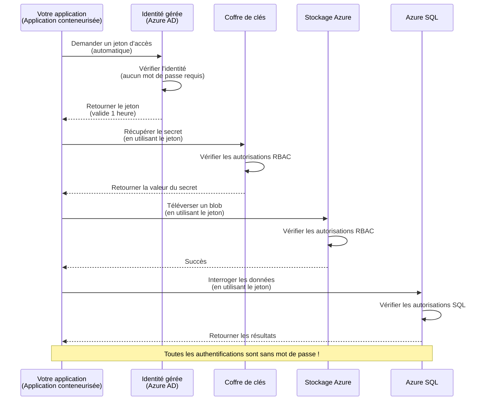
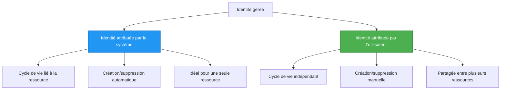

# Modèles d'authentification et identité gérée

⏱️ **Temps estimé**: 45-60 minutes | 💰 **Impact sur le coût**: Gratuit (aucun frais supplémentaires) | ⭐ **Complexité**: Intermédiaire

**📚 Parcours d'apprentissage:**
- ← Précédent: [Gestion de la configuration](configuration.md) - Gestion des variables d'environnement et des secrets
- 🎯 **Vous êtes ici**: Authentification et sécurité (Identité gérée, Key Vault, modèles sécurisés)
- → Suivant: [Premier projet](first-project.md) - Construire votre première application AZD
- 🏠 [Accueil du cours](../../README.md)

---

## Ce que vous apprendrez

En complétant cette leçon, vous allez :
- Comprendre les modèles d'authentification Azure (clés, chaînes de connexion, identité gérée)
- Implémenter **l'identité gérée** pour une authentification sans mot de passe
- Sécuriser les secrets avec l'intégration **Azure Key Vault**
- Configurer le **contrôle d'accès basé sur les rôles (RBAC)** pour les déploiements AZD
- Appliquer les meilleures pratiques de sécurité dans Container Apps et les services Azure
- Migrer de l'authentification par clé à l'authentification basée sur l'identité

## Pourquoi l'identité gérée est importante

### Le problème : authentification traditionnelle

**Avant l'identité gérée :**
```javascript
// ❌ RISQUE DE SÉCURITÉ : Secrets codés en dur dans le code
const connectionString = "Server=mydb.database.windows.net;User=admin;Password=P@ssw0rd123";
const storageKey = "xK7mN9pQ2wR5tY8uI0oP3aS6dF1gH4jK...";
const cosmosKey = "C2x7B9n4M1p8Q5w3E6r0T2y5U8i1O4p7...";
```

**Problèmes :**
- 🔴 **Secrets exposés** dans le code, les fichiers de configuration, les variables d'environnement
- 🔴 **La rotation des identifiants** nécessite des modifications du code et un redéploiement
- 🔴 **Cauchemars d'audit** - qui a accédé à quoi, quand ?
- 🔴 **Dispersion** - des secrets répartis sur plusieurs systèmes
- 🔴 **Risques de conformité** - échec des audits de sécurité

### La solution : identité gérée

**Après l'identité gérée :**
```javascript
// ✅ SÉCURISÉ: Aucun secret dans le code
const credential = new DefaultAzureCredential();
const client = new BlobServiceClient(
  "https://mystorageaccount.blob.core.windows.net",
  credential  // Azure gère automatiquement l'authentification
);
```

**Avantages :**
- ✅ **Aucun secret** dans le code ou la configuration
- ✅ **Rotation automatique** - prise en charge par Azure
- ✅ **Traçabilité complète** dans les journaux Azure AD
- ✅ **Sécurité centralisée** - gestion via le Portail Azure
- ✅ **Conforme aux exigences** - respecte les normes de sécurité

**Analogie**: L'authentification traditionnelle ressemble à porter plusieurs clés physiques pour différentes portes. L'identité gérée, c'est comme un badge de sécurité qui accorde automatiquement l'accès en fonction de qui vous êtes—pas de clés à perdre, copier ou faire tourner.

---

## Vue d'ensemble de l'architecture

### Flux d'authentification avec l'identité gérée


### Types d'identités gérées


| Fonctionnalité | Assignée au système | Assignée à l'utilisateur |
|---------|----------------|---------------|
| **Cycle de vie** | Liée à la ressource | Indépendante |
| **Création** | Automatique avec la ressource | Création manuelle |
| **Suppression** | Supprimée avec la ressource | Persiste après la suppression de la ressource |
| **Partage** | Une seule ressource | Plusieurs ressources |
| **Cas d'utilisation** | Scénarios simples | Scénarios complexes multi-ressources |
| **Par défaut AZD** | ✅ Recommandée | Optionnel |

---

## Prérequis

### Outils requis

Vous devriez déjà avoir installé les éléments suivants lors des leçons précédentes :

```bash
# Vérifier l'Azure Developer CLI
azd version
# ✅ Attendu: azd version 1.0.0 ou supérieure

# Vérifier l'Azure CLI
az --version
# ✅ Attendu: azure-cli version 2.50.0 ou supérieure
```

### Exigences Azure

- Abonnement Azure actif
- Autorisations pour :
  - Créer des identités gérées
  - Attribuer des rôles RBAC
  - Créer des ressources Key Vault
  - Déployer des Container Apps

### Prérequis de connaissances

Vous devriez avoir complété :
- [Guide d'installation](installation.md) - Configuration d'AZD
- [Notions de base AZD](azd-basics.md) - Concepts de base
- [Gestion de la configuration](configuration.md) - Variables d'environnement

---

## Leçon 1 : Comprendre les modèles d'authentification

### Modèle 1 : Chaînes de connexion (Ancien - À éviter)

**Comment ça marche :**
```bash
# La chaîne de connexion contient des identifiants
STORAGE_CONNECTION_STRING="DefaultEndpointsProtocol=https;AccountName=myaccount;AccountKey=xK7mN9pQ2wR5..."
COSMOS_CONNECTION_STRING="AccountEndpoint=https://myaccount.documents.azure.com:443/;AccountKey=C2x7..."
SQL_CONNECTION_STRING="Server=myserver.database.windows.net;User=admin;Password=P@ssw0rd..."
```

**Problèmes :**
- ❌ Secrets visibles dans les variables d'environnement
- ❌ Enregistrés dans les systèmes de déploiement
- ❌ Difficiles à faire pivoter
- ❌ Pas de traçabilité des accès

**Quand l'utiliser :** Uniquement pour le développement local, jamais en production.

---

### Modèle 2 : Références Key Vault (Meilleur)

**Comment ça marche :**
```bicep
// Store secret in Key Vault
resource keyVault 'Microsoft.KeyVault/vaults@2023-02-01' = {
  name: 'mykv'
  properties: {
    enableRbacAuthorization: true
  }
}

// Reference in Container App
env: [
  {
    name: 'STORAGE_KEY'
    secretRef: 'storage-key'  // References Key Vault
  }
]
```

**Avantages :**
- ✅ Secrets stockés de manière sécurisée dans Key Vault
- ✅ Gestion centralisée des secrets
- ✅ Rotation sans modifications du code

**Limites :**
- ⚠️ Utilisation toujours basée sur des clés/mots de passe
- ⚠️ Nécessité de gérer l'accès au Key Vault

**Quand l'utiliser :** Étape de transition entre les chaînes de connexion et l'identité gérée.

---

### Modèle 3 : Identité gérée (Meilleure pratique)

**Comment ça marche :**
```bicep
// Enable managed identity
resource containerApp 'Microsoft.App/containerApps@2023-05-01' = {
  name: 'myapp'
  identity: {
    type: 'SystemAssigned'  // Automatically creates identity
  }
}

// Grant permissions
resource roleAssignment 'Microsoft.Authorization/roleAssignments@2022-04-01' = {
  scope: storageAccount
  properties: {
    roleDefinitionId: storageBlobDataContributorRole
    principalId: containerApp.identity.principalId
  }
}
```

**Code de l'application :**
```javascript
// Pas besoin de secrets !
const { DefaultAzureCredential } = require('@azure/identity');
const { BlobServiceClient } = require('@azure/storage-blob');

const credential = new DefaultAzureCredential();
const blobServiceClient = new BlobServiceClient(
  'https://mystorageaccount.blob.core.windows.net',
  credential
);
```

**Avantages :**
- ✅ Aucun secret dans le code/la configuration
- ✅ Rotation automatique des identifiants
- ✅ Traçabilité complète
- ✅ Permissions basées sur RBAC
- ✅ Conforme aux exigences

**Quand l'utiliser :** Toujours, pour les applications en production.

---

## Leçon 2 : Implémenter l'identité gérée avec AZD

### Mise en œuvre étape par étape

Construisons une Container App sécurisée qui utilise l'identité gérée pour accéder à Azure Storage et Key Vault.

### Structure du projet

```
secure-app/
├── azure.yaml                 # AZD configuration
├── infra/
│   ├── main.bicep            # Main infrastructure
│   ├── core/
│   │   ├── identity.bicep    # Managed identity setup
│   │   ├── keyvault.bicep    # Key Vault configuration
│   │   └── storage.bicep     # Storage with RBAC
│   └── app/
│       └── container-app.bicep
└── src/
    ├── app.js                # Application code
    ├── package.json
    └── Dockerfile
```

### 1. Configurer AZD (azure.yaml)

```yaml
name: secure-app
metadata:
  template: secure-app@1.0.0

services:
  api:
    project: ./src
    language: js
    host: containerapp

# Enable managed identity (AZD handles this automatically)
```

### 2. Infrastructure : activer l'identité gérée

**Fichier : `infra/main.bicep`**

```bicep
targetScope = 'subscription'

param environmentName string
param location string = 'eastus'

var tags = { 'azd-env-name': environmentName }

// Resource group
resource rg 'Microsoft.Resources/resourceGroups@2021-04-01' = {
  name: 'rg-${environmentName}'
  location: location
  tags: tags
}

// Storage Account
module storage './core/storage.bicep' = {
  name: 'storage'
  scope: rg
  params: {
    name: 'st${uniqueString(rg.id)}'
    location: location
    tags: tags
  }
}

// Key Vault
module keyVault './core/keyvault.bicep' = {
  name: 'keyvault'
  scope: rg
  params: {
    name: 'kv-${uniqueString(rg.id)}'
    location: location
    tags: tags
  }
}

// Container App with Managed Identity
module containerApp './app/container-app.bicep' = {
  name: 'container-app'
  scope: rg
  params: {
    name: 'ca-${environmentName}'
    location: location
    tags: tags
    storageAccountName: storage.outputs.name
    keyVaultName: keyVault.outputs.name
  }
}

// Grant Container App access to Storage
module storageRoleAssignment './core/role-assignment.bicep' = {
  name: 'storage-role'
  scope: rg
  params: {
    principalId: containerApp.outputs.identityPrincipalId
    roleDefinitionId: 'ba92f5b4-2d11-453d-a403-e96b0029c9fe'  // Storage Blob Data Contributor
    targetResourceId: storage.outputs.id
  }
}

// Grant Container App access to Key Vault
module kvRoleAssignment './core/role-assignment.bicep' = {
  name: 'kv-role'
  scope: rg
  params: {
    principalId: containerApp.outputs.identityPrincipalId
    roleDefinitionId: '4633458b-17de-408a-b874-0445c86b69e6'  // Key Vault Secrets User
    targetResourceId: keyVault.outputs.id
  }
}

// Outputs
output AZURE_STORAGE_ACCOUNT_NAME string = storage.outputs.name
output AZURE_KEY_VAULT_NAME string = keyVault.outputs.name
output APP_URL string = containerApp.outputs.url
```

### 3. Container App avec identité assignée au système

**Fichier : `infra/app/container-app.bicep`**

```bicep
param name string
param location string
param tags object = {}
param storageAccountName string
param keyVaultName string

resource containerApp 'Microsoft.App/containerApps@2023-05-01' = {
  name: name
  location: location
  tags: tags
  identity: {
    type: 'SystemAssigned'  // 🔑 Enable managed identity
  }
  properties: {
    configuration: {
      ingress: {
        external: true
        targetPort: 3000
      }
    }
    template: {
      containers: [
        {
          name: 'api'
          image: 'myregistry.azurecr.io/api:latest'
          resources: {
            cpu: json('0.5')
            memory: '1Gi'
          }
          env: [
            {
              name: 'AZURE_STORAGE_ACCOUNT_NAME'
              value: storageAccountName
            }
            {
              name: 'AZURE_KEY_VAULT_NAME'
              value: keyVaultName
            }
            // 🔑 No secrets - managed identity handles authentication!
          ]
        }
      ]
    }
  }
}

// Output the identity for RBAC assignments
output identityPrincipalId string = containerApp.identity.principalId
output id string = containerApp.id
output url string = 'https://${containerApp.properties.configuration.ingress.fqdn}'
```

### 4. Module d'attribution de rôle RBAC

**Fichier : `infra/core/role-assignment.bicep`**

```bicep
param principalId string
param roleDefinitionId string  // Azure built-in role ID
param targetResourceId string

resource roleAssignment 'Microsoft.Authorization/roleAssignments@2022-04-01' = {
  name: guid(principalId, roleDefinitionId, targetResourceId)
  scope: resourceId('Microsoft.Resources/resourceGroups', resourceGroup().name)
  properties: {
    roleDefinitionId: subscriptionResourceId('Microsoft.Authorization/roleDefinitions', roleDefinitionId)
    principalId: principalId
    principalType: 'ServicePrincipal'
  }
}

output id string = roleAssignment.id
```

### 5. Code de l'application avec identité gérée

**Fichier : `src/app.js`**

```javascript
const express = require('express');
const { DefaultAzureCredential } = require('@azure/identity');
const { BlobServiceClient } = require('@azure/storage-blob');
const { SecretClient } = require('@azure/keyvault-secrets');

const app = express();
const PORT = process.env.PORT || 3000;

// 🔑 Initialiser les informations d'identification (fonctionne automatiquement avec l'identité gérée)
const credential = new DefaultAzureCredential();

// Configuration du stockage Azure
const storageAccountName = process.env.AZURE_STORAGE_ACCOUNT_NAME;
const blobServiceClient = new BlobServiceClient(
  `https://${storageAccountName}.blob.core.windows.net`,
  credential  // Aucune clé nécessaire !
);

// Configuration de Key Vault
const keyVaultName = process.env.AZURE_KEY_VAULT_NAME;
const secretClient = new SecretClient(
  `https://${keyVaultName}.vault.azure.net`,
  credential  // Aucune clé nécessaire !
);

// Vérification de l'état
app.get('/health', (req, res) => {
  res.json({ status: 'healthy', authentication: 'managed-identity' });
});

// Téléverser un fichier dans le stockage Blob
app.post('/upload', async (req, res) => {
  try {
    const containerClient = blobServiceClient.getContainerClient('uploads');
    await containerClient.createIfNotExists();
    
    const blobName = `file-${Date.now()}.txt`;
    const blockBlobClient = containerClient.getBlockBlobClient(blobName);
    
    await blockBlobClient.upload('Hello from managed identity!', 30);
    
    res.json({
      success: true,
      blobName: blobName,
      message: 'File uploaded using managed identity!'
    });
  } catch (error) {
    console.error('Upload error:', error);
    res.status(500).json({ error: error.message });
  }
});

// Récupérer un secret depuis Key Vault
app.get('/secret/:name', async (req, res) => {
  try {
    const secretName = req.params.name;
    const secret = await secretClient.getSecret(secretName);
    
    res.json({
      name: secretName,
      value: secret.value,
      message: 'Secret retrieved using managed identity!'
    });
  } catch (error) {
    console.error('Secret error:', error);
    res.status(500).json({ error: error.message });
  }
});

// Lister les conteneurs Blob (démontre l'accès en lecture)
app.get('/containers', async (req, res) => {
  try {
    const containers = [];
    for await (const container of blobServiceClient.listContainers()) {
      containers.push(container.name);
    }
    
    res.json({
      containers: containers,
      count: containers.length,
      message: 'Containers listed using managed identity!'
    });
  } catch (error) {
    console.error('List error:', error);
    res.status(500).json({ error: error.message });
  }
});

app.listen(PORT, () => {
  console.log(`Secure API listening on port ${PORT}`);
  console.log('Authentication: Managed Identity (passwordless)');
});
```

**Fichier : `src/package.json`**

```json
{
  "name": "secure-app",
  "version": "1.0.0",
  "dependencies": {
    "express": "^4.18.2",
    "@azure/identity": "^4.0.0",
    "@azure/storage-blob": "^12.17.0",
    "@azure/keyvault-secrets": "^4.7.0"
  },
  "scripts": {
    "start": "node app.js"
  }
}
```

### 6. Déployer et tester

```bash
# Initialiser l'environnement AZD
azd init

# Déployer l'infrastructure et l'application
azd up

# Obtenir l'URL de l'application
APP_URL=$(azd env get-values | grep APP_URL | cut -d '=' -f2 | tr -d '"')

# Tester le contrôle de santé
curl $APP_URL/health
```

**✅ Résultat attendu :**
```json
{
  "status": "healthy",
  "authentication": "managed-identity"
}
```

**Test de téléversement de blob :**
```bash
curl -X POST $APP_URL/upload
```

**✅ Résultat attendu :**
```json
{
  "success": true,
  "blobName": "file-1700404800000.txt",
  "message": "File uploaded using managed identity!"
}
```

**Test de la liste des conteneurs :**
```bash
curl $APP_URL/containers
```

**✅ Résultat attendu :**
```json
{
  "containers": ["uploads"],
  "count": 1,
  "message": "Containers listed using managed identity!"
}
```

---

## Rôles RBAC Azure courants

### IDs des rôles intégrés pour l'identité gérée

| Service | Nom du rôle | ID du rôle | Autorisations |
|---------|-----------|---------|-------------|
| **Storage** | Storage Blob Data Reader | `2a2b9908-6b94-4a3d-8e5a-a7d8f8cc8a12` | Lire les blobs et les conteneurs |
| **Storage** | Storage Blob Data Contributor | `ba92f5b4-2d11-453d-a403-e96b0029c9fe` | Lire, écrire, supprimer des blobs |
| **Storage** | Storage Queue Data Contributor | `974c5e8b-45b9-4653-ba55-5f855dd0fb88` | Lire, écrire, supprimer des messages de file d'attente |
| **Key Vault** | Key Vault Secrets User | `4633458b-17de-408a-b874-0445c86b69e6` | Lire les secrets |
| **Key Vault** | Key Vault Secrets Officer | `b86a8fe4-44ce-4948-aee5-eccb2c155cd7` | Lire, écrire, supprimer des secrets |
| **Cosmos DB** | Cosmos DB Built-in Data Reader | `00000000-0000-0000-0000-000000000001` | Lire les données Cosmos DB |
| **Cosmos DB** | Cosmos DB Built-in Data Contributor | `00000000-0000-0000-0000-000000000002` | Lire, écrire des données Cosmos DB |
| **SQL Database** | SQL DB Contributor | `9b7fa17d-e63e-47b0-bb0a-15c516ac86ec` | Gérer les bases de données SQL |
| **Service Bus** | Azure Service Bus Data Owner | `090c5cfd-751d-490a-894a-3ce6f1109419` | Envoyer, recevoir et gérer les messages |

### Comment trouver les ID de rôle

```bash
# Lister tous les rôles intégrés
az role definition list --query "[].{Name:roleName, ID:name}" --output table

# Rechercher un rôle spécifique
az role definition list --query "[?contains(roleName, 'Storage Blob')].{Name:roleName, ID:name}" --output table

# Obtenir les détails du rôle
az role definition list --name "Storage Blob Data Contributor"
```

---

## Exercices pratiques

### Exercice 1 : Activer l'identité gérée pour une application existante ⭐⭐ (Moyen)

**Objectif**: Ajouter l'identité gérée à un déploiement Container App existant

**Scénario**: Vous avez une Container App utilisant des chaînes de connexion. Convertissez-la pour utiliser l'identité gérée.

**Point de départ**: Container App avec cette configuration:

```bicep
// ❌ Current: Using connection string
env: [
  {
    name: 'STORAGE_CONNECTION_STRING'
    secretRef: 'storage-connection'
  }
]
```

**Étapes**:

1. **Activer l'identité gérée dans Bicep :**

```bicep
resource containerApp 'Microsoft.App/containerApps@2023-05-01' = {
  name: 'myapp'
  identity: {
    type: 'SystemAssigned'  // Add this
  }
  // ... rest of configuration
}
```

2. **Accorder l'accès au Storage :**

```bicep
// Get storage account reference
resource storageAccount 'Microsoft.Storage/storageAccounts@2023-01-01' existing = {
  name: storageAccountName
}

// Assign role
resource roleAssignment 'Microsoft.Authorization/roleAssignments@2022-04-01' = {
  name: guid(containerApp.id, 'ba92f5b4-2d11-453d-a403-e96b0029c9fe', storageAccount.id)
  scope: storageAccount
  properties: {
    roleDefinitionId: subscriptionResourceId('Microsoft.Authorization/roleDefinitions', 'ba92f5b4-2d11-453d-a403-e96b0029c9fe')
    principalId: containerApp.identity.principalId
    principalType: 'ServicePrincipal'
  }
}
```

3. **Mettre à jour le code de l'application :**

**Avant (chaîne de connexion) :**
```javascript
const { BlobServiceClient } = require('@azure/storage-blob');

const blobServiceClient = BlobServiceClient.fromConnectionString(
  process.env.STORAGE_CONNECTION_STRING
);
```

**Après (identité gérée) :**
```javascript
const { DefaultAzureCredential } = require('@azure/identity');
const { BlobServiceClient } = require('@azure/storage-blob');

const credential = new DefaultAzureCredential();
const blobServiceClient = new BlobServiceClient(
  `https://${process.env.STORAGE_ACCOUNT_NAME}.blob.core.windows.net`,
  credential
);
```

4. **Mettre à jour les variables d'environnement :**
```bicep
env: [
  {
    name: 'STORAGE_ACCOUNT_NAME'
    value: storageAccountName  // Just the name, no secrets!
  }
  // Remove STORAGE_CONNECTION_STRING
]
```

5. **Déployer et tester :**

```bash
# Redéployer
azd up

# Vérifier que cela fonctionne toujours
curl https://myapp.azurecontainerapps.io/upload
```

**✅ Critères de réussite :**
- ✅ L'application se déploie sans erreurs
- ✅ Les opérations Storage fonctionnent (téléversement, liste, téléchargement)
- ✅ Aucune chaîne de connexion dans les variables d'environnement
- ✅ Identité visible dans le Portail Azure sous le volet "Identity"

**Vérification :**

```bash
# Vérifier que l'identité gérée est activée
az containerapp show \
  --name myapp \
  --resource-group rg-myapp \
  --query "identity.type"
# ✅ Attendu : "SystemAssigned"

# Vérifier l'attribution du rôle
az role assignment list \
  --assignee $(az containerapp show --name myapp --resource-group rg-myapp --query "identity.principalId" -o tsv) \
  --scope /subscriptions/{sub-id}/resourceGroups/rg-myapp/providers/Microsoft.Storage/storageAccounts/mystorageaccount
# ✅ Attendu : Affiche le rôle "Storage Blob Data Contributor"
```

**Temps**: 20-30 minutes

---

### Exercice 2 : Accès multi-service avec identité assignée par l'utilisateur ⭐⭐⭐ (Avancé)

**Objectif**: Créer une identité assignée par l'utilisateur partagée entre plusieurs Container Apps

**Scénario**: Vous avez 3 microservices qui doivent tous accéder au même compte Storage et au Key Vault.

**Étapes**:

1. **Créer une identité assignée par l'utilisateur :**

**Fichier : `infra/core/identity.bicep`**

```bicep
param name string
param location string
param tags object = {}

resource userAssignedIdentity 'Microsoft.ManagedIdentity/userAssignedIdentities@2023-01-31' = {
  name: name
  location: location
  tags: tags
}

output id string = userAssignedIdentity.id
output principalId string = userAssignedIdentity.properties.principalId
output clientId string = userAssignedIdentity.properties.clientId
```

2. **Attribuer des rôles à l'identité assignée par l'utilisateur :**

```bicep
// In main.bicep
module userIdentity './core/identity.bicep' = {
  name: 'user-identity'
  scope: rg
  params: {
    name: 'id-${environmentName}'
    location: location
    tags: tags
  }
}

// Grant Storage access
resource storageRoleAssignment 'Microsoft.Authorization/roleAssignments@2022-04-01' = {
  name: guid(userIdentity.outputs.principalId, 'storage-contributor')
  scope: storageAccount
  properties: {
    roleDefinitionId: subscriptionResourceId('Microsoft.Authorization/roleDefinitions', 'ba92f5b4-2d11-453d-a403-e96b0029c9fe')
    principalId: userIdentity.outputs.principalId
    principalType: 'ServicePrincipal'
  }
}

// Grant Key Vault access
resource kvRoleAssignment 'Microsoft.Authorization/roleAssignments@2022-04-01' = {
  name: guid(userIdentity.outputs.principalId, 'kv-secrets-user')
  scope: keyVault
  properties: {
    roleDefinitionId: subscriptionResourceId('Microsoft.Authorization/roleDefinitions', '4633458b-17de-408a-b874-0445c86b69e6')
    principalId: userIdentity.outputs.principalId
    principalType: 'ServicePrincipal'
  }
}
```

3. **Assigner l'identité à plusieurs Container Apps :**

```bicep
resource apiGateway 'Microsoft.App/containerApps@2023-05-01' = {
  name: 'api-gateway'
  identity: {
    type: 'UserAssigned'
    userAssignedIdentities: {
      '${userIdentity.outputs.id}': {}
    }
  }
  // ... rest of config
}

resource productService 'Microsoft.App/containerApps@2023-05-01' = {
  name: 'product-service'
  identity: {
    type: 'UserAssigned'
    userAssignedIdentities: {
      '${userIdentity.outputs.id}': {}
    }
  }
  // ... rest of config
}

resource orderService 'Microsoft.App/containerApps@2023-05-01' = {
  name: 'order-service'
  identity: {
    type: 'UserAssigned'
    userAssignedIdentities: {
      '${userIdentity.outputs.id}': {}
    }
  }
  // ... rest of config
}
```

4. **Code applicatif (tous les services utilisent le même modèle) :**

```javascript
const { DefaultAzureCredential, ManagedIdentityCredential } = require('@azure/identity');

// Pour une identité attribuée par l'utilisateur, spécifiez l'ID du client
const credential = new ManagedIdentityCredential(
  process.env.AZURE_CLIENT_ID  // ID client de l'identité attribuée par l'utilisateur
);

// Ou utilisez DefaultAzureCredential (détecte automatiquement)
const credential = new DefaultAzureCredential();

const blobServiceClient = new BlobServiceClient(
  `https://${process.env.STORAGE_ACCOUNT_NAME}.blob.core.windows.net`,
  credential
);
```

5. **Déployer et vérifier :**

```bash
azd up

# Vérifier que tous les services peuvent accéder au stockage
curl https://api-gateway.azurecontainerapps.io/upload
curl https://product-service.azurecontainerapps.io/upload
curl https://order-service.azurecontainerapps.io/upload
```

**✅ Critères de réussite :**
- ✅ Une identité partagée entre 3 services
- ✅ Tous les services peuvent accéder au Storage et au Key Vault
- ✅ L'identité persiste si vous supprimez un service
- ✅ Gestion centralisée des permissions

**Avantages de l'identité assignée par l'utilisateur :**
- Une identité unique à gérer
- Permissions cohérentes entre les services
- Survit à la suppression d'un service
- Mieux pour les architectures complexes

**Temps**: 30-40 minutes

---

### Exercice 3 : Mettre en place la rotation des secrets Key Vault ⭐⭐⭐ (Avancé)

**Objectif**: Stocker les clés d'API tierces dans Key Vault et y accéder via l'identité gérée

**Scénario**: Votre application doit appeler une API externe (OpenAI, Stripe, SendGrid) qui nécessite des clés d'API.

**Étapes**:

1. **Créer un Key Vault avec RBAC :**

**Fichier : `infra/core/keyvault.bicep`**

```bicep
param name string
param location string
param tags object = {}

resource keyVault 'Microsoft.KeyVault/vaults@2023-02-01' = {
  name: name
  location: location
  tags: tags
  properties: {
    enableRbacAuthorization: true  // Use RBAC instead of access policies
    sku: {
      family: 'A'
      name: 'standard'
    }
    tenantId: subscription().tenantId
    enableSoftDelete: true
    softDeleteRetentionInDays: 90
  }
}

// Allow Container App to read secrets
output id string = keyVault.id
output name string = keyVault.name
output uri string = keyVault.properties.vaultUri
```

2. **Stocker les secrets dans Key Vault :**

```bash
# Récupérer le nom du coffre de clés
KV_NAME=$(azd env get-values | grep AZURE_KEY_VAULT_NAME | cut -d '=' -f2 | tr -d '"')

# Stocker les clés d'API tierces
az keyvault secret set \
  --vault-name $KV_NAME \
  --name "OpenAI-ApiKey" \
  --value "sk-proj-xxxxxxxxxxxxx"

az keyvault secret set \
  --vault-name $KV_NAME \
  --name "Stripe-ApiKey" \
  --value "sk_live_xxxxxxxxxxxxx"

az keyvault secret set \
  --vault-name $KV_NAME \
  --name "SendGrid-ApiKey" \
  --value "SG.xxxxxxxxxxxxx"
```

3. **Code applicatif pour récupérer les secrets :**

**Fichier : `src/config.js`**

```javascript
const { DefaultAzureCredential } = require('@azure/identity');
const { SecretClient } = require('@azure/keyvault-secrets');

class Config {
  constructor() {
    this.credential = new DefaultAzureCredential();
    this.secretClient = new SecretClient(
      `https://${process.env.AZURE_KEY_VAULT_NAME}.vault.azure.net`,
      this.credential
    );
    this.cache = {};
  }

  async getSecret(secretName) {
    // Vérifier d'abord le cache
    if (this.cache[secretName]) {
      return this.cache[secretName];
    }

    try {
      const secret = await this.secretClient.getSecret(secretName);
      this.cache[secretName] = secret.value;
      console.log(`✅ Retrieved secret: ${secretName}`);
      return secret.value;
    } catch (error) {
      console.error(`❌ Failed to get secret ${secretName}:`, error.message);
      throw error;
    }
  }

  async getOpenAIKey() {
    return this.getSecret('OpenAI-ApiKey');
  }

  async getStripeKey() {
    return this.getSecret('Stripe-ApiKey');
  }

  async getSendGridKey() {
    return this.getSecret('SendGrid-ApiKey');
  }
}

module.exports = new Config();
```

4. **Utiliser les secrets dans l'application :**

**Fichier : `src/app.js`**

```javascript
const express = require('express');
const config = require('./config');
const { OpenAI } = require('openai');

const app = express();

// Initialiser OpenAI avec la clé depuis le Key Vault
let openaiClient;

async function initializeServices() {
  const openaiKey = await config.getOpenAIKey();
  openaiClient = new OpenAI({ apiKey: openaiKey });
  console.log('✅ Services initialized with secrets from Key Vault');
}

// Appeler au démarrage
initializeServices().catch(console.error);

app.post('/chat', async (req, res) => {
  try {
    const completion = await openaiClient.chat.completions.create({
      model: 'gpt-4.1',
      messages: [{ role: 'user', content: 'Hello!' }]
    });
    
    res.json({
      response: completion.choices[0].message.content,
      authentication: 'Key from Key Vault via Managed Identity'
    });
  } catch (error) {
    res.status(500).json({ error: error.message });
  }
});

app.listen(3000, () => {
  console.log('Secure API with Key Vault integration running');
});
```

5. **Déployer et tester :**

```bash
azd up

# Vérifier que les clés API fonctionnent
curl -X POST https://myapp.azurecontainerapps.io/chat \
  -H "Content-Type: application/json" \
  -d '{"message":"Hello AI"}'
```

**✅ Critères de réussite :**
- ✅ Aucune clé d'API dans le code ou les variables d'environnement
- ✅ L'application récupère les clés depuis Key Vault
- ✅ Les API tierces fonctionnent correctement
- ✅ Possibilité de faire tourner les clés sans modifications du code

**Faire tourner un secret :**

```bash
# Mettre à jour le secret dans le coffre de clés
az keyvault secret set \
  --vault-name $KV_NAME \
  --name "OpenAI-ApiKey" \
  --value "sk-proj-NEW_KEY_HERE"

# Redémarrer l'application pour prendre en compte la nouvelle clé
az containerapp revision restart \
  --name myapp \
  --resource-group rg-myapp
```

**Temps**: 25-35 minutes

---

## Point de contrôle des connaissances

### 1. Modèles d'authentification ✓

Vérifiez votre compréhension :

- [ ] **Q1** : Quels sont les trois principaux modèles d'authentification ? 
  - **A**: Chaînes de connexion (héritées), Références Key Vault (transition), Identité gérée (meilleure pratique)

- [ ] **Q2** : Pourquoi l'identité gérée est-elle meilleure que les chaînes de connexion ?
  - **A**: Pas de secrets dans le code, rotation automatique, traçabilité complète, permissions via RBAC

- [ ] **Q3** : Quand utiliser une identité assignée par l'utilisateur plutôt qu'assignée au système ?
  - **A**: Lors du partage d'une identité entre plusieurs ressources ou lorsque le cycle de vie de l'identité est indépendant de celui des ressources

**Vérification pratique :**
```bash
# Vérifiez quel type d'identité votre application utilise
az containerapp show \
  --name myapp \
  --resource-group rg-myapp \
  --query "identity.type"

# Listez toutes les affectations de rôle pour l'identité
az role assignment list \
  --assignee $(az containerapp show --name myapp --resource-group rg-myapp --query "identity.principalId" -o tsv)
```

---

### 2. RBAC et autorisations ✓

Vérifiez votre compréhension :

- [ ] **Q1** : Quel est l'ID du rôle pour "Storage Blob Data Contributor" ?
  - **A**: `ba92f5b4-2d11-453d-a403-e96b0029c9fe`

- [ ] **Q2** : Quelles autorisations fournit « Key Vault Secrets User » ?
  - **A**: Accès en lecture seule aux secrets (ne peut pas créer, mettre à jour ou supprimer)

- [ ] **Q3** : Comment accorder à une Container App l'accès à Azure SQL ?
  - **A**: Attribuer le rôle « SQL DB Contributor » ou configurer l'authentification Azure AD pour SQL

**Vérification pratique :**
```bash
# Trouver un rôle spécifique
az role definition list --name "Storage Blob Data Contributor"

# Vérifier quels rôles sont assignés à votre identité
PRINCIPAL_ID=$(az containerapp show --name myapp --resource-group rg-myapp --query "identity.principalId" -o tsv)
az role assignment list --assignee $PRINCIPAL_ID --output table
```

---

### 3. Intégration Key Vault ✓

Test your understanding:
- [ ] **Q1**: Comment activer RBAC pour Key Vault au lieu des stratégies d'accès ?
  - **A**: Set `enableRbacAuthorization: true` in Bicep

- [ ] **Q2**: Quelle bibliothèque du SDK Azure gère l'authentification par identité gérée ?
  - **A**: `@azure/identity` avec la classe `DefaultAzureCredential`

- [ ] **Q3**: Combien de temps les secrets Key Vault restent-ils en cache ?
  - **A**: Dépend de l'application ; implémentez votre propre stratégie de mise en cache

**Hands-On Verification:**
```bash
# Tester l'accès au Key Vault
az keyvault secret show \
  --vault-name $KV_NAME \
  --name "OpenAI-ApiKey" \
  --query "value"

# Vérifier que le RBAC est activé
az keyvault show \
  --name $KV_NAME \
  --query "properties.enableRbacAuthorization"
# ✅ Attendu : true
```

---

## Bonnes pratiques de sécurité

### ✅ À FAIRE :

1. **Utilisez toujours l'identité gérée en production**
   ```bicep
   identity: {
     type: 'SystemAssigned'
   }
   ```

2. **Utilisez des rôles RBAC au moindre privilège**
   - Utilisez "Reader" roles lorsque possible
   - Évitez "Owner" ou "Contributor" sauf si nécessaire

3. **Stockez les clés tierces dans Key Vault**
   ```javascript
   const apiKey = await secretClient.getSecret('ThirdPartyApiKey');
   ```

4. **Activez la journalisation d'audit**
   ```bicep
   diagnosticSettings: {
     logs: [{ category: 'AuditEvent', enabled: true }]
   }
   ```

5. **Utilisez des identités différentes pour dev/staging/prod**
   ```bash
   azd env new dev
   azd env new staging
   azd env new prod
   ```

6. **Renouvelez régulièrement les secrets**
   - Définissez des dates d'expiration sur les secrets Key Vault
   - Automatisez la rotation avec Azure Functions

### ❌ À NE PAS FAIRE :

1. **Ne stockez jamais les secrets en dur dans le code**
   ```javascript
   // ❌ MAUVAIS
   const apiKey = "sk-proj-xxxxxxxxxxxxx";
   ```

2. **N'utilisez pas de chaînes de connexion en production**
   ```javascript
   // ❌ MAUVAIS
   BlobServiceClient.fromConnectionString(process.env.STORAGE_CONNECTION_STRING)
   ```

3. **Ne donnez pas de permissions excessives**
   ```bicep
   // ❌ BAD - too much access
   roleDefinitionId: 'Owner'
   
   // ✅ GOOD - least privilege
   roleDefinitionId: 'Storage Blob Data Reader'
   ```

4. **Ne journalisez pas les secrets**
   ```javascript
   // ❌ MAUVAIS
   console.log('API Key:', apiKey);
   
   // ✅ BON
   console.log('API Key retrieved successfully');
   ```

5. **Ne partagez pas les identités de production entre environnements**
   ```bicep
   // ❌ BAD - same identity for dev and prod
   // ✅ GOOD - separate identities per environment
   ```

---

## Guide de dépannage

### Problème : « Non autorisé » lors de l'accès à Azure Storage

**Symptômes:**
```
Error: Unauthorized (403)
AuthorizationPermissionMismatch: This request is not authorized to perform this operation
```

**Diagnostic:**

```bash
# Vérifier si l'identité gérée est activée
az containerapp show \
  --name myapp \
  --resource-group rg-myapp \
  --query "identity.type"
# ✅ Attendu : "SystemAssigned" ou "UserAssigned"

# Vérifier les affectations de rôle
PRINCIPAL_ID=$(az containerapp show --name myapp --resource-group rg-myapp --query "identity.principalId" -o tsv)
az role assignment list --assignee $PRINCIPAL_ID

# Attendu : On devrait voir "Storage Blob Data Contributor" ou un rôle similaire
```

**Solutions:**

1. **Attribuer le rôle RBAC correct :**
```bash
STORAGE_ID=$(az storage account show --name mystorageaccount --resource-group rg-myapp --query "id" -o tsv)
az role assignment create \
  --assignee $PRINCIPAL_ID \
  --role "Storage Blob Data Contributor" \
  --scope $STORAGE_ID
```

2. **Attendre la propagation (peut prendre 5-10 minutes) :**
```bash
# Vérifier l'état de l'attribution du rôle
az role assignment list --assignee $PRINCIPAL_ID --scope $STORAGE_ID
```

3. **Vérifier que le code de l'application utilise les informations d'identification correctes :**
```javascript
// Assurez-vous d'utiliser DefaultAzureCredential
const credential = new DefaultAzureCredential();
```

---

### Problème : Accès refusé à Key Vault

**Symptômes:**
```
Error: Forbidden (403)
The user, group or application does not have secrets get permission
```

**Diagnostic:**

```bash
# Vérifier que le RBAC du Key Vault est activé
az keyvault show \
  --name $KV_NAME \
  --query "properties.enableRbacAuthorization"
# ✅ Attendu : vrai

# Vérifier les attributions de rôle
az role assignment list \
  --assignee $PRINCIPAL_ID \
  --scope /subscriptions/{sub-id}/resourceGroups/rg-myapp/providers/Microsoft.KeyVault/vaults/$KV_NAME
```

**Solutions:**

1. **Activer RBAC sur Key Vault :**
```bash
az keyvault update \
  --name $KV_NAME \
  --enable-rbac-authorization true
```

2. **Attribuer le rôle Key Vault Secrets User :**
```bash
KV_ID=$(az keyvault show --name $KV_NAME --query "id" -o tsv)
az role assignment create \
  --assignee $PRINCIPAL_ID \
  --role "Key Vault Secrets User" \
  --scope $KV_ID
```

---

### Problème : DefaultAzureCredential échoue en local

**Symptômes:**
```
Error: DefaultAzureCredential failed to retrieve a token
CredentialUnavailableError: No credential available
```

**Diagnostic:**

```bash
# Vérifier si vous êtes connecté
az account show

# Vérifier l'authentification de l'Azure CLI
az ad signed-in-user show
```

**Solutions:**

1. **Se connecter à Azure CLI :**
```bash
az login
```

2. **Définir l'abonnement Azure :**
```bash
az account set --subscription "Your Subscription Name"
```

3. **Pour le développement local, utilisez des variables d'environnement :**
```bash
export AZURE_TENANT_ID="your-tenant-id"
export AZURE_CLIENT_ID="your-client-id"
export AZURE_CLIENT_SECRET="your-client-secret"
```

4. **Ou utilisez un autre mode d'authentification en local :**
```javascript
const { DefaultAzureCredential, AzureCliCredential } = require('@azure/identity');

// Utilisez AzureCliCredential pour le développement local
const credential = process.env.NODE_ENV === 'production' 
  ? new DefaultAzureCredential()
  : new AzureCliCredential();
```

---

### Problème : L'attribution de rôle prend trop de temps à se propager

**Symptômes:**
- Rôle attribué avec succès
- Toujours des erreurs 403
- Accès intermittent (parfois fonctionne, parfois non)

**Explication:**
Les modifications RBAC d'Azure peuvent prendre 5-10 minutes pour se propager globalement.

**Solution:**

```bash
# Attendez et réessayez
echo "Waiting for RBAC propagation..."
sleep 300  # Attendez 5 minutes

# Tester l'accès
curl https://myapp.azurecontainerapps.io/upload

# Si cela échoue encore, redémarrez l'application
az containerapp revision restart \
  --name myapp \
  --resource-group rg-myapp
```

---

## Considérations de coûts

### Coûts liés à l'identité gérée

| Ressource | Coût |
|----------|------|
| **Identité gérée** | 🆓 **GRATUIT** - Aucun frais |
| **Attributions de rôles RBAC** | 🆓 **GRATUIT** - Aucun frais |
| **Requêtes de jetons Azure AD** | 🆓 **GRATUIT** - Inclus |
| **Opérations Key Vault** | $0.03 per 10,000 operations |
| **Stockage Key Vault** | $0.024 per secret per month |

**L'identité gérée permet d'économiser de l'argent en :**
- ✅ Éliminant les opérations Key Vault pour l'authentification service-à-service
- ✅ Réduisant les incidents de sécurité (aucun identifiant divulgué)
- ✅ Diminuant la charge opérationnelle (pas de rotation manuelle)

**Exemple de comparaison des coûts (mensuel) :**

| Scénario | Chaînes de connexion | Identité gérée | Économies |
|----------|-------------------|-----------------|---------|
| Petite application (1M de requêtes) | ~$50 (Key Vault + ops) | ~$0 | $50/month |
| Application moyenne (10M de requêtes) | ~$200 | ~$0 | $200/month |
| Grande application (100M de requêtes) | ~$1,500 | ~$0 | $1,500/month |

---

## En savoir plus

### Documentation officielle
- [Azure Managed Identity](https://learn.microsoft.com/entra/identity/managed-identities-azure-resources/overview)
- [Azure RBAC](https://learn.microsoft.com/azure/role-based-access-control/overview)
- [Azure Key Vault](https://learn.microsoft.com/azure/key-vault/general/overview)
- [DefaultAzureCredential](https://learn.microsoft.com/dotnet/api/azure.identity.defaultazurecredential)

### Documentation du SDK
- [@azure/identity (Node.js)](https://www.npmjs.com/package/@azure/identity)
- [Azure.Identity (C#)](https://www.nuget.org/packages/Azure.Identity/)
- [azure-identity (Python)](https://pypi.org/project/azure-identity/)

### Étapes suivantes dans ce cours
- ← Précédent : [Gestion de la configuration](configuration.md)
- → Suivant : [Premier projet](first-project.md)
- 🏠 [Accueil du cours](../../README.md)

### Exemples associés
- [Exemple de chat Microsoft Foundry Models](../../../../examples/azure-openai-chat) - Utilise l'identité gérée pour Microsoft Foundry Models
- [Exemple de microservices](../../../../examples/microservices) - Modèles d'authentification multi-service

---

## Résumé

**Vous avez appris :**
- ✅ Trois modèles d'authentification (chaînes de connexion, Key Vault, identité gérée)
- ✅ Comment activer et configurer l'identité gérée dans AZD
- ✅ Attributions de rôles RBAC pour les services Azure
- ✅ Intégration de Key Vault pour les secrets tiers
- ✅ Identités attribuées par l'utilisateur vs attribuées par le système
- ✅ Bonnes pratiques de sécurité et dépannage

**Points clés :**
1. **Utilisez toujours l'identité gérée en production** - Pas de secrets, rotation automatique
2. **Utilisez des rôles RBAC au moindre privilège** - Accordez uniquement les permissions nécessaires
3. **Stockez les clés tierces dans Key Vault** - Gestion centralisée des secrets
4. **Séparez les identités par environnement** - Isolation dev, staging, prod
5. **Activez la journalisation d'audit** - Suivez qui a accédé à quoi

**Étapes suivantes :**
1. Complétez les exercices pratiques ci-dessus
2. Migrez une application existante des chaînes de connexion vers l'identité gérée
3. Construisez votre premier projet AZD avec la sécurité dès le premier jour : [Premier projet](first-project.md)

---

<!-- CO-OP TRANSLATOR DISCLAIMER START -->
Avertissement :
Ce document a été traduit à l'aide du service de traduction automatique Co-op Translator (https://github.com/Azure/co-op-translator). Bien que nous fassions tout notre possible pour garantir l'exactitude, veuillez noter que les traductions automatiques peuvent contenir des erreurs ou des inexactitudes. Le document original, dans sa langue d'origine, doit être considéré comme la source faisant foi. Pour les informations critiques, une traduction humaine professionnelle est recommandée. Nous déclinons toute responsabilité pour tout malentendu ou toute interprétation erronée résultant de l'utilisation de cette traduction.
<!-- CO-OP TRANSLATOR DISCLAIMER END -->