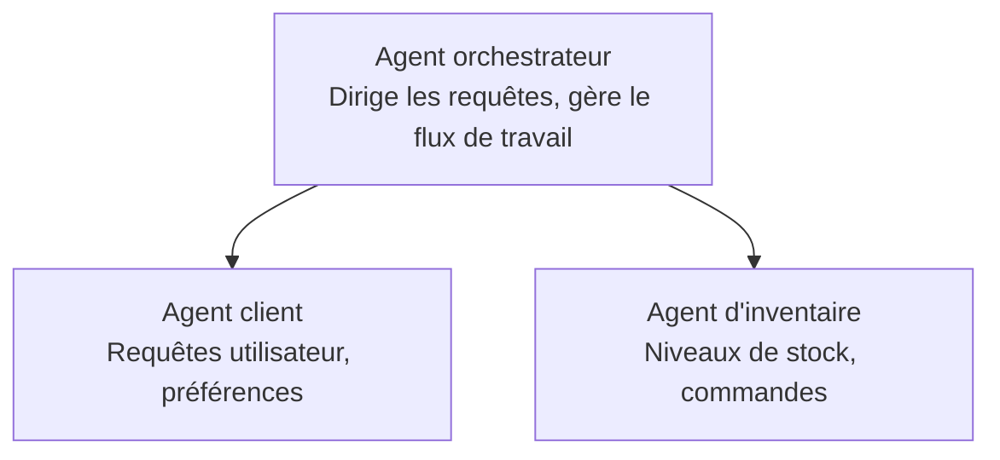

# Chapitre 5 : Solutions d'IA multi-agents

**📚 Cours**: [AZD pour débutants](../../README.md) | **⏱️ Durée**: 2-3 heures | **⭐ Complexité**: Avancé

---

## Aperçu

Ce chapitre couvre des modèles d'architecture multi-agents avancés, l'orchestration d'agents et des déploiements d'IA prêts pour la production pour des scénarios complexes.

## Objectifs d'apprentissage

À la fin de ce chapitre, vous pourrez :
- Comprendre les modèles d'architecture multi-agents
- Déployer des systèmes d'agents IA coordonnés
- Mettre en œuvre la communication entre agents
- Concevoir des solutions multi-agents prêtes pour la production

---

## 📚 Leçons

| # | Leçon | Description | Durée |
|---|--------|-------------|------|
| 1 | [Solution multi-agents pour le commerce de détail](../../examples/retail-scenario.md) | Parcours d'implémentation complet | 90 min |
| 2 | [Modèles de coordination](../chapter-06-pre-deployment/coordination-patterns.md) | Stratégies d'orchestration d'agents | 30 min |
| 3 | [Déploiement de template ARM](../../examples/retail-multiagent-arm-template/README.md) | Déploiement en un clic | 30 min |

---

## 🚀 Démarrage rapide

```bash
# Option 1 : Déployer depuis un modèle
azd init --template agent-openai-python-prompty
azd up

# Option 2 : Déployer depuis un manifeste d'agent (nécessite l'extension azure.ai.agents)
azd extension install azure.ai.agents
azd ai agent init -m agent-manifest.yaml
azd up
```

> **Quelle approche ?** Utilisez `azd init --template` pour partir d'un exemple fonctionnel. Utilisez `azd ai agent init` lorsque vous avez votre propre manifeste d'agent. Consultez la [Référence de l'AZD AI CLI](../chapter-08-production/production-ai-practices.md#azd-ai-cli-commands-and-extensions) pour tous les détails.

---

## 🤖 Architecture multi-agents


---

## 🎯 Solution vedette : Solution multi-agents pour le commerce de détail

La [Solution multi-agents pour le commerce de détail](../../examples/retail-scenario.md) démontre :

- **Agent client** : Gère les interactions avec les utilisateurs et les préférences
- **Agent d'inventaire** : Gère le stock et le traitement des commandes
- **Orchestrateur** : Coordonne les agents entre eux
- **Mémoire partagée** : Gestion du contexte entre agents

### Services utilisés

| Service | Objectif |
|---------|---------|
| Microsoft Foundry Models | Compréhension du langage |
| Azure AI Search | Catalogue de produits |
| Cosmos DB | État et mémoire des agents |
| Container Apps | Hébergement des agents |
| Application Insights | Surveillance |

---

## 🔗 Navigation

| Direction | Chapitre |
|-----------|---------|
| **Précédent** | [Chapitre 4 : Infrastructure](../chapter-04-infrastructure/README.md) |
| **Suivant** | [Chapitre 6 : Pré-déploiement](../chapter-06-pre-deployment/README.md) |

---

## 📖 Ressources connexes

- [Guide des agents IA](../chapter-02-ai-development/agents.md)
- [Pratiques de l'IA en production](../chapter-08-production/production-ai-practices.md)
- [Dépannage de l'IA](../chapter-07-troubleshooting/ai-troubleshooting.md)

---

<!-- CO-OP TRANSLATOR DISCLAIMER START -->
Clause de non-responsabilité :

Ce document a été traduit à l'aide du service de traduction par IA Co-op Translator (https://github.com/Azure/co-op-translator). Bien que nous nous efforcions d'être précis, veuillez noter que les traductions automatisées peuvent contenir des erreurs ou des inexactitudes. Le document original dans sa langue d'origine doit être considéré comme la source faisant foi. Pour les informations critiques, il est recommandé de recourir à une traduction humaine professionnelle. Nous déclinons toute responsabilité en cas de malentendus ou d'interprétations erronées résultant de l'utilisation de cette traduction.
<!-- CO-OP TRANSLATOR DISCLAIMER END -->