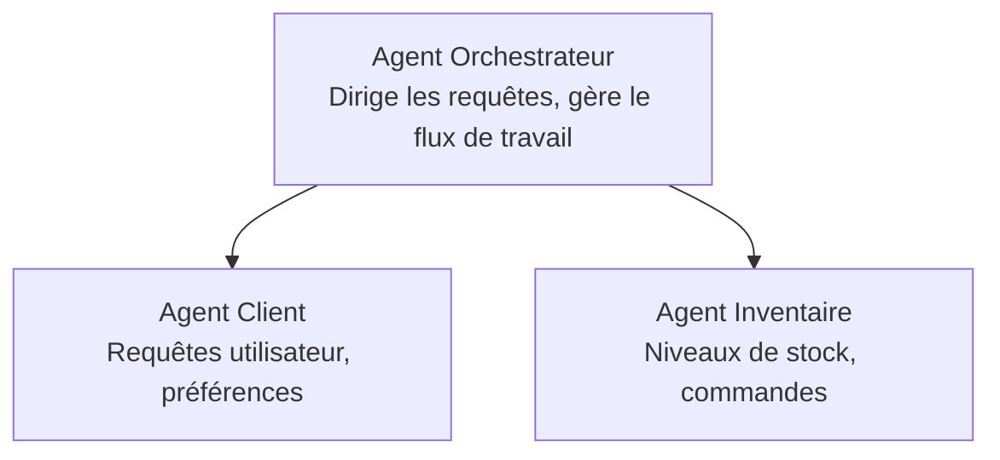

# Chapitre 5 : Solutions d'IA Multi-Agents

**📚 Cours** : [AZD pour débutants](../../README.md) | **⏱️ Durée** : 2-3 heures | **⭐ Complexité** : Avancé

---

## Aperçu

Ce chapitre couvre les modèles avancés d'architecture multi-agents, l'orchestration des agents et les déploiements d'IA prêts pour la production pour des scénarios complexes.

> Validé avec `azd 1.23.12` en mars 2026.

## Objectifs d'apprentissage

En terminant ce chapitre, vous allez :
- Comprendre les modèles d'architecture multi-agents
- Déployer des systèmes d'agents IA coordonnés
- Mettre en œuvre la communication agent-à-agent
- Construire des solutions multi-agents prêtes pour la production

---

## 📚 Leçons

| # | Leçon | Description | Durée |
|---|--------|-------------|-------|
| 1 | [Solution Multi-Agent Retail](../../examples/retail-scenario.md) | Parcours complet de mise en œuvre | 90 min |
| 2 | [Modèles de Coordination](../chapter-06-pre-deployment/coordination-patterns.md) | Stratégies d'orchestration des agents | 30 min |
| 3 | [Déploiement avec Template ARM](../../examples/retail-multiagent-arm-template/README.md) | Déploiement en un clic | 30 min |

---

## 🚀 Démarrage Rapide

```bash
# Option 1 : Déployer à partir d'un modèle
azd init --template agent-openai-python-prompty
azd up

# Option 2 : Déployer à partir d'un manifeste d'agent (nécessite l'extension azure.ai.agents)
azd extension install azure.ai.agents
azd ai agent init -m agent-manifest.yaml
azd up
```

> **Quelle approche ?** Utilisez `azd init --template` pour démarrer à partir d'un exemple fonctionnel. Utilisez `azd ai agent init` lorsque vous avez votre propre manifeste d'agent. Voir la [référence AZD AI CLI](../chapter-08-production/production-ai-practices.md#azd-ai-cli-commands-and-extensions) pour tous les détails.

---

## 🤖 Architecture Multi-Agents


---

## 🎯 Solution à la Une : Retail Multi-Agent

La [Solution Multi-Agent Retail](../../examples/retail-scenario.md) démontre :

- **Agent Client** : Gère les interactions utilisateur et les préférences
- **Agent Inventaire** : Gère les stocks et le traitement des commandes
- **Orchestrateur** : Coordonne entre les agents
- **Mémoire Partagée** : Gestion du contexte inter-agents

### Services Utilisés

| Service | But |
|---------|-----|
| Microsoft Foundry Models | Compréhension du langage |
| Azure AI Search | Catalogue de produits |
| Cosmos DB | État et mémoire des agents |
| Container Apps | Hébergement des agents |
| Application Insights | Supervision |

---

## 🔗 Navigation

| Direction | Chapitre |
|-----------|----------|
| **Précédent** | [Chapitre 4 : Infrastructure](../chapter-04-infrastructure/README.md) |
| **Suivant** | [Chapitre 6 : Pré-Déploiement](../chapter-06-pre-deployment/README.md) |

---

## 📖 Ressources Associées

- [Guide des Agents IA](../chapter-02-ai-development/agents.md)
- [Bonnes pratiques IA en production](../chapter-08-production/production-ai-practices.md)
- [Dépannage IA](../chapter-07-troubleshooting/ai-troubleshooting.md)

---

<!-- CO-OP TRANSLATOR DISCLAIMER START -->
**Avertissement** :  
Ce document a été traduit à l’aide du service de traduction automatique [Co-op Translator](https://github.com/Azure/co-op-translator). Bien que nous nous efforcions d'assurer l'exactitude, veuillez noter que les traductions automatiques peuvent contenir des erreurs ou des inexactitudes. Le document original dans sa langue native doit être considéré comme la source officielle. Pour les informations critiques, il est recommandé de recourir à une traduction professionnelle humaine. Nous déclinons toute responsabilité en cas de malentendus ou de mauvaises interprétations résultant de l’utilisation de cette traduction.
<!-- CO-OP TRANSLATOR DISCLAIMER END -->