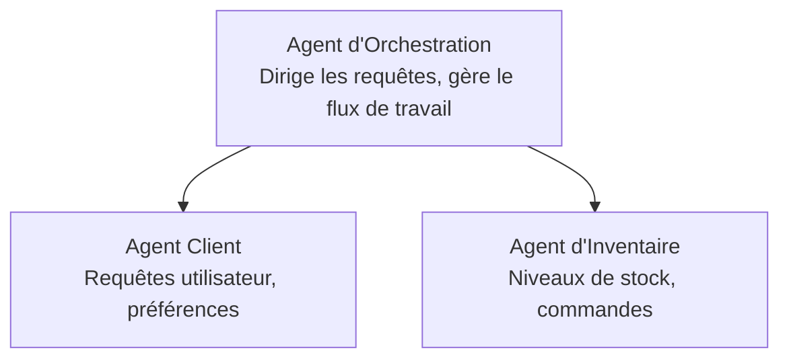

# Chapitre 5 : Solutions IA Multi-Agents

**📚 Cours** : [AZD Pour Débutants](../../README.md) | **⏱️ Durée** : 2-3 heures | **⭐ Complexité** : Avancé

---

## Aperçu

Ce chapitre couvre les modèles avancés d'architecture multi-agent, l'orchestration des agents, et les déploiements d'IA prêts pour la production dans des scénarios complexes.

> Validé avec `azd 1.27.1` en juillet 2026.

## Objectifs d'apprentissage

En complétant ce chapitre, vous allez :
- Comprendre les modèles d'architecture multi-agent
- Déployer des systèmes d'agents IA coordonnés
- Implémenter la communication agent-à-agent
- Construire des solutions multi-agents prêtes pour la production

---

## 📚 Leçons

| # | Leçon | Description | Durée |
|---|--------|-------------|-------|
| 1 | [Bases Multi-Agent](multi-agent-basics.md) | Pratique : déployez une application multi-agent fonctionnelle avec `azd up` | 45 min |
| 2 | [Modèles de Coordination](../chapter-06-pre-deployment/coordination-patterns.md) | Stratégies d'orchestration des agents (suite au Chapitre 6) | 30 min |
| 3 | [Déploiement du Template ARM](../../examples/retail-multiagent-arm-template/README.md) | Exemple de déploiement en un clic | 30 min |

> **Commencez par la Leçon 1.** C'est la seule leçon entièrement pratique et déployable de ce chapitre. La Leçon 2 se trouve au Chapitre 6 (partagée avec la planification pré-déploiement), et la [Solution Multi-Agent Retail](../../examples/retail-scenario.md) est une architecture de référence — une conception de modèle, pas un template à une commande.

---

## 🚀 Démarrage rapide

```bash
# Option 1 : Déployer à partir d'un modèle
azd init --template agent-openai-python-prompty
azd up

# Option 2 : Déployer à partir d'un manifeste d'agent (nécessite l'extension azure.ai.agents)
azd extension install azure.ai.agents
azd ai agent init -m agent-manifest.yaml
azd up
```

> **Quelle approche ?** Utilisez `azd init --template` pour démarrer à partir d'un exemple fonctionnel. Utilisez `azd ai agent init` lorsque vous avez votre propre manifeste d'agent. Consultez la [référence AZD AI CLI](../chapter-08-production/production-ai-practices.md#azd-ai-cli-commands-and-extensions) pour tous les détails.

---

## 🤖 Architecture Multi-Agent



---

## 🎯 Solution en vedette : Multi-Agent Retail

La [Solution Multi-Agent Retail](../../examples/retail-scenario.md) démontre :

- **Agent Client** : Gère les interactions utilisateur et les préférences
- **Agent Inventaire** : Gère le stock et le traitement des commandes
- **Orchestrateur** : Coordonne entre les agents
- **Mémoire Partagée** : Gestion du contexte entre agents

### Services utilisés

| Service | Objectif |
|---------|----------|
| Microsoft Foundry Models | Compréhension du langage |
| Azure AI Search | Catalogue produit |
| Cosmos DB | État et mémoire des agents |
| Container Apps | Hébergement des agents |
| Application Insights | Surveillance |

---

## 🔗 Navigation

| Direction | Chapitre |
|-----------|----------|
| **Précédent** | [Chapitre 4 : Infrastructure](../chapter-04-infrastructure/README.md) |
| **Suivant** | [Chapitre 6 : Pré-déploiement](../chapter-06-pre-deployment/README.md) |

---

## 📖 Ressources associées

- [Guide des Agents IA](../chapter-02-ai-development/agents.md)
- [Pratiques d'IA en Production](../chapter-08-production/production-ai-practices.md)
- [Dépannage IA](../chapter-07-troubleshooting/ai-troubleshooting.md)

---

<!-- CO-OP TRANSLATOR DISCLAIMER START -->
**Avertissement** :
Ce document a été traduit à l'aide du service de traduction automatique [Co-op Translator](https://github.com/Azure/co-op-translator). Bien que nous nous efforçions d'assurer l'exactitude, veuillez noter que les traductions automatisées peuvent contenir des erreurs ou des inexactitudes. Le document original dans sa langue native doit être considéré comme la source faisant autorité. Pour les informations critiques, il est recommandé de recourir à une traduction professionnelle réalisée par un humain. Nous ne saurions être tenus responsables des malentendus ou erreurs d'interprétation découlant de l'utilisation de cette traduction.
<!-- CO-OP TRANSLATOR DISCLAIMER END -->