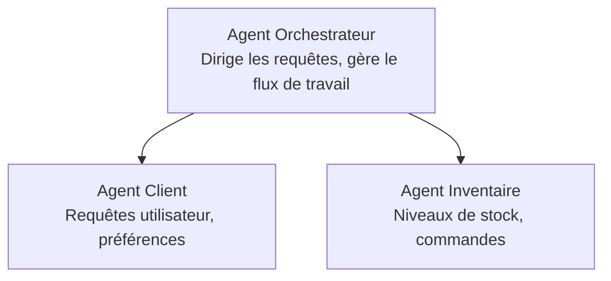

# Chapitre 5 : Solutions IA Multi-Agents

**📚 Cours** : [AZD Pour Débutants](../../README.md) | **⏱️ Durée** : 2-3 heures | **⭐ Complexité** : Avancé

---

## Vue d'ensemble

Ce chapitre couvre les modèles d'architecture multi-agents avancés, l'orchestration des agents et les déploiements IA prêts pour la production dans des scénarios complexes.

> Validé avec `azd 1.25.6` en juin 2026.

## Objectifs d'apprentissage

En terminant ce chapitre, vous allez :
- Comprendre les modèles d'architecture multi-agents
- Déployer des systèmes d’agents IA coordonnés
- Implémenter la communication entre agents
- Construire des solutions multi-agents prêtes pour la production

---

## 📚 Leçons

| # | Leçon | Description | Durée |
|---|--------|-------------|-------|
| 1 | [Bases du Multi-Agent](multi-agent-basics.md) | Pratique : déployer une application multi-agent fonctionnelle avec `azd up` | 45 min |
| 2 | [Modèles de Coordination](../chapter-06-pre-deployment/coordination-patterns.md) | Stratégies d'orchestration des agents (se poursuit au Chapitre 6) | 30 min |
| 3 | [Déploiement avec Template ARM](../../examples/retail-multiagent-arm-template/README.md) | Exemple de déploiement en un clic | 30 min |

> **Commencez par la Leçon 1.** C’est la seule leçon entièrement pratique et déployable de ce chapitre. La Leçon 2 se trouve dans le Chapitre 6 (elle est partagée avec la planification pré-déploiement), et la [Solution Multi-Agent Retail](../../examples/retail-scenario.md) est une référence d’architecture — un modèle de conception, pas un template exécutable en une commande.

---

## 🚀 Démarrage rapide

```bash
# Option 1 : Déployer à partir d'un modèle
azd init --template agent-openai-python-prompty
azd up

# Option 2 : Déployer à partir d'un manifeste d'agent (nécessite l'extension azure.ai.agents)
azd extension install azure.ai.agents
azd ai agent init -m agent-manifest.yaml
azd up
```

> **Quelle approche ?** Utilisez `azd init --template` pour démarrer à partir d’un exemple fonctionnel. Utilisez `azd ai agent init` lorsque vous avez votre propre manifeste d’agent. Consultez la [référence CLI AZD AI](../chapter-08-production/production-ai-practices.md#azd-ai-cli-commands-and-extensions) pour tous les détails.

---

## 🤖 Architecture Multi-Agent



---

## 🎯 Solution à l'honneur : Multi-Agent Retail

La [Solution Multi-Agent Retail](../../examples/retail-scenario.md) illustre :

- **Agent Client** : Gère les interactions utilisateur et les préférences
- **Agent Inventaire** : Gère les stocks et le traitement des commandes
- **Orchestrateur** : Coordonne les agents
- **Mémoire Partagée** : Gestion du contexte inter-agent

### Services Utilisés

| Service | Objectif |
|---------|----------|
| Microsoft Foundry Models | Compréhension du langage |
| Azure AI Search | Catalogue produit |
| Cosmos DB | État et mémoire des agents |
| Container Apps | Hébergement des agents |
| Application Insights | Supervision |

---

## 🔗 Navigation

| Direction | Chapitre |
|-----------|----------|
| **Précédent** | [Chapitre 4 : Infrastructure](../chapter-04-infrastructure/README.md) |
| **Suivant** | [Chapitre 6 : Pré-Déploiement](../chapter-06-pre-deployment/README.md) |

---

## 📖 Ressources associées

- [Guide Agents IA](../chapter-02-ai-development/agents.md)
- [Pratiques IA Production](../chapter-08-production/production-ai-practices.md)
- [Dépannage IA](../chapter-07-troubleshooting/ai-troubleshooting.md)

---

<!-- CO-OP TRANSLATOR DISCLAIMER START -->
**Avertissement** :
Ce document a été traduit à l'aide du service de traduction automatique [Co-op Translator](https://github.com/Azure/co-op-translator). Bien que nous nous efforçions d'assurer l'exactitude, veuillez noter que les traductions automatisées peuvent contenir des erreurs ou des inexactitudes. Le document original dans sa langue native doit être considéré comme la source faisant autorité. Pour les informations critiques, il est recommandé de recourir à une traduction professionnelle réalisée par un humain. Nous ne saurions être tenus responsables des malentendus ou erreurs d'interprétation découlant de l'utilisation de cette traduction.
<!-- CO-OP TRANSLATOR DISCLAIMER END -->