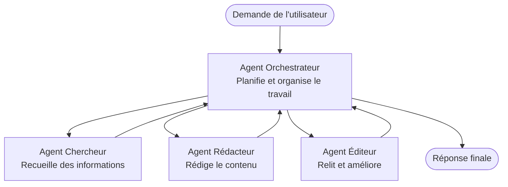

# Fondamentaux Multi-Agents - Déployez Votre Premier Système d'IA Coordonné

**Navigation du Chapitre :**
- **📚 Accueil du Cours** : [AZD Pour Débutants](../../README.md)
- **📖 Chapitre Actuel** : Chapitre 5 - Solutions IA Multi-Agents
- **⬅️ Précédent** : [Chapitre 4 : Infrastructure](../chapter-04-infrastructure/README.md)
- **➡️ Suivant** : [Modèles de Coordination](../chapter-06-pre-deployment/coordination-patterns.md)

> Validé avec `azd 1.27.1` en juillet 2026.

## Introduction

Dans les chapitres précédents, vous avez déployé une application unique — et dans le Chapitre 2 vous avez déployé un agent IA unique. Cette leçon franchit l'étape suivante : déployer un **système multi-agent**, où plusieurs agents spécialisés collaborent pour résoudre un problème qu’aucun agent seul ne pourrait bien gérer.

La bonne nouvelle pour les débutants : **vous n'avez pas besoin de nouvelles commandes.** Une solution multi-agent reste un projet azd. Vous allez `azd init`, `azd up`, tester, et `azd down` — exactement le même flux de travail que vous connaissez déjà. Ce qui change, c’est la *structure* de l’application à l’intérieur.

## Objectifs d'Apprentissage

À la fin de cette leçon, vous allez :
- Comprendre ce que signifie "multi-agent" et quand cela vaut la peine de complexifier
- Reconnaître les rôles communs dans un système multi-agent (orchestrateur + spécialistes)
- Déployer un modèle multi-agent réel et fonctionnel avec `azd up`
- Comprendre les ressources Azure qui soutiennent une application multi-agent
- Savoir comment vérifier, personnaliser et démanteler la solution en toute sécurité

## Résultats d'Apprentissage

Après avoir complété cette leçon, vous serez capable de :
- Expliquer la différence entre un agent unique et un système multi-agent
- Choisir entre un agent unique avec des outils et une vraie conception multi-agent
- Déployer et tester un modèle multi-agent de bout en bout avec azd
- Identifier où chaque agent s’exécute et comment ils communiquent
- Nettoyer toutes les ressources pour éviter des frais continus

---

## Qu'est-ce qu'un Système Multi-Agent ?

Un agent IA unique est un modèle avec un ensemble d’instructions et (optionnellement) quelques outils. Cela fonctionne bien pour des tâches ciblées. Mais à mesure qu’une tâche évolue — recherche, puis rédaction, puis relecture, puis vérification des faits — tout intégrer dans un seul prompt rend l'agent plus lent, moins fiable, et plus difficile à déboguer.

Un **système multi-agent** divise le travail en spécialistes qui font chacun bien un travail unique, coordonnés par un orchestrateur :



### Les deux rôles que vous verrez toujours

| Rôle | Travail | Exemple |
|------|---------|---------|
| **Orchestrateur** | Décide *ce qui suit* et répartit le travail entre agents | "D'abord rechercher, puis écrire, puis éditer" |
| **Spécialiste** | Accomplit un travail ciblé et retourne un résultat | Un "chercheur" qui ne collecte que des faits |

### Avez-vous vraiment besoin de plusieurs agents ?

Commencez simple. Utilisez le multi-agent **seulement** quand l’un des cas suivants est vrai :

- ✅ La tâche comporte des **étapes distinctes** qui bénéficient d’instructions différentes (recherche vs rédiger vs revoir)
- ✅ Vous voulez que les spécialistes travaillent **en parallèle** pour gagner du temps
- ✅ Les différentes étapes nécessitent **des outils ou sources de données différents**
- ✅ Vous avez besoin que chaque étape soit **testable et débogable indépendamment**

Si votre tâche est une simple question-réponse ou un simple appel d’outil, un **agent unique avec outils** (Chapitre 2) est plus simple, moins cher, et plus facile à exploiter.

> **Astuce pour débutants :** "Plus d’agents" ne veut pas dire "mieux." Chaque agent ajoute de la latence, un coût, et un nouvel élément à surveiller. Ajoutez des agents seulement quand le problème se divise clairement en parties.

---

## Deux Façons de Construire Multi-Agent sur Azure

| Approche | Qu’est-ce que c’est | Idéal pour |
|----------|-----------------|------------|
| **Agent unique + outils** | Un agent Foundry qui appelle fonctions/outils | Flux simples, débuter |
| **Agents multiples coordonnés** | Plusieurs agents avec orchestrateur | Étapes distinctes, travail parallèle, spécialisation |

Cette leçon se concentre sur la seconde approche avec un **modèle prêt à l’emploi**, pour que vous puissiez voir un vrai système multi-agent en fonctionnement avant de construire le vôtre.

---

## Pratique : Déployer une Application Multi-Agent Fonctionnelle

Nous allons déployer **Contoso Creative Writer**, un exemple officiel Azure qui utilise plusieurs agents (chercheur, écrivain, éditeur) coordonnés pour produire un article. C’est une excellente première application multi-agent parce que les rôles sont faciles à comprendre.

### Étape 1 : Initialisez le modèle

```bash
# Créer un dossier de travail
mkdir creative-writer && cd creative-writer

# Initialiser à partir du modèle multi-agent officiel
azd init --template contoso-creative-writer
```

> Parcourez plus de modèles multi-agents à tout moment dans la [galerie Awesome AZD AI](https://azure.github.io/awesome-azd/?tags=ai). D’autres options adaptées aux débutants incluent `get-started-with-ai-agents` et `azure-ai-travel-agents`.

### Étape 2 : Authentifiez-vous

```bash
# Requis pour les flux de travail azd
azd auth login
```

### Étape 3 : Créez un environnement

```bash
azd env new dev
```

### Étape 4 : Prévisualisez, puis déployez

```bash
# Voir ce qui sera créé avant de dépenser quoi que ce soit (recommandé)
azd provision --preview

# Provisionner l'infrastructure et déployer tous les agents en une seule étape
azd up
```

`azd up` vous demandera un abonnement et une région, puis provisionnera les ressources Azure et déploiera l’application. Les déploiements IA peuvent prendre plus de temps qu’une simple application web — si vous déployez des modèles plus grands, vous pouvez étendre le délai du déploiement :

```bash
azd deploy --timeout 1800
```

> **Attention au coût et à la capacité :** Les applications multi-agents déploient des modèles IA qui consomment des quotas et engendrent des coûts. Si `azd up` échoue à cause du quota de modèle, consultez [Dépannage IA](../chapter-07-troubleshooting/ai-troubleshooting.md) pour des solutions régionales et quotas, et le Chapitre 6 [Planification de la Capacité](../chapter-06-pre-deployment/capacity-planning.md).

---

## Comprendre ce que vous avez déployé

Une application multi-agent typique comme celle-ci provisionne un ensemble de ressources Azure qui correspondent directement aux responsabilités du diagramme ci-dessus :

| Ressource | Raison de sa présence |
|----------|----------------------|
| **Microsoft Foundry / Modèles** | Héberge les modèles de langage que chaque agent utilise |
| **Azure AI Search** | Offre des données documentées que l’agent chercheur peut interroger |
| **Applications en Conteneur** (ou App Service) | Héberge le code de l’orchestrateur et des agents |
| **Cosmos DB** (dans certains exemples) | Stocke l’état/mémoire partagée transmis entre agents |
| **Application Insights** | Suit les requêtes *à travers* les agents pour que vous puissiez déboguer le flux |

### Comment les agents communiquent entre eux

Dans la plupart des exemples multi-agents azd, **l’orchestrateur s’exécute dans votre code applicatif** (par exemple, en utilisant un framework comme Semantic Kernel ou Microsoft Agent Framework). L’orchestrateur appelle chaque agent spécialiste à son tour, transmet les résultats, et assemble la réponse finale. Les agents partagent le contexte via :

- **Appels de fonctions/outils** — l’orchestrateur invoque un spécialiste et reçoit un résultat
- **Mémoire partagée** — une base de données (souvent Cosmos DB) garde un état que les deux agents peuvent lire
- **Messages/événements** — pour un couplage plus lâche, les agents communiquent via une file d’attente ou Service Bus

> **Pourquoi c’est important pour le débogage :** parce que chaque étape est séparée, Application Insights vous montre *quel* agent a été lent ou a échoué. C’est une raison majeure de répartir le travail entre agents dès le départ.

---

## Vérifiez le Déploiement

Confirmez que le système fonctionne réellement avant de continuer :

```bash
# Afficher les points de terminaison déployés
azd show

# Ouvrir le tableau de bord de surveillance de l'application
azd monitor

# Suivre les journaux si quelque chose semble incorrect
azd monitor --logs
```

Ensuite, ouvrez l’URL de l’application depuis `azd show` et essayez une requête qui sollicite tous les agents (pour Creative Writer, demandez-lui de rédiger un court article sur un sujet). Dans la **recherche de transactions** Application Insights, vous devriez voir la requête se répartir à travers les étapes chercheur, écrivain, et éditeur.

**Critères de réussite :**
- ✅ `azd show` liste un point d’accès joignable
- ✅ Une requête produit un résultat qui est clairement passé par plusieurs étapes
- ✅ Application Insights affiche des traces pour plus d’une étape d’agent

---

## Personnalisez : Ajoutez ou Ajustez un Agent

Parce que chaque agent n’est que des instructions plus des outils, la personnalisation est accessible :

1. **Trouvez les définitions d’agents** dans le modèle (souvent un dossier `prompts/`, `agents/`, ou un ensemble de fichiers `*.prompty`).
2. **Ajustez les instructions d’un agent** — par exemple, dites à l’agent éditeur de respecter un ton ou un nombre de mots spécifique.
3. **Redéployez seulement le code** (l’infrastructure reste inchangée) :

   ```bash
   azd deploy
   ```

Pour aller plus loin et construire des agents à partir de votre *propre* manifeste, utilisez l’extension agent et son cycle complet de vie :

```bash
azd extension install azure.ai.agents
azd ai agent init -m agent-manifest.yaml
azd up
azd ai agent invoke      # test, avec le temps de réponse
```

Consultez [Chapitre 2 : Agents](../chapter-02-ai-development/agents.md) et la [référence AZD AI CLI](../chapter-08-production/production-ai-practices.md#azd-ai-cli-commands-and-extensions) pour le cycle complet (`invoke`, `eval generate`, `optimize`, `delete`).

---

## Nettoyage

Les applications multi-agents utilisent plusieurs services facturables. Démontez tout quand vous avez fini :

```bash
azd down --force --purge
```

Le flag `--purge` supprime aussi les ressources IA supprimées mollement (comme les comptes Foundry/Azure AI Services) pour qu’elles ne bloquent pas un futur redéploiement ou ne génèrent plus de coûts.

---

## Une Note sur les Systèmes Multi-Agents en Production

La [Solution Multi-Agent Retail](../../examples/retail-scenario.md) dans ce dépôt est un **plan d’architecture**, pas un modèle en une seule commande — elle documente comment un système retail de production *serait* construit (et précise qu’une construction complète est un effort important). Utilisez-la comme référence de conception *après* avoir déployé un exemple fonctionnel ici. Pour les préoccupations de production (résilience, coût, surveillance, gouvernance), continuez au [Chapitre 8 : Pratiques IA en Production](../chapter-08-production/production-ai-practices.md).

---

## Résumé

- Un système multi-agent répartit le travail entre spécialistes coordonnés par un orchestrateur.
- Utilisez-le seulement si la tâche a des étapes distinctes, du parallélisme, ou différents outils par étape — sinon, préférez un agent unique.
- Le flux azd ne change pas : `azd init` → `azd up` → test → `azd down`.
- Un modèle réel comme `contoso-creative-writer` vous permet de voir et personnaliser une application multi-agent fonctionnelle aujourd’hui.
- Le suivi Application Insights à travers les agents est l’un des plus grands bénéfices pratiques du design multi-agent.

---

## 🔗 Navigation

| Direction | Leçon |
|-----------|-------|
| **Précédent** | [Chapitre 4 : Infrastructure](../chapter-04-infrastructure/README.md) |
| **Suivant** | [Modèles de Coordination](../chapter-06-pre-deployment/coordination-patterns.md) |

## 📖 Ressources Associées

- [Guide des Agents IA](../chapter-02-ai-development/agents.md)
- [Modèles de Coordination](../chapter-06-pre-deployment/coordination-patterns.md)
- [Pratiques IA en Production](../chapter-08-production/production-ai-practices.md)
- [Dépannage IA](../chapter-07-troubleshooting/ai-troubleshooting.md)

---

<!-- CO-OP TRANSLATOR DISCLAIMER START -->
**Avertissement** :
Ce document a été traduit à l'aide du service de traduction automatique [Co-op Translator](https://github.com/Azure/co-op-translator). Bien que nous nous efforçions d'assurer l'exactitude, veuillez noter que les traductions automatisées peuvent contenir des erreurs ou des inexactitudes. Le document original dans sa langue native doit être considéré comme la source faisant autorité. Pour les informations critiques, il est recommandé de recourir à une traduction professionnelle réalisée par un humain. Nous ne saurions être tenus responsables des malentendus ou erreurs d'interprétation découlant de l'utilisation de cette traduction.
<!-- CO-OP TRANSLATOR DISCLAIMER END -->