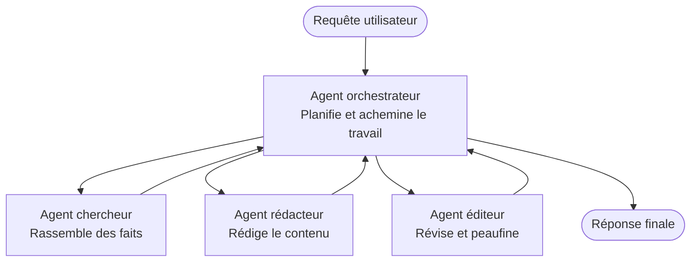

# Multi-Agent Basics - Deploy Your First Coordinated AI System

**Navigation du chapitre :**
- **📚 Accueil du cours**: [AZD For Beginners](../../README.md)
- **📖 Chapitre actuel**: Chapitre 5 - Solutions IA multi-agents
- **⬅️ Précédent**: [Chapter 4: Infrastructure](../chapter-04-infrastructure/README.md)
- **➡️ Suivant**: [Coordination Patterns](../chapter-06-pre-deployment/coordination-patterns.md)

> Validated against `azd 1.25.6` in June 2026.

## Introduction

Dans les chapitres précédents, vous avez déployé une seule application — et dans le Chapitre 2 vous avez déployé un seul agent IA. Cette leçon franchit l'étape suivante : déployer un **système multi-agent**, où plusieurs agents spécialisés collaborent pour résoudre un problème qu'un seul agent ne pourrait pas bien traiter seul.

La bonne nouvelle pour les débutants : **vous n'avez pas besoin de nouvelles commandes.** Une solution multi-agent reste un projet azd. Vous allez `azd init`, `azd up`, tester, et `azd down` — exactement le flux de travail que vous connaissez déjà. Ce qui change, c'est la *forme* de l'application à l'intérieur.

## Objectifs d'apprentissage

À la fin de cette leçon, vous serez capable de :
- Comprendre ce que signifie "multi-agent" et quand cela vaut la peine malgré la complexité supplémentaire
- Reconnaître les rôles courants dans un système multi-agent (orchestrateur + spécialistes)
- Déployer un modèle multi-agent réel et fonctionnel avec `azd up`
- Comprendre les ressources Azure qui sous-tendent une application multi-agent
- Savoir vérifier, personnaliser et démonter la solution en toute sécurité

## Résultats d'apprentissage

Après avoir terminé cette leçon, vous serez en mesure de :
- Expliquer la différence entre un agent unique et un système multi-agent
- Choisir entre un agent unique avec des outils et une vraie architecture multi-agent
- Déployer et tester de bout en bout un modèle multi-agent avec azd
- Identifier où chaque agent s'exécute et comment ils communiquent
- Nettoyer toutes les ressources pour éviter des frais récurrents

---

## Qu'est-ce qu'un système multi-agent ?

Un agent IA unique est un modèle avec un ensemble d'instructions et (optionnellement) quelques outils. Cela fonctionne bien pour des tâches ciblées. Mais à mesure qu'une tâche s'étend — recherche, puis rédaction, puis révision, puis vérification des faits — tout regrouper dans un seul prompt rend l'agent plus lent, moins fiable et plus difficile à déboguer.

Un **système multi-agent** divise le travail en spécialistes qui accomplissent chacun une tâche bien définie, coordonnés par un orchestrateur :



### Les deux rôles que vous verrez toujours

| Rôle | Tâche | Exemple |
|------|-------|---------|
| **Orchestrateur** | Décide *ce qui se passe ensuite* et achemine le travail entre les agents | « D'abord rechercher, puis rédiger, puis éditer » |
| **Spécialiste** | Effectue une tâche ciblée et renvoie un résultat | Un « chercheur » qui ne recueille que des faits |

### Avez-vous vraiment besoin de plusieurs agents ?

Commencez simple. Optez pour du multi-agent **uniquement** lorsque l'une de ces conditions est vraie :

- ✅ La tâche comporte **des étapes distinctes** qui bénéficient d'instructions différentes (recherche vs rédaction vs relecture)
- ✅ Vous voulez que des spécialistes s'exécutent **en parallèle** pour gagner du temps
- ✅ Différentes étapes nécessitent **des outils ou des sources de données différents**
- ✅ Vous avez besoin que chaque étape soit **testable et débogable indépendamment**

Si votre tâche est une simple question-réponse ou un appel d'outil simple, un **agent unique avec des outils** (Chapitre 2) est plus simple, moins coûteux et plus facile à exploiter.

> **Conseil pour débutants :** "Plus d'agents" n'est pas synonyme de "mieux". Chaque agent ajoute de la latence, du coût et une nouvelle chose à surveiller. Ajoutez des agents seulement lorsque le problème se divise clairement en parties.

---

## Deux façons de construire du multi-agent sur Azure

| Approche | Ce que c'est | Idéal pour |
|----------|--------------|-----------|
| **Agent unique + outils** | Un seul agent Foundry qui appelle des fonctions/outils | Flux de travail simples, prise en main |
| **Agents coordonnés multiples** | Plusieurs agents avec un orchestrateur | Étapes distinctes, travail parallèle, spécialisation |

Cette leçon se concentre sur la seconde approche en utilisant un **modèle prêt à l'emploi**, afin que vous puissiez voir un véritable système multi-agent en fonctionnement avant de construire le vôtre.

---

## Mise en pratique : déployer une application multi-agent fonctionnelle

Nous allons déployer **Contoso Creative Writer**, un exemple officiel Azure qui utilise plusieurs agents (chercheur, rédacteur, éditeur) coordonnés pour produire un article. C'est un excellent premier exemple multi-agent car les rôles sont faciles à comprendre.

### Étape 1 : Initialiser le modèle

```bash
# Créer un dossier de travail
mkdir creative-writer && cd creative-writer

# Initialiser à partir du modèle officiel multi-agent
azd init --template contoso-creative-writer
```

> Parcourez d'autres modèles multi-agent à tout moment dans la [Awesome AZD AI gallery](https://azure.github.io/awesome-azd/?tags=ai). D'autres options adaptées aux débutants incluent `get-started-with-ai-agents` et `azure-ai-travel-agents`.

### Étape 2 : S'authentifier

```bash
# Requis pour les workflows azd
azd auth login
```

### Étape 3 : Créer un environnement

```bash
azd env new dev
```

### Étape 4 : Prévisualiser, puis déployer

```bash
# Voir ce qui sera créé avant de dépenser quoi que ce soit (recommandé)
azd provision --preview

# Provisionner l'infrastructure et déployer tous les agents en une seule étape
azd up
```

`azd up` vous invitera à choisir un abonnement et une région, puis provisionnera les ressources Azure et déployera l'application. Les déploiements d'IA peuvent prendre plus de temps qu'une simple application web — si vous déployez des modèles plus volumineux, vous pouvez étendre le délai de déploiement :

```bash
azd deploy --timeout 1800
```

> **Attention aux coûts et à la capacité :** Les applications multi-agent déploient des modèles IA qui consomment du quota et engendrent des coûts. Si `azd up` échoue à cause du quota de modèles, consultez [AI Troubleshooting](../chapter-07-troubleshooting/ai-troubleshooting.md) pour des corrections de région et de quota, et le Chapitre 6 [Capacity Planning](../chapter-06-pre-deployment/capacity-planning.md).

---

## Comprendre ce que vous avez déployé

Une application multi-agent typique comme celle-ci provisionne un ensemble de ressources Azure qui correspondent directement aux responsabilités du schéma ci-dessus :

| Resource | Why it's there |
|----------|----------------|
| **Microsoft Foundry / Models** | Hosts the language models each agent uses |
| **Azure AI Search** | Gives the researcher agent grounded data to search |
| **Container Apps** (or App Service) | Hosts the orchestrator and agent code |
| **Cosmos DB** (in some samples) | Stores shared state/memory passed between agents |
| **Application Insights** | Traces requests *across* agents so you can debug the flow |

### Comment les agents communiquent entre eux

Dans la plupart des exemples azd multi-agent, l'**orchestrateur s'exécute dans votre code applicatif** (par exemple, en utilisant un framework comme Semantic Kernel ou le Microsoft Agent Framework). L'orchestrateur appelle chaque agent spécialiste à son tour, transmet les résultats et assemble la réponse finale. Les agents partagent le contexte via :

- **Appels de fonctions/outils** — l'orchestrateur invoque un spécialiste et reçoit un résultat
- **Mémoire partagée** — une base de données (souvent Cosmos DB) contient l'état que les agents peuvent lire
- **Messages/événements** — pour un couplage plus lâche, les agents communiquent via une file d'attente ou Service Bus

> **Pourquoi c'est important pour le débogage :** parce que chaque étape est séparée, Application Insights vous montre *quel* agent a été lent ou a échoué. C'est une raison majeure de répartir le travail entre plusieurs agents.

---

## Vérifier le déploiement

Confirmez que le système fonctionne réellement avant de continuer :

```bash
# Afficher les points de terminaison déployés
azd show

# Ouvrir le tableau de bord de surveillance de l'application
azd monitor

# Suivre les journaux si quelque chose semble anormal
azd monitor --logs
```

Ensuite, ouvrez l'URL de l'application fournie par `azd show` et effectuez une requête qui sollicite tous les agents (pour Creative Writer, demandez-lui d'écrire un court article sur un sujet). Dans la **recherche de transactions** d'Application Insights, vous devriez voir la requête se déployer à travers les étapes chercheur, rédacteur et éditeur.

**Critères de réussite :**
- ✅ `azd show` liste un point de terminaison accessible
- ✅ Une requête produit un résultat qui est clairement passé par plusieurs étapes
- ✅ Application Insights montre des traces pour plus d'une étape d'agent

---

## Personnaliser : Ajouter ou ajuster un agent

Parce que chaque agent n'est que des instructions plus des outils, la personnalisation est abordable :

1. **Trouvez les définitions d'agents** dans le modèle (souvent un ensemble de fichiers `prompts/`, `agents/`, ou `*.prompty`).
2. **Ajustez les instructions d'un agent** — par exemple, dites à l'agent éditeur d'appliquer un ton spécifique ou un nombre de mots.
3. **Redéployez uniquement le code** (l'infrastructure reste inchangée) :

   ```bash
   azd deploy
   ```

Pour aller plus loin et créer des agents à partir de votre *propre* manifeste, utilisez l'extension agent et son cycle de vie complet :

```bash
azd extension install azure.ai.agents
azd ai agent init -m agent-manifest.yaml
azd up
azd ai agent invoke      # test, avec mesure du temps de réponse
```

Voir [Chapter 2: Agents](../chapter-02-ai-development/agents.md) et la [AZD AI CLI reference](../chapter-08-production/production-ai-practices.md#azd-ai-cli-commands-and-extensions) pour le cycle de vie complet des agents (`invoke`, `eval generate`, `optimize`, `delete`).

---

## Nettoyage

Les applications multi-agent font fonctionner plusieurs services facturables. Détruisez tout lorsque vous avez terminé :

```bash
azd down --force --purge
```

L'option `--purge` supprime également les ressources IA en suppression douce (comme Foundry/Azure AI Services accounts) afin qu'elles ne bloquent pas un futur redéploiement ou ne continuent pas à générer des coûts.

---

## Remarque sur les systèmes multi-agents en production

La [Retail Multi-Agent Solution](../../examples/retail-scenario.md) de ce dépôt est un **plan d'architecture**, pas un modèle à exécuter en une commande — elle documente comment un système retail de production *serait* construit (et précise qu'une construction complète est un effort substantiel). Utilisez-la comme référence de conception *après* avoir déployé un échantillon fonctionnel ici. Pour les préoccupations de production (résilience, coût, surveillance, gouvernance), poursuivez avec le [Chapitre 8 : Pratiques d'IA en production](../chapter-08-production/production-ai-practices.md).

---

## Résumé

- Un système multi-agent répartit le travail entre des spécialistes coordonnés par un orchestrateur.
- Utilisez-le seulement lorsque la tâche comporte des étapes distinctes, du parallélisme ou des outils différents par étape — sinon, préférez un agent unique.
- Le flux azd reste inchangé : `azd init` → `azd up` → tester → `azd down`.
- Un modèle réel comme `contoso-creative-writer` vous permet de voir et de personnaliser une application multi-agent fonctionnelle dès aujourd'hui.
- Le traçage Application Insights à travers les agents est l'un des avantages pratiques les plus importants du design multi-agent.

---

## 🔗 Navigation

| Direction | Leçon |
|-----------|-------|
| **Précédent** | [Chapter 4: Infrastructure](../chapter-04-infrastructure/README.md) |
| **Suivant** | [Coordination Patterns](../chapter-06-pre-deployment/coordination-patterns.md) |

## 📖 Ressources associées

- [AI Agents Guide](../chapter-02-ai-development/agents.md)
- [Coordination Patterns](../chapter-06-pre-deployment/coordination-patterns.md)
- [Production AI Practices](../chapter-08-production/production-ai-practices.md)
- [AI Troubleshooting](../chapter-07-troubleshooting/ai-troubleshooting.md)

---

<!-- CO-OP TRANSLATOR DISCLAIMER START -->
**Avertissement** :
Ce document a été traduit à l'aide du service de traduction automatique [Co-op Translator](https://github.com/Azure/co-op-translator). Bien que nous nous efforçions d'assurer l'exactitude, veuillez noter que les traductions automatisées peuvent contenir des erreurs ou des inexactitudes. Le document original dans sa langue native doit être considéré comme la source faisant autorité. Pour les informations critiques, il est recommandé de recourir à une traduction professionnelle réalisée par un humain. Nous ne saurions être tenus responsables des malentendus ou erreurs d'interprétation découlant de l'utilisation de cette traduction.
<!-- CO-OP TRANSLATOR DISCLAIMER END -->