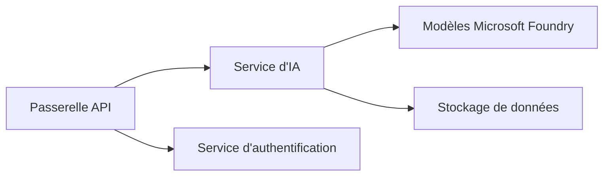
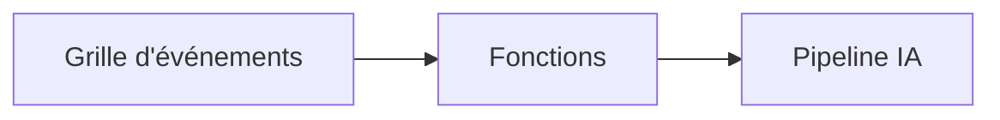

# Chapitre 8 : Modèles de production et d'entreprise

**📚 Cours**: [AZD For Beginners](../../README.md) | **⏱️ Durée**: 2-3 heures | **⭐ Complexité**: Avancé

---

## Aperçu

Ce chapitre couvre les modèles de déploiement prêts pour l'entreprise, le durcissement de la sécurité, la surveillance et l'optimisation des coûts pour les charges de travail IA en production.

## Objectifs d'apprentissage

En terminant ce chapitre, vous pourrez :
- Déployer des applications résilientes multi-régions
- Implémenter des modèles de sécurité d'entreprise
- Configurer une surveillance complète
- Optimiser les coûts à grande échelle
- Mettre en place des pipelines CI/CD avec AZD

---

## 📚 Leçons

| # | Leçon | Description | Durée |
|---|--------|-------------|------|
| 1 | [Pratiques d'IA en production](production-ai-practices.md) | Modèles de déploiement en entreprise | 90 min |

---

## 🚀 Liste de contrôle de production

- [ ] Déploiement multi-régions pour la résilience
- [ ] Identité gérée pour l'authentification (sans clés)
- [ ] Application Insights pour la surveillance
- [ ] Budgets de coûts et alertes configurés
- [ ] Analyse de sécurité activée
- [ ] Intégration de pipelines CI/CD
- [ ] Plan de reprise après sinistre

---

## 🏗️ Modèles d'architecture

### Modèle 1 : IA en microservices


### Modèle 2 : IA pilotée par les événements


---

## 🔐 Meilleures pratiques de sécurité

```bicep
// Use managed identity
identity: {
  type: 'SystemAssigned'
}

// Private endpoints for AI services
properties: {
  publicNetworkAccess: 'Disabled'
  networkAcls: {
    defaultAction: 'Deny'
  }
}
```

---

## 💰 Optimisation des coûts

| Stratégie | Économies |
|----------|---------|
| Mise à l'échelle à zéro (Container Apps) | 60-80% |
| Utiliser des niveaux de consommation pour l'environnement de dev | 50-70% |
| Mise à l'échelle programmée | 30-50% |
| Capacité réservée | 20-40% |

```bash
# Définir des alertes budgétaires
az consumption budget create \
  --budget-name "AI-Budget" \
  --amount 500 \
  --category Cost \
  --time-grain Monthly
```

---

## 📊 Configuration de la surveillance

```bash
# Afficher les journaux en continu
azd monitor --logs

# Consulter Application Insights
azd monitor

# Afficher les métriques
az monitor metrics list --resource <resource-id>
```

---

## 🔗 Navigation

| Direction | Chapitre |
|-----------|---------|
| **Précédent** | [Chapitre 7 : Dépannage](../chapter-07-troubleshooting/README.md) |
| **Cours terminé** | [Accueil du cours](../../README.md) |

---

## 📖 Ressources connexes

- [Guide des agents IA](../chapter-02-ai-development/agents.md)
- [Application Insights](../chapter-06-pre-deployment/application-insights.md)
- [Solutions multi-agents](../chapter-05-multi-agent/README.md)
- [Exemple de microservices](../../examples/microservices/README.md)

---

<!-- CO-OP TRANSLATOR DISCLAIMER START -->
Clause de non-responsabilité :
Ce document a été traduit à l'aide du service de traduction automatique Co-op Translator (https://github.com/Azure/co-op-translator). Bien que nous nous efforcions d'assurer l'exactitude, veuillez noter que les traductions automatisées peuvent contenir des erreurs ou des inexactitudes. Le document original dans sa langue d'origine doit être considéré comme la source faisant foi. Pour les informations critiques, il est recommandé de recourir à une traduction professionnelle réalisée par un traducteur humain. Nous déclinons toute responsabilité en cas de malentendus ou d'interprétations erronées résultant de l'utilisation de cette traduction.
<!-- CO-OP TRANSLATOR DISCLAIMER END -->