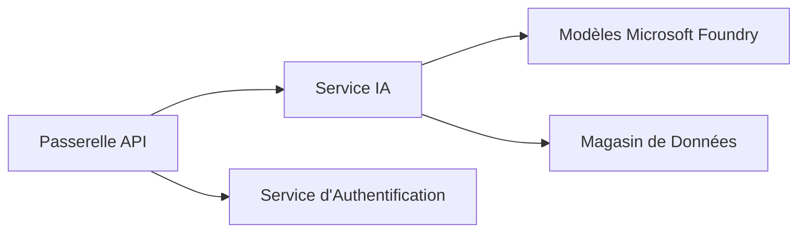
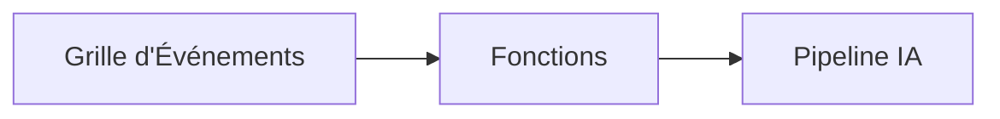

# Chapitre 8 : Modèles de Production et d’Entreprise

**📚 Cours** : [AZD Pour Débutants](../../README.md) | **⏱️ Durée** : 2-3 heures | **⭐ Complexité** : Avancé

---

## Aperçu

Ce chapitre couvre les modèles de déploiement prêts pour l’entreprise, le renforcement de la sécurité, la surveillance et l’optimisation des coûts pour les charges de travail IA en production.

> Validé avec `azd 1.23.12` en mars 2026.

## Objectifs d’apprentissage

En complétant ce chapitre, vous allez :
- Déployer des applications résilientes multi-régions
- Mettre en œuvre des modèles de sécurité pour l’entreprise
- Configurer une surveillance complète
- Optimiser les coûts à grande échelle
- Mettre en place des pipelines CI/CD avec AZD

---

## 📚 Leçons

| # | Leçon | Description | Durée |
|---|--------|-------------|-------|
| 1 | [Pratiques IA en Production](production-ai-practices.md) | Modèles de déploiement pour l’entreprise | 90 min |

---

## 🚀 Liste de Contrôle Production

- [ ] Déploiement multi-régions pour la résilience
- [ ] Identité managée pour l’authentification (sans clés)
- [ ] Application Insights pour la surveillance
- [ ] Budgets de coûts et alertes configurés
- [ ] Analyse de sécurité activée
- [ ] Intégration du pipeline CI/CD
- [ ] Plan de reprise après sinistre

---

## 🏗️ Modèles d’Architecture

### Modèle 1 : IA Microservices


### Modèle 2 : IA Événementielle


---

## 🔐 Meilleures Pratiques de Sécurité

```bicep
// Use managed identity
identity: {
  type: 'SystemAssigned'
}

// Private endpoints for AI services
properties: {
  publicNetworkAccess: 'Disabled'
  networkAcls: {
    defaultAction: 'Deny'
  }
}
```

---

## 💰 Optimisation des Coûts

| Stratégie | Économies |
|-----------|-----------|
| Mise à l’échelle à zéro (Container Apps) | 60-80 % |
| Utiliser les niveaux consommation pour dev | 50-70 % |
| Mise à l’échelle planifiée | 30-50 % |
| Capacité réservée | 20-40 % |

```bash
# Définir des alertes budgétaires
az consumption budget create \
  --budget-name "AI-Budget" \
  --amount 500 \
  --category Cost \
  --time-grain Monthly
```

---

## 📊 Configuration de la Surveillance

```bash
# Flux de journaux
azd monitor --logs

# Vérifier Application Insights
azd monitor --overview

# Voir les métriques
az monitor metrics list --resource <resource-id>
```

---

## 🔗 Navigation

| Direction | Chapitre |
|-----------|----------|
| **Précédent** | [Chapitre 7 : Dépannage](../chapter-07-troubleshooting/README.md) |
| **Cours Terminé** | [Accueil du Cours](../../README.md) |

---

## 📖 Ressources Associées

- [Guide des Agents IA](../chapter-02-ai-development/agents.md)
- [Application Insights](../chapter-06-pre-deployment/application-insights.md)
- [Solutions Multi-Agents](../chapter-05-multi-agent/README.md)
- [Exemple Microservices](../../examples/microservices/README.md)

---

<!-- CO-OP TRANSLATOR DISCLAIMER START -->
**Avertissement** :  
Ce document a été traduit à l’aide du service de traduction automatique [Co-op Translator](https://github.com/Azure/co-op-translator). Bien que nous fassions tout notre possible pour garantir l’exactitude, veuillez noter que les traductions automatisées peuvent contenir des erreurs ou des imprécisions. Le document original dans sa langue d’origine doit être considéré comme la source faisant foi. Pour les informations critiques, une traduction professionnelle réalisée par un humain est recommandée. Nous ne pouvons être tenus responsables des malentendus ou interprétations erronées résultant de l’utilisation de cette traduction.
<!-- CO-OP TRANSLATOR DISCLAIMER END -->