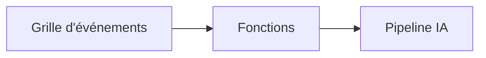

# Chapitre 8 : Modèles de Production & Entreprise

**📚 Cours** : [AZD Pour Débutants](../../README.md) | **⏱️ Durée** : 2-3 heures | **⭐ Complexité** : Avancé

---

## Aperçu

Ce chapitre couvre les modèles de déploiement prêts pour l'entreprise, le renforcement de la sécurité, la surveillance, et l'optimisation des coûts pour les charges de travail IA en production.

> Validé avec `azd 1.25.6` en juin 2026.

## Objectifs d'apprentissage

En terminant ce chapitre, vous serez capable de :
- Déployer des applications résilientes multi-régions
- Mettre en œuvre des modèles de sécurité d'entreprise
- Configurer une surveillance complète
- Optimiser les coûts à grande échelle
- Mettre en place des pipelines CI/CD avec AZD

---

## 📚 Leçons

| # | Leçon | Description | Durée |
|---|--------|-------------|-------|
| 1 | [Pratiques IA en production](production-ai-practices.md) | Modèles de déploiement en entreprise | 90 min |

---

## 🚀 Liste de contrôle pour la production

- [ ] Déploiement multi-régions pour la résilience
- [ ] Identité gérée pour l'authentification (pas de clés)
- [ ] Application Insights pour la surveillance
- [ ] Budgets et alertes de coûts configurés
- [ ] Analyse de sécurité activée
- [ ] Intégration du pipeline CI/CD
- [ ] Plan de reprise après sinistre

---

## 🏗️ Modèles d'architecture

### Modèle 1 : Microservices IA


### Modèle 2 : IA pilotée par événements



---

## 🔐 Meilleures pratiques de sécurité

```bicep
// Use managed identity
identity: {
  type: 'SystemAssigned'
}

// Private endpoints for AI services
properties: {
  publicNetworkAccess: 'Disabled'
  networkAcls: {
    defaultAction: 'Deny'
  }
}
```

---

## 💰 Optimisation des coûts

| Stratégie | Économies |
|----------|-----------|
| Passage à zéro (Container Apps) | 60-80 % |
| Utilisation des niveaux à la consommation pour le dev | 50-70 % |
| Mise à l'échelle programmée | 30-50 % |
| Capacité réservée | 20-40 % |

```bash
# Définir des alertes budgétaires
az consumption budget create \
  --budget-name "AI-Budget" \
  --amount 500 \
  --category Cost \
  --time-grain Monthly
```

---

## 📊 Configuration de la surveillance

```bash
# Diffuser les journaux
azd monitor --logs

# Vérifier Application Insights
azd monitor --overview

# Afficher les métriques
az monitor metrics list --resource <resource-id>
```

---

## 🔗 Navigation

| Direction | Chapitre |
|-----------|----------|
| **Précédent** | [Chapitre 7 : Dépannage](../chapter-07-troubleshooting/README.md) |
| **Cours terminé** | [Accueil du cours](../../README.md) |

---

## 📖 Ressources associées

- [Guide des agents IA](../chapter-02-ai-development/agents.md)
- [Application Insights](../chapter-06-pre-deployment/application-insights.md)
- [Solutions multi-agents](../chapter-05-multi-agent/README.md)
- [Exemple de microservices](../../examples/microservices/README.md)

---

<!-- CO-OP TRANSLATOR DISCLAIMER START -->
**Avertissement** :
Ce document a été traduit à l'aide du service de traduction automatique [Co-op Translator](https://github.com/Azure/co-op-translator). Bien que nous nous efforçions d'assurer l'exactitude, veuillez noter que les traductions automatisées peuvent contenir des erreurs ou des inexactitudes. Le document original dans sa langue native doit être considéré comme la source faisant autorité. Pour les informations critiques, il est recommandé de recourir à une traduction professionnelle réalisée par un humain. Nous ne saurions être tenus responsables des malentendus ou erreurs d'interprétation découlant de l'utilisation de cette traduction.
<!-- CO-OP TRANSLATOR DISCLAIMER END -->