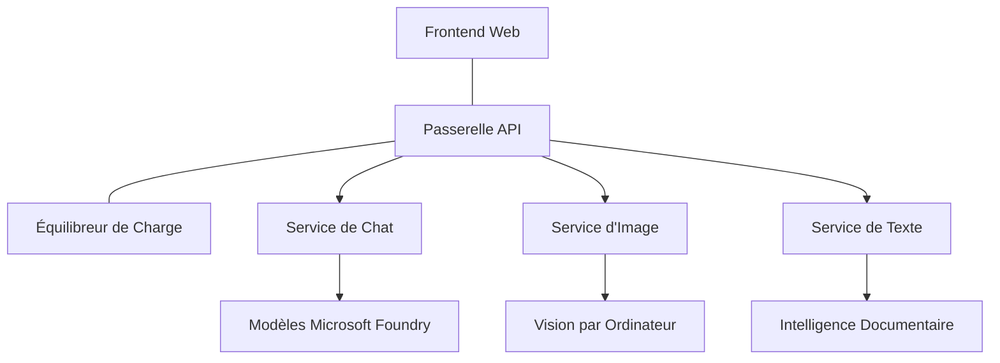

# Meilleures pratiques pour les charges de travail IA en production avec AZD

**Navigation du chapitre :**  
- **📚 Accueil du cours** : [AZD For Beginners](../../README.md)  
- **📖 Chapitre courant** : Chapitre 8 - Modèles de production et d’entreprise  
- **⬅️ Chapitre précédent** : [Chapitre 7 : Dépannage](../chapter-07-troubleshooting/debugging.md)  
- **⬅️ Aussi lié** : [AI Workshop Lab](ai-workshop-lab.md)  
- **🎯 Cours complet** : [AZD For Beginners](../../README.md)  

## Aperçu

Ce guide fournit des meilleures pratiques complètes pour déployer des charges de travail IA prêtes pour la production en utilisant Azure Developer CLI (AZD). Basé sur les retours de la communauté Microsoft Foundry Discord et des déploiements clients réels, ces pratiques adressent les défis les plus fréquents dans les systèmes IA en production.

## Principaux défis abordés

D’après les résultats de notre sondage communautaire, voici les principaux défis rencontrés par les développeurs :

- **45 %** rencontrent des difficultés avec les déploiements AI multi-services  
- **38 %** ont des problèmes avec la gestion des identifiants et des secrets  
- **35 %** trouvent la préparation à la production et la mise à l’échelle difficiles  
- **32 %** ont besoin de meilleures stratégies d’optimisation des coûts  
- **29 %** exigent une surveillance et un dépannage améliorés  

## Modèles d’architecture pour l'IA en production

### Modèle 1 : Architecture IA en microservices

**Quand l’utiliser** : Applications IA complexes avec plusieurs capacités


**Implémentation AZD** :

```yaml
# azure.yaml
name: enterprise-ai-platform
services:
  web:
    project: ./web
    host: staticwebapp
  api-gateway:
    project: ./api-gateway
    host: containerapp
  chat-service:
    project: ./services/chat
    host: containerapp
  vision-service:
    project: ./services/vision
    host: containerapp
  text-service:
    project: ./services/text
    host: containerapp
```
  
### Modèle 2 : Traitement IA basé sur les événements

**Quand l’utiliser** : Traitement par lots, analyse de documents, workflows asynchrones

```bicep
// Event Hub for AI processing pipeline
resource eventHub 'Microsoft.EventHub/namespaces@2023-01-01-preview' = {
  name: eventHubNamespaceName
  location: location
  sku: {
    name: 'Standard'
    tier: 'Standard'
    capacity: 1
  }
}

// Service Bus for reliable message processing
resource serviceBus 'Microsoft.ServiceBus/namespaces@2022-10-01-preview' = {
  name: serviceBusNamespaceName
  location: location
  sku: {
    name: 'Premium'
    tier: 'Premium'
    capacity: 1
  }
}

// Function App for processing
resource functionApp 'Microsoft.Web/sites@2023-01-01' = {
  name: functionAppName
  location: location
  kind: 'functionapp,linux'
  properties: {
    siteConfig: {
      appSettings: [
        {
          name: 'FUNCTIONS_EXTENSION_VERSION'
          value: '~4'
        }
        {
          name: 'AZURE_OPENAI_ENDPOINT'
          value: '@Microsoft.KeyVault(VaultName=${keyVault.name};SecretName=openai-endpoint)'
        }
      ]
    }
  }
}
```
  
## Réflexions sur la santé des agents IA

Lorsqu’une application web classique tombe en panne, les symptômes sont familiers : une page ne se charge pas, une API renvoie une erreur, ou un déploiement échoue. Les applications alimentées par IA peuvent tomber en panne de ces mêmes manières — mais elles peuvent aussi mal fonctionner de façon plus subtile, sans générer de messages d’erreur évidents.

Cette section vous aide à construire une représentation mentale pour la surveillance des charges de travail IA afin de savoir où chercher lorsque les choses semblent anormales.

### En quoi la santé de l’agent diffère-t-elle de celle d’une application traditionnelle ?

Une application traditionnelle fonctionne ou non. Un agent IA peut sembler fonctionner mais produire de mauvais résultats. Considérez la santé de l’agent en deux couches :

| Couche | Ce qu’il faut surveiller | Où regarder |
|--------|--------------------------|-------------|
| **Santé de l’infrastructure** | Le service est-il en fonctionnement ? Les ressources sont-elles provisionnées ? Les points de terminaison sont-ils accessibles ? | `azd monitor`, santé des ressources dans le portail Azure, journaux de conteneur/application |
| **Santé comportementale** | L’agent répond-il avec précision ? Les réponses sont-elles rapides ? Le modèle est-il appelé correctement ? | Traces Application Insights, métriques de latence des appels au modèle, journaux de qualité des réponses |

La santé de l'infrastructure est familière — c’est la même pour toute application azd. La santé comportementale est la nouvelle couche que les charges IA introduisent.

### Où regarder lorsque les applications IA ne se comportent pas comme prévu

Si votre application IA ne produit pas les résultats attendus, voici une liste conceptuelle :

1. **Commencez par les bases.** L’application fonctionne-t-elle ? Peut-elle atteindre ses dépendances ? Vérifiez `azd monitor` et la santé des ressources comme pour toute application.  
2. **Vérifiez la connexion au modèle.** Votre application appelle-t-elle correctement le modèle IA ? Les appels échoués ou expirés au modèle sont la cause la plus courante de problèmes et apparaîtront dans vos journaux d’application.  
3. **Examinez ce que le modèle a reçu.** Les réponses IA dépendent de l’entrée (le prompt et tout contexte récupéré). Si la sortie est incorrecte, l’entrée est généralement erronée. Vérifiez si votre application envoie les bonnes données au modèle.  
4. **Passez en revue la latence des réponses.** Les appels aux modèles IA sont plus lents que les appels API classiques. Si votre application semble lente, vérifiez si les temps de réponse aux modèles ont augmenté — cela peut indiquer un throttling, des limites de capacité ou une congestion au niveau régional.  
5. **Surveillez les signaux de coût.** Des pics inattendus d’utilisation de tokens ou d’appels API peuvent indiquer une boucle, un prompt mal configuré ou des tentatives excessives.

Vous n’avez pas besoin de maîtriser immédiatement les outils d’observabilité. L’essentiel est que les applications IA ont une couche supplémentaire de comportement à surveiller, et la surveillance intégrée d’azd (`azd monitor`) vous donne un point de départ pour enquêter sur les deux couches.

---

## Meilleures pratiques de sécurité

### 1. Modèle de sécurité Zero-Trust

**Stratégie d’implémentation** :  
- Aucune communication service-à-service sans authentification  
- Tous les appels API utilisent des identités managées  
- Isolation réseau avec points de terminaison privés  
- Contrôles d’accès au moindre privilège  

```bicep
// Managed Identity for each service
resource chatServiceIdentity 'Microsoft.ManagedIdentity/userAssignedIdentities@2023-01-31' = {
  name: 'chat-service-identity'
  location: location
}

// Role assignments with minimal permissions
resource openAIUserRole 'Microsoft.Authorization/roleAssignments@2022-04-01' = {
  scope: openAIAccount
  name: guid(openAIAccount.id, chatServiceIdentity.id, openAIUserRoleDefinitionId)
  properties: {
    roleDefinitionId: subscriptionResourceId('Microsoft.Authorization/roleDefinitions', '5e0bd9bd-7b93-4f28-af87-19fc36ad61bd')
    principalId: chatServiceIdentity.properties.principalId
    principalType: 'ServicePrincipal'
  }
}
```
  
### 2. Gestion sécurisée des secrets

**Modèle d’intégration Key Vault** :

```bicep
// Key Vault with proper access policies
resource keyVault 'Microsoft.KeyVault/vaults@2023-02-01' = {
  name: keyVaultName
  location: location
  properties: {
    tenantId: tenant().tenantId
    sku: {
      family: 'A'
      name: 'premium'  // Use premium for production
    }
    enableRbacAuthorization: true  // Use RBAC instead of access policies
    enablePurgeProtection: true    // Prevent accidental deletion
    enableSoftDelete: true
    softDeleteRetentionInDays: 90
  }
}

// Store all AI service credentials
resource openAIKeySecret 'Microsoft.KeyVault/vaults/secrets@2023-02-01' = {
  parent: keyVault
  name: 'openai-api-key'
  properties: {
    value: openAIAccount.listKeys().key1
    attributes: {
      enabled: true
    }
  }
}
```
  
### 3. Sécurité réseau

**Configuration de points de terminaison privés** :

```bicep
// Virtual Network for AI services
resource virtualNetwork 'Microsoft.Network/virtualNetworks@2023-04-01' = {
  name: vnetName
  location: location
  properties: {
    addressSpace: {
      addressPrefixes: ['10.0.0.0/16']
    }
    subnets: [
      {
        name: 'ai-services-subnet'
        properties: {
          addressPrefix: '10.0.1.0/24'
          privateEndpointNetworkPolicies: 'Disabled'
        }
      }
      {
        name: 'app-services-subnet'
        properties: {
          addressPrefix: '10.0.2.0/24'
          delegations: [
            {
              name: 'Microsoft.Web/serverFarms'
              properties: {
                serviceName: 'Microsoft.Web/serverFarms'
              }
            }
          ]
        }
      }
    ]
  }
}

// Private endpoints for all AI services
resource openAIPrivateEndpoint 'Microsoft.Network/privateEndpoints@2023-04-01' = {
  name: '${openAIAccountName}-pe'
  location: location
  properties: {
    subnet: {
      id: virtualNetwork.properties.subnets[0].id
    }
    privateLinkServiceConnections: [
      {
        name: 'openai-connection'
        properties: {
          privateLinkServiceId: openAIAccount.id
          groupIds: ['account']
        }
      }
    ]
  }
}
```
  
## Performance et mise à l’échelle

### 1. Stratégies d’auto-scaling

**Auto-scaling des applications conteneur** :

```bicep
resource containerApp 'Microsoft.App/containerApps@2023-05-01' = {
  name: containerAppName
  location: location
  properties: {
    configuration: {
      ingress: {
        external: true
        targetPort: 8000
        transport: 'http'
      }
    }
    template: {
      scale: {
        minReplicas: 2  // Always have 2 instances minimum
        maxReplicas: 50 // Scale up to 50 for high load
        rules: [
          {
            name: 'http-scaling'
            http: {
              metadata: {
                concurrentRequests: '20'  // Scale when >20 concurrent requests
              }
            }
          }
          {
            name: 'cpu-scaling'
            custom: {
              type: 'cpu'
              metadata: {
                type: 'Utilization'
                value: '70'  // Scale when CPU >70%
              }
            }
          }
        ]
      }
    }
  }
}
```
  
### 2. Stratégies de mise en cache

**Cache Redis pour les réponses IA** :

```bicep
// Redis Premium for production workloads
resource redisCache 'Microsoft.Cache/redis@2023-04-01' = {
  name: redisCacheName
  location: location
  properties: {
    sku: {
      name: 'Premium'
      family: 'P'
      capacity: 1
    }
    enableNonSslPort: false
    minimumTlsVersion: '1.2'
    redisConfiguration: {
      'maxmemory-policy': 'allkeys-lru'
    }
    // Enable clustering for high availability
    redisVersion: '6.0'
    shardCount: 2
  }
}

// Cache configuration in application
var cacheConnectionString = '${redisCache.properties.hostName}:6380,password=${redisCache.listKeys().primaryKey},ssl=True,abortConnect=False'
```
  
### 3. Équilibrage de charge et gestion du trafic

**Application Gateway avec WAF** :

```bicep
// Application Gateway with Web Application Firewall
resource applicationGateway 'Microsoft.Network/applicationGateways@2023-04-01' = {
  name: appGatewayName
  location: location
  properties: {
    sku: {
      name: 'WAF_v2'
      tier: 'WAF_v2'
      capacity: 2
    }
    webApplicationFirewallConfiguration: {
      enabled: true
      firewallMode: 'Prevention'
      ruleSetType: 'OWASP'
      ruleSetVersion: '3.2'
    }
    // Backend pools for AI services
    backendAddressPools: [
      {
        name: 'ai-services-pool'
        properties: {
          backendAddresses: [
            {
              fqdn: '${containerApp.properties.configuration.ingress.fqdn}'
            }
          ]
        }
      }
    ]
  }
}
```
  
## 💰 Optimisation des coûts

### 1. Dimensionnement des ressources adapté

**Configurations spécifiques à l’environnement** :

```bash
# Environnement de développement
azd env new development
azd env set AZURE_OPENAI_SKU "S0"
azd env set AZURE_OPENAI_CAPACITY 10
azd env set AZURE_SEARCH_SKU "basic"
azd env set CONTAINER_CPU 0.5
azd env set CONTAINER_MEMORY 1.0

# Environnement de production
azd env new production
azd env set AZURE_OPENAI_SKU "S0"
azd env set AZURE_OPENAI_CAPACITY 100
azd env set AZURE_SEARCH_SKU "standard"
azd env set CONTAINER_CPU 2.0
azd env set CONTAINER_MEMORY 4.0
```
  
### 2. Surveillance des coûts et budgets

```bicep
// Cost management and budgets
resource budget 'Microsoft.Consumption/budgets@2023-05-01' = {
  name: 'ai-workload-budget'
  properties: {
    timePeriod: {
      startDate: '2024-01-01'
      endDate: '2024-12-31'
    }
    timeGrain: 'Monthly'
    amount: 2000  // $2000 monthly budget
    category: 'Cost'
    notifications: {
      warning: {
        enabled: true
        operator: 'GreaterThan'
        threshold: 80
        contactEmails: [
          'finance@company.com'
          'engineering@company.com'
        ]
        contactRoles: [
          'Owner'
          'Contributor'
        ]
      }
      critical: {
        enabled: true
        operator: 'GreaterThan'
        threshold: 95
        contactEmails: [
          'cto@company.com'
        ]
      }
    }
  }
}
```
  
### 3. Optimisation de l’utilisation des tokens

**Gestion des coûts OpenAI** :

```typescript
// Optimisation des tokens au niveau de l'application
class TokenOptimizer {
  private readonly maxTokens = 4000;
  private readonly reserveTokens = 500;
  
  optimizePrompt(userInput: string, context: string): string {
    const availableTokens = this.maxTokens - this.reserveTokens;
    const estimatedTokens = this.estimateTokens(userInput + context);
    
    if (estimatedTokens > availableTokens) {
      // Tronquer le contexte, pas la saisie utilisateur
      context = this.truncateContext(context, availableTokens - this.estimateTokens(userInput));
    }
    
    return `${context}\n\nUser: ${userInput}`;
  }
  
  private estimateTokens(text: string): number {
    // Estimation approximative : 1 token ≈ 4 caractères
    return Math.ceil(text.length / 4);
  }
}
```
  
## Surveillance et observabilité

### 1. Application Insights complet

```bicep
// Application Insights with advanced features
resource applicationInsights 'Microsoft.Insights/components@2020-02-02' = {
  name: applicationInsightsName
  location: location
  kind: 'web'
  properties: {
    Application_Type: 'web'
    WorkspaceResourceId: logAnalyticsWorkspace.id
    SamplingPercentage: 100  // Full sampling for AI apps
    DisableIpMasking: false  // Enable for security
  }
}

// Custom metrics for AI operations
resource aiMetricAlerts 'Microsoft.Insights/metricAlerts@2018-03-01' = {
  name: 'ai-high-error-rate'
  location: 'global'
  properties: {
    description: 'Alert when AI service error rate is high'
    severity: 2
    enabled: true
    scopes: [
      applicationInsights.id
    ]
    evaluationFrequency: 'PT1M'
    windowSize: 'PT5M'
    criteria: {
      'odata.type': 'Microsoft.Azure.Monitor.SingleResourceMultipleMetricCriteria'
      allOf: [
        {
          name: 'high-error-rate'
          metricName: 'requests/failed'
          operator: 'GreaterThan'
          threshold: 10
          timeAggregation: 'Count'
        }
      ]
    }
  }
}
```
  
### 2. Surveillance spécifique IA

**Tableaux de bord personnalisés pour les métriques IA** :

```json
// Dashboard configuration for AI workloads
{
  "dashboard": {
    "name": "AI Application Monitoring",
    "tiles": [
      {
        "name": "OpenAI Request Volume",
        "query": "requests | where name contains 'openai' | summarize count() by bin(timestamp, 5m)"
      },
      {
        "name": "AI Response Latency",
        "query": "requests | where name contains 'openai' | summarize avg(duration) by bin(timestamp, 5m)"
      },
      {
        "name": "Token Usage",
        "query": "customMetrics | where name == 'openai_tokens_used' | summarize sum(value) by bin(timestamp, 1h)"
      },
      {
        "name": "Cost per Hour",
        "query": "customMetrics | where name == 'openai_cost' | summarize sum(value) by bin(timestamp, 1h)"
      }
    ]
  }
}
```
  
### 3. Contrôles de santé et surveillance de la disponibilité

```bicep
// Application Insights availability tests
resource availabilityTest 'Microsoft.Insights/webtests@2022-06-15' = {
  name: 'ai-app-availability-test'
  location: location
  tags: {
    'hidden-link:${applicationInsights.id}': 'Resource'
  }
  properties: {
    SyntheticMonitorId: 'ai-app-availability-test'
    Name: 'AI Application Availability Test'
    Description: 'Tests AI application endpoints'
    Enabled: true
    Frequency: 300  // 5 minutes
    Timeout: 120    // 2 minutes
    Kind: 'ping'
    Locations: [
      {
        Id: 'us-east-2-azr'
      }
      {
        Id: 'us-west-2-azr'
      }
    ]
    Configuration: {
      WebTest: '''
        <WebTest Name="AI Health Check" 
                 Id="8d2de8d2-a2b0-4c2e-9a0d-8f9c9a0b8c8d" 
                 Enabled="True" 
                 CssProjectStructure="" 
                 CssIteration="" 
                 Timeout="120" 
                 WorkItemIds="" 
                 xmlns="http://microsoft.com/schemas/VisualStudio/TeamTest/2010" 
                 Description="" 
                 CredentialUserName="" 
                 CredentialPassword="" 
                 PreAuthenticate="True" 
                 Proxy="default" 
                 StopOnError="False" 
                 RecordedResultFile="" 
                 ResultsLocale="">
          <Items>
            <Request Method="GET" 
                     Guid="a5f10126-e4cd-570d-961c-cea43999a200" 
                     Version="1.1" 
                     Url="${webApp.properties.defaultHostName}/health" 
                     ThinkTime="0" 
                     Timeout="120" 
                     ParseDependentRequests="True" 
                     FollowRedirects="True" 
                     RecordResult="True" 
                     Cache="False" 
                     ResponseTimeGoal="0" 
                     Encoding="utf-8" 
                     ExpectedHttpStatusCode="200" 
                     ExpectedResponseUrl="" 
                     ReportingName="" 
                     IgnoreHttpStatusCode="False" />
          </Items>
        </WebTest>
      '''
    }
  }
}
```
  
## Reprise après sinistre et haute disponibilité

### 1. Déploiement multi-régions

```yaml
# azure.yaml - Multi-region configuration
name: ai-app-multiregion
services:
  api-primary:
    project: ./api
    host: containerapp
    env:
      - AZURE_REGION=eastus
  api-secondary:
    project: ./api
    host: containerapp
    env:
      - AZURE_REGION=westus2
```
  
```bicep
// Traffic Manager for global load balancing
resource trafficManager 'Microsoft.Network/trafficManagerProfiles@2022-04-01' = {
  name: trafficManagerProfileName
  location: 'global'
  properties: {
    profileStatus: 'Enabled'
    trafficRoutingMethod: 'Priority'
    dnsConfig: {
      relativeName: trafficManagerProfileName
      ttl: 30
    }
    monitorConfig: {
      protocol: 'HTTPS'
      port: 443
      path: '/health'
      intervalInSeconds: 30
      toleratedNumberOfFailures: 3
      timeoutInSeconds: 10
    }
    endpoints: [
      {
        name: 'primary-endpoint'
        type: 'Microsoft.Network/trafficManagerProfiles/azureEndpoints'
        properties: {
          targetResourceId: primaryAppService.id
          endpointStatus: 'Enabled'
          priority: 1
        }
      }
      {
        name: 'secondary-endpoint'
        type: 'Microsoft.Network/trafficManagerProfiles/azureEndpoints'
        properties: {
          targetResourceId: secondaryAppService.id
          endpointStatus: 'Enabled'
          priority: 2
        }
      }
    ]
  }
}
```
  
### 2. Sauvegarde et restauration des données

```bicep
// Backup configuration for critical data
resource backupVault 'Microsoft.DataProtection/backupVaults@2023-05-01' = {
  name: backupVaultName
  location: location
  identity: {
    type: 'SystemAssigned'
  }
  properties: {
    storageSettings: [
      {
        datastoreType: 'VaultStore'
        type: 'LocallyRedundant'
      }
    ]
  }
}

// Backup policy for AI models and data
resource backupPolicy 'Microsoft.DataProtection/backupVaults/backupPolicies@2023-05-01' = {
  parent: backupVault
  name: 'ai-data-backup-policy'
  properties: {
    policyRules: [
      {
        backupParameters: {
          backupType: 'Full'
          objectType: 'AzureBackupParams'
        }
        trigger: {
          schedule: {
            repeatingTimeIntervals: [
              'R/2024-01-01T02:00:00+00:00/P1D'  // Daily at 2 AM
            ]
          }
          objectType: 'ScheduleBasedTriggerContext'
        }
        dataStore: {
          datastoreType: 'VaultStore'
          objectType: 'DataStoreInfoBase'
        }
        name: 'BackupDaily'
        objectType: 'AzureBackupRule'
      }
    ]
  }
}
```
  
## Intégration DevOps et CI/CD

### 1. Workflow GitHub Actions

```yaml
# .github/workflows/deploy-ai-app.yml
name: Deploy AI Application

on:
  push:
    branches: [main]
  pull_request:
    branches: [main]

jobs:
  test:
    runs-on: ubuntu-latest
    steps:
      - uses: actions/checkout@v4
      
      - name: Setup Python
        uses: actions/setup-python@v4
        with:
          python-version: '3.11'
          
      - name: Install dependencies
        run: |
          pip install -r requirements.txt
          pip install pytest
          
      - name: Run tests
        run: pytest tests/
        
      - name: AI Safety Tests
        run: |
          python scripts/test_ai_safety.py
          python scripts/validate_prompts.py

  deploy-staging:
    needs: test
    if: github.event_name == 'pull_request'
    runs-on: ubuntu-latest
    steps:
      - uses: actions/checkout@v4
      
      - name: Setup AZD
        uses: Azure/setup-azd@v2
        
      - name: Login to Azure
        uses: azure/login@v1
        with:
          creds: ${{ secrets.AZURE_CREDENTIALS }}
          
      - name: Deploy to Staging
        run: |
          azd env select staging
          azd deploy

  deploy-production:
    needs: test
    if: github.ref == 'refs/heads/main'
    runs-on: ubuntu-latest
    steps:
      - uses: actions/checkout@v4
      
      - name: Setup AZD
        uses: Azure/setup-azd@v2
        
      - name: Login to Azure
        uses: azure/login@v1
        with:
          creds: ${{ secrets.AZURE_CREDENTIALS }}
          
      - name: Deploy to Production
        run: |
          azd env select production
          azd deploy
          
      - name: Run Production Health Checks
        run: |
          python scripts/health_check.py --env production
```
  
### 2. Validation de l’infrastructure

```bash
# scripts/validate_infrastructure.sh
#!/bin/bash

echo "Validating AI infrastructure deployment..."

# Vérifier si tous les services requis fonctionnent
services=("openai" "search" "storage" "keyvault")
for service in "${services[@]}"; do
    echo "Checking $service..."
    if ! az resource list --resource-type "Microsoft.CognitiveServices/accounts" --query "[?contains(name, '$service')]" -o tsv; then
        echo "ERROR: $service not found"
        exit 1
    fi
done

# Valider les déploiements des modèles OpenAI
echo "Validating OpenAI model deployments..."
models=$(az cognitiveservices account deployment list --name $AZURE_OPENAI_NAME --resource-group $AZURE_RESOURCE_GROUP --query "[].name" -o tsv)
if [[ ! $models == *"gpt-4.1-mini"* ]]; then
  echo "ERROR: Required model gpt-4.1-mini not deployed"
    exit 1
fi

# Tester la connectivité du service IA
echo "Testing AI service connectivity..."
python scripts/test_connectivity.py

echo "Infrastructure validation completed successfully!"
```
  
## Liste de contrôle pour la préparation à la production

### Sécurité ✅  
- [ ] Tous les services utilisent des identités managées  
- [ ] Secrets stockés dans Key Vault  
- [ ] Points de terminaison privés configurés  
- [ ] Groupes de sécurité réseau appliqués  
- [ ] RBAC avec le moindre privilège  
- [ ] WAF activé sur les points publics  

### Performance ✅  
- [ ] Auto-scaling configuré  
- [ ] Mise en cache mise en œuvre  
- [ ] Équilibrage de charge configuré  
- [ ] CDN pour le contenu statique  
- [ ] Pool de connexions base de données  
- [ ] Optimisation de l’utilisation des tokens  

### Surveillance ✅  
- [ ] Application Insights configuré  
- [ ] Métriques personnalisées définies  
- [ ] Règles d’alerte configurées  
- [ ] Tableau de bord créé  
- [ ] Contrôles de santé implémentés  
- [ ] Politiques de rétention des journaux  

### Fiabilité ✅  
- [ ] Déploiement multi-régions  
- [ ] Plan de sauvegarde et de récupération  
- [ ] Disjoncteurs implémentés  
- [ ] Politiques de retry configurées  
- [ ] Dégradation contrôlée  
- [ ] Points de terminaison de santé  

### Gestion des coûts ✅  
- [ ] Alertes budgétaires configurées  
- [ ] Dimensionnement adapté des ressources  
- [ ] Remises dev/test appliquées  
- [ ] Instances réservées achetées  
- [ ] Tableau de bord de suivi des coûts  
- [ ] Revue régulière des coûts  

### Conformité ✅  
- [ ] Exigences de résidence des données respectées  
- [ ] Journalisation d’audit activée  
- [ ] Politiques de conformité appliquées  
- [ ] Référentiels de sécurité mis en place  
- [ ] Évaluations de sécurité régulières  
- [ ] Plan de réponse aux incidents  

## Références de performances

### Métriques typiques de production

| Métrique | Cible | Surveillance |
|----------|--------|--------------|
| **Temps de réponse** | < 2 secondes | Application Insights |
| **Disponibilité** | 99,9 % | Surveillance uptime |
| **Taux d’erreur** | < 0,1 % | Journaux d’applications |
| **Utilisation des tokens** | < 500 $/mois | Gestion des coûts |
| **Utilisateurs simultanés** | 1000+ | Tests de charge |
| **Temps de récupération** | < 1 heure | Tests de reprise après sinistre |

### Tests de charge

```bash
# Script de test de charge pour les applications IA
python scripts/load_test.py \
  --endpoint https://your-ai-app.azurewebsites.net \
  --concurrent-users 100 \
  --duration 300 \
  --ramp-up 60
```
  
## 🤝 Meilleures pratiques communautaires

Basé sur les retours de la communauté Microsoft Foundry Discord :

### Principales recommandations de la communauté :

1. **Commencez petit, évoluez progressivement** : Démarrez avec des SKU basiques et évoluez selon l’usage réel  
2. **Surveillez tout** : Mettez en place une surveillance complète dès le premier jour  
3. **Automatisez la sécurité** : Utilisez l’infrastructure as code pour une sécurité cohérente  
4. **Testez soigneusement** : Intégrez des tests spécifiques IA dans votre pipeline  
5. **Planifiez les coûts** : Surveillez l’utilisation des tokens et configurez des alertes budgétaires tôt  

### Pièges courants à éviter :

- ❌ Hardcoder des clés API dans le code  
- ❌ Ne pas configurer une surveillance adéquate  
- ❌ Ignorer l’optimisation des coûts  
- ❌ Ne pas tester les scénarios d’échec  
- ❌ Déployer sans contrôles de santé  

## Commandes et extensions AZD AI CLI

AZD inclut un ensemble croissant de commandes et extensions spécifiques à l’IA qui optimisent les workflows IA en production. Ces outils font le lien entre le développement local et le déploiement en production des charges IA.

### Extensions AZD pour l’IA

AZD utilise un système d’extension pour ajouter des fonctionnalités IA spécifiques. Installez et gérez les extensions avec :

```bash
# Lister toutes les extensions disponibles (y compris l'IA)
azd extension list

# Inspecter les détails des extensions installées
azd extension show azure.ai.agents

# Installer l'extension des agents Foundry
azd extension install azure.ai.agents

# Installer l'extension de réglage fin
azd extension install azure.ai.finetune

# Installer l'extension des modèles personnalisés
azd extension install azure.ai.models

# Mettre à jour toutes les extensions installées
azd extension upgrade --all
```
  
**Extensions IA disponibles :**

| Extension | Objectif | Statut |
|-----------|----------|--------|
| `azure.ai.agents` | Gestion du service Foundry Agent | Preview |
| `azure.ai.finetune` | Fine-tuning de modèles Foundry | Preview |
| `azure.ai.models` | Modèles personnalisés Foundry | Preview |
| `azure.coding-agent` | Configuration d’agent de codage | Disponible |

### Initialiser des projets d’agents avec `azd ai agent init`

La commande `azd ai agent init` génère un projet agent IA prêt pour la production intégré avec le service Microsoft Foundry Agent :

```bash
# Initialiser un nouveau projet d'agent à partir d'un manifeste d'agent
azd ai agent init -m <manifest-path-or-uri>

# Initialiser et cibler un projet Foundry spécifique
azd ai agent init -m agent-manifest.yaml --project-id <foundry-project-id>

# Initialiser avec un répertoire source personnalisé
azd ai agent init -m agent-manifest.yaml --src ./agents/my-agent

# Cibler Container Apps en tant qu'hôte
azd ai agent init -m agent-manifest.yaml --host containerapp
```
  
**Flags clés :**

| Flag | Description |
|------|-------------|
| `-m, --manifest` | Chemin ou URI d’un manifeste agent à ajouter au projet |
| `-p, --project-id` | ID Projet Foundry Microsoft existant pour votre environnement azd |
| `-s, --src` | Répertoire pour télécharger la définition de l’agent (par défaut `src/<agent-id>`) |
| `--host` | Remplace l’hôte par défaut (ex. `containerapp`) |
| `-e, --environment` | L’environnement azd à utiliser |

**Astuce production** : Utilisez `--project-id` pour connecter directement à un projet Foundry existant, maintenant ainsi votre code agent et ressources cloud liés dès le départ.

### Protocole de Contexte Modèle (MCP) avec `azd mcp`

AZD intègre un support natif de serveur MCP (Alpha), permettant aux agents IA et outils de développement d’interagir avec vos ressources Azure via un protocole standardisé :

```bash
# Démarrez le serveur MCP pour votre projet
azd mcp start

# Passez en revue les règles actuelles de consentement Copilot pour l'exécution des outils
azd copilot consent list
```
  
Le serveur MCP expose le contexte de votre projet azd — environnements, services et ressources Azure — aux outils de développement enrichis par l’IA. Cela permet :

- **Déploiement assisté par IA** : Laissez les agents de codage interroger l’état du projet et déclencher des déploiements  
- **Découverte des ressources** : Les outils IA peuvent découvrir les ressources Azure utilisées par le projet  
- **Gestion des environnements** : Les agents peuvent basculer entre dev/staging/production  

### Génération d’infrastructure avec `azd infra generate`

Pour les charges IA en production, vous pouvez générer et personnaliser l’infrastructure as code plutôt que compter sur le provisionnement automatique :

```bash
# Générer des fichiers Bicep/Terraform à partir de la définition de votre projet
azd infra generate
```
  
Cela écrit l’IaC sur disque pour que vous puissiez :  
- Revoir et auditer l’infrastructure avant déploiement  
- Ajouter des politiques de sécurité personnalisées (règles réseau, points privés)  
- Intégrer aux processus de revue IaC existants  
- Versionner les modifications d’infrastructure indépendamment du code applicatif  

### Hooks du cycle de vie de production

Les hooks AZD vous permettent d’injecter une logique personnalisée à chaque étape du cycle de vie de déploiement — critique pour les workflows IA en production :

```yaml
# azure.yaml - Production hooks example
name: ai-production-app
hooks:
  preprovision:
    shell: sh
    run: scripts/validate-quotas.sh    # Check AI model quota before provisioning
  postprovision:
    shell: sh
    run: scripts/configure-networking.sh  # Set up private endpoints
  predeploy:
    shell: sh
    run: scripts/run-ai-safety-tests.sh  # Run prompt safety checks
  postdeploy:
    shell: sh
    run: scripts/smoke-test.sh           # Verify agent responses post-deploy
services:
  agent-api:
    project: ./src/agent
    host: containerapp
    hooks:
      predeploy:
        shell: sh
        run: scripts/validate-model-access.sh  # Per-service hook
```
  
```bash
# Exécuter un hook spécifique manuellement pendant le développement
azd hooks run predeploy
```
  
**Hooks recommandés en production pour charges IA :**

| Hook | Cas d’usage |
|------|-------------|
| `preprovision` | Valider les quotas d’abonnement pour la capacité du modèle IA |
| `postprovision` | Configurer les points de terminaison privés, déployer les poids du modèle |
| `predeploy` | Exécuter les tests de sécurité IA, valider les templates de prompts |
| `postdeploy` | Test rapide des réponses agents, vérifier la connectivité modèle |

### Configuration du pipeline CI/CD

Utilisez `azd pipeline config` pour connecter votre projet à GitHub Actions ou Azure Pipelines avec authentification Azure sécurisée :

```bash
# Configurer le pipeline CI/CD (interactif)
azd pipeline config

# Configurer avec un fournisseur spécifique
azd pipeline config --provider github
```
  
Cette commande :  
- Crée un service principal avec accès au moindre privilège  
- Configure les identifiants fédérés (pas de secrets stockés)  
- Génère ou met à jour votre fichier de définition pipeline  
- Configure les variables d’environnement requises dans votre système CI/CD  

**Flux de travail production avec configuration pipeline :**

```bash
# 1. Configurer l'environnement de production
azd env new production
azd env set AZURE_OPENAI_CAPACITY 100

# 2. Configurer le pipeline
azd pipeline config --provider github

# 3. Le pipeline exécute azd deploy à chaque push sur main
```
  
### Ajout de composants avec `azd add`

Ajoutez progressivement des services Azure à un projet existant :

```bash
# Ajouter un nouveau composant de service de manière interactive
azd add
```
  
Cela est particulièrement utile pour étendre les applications IA en production — par exemple ajouter un service de recherche vectorielle, un nouveau point d’agent ou un composant de surveillance à un déploiement existant.

## Ressources supplémentaires
- **Cadre bien architecturé Azure** : [Guidance pour les charges de travail IA](https://learn.microsoft.com/azure/well-architected/ai/)
- **Documentation Microsoft Foundry** : [Docs officielles](https://learn.microsoft.com/azure/ai-studio/)
- **Modèles communautaires** : [Exemples Azure](https://github.com/Azure-Samples)
- **Communauté Discord** : [Canal #Azure](https://discord.gg/microsoft-azure)
- **Compétences Agent pour Azure** : [microsoft/github-copilot-for-azure on skills.sh](https://skills.sh/microsoft/github-copilot-for-azure) - 37 compétences d’agents ouvertes pour Azure AI, Foundry, déploiement, optimisation des coûts, et diagnostics. Installez dans votre éditeur :
  ```bash
  npx skills add microsoft/github-copilot-for-azure
  ```

---

**Navigation du chapitre :**
- **📚 Accueil du cours** : [AZD Pour débutants](../../README.md)
- **📖 Chapitre actuel** : Chapitre 8 - Modèles de production & entreprise
- **⬅️ Chapitre précédent** : [Chapitre 7 : Dépannage](../chapter-07-troubleshooting/debugging.md)
- **⬅️ Aussi lié** : [Atelier AI](ai-workshop-lab.md)
- **� Cours terminé** : [AZD Pour débutants](../../README.md)

**Rappel** : Les charges de travail IA en production nécessitent une planification minutieuse, une surveillance, et une optimisation continue. Commencez par ces modèles et adaptez-les à vos exigences spécifiques.

---

<!-- CO-OP TRANSLATOR DISCLAIMER START -->
**Avertissement** :  
Ce document a été traduit à l'aide du service de traduction automatique [Co-op Translator](https://github.com/Azure/co-op-translator). Bien que nous nous efforcions d'assurer l'exactitude, veuillez noter que les traductions automatiques peuvent contenir des erreurs ou des inexactitudes. Le document original dans sa langue d'origine doit être considéré comme la source faisant autorité. Pour les informations critiques, une traduction professionnelle humaine est recommandée. Nous déclinons toute responsabilité en cas de malentendus ou d'interprétations erronées résultant de l'utilisation de cette traduction.
<!-- CO-OP TRANSLATOR DISCLAIMER END -->