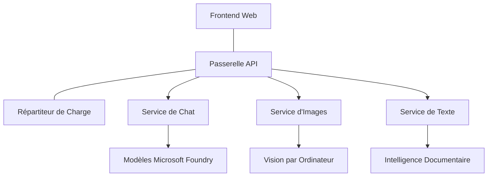

# Meilleures pratiques pour les charges de travail IA en production avec AZD

**Navigation dans le chapitre :**
- **📚 Accueil du cours** : [AZD For Beginners](../../README.md)
- **📖 Chapitre actuel** : Chapitre 8 - Modèles de production et d’entreprise
- **⬅️ Chapitre précédent** : [Chapitre 7 : Dépannage](../chapter-07-troubleshooting/debugging.md)
- **⬅️ Également lié** : [AI Workshop Lab](ai-workshop-lab.md)
- **🎯 Cours terminé** : [AZD For Beginners](../../README.md)

## Vue d’ensemble

Ce guide fournit des meilleures pratiques complètes pour déployer des charges de travail IA prêtes pour la production en utilisant Azure Developer CLI (AZD). Basées sur les retours de la communauté Microsoft Foundry Discord et des déploiements clients réels, ces pratiques adressent les défis les plus courants dans les systèmes IA en production.

## Principaux défis abordés

D’après les résultats de notre sondage communautaire, voici les principaux défis rencontrés par les développeurs :

- **45%** rencontrent des difficultés avec les déploiements IA multi-services
- **38%** ont des problèmes de gestion des identifiants et secrets  
- **35%** trouvent la mise en production et la montée en charge difficiles
- **32%** ont besoin de meilleures stratégies d’optimisation des coûts
- **29%** requièrent une surveillance et un dépannage améliorés

## Modèles d’architecture pour l’IA en production

### Modèle 1 : Architecture IA microservices

**Quand l’utiliser** : Applications IA complexes avec plusieurs capacités



**Implémentation AZD** :

```yaml
# azure.yaml
name: enterprise-ai-platform
services:
  web:
    project: ./web
    host: staticwebapp
  api-gateway:
    project: ./api-gateway
    host: containerapp
  chat-service:
    project: ./services/chat
    host: containerapp
  vision-service:
    project: ./services/vision
    host: containerapp
  text-service:
    project: ./services/text
    host: containerapp
```

### Modèle 2 : Traitement IA piloté par événements

**Quand l’utiliser** : Traitement par lots, analyse documentaire, workflows asynchrones

```bicep
// Event Hub for AI processing pipeline
resource eventHub 'Microsoft.EventHub/namespaces@2023-01-01-preview' = {
  name: eventHubNamespaceName
  location: location
  sku: {
    name: 'Standard'
    tier: 'Standard'
    capacity: 1
  }
}

// Service Bus for reliable message processing
resource serviceBus 'Microsoft.ServiceBus/namespaces@2022-10-01-preview' = {
  name: serviceBusNamespaceName
  location: location
  sku: {
    name: 'Premium'
    tier: 'Premium'
    capacity: 1
  }
}

// Function App for processing
resource functionApp 'Microsoft.Web/sites@2023-01-01' = {
  name: functionAppName
  location: location
  kind: 'functionapp,linux'
  properties: {
    siteConfig: {
      appSettings: [
        {
          name: 'FUNCTIONS_EXTENSION_VERSION'
          value: '~4'
        }
        {
          name: 'AZURE_OPENAI_ENDPOINT'
          value: '@Microsoft.KeyVault(VaultName=${keyVault.name};SecretName=openai-endpoint)'
        }
      ]
    }
  }
}
```

## Réflexion sur la santé des agents IA

Quand une application web traditionnelle se casse, les symptômes sont familiers : une page qui ne charge pas, une API qui renvoie une erreur, ou un déploiement qui échoue. Les applications IA peuvent dysfonctionner de toutes ces manières — mais elles peuvent aussi mal se comporter de façons plus subtiles qui ne produisent pas de messages d’erreur évidents.

Cette section vous aide à construire un modèle mental pour surveiller les charges IA afin de savoir où regarder quand quelque chose semble incorrect.

### En quoi la santé des agents diffère-t-elle de celle d’une application traditionnelle

Une application traditionnelle fonctionne ou ne fonctionne pas. Un agent IA peut sembler fonctionner mais produire de mauvais résultats. Pensez à la santé de l’agent en deux couches :

| Couche | Sur quoi veiller | Où regarder |
|--------|------------------|-------------|
| **Santé de l’infrastructure** | Le service est-il en cours d’exécution ? Les ressources sont-elles provisionnées ? Les points de terminaison sont-ils joignables ? | `azd monitor`, santé des ressources dans le portail Azure, logs des conteneurs/app |
| **Santé du comportement** | L’agent répond-il avec précision ? Les réponses sont-elles dans les temps ? Le modèle est-il correctement appelé ? | Traces Application Insights, métriques de latence des appels modèle, logs de qualité des réponses |

La santé de l’infrastructure est familière — elle est la même pour toute app azd. La santé du comportement est la nouvelle couche introduite par les charges IA.

### Où regarder quand les apps IA ne se comportent pas comme prévu

Si votre application IA ne produit pas les résultats attendus, voici une checklist conceptuelle :

1. **Commencez par les bases.** L’app fonctionne-t-elle ? Peut-elle atteindre ses dépendances ? Vérifiez `azd monitor` et la santé des ressources comme pour toute app.
2. **Vérifiez la connexion au modèle.** Votre application appelle-t-elle avec succès le modèle IA ? Les appels au modèle échoués ou avec timeout sont la cause la plus courante des problèmes IA et apparaîtront dans les logs de votre application.
3. **Examinez ce que le modèle a reçu.** Les réponses IA dépendent de l’entrée (l’invite et tout contexte récupéré). Si la sortie est erronée, l’entrée est généralement erronée. Vérifiez que votre application envoie les bonnes données au modèle.
4. **Passez en revue la latence des réponses.** Les appels au modèle IA sont plus lents que les appels API typiques. Si votre app semble lente, vérifiez si les temps de réponse du modèle ont augmenté — cela peut indiquer un throttling, des limites de capacité ou une congestion régionale.
5. **Surveillez les signaux de coût.** Des pics inattendus dans l’utilisation de tokens ou les appels API peuvent indiquer une boucle, une invite mal configurée, ou des retries excessifs.

Vous n’avez pas besoin de maîtriser immédiatement les outils d’observabilité. L’essentiel est que les applications IA ont une couche de comportement supplémentaire à surveiller, et la surveillance intégrée d’azd (`azd monitor`) vous donne un point de départ pour investiguer les deux couches.

---

## Meilleures pratiques de sécurité

### 1. Modèle de sécurité Zero-Trust

**Stratégie d’implémentation** :
- Pas de communication service-à-service sans authentification
- Tous les appels API utilisent des identités managées
- Isolation réseau avec points de terminaison privés
- Contrôles d’accès au moindre privilège

```bicep
// Managed Identity for each service
resource chatServiceIdentity 'Microsoft.ManagedIdentity/userAssignedIdentities@2023-01-31' = {
  name: 'chat-service-identity'
  location: location
}

// Role assignments with minimal permissions
resource openAIUserRole 'Microsoft.Authorization/roleAssignments@2022-04-01' = {
  scope: openAIAccount
  name: guid(openAIAccount.id, chatServiceIdentity.id, openAIUserRoleDefinitionId)
  properties: {
    roleDefinitionId: subscriptionResourceId('Microsoft.Authorization/roleDefinitions', '5e0bd9bd-7b93-4f28-af87-19fc36ad61bd')
    principalId: chatServiceIdentity.properties.principalId
    principalType: 'ServicePrincipal'
  }
}
```

### 2. Gestion sécurisée des secrets

**Modèle d’intégration Key Vault** :

```bicep
// Key Vault with proper access policies
resource keyVault 'Microsoft.KeyVault/vaults@2023-02-01' = {
  name: keyVaultName
  location: location
  properties: {
    tenantId: tenant().tenantId
    sku: {
      family: 'A'
      name: 'premium'  // Use premium for production
    }
    enableRbacAuthorization: true  // Use RBAC instead of access policies
    enablePurgeProtection: true    // Prevent accidental deletion
    enableSoftDelete: true
    softDeleteRetentionInDays: 90
  }
}

// Store all AI service credentials
resource openAIKeySecret 'Microsoft.KeyVault/vaults/secrets@2023-02-01' = {
  parent: keyVault
  name: 'openai-api-key'
  properties: {
    value: openAIAccount.listKeys().key1
    attributes: {
      enabled: true
    }
  }
}
```

### 3. Sécurité réseau

**Configuration des points de terminaison privés** :

```bicep
// Virtual Network for AI services
resource virtualNetwork 'Microsoft.Network/virtualNetworks@2023-04-01' = {
  name: vnetName
  location: location
  properties: {
    addressSpace: {
      addressPrefixes: ['10.0.0.0/16']
    }
    subnets: [
      {
        name: 'ai-services-subnet'
        properties: {
          addressPrefix: '10.0.1.0/24'
          privateEndpointNetworkPolicies: 'Disabled'
        }
      }
      {
        name: 'app-services-subnet'
        properties: {
          addressPrefix: '10.0.2.0/24'
          delegations: [
            {
              name: 'Microsoft.Web/serverFarms'
              properties: {
                serviceName: 'Microsoft.Web/serverFarms'
              }
            }
          ]
        }
      }
    ]
  }
}

// Private endpoints for all AI services
resource openAIPrivateEndpoint 'Microsoft.Network/privateEndpoints@2023-04-01' = {
  name: '${openAIAccountName}-pe'
  location: location
  properties: {
    subnet: {
      id: virtualNetwork.properties.subnets[0].id
    }
    privateLinkServiceConnections: [
      {
        name: 'openai-connection'
        properties: {
          privateLinkServiceId: openAIAccount.id
          groupIds: ['account']
        }
      }
    ]
  }
}
```

## Performance et mise à l’échelle

### 1. Stratégies d’auto-mise à l’échelle

**Auto-mise à l’échelle des Applications Conteneurisées** :

```bicep
resource containerApp 'Microsoft.App/containerApps@2023-05-01' = {
  name: containerAppName
  location: location
  properties: {
    configuration: {
      ingress: {
        external: true
        targetPort: 8000
        transport: 'http'
      }
    }
    template: {
      scale: {
        minReplicas: 2  // Always have 2 instances minimum
        maxReplicas: 50 // Scale up to 50 for high load
        rules: [
          {
            name: 'http-scaling'
            http: {
              metadata: {
                concurrentRequests: '20'  // Scale when >20 concurrent requests
              }
            }
          }
          {
            name: 'cpu-scaling'
            custom: {
              type: 'cpu'
              metadata: {
                type: 'Utilization'
                value: '70'  // Scale when CPU >70%
              }
            }
          }
        ]
      }
    }
  }
}
```

### 2. Stratégies de mise en cache

**Cache Redis pour les réponses IA** :

```bicep
// Redis Premium for production workloads
resource redisCache 'Microsoft.Cache/redis@2023-04-01' = {
  name: redisCacheName
  location: location
  properties: {
    sku: {
      name: 'Premium'
      family: 'P'
      capacity: 1
    }
    enableNonSslPort: false
    minimumTlsVersion: '1.2'
    redisConfiguration: {
      'maxmemory-policy': 'allkeys-lru'
    }
    // Enable clustering for high availability
    redisVersion: '6.0'
    shardCount: 2
  }
}

// Cache configuration in application
var cacheConnectionString = '${redisCache.properties.hostName}:6380,password=${redisCache.listKeys().primaryKey},ssl=True,abortConnect=False'
```

### 3. Répartition de charge et gestion du trafic

**Passerelle applicative avec WAF** :

```bicep
// Application Gateway with Web Application Firewall
resource applicationGateway 'Microsoft.Network/applicationGateways@2023-04-01' = {
  name: appGatewayName
  location: location
  properties: {
    sku: {
      name: 'WAF_v2'
      tier: 'WAF_v2'
      capacity: 2
    }
    webApplicationFirewallConfiguration: {
      enabled: true
      firewallMode: 'Prevention'
      ruleSetType: 'OWASP'
      ruleSetVersion: '3.2'
    }
    // Backend pools for AI services
    backendAddressPools: [
      {
        name: 'ai-services-pool'
        properties: {
          backendAddresses: [
            {
              fqdn: '${containerApp.properties.configuration.ingress.fqdn}'
            }
          ]
        }
      }
    ]
  }
}
```

## 💰 Optimisation des coûts

### 1. Ajustement des ressources à la demande

**Configurations spécifiques à l’environnement** :

```bash
# Environnement de développement
azd env new development
azd env set AZURE_OPENAI_SKU "S0"
azd env set AZURE_OPENAI_CAPACITY 10
azd env set AZURE_SEARCH_SKU "basic"
azd env set CONTAINER_CPU 0.5
azd env set CONTAINER_MEMORY 1.0

# Environnement de production
azd env new production
azd env set AZURE_OPENAI_SKU "S0"
azd env set AZURE_OPENAI_CAPACITY 100
azd env set AZURE_SEARCH_SKU "standard"
azd env set CONTAINER_CPU 2.0
azd env set CONTAINER_MEMORY 4.0
```

### 2. Suivi des coûts et budgets

```bicep
// Cost management and budgets
resource budget 'Microsoft.Consumption/budgets@2023-05-01' = {
  name: 'ai-workload-budget'
  properties: {
    timePeriod: {
      startDate: '2024-01-01'
      endDate: '2024-12-31'
    }
    timeGrain: 'Monthly'
    amount: 2000  // $2000 monthly budget
    category: 'Cost'
    notifications: {
      warning: {
        enabled: true
        operator: 'GreaterThan'
        threshold: 80
        contactEmails: [
          'finance@company.com'
          'engineering@company.com'
        ]
        contactRoles: [
          'Owner'
          'Contributor'
        ]
      }
      critical: {
        enabled: true
        operator: 'GreaterThan'
        threshold: 95
        contactEmails: [
          'cto@company.com'
        ]
      }
    }
  }
}
```

### 3. Optimisation de l’utilisation des tokens

**Gestion des coûts OpenAI** :

```typescript
// Optimisation des jetons au niveau de l'application
class TokenOptimizer {
  private readonly maxTokens = 4000;
  private readonly reserveTokens = 500;
  
  optimizePrompt(userInput: string, context: string): string {
    const availableTokens = this.maxTokens - this.reserveTokens;
    const estimatedTokens = this.estimateTokens(userInput + context);
    
    if (estimatedTokens > availableTokens) {
      // Tronquer le contexte, pas la saisie utilisateur
      context = this.truncateContext(context, availableTokens - this.estimateTokens(userInput));
    }
    
    return `${context}\n\nUser: ${userInput}`;
  }
  
  private estimateTokens(text: string): number {
    // Estimation approximative : 1 jeton ≈ 4 caractères
    return Math.ceil(text.length / 4);
  }
}
```

## Surveillance et observabilité

### 1. Application Insights complet

```bicep
// Application Insights with advanced features
resource applicationInsights 'Microsoft.Insights/components@2020-02-02' = {
  name: applicationInsightsName
  location: location
  kind: 'web'
  properties: {
    Application_Type: 'web'
    WorkspaceResourceId: logAnalyticsWorkspace.id
    SamplingPercentage: 100  // Full sampling for AI apps
    DisableIpMasking: false  // Enable for security
  }
}

// Custom metrics for AI operations
resource aiMetricAlerts 'Microsoft.Insights/metricAlerts@2018-03-01' = {
  name: 'ai-high-error-rate'
  location: 'global'
  properties: {
    description: 'Alert when AI service error rate is high'
    severity: 2
    enabled: true
    scopes: [
      applicationInsights.id
    ]
    evaluationFrequency: 'PT1M'
    windowSize: 'PT5M'
    criteria: {
      'odata.type': 'Microsoft.Azure.Monitor.SingleResourceMultipleMetricCriteria'
      allOf: [
        {
          name: 'high-error-rate'
          metricName: 'requests/failed'
          operator: 'GreaterThan'
          threshold: 10
          timeAggregation: 'Count'
        }
      ]
    }
  }
}
```

### 2. Surveillance spécifique IA

**Tableaux de bord personnalisés pour métriques IA** :

```json
// Dashboard configuration for AI workloads
{
  "dashboard": {
    "name": "AI Application Monitoring",
    "tiles": [
      {
        "name": "OpenAI Request Volume",
        "query": "requests | where name contains 'openai' | summarize count() by bin(timestamp, 5m)"
      },
      {
        "name": "AI Response Latency",
        "query": "requests | where name contains 'openai' | summarize avg(duration) by bin(timestamp, 5m)"
      },
      {
        "name": "Token Usage",
        "query": "customMetrics | where name == 'openai_tokens_used' | summarize sum(value) by bin(timestamp, 1h)"
      },
      {
        "name": "Cost per Hour",
        "query": "customMetrics | where name == 'openai_cost' | summarize sum(value) by bin(timestamp, 1h)"
      }
    ]
  }
}
```

### 3. Vérifications de santé et surveillance de la disponibilité

```bicep
// Application Insights availability tests
resource availabilityTest 'Microsoft.Insights/webtests@2022-06-15' = {
  name: 'ai-app-availability-test'
  location: location
  tags: {
    'hidden-link:${applicationInsights.id}': 'Resource'
  }
  properties: {
    SyntheticMonitorId: 'ai-app-availability-test'
    Name: 'AI Application Availability Test'
    Description: 'Tests AI application endpoints'
    Enabled: true
    Frequency: 300  // 5 minutes
    Timeout: 120    // 2 minutes
    Kind: 'ping'
    Locations: [
      {
        Id: 'us-east-2-azr'
      }
      {
        Id: 'us-west-2-azr'
      }
    ]
    Configuration: {
      WebTest: '''
        <WebTest Name="AI Health Check" 
                 Id="8d2de8d2-a2b0-4c2e-9a0d-8f9c9a0b8c8d" 
                 Enabled="True" 
                 CssProjectStructure="" 
                 CssIteration="" 
                 Timeout="120" 
                 WorkItemIds="" 
                 xmlns="http://microsoft.com/schemas/VisualStudio/TeamTest/2010" 
                 Description="" 
                 CredentialUserName="" 
                 CredentialPassword="" 
                 PreAuthenticate="True" 
                 Proxy="default" 
                 StopOnError="False" 
                 RecordedResultFile="" 
                 ResultsLocale="">
          <Items>
            <Request Method="GET" 
                     Guid="a5f10126-e4cd-570d-961c-cea43999a200" 
                     Version="1.1" 
                     Url="${webApp.properties.defaultHostName}/health" 
                     ThinkTime="0" 
                     Timeout="120" 
                     ParseDependentRequests="True" 
                     FollowRedirects="True" 
                     RecordResult="True" 
                     Cache="False" 
                     ResponseTimeGoal="0" 
                     Encoding="utf-8" 
                     ExpectedHttpStatusCode="200" 
                     ExpectedResponseUrl="" 
                     ReportingName="" 
                     IgnoreHttpStatusCode="False" />
          </Items>
        </WebTest>
      '''
    }
  }
}
```

## Reprise après sinistre et haute disponibilité

### 1. Déploiement multi-régions

```yaml
# azure.yaml - Multi-region configuration
name: ai-app-multiregion
services:
  api-primary:
    project: ./api
    host: containerapp
    env:
      - AZURE_REGION=eastus
  api-secondary:
    project: ./api
    host: containerapp
    env:
      - AZURE_REGION=westus2
```

```bicep
// Traffic Manager for global load balancing
resource trafficManager 'Microsoft.Network/trafficManagerProfiles@2022-04-01' = {
  name: trafficManagerProfileName
  location: 'global'
  properties: {
    profileStatus: 'Enabled'
    trafficRoutingMethod: 'Priority'
    dnsConfig: {
      relativeName: trafficManagerProfileName
      ttl: 30
    }
    monitorConfig: {
      protocol: 'HTTPS'
      port: 443
      path: '/health'
      intervalInSeconds: 30
      toleratedNumberOfFailures: 3
      timeoutInSeconds: 10
    }
    endpoints: [
      {
        name: 'primary-endpoint'
        type: 'Microsoft.Network/trafficManagerProfiles/azureEndpoints'
        properties: {
          targetResourceId: primaryAppService.id
          endpointStatus: 'Enabled'
          priority: 1
        }
      }
      {
        name: 'secondary-endpoint'
        type: 'Microsoft.Network/trafficManagerProfiles/azureEndpoints'
        properties: {
          targetResourceId: secondaryAppService.id
          endpointStatus: 'Enabled'
          priority: 2
        }
      }
    ]
  }
}
```

### 2. Sauvegarde et récupération des données

```bicep
// Backup configuration for critical data
resource backupVault 'Microsoft.DataProtection/backupVaults@2023-05-01' = {
  name: backupVaultName
  location: location
  identity: {
    type: 'SystemAssigned'
  }
  properties: {
    storageSettings: [
      {
        datastoreType: 'VaultStore'
        type: 'LocallyRedundant'
      }
    ]
  }
}

// Backup policy for AI models and data
resource backupPolicy 'Microsoft.DataProtection/backupVaults/backupPolicies@2023-05-01' = {
  parent: backupVault
  name: 'ai-data-backup-policy'
  properties: {
    policyRules: [
      {
        backupParameters: {
          backupType: 'Full'
          objectType: 'AzureBackupParams'
        }
        trigger: {
          schedule: {
            repeatingTimeIntervals: [
              'R/2024-01-01T02:00:00+00:00/P1D'  // Daily at 2 AM
            ]
          }
          objectType: 'ScheduleBasedTriggerContext'
        }
        dataStore: {
          datastoreType: 'VaultStore'
          objectType: 'DataStoreInfoBase'
        }
        name: 'BackupDaily'
        objectType: 'AzureBackupRule'
      }
    ]
  }
}
```

## Intégration DevOps et CI/CD

### 1. Workflow GitHub Actions

```yaml
# .github/workflows/deploy-ai-app.yml
name: Deploy AI Application

on:
  push:
    branches: [main]
  pull_request:
    branches: [main]

jobs:
  test:
    runs-on: ubuntu-latest
    steps:
      - uses: actions/checkout@v4
      
      - name: Setup Python
        uses: actions/setup-python@v4
        with:
          python-version: '3.11'
          
      - name: Install dependencies
        run: |
          pip install -r requirements.txt
          pip install pytest
          
      - name: Run tests
        run: pytest tests/
        
      - name: AI Safety Tests
        run: |
          python scripts/test_ai_safety.py
          python scripts/validate_prompts.py

  deploy-staging:
    needs: test
    if: github.event_name == 'pull_request'
    runs-on: ubuntu-latest
    steps:
      - uses: actions/checkout@v4
      
      - name: Setup AZD
        uses: Azure/setup-azd@v2
        
      - name: Login to Azure
        uses: azure/login@v1
        with:
          creds: ${{ secrets.AZURE_CREDENTIALS }}
          
      - name: Deploy to Staging
        run: |
          azd env select staging
          azd deploy

  deploy-production:
    needs: test
    if: github.ref == 'refs/heads/main'
    runs-on: ubuntu-latest
    steps:
      - uses: actions/checkout@v4
      
      - name: Setup AZD
        uses: Azure/setup-azd@v2
        
      - name: Login to Azure
        uses: azure/login@v1
        with:
          creds: ${{ secrets.AZURE_CREDENTIALS }}
          
      - name: Deploy to Production
        run: |
          azd env select production
          azd deploy
          
      - name: Run Production Health Checks
        run: |
          python scripts/health_check.py --env production
```

### 2. Validation de l’infrastructure

```bash
# scripts/validate_infrastructure.sh
#!/bin/bash

echo "Validating AI infrastructure deployment..."

# Vérifiez si tous les services requis fonctionnent
services=("openai" "search" "storage" "keyvault")
for service in "${services[@]}"; do
    echo "Checking $service..."
    if ! az resource list --resource-type "Microsoft.CognitiveServices/accounts" --query "[?contains(name, '$service')]" -o tsv; then
        echo "ERROR: $service not found"
        exit 1
    fi
done

# Valider les déploiements des modèles OpenAI
echo "Validating OpenAI model deployments..."
models=$(az cognitiveservices account deployment list --name $AZURE_OPENAI_NAME --resource-group $AZURE_RESOURCE_GROUP --query "[].name" -o tsv)
if [[ ! $models == *"gpt-4.1-mini"* ]]; then
  echo "ERROR: Required model gpt-4.1-mini not deployed"
    exit 1
fi

# Tester la connectivité du service IA
echo "Testing AI service connectivity..."
python scripts/test_connectivity.py

echo "Infrastructure validation completed successfully!"
```

## Checklist de préparation à la production

### Sécurité ✅
- [ ] Tous les services utilisent des identités managées
- [ ] Secrets stockés dans Key Vault
- [ ] Points de terminaison privés configurés
- [ ] Groupes de sécurité réseau mis en place
- [ ] RBAC avec moindre privilège
- [ ] WAF activé sur les points de terminaison publics

### Performance ✅
- [ ] Auto-mise à l’échelle configurée
- [ ] Mise en cache implémentée
- [ ] Répartition de charge configurée
- [ ] CDN pour contenu statique
- [ ] Pooling de connexion base de données
- [ ] Optimisation de l’utilisation des tokens

### Surveillance ✅
- [ ] Application Insights configuré
- [ ] Métriques personnalisées définies
- [ ] Règles d’alerte paramétrées
- [ ] Tableau de bord créé
- [ ] Vérifications de santé implémentées
- [ ] Politiques de rétention des logs

### Fiabilité ✅
- [ ] Déploiement multi-régions
- [ ] Plan de sauvegarde et récupération
- [ ] Disjoncteurs implémentés
- [ ] Politiques de retry configurées
- [ ] Dégradation progressive
- [ ] Endpoints de vérification de santé

### Gestion des coûts ✅
- [ ] Alertes budget configurées
- [ ] Ajustement des ressources
- [ ] Remises dev/test appliquées
- [ ] Instances réservées achetées
- [ ] Tableau de bord de suivi des coûts
- [ ] Revues régulières des coûts

### Conformité ✅
- [ ] Respect des exigences de résidence des données
- [ ] Journalisation des audits activée
- [ ] Politiques de conformité appliquées
- [ ] Référentiels de sécurité implémentés
- [ ] Évaluations régulières de la sécurité
- [ ] Plan de réponse aux incidents

## Références de performance

### Métriques typiques en production

| Métrique | Objectif | Surveillance |
|----------|----------|--------------|
| **Temps de réponse** | < 2 secondes | Application Insights |
| **Disponibilité** | 99,9% | Surveillance uptime |
| **Taux d’erreur** | < 0,1% | Logs d’application |
| **Utilisation des tokens** | < 500 $/mois | Gestion des coûts |
| **Utilisateurs simultanés** | 1000+ | Tests de charge |
| **Temps de récupération** | < 1 heure | Tests de reprise après sinistre |

### Tests de charge

```bash
# Script de test de charge pour les applications d'IA
python scripts/load_test.py \
  --endpoint https://your-ai-app.azurewebsites.net \
  --concurrent-users 100 \
  --duration 300 \
  --ramp-up 60
```

## 🤝 Meilleures pratiques de la communauté

Basé sur les retours de la communauté Microsoft Foundry sur Discord :

### Principales recommandations de la communauté :

1. **Commencez petit, montez progressivement** : Débutez avec des SKU de base et montez en charge selon l’usage réel
2. **Surveillez tout** : Configurez une surveillance complète dès le premier jour
3. **Automatisez la sécurité** : Utilisez l’infrastructure en tant que code pour une sécurité cohérente
4. **Testez en profondeur** : Intégrez des tests spécifiques IA dans votre pipeline
5. **Anticipez les coûts** : Surveillez l’usage des tokens et définissez des alertes budget précocement

### Pièges courants à éviter :

- ❌ Hardcoder les clés API dans le code
- ❌ Ne pas configurer de surveillance adéquate
- ❌ Ignorer l’optimisation des coûts
- ❌ Ne pas tester les scénarios d’échec
- ❌ Déployer sans vérifications de santé

## Commandes et extensions AZD AI CLI

AZD inclut un ensemble croissant de commandes et extensions spécifiques à l’IA qui simplifient les workflows IA en production. Ces outils comblent le fossé entre le développement local et le déploiement en production pour les charges IA.

### Extensions AZD pour l’IA

AZD utilise un système d’extensions pour ajouter des capacités spécifiques IA. Installez et gérez les extensions avec :

```bash
# Lister toutes les extensions disponibles (y compris l'IA)
azd extension list

# Examiner les détails des extensions installées
azd extension show azure.ai.agents

# Installer l'extension des agents Foundry
azd extension install azure.ai.agents

# Installer l'extension de réglage fin
azd extension install azure.ai.finetune

# Installer l'extension des modèles personnalisés
azd extension install azure.ai.models

# Mettre à jour toutes les extensions installées
azd extension upgrade --all
```

**Extensions IA disponibles :**

| Extension | Usage | Statut |
|-----------|-------|--------|
| `azure.ai.agents` | Gestion du service Agent Foundry | Aperçu |
| `azure.ai.skills` | Compétences agent réutilisables | Aperçu |
| `azure.ai.connections` | Connexions Foundry (sources données, outils) | Aperçu |
| `azure.ai.finetune` | Affinage des modèles Foundry | Aperçu |
| `azure.ai.models` | Modèles personnalisés Foundry | Aperçu |
| `azure.coding-agent` | Configuration de l’agent de codage | Disponible |

> L’extension `azure.ai.agents` évolue rapidement. Ce cours est validé avec `0.1.40-preview`. Exécutez `azd extension upgrade --all` pour obtenir le dernier jeu de commandes, et `azd extension show azure.ai.agents` pour vérifier la version installée.

**Quelles sont les nouvelles extensions `skills` et `connections` ?**

Deux extensions en aperçu sont apparues avec les outils agents et valent la peine d’être comprises même en tant que débutant :

- **`azure.ai.skills`** — Une **compétence** est une capacité réutilisable (un outil ou comportement packagé) que vous pouvez attacher à un ou plusieurs agents au lieu de le réimplémenter à chaque fois. Pensez-y comme un bloc de construction partagé : définissez une compétence « rechercher dans la documentation » ou « consulter une commande » une fois, puis réutilisez-la sur plusieurs agents. Cela garantit la cohérence dans les systèmes multi-agents (Chapitre 5) et évite la copie manuelle.
- **`azure.ai.connections`** — Une **connexion** est un lien géré depuis votre projet Foundry vers une ressource externe dont vos agents ont besoin — une source de données (comme Azure AI Search), un point d’accès outil, ou un autre service. Les connexions centralisent *où* et *comment* les agents accèdent aux données, donc les identifiants et points de terminaison sont stockés en un lieu gouverné plutôt que dispersés dans le code.

Vous n’en avez pas besoin pour déployer vos premiers agents — restez sur `azure.ai.agents` pendant l’apprentissage. Utilisez `skills` lorsque vous dupliquez le même outil entre agents, et `connections` lorsque plusieurs agents partagent la même source de données.

### Initialisation de projets agents avec `azd ai agent init`

La commande `azd ai agent init` génère un projet agent IA prêt pour la production intégré avec Microsoft Foundry Agent Service :

```bash
# Initialiser un nouveau projet d'agent à partir d'un manifeste d'agent
azd ai agent init -m <manifest-path-or-uri>

# Initialiser et cibler un projet Foundry spécifique
azd ai agent init -m agent-manifest.yaml --project-id <foundry-project-id>

# Initialiser avec un répertoire source personnalisé
azd ai agent init -m agent-manifest.yaml --src ./agents/my-agent

# Cibler Container Apps comme hôte
azd ai agent init -m agent-manifest.yaml --host containerapp
```

**Paramètres clés :**

| Option | Description |
|--------|-------------|
| `-m, --manifest` | Chemin ou URI vers un manifeste agent à ajouter au projet |
| `-p, --project-id` | ID Projet Microsoft Foundry existant pour votre environnement azd |
| `-s, --src` | Répertoire pour télécharger la définition d’agent (par défaut `src/<agent-id>`) |
| `--host` | Remplace l’hôte par défaut (ex. `containerapp`) |
| `-e, --environment` | L’environnement azd à utiliser |

**Conseil production** : Utilisez `--project-id` pour vous connecter directement à un projet Foundry existant, gardant votre code agent et vos ressources cloud liés dès le départ.

### Gestion du cycle de vie des agents

Au-delà de `init`, l’extension `azure.ai.agents` fournit des commandes pour le cycle complet d’un agent hébergé — tester, évaluer, optimiser et retirer :

```bash
# Invoquer un agent déployé et voir le temps de réponse du serveur
# (latence totale et temps jusqu'au premier octet)
azd ai agent invoke

# Afficher la configuration du point de terminaison en direct avant de la modifier
azd ai agent endpoint show

# Générer un ensemble de données d'évaluation pour l'agent
azd ai agent eval generate --dataset ./eval/dataset.jsonl

# Optimiser les instructions de l'agent en fonction de vos données d'évaluation
# (nécessite un modèle d'optimisation dans le projet de l'agent)
azd ai agent optimize

# Télécharger la source déployée d'un agent hébergé basé sur du code
# (avec vérification SHA-256)
azd ai agent code download

# Supprimer un agent hébergé et toutes ses versions
# (--force termine les sessions actives)
azd ai agent delete --force
```

**Cycle de vie en un coup d’œil :**

| Étape | Commande | Usage production |
|-------|---------|------------------|
| Tester | `azd ai agent invoke` | Valider les réponses et mesurer la latence avant mise en production |
| Inspecter | `azd ai agent endpoint show` | Examiner l’auth/config du endpoint ; détecter tôt les changements bloquants |
| Mesurer | `azd ai agent eval generate` | Construire un jeu d’évaluation répétable à partir de traces réelles |
| Améliorer | `azd ai agent optimize` | Ajuster les instructions en fonction de la qualité mesurée |
| Récupérer | `azd ai agent code download` | Récupérer le code source exact déployé pour audit/rollback |
| Retirer | `azd ai agent delete --force` | Supprimer proprement un agent et ses versions |

> Ce sont des commandes en aperçu et peuvent évoluer entre versions d’extensions. Lancez `azd ai agent --help` pour voir les sous-commandes exactes disponibles dans votre version.

### Protocole de contexte modèle (MCP) avec `azd mcp`
AZD inclut un support intégré du serveur MCP (Alpha), permettant aux agents IA et aux outils d'interagir avec vos ressources Azure via un protocole standardisé :

```bash
# Démarrez le serveur MCP pour votre projet
azd mcp start

# Passez en revue les règles actuelles de consentement Copilot pour l'exécution des outils
azd copilot consent list
```

Le serveur MCP expose le contexte de votre projet azd—environnements, services et ressources Azure—aux outils de développement assistés par IA. Cela permet :

- **Déploiement assisté par IA** : Permettez aux agents de codage d'interroger l'état de votre projet et de déclencher les déploiements
- **Découverte des ressources** : Les outils IA peuvent découvrir quelles ressources Azure votre projet utilise
- **Gestion des environnements** : Les agents peuvent passer d'un environnement dev/staging/production à un autre

### Génération d'Infrastructure avec `azd infra generate`

Pour les charges de travail IA en production, vous pouvez générer et personnaliser l'Infrastructure as Code plutôt que de compter sur un provisioning automatique :

```bash
# Générer des fichiers Bicep/Terraform à partir de la définition de votre projet
azd infra generate
```

Cela écrit l'IaC sur le disque afin que vous puissiez :
- Examiner et auditer l'infrastructure avant déploiement
- Ajouter des politiques de sécurité personnalisées (règles réseau, points de terminaison privés)
- Intégrer avec les processus existants de révision IaC
- Gérer les changements d'infrastructure dans le contrôle de version séparément du code applicatif

### Hooks du Cycle de Vie en Production

Les hooks AZD vous permettent d'injecter une logique personnalisée à chaque étape du cycle de vie du déploiement—crucial pour les workflows IA en production :

```yaml
# azure.yaml - Production hooks example
name: ai-production-app
hooks:
  preprovision:
    shell: sh
    run: scripts/validate-quotas.sh    # Check AI model quota before provisioning
  postprovision:
    shell: sh
    run: scripts/configure-networking.sh  # Set up private endpoints
  predeploy:
    shell: sh
    run: scripts/run-ai-safety-tests.sh  # Run prompt safety checks
  postdeploy:
    shell: sh
    run: scripts/smoke-test.sh           # Verify agent responses post-deploy
services:
  agent-api:
    project: ./src/agent
    host: containerapp
    hooks:
      predeploy:
        shell: sh
        run: scripts/validate-model-access.sh  # Per-service hook
```

```bash
# Exécuter un hook spécifique manuellement pendant le développement
azd hooks run predeploy
```

**Hooks recommandés en production pour les workloads IA :**

| Hook | Cas d'utilisation |
|------|-------------------|
| `preprovision` | Valider les quotas d'abonnement pour la capacité des modèles IA |
| `postprovision` | Configurer les points de terminaison privés, déployer les poids du modèle |
| `predeploy` | Exécuter des tests de sécurité IA, valider les modèles de prompt |
| `postdeploy` | Test rapide des réponses de l'agent, vérifier la connectivité au modèle |

### Configuration du Pipeline CI/CD

Utilisez `azd pipeline config` pour connecter votre projet à GitHub Actions ou Azure Pipelines avec une authentification Azure sécurisée :

```bash
# Configurer le pipeline CI/CD (interactif)
azd pipeline config

# Configurer avec un fournisseur spécifique
azd pipeline config --provider github
```

Cette commande :
- Crée un principal de service avec un accès au moindre privilège
- Configure des identifiants fédérés (sans secrets stockés)
- Génère ou met à jour votre fichier de définition de pipeline
- Définit les variables d'environnement nécessaires dans votre système CI/CD

#### Étape par étape : votre premier pipeline GitHub Actions

Voici le guide complet depuis un projet azd fonctionnel jusqu'aux déploiements automatisés à chaque push.

**1. Assurez-vous que votre projet est sur GitHub**

```bash
git init
git add .
git commit -m "Initial azd project"
gh repo create my-ai-app --private --source=. --push
```

**2. Lancez pipeline config**

```bash
azd pipeline config --provider github
```

azd va, de manière interactive :
- Demander quel abonnement Azure et environnement cibler
- Créer un **enregistrement d'application + principal de service** Entra pour le pipeline
- Configurer **les identifiants fédérés (OIDC)**—ainsi GitHub s'authentifie sur Azure avec des jetons courts et **aucun secret n'est stocké**
- Pousser les **variables** requises dans votre dépôt GitHub (`AZURE_CLIENT_ID`, `AZURE_TENANT_ID`, `AZURE_SUBSCRIPTION_ID`, `AZURE_ENV_NAME`, `AZURE_LOCATION`)

**3. Comprendre le workflow généré**

azd ajoute `.github/workflows/azure-dev.yml`. Les parties clés ressemblent à ceci :

```yaml
# .github/workflows/azure-dev.yml
on:
  push:
    branches: [ main ]
  workflow_dispatch:        # lets you run it manually too

permissions:
  id-token: write           # required for OIDC federated login
  contents: read

jobs:
  build:
    runs-on: ubuntu-latest
    env:
      AZURE_CLIENT_ID: ${{ vars.AZURE_CLIENT_ID }}
      AZURE_TENANT_ID: ${{ vars.AZURE_TENANT_ID }}
      AZURE_SUBSCRIPTION_ID: ${{ vars.AZURE_SUBSCRIPTION_ID }}
      AZURE_ENV_NAME: ${{ vars.AZURE_ENV_NAME }}
      AZURE_LOCATION: ${{ vars.AZURE_LOCATION }}
    steps:
      - uses: actions/checkout@v4
      - name: Install azd
        uses: Azure/setup-azd@v2
      - name: Log in with OIDC
        run: azd auth login --client-id "$AZURE_CLIENT_ID" --federated-credential-provider "github" --tenant-id "$AZURE_TENANT_ID"
      - name: Provision infrastructure
        run: azd provision --no-prompt
      - name: Deploy application
        run: azd deploy --no-prompt
```

**4. Vérifiez que cela fonctionne**

```bash
# Poussez une modification pour déclencher le pipeline
git commit -am "Trigger pipeline" --allow-empty
git push
```

Ouvrez l'onglet **Actions** de votre dépôt GitHub et regardez le workflow exécuter automatiquement `azd provision` et `azd deploy`.

> **Pourquoi les identifiants fédérés sont importants :** les anciens pipelines stockaient un secret client dans GitHub. Les identifiants fédérés OIDC suppriment totalement ce secret—GitHub demande un jeton à courte durée d’utilisation à l’exécution, ce qui est plus sûr et évite toute rotation ou fuite. C'est ce que configure par défaut `azd pipeline config`.

> **Secrets vs. variables :** les identifiants non sensibles (`AZURE_CLIENT_ID`, etc.) vont dans les **variables** du dépôt. Si votre application a vraiment besoin d’un secret à la compilation, ajoutez-le comme **secret** GitHub et référez-le via `${{ secrets.NAME }}`—mais préférez Key Vault + identité gérée à l'exécution (voir [Chapitre 3](../chapter-03-configuration/authsecurity.md)).

**Workflow production avec pipeline config :**

```bash
# 1. Configurer l'environnement de production
azd env new production
azd env set AZURE_OPENAI_CAPACITY 100

# 2. Configurer la pipeline
azd pipeline config --provider github

# 3. La pipeline exécute azd deploy à chaque push sur main
```

#### Étape par étape : Azure DevOps Pipelines

Vous préférez Azure DevOps à GitHub Actions ? azd le supporte nativement avec le fournisseur `azdo`. Le processus est quasiment identique—azd génère le fichier de pipeline, crée une connexion de service et configure l’authentification.

**1. Assurez-vous d'avoir un projet Azure DevOps**

Vous devez avoir une organisation et un projet sur `https://dev.azure.com/<your-org>`. Générez un jeton d'accès personnel (PAT) avec les droits **Build (Read & execute)**, **Code (Read & write)**, et **Service Connections (Read, query & manage)**—azd vous le demandera.

**2. Configurez le pipeline**

```bash
azd pipeline config --provider azdo
```

azd va :
- Demander votre organisation et projet Azure DevOps
- Créer (ou réutiliser) une **connexion de service** à Azure avec un principal de service
- Configurer **la fédération d’identité workload (OIDC)** pour qu’aucun secret client ne soit stocké
- Commit un fichier définition pipeline `azure-dev.yml` dans votre dépôt

**3. Passez en revue le `azure-dev.yml` généré**

azd écrit un pipeline qui provisionne et déploie à chaque push vers `main` :

```yaml
# azure-dev.yml
trigger:
  - main

pool:
  vmImage: ubuntu-latest

steps:
  - task: setup-azd@1
    displayName: Install azd

  - script: azd provision --no-prompt
    displayName: Provision Infrastructure
    env:
      AZURE_SUBSCRIPTION_ID: $(AZURE_SUBSCRIPTION_ID)
      AZURE_ENV_NAME: $(AZURE_ENV_NAME)
      AZURE_LOCATION: $(AZURE_LOCATION)

  - script: azd deploy --no-prompt
    displayName: Deploy Application
    env:
      AZURE_SUBSCRIPTION_ID: $(AZURE_SUBSCRIPTION_ID)
      AZURE_ENV_NAME: $(AZURE_ENV_NAME)
      AZURE_LOCATION: $(AZURE_LOCATION)
```

**4. Origine des variables**

azd stocke les valeurs d’environnement (`AZURE_ENV_NAME`, `AZURE_LOCATION`, `AZURE_SUBSCRIPTION_ID`) dans un **groupe de variables** Azure DevOps pour que le pipeline puisse les lire. Vous pouvez les consulter et modifier sous **Pipelines → Library**.

> **Même avantage OIDC qu'avec GitHub :** le fournisseur `azdo` configure aussi par défaut la fédération d’identité workload, donc aucun secret client n’est stocké dans la connexion de service—Azure DevOps échange un jeton court à l'exécution. Utilisez `--auth-type client-credentials` uniquement si votre organisation ne peut pas encore utiliser OIDC.

**5. Exécutez-le**

```bash
git commit -am "Add Azure DevOps pipeline" --allow-empty
git push
```

Ouvrez **Pipelines** dans Azure DevOps pour voir s’exécuter `azd provision` et `azd deploy`.

### Ajouter des composants avec `azd add`

Ajoutez progressivement des services Azure à un projet existant :

```bash
# Ajouter un nouveau composant de service de manière interactive
azd add
```

Ceci est particulièrement utile pour étendre des applications IA en production—for example, ajouter un service de recherche vectorielle, un nouveau point de terminaison d’agent, ou un composant de monitoring à un déploiement existant.

## Ressources supplémentaires

- **Azure Well-Architected Framework** : [Guide workloads IA](https://learn.microsoft.com/azure/well-architected/ai/)
- **Documentation Microsoft Foundry** : [Docs officielles](https://learn.microsoft.com/azure/ai-studio/)
- **Templates communauté** : [Azure Samples](https://github.com/Azure-Samples)
- **Communauté Discord** : [canal #Azure](https://discord.gg/microsoft-azure)
- **Compétences d’agent pour Azure** : [microsoft/github-copilot-for-azure sur skills.sh](https://skills.sh/microsoft/github-copilot-for-azure) - 37 compétences d’agents ouvertes pour Azure IA, Foundry, déploiement, optimisation coûts, diagnostics. Installez-les dans votre éditeur :
  ```bash
  npx skills add microsoft/github-copilot-for-azure
  ```

---

**Navigation dans le chapitre :**
- **📚 Accueil du cours** : [AZD pour débutants](../../README.md)
- **📖 Chapitre actuel** : Chapitre 8 - Patterns Production & Entreprise
- **⬅️ Chapitre précédent** : [Chapitre 7 : Débogage](../chapter-07-troubleshooting/debugging.md)
- **⬅️ Aussi relié** : [Atelier IA](ai-workshop-lab.md)
- **� Cours complet** : [AZD pour débutants](../../README.md)

**Rappelez-vous** : les charges de travail IA en production nécessitent une planification rigoureuse, une surveillance et une optimisation continue. Commencez par ces patterns et adaptez-les à vos besoins spécifiques.

---

<!-- CO-OP TRANSLATOR DISCLAIMER START -->
**Avertissement** :
Ce document a été traduit à l'aide du service de traduction automatique [Co-op Translator](https://github.com/Azure/co-op-translator). Bien que nous nous efforçions d'assurer l'exactitude, veuillez noter que les traductions automatisées peuvent contenir des erreurs ou des inexactitudes. Le document original dans sa langue native doit être considéré comme la source faisant autorité. Pour les informations critiques, il est recommandé de recourir à une traduction professionnelle réalisée par un humain. Nous ne saurions être tenus responsables des malentendus ou erreurs d'interprétation découlant de l'utilisation de cette traduction.
<!-- CO-OP TRANSLATOR DISCLAIMER END -->