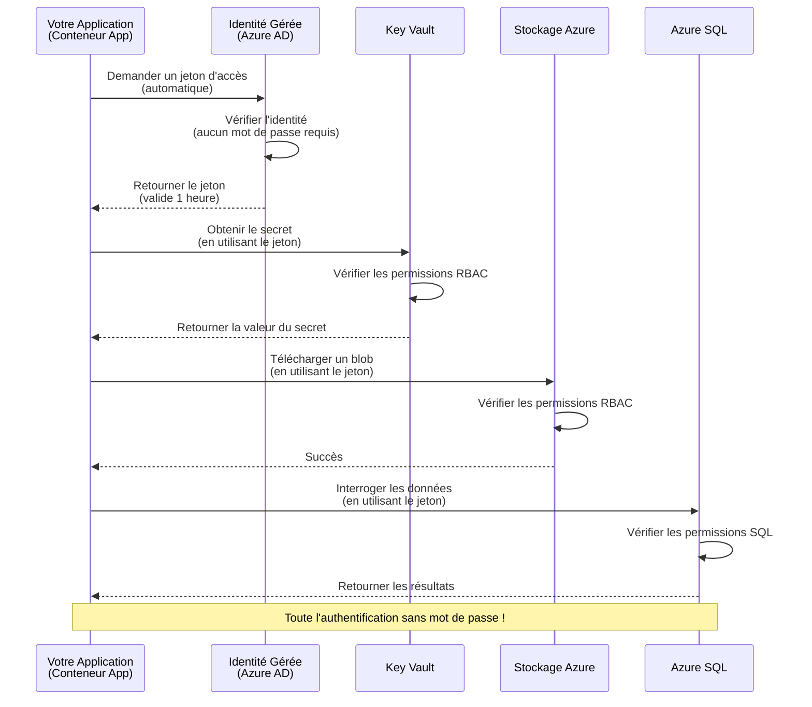
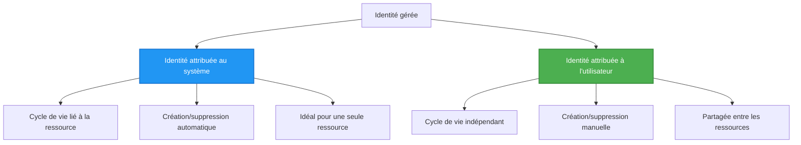

# Modèles d'authentification et identité gérée

⏱️ **Temps estimé** : 45-60 minutes | 💰 **Impact sur les coûts** : Gratuit (aucun frais supplémentaire) | ⭐ **Complexité** : Intermédiaire

**📚 Parcours d'apprentissage :**
- ← Précédent : [Gestion de la configuration](configuration.md) - Gestion des variables d'environnement et des secrets
- 🎯 **Vous êtes ici** : Authentification & Sécurité (Identité gérée, Key Vault, modèles sécurisés)
- → Suivant : [Premier projet](first-project.md) - Construisez votre première application AZD
- 🏠 [Accueil du cours](../../README.md)

---

## Ce que vous apprendrez

En complétant cette leçon, vous allez :
- Comprendre les modèles d'authentification Azure (clés, chaînes de connexion, identité gérée)
- Implémenter **l'identité gérée** pour une authentification sans mot de passe
- Sécuriser les secrets avec l'intégration de **Azure Key Vault**
- Configurer le **contrôle d'accès basé sur les rôles (RBAC)** pour les déploiements AZD
- Appliquer les meilleures pratiques de sécurité dans les applications conteneurisées et les services Azure
- Migrer de l'authentification basée sur les clés à celle basée sur l'identité

## Pourquoi l'identité gérée est importante

### Le problème : Authentification traditionnelle

**Avant l'identité gérée :**
```javascript
// ❌ RISQUE DE SÉCURITÉ : Secrets codés en dur dans le code
const connectionString = "Server=mydb.database.windows.net;User=admin;Password=P@ssw0rd123";
const storageKey = "xK7mN9pQ2wR5tY8uI0oP3aS6dF1gH4jK...";
const cosmosKey = "C2x7B9n4M1p8Q5w3E6r0T2y5U8i1O4p7...";
```

**Problèmes :**
- 🔴 **Secrets exposés** dans le code, les fichiers de configuration, les variables d'environnement
- 🔴 **Rotation des identifiants** nécessitant des modifications de code et un redéploiement
- 🔴 **Cauchemars d'audit** - qui a accédé à quoi, et quand ?
- 🔴 **Dispersion** - secrets éparpillés sur plusieurs systèmes
- 🔴 **Risques de conformité** - échec des audits de sécurité

### La solution : Identité gérée

**Après l'identité gérée :**
```javascript
// ✅ SÉCURISÉ : Aucun secret dans le code
const credential = new DefaultAzureCredential();
const client = new BlobServiceClient(
  "https://mystorageaccount.blob.core.windows.net",
  credential  // Azure gère automatiquement l'authentification
);
```

**Avantages :**
- ✅ **Aucun secret** dans le code ou la configuration
- ✅ **Rotation automatique** - gérée par Azure
- ✅ **Traçabilité complète** dans les journaux Azure AD
- ✅ **Sécurité centralisée** - gestion dans le portail Azure
- ✅ **Prêt pour la conformité** - répond aux normes de sécurité

**Analogie** : L'authentification traditionnelle est comme porter plusieurs clés physiques pour différentes portes. L'identité gérée est comme avoir un badge de sécurité qui accorde automatiquement l'accès en fonction de votre identité—pas de clés à perdre, copier ou faire tourner.

---

## Aperçu de l'architecture

### Flux d'authentification avec identité gérée


### Types d'identités gérées


| Fonctionnalité | Assignée au système | Assignée à l'utilisateur |
|----------------|---------------------|--------------------------|
| **Cycle de vie** | Liée à la ressource | Indépendante |
| **Création** | Automatique avec la ressource | Création manuelle |
| **Suppression** | Supprimée avec la ressource | Persiste après la suppression de la ressource |
| **Partage** | Une seule ressource | Plusieurs ressources |
| **Cas d'utilisation** | Scénarios simples | Scénarios complexes multi-ressources |
| **Défaut AZD** | ✅ Recommandé | Optionnel |

---

## Prérequis

### Outils requis

Vous devriez déjà avoir installé ces outils lors des leçons précédentes :

```bash
# Vérifier Azure Developer CLI
azd version
# ✅ Attendu : version azd 1.0.0 ou supérieure

# Vérifier Azure CLI
az --version
# ✅ Attendu : azure-cli 2.50.0 ou supérieure
```

### Exigences Azure

- Abonnement Azure actif
- Permissions pour :
  - Créer des identités gérées
  - Assigner des rôles RBAC
  - Créer des ressources Key Vault
  - Déployer des applications conteneurisées

### Connaissances préalables

Vous devriez avoir complété :
- [Guide d'installation](installation.md) - Configuration AZD
- [Bases d'AZD](azd-basics.md) - Concepts fondamentaux
- [Gestion de la configuration](configuration.md) - Variables d'environnement

---

## Leçon 1 : Comprendre les modèles d'authentification

### Modèle 1 : Chaînes de connexion (ancien - à éviter)

**Comment ça fonctionne :**
```bash
# La chaîne de connexion contient des identifiants
STORAGE_CONNECTION_STRING="DefaultEndpointsProtocol=https;AccountName=myaccount;AccountKey=xK7mN9pQ2wR5..."
COSMOS_CONNECTION_STRING="AccountEndpoint=https://myaccount.documents.azure.com:443/;AccountKey=C2x7..."
SQL_CONNECTION_STRING="Server=myserver.database.windows.net;User=admin;Password=P@ssw0rd..."
```

**Problèmes :**
- ❌ Secrets visibles dans les variables d'environnement
- ❌ Enregistrés dans les systèmes de déploiement
- ❌ Difficiles à faire tourner
- ❌ Pas de traçabilité des accès

**Quand l'utiliser :** Uniquement pour le développement local, jamais en production.

---

### Modèle 2 : Références Key Vault (mieux)

**Comment ça fonctionne :**
```bicep
// Store secret in Key Vault
resource keyVault 'Microsoft.KeyVault/vaults@2023-02-01' = {
  name: 'mykv'
  properties: {
    enableRbacAuthorization: true
  }
}

// Reference in Container App
env: [
  {
    name: 'STORAGE_KEY'
    secretRef: 'storage-key'  // References Key Vault
  }
]
```

**Avantages :**
- ✅ Secrets stockés en toute sécurité dans Key Vault
- ✅ Gestion centralisée des secrets
- ✅ Rotation sans modification du code

**Limitations :**
- ⚠️ Utilisation toujours de clés/mots de passe
- ⚠️ Nécessité de gérer l'accès à Key Vault

**Quand l'utiliser :** Étape de transition entre les chaînes de connexion et l'identité gérée.

---

### Modèle 3 : Identité gérée (meilleure pratique)

**Comment ça fonctionne :**
```bicep
// Enable managed identity
resource containerApp 'Microsoft.App/containerApps@2023-05-01' = {
  name: 'myapp'
  identity: {
    type: 'SystemAssigned'  // Automatically creates identity
  }
}

// Grant permissions
resource roleAssignment 'Microsoft.Authorization/roleAssignments@2022-04-01' = {
  scope: storageAccount
  properties: {
    roleDefinitionId: storageBlobDataContributorRole
    principalId: containerApp.identity.principalId
  }
}
```

**Code de l'application :**
```javascript
// Pas de secrets nécessaires !
const { DefaultAzureCredential } = require('@azure/identity');
const { BlobServiceClient } = require('@azure/storage-blob');

const credential = new DefaultAzureCredential();
const blobServiceClient = new BlobServiceClient(
  'https://mystorageaccount.blob.core.windows.net',
  credential
);
```

**Avantages :**
- ✅ Aucun secret dans le code/la configuration
- ✅ Rotation automatique des identifiants
- ✅ Traçabilité complète
- ✅ Permissions basées sur RBAC
- ✅ Prêt pour la conformité

**Quand l'utiliser :** Toujours, pour les applications en production.

---

## Leçon 2 : Implémenter l'identité gérée avec AZD

### Implémentation étape par étape

Construisons une application conteneurisée sécurisée qui utilise une identité gérée pour accéder à Azure Storage et Key Vault.

### Structure du projet

```
secure-app/
├── azure.yaml                 # AZD configuration
├── infra/
│   ├── main.bicep            # Main infrastructure
│   ├── core/
│   │   ├── identity.bicep    # Managed identity setup
│   │   ├── keyvault.bicep    # Key Vault configuration
│   │   └── storage.bicep     # Storage with RBAC
│   └── app/
│       └── container-app.bicep
└── src/
    ├── app.js                # Application code
    ├── package.json
    └── Dockerfile
```

### 1. Configurer AZD (azure.yaml)

```yaml
name: secure-app
metadata:
  template: secure-app@1.0.0

services:
  api:
    project: ./src
    language: js
    host: containerapp

# Enable managed identity (AZD handles this automatically)
```

### 2. Infrastructure : Activer l'identité gérée

**Fichier : `infra/main.bicep`**

```bicep
targetScope = 'subscription'

param environmentName string
param location string = 'eastus'

var tags = { 'azd-env-name': environmentName }

// Resource group
resource rg 'Microsoft.Resources/resourceGroups@2021-04-01' = {
  name: 'rg-${environmentName}'
  location: location
  tags: tags
}

// Storage Account
module storage './core/storage.bicep' = {
  name: 'storage'
  scope: rg
  params: {
    name: 'st${uniqueString(rg.id)}'
    location: location
    tags: tags
  }
}

// Key Vault
module keyVault './core/keyvault.bicep' = {
  name: 'keyvault'
  scope: rg
  params: {
    name: 'kv-${uniqueString(rg.id)}'
    location: location
    tags: tags
  }
}

// Container App with Managed Identity
module containerApp './app/container-app.bicep' = {
  name: 'container-app'
  scope: rg
  params: {
    name: 'ca-${environmentName}'
    location: location
    tags: tags
    storageAccountName: storage.outputs.name
    keyVaultName: keyVault.outputs.name
  }
}

// Grant Container App access to Storage
module storageRoleAssignment './core/role-assignment.bicep' = {
  name: 'storage-role'
  scope: rg
  params: {
    principalId: containerApp.outputs.identityPrincipalId
    roleDefinitionId: 'ba92f5b4-2d11-453d-a403-e96b0029c9fe'  // Storage Blob Data Contributor
    targetResourceId: storage.outputs.id
  }
}

// Grant Container App access to Key Vault
module kvRoleAssignment './core/role-assignment.bicep' = {
  name: 'kv-role'
  scope: rg
  params: {
    principalId: containerApp.outputs.identityPrincipalId
    roleDefinitionId: '4633458b-17de-408a-b874-0445c86b69e6'  // Key Vault Secrets User
    targetResourceId: keyVault.outputs.id
  }
}

// Outputs
output AZURE_STORAGE_ACCOUNT_NAME string = storage.outputs.name
output AZURE_KEY_VAULT_NAME string = keyVault.outputs.name
output APP_URL string = containerApp.outputs.url
```

### 3. Application conteneurisée avec identité assignée au système

**Fichier : `infra/app/container-app.bicep`**

```bicep
param name string
param location string
param tags object = {}
param storageAccountName string
param keyVaultName string

resource containerApp 'Microsoft.App/containerApps@2023-05-01' = {
  name: name
  location: location
  tags: tags
  identity: {
    type: 'SystemAssigned'  // 🔑 Enable managed identity
  }
  properties: {
    configuration: {
      ingress: {
        external: true
        targetPort: 3000
      }
    }
    template: {
      containers: [
        {
          name: 'api'
          image: 'myregistry.azurecr.io/api:latest'
          resources: {
            cpu: json('0.5')
            memory: '1Gi'
          }
          env: [
            {
              name: 'AZURE_STORAGE_ACCOUNT_NAME'
              value: storageAccountName
            }
            {
              name: 'AZURE_KEY_VAULT_NAME'
              value: keyVaultName
            }
            // 🔑 No secrets - managed identity handles authentication!
          ]
        }
      ]
    }
  }
}

// Output the identity for RBAC assignments
output identityPrincipalId string = containerApp.identity.principalId
output id string = containerApp.id
output url string = 'https://${containerApp.properties.configuration.ingress.fqdn}'
```

### 4. Module d'assignation de rôle RBAC

**Fichier : `infra/core/role-assignment.bicep`**

```bicep
param principalId string
param roleDefinitionId string  // Azure built-in role ID
param targetResourceId string

resource roleAssignment 'Microsoft.Authorization/roleAssignments@2022-04-01' = {
  name: guid(principalId, roleDefinitionId, targetResourceId)
  scope: resourceId('Microsoft.Resources/resourceGroups', resourceGroup().name)
  properties: {
    roleDefinitionId: subscriptionResourceId('Microsoft.Authorization/roleDefinitions', roleDefinitionId)
    principalId: principalId
    principalType: 'ServicePrincipal'
  }
}

output id string = roleAssignment.id
```

### 5. Code de l'application avec identité gérée

**Fichier : `src/app.js`**

```javascript
const express = require('express');
const { DefaultAzureCredential } = require('@azure/identity');
const { BlobServiceClient } = require('@azure/storage-blob');
const { SecretClient } = require('@azure/keyvault-secrets');

const app = express();
const PORT = process.env.PORT || 3000;

// 🔑 Initialiser les identifiants (fonctionne automatiquement avec l'identité gérée)
const credential = new DefaultAzureCredential();

// Configuration du stockage Azure
const storageAccountName = process.env.AZURE_STORAGE_ACCOUNT_NAME;
const blobServiceClient = new BlobServiceClient(
  `https://${storageAccountName}.blob.core.windows.net`,
  credential  // Pas de clés nécessaires !
);

// Configuration de Key Vault
const keyVaultName = process.env.AZURE_KEY_VAULT_NAME;
const secretClient = new SecretClient(
  `https://${keyVaultName}.vault.azure.net`,
  credential  // Pas de clés nécessaires !
);

// Vérification de l'état
app.get('/health', (req, res) => {
  res.json({ status: 'healthy', authentication: 'managed-identity' });
});

// Télécharger un fichier dans le stockage blob
app.post('/upload', async (req, res) => {
  try {
    const containerClient = blobServiceClient.getContainerClient('uploads');
    await containerClient.createIfNotExists();
    
    const blobName = `file-${Date.now()}.txt`;
    const blockBlobClient = containerClient.getBlockBlobClient(blobName);
    
    await blockBlobClient.upload('Hello from managed identity!', 30);
    
    res.json({
      success: true,
      blobName: blobName,
      message: 'File uploaded using managed identity!'
    });
  } catch (error) {
    console.error('Upload error:', error);
    res.status(500).json({ error: error.message });
  }
});

// Obtenir un secret depuis Key Vault
app.get('/secret/:name', async (req, res) => {
  try {
    const secretName = req.params.name;
    const secret = await secretClient.getSecret(secretName);
    
    res.json({
      name: secretName,
      value: secret.value,
      message: 'Secret retrieved using managed identity!'
    });
  } catch (error) {
    console.error('Secret error:', error);
    res.status(500).json({ error: error.message });
  }
});

// Lister les conteneurs blob (démontre l'accès en lecture)
app.get('/containers', async (req, res) => {
  try {
    const containers = [];
    for await (const container of blobServiceClient.listContainers()) {
      containers.push(container.name);
    }
    
    res.json({
      containers: containers,
      count: containers.length,
      message: 'Containers listed using managed identity!'
    });
  } catch (error) {
    console.error('List error:', error);
    res.status(500).json({ error: error.message });
  }
});

app.listen(PORT, () => {
  console.log(`Secure API listening on port ${PORT}`);
  console.log('Authentication: Managed Identity (passwordless)');
});
```

**Fichier : `src/package.json`**

```json
{
  "name": "secure-app",
  "version": "1.0.0",
  "dependencies": {
    "express": "^4.18.2",
    "@azure/identity": "^4.0.0",
    "@azure/storage-blob": "^12.17.0",
    "@azure/keyvault-secrets": "^4.7.0"
  },
  "scripts": {
    "start": "node app.js"
  }
}
```

### 6. Déployer et tester

```bash
# Initialiser l'environnement AZD
azd init

# Déployer l'infrastructure et l'application
azd up

# Obtenir l'URL de l'application
APP_URL=$(azd env get-values | grep APP_URL | cut -d '=' -f2 | tr -d '"')

# Tester la vérification de l'état
curl $APP_URL/health
```

**✅ Résultat attendu :**
```json
{
  "status": "healthy",
  "authentication": "managed-identity"
}
```

**Tester le téléchargement de blob :**
```bash
curl -X POST $APP_URL/upload
```

**✅ Résultat attendu :**
```json
{
  "success": true,
  "blobName": "file-1700404800000.txt",
  "message": "File uploaded using managed identity!"
}
```

**Lister les conteneurs :**
```bash
curl $APP_URL/containers
```

**✅ Résultat attendu :**
```json
{
  "containers": ["uploads"],
  "count": 1,
  "message": "Containers listed using managed identity!"
}
```

---

## Rôles RBAC Azure courants

### Identifiants de rôle intégrés pour l'identité gérée

| Service | Nom du rôle | ID du rôle | Permissions |
|---------|-------------|-----------|-------------|
| **Stockage** | Lecteur de données Blob Storage | `2a2b9908-6b94-4a3d-8e5a-a7d8f8cc8a12` | Lire les blobs et conteneurs |
| **Stockage** | Contributeur de données Blob Storage | `ba92f5b4-2d11-453d-a403-e96b0029c9fe` | Lire, écrire, supprimer des blobs |
| **Stockage** | Contributeur de données Queue Storage | `974c5e8b-45b9-4653-ba55-5f855dd0fb88` | Lire, écrire, supprimer des messages de file d'attente |
| **Key Vault** | Utilisateur des secrets Key Vault | `4633458b-17de-408a-b874-0445c86b69e6` | Lire les secrets |
| **Key Vault** | Responsable des secrets Key Vault | `b86a8fe4-44ce-4948-aee5-eccb2c155cd7` | Lire, écrire, supprimer des secrets |
| **Cosmos DB** | Lecteur de données Cosmos DB intégré | `00000000-0000-0000-0000-000000000001` | Lire les données Cosmos DB |
| **Cosmos DB** | Contributeur de données Cosmos DB intégré | `00000000-0000-0000-0000-000000000002` | Lire, écrire les données Cosmos DB |
| **Base de données SQL** | Contributeur SQL DB | `9b7fa17d-e63e-47b0-bb0a-15c516ac86ec` | Gérer les bases de données SQL |
| **Service Bus** | Propriétaire des données Azure Service Bus | `090c5cfd-751d-490a-894a-3ce6f1109419` | Envoyer, recevoir, gérer les messages |

### Comment trouver les identifiants de rôle

```bash
# Lister tous les rôles intégrés
az role definition list --query "[].{Name:roleName, ID:name}" --output table

# Rechercher un rôle spécifique
az role definition list --query "[?contains(roleName, 'Storage Blob')].{Name:roleName, ID:name}" --output table

# Obtenir les détails du rôle
az role definition list --name "Storage Blob Data Contributor"
```

---

## Exercices pratiques

### Exercice 1 : Activer l'identité gérée pour une application existante ⭐⭐ (Moyen)

**Objectif** : Ajouter une identité gérée à un déploiement d'application conteneurisée existant

**Scénario** : Vous avez une application conteneurisée utilisant des chaînes de connexion. Convertissez-la en identité gérée.

**Point de départ** : Application conteneurisée avec cette configuration :

```bicep
// ❌ Current: Using connection string
env: [
  {
    name: 'STORAGE_CONNECTION_STRING'
    secretRef: 'storage-connection'
  }
]
```

**Étapes** :

1. **Activer l'identité gérée dans Bicep :**

```bicep
resource containerApp 'Microsoft.App/containerApps@2023-05-01' = {
  name: 'myapp'
  identity: {
    type: 'SystemAssigned'  // Add this
  }
  // ... rest of configuration
}
```

2. **Accorder l'accès au stockage :**

```bicep
// Get storage account reference
resource storageAccount 'Microsoft.Storage/storageAccounts@2023-01-01' existing = {
  name: storageAccountName
}

// Assign role
resource roleAssignment 'Microsoft.Authorization/roleAssignments@2022-04-01' = {
  name: guid(containerApp.id, 'ba92f5b4-2d11-453d-a403-e96b0029c9fe', storageAccount.id)
  scope: storageAccount
  properties: {
    roleDefinitionId: subscriptionResourceId('Microsoft.Authorization/roleDefinitions', 'ba92f5b4-2d11-453d-a403-e96b0029c9fe')
    principalId: containerApp.identity.principalId
    principalType: 'ServicePrincipal'
  }
}
```

3. **Mettre à jour le code de l'application :**

**Avant (chaîne de connexion) :**
```javascript
const { BlobServiceClient } = require('@azure/storage-blob');

const blobServiceClient = BlobServiceClient.fromConnectionString(
  process.env.STORAGE_CONNECTION_STRING
);
```

**Après (identité gérée) :**
```javascript
const { DefaultAzureCredential } = require('@azure/identity');
const { BlobServiceClient } = require('@azure/storage-blob');

const credential = new DefaultAzureCredential();
const blobServiceClient = new BlobServiceClient(
  `https://${process.env.STORAGE_ACCOUNT_NAME}.blob.core.windows.net`,
  credential
);
```

4. **Mettre à jour les variables d'environnement :**

```bicep
env: [
  {
    name: 'STORAGE_ACCOUNT_NAME'
    value: storageAccountName  // Just the name, no secrets!
  }
  // Remove STORAGE_CONNECTION_STRING
]
```

5. **Déployer et tester :**

```bash
# Redéployer
azd up

# Tester que cela fonctionne toujours
curl https://myapp.azurecontainerapps.io/upload
```

**✅ Critères de réussite :**
- ✅ L'application se déploie sans erreurs
- ✅ Les opérations de stockage fonctionnent (téléchargement, liste, téléchargement)
- ✅ Aucune chaîne de connexion dans les variables d'environnement
- ✅ Identité visible dans le portail Azure sous l'onglet "Identité"

**Vérification :**

```bash
# Vérifiez que l'identité gérée est activée
az containerapp show \
  --name myapp \
  --resource-group rg-myapp \
  --query "identity.type"
# ✅ Attendu : "SystemAssigned"

# Vérifiez l'attribution de rôle
az role assignment list \
  --assignee $(az containerapp show --name myapp --resource-group rg-myapp --query "identity.principalId" -o tsv) \
  --scope /subscriptions/{sub-id}/resourceGroups/rg-myapp/providers/Microsoft.Storage/storageAccounts/mystorageaccount
# ✅ Attendu : Affiche le rôle "Storage Blob Data Contributor"
```

**Temps** : 20-30 minutes

---

### Exercice 2 : Accès multi-services avec identité assignée à l'utilisateur ⭐⭐⭐ (Avancé)

**Objectif** : Créer une identité assignée à l'utilisateur partagée entre plusieurs applications conteneurisées

**Scénario** : Vous avez 3 microservices qui doivent tous accéder au même compte de stockage et Key Vault.

**Étapes** :

1. **Créer une identité assignée à l'utilisateur :**

**Fichier : `infra/core/identity.bicep`**

```bicep
param name string
param location string
param tags object = {}

resource userAssignedIdentity 'Microsoft.ManagedIdentity/userAssignedIdentities@2023-01-31' = {
  name: name
  location: location
  tags: tags
}

output id string = userAssignedIdentity.id
output principalId string = userAssignedIdentity.properties.principalId
output clientId string = userAssignedIdentity.properties.clientId
```

2. **Assigner des rôles à l'identité assignée à l'utilisateur :**

```bicep
// In main.bicep
module userIdentity './core/identity.bicep' = {
  name: 'user-identity'
  scope: rg
  params: {
    name: 'id-${environmentName}'
    location: location
    tags: tags
  }
}

// Grant Storage access
resource storageRoleAssignment 'Microsoft.Authorization/roleAssignments@2022-04-01' = {
  name: guid(userIdentity.outputs.principalId, 'storage-contributor')
  scope: storageAccount
  properties: {
    roleDefinitionId: subscriptionResourceId('Microsoft.Authorization/roleDefinitions', 'ba92f5b4-2d11-453d-a403-e96b0029c9fe')
    principalId: userIdentity.outputs.principalId
    principalType: 'ServicePrincipal'
  }
}

// Grant Key Vault access
resource kvRoleAssignment 'Microsoft.Authorization/roleAssignments@2022-04-01' = {
  name: guid(userIdentity.outputs.principalId, 'kv-secrets-user')
  scope: keyVault
  properties: {
    roleDefinitionId: subscriptionResourceId('Microsoft.Authorization/roleDefinitions', '4633458b-17de-408a-b874-0445c86b69e6')
    principalId: userIdentity.outputs.principalId
    principalType: 'ServicePrincipal'
  }
}
```

3. **Assigner l'identité à plusieurs applications conteneurisées :**

```bicep
resource apiGateway 'Microsoft.App/containerApps@2023-05-01' = {
  name: 'api-gateway'
  identity: {
    type: 'UserAssigned'
    userAssignedIdentities: {
      '${userIdentity.outputs.id}': {}
    }
  }
  // ... rest of config
}

resource productService 'Microsoft.App/containerApps@2023-05-01' = {
  name: 'product-service'
  identity: {
    type: 'UserAssigned'
    userAssignedIdentities: {
      '${userIdentity.outputs.id}': {}
    }
  }
  // ... rest of config
}

resource orderService 'Microsoft.App/containerApps@2023-05-01' = {
  name: 'order-service'
  identity: {
    type: 'UserAssigned'
    userAssignedIdentities: {
      '${userIdentity.outputs.id}': {}
    }
  }
  // ... rest of config
}
```

4. **Code de l'application (tous les services utilisent le même modèle) :**

```javascript
const { DefaultAzureCredential, ManagedIdentityCredential } = require('@azure/identity');

// Pour l'identité assignée par l'utilisateur, spécifiez l'ID client
const credential = new ManagedIdentityCredential(
  process.env.AZURE_CLIENT_ID  // ID client de l'identité assignée par l'utilisateur
);

// Ou utilisez DefaultAzureCredential (détection automatique)
const credential = new DefaultAzureCredential();

const blobServiceClient = new BlobServiceClient(
  `https://${process.env.STORAGE_ACCOUNT_NAME}.blob.core.windows.net`,
  credential
);
```

5. **Déployer et vérifier :**

```bash
azd up

# Tester si tous les services peuvent accéder au stockage
curl https://api-gateway.azurecontainerapps.io/upload
curl https://product-service.azurecontainerapps.io/upload
curl https://order-service.azurecontainerapps.io/upload
```

**✅ Critères de réussite :**
- ✅ Une identité partagée entre 3 services
- ✅ Tous les services peuvent accéder au stockage et à Key Vault
- ✅ L'identité persiste si vous supprimez un service
- ✅ Gestion centralisée des permissions

**Avantages de l'identité assignée à l'utilisateur :**
- Une seule identité à gérer
- Permissions cohérentes entre les services
- Persiste après la suppression d'un service
- Meilleur pour les architectures complexes

**Temps** : 30-40 minutes

---

### Exercice 3 : Implémenter la rotation des secrets Key Vault ⭐⭐⭐ (Avancé)

**Objectif** : Stocker les clés API de tiers dans Key Vault et y accéder via une identité gérée

**Scénario** : Votre application doit appeler une API externe (OpenAI, Stripe, SendGrid) nécessitant des clés API.

**Étapes** :

1. **Créer Key Vault avec RBAC :**

**Fichier : `infra/core/keyvault.bicep`**

```bicep
param name string
param location string
param tags object = {}

resource keyVault 'Microsoft.KeyVault/vaults@2023-02-01' = {
  name: name
  location: location
  tags: tags
  properties: {
    enableRbacAuthorization: true  // Use RBAC instead of access policies
    sku: {
      family: 'A'
      name: 'standard'
    }
    tenantId: subscription().tenantId
    enableSoftDelete: true
    softDeleteRetentionInDays: 90
  }
}

// Allow Container App to read secrets
output id string = keyVault.id
output name string = keyVault.name
output uri string = keyVault.properties.vaultUri
```

2. **Stocker les secrets dans Key Vault :**

```bash
# Obtenir le nom du Key Vault
KV_NAME=$(azd env get-values | grep AZURE_KEY_VAULT_NAME | cut -d '=' -f2 | tr -d '"')

# Stocker les clés API tierces
az keyvault secret set \
  --vault-name $KV_NAME \
  --name "OpenAI-ApiKey" \
  --value "sk-proj-xxxxxxxxxxxxx"

az keyvault secret set \
  --vault-name $KV_NAME \
  --name "Stripe-ApiKey" \
  --value "sk_live_xxxxxxxxxxxxx"

az keyvault secret set \
  --vault-name $KV_NAME \
  --name "SendGrid-ApiKey" \
  --value "SG.xxxxxxxxxxxxx"
```

3. **Code de l'application pour récupérer les secrets :**

**Fichier : `src/config.js`**

```javascript
const { DefaultAzureCredential } = require('@azure/identity');
const { SecretClient } = require('@azure/keyvault-secrets');

class Config {
  constructor() {
    this.credential = new DefaultAzureCredential();
    this.secretClient = new SecretClient(
      `https://${process.env.AZURE_KEY_VAULT_NAME}.vault.azure.net`,
      this.credential
    );
    this.cache = {};
  }

  async getSecret(secretName) {
    // Vérifiez le cache en premier
    if (this.cache[secretName]) {
      return this.cache[secretName];
    }

    try {
      const secret = await this.secretClient.getSecret(secretName);
      this.cache[secretName] = secret.value;
      console.log(`✅ Retrieved secret: ${secretName}`);
      return secret.value;
    } catch (error) {
      console.error(`❌ Failed to get secret ${secretName}:`, error.message);
      throw error;
    }
  }

  async getOpenAIKey() {
    return this.getSecret('OpenAI-ApiKey');
  }

  async getStripeKey() {
    return this.getSecret('Stripe-ApiKey');
  }

  async getSendGridKey() {
    return this.getSecret('SendGrid-ApiKey');
  }
}

module.exports = new Config();
```

4. **Utiliser les secrets dans l'application :**

**Fichier : `src/app.js`**

```javascript
const express = require('express');
const config = require('./config');
const { OpenAI } = require('openai');

const app = express();

// Initialiser OpenAI avec la clé du Key Vault
let openaiClient;

async function initializeServices() {
  const openaiKey = await config.getOpenAIKey();
  openaiClient = new OpenAI({ apiKey: openaiKey });
  console.log('✅ Services initialized with secrets from Key Vault');
}

// Appeler au démarrage
initializeServices().catch(console.error);

app.post('/chat', async (req, res) => {
  try {
    const completion = await openaiClient.chat.completions.create({
      model: 'gpt-4',
      messages: [{ role: 'user', content: 'Hello!' }]
    });
    
    res.json({
      response: completion.choices[0].message.content,
      authentication: 'Key from Key Vault via Managed Identity'
    });
  } catch (error) {
    res.status(500).json({ error: error.message });
  }
});

app.listen(3000, () => {
  console.log('Secure API with Key Vault integration running');
});
```

5. **Déployer et tester :**

```bash
azd up

# Tester que les clés API fonctionnent
curl -X POST https://myapp.azurecontainerapps.io/chat \
  -H "Content-Type: application/json" \
  -d '{"message":"Hello AI"}'
```

**✅ Critères de réussite :**
- ✅ Aucune clé API dans le code ou les variables d'environnement
- ✅ L'application récupère les clés depuis Key Vault
- ✅ Les API tierces fonctionnent correctement
- ✅ Rotation des clés possible sans modification du code

**Faire tourner un secret :**

```bash
# Mettre à jour le secret dans Key Vault
az keyvault secret set \
  --vault-name $KV_NAME \
  --name "OpenAI-ApiKey" \
  --value "sk-proj-NEW_KEY_HERE"

# Redémarrer l'application pour prendre en compte la nouvelle clé
az containerapp revision restart \
  --name myapp \
  --resource-group rg-myapp
```

**Temps** : 25-35 minutes

---

## Point de contrôle des connaissances

### 1. Modèles d'authentification ✓

Testez vos connaissances :

- [ ] **Q1** : Quels sont les trois principaux modèles d'authentification ? 
  - **A** : Chaînes de connexion (ancien), Références Key Vault (transition), Identité gérée (meilleur)

- [ ] **Q2** : Pourquoi l'identité gérée est-elle meilleure que les chaînes de connexion ?
  - **A** : Aucun secret dans le code, rotation automatique, traçabilité complète, permissions RBAC

- [ ] **Q3** : Quand utiliseriez-vous une identité assignée à l'utilisateur plutôt qu'une assignée au système ?
  - **A** : Lors du partage d'identité entre plusieurs ressources ou lorsque le cycle de vie de l'identité est indépendant de celui de la ressource

**Vérification pratique :**
```bash
# Vérifiez quel type d'identité votre application utilise
az containerapp show \
  --name myapp \
  --resource-group rg-myapp \
  --query "identity.type"

# Listez toutes les affectations de rôles pour l'identité
az role assignment list \
  --assignee $(az containerapp show --name myapp --resource-group rg-myapp --query "identity.principalId" -o tsv)
```

---

### 2. RBAC et permissions ✓

Testez vos connaissances :

- [ ] **Q1** : Quel est l'ID de rôle pour "Contributeur de données Blob Storage" ?
  - **A** : `ba92f5b4-2d11-453d-a403-e96b0029c9fe`

- [ ] **Q2** : Quelles permissions fournit "Utilisateur des secrets Key Vault" ?
  - **A** : Accès en lecture seule aux secrets (ne peut pas créer, mettre à jour ou supprimer)

- [ ] **Q3** : Comment accorder à une application conteneurisée l'accès à Azure SQL ?
  - **A** : Assigner le rôle "Contributeur SQL DB" ou configurer l'authentification Azure AD pour SQL

**Vérification pratique :**
```bash
# Trouver un rôle spécifique
az role definition list --name "Storage Blob Data Contributor"

# Vérifier quels rôles sont attribués à votre identité
PRINCIPAL_ID=$(az containerapp show --name myapp --resource-group rg-myapp --query "identity.principalId" -o tsv)
az role assignment list --assignee $PRINCIPAL_ID --output table
```

---

### 3. Intégration Key Vault ✓

Testez vos connaissances :
- [ ] **Q1** : Comment activer RBAC pour Key Vault au lieu des stratégies d'accès ?
  - **A** : Définir `enableRbacAuthorization: true` dans Bicep

- [ ] **Q2** : Quelle bibliothèque Azure SDK gère l'authentification par identité managée ?
  - **A** : `@azure/identity` avec la classe `DefaultAzureCredential`

- [ ] **Q3** : Combien de temps les secrets de Key Vault restent-ils en cache ?
  - **A** : Dépend de l'application ; implémentez votre propre stratégie de mise en cache

**Vérification pratique :**
```bash
# Tester l'accès au Key Vault
az keyvault secret show \
  --vault-name $KV_NAME \
  --name "OpenAI-ApiKey" \
  --query "value"

# Vérifier que RBAC est activé
az keyvault show \
  --name $KV_NAME \
  --query "properties.enableRbacAuthorization"
# ✅ Attendu : vrai
```

---

## Bonnes pratiques de sécurité

### ✅ À FAIRE :

1. **Toujours utiliser une identité managée en production**
   ```bicep
   identity: {
     type: 'SystemAssigned'
   }
   ```

2. **Utiliser des rôles RBAC avec le moins de privilèges possible**
   - Utilisez des rôles "Reader" lorsque c'est possible
   - Évitez les rôles "Owner" ou "Contributor" sauf si nécessaire

3. **Stocker les clés tierces dans Key Vault**
   ```javascript
   const apiKey = await secretClient.getSecret('ThirdPartyApiKey');
   ```

4. **Activer la journalisation des audits**
   ```bicep
   diagnosticSettings: {
     logs: [{ category: 'AuditEvent', enabled: true }]
   }
   ```

5. **Utiliser des identités différentes pour dev/staging/prod**
   ```bash
   azd env new dev
   azd env new staging
   azd env new prod
   ```

6. **Faire une rotation régulière des secrets**
   - Définir des dates d'expiration pour les secrets de Key Vault
   - Automatiser la rotation avec Azure Functions

### ❌ À NE PAS FAIRE :

1. **Ne jamais coder en dur les secrets**
   ```javascript
   // ❌ MAUVAIS
   const apiKey = "sk-proj-xxxxxxxxxxxxx";
   ```

2. **Ne pas utiliser de chaînes de connexion en production**
   ```javascript
   // ❌ MAUVAIS
   BlobServiceClient.fromConnectionString(process.env.STORAGE_CONNECTION_STRING)
   ```

3. **Ne pas accorder de permissions excessives**
   ```bicep
   // ❌ BAD - too much access
   roleDefinitionId: 'Owner'
   
   // ✅ GOOD - least privilege
   roleDefinitionId: 'Storage Blob Data Reader'
   ```

4. **Ne pas enregistrer les secrets dans les logs**
   ```javascript
   // ❌ MAUVAIS
   console.log('API Key:', apiKey);
   
   // ✅ BON
   console.log('API Key retrieved successfully');
   ```

5. **Ne pas partager les identités de production entre les environnements**
   ```bicep
   // ❌ BAD - same identity for dev and prod
   // ✅ GOOD - separate identities per environment
   ```

---

## Guide de dépannage

### Problème : "Non autorisé" lors de l'accès à Azure Storage

**Symptômes :**
```
Error: Unauthorized (403)
AuthorizationPermissionMismatch: This request is not authorized to perform this operation
```

**Diagnostic :**

```bash
# Vérifiez si l'identité gérée est activée
az containerapp show \
  --name myapp \
  --resource-group rg-myapp \
  --query "identity.type"
# ✅ Attendu : "SystemAssigned" ou "UserAssigned"

# Vérifiez les affectations de rôle
PRINCIPAL_ID=$(az containerapp show --name myapp --resource-group rg-myapp --query "identity.principalId" -o tsv)
az role assignment list --assignee $PRINCIPAL_ID

# Attendu : Vous devriez voir "Storage Blob Data Contributor" ou un rôle similaire
```

**Solutions :**

1. **Attribuer le rôle RBAC correct :**
```bash
STORAGE_ID=$(az storage account show --name mystorageaccount --resource-group rg-myapp --query "id" -o tsv)
az role assignment create \
  --assignee $PRINCIPAL_ID \
  --role "Storage Blob Data Contributor" \
  --scope $STORAGE_ID
```

2. **Attendre la propagation (peut prendre 5 à 10 minutes) :**
```bash
# Vérifier l'état de l'attribution de rôle
az role assignment list --assignee $PRINCIPAL_ID --scope $STORAGE_ID
```

3. **Vérifier que le code de l'application utilise les bonnes informations d'identification :**
```javascript
// Assurez-vous d'utiliser DefaultAzureCredential
const credential = new DefaultAzureCredential();
```

---

### Problème : Accès refusé à Key Vault

**Symptômes :**
```
Error: Forbidden (403)
The user, group or application does not have secrets get permission
```

**Diagnostic :**

```bash
# Vérifiez que le RBAC de Key Vault est activé
az keyvault show \
  --name $KV_NAME \
  --query "properties.enableRbacAuthorization"
# ✅ Attendu : vrai

# Vérifiez les affectations de rôle
az role assignment list \
  --assignee $PRINCIPAL_ID \
  --scope /subscriptions/{sub-id}/resourceGroups/rg-myapp/providers/Microsoft.KeyVault/vaults/$KV_NAME
```

**Solutions :**

1. **Activer RBAC sur Key Vault :**
```bash
az keyvault update \
  --name $KV_NAME \
  --enable-rbac-authorization true
```

2. **Attribuer le rôle Key Vault Secrets User :**
```bash
KV_ID=$(az keyvault show --name $KV_NAME --query "id" -o tsv)
az role assignment create \
  --assignee $PRINCIPAL_ID \
  --role "Key Vault Secrets User" \
  --scope $KV_ID
```

---

### Problème : DefaultAzureCredential échoue en local

**Symptômes :**
```
Error: DefaultAzureCredential failed to retrieve a token
CredentialUnavailableError: No credential available
```

**Diagnostic :**

```bash
# Vérifiez si vous êtes connecté
az account show

# Vérifiez l'authentification Azure CLI
az ad signed-in-user show
```

**Solutions :**

1. **Se connecter à Azure CLI :**
```bash
az login
```

2. **Définir l'abonnement Azure :**
```bash
az account set --subscription "Your Subscription Name"
```

3. **Pour le développement local, utiliser des variables d'environnement :**
```bash
export AZURE_TENANT_ID="your-tenant-id"
export AZURE_CLIENT_ID="your-client-id"
export AZURE_CLIENT_SECRET="your-client-secret"
```

4. **Ou utiliser une autre méthode d'authentification en local :**
```javascript
const { DefaultAzureCredential, AzureCliCredential } = require('@azure/identity');

// Utilisez AzureCliCredential pour le développement local
const credential = process.env.NODE_ENV === 'production' 
  ? new DefaultAzureCredential()
  : new AzureCliCredential();
```

---

### Problème : L'attribution de rôle prend trop de temps à se propager

**Symptômes :**
- Rôle attribué avec succès
- Toujours des erreurs 403
- Accès intermittent (fonctionne parfois, parfois non)

**Explication :**
Les modifications RBAC d'Azure peuvent prendre 5 à 10 minutes pour se propager globalement.

**Solution :**

```bash
# Attendez et réessayez
echo "Waiting for RBAC propagation..."
sleep 300  # Attendez 5 minutes

# Testez l'accès
curl https://myapp.azurecontainerapps.io/upload

# Si cela échoue encore, redémarrez l'application
az containerapp revision restart \
  --name myapp \
  --resource-group rg-myapp
```

---

## Considérations sur les coûts

### Coûts liés à l'identité managée

| Ressource | Coût |
|-----------|------|
| **Identité managée** | 🆓 **GRATUIT** - Aucun frais |
| **Attributions de rôles RBAC** | 🆓 **GRATUIT** - Aucun frais |
| **Requêtes de jetons Azure AD** | 🆓 **GRATUIT** - Inclus |
| **Opérations Key Vault** | 0,03 $ par 10 000 opérations |
| **Stockage Key Vault** | 0,024 $ par secret par mois |

**L'identité managée permet d'économiser de l'argent en :**
- ✅ Éliminant les opérations Key Vault pour l'authentification service à service
- ✅ Réduisant les incidents de sécurité (aucune fuite de crédentiels)
- ✅ Diminuant la charge opérationnelle (pas de rotation manuelle)

**Exemple de comparaison des coûts (mensuel) :**

| Scénario | Chaînes de connexion | Identité managée | Économies |
|----------|----------------------|------------------|-----------|
| Petite application (1M requêtes) | ~50 $ (Key Vault + ops) | ~0 $ | 50 $/mois |
| Application moyenne (10M requêtes) | ~200 $ | ~0 $ | 200 $/mois |
| Grande application (100M requêtes) | ~1 500 $ | ~0 $ | 1 500 $/mois |

---

## En savoir plus

### Documentation officielle
- [Azure Managed Identity](https://learn.microsoft.com/entra/identity/managed-identities-azure-resources/overview)
- [Azure RBAC](https://learn.microsoft.com/azure/role-based-access-control/overview)
- [Azure Key Vault](https://learn.microsoft.com/azure/key-vault/general/overview)
- [DefaultAzureCredential](https://learn.microsoft.com/dotnet/api/azure.identity.defaultazurecredential)

### Documentation SDK
- [@azure/identity (Node.js)](https://www.npmjs.com/package/@azure/identity)
- [Azure.Identity (C#)](https://www.nuget.org/packages/Azure.Identity/)
- [azure-identity (Python)](https://pypi.org/project/azure-identity/)

### Prochaines étapes dans ce cours
- ← Précédent : [Gestion de la configuration](configuration.md)
- → Suivant : [Premier projet](first-project.md)
- 🏠 [Accueil du cours](../../README.md)

### Exemples associés
- [Exemple Azure OpenAI Chat](../../../../examples/azure-openai-chat) - Utilise une identité managée pour Azure OpenAI
- [Exemple Microservices](../../../../examples/microservices) - Modèles d'authentification multi-services

---

## Résumé

**Vous avez appris :**
- ✅ Trois modèles d'authentification (chaînes de connexion, Key Vault, identité managée)
- ✅ Comment activer et configurer une identité managée dans AZD
- ✅ Les attributions de rôles RBAC pour les services Azure
- ✅ L'intégration de Key Vault pour les secrets tiers
- ✅ Les identités attribuées par l'utilisateur vs celles attribuées par le système
- ✅ Les meilleures pratiques de sécurité et le dépannage

**Points clés :**
1. **Toujours utiliser une identité managée en production** - Pas de secrets, rotation automatique
2. **Utiliser des rôles RBAC avec le moins de privilèges possible** - Accorder uniquement les permissions nécessaires
3. **Stocker les clés tierces dans Key Vault** - Gestion centralisée des secrets
4. **Séparer les identités par environnement** - Isolation dev, staging, prod
5. **Activer la journalisation des audits** - Suivre qui a accédé à quoi

**Prochaines étapes :**
1. Complétez les exercices pratiques ci-dessus
2. Migrez une application existante des chaînes de connexion vers une identité managée
3. Construisez votre premier projet AZD avec la sécurité dès le premier jour : [Premier projet](first-project.md)

---

<!-- CO-OP TRANSLATOR DISCLAIMER START -->
**Avertissement** :  
Ce document a été traduit à l'aide du service de traduction automatique [Co-op Translator](https://github.com/Azure/co-op-translator). Bien que nous nous efforcions d'assurer l'exactitude, veuillez noter que les traductions automatisées peuvent contenir des erreurs ou des inexactitudes. Le document original dans sa langue d'origine doit être considéré comme la source faisant autorité. Pour des informations critiques, il est recommandé de recourir à une traduction humaine professionnelle. Nous ne sommes pas responsables des malentendus ou des interprétations erronées résultant de l'utilisation de cette traduction.
<!-- CO-OP TRANSLATOR DISCLAIMER END -->