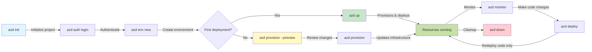
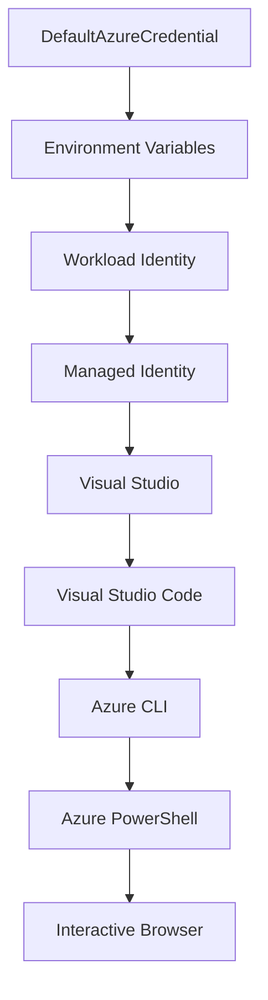

# AZD Bases - Comprendre Azure Developer CLI

# AZD Bases - Concepts clés et fondamentaux

**Navigation du chapitre :**
- **📚 Accueil du cours** : [AZD pour débutants](../../README.md)
- **📖 Chapitre actuel** : Chapitre 1 - Fondations & Démarrage rapide
- **⬅️ Précédent** : [Aperçu du cours](../../README.md#-chapter-1-foundation--quick-start)
- **➡️ Suivant** : [Installation & Configuration](installation.md)
- **🚀 Chapitre suivant** : [Chapitre 2 : Développement axé sur l'IA](../microsoft-foundry/microsoft-foundry-integration.md)

## Introduction

Cette leçon vous présente Azure Developer CLI (azd), un outil en ligne de commande puissant qui accélère votre transition du développement local au déploiement sur Azure. Vous apprendrez les concepts fondamentaux, les fonctionnalités principales et comprendrez comment azd simplifie le déploiement d'applications cloud-native.

## Objectifs d'apprentissage

À la fin de cette leçon, vous serez capable de :
- Comprendre ce qu'est Azure Developer CLI et son objectif principal
- Découvrir les concepts clés des modèles, environnements et services
- Explorer les fonctionnalités principales, notamment le développement basé sur des modèles et l'infrastructure en tant que code
- Comprendre la structure et le flux de travail d'un projet azd
- Être prêt à installer et configurer azd pour votre environnement de développement

## Résultats d'apprentissage

Après avoir terminé cette leçon, vous serez capable de :
- Expliquer le rôle d'azd dans les flux de travail modernes de développement cloud
- Identifier les composants de la structure d'un projet azd
- Décrire comment les modèles, environnements et services fonctionnent ensemble
- Comprendre les avantages de l'infrastructure en tant que code avec azd
- Reconnaître les différentes commandes azd et leurs objectifs

## Qu'est-ce qu'Azure Developer CLI (azd) ?

Azure Developer CLI (azd) est un outil en ligne de commande conçu pour accélérer votre transition du développement local au déploiement sur Azure. Il simplifie le processus de création, de déploiement et de gestion des applications cloud-native sur Azure.

### 🎯 Pourquoi utiliser AZD ? Une comparaison concrète

Comparons le déploiement d'une application web simple avec une base de données :

#### ❌ SANS AZD : Déploiement manuel sur Azure (30+ minutes)

```bash
# Step 1: Create resource group
az group create --name myapp-rg --location eastus

# Step 2: Create App Service Plan
az appservice plan create --name myapp-plan \
  --resource-group myapp-rg \
  --sku B1 --is-linux

# Step 3: Create Web App
az webapp create --name myapp-web-unique123 \
  --resource-group myapp-rg \
  --plan myapp-plan \
  --runtime "NODE:18-lts"

# Step 4: Create Cosmos DB account (10-15 minutes)
az cosmosdb create --name myapp-cosmos-unique123 \
  --resource-group myapp-rg \
  --kind MongoDB

# Step 5: Create database
az cosmosdb mongodb database create \
  --account-name myapp-cosmos-unique123 \
  --resource-group myapp-rg \
  --name tododb

# Step 6: Create collection
az cosmosdb mongodb collection create \
  --account-name myapp-cosmos-unique123 \
  --resource-group myapp-rg \
  --database-name tododb \
  --name todos

# Step 7: Get connection string
CONN_STR=$(az cosmosdb keys list \
  --name myapp-cosmos-unique123 \
  --resource-group myapp-rg \
  --type connection-strings \
  --query "connectionStrings[0].connectionString" -o tsv)

# Step 8: Configure app settings
az webapp config appsettings set \
  --name myapp-web-unique123 \
  --resource-group myapp-rg \
  --settings MONGODB_URI="$CONN_STR"

# Step 9: Enable logging
az webapp log config --name myapp-web-unique123 \
  --resource-group myapp-rg \
  --application-logging filesystem \
  --detailed-error-messages true

# Step 10: Set up Application Insights
az monitor app-insights component create \
  --app myapp-insights \
  --location eastus \
  --resource-group myapp-rg

# Step 11: Link App Insights to Web App
INSTRUMENTATION_KEY=$(az monitor app-insights component show \
  --app myapp-insights \
  --resource-group myapp-rg \
  --query "instrumentationKey" -o tsv)

az webapp config appsettings set \
  --name myapp-web-unique123 \
  --resource-group myapp-rg \
  --settings APPINSIGHTS_INSTRUMENTATIONKEY="$INSTRUMENTATION_KEY"

# Step 12: Build application locally
npm install
npm run build

# Step 13: Create deployment package
zip -r app.zip . -x "*.git*" "node_modules/*"

# Step 14: Deploy application
az webapp deployment source config-zip \
  --resource-group myapp-rg \
  --name myapp-web-unique123 \
  --src app.zip

# Step 15: Wait and pray it works 🙏
# (No automated validation, manual testing required)
```

**Problèmes :**
- ❌ 15+ commandes à mémoriser et exécuter dans l'ordre
- ❌ 30-45 minutes de travail manuel
- ❌ Risque élevé d'erreurs (fautes de frappe, mauvais paramètres)
- ❌ Chaînes de connexion exposées dans l'historique du terminal
- ❌ Pas de retour en arrière automatisé en cas d'échec
- ❌ Difficile à reproduire pour les membres de l'équipe
- ❌ Différent à chaque fois (non reproductible)

#### ✅ AVEC AZD : Déploiement automatisé (5 commandes, 10-15 minutes)

```bash
# Step 1: Initialize from template
azd init --template todo-nodejs-mongo

# Step 2: Authenticate
azd auth login

# Step 3: Create environment
azd env new dev

# Step 4: Preview changes (optional but recommended)
azd provision --preview

# Step 5: Deploy everything
azd up

# ✨ Done! Everything is deployed, configured, and monitored
```

**Avantages :**
- ✅ **5 commandes** contre 15+ étapes manuelles
- ✅ **10-15 minutes** au total (principalement en attente d'Azure)
- ✅ **Zéro erreur** - automatisé et testé
- ✅ **Gestion sécurisée des secrets** via Key Vault
- ✅ **Retour en arrière automatique** en cas d'échec
- ✅ **Entièrement reproductible** - même résultat à chaque fois
- ✅ **Prêt pour l'équipe** - tout le monde peut déployer avec les mêmes commandes
- ✅ **Infrastructure en tant que code** - modèles Bicep versionnés
- ✅ **Surveillance intégrée** - Application Insights configuré automatiquement

### 📊 Réduction du temps et des erreurs

| Indicateur | Déploiement manuel | Déploiement AZD | Amélioration |
|:-----------|:-------------------|:----------------|:-------------|
| **Commandes** | 15+ | 5 | 67% de moins |
| **Temps** | 30-45 min | 10-15 min | 60% plus rapide |
| **Taux d'erreur** | ~40% | <5% | Réduction de 88% |
| **Consistance** | Faible (manuel) | 100% (automatisé) | Parfait |
| **Intégration de l'équipe** | 2-4 heures | 30 minutes | 75% plus rapide |
| **Temps de retour en arrière** | 30+ min (manuel) | 2 min (automatisé) | 93% plus rapide |

## Concepts clés

### Modèles
Les modèles sont la base d'azd. Ils contiennent :
- **Code de l'application** - Votre code source et ses dépendances
- **Définitions d'infrastructure** - Ressources Azure définies en Bicep ou Terraform
- **Fichiers de configuration** - Paramètres et variables d'environnement
- **Scripts de déploiement** - Flux de travail de déploiement automatisés

### Environnements
Les environnements représentent différentes cibles de déploiement :
- **Développement** - Pour les tests et le développement
- **Préproduction** - Environnement avant la production
- **Production** - Environnement de production en direct

Chaque environnement conserve ses propres :
- Groupe de ressources Azure
- Paramètres de configuration
- État de déploiement

### Services
Les services sont les blocs de construction de votre application :
- **Frontend** - Applications web, SPAs
- **Backend** - APIs, microservices
- **Base de données** - Solutions de stockage de données
- **Stockage** - Stockage de fichiers et de blobs

## Fonctionnalités principales

### 1. Développement basé sur des modèles
```bash
# Browse available templates
azd template list

# Initialize from a template
azd init --template <template-name>
```

### 2. Infrastructure en tant que code
- **Bicep** - Langage spécifique à Azure
- **Terraform** - Outil d'infrastructure multi-cloud
- **Modèles ARM** - Modèles Azure Resource Manager

### 3. Flux de travail intégrés
```bash
# Complete deployment workflow
azd up            # Provision + Deploy this is hands off for first time setup

# 🧪 NEW: Preview infrastructure changes before deployment (SAFE)
azd provision --preview    # Simulate infrastructure deployment without making changes

azd provision     # Create Azure resources if you update the infrastructure use this
azd deploy        # Deploy application code or redeploy application code once update
azd down          # Clean up resources
```

#### 🛡️ Planification sécurisée de l'infrastructure avec Preview
La commande `azd provision --preview` est révolutionnaire pour des déploiements sécurisés :
- **Analyse en mode simulation** - Montre ce qui sera créé, modifié ou supprimé
- **Risque zéro** - Aucun changement réel n'est effectué dans votre environnement Azure
- **Collaboration en équipe** - Partagez les résultats de la simulation avant le déploiement
- **Estimation des coûts** - Comprenez les coûts des ressources avant de vous engager

```bash
# Example preview workflow
azd provision --preview           # See what will change
# Review the output, discuss with team
azd provision                     # Apply changes with confidence
```

### 📊 Visuel : Flux de travail de développement AZD



**Explication du flux de travail :**
1. **Init** - Démarrer avec un modèle ou un nouveau projet
2. **Auth** - S'authentifier avec Azure
3. **Environnement** - Créer un environnement de déploiement isolé
4. **Preview** - 🆕 Toujours prévisualiser les changements d'infrastructure en premier (bonne pratique)
5. **Provision** - Créer/mettre à jour les ressources Azure
6. **Deploy** - Pousser votre code d'application
7. **Monitor** - Observer les performances de l'application
8. **Iterate** - Apporter des modifications et redéployer le code
9. **Cleanup** - Supprimer les ressources une fois terminé

### 4. Gestion des environnements
```bash
# Create and manage environments
azd env new <environment-name>
azd env select <environment-name>
azd env list
```

## 📁 Structure du projet

Structure typique d'un projet azd :
```
my-app/
├── .azd/                    # azd configuration
│   └── config.json
├── .azure/                  # Azure deployment artifacts
├── .devcontainer/          # Development container config
├── .github/workflows/      # GitHub Actions
├── .vscode/               # VS Code settings
├── infra/                 # Infrastructure code
│   ├── main.bicep        # Main infrastructure template
│   ├── main.parameters.json
│   └── modules/          # Reusable modules
├── src/                  # Application source code
│   ├── api/             # Backend services
│   └── web/             # Frontend application
├── azure.yaml           # azd project configuration
└── README.md
```

## 🔧 Fichiers de configuration

### azure.yaml
Le fichier principal de configuration du projet :
```yaml
name: my-awesome-app
metadata:
  template: my-template@1.0.0

services:
  web:
    project: ./src/web
    language: js
    host: appservice
  api:
    project: ./src/api
    language: js
    host: appservice

hooks:
  preprovision:
    shell: pwsh
    run: echo "Preparing to provision..."
```

### .azure/config.json
Configuration spécifique à l'environnement :
```json
{
  "version": 1,
  "defaultEnvironment": "dev",
  "environments": {
    "dev": {
      "subscriptionId": "your-subscription-id",
      "location": "eastus"
    }
  }
}
```

## 🎪 Flux de travail courants avec exercices pratiques

> **💡 Astuce d'apprentissage :** Suivez ces exercices dans l'ordre pour développer vos compétences AZD progressivement.

### 🎯 Exercice 1 : Initialiser votre premier projet

**Objectif :** Créer un projet AZD et explorer sa structure

**Étapes :**
```bash
# Use a proven template
azd init --template todo-nodejs-mongo

# Explore the generated files
ls -la  # View all files including hidden ones

# Key files created:
# - azure.yaml (main config)
# - infra/ (infrastructure code)
# - src/ (application code)
```

**✅ Succès :** Vous avez les répertoires azure.yaml, infra/, et src/

---

### 🎯 Exercice 2 : Déployer sur Azure

**Objectif :** Réaliser un déploiement de bout en bout

**Étapes :**
```bash
# 1. Authenticate
az login && azd auth login

# 2. Create environment
azd env new dev
azd env set AZURE_LOCATION eastus

# 3. Preview changes (RECOMMENDED)
azd provision --preview

# 4. Deploy everything
azd up

# 5. Verify deployment
azd show    # View your app URL
```

**Temps estimé :** 10-15 minutes  
**✅ Succès :** L'URL de l'application s'ouvre dans le navigateur

---

### 🎯 Exercice 3 : Environnements multiples

**Objectif :** Déployer sur dev et préproduction

**Étapes :**
```bash
# Already have dev, create staging
azd env new staging
azd env set AZURE_LOCATION westus2
azd up

# Switch between them
azd env list
azd env select dev
```

**✅ Succès :** Deux groupes de ressources distincts dans le portail Azure

---

### 🛡️ Remise à zéro : `azd down --force --purge`

Lorsque vous avez besoin de tout réinitialiser :

```bash
azd down --force --purge
```

**Ce que cela fait :**
- `--force` : Pas de demandes de confirmation
- `--purge` : Supprime tout état local et les ressources Azure

**À utiliser lorsque :**
- Le déploiement a échoué en cours de route
- Changement de projet
- Besoin d'un nouveau départ

---

## 🎪 Référence du flux de travail original

### Démarrer un nouveau projet
```bash
# Method 1: Use existing template
azd init --template todo-nodejs-mongo

# Method 2: Start from scratch
azd init

# Method 3: Use current directory
azd init .
```

### Cycle de développement
```bash
# Set up development environment
azd auth login
azd env new dev
azd env select dev

# Deploy everything
azd up

# Make changes and redeploy
azd deploy

# Clean up when done
azd down --force --purge # command in the Azure Developer CLI is a **hard reset** for your environment—especially useful when you're troubleshooting failed deployments, cleaning up orphaned resources, or prepping for a fresh redeploy.
```

## Comprendre `azd down --force --purge`
La commande `azd down --force --purge` est un moyen puissant de démanteler complètement votre environnement azd et toutes les ressources associées. Voici une explication de ce que chaque option fait :
```
--force
```
- Ignore les demandes de confirmation.
- Utile pour l'automatisation ou les scripts où une saisie manuelle n'est pas possible.
- Assure que le démantèlement se poursuit sans interruption, même si le CLI détecte des incohérences.

```
--purge
```
Supprime **toutes les métadonnées associées**, y compris :
État de l'environnement
Dossier local `.azure`
Informations de déploiement mises en cache
Empêche azd de "se souvenir" des déploiements précédents, ce qui peut causer des problèmes comme des groupes de ressources non correspondants ou des références de registre obsolètes.

### Pourquoi utiliser les deux ?
Lorsque vous êtes bloqué avec `azd up` en raison d'un état persistant ou de déploiements partiels, cette combinaison garantit un **nouveau départ**.

C'est particulièrement utile après des suppressions manuelles de ressources dans le portail Azure ou lors du changement de modèles, d'environnements ou de conventions de nommage des groupes de ressources.

### Gestion des environnements multiples
```bash
# Create staging environment
azd env new staging
azd env select staging
azd up

# Switch back to dev
azd env select dev

# Compare environments
azd env list
```

## 🔐 Authentification et identifiants

Comprendre l'authentification est crucial pour des déploiements azd réussis. Azure utilise plusieurs méthodes d'authentification, et azd exploite la même chaîne d'identifiants utilisée par d'autres outils Azure.

### Authentification Azure CLI (`az login`)

Avant d'utiliser azd, vous devez vous authentifier avec Azure. La méthode la plus courante est d'utiliser Azure CLI :

```bash
# Interactive login (opens browser)
az login

# Login with specific tenant
az login --tenant <tenant-id>

# Login with service principal
az login --service-principal -u <app-id> -p <password> --tenant <tenant-id>

# Check current login status
az account show

# List available subscriptions
az account list --output table

# Set default subscription
az account set --subscription <subscription-id>
```

### Flux d'authentification
1. **Connexion interactive** : Ouvre votre navigateur par défaut pour l'authentification
2. **Code de périphérique** : Pour les environnements sans accès au navigateur
3. **Principal de service** : Pour les scénarios d'automatisation et CI/CD
4. **Identité gérée** : Pour les applications hébergées sur Azure

### Chaîne DefaultAzureCredential

`DefaultAzureCredential` est un type d'identifiant qui offre une expérience d'authentification simplifiée en essayant automatiquement plusieurs sources d'identifiants dans un ordre spécifique :

#### Ordre de la chaîne d'identifiants


#### 1. Variables d'environnement
```bash
# Set environment variables for service principal
export AZURE_CLIENT_ID="<app-id>"
export AZURE_CLIENT_SECRET="<password>"
export AZURE_TENANT_ID="<tenant-id>"
```

#### 2. Identité de charge de travail (Kubernetes/GitHub Actions)
Utilisé automatiquement dans :
- Azure Kubernetes Service (AKS) avec identité de charge de travail
- GitHub Actions avec fédération OIDC
- Autres scénarios d'identité fédérée

#### 3. Identité gérée
Pour les ressources Azure telles que :
- Machines virtuelles
- App Service
- Azure Functions
- Instances de conteneurs

```bash
# Check if running on Azure resource with managed identity
az account show --query "user.type" --output tsv
# Returns: "servicePrincipal" if using managed identity
```

#### 4. Intégration des outils de développement
- **Visual Studio** : Utilise automatiquement le compte connecté
- **VS Code** : Utilise les identifiants de l'extension Azure Account
- **Azure CLI** : Utilise les identifiants `az login` (le plus courant pour le développement local)

### Configuration de l'authentification AZD

```bash
# Method 1: Use Azure CLI (Recommended for development)
az login
azd auth login  # Uses existing Azure CLI credentials

# Method 2: Direct azd authentication
azd auth login --use-device-code  # For headless environments

# Method 3: Check authentication status
azd auth login --check-status

# Method 4: Logout and re-authenticate
azd auth logout
azd auth login
```

### Bonnes pratiques d'authentification

#### Pour le développement local
```bash
# 1. Login with Azure CLI
az login

# 2. Verify correct subscription
az account show
az account set --subscription "Your Subscription Name"

# 3. Use azd with existing credentials
azd auth login
```

#### Pour les pipelines CI/CD
```yaml
# GitHub Actions example
- name: Azure Login
  uses: azure/login@v1
  with:
    creds: ${{ secrets.AZURE_CREDENTIALS }}

- name: Deploy with azd
  run: |
    azd auth login --client-id ${{ secrets.AZURE_CLIENT_ID }} \
                    --client-secret ${{ secrets.AZURE_CLIENT_SECRET }} \
                    --tenant-id ${{ secrets.AZURE_TENANT_ID }}
    azd up --no-prompt
```

#### Pour les environnements de production
- Utilisez **Identité gérée** lorsque vous exécutez des ressources sur Azure
- Utilisez **Principal de service** pour les scénarios d'automatisation
- Évitez de stocker les identifiants dans le code ou les fichiers de configuration
- Utilisez **Azure Key Vault** pour les configurations sensibles

### Problèmes courants d'authentification et solutions

#### Problème : "Aucun abonnement trouvé"
```bash
# Solution: Set default subscription
az account list --output table
az account set --subscription "<subscription-id>"
azd env set AZURE_SUBSCRIPTION_ID "<subscription-id>"
```

#### Problème : "Permissions insuffisantes"
```bash
# Solution: Check and assign required roles
az role assignment list --assignee $(az account show --query user.name --output tsv)

# Common required roles:
# - Contributor (for resource management)
# - User Access Administrator (for role assignments)
```

#### Problème : "Jeton expiré"
```bash
# Solution: Re-authenticate
az logout
az login
azd auth logout
azd auth login
```

### Authentification dans différents scénarios

#### Développement local
```bash
# Personal development account
az login
azd auth login
```

#### Développement en équipe
```bash
# Use specific tenant for organization
az login --tenant contoso.onmicrosoft.com
azd auth login
```

#### Scénarios multi-locataires
```bash
# Switch between tenants
az login --tenant tenant1.onmicrosoft.com
# Deploy to tenant 1
azd up

az login --tenant tenant2.onmicrosoft.com  
# Deploy to tenant 2
azd up
```

### Considérations de sécurité

1. **Stockage des identifiants** : Ne jamais stocker les identifiants dans le code source
2. **Limitation de la portée** : Utilisez le principe du moindre privilège pour les principaux de service
3. **Rotation des jetons** : Faites tourner régulièrement les secrets des principaux de service
4. **Traçabilité** : Surveillez les activités d'authentification et de déploiement
5. **Sécurité réseau** : Utilisez des points de terminaison privés lorsque cela est possible

### Dépannage de l'authentification

```bash
# Debug authentication issues
azd auth login --check-status
az account show
az account get-access-token

# Common diagnostic commands
whoami                          # Current user context
az ad signed-in-user show      # Azure AD user details
az group list                  # Test resource access
```

## Comprendre `azd down --force --purge`

### Découverte
```bash
azd template list              # Browse templates
azd template show <template>   # Template details
azd init --help               # Initialization options
```

### Gestion de projet
```bash
azd show                     # Project overview
azd env show                 # Current environment
azd config list             # Configuration settings
```

### Surveillance
```bash
azd monitor                  # Open Azure portal
azd pipeline config          # Set up CI/CD
azd logs                     # View application logs
```

## Bonnes pratiques

### 1. Utilisez des noms significatifs
```bash
# Good
azd env new production-east
azd init --template web-app-secure

# Avoid
azd env new env1
azd init --template template1
```

### 2. Exploitez les modèles
- Commencez avec des modèles existants
- Personnalisez selon vos besoins
- Créez des modèles réutilisables pour votre organisation

### 3. Isolation des environnements
- Utilisez des environnements séparés pour dev/staging/prod
- Ne déployez jamais directement en production depuis une machine locale
- Utilisez des pipelines CI/CD pour les déploiements en production

### 4. Gestion de la configuration
- Utilisez des variables d'environnement pour les données sensibles
- Conservez la configuration dans le contrôle de version
- Documentez les paramètres spécifiques à l'environnement

## Progression de l'apprentissage

### Débutant (Semaine 1-2)
1. Installer azd et s'authentifier
2. Déployer un modèle simple
3. Comprendre la structure du projet
4. Apprendre les commandes de base (up, down, deploy)

### Intermédiaire (Semaine 3-4)
1. Personnaliser les modèles
2. Gérer plusieurs environnements
3. Comprendre le code d'infrastructure
4. Configurer des pipelines CI/CD

### Avancé (Semaine 5+)
1. Créer des modèles personnalisés
2. Modèles d'infrastructure avancés
3. Déploiements multi-régions
4. Configurations de niveau entreprise

## Prochaines étapes

**📖 Continuez l'apprentissage du chapitre 1 :**
- [Installation et configuration](installation.md) - Installez et configurez azd
- [Votre premier projet](first-project.md) - Tutoriel pratique complet
- [Guide de configuration](configuration.md) - Options de configuration avancées

**🎯 Prêt pour le prochain chapitre ?**
- [Chapitre 2 : Développement axé sur l'IA](../microsoft-foundry/microsoft-foundry-integration.md) - Commencez à créer des applications IA

## Ressources supplémentaires

- [Vue d'ensemble de l'Azure Developer CLI](https://learn.microsoft.com/en-us/azure/developer/azure-developer-cli/)
- [Galerie de modèles](https://azure.github.io/awesome-azd/)
- [Exemples communautaires](https://github.com/Azure-Samples)

---

## 🙋 Questions fréquentes

### Questions générales

**Q : Quelle est la différence entre AZD et Azure CLI ?**

R : Azure CLI (`az`) sert à gérer des ressources Azure individuelles. AZD (`azd`) est conçu pour gérer des applications complètes :

```bash
# Azure CLI - Low-level resource management
az webapp create --name myapp --resource-group rg
az sql server create --name myserver --resource-group rg
# ...many more commands needed

# AZD - Application-level management
azd up  # Deploys entire app with all resources
```

**Pour simplifier :**
- `az` = Travailler sur des briques Lego individuelles
- `azd` = Travailler avec des ensembles Lego complets

---

**Q : Dois-je connaître Bicep ou Terraform pour utiliser AZD ?**

R : Non ! Commencez avec des modèles :
```bash
# Use existing template - no IaC knowledge needed
azd init --template todo-nodejs-mongo
azd up
```

Vous pouvez apprendre Bicep plus tard pour personnaliser l'infrastructure. Les modèles fournissent des exemples fonctionnels pour apprendre.

---

**Q : Combien coûte l'exécution des modèles AZD ?**

R : Les coûts varient selon le modèle. La plupart des modèles de développement coûtent entre 50 et 150 $/mois :

```bash
# Preview costs before deploying
azd provision --preview

# Always cleanup when not using
azd down --force --purge  # Removes all resources
```

**Astuce :** Utilisez les niveaux gratuits lorsque disponibles :
- App Service : Niveau F1 (Gratuit)
- Azure OpenAI : 50 000 jetons/mois gratuits
- Cosmos DB : Niveau gratuit de 1000 RU/s

---

**Q : Puis-je utiliser AZD avec des ressources Azure existantes ?**

R : Oui, mais il est plus simple de commencer à partir de zéro. AZD fonctionne mieux lorsqu'il gère tout le cycle de vie. Pour les ressources existantes :

```bash
# Option 1: Import existing resources (advanced)
azd init
# Then modify infra/ to reference existing resources

# Option 2: Start fresh (recommended)
azd init --template matching-your-stack
azd up  # Creates new environment
```

---

**Q : Comment partager mon projet avec mes collègues ?**

R : Commitez le projet AZD dans Git (mais PAS le dossier .azure) :

```bash
# Already in .gitignore by default
.azure/        # Contains secrets and environment data
*.env          # Environment variables

# Team members then:
git clone <your-repo>
azd auth login
azd env new <their-name>-dev
azd up
```

Tout le monde obtient une infrastructure identique à partir des mêmes modèles.

---

### Questions de dépannage

**Q : "azd up" a échoué à mi-chemin. Que faire ?**

R : Vérifiez l'erreur, corrigez-la, puis réessayez :

```bash
# View detailed logs
azd show

# Common fixes:

# 1. If quota exceeded:
azd env set AZURE_LOCATION "westus2"  # Try different region

# 2. If resource name conflict:
azd down --force --purge  # Clean slate
azd up  # Retry

# 3. If auth expired:
az login
azd auth login
azd up
```

**Problème le plus courant :** Mauvais abonnement Azure sélectionné
```bash
az account list --output table
az account set --subscription "<correct-subscription>"
```

---

**Q : Comment déployer uniquement les modifications de code sans reprovisionner ?**

R : Utilisez `azd deploy` au lieu de `azd up` :

```bash
azd up          # First time: provision + deploy (slow)

# Make code changes...

azd deploy      # Subsequent times: deploy only (fast)
```

Comparaison de vitesse :
- `azd up` : 10-15 minutes (provisionne l'infrastructure)
- `azd deploy` : 2-5 minutes (code uniquement)

---

**Q : Puis-je personnaliser les modèles d'infrastructure ?**

R : Oui ! Modifiez les fichiers Bicep dans `infra/` :

```bash
# After azd init
cd infra/
code main.bicep  # Edit in VS Code

# Preview changes
azd provision --preview

# Apply changes
azd provision
```

**Astuce :** Commencez petit - changez d'abord les SKUs :
```bicep
// infra/main.bicep
sku: {
  name: 'B1'  // Change to 'P1V2' for production
}
```

---

**Q : Comment supprimer tout ce qu'AZD a créé ?**

R : Une commande supprime toutes les ressources :

```bash
azd down --force --purge

# This deletes:
# - All Azure resources
# - Resource group
# - Local environment state
# - Cached deployment data
```

**À toujours exécuter lorsque :**
- Vous avez terminé de tester un modèle
- Vous passez à un projet différent
- Vous voulez repartir de zéro

**Économies :** Supprimer les ressources inutilisées = 0 $ de frais

---

**Q : Que faire si j'ai accidentellement supprimé des ressources dans le portail Azure ?**

R : L'état d'AZD peut devenir désynchronisé. Approche de remise à zéro :

```bash
# 1. Remove local state
azd down --force --purge

# 2. Start fresh
azd up

# Alternative: Let AZD detect and fix
azd provision  # Will create missing resources
```

---

### Questions avancées

**Q : Puis-je utiliser AZD dans des pipelines CI/CD ?**

R : Oui ! Exemple avec GitHub Actions :

```yaml
# .github/workflows/deploy.yml
name: Deploy with AZD

on:
  push:
    branches: [main]

jobs:
  deploy:
    runs-on: ubuntu-latest
    steps:
      - uses: actions/checkout@v2
      
      - name: Install azd
        run: curl -fsSL https://aka.ms/install-azd.sh | bash
      
      - name: Azure Login
        run: |
          azd auth login \
            --client-id ${{ secrets.AZURE_CLIENT_ID }} \
            --client-secret ${{ secrets.AZURE_CLIENT_SECRET }} \
            --tenant-id ${{ secrets.AZURE_TENANT_ID }}
      
      - name: Deploy
        run: azd up --no-prompt
```

---

**Q : Comment gérer les secrets et données sensibles ?**

R : AZD s'intègre automatiquement avec Azure Key Vault :

```bash
# Secrets are stored in Key Vault, not in code
azd env set DATABASE_PASSWORD "$(openssl rand -base64 32)"

# AZD automatically:
# 1. Creates Key Vault
# 2. Stores secret
# 3. Grants app access via Managed Identity
# 4. Injects at runtime
```

**Ne jamais commettre :**
- Dossier `.azure/` (contient les données d'environnement)
- Fichiers `.env` (secrets locaux)
- Chaînes de connexion

---

**Q : Puis-je déployer dans plusieurs régions ?**

R : Oui, créez un environnement par région :

```bash
# East US environment
azd env new prod-eastus
azd env set AZURE_LOCATION eastus
azd up

# West Europe environment
azd env new prod-westeurope
azd env set AZURE_LOCATION westeurope
azd up

# Each environment is independent
azd env list
```

Pour des applications véritablement multi-régions, personnalisez les modèles Bicep pour déployer simultanément dans plusieurs régions.

---

**Q : Où puis-je obtenir de l'aide si je suis bloqué ?**

1. **Documentation AZD :** https://learn.microsoft.com/azure/developer/azure-developer-cli/
2. **Problèmes GitHub :** https://github.com/Azure/azure-dev/issues
3. **Discord :** [Azure Discord](https://discord.gg/microsoft-azure) - Canal #azure-developer-cli
4. **Stack Overflow :** Tag `azure-developer-cli`
5. **Ce cours :** [Guide de dépannage](../troubleshooting/common-issues.md)

**Astuce :** Avant de poser une question, exécutez :
```bash
azd show       # Shows current state
azd version    # Shows your version
```
Incluez ces informations dans votre question pour obtenir de l'aide plus rapidement.

---

## 🎓 Et maintenant ?

Vous comprenez maintenant les bases d'AZD. Choisissez votre chemin :

### 🎯 Pour les débutants :
1. **Suivant :** [Installation et configuration](installation.md) - Installez AZD sur votre machine
2. **Ensuite :** [Votre premier projet](first-project.md) - Déployez votre première application
3. **Pratique :** Complétez les 3 exercices de cette leçon

### 🚀 Pour les développeurs IA :
1. **Passez à :** [Chapitre 2 : Développement axé sur l'IA](../microsoft-foundry/microsoft-foundry-integration.md)
2. **Déployez :** Commencez avec `azd init --template get-started-with-ai-chat`
3. **Apprenez :** Construisez tout en déployant

### 🏗️ Pour les développeurs expérimentés :
1. **Revue :** [Guide de configuration](configuration.md) - Paramètres avancés
2. **Explorez :** [Infrastructure en tant que code](../deployment/provisioning.md) - Approfondissement sur Bicep
3. **Construisez :** Créez des modèles personnalisés pour votre stack

---

**Navigation du chapitre :**
- **📚 Accueil du cours** : [AZD pour les débutants](../../README.md)
- **📖 Chapitre actuel** : Chapitre 1 - Fondations et démarrage rapide  
- **⬅️ Précédent** : [Vue d'ensemble du cours](../../README.md#-chapter-1-foundation--quick-start)
- **➡️ Suivant** : [Installation et configuration](installation.md)
- **🚀 Chapitre suivant** : [Chapitre 2 : Développement axé sur l'IA](../microsoft-foundry/microsoft-foundry-integration.md)

---

<!-- CO-OP TRANSLATOR DISCLAIMER START -->
**Avertissement** :  
Ce document a été traduit à l'aide du service de traduction automatique [Co-op Translator](https://github.com/Azure/co-op-translator). Bien que nous nous efforcions d'assurer l'exactitude, veuillez noter que les traductions automatisées peuvent contenir des erreurs ou des inexactitudes. Le document original dans sa langue d'origine doit être considéré comme la source faisant autorité. Pour des informations critiques, il est recommandé de recourir à une traduction humaine professionnelle. Nous ne sommes pas responsables des malentendus ou des interprétations erronées résultant de l'utilisation de cette traduction.
<!-- CO-OP TRANSLATOR DISCLAIMER END -->