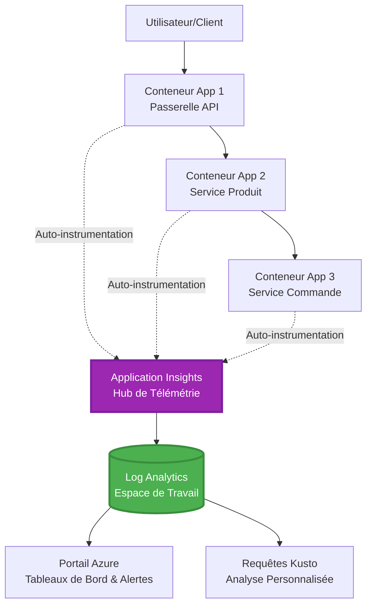
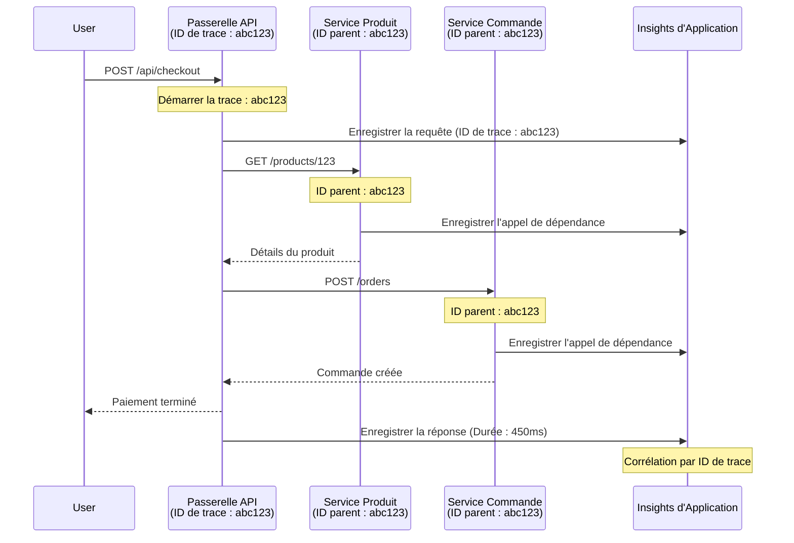

# Intégration d'Application Insights avec AZD

⏱️ **Temps estimé** : 40-50 minutes | 💰 **Impact sur le coût** : ~5-15 $/mois | ⭐ **Complexité** : Intermédiaire

**📚 Parcours d'apprentissage :**
- ← Précédent : [Vérifications préalables](preflight-checks.md) - Validation avant déploiement
- 🎯 **Vous êtes ici** : Intégration d'Application Insights (Surveillance, télémétrie, débogage)
- → Suivant : [Guide de déploiement](../deployment/deployment-guide.md) - Déployer sur Azure
- 🏠 [Accueil du cours](../../README.md)

---

## Ce que vous apprendrez

En complétant cette leçon, vous serez capable de :
- Intégrer **Application Insights** automatiquement dans les projets AZD
- Configurer le **suivi distribué** pour les microservices
- Implémenter une **télémétrie personnalisée** (métriques, événements, dépendances)
- Configurer des **métriques en direct** pour une surveillance en temps réel
- Créer des **alertes et tableaux de bord** à partir des déploiements AZD
- Déboguer les problèmes en production avec des **requêtes de télémétrie**
- Optimiser les **coûts et stratégies d'échantillonnage**
- Surveiller les **applications IA/LLM** (tokens, latence, coûts)

## Pourquoi Application Insights avec AZD est important

### Le défi : Observabilité en production

**Sans Application Insights :**
```
❌ No visibility into production behavior
❌ Manual log aggregation across services
❌ Reactive debugging (wait for customer complaints)
❌ No performance metrics
❌ Cannot trace requests across services
❌ Unknown failure rates and bottlenecks
```

**Avec Application Insights + AZD :**
```
✅ Automatic telemetry collection
✅ Centralized logs from all services
✅ Proactive issue detection
✅ End-to-end request tracing
✅ Performance metrics and insights
✅ Real-time dashboards
✅ AZD provisions everything automatically
```

**Analogie** : Application Insights est comme une "boîte noire" d'enregistreur de vol + tableau de bord de cockpit pour votre application. Vous voyez tout ce qui se passe en temps réel et pouvez rejouer tout incident.

---

## Vue d'ensemble de l'architecture

### Application Insights dans l'architecture AZD


### Ce qui est surveillé automatiquement

| Type de télémétrie | Ce qu'il capture | Cas d'utilisation |
|--------------------|------------------|-------------------|
| **Requêtes** | Requêtes HTTP, codes de statut, durée | Surveillance des performances API |
| **Dépendances** | Appels externes (BD, API, stockage) | Identifier les goulots d'étranglement |
| **Exceptions** | Erreurs non gérées avec traces de pile | Débogage des échecs |
| **Événements personnalisés** | Événements métier (inscription, achat) | Analyses et entonnoirs |
| **Métriques** | Compteurs de performance, métriques personnalisées | Planification de capacité |
| **Traces** | Messages de journal avec gravité | Débogage et audit |
| **Disponibilité** | Tests de disponibilité et temps de réponse | Surveillance des SLA |

---

## Prérequis

### Outils requis

```bash
# Vérifier Azure Developer CLI
azd version
# ✅ Attendu : version azd 1.0.0 ou supérieure

# Vérifier Azure CLI
az --version
# ✅ Attendu : azure-cli 2.50.0 ou supérieure
```

### Exigences Azure

- Abonnement Azure actif
- Permissions pour créer :
  - Ressources Application Insights
  - Espaces de travail Log Analytics
  - Applications conteneurisées
  - Groupes de ressources

### Connaissances préalables

Vous devriez avoir complété :
- [Notions de base sur AZD](../getting-started/azd-basics.md) - Concepts fondamentaux d'AZD
- [Configuration](../getting-started/configuration.md) - Configuration de l'environnement
- [Premier projet](../getting-started/first-project.md) - Déploiement de base

---

## Leçon 1 : Application Insights automatique avec AZD

### Comment AZD configure Application Insights

AZD crée et configure automatiquement Application Insights lors du déploiement. Voyons comment cela fonctionne.

### Structure du projet

```
monitored-app/
├── azure.yaml                     # AZD configuration
├── infra/
│   ├── main.bicep                # Main infrastructure
│   ├── core/
│   │   └── monitoring.bicep      # Application Insights + Log Analytics
│   └── app/
│       └── api.bicep             # Container App with monitoring
└── src/
    ├── app.py                    # Application with telemetry
    ├── requirements.txt
    └── Dockerfile
```

---

### Étape 1 : Configurer AZD (azure.yaml)

**Fichier : `azure.yaml`**

```yaml
name: monitored-app
metadata:
  template: monitored-app@1.0.0

services:
  api:
    project: ./src
    language: python
    host: containerapp

# AZD automatically provisions monitoring!
```

**Et voilà !** AZD créera Application Insights par défaut. Aucune configuration supplémentaire nécessaire pour une surveillance de base.

---

### Étape 2 : Infrastructure de surveillance (Bicep)

**Fichier : `infra/core/monitoring.bicep`**

```bicep
param logAnalyticsName string
param applicationInsightsName string
param location string = resourceGroup().location
param tags object = {}

// Log Analytics Workspace (required for Application Insights)
resource logAnalytics 'Microsoft.OperationalInsights/workspaces@2022-10-01' = {
  name: logAnalyticsName
  location: location
  tags: tags
  properties: {
    sku: {
      name: 'PerGB2018'  // Pay-as-you-go pricing
    }
    retentionInDays: 30  // Keep logs for 30 days
    features: {
      enableLogAccessUsingOnlyResourcePermissions: true
    }
  }
}

// Application Insights
resource applicationInsights 'Microsoft.Insights/components@2020-02-02' = {
  name: applicationInsightsName
  location: location
  tags: tags
  kind: 'web'
  properties: {
    Application_Type: 'web'
    WorkspaceResourceId: logAnalytics.id
    IngestionMode: 'LogAnalytics'
    publicNetworkAccessForIngestion: 'Enabled'
    publicNetworkAccessForQuery: 'Enabled'
  }
}

// Outputs for Container Apps
output logAnalyticsWorkspaceId string = logAnalytics.id
output logAnalyticsWorkspaceName string = logAnalytics.name
output applicationInsightsConnectionString string = applicationInsights.properties.ConnectionString
output applicationInsightsInstrumentationKey string = applicationInsights.properties.InstrumentationKey
output applicationInsightsName string = applicationInsights.name
```

---

### Étape 3 : Connecter l'application conteneurisée à Application Insights

**Fichier : `infra/app/api.bicep`**

```bicep
param name string
param location string
param tags object = {}
param containerAppsEnvironmentName string
param applicationInsightsConnectionString string

resource containerApp 'Microsoft.App/containerApps@2023-05-01' = {
  name: name
  location: location
  tags: tags
  properties: {
    configuration: {
      ingress: {
        external: true
        targetPort: 8000
      }
      secrets: [
        {
          name: 'appinsights-connection-string'
          value: applicationInsightsConnectionString
        }
      ]
    }
    template: {
      containers: [
        {
          name: 'api'
          image: 'myregistry.azurecr.io/api:latest'
          resources: {
            cpu: json('0.5')
            memory: '1Gi'
          }
          env: [
            {
              name: 'APPLICATIONINSIGHTS_CONNECTION_STRING'
              secretRef: 'appinsights-connection-string'
            }
            {
              name: 'APPLICATIONINSIGHTS_ENABLED'
              value: 'true'
            }
          ]
        }
      ]
    }
  }
}

output uri string = 'https://${containerApp.properties.configuration.ingress.fqdn}'
```

---

### Étape 4 : Code applicatif avec télémétrie

**Fichier : `src/app.py`**

```python
from flask import Flask, request, jsonify
from opencensus.ext.azure.log_exporter import AzureLogHandler
from opencensus.ext.azure.trace_exporter import AzureExporter
from opencensus.ext.flask.flask_middleware import FlaskMiddleware
from opencensus.trace.samplers import ProbabilitySampler
import logging
import os

app = Flask(__name__)

# Obtenir la chaîne de connexion Application Insights
connection_string = os.environ.get('APPLICATIONINSIGHTS_CONNECTION_STRING')

if connection_string:
    # Configurer la traçabilité distribuée
    middleware = FlaskMiddleware(
        app,
        exporter=AzureExporter(connection_string=connection_string),
        sampler=ProbabilitySampler(rate=1.0)  # Échantillonnage à 100% pour le développement
    )
    
    # Configurer la journalisation
    logger = logging.getLogger(__name__)
    logger.addHandler(AzureLogHandler(connection_string=connection_string))
    logger.setLevel(logging.INFO)
    
    print("✅ Application Insights enabled")
else:
    logger = logging.getLogger(__name__)
    logger.setLevel(logging.INFO)
    print("⚠️ Application Insights not configured")

@app.route('/health')
def health():
    logger.info('Health check endpoint called')
    return jsonify({'status': 'healthy', 'monitoring': 'enabled'})

@app.route('/api/products')
def get_products():
    logger.info('Fetching products')
    
    # Simuler un appel à la base de données (suivi automatiquement comme dépendance)
    products = [
        {'id': 1, 'name': 'Laptop', 'price': 999.99},
        {'id': 2, 'name': 'Mouse', 'price': 29.99},
        {'id': 3, 'name': 'Keyboard', 'price': 79.99}
    ]
    
    logger.info(f'Returned {len(products)} products')
    return jsonify(products)

@app.route('/api/error-test')
def error_test():
    """Test error tracking"""
    logger.error('Testing error tracking')
    try:
        raise ValueError('This is a test exception')
    except Exception as e:
        logger.exception('Exception occurred in error-test endpoint')
        return jsonify({'error': str(e)}), 500

@app.route('/api/slow')
def slow_endpoint():
    """Test performance tracking"""
    import time
    logger.info('Slow endpoint called')
    time.sleep(3)  # Simuler une opération lente
    logger.warning('Endpoint took 3 seconds to respond')
    return jsonify({'message': 'Slow operation completed'})

if __name__ == '__main__':
    app.run(host='0.0.0.0', port=8000)
```

**Fichier : `src/requirements.txt`**

```txt
Flask==3.0.0
opencensus-ext-azure==1.1.13
opencensus-ext-flask==0.8.1
gunicorn==21.2.0
```

---

### Étape 5 : Déployer et vérifier

```bash
# Initialiser AZD
azd init

# Déployer (provisionne automatiquement Application Insights)
azd up

# Obtenir l'URL de l'application
APP_URL=$(azd env get-values | grep API_URL | cut -d '=' -f2 | tr -d '"')

# Générer la télémétrie
curl $APP_URL/health
curl $APP_URL/api/products
curl $APP_URL/api/error-test
curl $APP_URL/api/slow
```

**✅ Résultat attendu :**
```json
{
  "status": "healthy",
  "monitoring": "enabled"
}
```

---

### Étape 6 : Voir la télémétrie dans le portail Azure

```bash
# Obtenir les détails d'Application Insights
azd env get-values | grep APPLICATIONINSIGHTS

# Ouvrir dans le portail Azure
az monitor app-insights component show \
  --app $(azd env get-values | grep APPLICATIONINSIGHTS_NAME | cut -d '=' -f2 | tr -d '"') \
  --resource-group $(azd env get-values | grep AZURE_RESOURCE_GROUP | cut -d '=' -f2 | tr -d '"') \
  --query "appId" -o tsv
```

**Naviguez vers le Portail Azure → Application Insights → Recherche de transactions**

Vous devriez voir :
- ✅ Requêtes HTTP avec codes de statut
- ✅ Durée des requêtes (3+ secondes pour `/api/slow`)
- ✅ Détails des exceptions depuis `/api/error-test`
- ✅ Messages de journal personnalisés

---

## Leçon 2 : Télémétrie et événements personnalisés

### Suivre les événements métier

Ajoutons une télémétrie personnalisée pour les événements critiques.

**Fichier : `src/telemetry.py`**

```python
from opencensus.ext.azure import metrics_exporter
from opencensus.stats import aggregation as aggregation_module
from opencensus.stats import measure as measure_module
from opencensus.stats import stats as stats_module
from opencensus.stats import view as view_module
from opencensus.tags import tag_map as tag_map_module
from opencensus.ext.azure.log_exporter import AzureLogHandler
from opencensus.ext.azure.trace_exporter import AzureExporter
from opencensus.trace import tracer as tracer_module
import logging
import os

class TelemetryClient:
    """Custom telemetry client for Application Insights"""
    
    def __init__(self, connection_string=None):
        self.connection_string = connection_string or os.environ.get('APPLICATIONINSIGHTS_CONNECTION_STRING')
        
        if not self.connection_string:
            print("⚠️ Application Insights connection string not found")
            return
        
        # Configurer le journal
        self.logger = logging.getLogger(__name__)
        self.logger.addHandler(AzureLogHandler(connection_string=self.connection_string))
        self.logger.setLevel(logging.INFO)
        
        # Configurer l'exportateur de métriques
        self.stats = stats_module.stats
        self.view_manager = self.stats.view_manager
        self.stats_recorder = self.stats.stats_recorder
        
        exporter = metrics_exporter.new_metrics_exporter(
            connection_string=self.connection_string
        )
        self.view_manager.register_exporter(exporter)
        
        # Configurer le traceur
        self.tracer = tracer_module.Tracer(
            exporter=AzureExporter(connection_string=self.connection_string)
        )
        
        print("✅ Custom telemetry client initialized")
    
    def track_event(self, event_name: str, properties: dict = None):
        """Track custom business event"""
        properties = properties or {}
        self.logger.info(
            f"CustomEvent: {event_name}",
            extra={
                'custom_dimensions': {
                    'event_name': event_name,
                    **properties
                }
            }
        )
    
    def track_metric(self, metric_name: str, value: float, properties: dict = None):
        """Track custom metric"""
        properties = properties or {}
        self.logger.info(
            f"CustomMetric: {metric_name} = {value}",
            extra={
                'custom_dimensions': {
                    'metric_name': metric_name,
                    'value': value,
                    **properties
                }
            }
        )
    
    def track_dependency(self, name: str, dependency_type: str, duration: float, success: bool):
        """Track external dependency call"""
        with self.tracer.span(name=name) as span:
            span.add_attribute('dependency.type', dependency_type)
            span.add_attribute('duration', duration)
            span.add_attribute('success', success)

# Client de télémétrie global
telemetry = TelemetryClient()
```

### Mettre à jour l'application avec des événements personnalisés

**Fichier : `src/app.py` (amélioré)**

```python
from flask import Flask, request, jsonify
from telemetry import telemetry
import time
import random

app = Flask(__name__)

@app.route('/api/purchase', methods=['POST'])
def purchase():
    """Track purchase event with custom telemetry"""
    data = request.json
    product_id = data.get('product_id')
    quantity = data.get('quantity', 1)
    price = data.get('price', 0)
    
    # Suivre l'événement commercial
    telemetry.track_event('Purchase', {
        'product_id': product_id,
        'quantity': quantity,
        'total_amount': price * quantity,
        'user_id': request.headers.get('X-User-Id', 'anonymous')
    })
    
    # Suivre la métrique de revenu
    telemetry.track_metric('Revenue', price * quantity, {
        'product_id': product_id,
        'currency': 'USD'
    })
    
    return jsonify({
        'order_id': f'ORD-{random.randint(1000, 9999)}',
        'status': 'confirmed',
        'total': price * quantity
    })

@app.route('/api/search')
def search():
    """Track search queries"""
    query = request.args.get('q', '')
    
    start_time = time.time()
    
    # Simuler une recherche (serait une requête réelle à la base de données)
    results = [{'id': 1, 'name': f'Result for {query}'}]
    
    duration = (time.time() - start_time) * 1000  # Convertir en ms
    
    # Suivre l'événement de recherche
    telemetry.track_event('Search', {
        'query': query,
        'results_count': len(results),
        'duration_ms': duration
    })
    
    # Suivre la métrique de performance de recherche
    telemetry.track_metric('SearchDuration', duration, {
        'query_length': len(query)
    })
    
    return jsonify({'results': results, 'count': len(results)})

@app.route('/api/external-call')
def external_call():
    """Track external API dependency"""
    import requests
    
    start_time = time.time()
    success = True
    
    try:
        # Simuler un appel API externe
        response = requests.get('https://api.example.com/data', timeout=5)
        result = response.json()
    except Exception as e:
        success = False
        result = {'error': str(e)}
    
    duration = (time.time() - start_time) * 1000
    
    # Suivre la dépendance
    telemetry.track_dependency(
        name='ExternalAPI',
        dependency_type='HTTP',
        duration=duration,
        success=success
    )
    
    return jsonify(result)

if __name__ == '__main__':
    app.run(host='0.0.0.0', port=8000)
```

### Tester la télémétrie personnalisée

```bash
# Suivre l'événement d'achat
curl -X POST $APP_URL/api/purchase \
  -H "Content-Type: application/json" \
  -H "X-User-Id: user123" \
  -d '{"product_id": 1, "quantity": 2, "price": 29.99}'

# Suivre l'événement de recherche
curl "$APP_URL/api/search?q=laptop"

# Suivre la dépendance externe
curl $APP_URL/api/external-call
```

**Voir dans le portail Azure :**

Naviguez vers Application Insights → Journaux, puis exécutez :

```kusto
// View purchase events
traces
| where customDimensions.event_name == "Purchase"
| project 
    timestamp,
    product_id = tostring(customDimensions.product_id),
    total_amount = todouble(customDimensions.total_amount),
    user_id = tostring(customDimensions.user_id)
| order by timestamp desc

// View revenue metrics
traces
| where customDimensions.metric_name == "Revenue"
| summarize TotalRevenue = sum(todouble(customDimensions.value)) by bin(timestamp, 1h)
| render timechart

// View search performance
traces
| where customDimensions.event_name == "Search"
| summarize 
    AvgDuration = avg(todouble(customDimensions.duration_ms)),
    SearchCount = count()
  by bin(timestamp, 5m)
| render timechart
```

---

## Leçon 3 : Suivi distribué pour les microservices

### Activer le suivi interservices

Pour les microservices, Application Insights corrèle automatiquement les requêtes entre services.

**Fichier : `infra/main.bicep`**

```bicep
targetScope = 'subscription'

param environmentName string
param location string = 'eastus'

var tags = { 'azd-env-name': environmentName }

resource rg 'Microsoft.Resources/resourceGroups@2021-04-01' = {
  name: 'rg-${environmentName}'
  location: location
  tags: tags
}

// Monitoring (shared by all services)
module monitoring './core/monitoring.bicep' = {
  name: 'monitoring'
  scope: rg
  params: {
    logAnalyticsName: 'log-${environmentName}'
    applicationInsightsName: 'appi-${environmentName}'
    location: location
    tags: tags
  }
}

// API Gateway
module apiGateway './app/api-gateway.bicep' = {
  name: 'api-gateway'
  scope: rg
  params: {
    name: 'ca-gateway-${environmentName}'
    location: location
    tags: union(tags, { 'azd-service-name': 'gateway' })
    applicationInsightsConnectionString: monitoring.outputs.applicationInsightsConnectionString
  }
}

// Product Service
module productService './app/product-service.bicep' = {
  name: 'product-service'
  scope: rg
  params: {
    name: 'ca-products-${environmentName}'
    location: location
    tags: union(tags, { 'azd-service-name': 'products' })
    applicationInsightsConnectionString: monitoring.outputs.applicationInsightsConnectionString
  }
}

// Order Service
module orderService './app/order-service.bicep' = {
  name: 'order-service'
  scope: rg
  params: {
    name: 'ca-orders-${environmentName}'
    location: location
    tags: union(tags, { 'azd-service-name': 'orders' })
    applicationInsightsConnectionString: monitoring.outputs.applicationInsightsConnectionString
  }
}

output APPLICATIONINSIGHTS_CONNECTION_STRING string = monitoring.outputs.applicationInsightsConnectionString
output GATEWAY_URL string = apiGateway.outputs.uri
```

### Voir la transaction de bout en bout


**Requête de trace de bout en bout :**

```kusto
// Find complete request flow
let traceId = "abc123...";  // Get from response header
dependencies
| union requests
| where operation_Id == traceId
| project 
    timestamp,
    type = itemType,
    name,
    duration,
    success,
    cloud_RoleName
| order by timestamp asc
```

---

## Leçon 4 : Métriques en direct et surveillance en temps réel

### Activer le flux de métriques en direct

Les métriques en direct fournissent une télémétrie en temps réel avec une latence <1 seconde.

**Accéder aux métriques en direct :**

```bash
# Obtenir la ressource Application Insights
APPI_NAME=$(azd env get-values | grep APPLICATIONINSIGHTS_NAME | cut -d '=' -f2 | tr -d '"')

# Obtenir le groupe de ressources
RG_NAME=$(azd env get-values | grep AZURE_RESOURCE_GROUP | cut -d '=' -f2 | tr -d '"')

echo "Navigate to: Azure Portal → Resource Groups → $RG_NAME → $APPI_NAME → Live Metrics"
```

**Ce que vous voyez en temps réel :**
- ✅ Taux de requêtes entrantes (requêtes/sec)
- ✅ Appels de dépendances sortants
- ✅ Nombre d'exceptions
- ✅ Utilisation du CPU et de la mémoire
- ✅ Nombre de serveurs actifs
- ✅ Télémétrie échantillonnée

### Générer une charge pour les tests

```bash
# Générer une charge pour voir les métriques en direct
for i in {1..100}; do
  curl $APP_URL/api/products &
  curl $APP_URL/api/search?q=test$i &
done

# Regarder les métriques en direct dans le portail Azure
# Vous devriez voir un pic du taux de requêtes
```

---

## Exercices pratiques

### Exercice 1 : Configurer des alertes ⭐⭐ (Moyen)

**Objectif** : Créer des alertes pour des taux d'erreur élevés et des réponses lentes.

**Étapes :**

1. **Créer une alerte pour le taux d'erreur :**

```bash
# Obtenir l'ID de ressource Application Insights
APPI_ID=$(az monitor app-insights component show \
  --app $APPI_NAME \
  --resource-group $RG_NAME \
  --query "id" -o tsv)

# Créer une alerte de métrique pour les requêtes échouées
az monitor metrics alert create \
  --name "High-Error-Rate" \
  --resource-group $RG_NAME \
  --scopes $APPI_ID \
  --condition "count requests/failed > 10" \
  --window-size 5m \
  --evaluation-frequency 1m \
  --description "Alert when error rate exceeds 10 per 5 minutes"
```

2. **Créer une alerte pour les réponses lentes :**

```bash
az monitor metrics alert create \
  --name "Slow-Responses" \
  --resource-group $RG_NAME \
  --scopes $APPI_ID \
  --condition "avg requests/duration > 3000" \
  --window-size 5m \
  --evaluation-frequency 1m \
  --description "Alert when average response time exceeds 3 seconds"
```

3. **Créer une alerte via Bicep (préféré pour AZD) :**

**Fichier : `infra/core/alerts.bicep`**

```bicep
param applicationInsightsId string
param actionGroupId string = ''
param location string = resourceGroup().location

// High error rate alert
resource errorRateAlert 'Microsoft.Insights/metricAlerts@2018-03-01' = {
  name: 'high-error-rate'
  location: 'global'
  properties: {
    description: 'Alert when error rate exceeds threshold'
    severity: 2
    enabled: true
    scopes: [
      applicationInsightsId
    ]
    evaluationFrequency: 'PT1M'
    windowSize: 'PT5M'
    criteria: {
      'odata.type': 'Microsoft.Azure.Monitor.SingleResourceMultipleMetricCriteria'
      allOf: [
        {
          name: 'Error rate'
          metricName: 'requests/failed'
          operator: 'GreaterThan'
          threshold: 10
          timeAggregation: 'Count'
        }
      ]
    }
    actions: actionGroupId != '' ? [
      {
        actionGroupId: actionGroupId
      }
    ] : []
  }
}

// Slow response alert
resource slowResponseAlert 'Microsoft.Insights/metricAlerts@2018-03-01' = {
  name: 'slow-responses'
  location: 'global'
  properties: {
    description: 'Alert when response time is too high'
    severity: 3
    enabled: true
    scopes: [
      applicationInsightsId
    ]
    evaluationFrequency: 'PT1M'
    windowSize: 'PT5M'
    criteria: {
      'odata.type': 'Microsoft.Azure.Monitor.SingleResourceMultipleMetricCriteria'
      allOf: [
        {
          name: 'Response duration'
          metricName: 'requests/duration'
          operator: 'GreaterThan'
          threshold: 3000
          timeAggregation: 'Average'
        }
      ]
    }
  }
}

output errorAlertId string = errorRateAlert.id
output slowResponseAlertId string = slowResponseAlert.id
```

4. **Tester les alertes :**

```bash
# Générer des erreurs
for i in {1..20}; do
  curl $APP_URL/api/error-test
done

# Générer des réponses lentes
for i in {1..10}; do
  curl $APP_URL/api/slow
done

# Vérifier l'état des alertes (attendre 5-10 minutes)
az monitor metrics alert list \
  --resource-group $RG_NAME \
  --query "[].{Name:name, Enabled:enabled, State:properties.enabled}" \
  --output table
```

**✅ Critères de réussite :**
- ✅ Alertes créées avec succès
- ✅ Alertes déclenchées lorsque les seuils sont dépassés
- ✅ Historique des alertes visible dans le portail Azure
- ✅ Intégration avec le déploiement AZD

**Temps** : 20-25 minutes

---

### Exercice 2 : Créer un tableau de bord personnalisé ⭐⭐ (Moyen)

**Objectif** : Construire un tableau de bord affichant les métriques clés de l'application.

**Étapes :**

1. **Créer un tableau de bord via le portail Azure :**

Naviguez vers : Portail Azure → Tableaux de bord → Nouveau tableau de bord

2. **Ajouter des tuiles pour les métriques clés :**

- Nombre de requêtes (dernières 24 heures)
- Temps de réponse moyen
- Taux d'erreur
- Top 5 des opérations les plus lentes
- Répartition géographique des utilisateurs

3. **Créer un tableau de bord via Bicep :**

**Fichier : `infra/core/dashboard.bicep`**

```bicep
param dashboardName string
param applicationInsightsId string
param location string = resourceGroup().location

resource dashboard 'Microsoft.Portal/dashboards@2020-09-01-preview' = {
  name: dashboardName
  location: location
  properties: {
    lenses: [
      {
        order: 0
        parts: [
          // Request count
          {
            position: { x: 0, y: 0, rowSpan: 4, colSpan: 6 }
            metadata: {
              type: 'Extension/Microsoft_OperationsManagementSuite_Workspace/PartType/LogsDashboardPart'
              inputs: [
                {
                  name: 'resourceId'
                  value: applicationInsightsId
                }
                {
                  name: 'query'
                  value: '''
                    requests
                    | summarize RequestCount = count() by bin(timestamp, 1h)
                    | render timechart
                  '''
                }
              ]
            }
          }
          // Error rate
          {
            position: { x: 6, y: 0, rowSpan: 4, colSpan: 6 }
            metadata: {
              type: 'Extension/Microsoft_OperationsManagementSuite_Workspace/PartType/LogsDashboardPart'
              inputs: [
                {
                  name: 'resourceId'
                  value: applicationInsightsId
                }
                {
                  name: 'query'
                  value: '''
                    requests
                    | summarize 
                        Total = count(),
                        Failed = countif(success == false)
                    | extend ErrorRate = (Failed * 100.0) / Total
                    | project ErrorRate
                  '''
                }
              ]
            }
          }
        ]
      }
    ]
  }
}

output dashboardId string = dashboard.id
```

4. **Déployer le tableau de bord :**

```bash
# Ajouter à main.bicep
module dashboard './core/dashboard.bicep' = {
  name: 'dashboard'
  scope: rg
  params: {
    dashboardName: 'dashboard-${environmentName}'
    applicationInsightsId: monitoring.outputs.applicationInsightsId
    location: location
  }
}

# Déployer
azd up
```

**✅ Critères de réussite :**
- ✅ Le tableau de bord affiche les métriques clés
- ✅ Peut être épinglé à l'accueil du portail Azure
- ✅ Mise à jour en temps réel
- ✅ Déployable via AZD

**Temps** : 25-30 minutes

---

### Exercice 3 : Surveiller une application IA/LLM ⭐⭐⭐ (Avancé)

**Objectif** : Suivre l'utilisation d'Azure OpenAI (tokens, coûts, latence).

**Étapes :**

1. **Créer un wrapper de surveillance pour l'IA :**

**Fichier : `src/ai_telemetry.py`**

```python
from telemetry import telemetry
from openai import AzureOpenAI
import time

class MonitoredAzureOpenAI:
    """Azure OpenAI client with automatic telemetry"""
    
    def __init__(self, api_key, endpoint, api_version="2024-02-01"):
        self.client = AzureOpenAI(
            api_key=api_key,
            api_version=api_version,
            azure_endpoint=endpoint
        )
    
    def chat_completion(self, model: str, messages: list, **kwargs):
        """Track chat completion with telemetry"""
        start_time = time.time()
        
        try:
            # Appeler Azure OpenAI
            response = self.client.chat.completions.create(
                model=model,
                messages=messages,
                **kwargs
            )
            
            duration = (time.time() - start_time) * 1000  # ms
            
            # Extraire l'utilisation
            usage = response.usage
            prompt_tokens = usage.prompt_tokens
            completion_tokens = usage.completion_tokens
            total_tokens = usage.total_tokens
            
            # Calculer le coût (tarification GPT-4)
            prompt_cost = (prompt_tokens / 1000) * 0.03  # 0,03 $ par 1K tokens
            completion_cost = (completion_tokens / 1000) * 0.06  # 0,06 $ par 1K tokens
            total_cost = prompt_cost + completion_cost
            
            # Suivre un événement personnalisé
            telemetry.track_event('OpenAI_Request', {
                'model': model,
                'prompt_tokens': prompt_tokens,
                'completion_tokens': completion_tokens,
                'total_tokens': total_tokens,
                'duration_ms': duration,
                'cost_usd': total_cost,
                'success': True
            })
            
            # Suivre les métriques
            telemetry.track_metric('OpenAI_Tokens', total_tokens, {
                'model': model,
                'type': 'total'
            })
            
            telemetry.track_metric('OpenAI_Cost', total_cost, {
                'model': model,
                'currency': 'USD'
            })
            
            telemetry.track_metric('OpenAI_Duration', duration, {
                'model': model
            })
            
            return response
            
        except Exception as e:
            duration = (time.time() - start_time) * 1000
            
            telemetry.track_event('OpenAI_Request', {
                'model': model,
                'duration_ms': duration,
                'success': False,
                'error': str(e)
            })
            
            raise
```

2. **Utiliser le client surveillé :**

```python
from flask import Flask, request, jsonify
from ai_telemetry import MonitoredAzureOpenAI
import os

app = Flask(__name__)

# Initialiser le client OpenAI surveillé
openai_client = MonitoredAzureOpenAI(
    api_key=os.environ['AZURE_OPENAI_API_KEY'],
    endpoint=os.environ['AZURE_OPENAI_ENDPOINT']
)

@app.route('/api/chat', methods=['POST'])
def chat():
    data = request.json
    user_message = data.get('message')
    
    # Appeler avec une surveillance automatique
    response = openai_client.chat_completion(
        model='gpt-4',
        messages=[
            {'role': 'user', 'content': user_message}
        ]
    )
    
    return jsonify({
        'response': response.choices[0].message.content,
        'tokens': response.usage.total_tokens
    })
```

3. **Requêter les métriques IA :**

```kusto
// Total AI spend over time
traces
| where customDimensions.event_name == "OpenAI_Request"
| where customDimensions.success == "True"
| summarize TotalCost = sum(todouble(customDimensions.cost_usd)) by bin(timestamp, 1h)
| render timechart

// Token usage by model
traces
| where customDimensions.event_name == "OpenAI_Request"
| summarize 
    TotalTokens = sum(toint(customDimensions.total_tokens)),
    RequestCount = count()
  by Model = tostring(customDimensions.model)

// Average latency
traces
| where customDimensions.event_name == "OpenAI_Request"
| summarize AvgDuration = avg(todouble(customDimensions.duration_ms))
| project AvgDurationSeconds = AvgDuration / 1000

// Cost per request
traces
| where customDimensions.event_name == "OpenAI_Request"
| extend Cost = todouble(customDimensions.cost_usd)
| summarize 
    TotalCost = sum(Cost),
    RequestCount = count(),
    AvgCostPerRequest = avg(Cost)
```

**✅ Critères de réussite :**
- ✅ Chaque appel OpenAI suivi automatiquement
- ✅ Utilisation des tokens et coûts visibles
- ✅ Latence surveillée
- ✅ Alertes budgétaires configurables

**Temps** : 35-45 minutes

---

## Optimisation des coûts

### Stratégies d'échantillonnage

Réduisez les coûts en échantillonnant la télémétrie :

```python
from opencensus.trace.samplers import ProbabilitySampler

# Développement : échantillonnage à 100 %
sampler = ProbabilitySampler(rate=1.0)

# Production : échantillonnage à 10 % (réduire les coûts de 90 %)
sampler = ProbabilitySampler(rate=0.1)

# Échantillonnage adaptatif (s'ajuste automatiquement)
from opencensus.trace.samplers import AdaptiveSampler
sampler = AdaptiveSampler()
```

**Dans Bicep :**

```bicep
resource applicationInsights 'Microsoft.Insights/components@2020-02-02' = {
  name: applicationInsightsName
  properties: {
    SamplingPercentage: 10  // 10% sampling
  }
}
```

### Rétention des données

```bicep
resource logAnalytics 'Microsoft.OperationalInsights/workspaces@2022-10-01' = {
  name: logAnalyticsName
  properties: {
    retentionInDays: 30  // Minimum (cheapest)
    // Options: 30, 31, 60, 90, 120, 180, 270, 365, 550, 730
  }
}
```

### Estimations des coûts mensuels

| Volume de données | Rétention | Coût mensuel |
|--------------------|-----------|--------------|
| 1 Go/mois | 30 jours | ~2-5 $ |
| 5 Go/mois | 30 jours | ~10-15 $ |
| 10 Go/mois | 90 jours | ~25-40 $ |
| 50 Go/mois | 90 jours | ~100-150 $ |

**Niveau gratuit** : 5 Go/mois inclus

---

## Point de contrôle des connaissances

### 1. Intégration de base ✓

Testez vos connaissances :

- [ ] **Q1** : Comment AZD configure-t-il Application Insights ?
  - **R** : Automatiquement via des modèles Bicep dans `infra/core/monitoring.bicep`

- [ ] **Q2** : Quelle variable d'environnement active Application Insights ?
  - **R** : `APPLICATIONINSIGHTS_CONNECTION_STRING`

- [ ] **Q3** : Quels sont les trois principaux types de télémétrie ?
  - **R** : Requêtes (appels HTTP), Dépendances (appels externes), Exceptions (erreurs)

**Vérification pratique :**
```bash
# Vérifiez si Application Insights est configuré
azd env get-values | grep APPLICATIONINSIGHTS

# Vérifiez si la télémétrie est en cours
az monitor app-insights metrics show \
  --app $APPI_NAME \
  --resource-group $RG_NAME \
  --metric "requests/count"
```

---

### 2. Télémétrie personnalisée ✓

Testez vos connaissances :

- [ ] **Q1** : Comment suivre des événements métier personnalisés ?
  - **R** : Utilisez le logger avec `custom_dimensions` ou `TelemetryClient.track_event()`

- [ ] **Q2** : Quelle est la différence entre événements et métriques ?
  - **R** : Les événements sont des occurrences discrètes, les métriques sont des mesures numériques

- [ ] **Q3** : Comment corréler la télémétrie entre services ?
  - **R** : Application Insights utilise automatiquement `operation_Id` pour la corrélation

**Vérification pratique :**
```kusto
// Verify custom events
traces
| where customDimensions.event_name != ""
| summarize count() by tostring(customDimensions.event_name)
```

---

### 3. Surveillance en production ✓

Testez vos connaissances :

- [ ] **Q1** : Qu'est-ce que l'échantillonnage et pourquoi l'utiliser ?
  - **R** : L'échantillonnage réduit le volume de données (et les coûts) en ne capturant qu'un pourcentage de la télémétrie

- [ ] **Q2** : Comment configurer des alertes ?
  - **R** : Utilisez des alertes de métriques dans Bicep ou le portail Azure basées sur les métriques Application Insights

- [ ] **Q3** : Quelle est la différence entre Log Analytics et Application Insights ?
  - **R** : Application Insights stocke les données dans l'espace de travail Log Analytics ; App Insights fournit des vues spécifiques à l'application

**Vérification pratique :**
```bash
# Vérifier la configuration de l'échantillonnage
az monitor app-insights component show \
  --app $APPI_NAME \
  --resource-group $RG_NAME \
  --query "properties.SamplingPercentage"
```

---

## Bonnes pratiques

### ✅ À FAIRE :

1. **Utiliser des IDs de corrélation**
   ```python
   logger.info('Processing order', extra={
       'custom_dimensions': {
           'order_id': order_id,
           'user_id': user_id
       }
   })
   ```

2. **Configurer des alertes pour les métriques critiques**
   ```bicep
   // Error rate, slow responses, availability
   ```

3. **Utiliser des journaux structurés**
   ```python
   # ✅ BON : Structuré
   logger.info('User signup', extra={'custom_dimensions': {'user_id': 123}})
   
   # ❌ MAUVAIS : Non structuré
   logger.info(f'User 123 signed up')
   ```

4. **Surveiller les dépendances**
   ```python
   # Suivre automatiquement les appels de base de données, les requêtes HTTP, etc.
   ```

5. **Utiliser les métriques en direct pendant les déploiements**

### ❌ À ÉVITER :

1. **Ne pas journaliser de données sensibles**
   ```python
   # ❌ MAUVAIS
   logger.info(f'Login: {username}:{password}')
   
   # ✅ BON
   logger.info('Login attempt', extra={'custom_dimensions': {'username': username}})
   ```

2. **Ne pas utiliser un échantillonnage à 100 % en production**
   ```python
   # ❌ Cher
   sampler = ProbabilitySampler(rate=1.0)
   
   # ✅ Rentable
   sampler = ProbabilitySampler(rate=0.1)
   ```

3. **Ne pas ignorer les files d'attente de messages non livrés**

4. **Ne pas oublier de définir des limites de rétention des données**

---

## Dépannage

### Problème : Aucune télémétrie n'apparaît

**Diagnostic :**
```bash
# Vérifiez que la chaîne de connexion est définie
azd env get-values | grep APPLICATIONINSIGHTS

# Vérifiez les journaux de l'application
azd logs api --tail 50
```

**Solution :**
```bash
# Vérifiez la chaîne de connexion dans l'application de conteneur
az containerapp show \
  --name $APP_NAME \
  --resource-group $RG_NAME \
  --query "properties.template.containers[0].env" \
  | grep -i applicationinsights
```

---

### Problème : Coûts élevés

**Diagnostic :**
```bash
# Vérifier l'ingestion des données
az monitor app-insights metrics show \
  --app $APPI_NAME \
  --resource-group $RG_NAME \
  --metric "availabilityResults/count"
```

**Solution :**
- Réduire le taux d'échantillonnage
- Diminuer la période de rétention
- Supprimer les journaux verbeux

---

## En savoir plus

### Documentation officielle
- [Vue d'ensemble d'Application Insights](https://learn.microsoft.com/azure/azure-monitor/app/app-insights-overview)
- [Application Insights pour Python](https://learn.microsoft.com/azure/azure-monitor/app/opencensus-python)
- [Langage de requête Kusto](https://learn.microsoft.com/azure/data-explorer/kusto/query/)
- [Surveillance AZD](https://learn.microsoft.com/azure/developer/azure-developer-cli/monitor-your-app)

### Prochaines étapes dans ce cours
- ← Précédent : [Vérifications préalables](preflight-checks.md)
- → Suivant : [Guide de déploiement](../deployment/deployment-guide.md)
- 🏠 [Accueil du cours](../../README.md)

### Exemples associés
- [Exemple Azure OpenAI](../../../../examples/azure-openai-chat) - Télémétrie IA
- [Exemple Microservices](../../../../examples/microservices) - Suivi distribué

---

## Résumé

**Vous avez appris :**
- ✅ Provisionnement automatique d'Application Insights avec AZD
- ✅ Télémétrie personnalisée (événements, métriques, dépendances)
- ✅ Suivi distribué entre microservices
- ✅ Métriques en direct et surveillance en temps réel
- ✅ Alertes et tableaux de bord
- ✅ Surveillance des applications AI/LLM  
- ✅ Stratégies d'optimisation des coûts  

**Points clés :**  
1. **AZD configure la surveillance automatiquement** - Pas de configuration manuelle  
2. **Utilisez des journaux structurés** - Facilite les requêtes  
3. **Suivez les événements métier** - Pas seulement les métriques techniques  
4. **Surveillez les coûts de l'IA** - Suivez les tokens et les dépenses  
5. **Configurez des alertes** - Soyez proactif, pas réactif  
6. **Optimisez les coûts** - Utilisez l'échantillonnage et des limites de rétention  

**Prochaines étapes :**  
1. Terminez les exercices pratiques  
2. Ajoutez Application Insights à vos projets AZD  
3. Créez des tableaux de bord personnalisés pour votre équipe  
4. Apprenez [Guide de déploiement](../deployment/deployment-guide.md)  

---

<!-- CO-OP TRANSLATOR DISCLAIMER START -->
**Avertissement** :  
Ce document a été traduit à l'aide du service de traduction automatique [Co-op Translator](https://github.com/Azure/co-op-translator). Bien que nous nous efforcions d'assurer l'exactitude, veuillez noter que les traductions automatisées peuvent contenir des erreurs ou des inexactitudes. Le document original dans sa langue d'origine doit être considéré comme la source faisant autorité. Pour des informations critiques, il est recommandé de recourir à une traduction professionnelle humaine. Nous ne sommes pas responsables des malentendus ou des interprétations erronées résultant de l'utilisation de cette traduction.
<!-- CO-OP TRANSLATOR DISCLAIMER END -->