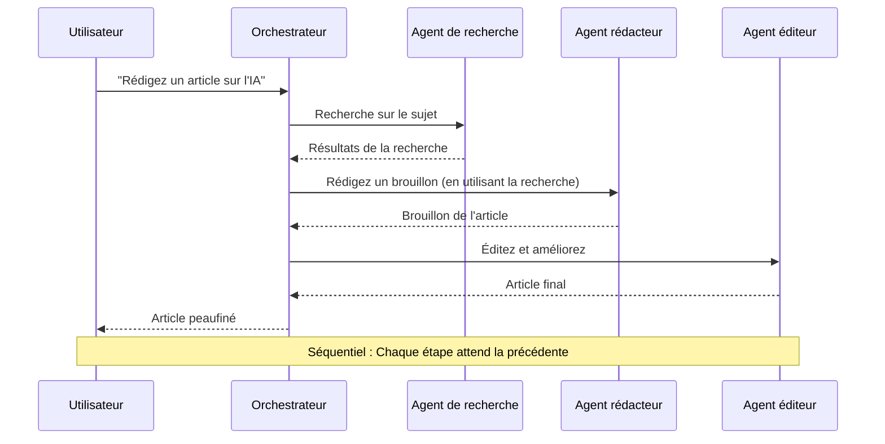
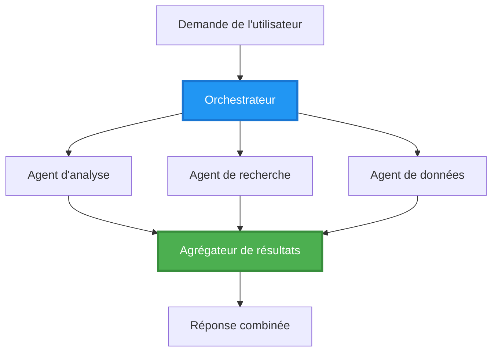
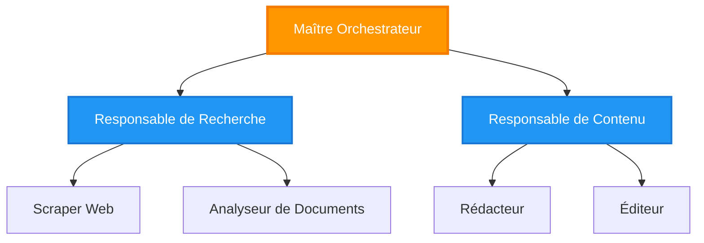
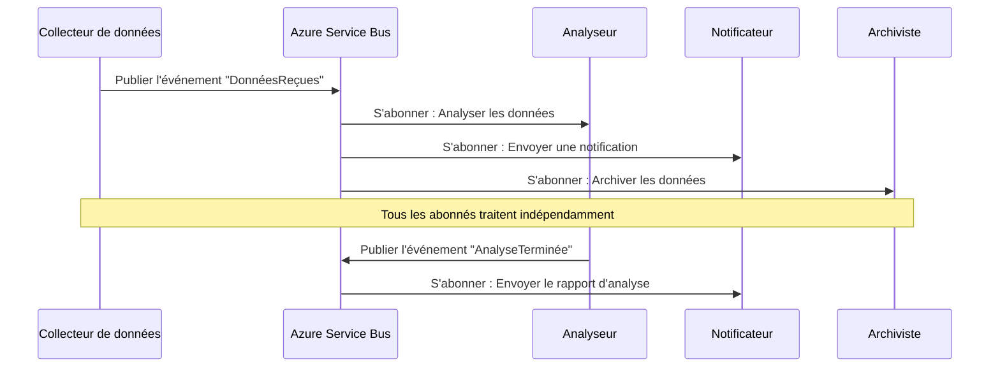
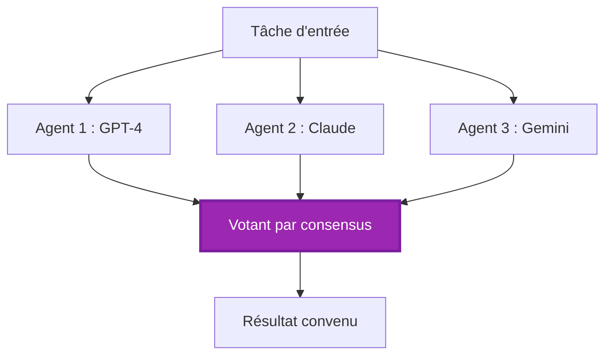
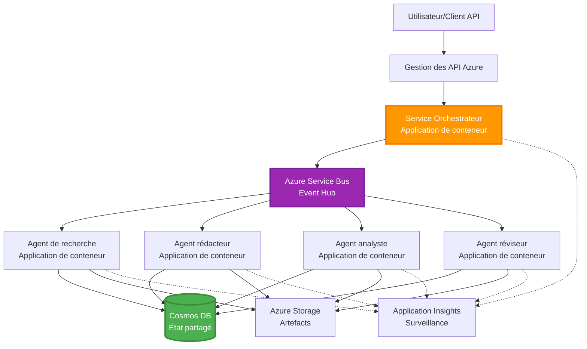

<!--
CO_OP_TRANSLATOR_METADATA:
{
  "original_hash": "bcefbd5d0107691ef3e6e33ba694d6f4",
  "translation_date": "2025-11-19T16:36:33+00:00",
  "source_file": "docs/pre-deployment/coordination-patterns.md",
  "language_code": "fr"
}
-->
# Modèles de coordination multi-agents

⏱️ **Temps estimé** : 60-75 minutes | 💰 **Coût estimé** : ~100-300 $/mois | ⭐ **Complexité** : Avancé

**📚 Parcours d'apprentissage :**
- ← Précédent : [Planification de la capacité](capacity-planning.md) - Stratégies de dimensionnement et de mise à l'échelle des ressources
- 🎯 **Vous êtes ici** : Modèles de coordination multi-agents (Orchestration, communication, gestion des états)
- → Suivant : [Sélection de SKU](sku-selection.md) - Choisir les bons services Azure
- 🏠 [Accueil du cours](../../README.md)

---

## Ce que vous apprendrez

En complétant cette leçon, vous serez capable de :
- Comprendre les **modèles d'architecture multi-agents** et savoir quand les utiliser
- Implémenter des **modèles d'orchestration** (centralisé, décentralisé, hiérarchique)
- Concevoir des stratégies de **communication entre agents** (synchrone, asynchrone, basée sur les événements)
- Gérer l'**état partagé** entre agents distribués
- Déployer des **systèmes multi-agents** sur Azure avec AZD
- Appliquer des **modèles de coordination** à des scénarios d'IA réels
- Surveiller et déboguer des systèmes d'agents distribués

## Pourquoi la coordination multi-agents est importante

### L'évolution : d'un agent unique à un système multi-agents

**Agent unique (simple) :**
```
User → Agent → Response
```
- ✅ Facile à comprendre et à implémenter
- ✅ Rapide pour des tâches simples
- ❌ Limité par les capacités d'un seul modèle
- ❌ Impossible de paralléliser des tâches complexes
- ❌ Pas de spécialisation

**Système multi-agents (avancé) :**
```
           ┌─────────────┐
           │ Orchestrator│
           └──────┬──────┘
        ┌─────────┼─────────┐
        │         │         │
    ┌───▼──┐  ┌──▼───┐  ┌──▼────┐
    │Agent1│  │Agent2│  │Agent3 │
    │(Plan)│  │(Code)│  │(Review)│
    └──────┘  └──────┘  └───────┘
```
- ✅ Agents spécialisés pour des tâches spécifiques
- ✅ Exécution parallèle pour plus de rapidité
- ✅ Modulaire et facile à maintenir
- ✅ Meilleur pour les flux de travail complexes
- ⚠️ Nécessite une logique de coordination

**Analogie** : Un agent unique est comme une personne qui fait toutes les tâches. Un système multi-agents est comme une équipe où chaque membre possède des compétences spécialisées (chercheur, programmeur, relecteur, rédacteur) travaillant ensemble.

---

## Modèles de coordination principaux

### Modèle 1 : Coordination séquentielle (Chaîne de responsabilité)

**Quand l'utiliser** : Les tâches doivent être effectuées dans un ordre spécifique, chaque agent s'appuie sur la sortie précédente.


**Avantages :**
- ✅ Flux de données clair
- ✅ Facile à déboguer
- ✅ Ordre d'exécution prévisible

**Limitations :**
- ❌ Plus lent (pas de parallélisme)
- ❌ Une défaillance bloque toute la chaîne
- ❌ Ne peut pas gérer des tâches interdépendantes

**Exemples d'utilisation :**
- Pipeline de création de contenu (recherche → rédaction → édition → publication)
- Génération de code (planification → implémentation → test → déploiement)
- Génération de rapports (collecte de données → analyse → visualisation → résumé)

---

### Modèle 2 : Coordination parallèle (Fan-Out/Fan-In)

**Quand l'utiliser** : Les tâches indépendantes peuvent être exécutées simultanément, les résultats sont combinés à la fin.


**Avantages :**
- ✅ Rapide (exécution parallèle)
- ✅ Tolérant aux pannes (résultats partiels acceptables)
- ✅ Évolutif horizontalement

**Limitations :**
- ⚠️ Les résultats peuvent arriver dans le désordre
- ⚠️ Nécessite une logique d'agrégation
- ⚠️ Gestion complexe des états

**Exemples d'utilisation :**
- Collecte de données multi-sources (APIs + bases de données + scraping web)
- Analyse concurrentielle (plusieurs modèles génèrent des solutions, la meilleure est sélectionnée)
- Services de traduction (traduire simultanément dans plusieurs langues)

---

### Modèle 3 : Coordination hiérarchique (Manager-Travailleur)

**Quand l'utiliser** : Flux de travail complexes avec sous-tâches, délégation nécessaire.


**Avantages :**
- ✅ Gère des flux de travail complexes
- ✅ Modulaire et facile à maintenir
- ✅ Limites de responsabilité claires

**Limitations :**
- ⚠️ Architecture plus complexe
- ⚠️ Latence plus élevée (plusieurs couches de coordination)
- ⚠️ Nécessite une orchestration sophistiquée

**Exemples d'utilisation :**
- Traitement de documents d'entreprise (classer → acheminer → traiter → archiver)
- Pipelines de données multi-étapes (ingestion → nettoyage → transformation → analyse → rapport)
- Flux de travail d'automatisation complexes (planification → allocation des ressources → exécution → surveillance)

---

### Modèle 4 : Coordination basée sur les événements (Publish-Subscribe)

**Quand l'utiliser** : Les agents doivent réagir à des événements, couplage lâche souhaité.


**Avantages :**
- ✅ Couplage lâche entre agents
- ✅ Facile d'ajouter de nouveaux agents (simplement s'abonner)
- ✅ Traitement asynchrone
- ✅ Résilient (persistance des messages)

**Limitations :**
- ⚠️ Cohérence éventuelle
- ⚠️ Débogage complexe
- ⚠️ Problèmes d'ordre des messages

**Exemples d'utilisation :**
- Systèmes de surveillance en temps réel (alertes, tableaux de bord, journaux)
- Notifications multi-canaux (email, SMS, push, Slack)
- Pipelines de traitement de données (plusieurs consommateurs des mêmes données)

---

### Modèle 5 : Coordination basée sur le consensus (Vote/Quorum)

**Quand l'utiliser** : Accord nécessaire entre plusieurs agents avant de continuer.


**Avantages :**
- ✅ Plus grande précision (opinions multiples)
- ✅ Tolérant aux pannes (échecs minoritaires acceptables)
- ✅ Assurance qualité intégrée

**Limitations :**
- ❌ Coûteux (appels multiples aux modèles)
- ❌ Plus lent (attente de tous les agents)
- ⚠️ Résolution des conflits nécessaire

**Exemples d'utilisation :**
- Modération de contenu (plusieurs modèles examinent le contenu)
- Revue de code (plusieurs analyseurs/linter)
- Diagnostic médical (plusieurs modèles d'IA, validation par des experts)

---

## Aperçu de l'architecture

### Système multi-agents complet sur Azure


**Composants clés :**

| Composant | Objectif | Service Azure |
|-----------|----------|---------------|
| **API Gateway** | Point d'entrée, limitation de débit, authentification | API Management |
| **Orchestrateur** | Coordonne les flux de travail des agents | Container Apps |
| **File de messages** | Communication asynchrone | Service Bus / Event Hubs |
| **Agents** | Travailleurs IA spécialisés | Container Apps / Functions |
| **Stockage d'état** | État partagé, suivi des tâches | Cosmos DB |
| **Stockage d'artefacts** | Documents, résultats, journaux | Blob Storage |
| **Surveillance** | Traces distribuées, journaux | Application Insights |

---

## Prérequis

### Outils requis

```bash
# Vérifier Azure Developer CLI
azd version
# ✅ Attendu : version azd 1.0.0 ou supérieure

# Vérifier Azure CLI
az --version
# ✅ Attendu : azure-cli 2.50.0 ou supérieure

# Vérifier Docker (pour les tests locaux)
docker --version
# ✅ Attendu : version Docker 20.10 ou supérieure
```

### Exigences Azure

- Abonnement Azure actif
- Permissions pour créer :
  - Container Apps
  - Espaces de noms Service Bus
  - Comptes Cosmos DB
  - Comptes de stockage
  - Application Insights

### Connaissances préalables

Vous devriez avoir complété :
- [Gestion de la configuration](../getting-started/configuration.md)
- [Authentification et sécurité](../getting-started/authsecurity.md)
- [Exemple de microservices](../../../../examples/microservices)

---

## Guide d'implémentation

### Structure du projet

```
multi-agent-system/
├── azure.yaml                    # AZD configuration
├── infra/
│   ├── main.bicep               # Main infrastructure
│   ├── core/
│   │   ├── servicebus.bicep     # Message queue
│   │   ├── cosmos.bicep         # State store
│   │   ├── storage.bicep        # Artifact storage
│   │   └── monitoring.bicep     # Application Insights
│   └── app/
│       ├── orchestrator.bicep   # Orchestrator service
│       └── agent.bicep          # Agent template
└── src/
    ├── orchestrator/            # Orchestration logic
    │   ├── app.py
    │   ├── workflows.py
    │   └── Dockerfile
    ├── agents/
    │   ├── research/            # Research agent
    │   ├── writer/              # Writer agent
    │   ├── analyst/             # Analyst agent
    │   └── reviewer/            # Reviewer agent
    └── shared/
        ├── state_manager.py     # Shared state logic
        └── message_handler.py   # Message handling
```

---

## Leçon 1 : Modèle de coordination séquentielle

### Implémentation : Pipeline de création de contenu

Construisons un pipeline séquentiel : Recherche → Rédaction → Édition → Publication

### 1. Configuration AZD

**Fichier : `azure.yaml`**

```yaml
name: content-pipeline
metadata:
  template: multi-agent-sequential@1.0.0

services:
  orchestrator:
    project: ./src/orchestrator
    language: python
    host: containerapp
  
  research-agent:
    project: ./src/agents/research
    language: python
    host: containerapp
  
  writer-agent:
    project: ./src/agents/writer
    language: python
    host: containerapp
  
  editor-agent:
    project: ./src/agents/editor
    language: python
    host: containerapp
```

### 2. Infrastructure : Service Bus pour la coordination

**Fichier : `infra/core/servicebus.bicep`**

```bicep
param name string
param location string
param tags object = {}

resource serviceBusNamespace 'Microsoft.ServiceBus/namespaces@2022-10-01-preview' = {
  name: name
  location: location
  tags: tags
  sku: {
    name: 'Standard'
    tier: 'Standard'
  }
  properties: {
    minimumTlsVersion: '1.2'
  }
}

// Queue for orchestrator → research agent
resource researchQueue 'Microsoft.ServiceBus/namespaces/queues@2022-10-01-preview' = {
  parent: serviceBusNamespace
  name: 'research-tasks'
  properties: {
    maxDeliveryCount: 3
    lockDuration: 'PT5M'
    deadLetteringOnMessageExpiration: true
  }
}

// Queue for research agent → writer agent
resource writerQueue 'Microsoft.ServiceBus/namespaces/queues@2022-10-01-preview' = {
  parent: serviceBusNamespace
  name: 'writer-tasks'
  properties: {
    maxDeliveryCount: 3
    lockDuration: 'PT5M'
  }
}

// Queue for writer agent → editor agent
resource editorQueue 'Microsoft.ServiceBus/namespaces/queues@2022-10-01-preview' = {
  parent: serviceBusNamespace
  name: 'editor-tasks'
  properties: {
    maxDeliveryCount: 3
    lockDuration: 'PT5M'
  }
}

output namespace string = serviceBusNamespace.name
output connectionString string = listKeys('${serviceBusNamespace.id}/AuthorizationRules/RootManageSharedAccessKey', serviceBusNamespace.apiVersion).primaryConnectionString
```

### 3. Gestionnaire d'état partagé

**Fichier : `src/shared/state_manager.py`**

```python
from azure.cosmos import CosmosClient, PartitionKey
from datetime import datetime
import os

class StateManager:
    """Manages shared state across agents using Cosmos DB"""
    
    def __init__(self):
        endpoint = os.environ['COSMOS_ENDPOINT']
        key = os.environ['COSMOS_KEY']
        
        self.client = CosmosClient(endpoint, key)
        self.database = self.client.get_database_client('agent-state')
        self.container = self.database.get_container_client('tasks')
    
    def create_task(self, task_id: str, task_type: str, input_data: dict):
        """Create a new task"""
        task = {
            'id': task_id,
            'type': task_type,
            'status': 'pending',
            'input': input_data,
            'created_at': datetime.utcnow().isoformat(),
            'steps': []
        }
        self.container.create_item(task)
        return task
    
    def update_task_step(self, task_id: str, step_name: str, result: dict):
        """Update task with completed step"""
        task = self.container.read_item(task_id, partition_key=task_id)
        
        task['steps'].append({
            'name': step_name,
            'completed_at': datetime.utcnow().isoformat(),
            'result': result
        })
        
        self.container.replace_item(task_id, task)
        return task
    
    def complete_task(self, task_id: str, final_result: dict):
        """Mark task as complete"""
        task = self.container.read_item(task_id, partition_key=task_id)
        task['status'] = 'completed'
        task['result'] = final_result
        task['completed_at'] = datetime.utcnow().isoformat()
        self.container.replace_item(task_id, task)
        return task
    
    def get_task(self, task_id: str):
        """Retrieve task state"""
        return self.container.read_item(task_id, partition_key=task_id)
```

### 4. Service orchestrateur

**Fichier : `src/orchestrator/app.py`**

```python
from flask import Flask, request, jsonify
from azure.servicebus import ServiceBusClient, ServiceBusMessage
import json
import uuid
import os
from shared.state_manager import StateManager

app = Flask(__name__)
state_manager = StateManager()

# Connexion au Service Bus
servicebus_connection_str = os.environ['SERVICEBUS_CONNECTION_STRING']
servicebus_client = ServiceBusClient.from_connection_string(servicebus_connection_str)

@app.route('/health', methods=['GET'])
def health():
    return jsonify({'status': 'healthy', 'service': 'orchestrator'})

@app.route('/create-content', methods=['POST'])
def create_content():
    """
    Sequential workflow: Research → Write → Edit → Publish
    """
    data = request.json
    topic = data.get('topic')
    
    if not topic:
        return jsonify({'error': 'Topic required'}), 400
    
    # Créer une tâche dans le magasin d'état
    task_id = str(uuid.uuid4())
    task = state_manager.create_task(
        task_id=task_id,
        task_type='content_creation',
        input_data={'topic': topic}
    )
    
    # Envoyer un message à l'agent de recherche (première étape)
    sender = servicebus_client.get_queue_sender('research-tasks')
    message = ServiceBusMessage(
        body=json.dumps({
            'task_id': task_id,
            'topic': topic,
            'next_queue': 'writer-tasks'  # Où envoyer les résultats
        }),
        content_type='application/json'
    )
    
    with sender:
        sender.send_messages(message)
    
    return jsonify({
        'task_id': task_id,
        'status': 'started',
        'workflow': 'sequential',
        'steps': ['research', 'write', 'edit', 'publish'],
        'message': 'Content creation pipeline initiated'
    }), 202

@app.route('/task/<task_id>', methods=['GET'])
def get_task_status(task_id):
    """Check task status"""
    try:
        task = state_manager.get_task(task_id)
        return jsonify(task)
    except Exception as e:
        return jsonify({'error': str(e)}), 404

if __name__ == '__main__':
    app.run(host='0.0.0.0', port=8080)
```

### 5. Agent de recherche

**Fichier : `src/agents/research/app.py`**

```python
from azure.servicebus import ServiceBusClient, ServiceBusMessage
from openai import AzureOpenAI
import json
import os
import time
from shared.state_manager import StateManager

# Initialiser les clients
state_manager = StateManager()
servicebus_client = ServiceBusClient.from_connection_string(
    os.environ['SERVICEBUS_CONNECTION_STRING']
)

openai_client = AzureOpenAI(
    api_key=os.environ['AZURE_OPENAI_API_KEY'],
    api_version="2024-02-01",
    azure_endpoint=os.environ['AZURE_OPENAI_ENDPOINT']
)

def process_research_task(message_data):
    """Process research request and pass to writer"""
    task_id = message_data['task_id']
    topic = message_data['topic']
    next_queue = message_data['next_queue']
    
    print(f"🔬 Researching: {topic}")
    
    # Appeler Azure OpenAI pour la recherche
    response = openai_client.chat.completions.create(
        model="gpt-4",
        messages=[
            {"role": "system", "content": "You are a research assistant. Provide comprehensive research on the given topic."},
            {"role": "user", "content": f"Research this topic thoroughly: {topic}"}
        ],
        max_tokens=1500
    )
    
    research_results = response.choices[0].message.content
    
    # Mettre à jour l'état
    state_manager.update_task_step(
        task_id=task_id,
        step_name='research',
        result={'research': research_results}
    )
    
    # Envoyer au prochain agent (rédacteur)
    sender = servicebus_client.get_queue_sender(next_queue)
    message = ServiceBusMessage(
        body=json.dumps({
            'task_id': task_id,
            'topic': topic,
            'research': research_results,
            'next_queue': 'editor-tasks'
        }),
        content_type='application/json'
    )
    
    with sender:
        sender.send_messages(message)
    
    print(f"✅ Research complete for task {task_id}")

def main():
    """Listen to research queue"""
    receiver = servicebus_client.get_queue_receiver('research-tasks')
    
    print("🔬 Research Agent started, listening for tasks...")
    
    with receiver:
        while True:
            messages = receiver.receive_messages(max_wait_time=5)
            for message in messages:
                try:
                    message_data = json.loads(str(message))
                    process_research_task(message_data)
                    receiver.complete_message(message)
                except Exception as e:
                    print(f"❌ Error processing message: {e}")
                    receiver.abandon_message(message)

if __name__ == '__main__':
    main()
```

### 6. Agent rédacteur

**Fichier : `src/agents/writer/app.py`**

```python
from azure.servicebus import ServiceBusClient, ServiceBusMessage
from openai import AzureOpenAI
import json
import os
from shared.state_manager import StateManager

state_manager = StateManager()
servicebus_client = ServiceBusClient.from_connection_string(
    os.environ['SERVICEBUS_CONNECTION_STRING']
)

openai_client = AzureOpenAI(
    api_key=os.environ['AZURE_OPENAI_API_KEY'],
    api_version="2024-02-01",
    azure_endpoint=os.environ['AZURE_OPENAI_ENDPOINT']
)

def process_writing_task(message_data):
    """Write article based on research"""
    task_id = message_data['task_id']
    topic = message_data['topic']
    research = message_data['research']
    next_queue = message_data['next_queue']
    
    print(f"✍️ Writing article: {topic}")
    
    # Appeler Azure OpenAI pour rédiger un article
    response = openai_client.chat.completions.create(
        model="gpt-4",
        messages=[
            {"role": "system", "content": "You are a professional writer. Write engaging, well-structured articles."},
            {"role": "user", "content": f"Based on this research:\n\n{research}\n\nWrite a comprehensive article about: {topic}"}
        ],
        max_tokens=2000
    )
    
    article_draft = response.choices[0].message.content
    
    # Mettre à jour l'état
    state_manager.update_task_step(
        task_id=task_id,
        step_name='writing',
        result={'draft': article_draft}
    )
    
    # Envoyer à l'éditeur
    sender = servicebus_client.get_queue_sender(next_queue)
    message = ServiceBusMessage(
        body=json.dumps({
            'task_id': task_id,
            'topic': topic,
            'draft': article_draft
        }),
        content_type='application/json'
    )
    
    with sender:
        sender.send_messages(message)
    
    print(f"✅ Article draft complete for task {task_id}")

def main():
    """Listen to writer queue"""
    receiver = servicebus_client.get_queue_receiver('writer-tasks')
    
    print("✍️ Writer Agent started, listening for tasks...")
    
    with receiver:
        while True:
            messages = receiver.receive_messages(max_wait_time=5)
            for message in messages:
                try:
                    message_data = json.loads(str(message))
                    process_writing_task(message_data)
                    receiver.complete_message(message)
                except Exception as e:
                    print(f"❌ Error: {e}")
                    receiver.abandon_message(message)

if __name__ == '__main__':
    main()
```

### 7. Agent éditeur

**Fichier : `src/agents/editor/app.py`**

```python
from azure.servicebus import ServiceBusClient
from openai import AzureOpenAI
import json
import os
from shared.state_manager import StateManager

state_manager = StateManager()
servicebus_client = ServiceBusClient.from_connection_string(
    os.environ['SERVICEBUS_CONNECTION_STRING']
)

openai_client = AzureOpenAI(
    api_key=os.environ['AZURE_OPENAI_API_KEY'],
    api_version="2024-02-01",
    azure_endpoint=os.environ['AZURE_OPENAI_ENDPOINT']
)

def process_editing_task(message_data):
    """Edit and finalize article"""
    task_id = message_data['task_id']
    topic = message_data['topic']
    draft = message_data['draft']
    
    print(f"📝 Editing article: {topic}")
    
    # Appeler Azure OpenAI pour modifier
    response = openai_client.chat.completions.create(
        model="gpt-4",
        messages=[
            {"role": "system", "content": "You are an expert editor. Improve grammar, clarity, and structure."},
            {"role": "user", "content": f"Edit and improve this article:\n\n{draft}"}
        ],
        max_tokens=2000
    )
    
    final_article = response.choices[0].message.content
    
    # Marquer la tâche comme terminée
    state_manager.complete_task(
        task_id=task_id,
        final_result={
            'topic': topic,
            'final_article': final_article,
            'word_count': len(final_article.split())
        }
    )
    
    print(f"✅ Article finalized for task {task_id}")

def main():
    """Listen to editor queue"""
    receiver = servicebus_client.get_queue_receiver('editor-tasks')
    
    print("📝 Editor Agent started, listening for tasks...")
    
    with receiver:
        while True:
            messages = receiver.receive_messages(max_wait_time=5)
            for message in messages:
                try:
                    message_data = json.loads(str(message))
                    process_editing_task(message_data)
                    receiver.complete_message(message)
                except Exception as e:
                    print(f"❌ Error: {e}")
                    receiver.abandon_message(message)

if __name__ == '__main__':
    main()
```

### 8. Déployer et tester

```bash
# Initialiser et déployer
azd init
azd up

# Obtenir l'URL de l'orchestrateur
ORCHESTRATOR_URL=$(azd env get-values | grep ORCHESTRATOR_URL | cut -d '=' -f2 | tr -d '"')

# Créer du contenu
curl -X POST $ORCHESTRATOR_URL/create-content \
  -H "Content-Type: application/json" \
  -d '{"topic": "The Future of AI in Healthcare"}'
```

**✅ Résultat attendu :**
```json
{
  "task_id": "a1b2c3d4-e5f6-7890-abcd-ef1234567890",
  "status": "started",
  "workflow": "sequential",
  "steps": ["research", "write", "edit", "publish"],
  "message": "Content creation pipeline initiated"
}
```

**Vérifiez la progression des tâches :**
```bash
TASK_ID="a1b2c3d4-e5f6-7890-abcd-ef1234567890"
curl $ORCHESTRATOR_URL/task/$TASK_ID
```

**✅ Résultat attendu (terminé) :**
```json
{
  "id": "a1b2c3d4-e5f6-7890-abcd-ef1234567890",
  "type": "content_creation",
  "status": "completed",
  "steps": [
    {
      "name": "research",
      "completed_at": "2025-11-19T10:30:00Z",
      "result": {"research": "..."}
    },
    {
      "name": "writing",
      "completed_at": "2025-11-19T10:32:00Z",
      "result": {"draft": "..."}
    }
  ],
  "result": {
    "topic": "The Future of AI in Healthcare",
    "final_article": "...",
    "word_count": 1500
  }
}
```

---

## Leçon 2 : Modèle de coordination parallèle

### Implémentation : Agrégateur de recherche multi-sources

Construisons un système parallèle qui collecte des informations de plusieurs sources simultanément.

### Orchestrateur parallèle

**Fichier : `src/orchestrator/parallel_workflow.py`**

```python
from flask import Flask, request, jsonify
from azure.servicebus import ServiceBusClient, ServiceBusMessage
import json
import uuid
import os
from shared.state_manager import StateManager

app = Flask(__name__)
state_manager = StateManager()

servicebus_client = ServiceBusClient.from_connection_string(
    os.environ['SERVICEBUS_CONNECTION_STRING']
)

@app.route('/research-parallel', methods=['POST'])
def research_parallel():
    """
    Parallel workflow: Multiple agents work simultaneously
    """
    data = request.json
    query = data.get('query')
    
    task_id = str(uuid.uuid4())
    task = state_manager.create_task(
        task_id=task_id,
        task_type='parallel_research',
        input_data={
            'query': query,
            'agents': ['web', 'academic', 'news', 'social']
        }
    )
    
    # Diffusion : Envoyer à tous les agents simultanément
    agents = [
        ('web-research-queue', 'web'),
        ('academic-research-queue', 'academic'),
        ('news-research-queue', 'news'),
        ('social-research-queue', 'social')
    ]
    
    for queue_name, agent_type in agents:
        sender = servicebus_client.get_queue_sender(queue_name)
        message = ServiceBusMessage(
            body=json.dumps({
                'task_id': task_id,
                'query': query,
                'agent_type': agent_type,
                'result_queue': 'aggregation-queue'
            }),
            content_type='application/json'
        )
        
        with sender:
            sender.send_messages(message)
    
    return jsonify({
        'task_id': task_id,
        'status': 'started',
        'workflow': 'parallel',
        'agents_dispatched': 4,
        'message': 'Parallel research initiated'
    }), 202

if __name__ == '__main__':
    app.run(host='0.0.0.0', port=8080)
```

### Logique d'agrégation

**Fichier : `src/agents/aggregator/app.py`**

```python
from azure.servicebus import ServiceBusClient
import json
import os
from collections import defaultdict
from shared.state_manager import StateManager

state_manager = StateManager()
servicebus_client = ServiceBusClient.from_connection_string(
    os.environ['SERVICEBUS_CONNECTION_STRING']
)

# Suivre les résultats par tâche
task_results = defaultdict(list)
expected_agents = 4  # web, académique, actualités, social

def process_result(message_data):
    """Aggregate results from parallel agents"""
    task_id = message_data['task_id']
    agent_type = message_data['agent_type']
    result = message_data['result']
    
    # Stocker le résultat
    task_results[task_id].append({
        'agent': agent_type,
        'data': result
    })
    
    print(f"📊 Received result from {agent_type} agent ({len(task_results[task_id])}/{expected_agents})")
    
    # Vérifier si tous les agents ont terminé (fan-in)
    if len(task_results[task_id]) == expected_agents:
        print(f"✅ All agents completed for task {task_id}. Aggregating...")
        
        # Combiner les résultats
        aggregated = {
            'query': message_data['query'],
            'sources': task_results[task_id],
            'summary': generate_summary(task_results[task_id])
        }
        
        # Marquer comme terminé
        state_manager.complete_task(task_id, aggregated)
        
        # Nettoyer
        del task_results[task_id]
        
        print(f"✅ Aggregation complete for task {task_id}")

def generate_summary(results):
    """Generate summary from all sources"""
    summaries = [r['data'].get('summary', '') for r in results]
    return '\n\n'.join(summaries)

def main():
    """Listen to aggregation queue"""
    receiver = servicebus_client.get_queue_receiver('aggregation-queue')
    
    print("📊 Aggregator started, listening for results...")
    
    with receiver:
        while True:
            messages = receiver.receive_messages(max_wait_time=5)
            for message in messages:
                try:
                    message_data = json.loads(str(message))
                    process_result(message_data)
                    receiver.complete_message(message)
                except Exception as e:
                    print(f"❌ Error: {e}")
                    receiver.abandon_message(message)

if __name__ == '__main__':
    main()
```

**Avantages du modèle parallèle :**
- ⚡ **4x plus rapide** (les agents fonctionnent simultanément)
- 🔄 **Tolérant aux pannes** (résultats partiels acceptables)
- 📈 **Évolutif** (ajouter facilement plus d'agents)

---

## Exercices pratiques

### Exercice 1 : Ajouter une gestion des délais ⭐⭐ (Moyen)

**Objectif** : Implémenter une logique de délai pour que l'agrégateur ne reste pas bloqué indéfiniment à cause d'agents lents.

**Étapes** :

1. **Ajoutez le suivi des délais à l'agrégateur :**

```python
from datetime import datetime, timedelta

task_timeouts = {}  # task_id -> temps d'expiration

def process_result(message_data):
    task_id = message_data['task_id']
    
    # Définir un délai d'attente sur le premier résultat
    if task_id not in task_timeouts:
        task_timeouts[task_id] = datetime.utcnow() + timedelta(seconds=30)
    
    task_results[task_id].append({
        'agent': message_data['agent_type'],
        'data': message_data['result']
    })
    
    # Vérifier si terminé OU expiré
    if len(task_results[task_id]) == expected_agents or \
       datetime.utcnow() > task_timeouts[task_id]:
        
        print(f"📊 Aggregating with {len(task_results[task_id])}/{expected_agents} results")
        
        aggregated = {
            'query': message_data['query'],
            'sources': task_results[task_id],
            'completed_agents': len(task_results[task_id]),
            'timed_out': len(task_results[task_id]) < expected_agents
        }
        
        state_manager.complete_task(task_id, aggregated)
        
        # Nettoyage
        del task_results[task_id]
        del task_timeouts[task_id]
```

2. **Testez avec des retards artificiels :**

```python
# Dans un agent, ajoutez un délai pour simuler un traitement lent
import time
time.sleep(35)  # Dépasse le délai d'attente de 30 secondes
```

3. **Déployez et vérifiez :**

```bash
azd deploy aggregator

# Soumettre la tâche
curl -X POST $ORCHESTRATOR_URL/research-parallel \
  -H "Content-Type: application/json" \
  -d '{"query": "AI safety research"}'

# Vérifier les résultats après 30 secondes
curl $ORCHESTRATOR_URL/task/$TASK_ID
```

**✅ Critères de réussite :**
- ✅ La tâche se termine après 30 secondes même si certains agents ne sont pas terminés
- ✅ La réponse indique des résultats partiels (`"timed_out": true`)
- ✅ Les résultats disponibles sont retournés (3 sur 4 agents)

**Temps** : 20-25 minutes

---

### Exercice 2 : Implémenter une logique de reprise ⭐⭐⭐ (Avancé)

**Objectif** : Réessayer automatiquement les tâches des agents échouées avant d'abandonner.

**Étapes** :

1. **Ajoutez le suivi des reprises à l'orchestrateur :**

```python
from dataclasses import dataclass
from typing import Dict

@dataclass
class RetryConfig:
    max_retries: int = 3
    backoff_seconds: int = 5

retry_counts: Dict[str, int] = {}  # message_id -> nombre_de_tentatives

def send_with_retry(queue_name: str, message_data: dict, retry_config: RetryConfig):
    """Send message with retry metadata"""
    message_id = message_data.get('message_id', str(uuid.uuid4()))
    message_data['message_id'] = message_id
    message_data['retry_count'] = retry_counts.get(message_id, 0)
    message_data['max_retries'] = retry_config.max_retries
    
    sender = servicebus_client.get_queue_sender(queue_name)
    message = ServiceBusMessage(
        body=json.dumps(message_data),
        content_type='application/json',
        message_id=message_id
    )
    
    with sender:
        sender.send_messages(message)
```

2. **Ajoutez un gestionnaire de reprise aux agents :**

```python
def process_with_retry(message, receiver, process_func):
    """Process message with automatic retry on failure"""
    try:
        message_data = json.loads(str(message))
        
        # Traiter le message
        process_func(message_data)
        
        # Succès - terminé
        receiver.complete_message(message)
        
    except Exception as e:
        message_id = message.message_id
        retry_count = message_data.get('retry_count', 0)
        max_retries = message_data.get('max_retries', 3)
        
        if retry_count < max_retries:
            # Réessayer : abandonner et remettre en file d'attente avec un compte incrémenté
            print(f"⚠️ Retry {retry_count + 1}/{max_retries} for message {message_id}")
            
            message_data['retry_count'] = retry_count + 1
            
            # Renvoyer dans la même file avec un délai
            time.sleep(5 * (retry_count + 1))  # Recul exponentiel
            send_with_retry(queue_name, message_data, RetryConfig())
            
            receiver.complete_message(message)  # Supprimer l'original
        else:
            # Nombre maximal de tentatives dépassé - déplacer vers la file des lettres mortes
            print(f"❌ Max retries exceeded for message {message_id}")
            receiver.dead_letter_message(
                message,
                reason="MaxRetriesExceeded",
                error_description=str(e)
            )
```

3. **Surveillez la file d'attente des messages morts :**

```python
def monitor_dead_letters():
    """Check dead letter queue for failed messages"""
    receiver = servicebus_client.get_queue_receiver(
        'research-queue',
        sub_queue='deadletter'
    )
    
    with receiver:
        messages = receiver.receive_messages(max_wait_time=5)
        for message in messages:
            print(f"☠️ Dead letter: {message.message_id}")
            print(f"Reason: {message.dead_letter_reason}")
            print(f"Description: {message.dead_letter_error_description}")
```

**✅ Critères de réussite :**
- ✅ Les tâches échouées sont automatiquement réessayées (jusqu'à 3 fois)
- ✅ Retard exponentiel entre les reprises (5s, 10s, 15s)
- ✅ Après le nombre maximal de reprises, les messages vont dans la file d'attente des messages morts
- ✅ La file d'attente des messages morts peut être surveillée et rejouée

**Temps** : 30-40 minutes

---

### Exercice 3 : Implémenter un disjoncteur ⭐⭐⭐ (Avancé)

**Objectif** : Empêcher les défaillances en cascade en arrêtant les requêtes vers les agents défaillants.

**Étapes** :

1. **Créez une classe de disjoncteur :**

```python
from enum import Enum
from datetime import datetime, timedelta

class CircuitState(Enum):
    CLOSED = "closed"      # Fonctionnement normal
    OPEN = "open"          # Échec, rejeter les demandes
    HALF_OPEN = "half_open"  # Test si récupéré

class CircuitBreaker:
    def __init__(self, failure_threshold=5, timeout_seconds=60):
        self.failure_threshold = failure_threshold
        self.timeout_seconds = timeout_seconds
        self.failure_count = 0
        self.last_failure_time = None
        self.state = CircuitState.CLOSED
    
    def call(self, func):
        """Execute function with circuit breaker protection"""
        if self.state == CircuitState.OPEN:
            # Vérifier si le délai est expiré
            if datetime.utcnow() - self.last_failure_time > timedelta(seconds=self.timeout_seconds):
                self.state = CircuitState.HALF_OPEN
                print("🔄 Circuit breaker: HALF_OPEN (testing)")
            else:
                raise Exception(f"Circuit breaker OPEN for agent. Try again in {self.timeout_seconds}s")
        
        try:
            result = func()
            
            # Succès
            if self.state == CircuitState.HALF_OPEN:
                self.state = CircuitState.CLOSED
                self.failure_count = 0
                print("✅ Circuit breaker: CLOSED (recovered)")
            
            return result
            
        except Exception as e:
            self.failure_count += 1
            self.last_failure_time = datetime.utcnow()
            
            if self.failure_count >= self.failure_threshold:
                self.state = CircuitState.OPEN
                print(f"🔴 Circuit breaker: OPEN (too many failures)")
            
            raise e
```

2. **Appliquez-la aux appels des agents :**

```python
# Dans l'orchestrateur
agent_circuits = {
    'web': CircuitBreaker(failure_threshold=5, timeout_seconds=60),
    'academic': CircuitBreaker(failure_threshold=5, timeout_seconds=60),
    'news': CircuitBreaker(failure_threshold=5, timeout_seconds=60),
    'social': CircuitBreaker(failure_threshold=5, timeout_seconds=60)
}

def send_to_agent(agent_type, message_data):
    """Send with circuit breaker protection"""
    circuit = agent_circuits[agent_type]
    
    try:
        circuit.call(lambda: send_message(agent_type, message_data))
    except Exception as e:
        print(f"⚠️ Skipping {agent_type} agent: {e}")
        # Continuer avec d'autres agents
```

3. **Testez le disjoncteur :**

```bash
# Simuler des échecs répétés (arrêter un agent)
az containerapp stop --name web-research-agent --resource-group rg-agents

# Envoyer plusieurs requêtes
for i in {1..10}; do
  curl -X POST $ORCHESTRATOR_URL/research-parallel \
    -H "Content-Type: application/json" \
    -d '{"query": "test query '$i'"}'
  sleep 2
done

# Vérifier les journaux - devrait voir le circuit ouvert après 5 échecs
azd logs orchestrator --tail 50
```

**✅ Critères de réussite :**
- ✅ Après 5 échecs, le disjoncteur s'ouvre (rejette les requêtes)
- ✅ Après 60 secondes, le disjoncteur passe en semi-ouvert (teste la récupération)
- ✅ Les autres agents continuent de fonctionner normalement
- ✅ Le disjoncteur se ferme automatiquement lorsque l'agent se rétablit

**Temps** : 40-50 minutes

---

## Surveillance et débogage

### Traces distribuées avec Application Insights

**Fichier : `src/shared/tracing.py`**

```python
from opencensus.ext.azure.log_exporter import AzureLogHandler
from opencensus.ext.azure.trace_exporter import AzureExporter
from opencensus.trace import config_integration
from opencensus.trace.tracer import Tracer
from opencensus.trace.samplers import AlwaysOnSampler
import logging
import os

# Configurer la traçabilité
config_integration.trace_integrations(['requests', 'logging'])

connection_string = os.environ.get('APPLICATIONINSIGHTS_CONNECTION_STRING')

# Créer un traceur
tracer = Tracer(
    exporter=AzureExporter(connection_string=connection_string),
    sampler=AlwaysOnSampler()
)

# Configurer la journalisation
logger = logging.getLogger(__name__)
logger.addHandler(AzureLogHandler(connection_string=connection_string))
logger.setLevel(logging.INFO)

def trace_agent_call(agent_name, task_id, operation):
    """Trace agent operations"""
    with tracer.span(name=f'{agent_name}.{operation}') as span:
        span.add_attribute('agent', agent_name)
        span.add_attribute('task_id', task_id)
        span.add_attribute('operation', operation)
        
        try:
            result = operation()
            span.add_attribute('status', 'success')
            return result
        except Exception as e:
            span.add_attribute('status', 'error')
            span.add_attribute('error', str(e))
            raise
```

### Requêtes Application Insights

**Suivre les flux de travail multi-agents :**

```kusto
// Trace complete workflow for a task
traces
| where customDimensions.task_id == "a1b2c3d4-..."
| project timestamp, message, customDimensions.agent, customDimensions.operation
| order by timestamp asc
```

**Comparaison des performances des agents :**

```kusto
// Compare agent execution times
dependencies
| where name contains "agent"
| summarize 
    avg_duration = avg(duration),
    p95_duration = percentile(duration, 95),
    count = count()
  by agent = tostring(customDimensions.agent)
| order by avg_duration desc
```

**Analyse des échecs :**

```kusto
// Find which agents fail most
exceptions
| where customDimensions.agent != ""
| summarize 
    failure_count = count(),
    unique_errors = dcount(outerMessage)
  by agent = tostring(customDimensions.agent)
| order by failure_count desc
```

---

## Analyse des coûts

### Coûts des systèmes multi-agents (estimations mensuelles)

| Composant | Configuration | Coût |
|-----------|---------------|------|
| **Orchestrateur** | 1 Container App (1 vCPU, 2GB) | 30-50 $ |
| **4 Agents** | 4 Container Apps (0.5 vCPU, 1GB chacun) | 60-120 $ |
| **Service Bus** | Niveau standard, 10M messages | 10-20 $ |
| **Cosmos DB** | Serverless, 5GB de stockage, 1M RUs | 25-50 $ |
| **Blob Storage** | 10GB de stockage, 100K opérations | 5-10 $ |
| **Application Insights** | 5GB d'ingestion | 10-15 $ |
| **Azure OpenAI** | GPT-4, 10M tokens | 100-300 $ |
| **Total** | | **240-565 $/mois** |

### Stratégies d'optimisation des coûts

1. **Utilisez le serverless autant que possible :**
   ```bicep
   // Cosmos DB serverless (no minimum cost)
   properties: {
     databaseAccountOfferType: 'Standard'
     capabilities: [{ name: 'EnableServerless' }]
   }
   ```

2. **Réduisez les agents à zéro lorsqu'ils sont inactifs :**
   ```bicep
   scale: {
     minReplicas: 0  // Scale to zero when no messages
     maxReplicas: 10
   }
   ```

3. **Utilisez le regroupement pour Service Bus :**
   ```python
   # Envoyer des messages par lots (moins cher)
   sender.send_messages([message1, message2, message3])
   ```

4. **Mettez en cache les résultats fréquemment utilisés :**
   ```python
   # Utiliser Azure Cache pour Redis
   if cache.exists(query_hash):
       return cache.get(query_hash)
   ```

---

## Bonnes pratiques

### ✅ À FAIRE :

1. **Utilisez des opérations idempotentes**
   ```python
   # L'agent peut traiter en toute sécurité le même message plusieurs fois
   def process_task(task_id):
       if state_manager.task_exists(task_id):
           print(f"Task {task_id} already processed, skipping")
           return
       # Traiter la tâche...
   ```

2. **Implémentez une journalisation complète**
   ```python
   logger.info(f"Agent: {agent_name}, Task: {task_id}, Action: {action}")
   ```

3. **Utilisez des IDs de corrélation**
   ```python
   # Transmettre task_id à travers tout le flux de travail
   message_data = {
       'task_id': task_id,  # ID de corrélation
       'timestamp': datetime.utcnow().isoformat()
   }
   ```

4. **Définissez une durée de vie des messages (TTL)**
   ```bicep
   properties: {
     defaultMessageTimeToLive: 'PT1H'  // 1 hour max
   }
   ```

5. **Surveillez les files d'attente des messages morts**
   ```python
   # Surveillance régulière des messages échoués
   monitor_dead_letters()
   ```

### ❌ À NE PAS FAIRE :

1. **Ne créez pas de dépendances circulaires**
   ```python
   # ❌ MAUVAIS : Agent A → Agent B → Agent A (boucle infinie)
   # ✅ BON : Définir un graphe orienté acyclique clair (DAG)
   ```

2. **Ne bloquez pas les threads des agents**
   ```python
   # ❌ MAUVAIS : Attente synchrone
   while not task_complete:
       time.sleep(1)
   
   # ✅ BON : Utiliser les rappels de la file de messages
   ```

3. **Ne négligez pas les échecs partiels**
   ```python
   # ❌ MAUVAIS : Échouer tout le processus si un agent échoue
   # ✅ BON : Retourner des résultats partiels avec des indicateurs d'erreur
   ```

4. **N'utilisez pas de reprises infinies**
   ```python
   # ❌ MAUVAIS : réessayer indéfiniment
   # ✅ BON : max_retries = 3, puis lettre morte
   ```

---
## Guide de dépannage

### Problème : Messages bloqués dans la file d'attente

**Symptômes :**
- Les messages s'accumulent dans la file d'attente
- Les agents ne traitent pas
- Le statut de la tâche reste à "en attente"

**Diagnostic :**
```bash
# Vérifier la profondeur de la file d'attente
az servicebus queue show \
  --namespace-name mybus \
  --name research-tasks \
  --query "countDetails"

# Vérifier la santé de l'agent
azd logs research-agent --tail 50
```

**Solutions :**

1. **Augmenter le nombre de réplicas d'agents :**
   ```bash
   az containerapp update \
     --name research-agent \
     --min-replicas 3 \
     --max-replicas 10
   ```

2. **Vérifier la file d'attente des lettres mortes :**
   ```bash
   az servicebus queue show \
     --namespace-name mybus \
     --name research-tasks \
     --query "countDetails.deadLetterMessageCount"
   ```

---

### Problème : Expiration de la tâche / ne se termine jamais

**Symptômes :**
- Le statut de la tâche reste "en cours"
- Certains agents terminent, d'autres non
- Aucun message d'erreur

**Diagnostic :**
```bash
# Vérifier l'état de la tâche
curl $ORCHESTRATOR_URL/task/$TASK_ID

# Vérifier Application Insights
# Exécuter la requête : traces | where customDimensions.task_id == "..."
```

**Solutions :**

1. **Implémenter un délai d'expiration dans l'agrégateur (Exercice 1)**

2. **Vérifier les échecs des agents :**
   ```bash
   azd logs --follow | grep "ERROR\|FAIL"
   ```

3. **S'assurer que tous les agents fonctionnent :**
   ```bash
   az containerapp list \
     --resource-group rg-agents \
     --query "[].{name:name, status:properties.runningStatus}"
   ```

---

## En savoir plus

### Documentation officielle
- [Azure Service Bus](https://learn.microsoft.com/azure/service-bus-messaging/service-bus-messaging-overview)
- [Cosmos DB](https://learn.microsoft.com/azure/cosmos-db/introduction)
- [Container Apps DAPR](https://learn.microsoft.com/azure/container-apps/dapr-overview)
- [Modèles de conception multi-agents](https://learn.microsoft.com/azure/architecture/guide/ai/multi-agent-systems)

### Prochaines étapes dans ce cours
- ← Précédent : [Planification de capacité](capacity-planning.md)
- → Suivant : [Sélection de SKU](sku-selection.md)
- 🏠 [Accueil du cours](../../README.md)

### Exemples associés
- [Exemple de microservices](../../../../examples/microservices) - Modèles de communication entre services
- [Exemple Azure OpenAI](../../../../examples/azure-openai-chat) - Intégration de l'IA

---

## Résumé

**Vous avez appris :**
- ✅ Cinq modèles de coordination (séquentiel, parallèle, hiérarchique, événementiel, consensus)
- ✅ Architecture multi-agents sur Azure (Service Bus, Cosmos DB, Container Apps)
- ✅ Gestion des états entre agents distribués
- ✅ Gestion des délais d'expiration, des reprises et des disjoncteurs
- ✅ Surveillance et débogage des systèmes distribués
- ✅ Stratégies d'optimisation des coûts

**Points clés :**
1. **Choisir le bon modèle** - Séquentiel pour les workflows ordonnés, parallèle pour la rapidité, événementiel pour la flexibilité
2. **Gérer l'état avec soin** - Utiliser Cosmos DB ou équivalent pour un état partagé
3. **Gérer les échecs avec précaution** - Délais d'expiration, reprises, disjoncteurs, files d'attente des lettres mortes
4. **Surveiller tout** - La traçabilité distribuée est essentielle pour le débogage
5. **Optimiser les coûts** - Échelle à zéro, utilisation du serverless, mise en cache

**Prochaines étapes :**
1. Terminer les exercices pratiques
2. Construire un système multi-agents adapté à votre cas d'utilisation
3. Étudier [Sélection de SKU](sku-selection.md) pour optimiser les performances et les coûts

---

<!-- CO-OP TRANSLATOR DISCLAIMER START -->
**Avertissement** :  
Ce document a été traduit à l'aide du service de traduction automatique [Co-op Translator](https://github.com/Azure/co-op-translator). Bien que nous nous efforcions d'assurer l'exactitude, veuillez noter que les traductions automatisées peuvent contenir des erreurs ou des inexactitudes. Le document original dans sa langue d'origine doit être considéré comme la source faisant autorité. Pour des informations critiques, il est recommandé de recourir à une traduction humaine professionnelle. Nous ne sommes pas responsables des malentendus ou des interprétations erronées résultant de l'utilisation de cette traduction.
<!-- CO-OP TRANSLATOR DISCLAIMER END -->